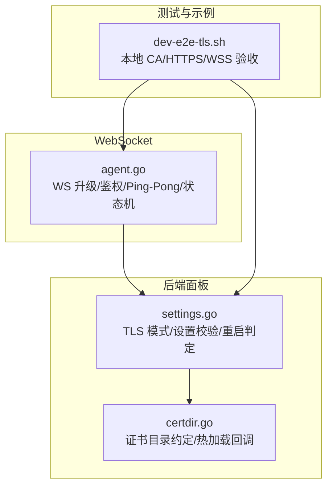
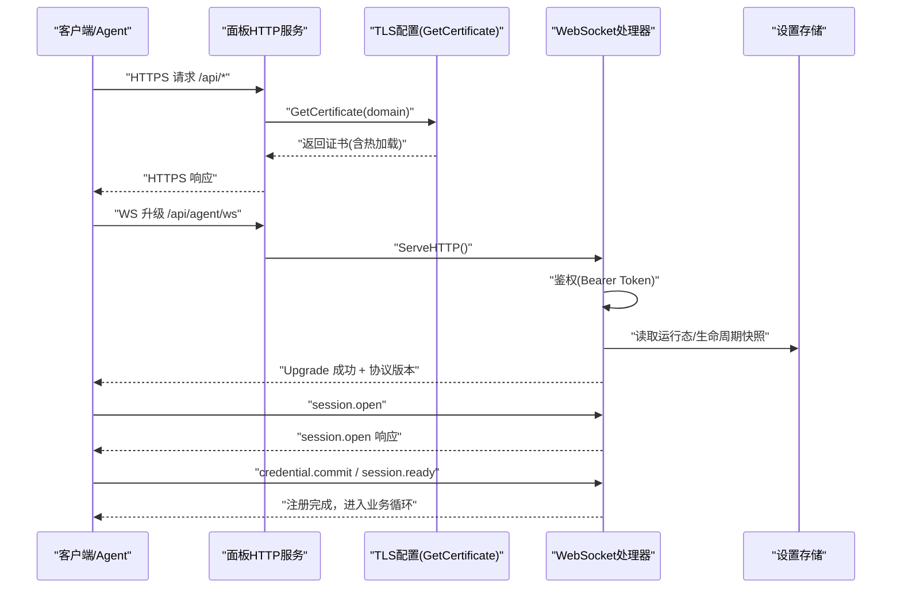
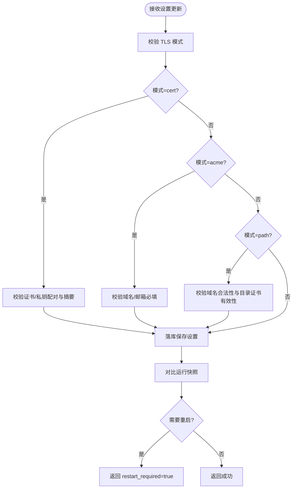
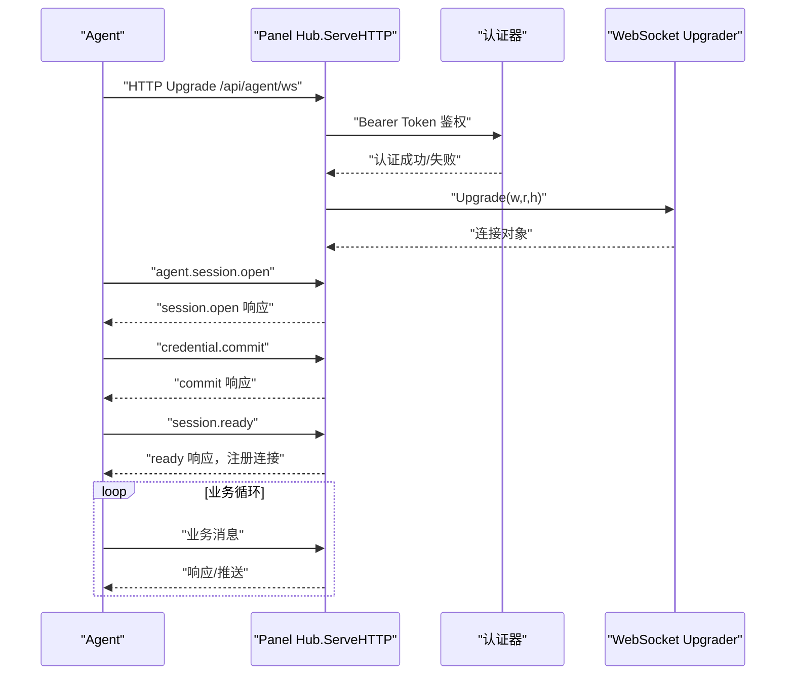
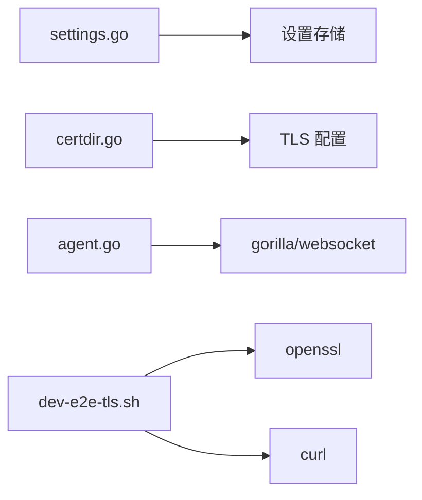

# 传输安全

<cite>
**本文引用的文件**   
- [settings.go](file://src/backend/internal/panel/settings.go)
- [certdir.go](file://src/backend/internal/panel/certdir.go)
- [agent.go](file://src/backend/internal/ws/agent.go)
- [dev-e2e-tls.sh](file://scripts/dev-e2e-tls.sh)
</cite>

## 目录
1. [简介](#简介)
2. [项目结构](#项目结构)
3. [核心组件](#核心组件)
4. [架构总览](#架构总览)
5. [详细组件分析](#详细组件分析)
6. [依赖关系分析](#依赖关系分析)
7. [性能考量](#性能考量)
8. [故障排查指南](#故障排查指南)
9. [结论](#结论)
10. [附录：部署与最佳实践](#附录部署与最佳实践)

## 简介
本文件面向 Lattix-codex 项目的传输安全，聚焦于 TLS 加密、证书管理、ACME 自动续期、HTTPS 强制策略、WebSocket（WSS）安全连接、反向代理集成、客户端证书与双向 TLS 支持，以及常见部署场景与排障要点。文档基于仓库内后端面板的 TLS 配置、证书热加载实现与 WebSocket 握手流程进行说明，并给出可操作的部署建议与最佳实践。

## 项目结构
与传输安全直接相关的代码集中在后端面板模块与 WebSocket 模块中：
- 面板设置与 TLS 模式：settings.go
- 域名路径模式的证书目录与热加载：certdir.go
- WebSocket 握手与安全头处理：agent.go
- 端到端 TLS/WSS 验收脚本：dev-e2e-tls.sh



**图表来源** 
- [settings.go:26-32](file://src/backend/internal/panel/settings.go#L26-L32)
- [certdir.go:14-20](file://src/backend/internal/panel/certdir.go#L14-L20)
- [agent.go:19-28](file://src/backend/internal/ws/agent.go#L19-L28)
- [dev-e2e-tls.sh:28-36](file://scripts/dev-e2e-tls.sh#L28-L36)

**章节来源**
- [settings.go:26-32](file://src/backend/internal/panel/settings.go#L26-L32)
- [certdir.go:14-20](file://src/backend/internal/panel/certdir.go#L14-L20)
- [agent.go:19-28](file://src/backend/internal/ws/agent.go#L19-L28)
- [dev-e2e-tls.sh:28-36](file://scripts/dev-e2e-tls.sh#L28-L36)

## 核心组件
- TLS 监听模式与设置
  - 支持 off、cert、acme、path 四种模式；保存后需重启生效（除 path 模式外）。
  - 提供证书摘要展示、密钥置位标记、重启需求判断等能力。
- 证书目录与热加载
  - 遵循 certbot 风格：<tls-dir>/<域名>/fullchain.pem 与 privkey.pem。
  - 通过 GetCertificate 回调按 mtime 缓存，外部 ACME 续期替换后下一次握手即热加载。
- WebSocket 安全连接
  - 使用 gorilla/websocket 进行 HTTP Upgrade；鉴权通过 Authorization: Bearer 令牌。
  - 支持 Ping-Pong 保活与读超时续期；回环反代时从 X-Forwarded-For 学习真实 IP。
- 端到端验证
  - 脚本演示本地 CA 签发、HTTPS 面板、WSS 首连、Secure Cookie、X-Forwarded-Proto 推断等。

**章节来源**
- [settings.go:26-32](file://src/backend/internal/panel/settings.go#L26-L32)
- [settings.go:174-194](file://src/backend/internal/panel/settings.go#L174-L194)
- [certdir.go:48-95](file://src/backend/internal/panel/certdir.go#L48-L95)
- [agent.go:32-77](file://src/backend/internal/ws/agent.go#L32-L77)
- [dev-e2e-tls.sh:53-66](file://scripts/dev-e2e-tls.sh#L53-L66)

## 架构总览
下图展示了 HTTPS 与 WSS 在面板中的关键交互路径，包括证书热加载与 WS 握手流程。



**图表来源** 
- [settings.go:26-32](file://src/backend/internal/panel/settings.go#L26-L32)
- [certdir.go:48-95](file://src/backend/internal/panel/certdir.go#L48-L95)
- [agent.go:32-77](file://src/backend/internal/ws/agent.go#L32-L77)

## 详细组件分析

### TLS 模式与设置接口
- 支持的 TLS 模式
  - off：关闭 TLS
  - cert：内置 PEM 证书与私钥
  - acme：ACME 自动申请（由外部脚本或集成负责）
  - path：域名路径模式，按目录约定存放证书，支持热加载
- 设置项与校验
  - 保存 tls_mode、tls_cert_pem、tls_key_pem、tls_domain、acme_domain、acme_email 等。
  - 对 PublicURL、告警 Webhook 地址等进行格式校验。
  - 对证书/私钥进行配对校验与解析摘要。
- 重启需求判定
  - 比较“待生效设置”与“当前运行快照”，若不一致则提示重启。



**图表来源** 
- [settings.go:322-388](file://src/backend/internal/panel/settings.go#L322-L388)
- [settings.go:174-194](file://src/backend/internal/panel/settings.go#L174-L194)

**章节来源**
- [settings.go:26-32](file://src/backend/internal/panel/settings.go#L26-L32)
- [settings.go:322-388](file://src/backend/internal/panel/settings.go#L322-L388)
- [settings.go:174-194](file://src/backend/internal/panel/settings.go#L174-L194)

### 证书目录与热加载机制
- 目录约定
  - fullchain.pem：证书链文件
  - privkey.pem：私钥文件
  - 路径：<tls-dir>/<域名>/fullchain.pem|privkey.pem
- 热加载实现
  - NewDirCertGetter 返回 GetCertificate 回调，按文件 mtime 缓存证书。
  - 外部 ACME 续期替换文件后，下一次握手即加载新证书，无需重启。
  - 加载失败时回退已缓存证书，保证握手不中断。

```mermaid
classDiagram
class DirCertGetter {
+NewDirCertGetter(dir, domain) func(*tls.ClientHelloInfo)(*tls.Certificate,error)
-state struct{cert,t modTime}
-mu sync.Mutex
}
class TLSConfig {
+GetCertificate callback
}
DirCertGetter --> TLSConfig : "作为回调"
```

**图表来源** 
- [certdir.go:14-20](file://src/backend/internal/panel/certdir.go#L14-L20)
- [certdir.go:48-95](file://src/backend/internal/panel/certdir.go#L48-L95)

**章节来源**
- [certdir.go:14-20](file://src/backend/internal/panel/certdir.go#L14-L20)
- [certdir.go:48-95](file://src/backend/internal/panel/certdir.go#L48-L95)

### WebSocket 安全连接（WSS）
- 升级与鉴权
  - 使用 gorilla/websocket 进行 HTTP Upgrade。
  - 鉴权通过 Authorization: Bearer 令牌，失败返回结构化错误。
- 会话建立
  - 首个帧必须为 agent.session.open，随后 credential.commit 与 session.ready。
  - 成功后注册连接，进入业务消息循环。
- 保活与超时
  - Agent 主动发送 Ping，Panel 原样 Pong，并以收到的控制帧续期读超时。
- 客户端 IP 学习
  - 直连取 RemoteAddr host；受信回环代理取 XFF 首个 IP；非回环不信任 XFF。



**图表来源** 
- [agent.go:32-77](file://src/backend/internal/ws/agent.go#L32-L77)
- [agent.go:100-127](file://src/backend/internal/ws/agent.go#L100-L127)
- [agent.go:156-195](file://src/backend/internal/ws/agent.go#L156-L195)
- [agent.go:335-348](file://src/backend/internal/ws/agent.go#L335-L348)

**章节来源**
- [agent.go:32-77](file://src/backend/internal/ws/agent.go#L32-L77)
- [agent.go:100-127](file://src/backend/internal/ws/agent.go#L100-L127)
- [agent.go:156-195](file://src/backend/internal/ws/agent.go#L156-L195)
- [agent.go:335-348](file://src/backend/internal/ws/agent.go#L335-L348)

### 端到端 TLS/WSS 验收
- 本地 CA 签发服务器证书，启动 HTTPS 面板。
- Agent 以 SSL_CERT_FILE 信任该 CA，经 wss 首连成功。
- 登录 Cookie 带 Secure 标记；HTTP 面板通过 X-Forwarded-Proto 推断 https。
- 订阅资源可通过 HTTPS 获取。

**章节来源**
- [dev-e2e-tls.sh:28-36](file://scripts/dev-e2e-tls.sh#L28-L36)
- [dev-e2e-tls.sh:53-66](file://scripts/dev-e2e-tls.sh#L53-L66)
- [dev-e2e-tls.sh:68-73](file://scripts/dev-e2e-tls.sh#L68-L73)
- [dev-e2e-tls.sh:98-109](file://scripts/dev-e2e-tls.sh#L98-L109)

## 依赖关系分析
- settings.go 依赖 panel 设置存储与共享类型，用于校验与持久化 TLS 相关设置。
- certdir.go 提供证书目录访问与热加载回调，被 TLS 配置使用。
- agent.go 依赖 gorilla/websocket 与共享消息类型，实现 WS 握手与业务循环。
- dev-e2e-tls.sh 依赖 openssl、curl、python3 等工具进行端到端验证。



**图表来源** 
- [settings.go:1-24](file://src/backend/internal/panel/settings.go#L1-L24)
- [certdir.go:1-12](file://src/backend/internal/panel/certdir.go#L1-L12)
- [agent.go:1-17](file://src/backend/internal/ws/agent.go#L1-L17)
- [dev-e2e-tls.sh:1-6](file://scripts/dev-e2e-tls.sh#L1-L6)

**章节来源**
- [settings.go:1-24](file://src/backend/internal/panel/settings.go#L1-L24)
- [certdir.go:1-12](file://src/backend/internal/panel/certdir.go#L1-L12)
- [agent.go:1-17](file://src/backend/internal/ws/agent.go#L1-L17)
- [dev-e2e-tls.sh:1-6](file://scripts/dev-e2e-tls.sh#L1-L6)

## 性能考量
- 证书热加载避免重启：path 模式下按 mtime 缓存，减少 I/O 与握手失败风险。
- WS 保活机制：Ping-Pong 与读超时续期降低空闲连接占用与误判断开。
- 设置校验前置：在保存前进行证书配对与域名合法性校验，减少无效配置写入。

[本节为通用指导，不直接分析具体文件]

## 故障排查指南
- 证书/私钥校验失败
  - 现象：保存设置时报错“证书/私钥校验失败”。
  - 排查：确认 PEM 内容完整、配对一致；检查 path 模式下目录文件是否存在且可读。
  - 参考：settings.go 中对证书/私钥的校验逻辑。
- 域名路径模式证书不可用
  - 现象：保存时报错“证书目录内无可用证书”。
  - 排查：确认 <tls-dir>/<域名>/fullchain.pem 与 privkey.pem 存在且有效；确保外部 ACME 续期完成后覆盖文件。
  - 参考：certdir.go 的目录约定与 ValidTLSDomain 校验。
- WS 握手失败
  - 现象：首次连接报“authentication failed”或服务不可用。
  - 排查：检查 Authorization 头是否携带正确 Bearer Token；确认面板未处于重启/故障状态。
  - 参考：agent.go 的鉴权与状态检查。
- 客户端 IP 不正确
  - 现象：日志显示 IP 为回环地址。
  - 排查：确认前置反代仅允许本机回环转发；检查 X-Forwarded-For 头部是否正确设置。
  - 参考：agent.go 的 clientIP 逻辑。
- HTTPS 订阅失败
  - 现象：无法通过 HTTPS 获取订阅。
  - 排查：确认面板启用 HTTPS 且证书有效；检查浏览器/客户端是否信任本地 CA。
  - 参考：dev-e2e-tls.sh 的订阅测试步骤。

**章节来源**
- [settings.go:345-353](file://src/backend/internal/panel/settings.go#L345-L353)
- [settings.go:374-388](file://src/backend/internal/panel/settings.go#L374-L388)
- [certdir.go:22-41](file://src/backend/internal/panel/certdir.go#L22-L41)
- [agent.go:44-58](file://src/backend/internal/ws/agent.go#L44-L58)
- [agent.go:335-348](file://src/backend/internal/ws/agent.go#L335-L348)
- [dev-e2e-tls.sh:87-96](file://scripts/dev-e2e-tls.sh#L87-L96)

## 结论
Lattix-codex 在后端面板中提供了完善的 TLS 模式管理与证书热加载能力，结合 WebSocket 的安全握手与保活机制，能够满足生产环境对传输安全的严格要求。通过 path 模式与外部 ACME 集成，可实现自动化证书申请与续期；通过反代与 X-Forwarded-Proto 支持，可在多代理场景下保持正确的协议推断。建议在部署中优先采用 path 模式配合 ACME 自动化，并结合反向代理强化安全头与访问控制。

[本节为总结性内容，不直接分析具体文件]

## 附录：部署与最佳实践
- 证书生成与管理
  - 推荐使用 ACME（如 Let's Encrypt）自动化申请与续期；将证书写入 <tls-dir>/<域名>/fullchain.pem 与 privkey.pem。
  - 自建 CA 仅用于测试环境，生产环境应使用受信任 CA。
- HTTPS 强制启用
  - 面板默认支持 HTTPS；如需强制跳转，应在反向代理层实现 301 重定向至 https。
  - 设置 Cookie 的 Secure 与 HttpOnly 标志，确保敏感信息仅在 HTTPS 下传输。
- 反向代理配置（Nginx/Apache）
  - Nginx：启用 HSTS、CSP、X-Frame-Options、Referrer-Policy 等安全头；限制 TLS 版本与套件；配置 OCSP Stapling。
  - Apache：启用 ssl_module、headers_module；配置 SSLEngine On、SSLProtocol、SSLHonorCipherOrder 等。
  - 统一设置 X-Forwarded-Proto、X-Forwarded-For、X-Real-IP 等头部，确保面板正确识别协议与客户端 IP。
- WebSocket 安全连接（WSS）
  - 在反代层启用 wss:// 转发到面板 ws:// 端口；限制 Origin 白名单；启用连接数与速率限制。
  - 确保上游面板的 CheckOrigin 策略在生产环境收紧（当前 MVP 为宽松策略）。
- 客户端证书与双向 TLS（mTLS）
  - 在反代层启用客户端证书校验（如 Nginx 的 ssl_client_certificate、ssl_verify_client），并将证书信息透传到上游。
  - 面板侧可根据上游传递的证书信息进行二次鉴权（需在应用层扩展）。
- 监控与告警
  - 监控证书过期时间、握手失败率、WS 连接数与延迟；配置告警通知（Webhook/Telegram）。
- 常见部署场景示例
  - 单机自签证书：适用于开发/测试，参考 dev-e2e-tls.sh 的流程。
  - 生产 ACME + Nginx：证书由 ACME 写入目录，Nginx 终止 TLS 并转发到面板；面板使用 path 模式热加载。
  - 多域多证书：每个域名独立目录，面板按域名选择对应证书。

[本节为通用指导，不直接分析具体文件]