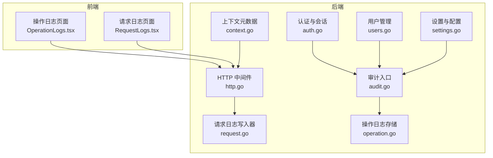
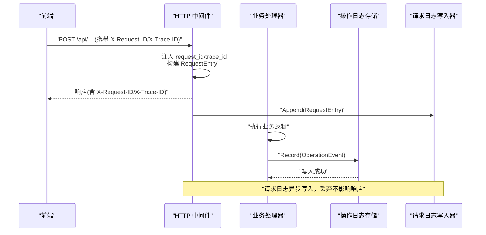
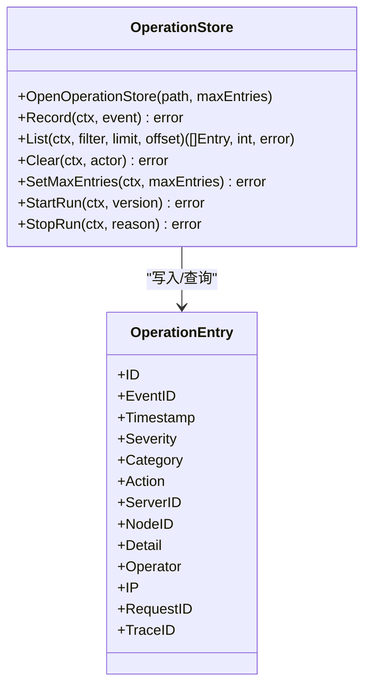
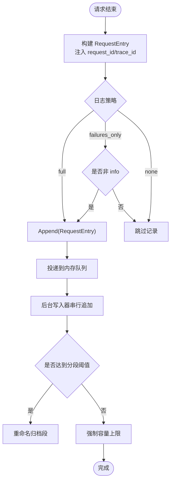
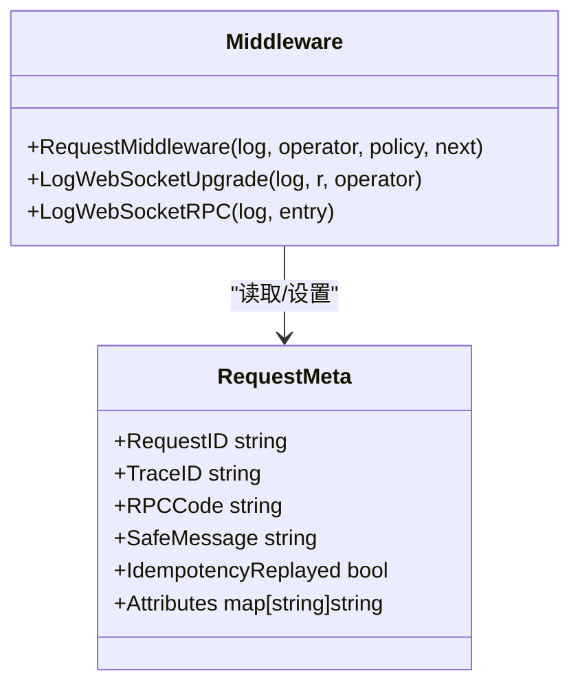
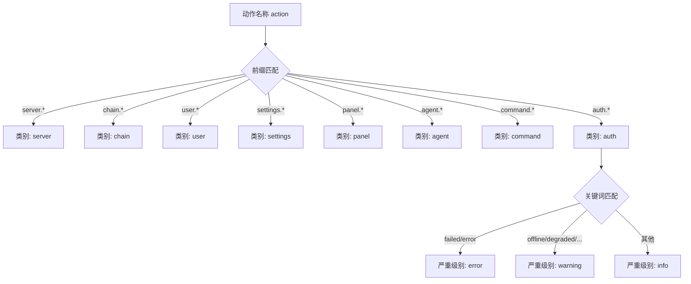
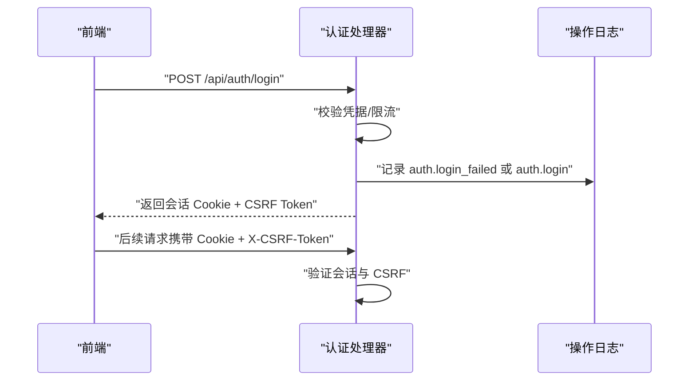
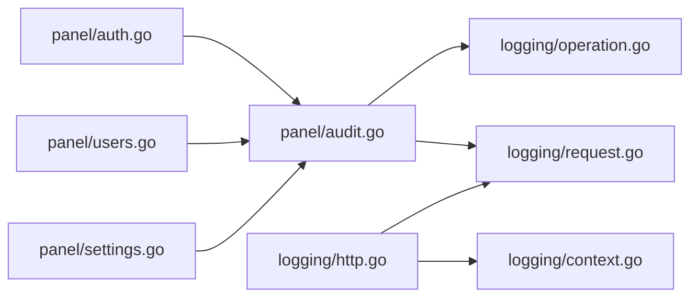

# 安全审计

<cite>
**本文引用的文件**   
- [operation.go](file://src/backend/internal/logging/operation.go)
- [http.go](file://src/backend/internal/logging/http.go)
- [request.go](file://src/backend/internal/logging/request.go)
- [context.go](file://src/backend/internal/logging/context.go)
- [audit.go](file://src/backend/internal/panel/audit.go)
- [auth.go](file://src/backend/internal/panel/auth.go)
- [users.go](file://src/backend/internal/panel/users.go)
- [settings.go](file://src/backend/internal/panel/settings.go)
- [logging-design.md](file://docs/logging-design.md)
- [rpc-api-design.md](file://docs/rpc-api-design.md)
- [OperationLogs.tsx](file://src/frontend/src/pages/OperationLogs.tsx)
- [RequestLogs.tsx](file://src/frontend/src/pages/RequestLogs.tsx)
- [main.go](file://src/backend/cmd/backend/main.go)
</cite>

## 目录
1. [引言](#引言)
2. [项目结构](#项目结构)
3. [核心组件](#核心组件)
4. [架构总览](#架构总览)
5. [详细组件分析](#详细组件分析)
6. [依赖关系分析](#依赖关系分析)
7. [性能与容量控制](#性能与容量控制)
8. [故障排查指南](#故障排查指南)
9. [合规性与保留策略](#合规性与保留策略)
10. [第三方安全工具集成](#第三方安全工具集成)
11. [结论](#结论)

## 引言
本安全审计文档面向 Lattix-codex 项目的操作审计、请求日志与安全事件监控能力，覆盖以下方面：
- 操作审计机制：用户行为记录、API 调用日志、操作轨迹追踪（request_id/trace_id）
- 安全事件监控：登录失败、权限违规、异常操作的检测与记录
- 日志安全策略：敏感信息过滤、存储权限控制、访问权限控制
- 审计数据分析：安全事件统计、趋势分析与风险报告生成思路
- 合规性审计：GDPR、等保2.0 的日志格式与保留策略建议
- 第三方安全工具集成：SIEM 对接、漏洞扫描与渗透测试建议
- 最佳实践与常见安全问题排查方法

## 项目结构
Lattix 的审计与日志系统由后端 logging 包与 panel 层的审计入口组成，前端提供操作日志与请求日志查看界面。关键路径如下：
- 操作日志：SQLite 独立数据库 operation.db，表 operation_log 与 runtime_state
- 请求日志：JSONL 分段文件 requests-current.jsonl 与归档段
- HTTP 中间件：统一注入 request_id/trace_id、脱敏参数、策略化记录
- 审计钩子：业务成功路径调用 audit() 写入操作日志

图表来源
- [http.go:1-120](file://src/backend/internal/logging/http.go#L1-L120)
- [request.go:1-120](file://src/backend/internal/logging/request.go#L1-L120)
- [operation.go:1-120](file://src/backend/internal/logging/operation.go#L1-L120)
- [context.go:1-67](file://src/backend/internal/logging/context.go#L1-L67)
- [audit.go:1-79](file://src/backend/internal/panel/audit.go#L1-L79)
- [auth.go:1-120](file://src/backend/internal/panel/auth.go#L1-L120)
- [users.go:1-120](file://src/backend/internal/panel/users.go#L1-L120)
- [settings.go:1-120](file://src/backend/internal/panel/settings.go#L1-L120)
- [OperationLogs.tsx:1-120](file://src/frontend/src/pages/OperationLogs.tsx#L1-L120)
- [RequestLogs.tsx:1-120](file://src/frontend/src/pages/RequestLogs.tsx#L1-L120)

章节来源
- [logging-design.md:1-120](file://docs/logging-design.md#L1-L120)
- [rpc-api-design.md:1-120](file://docs/rpc-api-design.md#L1-L120)

## 核心组件
- 操作日志存储 OperationStore：SQLite 独立库，固定 schema，支持按严重级别、类别、服务器、操作员、关键字和时间范围查询；默认保留最新 N 条，可配置 100–100000 条
- 请求日志 RequestLog：异步 JSONL 写入，队列容量 1024，单段目标为总容量的 1/10（最小 64 KiB），总容量默认 10 MiB，支持清理与状态查询
- HTTP 中间件 RequestMiddleware：注入 request_id/trace_id，按路由策略 full/failures_only/none 决定是否记录，自动脱敏敏感参数与 token
- 审计入口 audit()：在业务成功路径调用，分类与严重级别由 action 前缀与关键词判定，不阻断业务
- 上下文元数据 RequestMeta：集中管理 request_id、trace_id、RPC code、安全属性白名单

章节来源
- [operation.go:1-180](file://src/backend/internal/logging/operation.go#L1-L180)
- [request.go:1-160](file://src/backend/internal/logging/request.go#L1-L160)
- [http.go:1-120](file://src/backend/internal/logging/http.go#L1-L120)
- [audit.go:1-79](file://src/backend/internal/panel/audit.go#L1-L79)
- [context.go:1-67](file://src/backend/internal/logging/context.go#L1-L67)

## 架构总览
下图展示一次受控 API 调用的完整审计链路：中间件注入追踪 ID、构建请求日志条目；业务处理器成功后通过 audit() 写入操作日志；前后端分别提供操作日志与请求日志查看界面。

图表来源
- [http.go:1-120](file://src/backend/internal/logging/http.go#L1-L120)
- [request.go:1-120](file://src/backend/internal/logging/request.go#L1-L120)
- [operation.go:1-120](file://src/backend/internal/logging/operation.go#L1-L120)
- [audit.go:1-79](file://src/backend/internal/panel/audit.go#L1-L79)

## 详细组件分析

### 操作日志（OperationStore）
- 数据模型：event_id、ts、severity、category、action、server_id、node_id、detail、operator、ip、request_id、trace_id
- 索引：按 ts、severity、category 建立索引以优化查询
- 生命周期：启动时写入 panel.started，若发现旧标记先写 panel.unclean_shutdown；停止时写 panel.stopped 并清除运行标记
- 保留策略：每次写入后 trim 超出限制的最旧记录；清空操作会记录一条 operation_log.cleared

图表来源
- [operation.go:1-180](file://src/backend/internal/logging/operation.go#L1-L180)

章节来源
- [operation.go:1-180](file://src/backend/internal/logging/operation.go#L1-L180)
- [logging-design.md:1-120](file://docs/logging-design.md#L1-L120)

### 请求日志（RequestLog）
- 写入方式：后台协程串行追加 JSONL，队列满或关闭时丢弃，不影响 HTTP 响应
- 分段与容量：当前段 requests-current.jsonl，达到目标大小重命名为带时间戳的归档段；超过总容量删除最旧归档段
- 脱敏规则：参数名匹配 token/password/secret/key/cookie/authorization/cert/private 的值替换为 [REDACTED]；/sub/{token} 路径中的 token 用 SHA-256 摘要前 4 字节替换
- 重要程度：根据 HTTP 状态码、RPC code、耗时与 panic 情况判定 info/warning/error

图表来源
- [http.go:1-120](file://src/backend/internal/logging/http.go#L1-L120)
- [request.go:1-200](file://src/backend/internal/logging/request.go#L1-L200)

章节来源
- [request.go:1-200](file://src/backend/internal/logging/request.go#L1-L200)
- [http.go:1-120](file://src/backend/internal/logging/http.go#L1-L120)
- [logging-design.md:120-220](file://docs/logging-design.md#L120-L220)

### HTTP 中间件与上下文元数据
- 注入 request_id/trace_id：优先使用请求头，否则生成新 ID；将 trace_id 回写到响应头
- 安全属性白名单：仅允许路由显式声明的字段写入 attributes，禁止反射任意 body
- 客户端 IP：仅在本地回环地址信任 X-Forwarded-For 的首个地址，防止伪造
- 策略函数：每个路由注册时声明 LogPolicy（full/failures_only/none），不可由客户端关闭

图表来源
- [context.go:1-67](file://src/backend/internal/logging/context.go#L1-L67)
- [http.go:1-120](file://src/backend/internal/logging/http.go#L1-L120)

章节来源
- [context.go:1-67](file://src/backend/internal/logging/context.go#L1-L67)
- [http.go:1-120](file://src/backend/internal/logging/http.go#L1-L120)

### 审计入口与分类/严重级别
- 分类映射：server/chain/user/settings/panel/agent/command/auth/log 等类别由 action 前缀决定
- 严重级别判定：包含 failed/error 为 error；包含 offline/degraded/drift/login_failed/restart/update_started 为 warning；其余为 info
- 审计调用时机：业务成功路径调用，写入失败仅记进程日志，不回滚业务

图表来源
- [audit.go:1-79](file://src/backend/internal/panel/audit.go#L1-L79)

章节来源
- [audit.go:1-79](file://src/backend/internal/panel/audit.go#L1-L79)

### 认证与会话安全
- 会话签名：基于 HMAC-SHA256 对 payload(user|exp) 签名，Cookie 设置 HttpOnly、Secure（HTTPS）、SameSite=Lax
- 登录流程：校验用户名密码，失败记录 auth.login_failed 并限流；成功签发会话 Cookie 与 CSRF Token
- 登出与会话失效：修改密码即更换会话密钥源，全部会话失效；登出清除 Cookie
- 来源校验：requireSameOrigin 校验 Origin/Referer 与 Host 一致，HTTPS 下要求 https

图表来源
- [auth.go:1-160](file://src/backend/internal/panel/auth.go#L1-L160)
- [audit.go:1-79](file://src/backend/internal/panel/audit.go#L1-L79)

章节来源
- [auth.go:1-160](file://src/backend/internal/panel/auth.go#L1-L160)

### 用户管理与审计
- 创建用户：生成 UUID 与 sub_token，可选预选节点；成功后记录 user.create，包含 user_id/name/node_count
- 更新用户：支持 expires_at 与 disabled 变更，停权态跃迁扇出 add_user/remove_user；变更记录 changes
- 分配节点：整体替换用户节点，差量扇出；记录 user.nodes_updated，包含 before/after node_ids
- 删除用户：扇出 remove_user 后删除，记录 user.delete，保留 name 快照

章节来源
- [users.go:1-200](file://src/backend/internal/panel/users.go#L1-L200)
- [users.go:200-461](file://src/backend/internal/panel/users.go#L200-L461)

### 设置与审计
- 设置项：包括时区、公共 URL、TLS 模式、告警 Webhook/Telegram、操作日志保留条数、请求日志容量等
- 审计记录：settings.updated 记录变更差异；agent.settings.updated 记录 Agent 设置变更；密码修改记录 auth.password_changed
- 容量控制：保存后立即应用 OperationLogLimit 与 RequestLogMaxMB

章节来源
- [settings.go:1-200](file://src/backend/internal/panel/settings.go#L1-L200)
- [settings.go:200-540](file://src/backend/internal/panel/settings.go#L200-L540)

### 前端审计界面
- 操作日志页：支持按严重级别、类别、服务器、操作员、关键字、时间范围筛选与服务端分页；显示详情弹窗
- 请求日志页：窗口式读取尾部行，支持按严重级别与方法过滤，显示容量状态与丢弃计数

章节来源
- [OperationLogs.tsx:1-200](file://src/frontend/src/pages/OperationLogs.tsx#L1-L200)
- [RequestLogs.tsx:1-200](file://src/frontend/src/pages/RequestLogs.tsx#L1-L200)

## 依赖关系分析
- 模块耦合：panel 层通过 audit() 依赖 logging.OperationStore；HTTP 中间件依赖 logging.RequestLog；上下文元数据贯穿请求处理链
- 外部依赖：SQLite 用于操作日志；文件系统用于请求日志 JSONL；bcrypt/HMAC 用于密码与签名
- 潜在循环依赖：无直接循环；审计写入失败不阻塞业务，降低耦合风险

图表来源
- [audit.go:1-79](file://src/backend/internal/panel/audit.go#L1-L79)
- [operation.go:1-120](file://src/backend/internal/logging/operation.go#L1-L120)
- [request.go:1-120](file://src/backend/internal/logging/request.go#L1-L120)
- [http.go:1-120](file://src/backend/internal/logging/http.go#L1-L120)
- [context.go:1-67](file://src/backend/internal/logging/context.go#L1-L67)
- [auth.go:1-120](file://src/backend/internal/panel/auth.go#L1-L120)
- [users.go:1-120](file://src/backend/internal/panel/users.go#L1-L120)
- [settings.go:1-120](file://src/backend/internal/panel/settings.go#L1-L120)

## 性能与容量控制
- 操作日志：SQLite 单连接，写入加锁，trim 控制在写入事务内；最大条目数可配置，默认 1000
- 请求日志：队列容量 1024，后台协程串行写入；单段目标为总容量的 1/10（最小 64 KiB），总容量默认 10 MiB；丢弃计数聚合上报
- 前端刷新：默认不刷新，支持 5/10/15/30/60 秒间隔；请求日志窗口 10/30/50/100 行

章节来源
- [operation.go:1-180](file://src/backend/internal/logging/operation.go#L1-L180)
- [request.go:1-200](file://src/backend/internal/logging/request.go#L1-L200)
- [logging-design.md:200-311](file://docs/logging-design.md#L200-L311)

## 故障排查指南
- 登录失败频繁：检查 auth.login_failed 操作日志与请求日志中 AUTH_INVALID_CREDENTIALS；确认限流策略与密码哈希状态
- 权限违规：查看请求日志中 AUTH_REQUIRED 与 requireAuth/requireCSRF/requireSameOrigin 拦截记录
- 异常操作：关注 severity=error 的操作日志与请求日志，结合 request_id/trace_id 定位
- 日志丢失：检查请求日志队列丢弃计数与文件权限（目录 0700，文件 0600）；确认磁盘空间与写入错误
- 未正常退出：面板启动时若存在旧运行标记，会记录 panel.unclean_shutdown；检查优雅关停预算与停止事件写入

章节来源
- [auth.go:1-160](file://src/backend/internal/panel/auth.go#L1-L160)
- [http.go:1-120](file://src/backend/internal/logging/http.go#L1-L120)
- [operation.go:1-180](file://src/backend/internal/logging/operation.go#L1-L180)
- [request.go:1-200](file://src/backend/internal/logging/request.go#L1-L200)

## 合规性与保留策略
- GDPR 建议：最小化采集（已实现敏感字段脱敏与参数长度限制）、可删除（支持清空操作日志与请求日志）、可追溯（request_id/trace_id 全链路）
- 等保2.0 建议：审计日志独立存储（operation.db 与 JSONL 分离）、防篡改（权限 0600/0700）、保留期可配置（100–100000 条/1–1024 MB）
- 日志格式：操作日志结构化字段齐全；请求日志 JSONL 每行独立对象，便于 SIEM 解析
- 保留策略：按容量与时间滚动归档；清空操作自身留痕，满足审计完整性

章节来源
- [logging-design.md:1-120](file://docs/logging-design.md#L1-L120)
- [logging-design.md:120-220](file://docs/logging-design.md#L120-L220)
- [logging-design.md:220-311](file://docs/logging-design.md#L220-L311)

## 第三方安全工具集成
- SIEM 对接：导出操作日志与请求日志 JSONL 至 SIEM（如 ELK/Splunk），基于 request_id/trace_id 关联分析
- 漏洞扫描：定期扫描面板对外端口与证书配置（settings.go TLS 模式），确保 HTTPS 与证书有效性
- 渗透测试：模拟登录失败、CSRF 绕过、XSS 与越权访问，验证审计记录完整性与防护策略有效性
- 告警集成：通过 alert_webhook_url 与 Telegram Bot 配置，将高危事件（如大量登录失败、权限违规）推送至告警通道

章节来源
- [settings.go:1-200](file://src/backend/internal/panel/settings.go#L1-L200)
- [logging-design.md:200-311](file://docs/logging-design.md#L200-L311)

## 结论
Lattix-codex 的安全审计体系通过操作日志与请求日志双轨记录，结合严格的敏感信息脱敏、权限控制与容量管理，提供了完整的用户行为追踪与安全事件监控能力。建议在生产环境中启用 HTTPS、合理配置日志保留策略，并通过 SIEM 与告警通道实现自动化风险监测与响应。