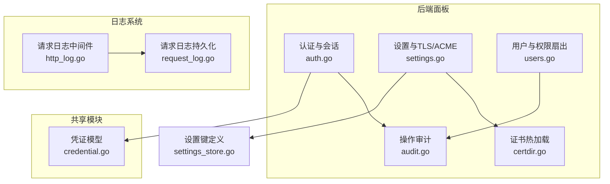
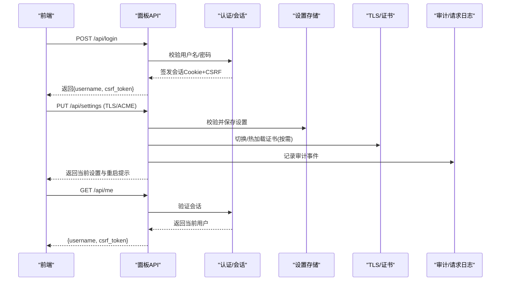
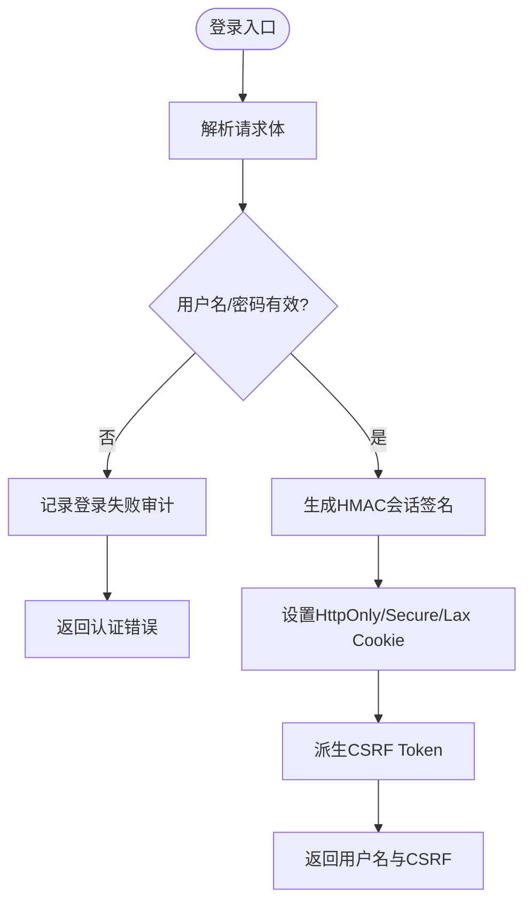
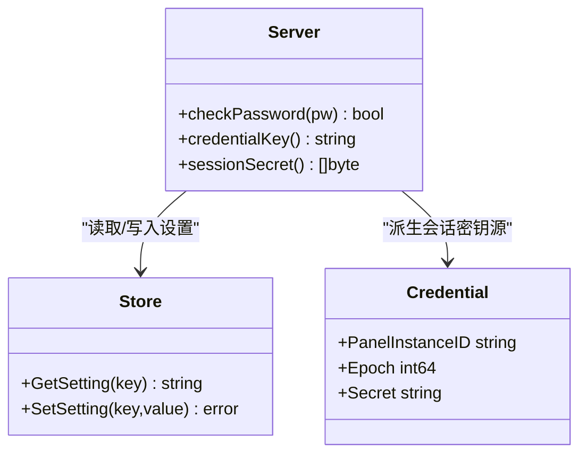
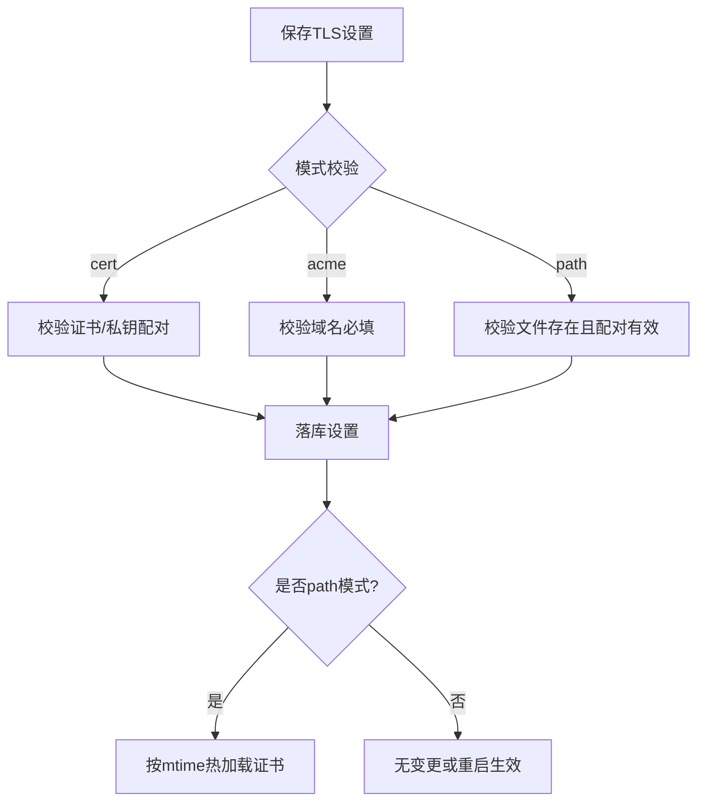
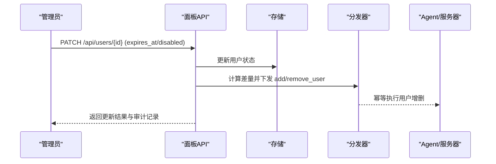
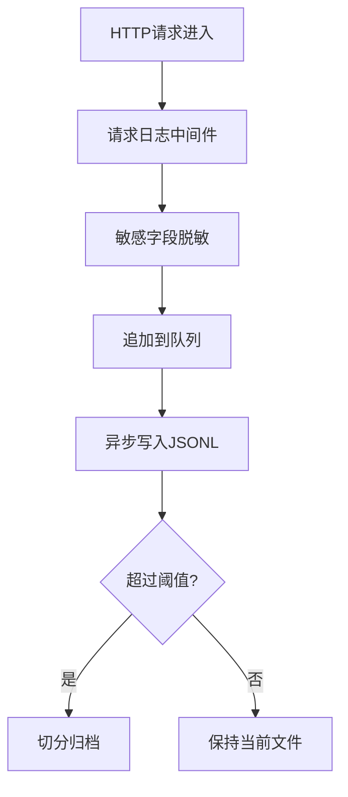
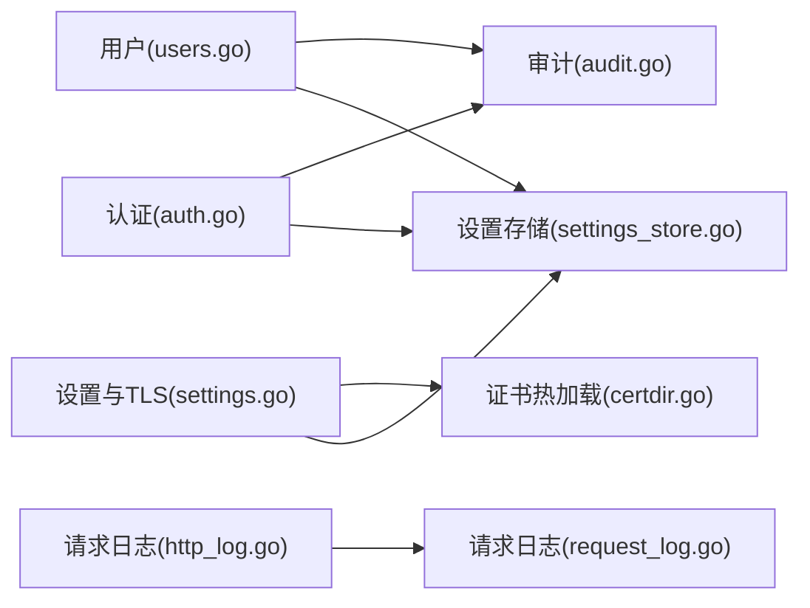

# 安全设计

<cite>
**本文引用的文件**   
- [auth.go](file://src/backend/internal/panel/auth.go)
- [settings.go](file://src/backend/internal/panel/settings.go)
- [certdir.go](file://src/backend/internal/panel/certdir.go)
- [users.go](file://src/backend/internal/panel/users.go)
- [audit.go](file://src/backend/internal/panel/audit.go)
- [settings_store.go](file://src/backend/internal/store/settings.go)
- [credential.go](file://src/shared/credential.go)
- [http_log.go](file://src/backend/internal/logging/http.go)
- [request_log.go](file://src/backend/internal/logging/request.go)
</cite>

## 目录
1. [引言](#引言)
2. [项目结构](#项目结构)
3. [核心组件](#核心组件)
4. [架构总览](#架构总览)
5. [详细组件分析](#详细组件分析)
6. [依赖关系分析](#依赖关系分析)
7. [性能与安全权衡](#性能与安全权衡)
8. [故障排查指南](#故障排查指南)
9. [结论](#结论)
10. [附录：最佳实践与威胁防护](#附录最佳实践与威胁防护)

## 引言
本安全设计文档面向 Lattix-codex 项目的安全实现，覆盖认证与授权、会话管理、TLS 加密与证书管理（含 ACME 自动续期）、配置安全策略、网络安全措施、数据安全保护以及审计与漏洞扫描建议。文档以代码级事实为依据，辅以可视化图示，帮助读者快速理解并落地安全实践。

## 项目结构
后端面板服务位于 src/backend/internal/panel，负责 HTTP API、认证与会话、设置与 TLS 配置、用户管理等；日志子系统位于 src/backend/internal/logging；共享凭证模型位于 src/shared；存储层键定义位于 store/settings.go。

图表来源
- [auth.go:1-205](file://src/backend/internal/panel/auth.go#L1-L205)
- [settings.go:1-649](file://src/backend/internal/panel/settings.go#L1-L649)
- [certdir.go:1-96](file://src/backend/internal/panel/certdir.go#L1-L96)
- [users.go:1-461](file://src/backend/internal/panel/users.go#L1-L461)
- [audit.go:1-79](file://src/backend/internal/panel/audit.go#L1-L79)
- [http_log.go:1-409](file://src/backend/internal/logging/http.go#L1-L409)
- [request_log.go:1-527](file://src/backend/internal/logging/request.go#L1-L527)
- [credential.go:1-65](file://src/shared/credential.go#L1-L65)
- [settings_store.go:1-167](file://src/backend/internal/store/settings.go#L1-L167)

章节来源
- [auth.go:1-205](file://src/backend/internal/panel/auth.go#L1-L205)
- [settings.go:1-649](file://src/backend/internal/panel/settings.go#L1-L649)
- [certdir.go:1-96](file://src/backend/internal/panel/certdir.go#L1-L96)
- [users.go:1-461](file://src/backend/internal/panel/users.go#L1-L461)
- [audit.go:1-79](file://src/backend/internal/panel/audit.go#L1-L79)
- [http_log.go:1-409](file://src/backend/internal/logging/http.go#L1-L409)
- [request_log.go:1-527](file://src/backend/internal/logging/request.go#L1-L527)
- [credential.go:1-65](file://src/shared/credential.go#L1-L65)
- [settings_store.go:1-167](file://src/backend/internal/store/settings.go#L1-L167)

## 核心组件
- 认证与会话：基于 HMAC-SHA256 签名的 Cookie 会话，支持 HttpOnly、Secure、SameSite 控制；登录失败记录审计；CSRF 令牌派生自会话签名密钥。
- 密码与凭据：管理员密码支持 bcrypt 哈希存储，DB 值优先于启动参数；修改密码会改变会话签名密钥源，导致全部会话失效。
- TLS 与证书：支持 off/cert/acme/path 四种模式；path 模式通过 mtime 缓存实现热加载，外部 ACME 续期无需重启；保存前校验 PEM 配对与证书解析。
- 用户与权限：用户创建/更新/删除均审计；节点分配变更按差量扇出 add_user/remove_user；停权态由 expired/disabled 共同决定。
- 审计与日志：操作日志分类分级；请求日志 JSONL 落盘，敏感字段脱敏，支持容量限制与轮转。

章节来源
- [auth.go:1-205](file://src/backend/internal/panel/auth.go#L1-L205)
- [settings.go:568-614](file://src/backend/internal/panel/settings.go#L568-L614)
- [certdir.go:1-96](file://src/backend/internal/panel/certdir.go#L1-L96)
- [users.go:1-461](file://src/backend/internal/panel/users.go#L1-L461)
- [audit.go:1-79](file://src/backend/internal/panel/audit.go#L1-L79)
- [http_log.go:1-409](file://src/backend/internal/logging/http.go#L1-L409)
- [request_log.go:1-527](file://src/backend/internal/logging/request.go#L1-L527)

## 架构总览
下图展示从浏览器到后端的安全链路：前端通过 HTTPS 访问面板 API，认证通过后携带会话 Cookie 与 CSRF Token；设置与证书变更经严格校验后落库；TLS 运行时根据模式选择证书来源或热加载路径；所有关键操作写入审计日志，请求日志脱敏落盘。

图表来源
- [auth.go:67-135](file://src/backend/internal/panel/auth.go#L67-L135)
- [settings.go:343-462](file://src/backend/internal/panel/settings.go#L343-L462)
- [certdir.go:48-96](file://src/backend/internal/panel/certdir.go#L48-L96)
- [audit.go:12-34](file://src/backend/internal/panel/audit.go#L12-L34)
- [http_log.go:43-82](file://src/backend/internal/logging/http.go#L43-L82)

## 详细组件分析

### 认证与会话机制
- 会话生成：使用 HMAC-SHA256 对“用户名|过期时间”进行签名，附带 base64url 编码的负载与 MAC。
- Cookie 安全：HttpOnly、Secure（HTTPS 时）、SameSite=Lax，MaxAge=7天。
- 登录流程：校验失败记录审计；成功则签发会话并返回 CSRF 令牌。
- 登出与探活：清除 Cookie；/api/auth/me 用于前端判断登录态。
- CSRF 保护：CSRF Token 由会话值与固定前缀经 HMAC 派生，要求 X-CSRF-Token 头匹配。
- 同源校验：requireSameOrigin 校验 Origin/Referer 与 Host 一致，HTTPS 下禁止 http 来源。

图表来源
- [auth.go:67-135](file://src/backend/internal/panel/auth.go#L67-L135)
- [auth.go:164-205](file://src/backend/internal/panel/auth.go#L164-L205)

章节来源
- [auth.go:1-205](file://src/backend/internal/panel/auth.go#L1-L205)

### 管理员密码与凭据管理
- 密码存储：bcrypt 哈希存于 DB；若存在则优先于启动参数中的明文密码。
- 密码校验：checkPassword 先查 DB 哈希，再回退到启动参数。
- 会话密钥派生：sessionSecret 基于 credentialKey() 派生，改密即换源，强制全部会话失效。
- 凭据模型：shared.Credential 用于实例标识与随机密钥段，保证唯一性与安全性。

图表来源
- [settings.go:568-614](file://src/backend/internal/panel/settings.go#L568-L614)
- [credential.go:1-65](file://src/shared/credential.go#L1-L65)
- [settings_store.go:1-167](file://src/backend/internal/store/settings.go#L1-L167)

章节来源
- [settings.go:568-614](file://src/backend/internal/panel/settings.go#L568-L614)
- [credential.go:1-65](file://src/shared/credential.go#L1-L65)
- [settings_store.go:1-167](file://src/backend/internal/store/settings.go#L1-L167)

### TLS 加密与证书管理（含 ACME）
- 模式支持：off/cert/acme/path；path 模式约定 <tls-dir>/<域名>/fullchain.pem|privkey.pem。
- 保存校验：PEM 配对校验、证书解析校验；不同模式有完整性约束（如 cert 需同时提供证书与私钥）。
- 运行态：AppliedTLS 快照对比得出 restart_required；path 模式通过 NewDirCertGetter 按 mtime 热加载新证书。
- 证书摘要：仅暴露只读摘要（CN、DNSNames、NotAfter、Expired），私钥不出接口。

图表来源
- [settings.go:343-462](file://src/backend/internal/panel/settings.go#L343-L462)
- [certdir.go:48-96](file://src/backend/internal/panel/certdir.go#L48-L96)

章节来源
- [settings.go:1-649](file://src/backend/internal/panel/settings.go#L1-L649)
- [certdir.go:1-96](file://src/backend/internal/panel/certdir.go#L1-L96)

### 用户权限与数据扇出
- 用户生命周期：创建/更新/删除均审计；创建时可预选节点，默认全关；更新支持 expires_at 与 disabled 组合停权。
- 节点分配：SetUserNodes 按差量向服务器下发 add_user/remove_user，避免重复扇出。
- 停权态：disabled OR expired 任一为真即停权；状态跃迁才触发扇出。

图表来源
- [users.go:170-278](file://src/backend/internal/panel/users.go#L170-L278)
- [users.go:287-345](file://src/backend/internal/panel/users.go#L287-L345)
- [users.go:347-461](file://src/backend/internal/panel/users.go#L347-L461)

章节来源
- [users.go:1-461](file://src/backend/internal/panel/users.go#L1-L461)

### 审计与日志
- 操作审计：统一 audit 函数记录 operator、IP、RequestID、TraceID 等；按 action 前缀分类与定级。
- 请求日志：中间件捕获 HTTP/WebSocket 升级；敏感字段（token/password/secret/key/cookie/authorization/cert/private）脱敏；JSONL 分段落盘，支持容量限制与清理。
- 客户端 IP：直连取 RemoteAddr host；受信回环代理取 XFF 首个 IP；非回环不信任 XFF。

图表来源
- [audit.go:12-34](file://src/backend/internal/panel/audit.go#L12-L34)
- [http_log.go:43-82](file://src/backend/internal/logging/http.go#L43-L82)
- [http_log.go:252-290](file://src/backend/internal/logging/http.go#L252-L290)
- [request_log.go:197-322](file://src/backend/internal/logging/request.go#L197-L322)

章节来源
- [audit.go:1-79](file://src/backend/internal/panel/audit.go#L1-L79)
- [http_log.go:1-409](file://src/backend/internal/logging/http.go#L1-L409)
- [request_log.go:1-527](file://src/backend/internal/logging/request.go#L1-L527)

## 依赖关系分析
- 认证与会话依赖设置存储获取密码哈希与实例标识，影响会话密钥派生。
- 设置与 TLS 依赖 store 键定义与读写，运行时结合证书热加载回调。
- 用户管理依赖存储与分发器，确保状态变更幂等扇出。
- 审计与日志作为旁路，不影响主业务流但提供可观测性。

图表来源
- [auth.go:1-205](file://src/backend/internal/panel/auth.go#L1-L205)
- [settings.go:1-649](file://src/backend/internal/panel/settings.go#L1-L649)
- [certdir.go:1-96](file://src/backend/internal/panel/certdir.go#L1-L96)
- [users.go:1-461](file://src/backend/internal/panel/users.go#L1-L461)
- [audit.go:1-79](file://src/backend/internal/panel/audit.go#L1-L79)
- [http_log.go:1-409](file://src/backend/internal/logging/http.go#L1-L409)
- [request_log.go:1-527](file://src/backend/internal/logging/request.go#L1-L527)
- [settings_store.go:1-167](file://src/backend/internal/store/settings.go#L1-L167)

章节来源
- [auth.go:1-205](file://src/backend/internal/panel/auth.go#L1-L205)
- [settings.go:1-649](file://src/backend/internal/panel/settings.go#L1-L649)
- [certdir.go:1-96](file://src/backend/internal/panel/certdir.go#L1-L96)
- [users.go:1-461](file://src/backend/internal/panel/users.go#L1-L461)
- [audit.go:1-79](file://src/backend/internal/panel/audit.go#L1-L79)
- [http_log.go:1-409](file://src/backend/internal/logging/http.go#L1-L409)
- [request_log.go:1-527](file://src/backend/internal/logging/request.go#L1-L527)
- [settings_store.go:1-167](file://src/backend/internal/store/settings.go#L1-L167)

## 性能与安全权衡
- 会话有效期 7 天，兼顾用户体验与安全风险窗口；改密即失效提升安全性。
- path 模式证书热加载降低运维成本，但需确保文件系统权限与原子替换。
- 请求日志 JSONL 分段与容量限制防止磁盘耗尽；敏感字段脱敏减少泄露风险。
- 审计为旁路写入，失败不阻断业务，保障可用性。

[本节为通用指导，不直接分析具体文件]

## 故障排查指南
- 登录失败：检查用户名/密码、审计日志中 login_failed 事件、CSRF 头是否正确。
- 会话异常：确认 Cookie 的 Secure/HttpOnly/SameSite 设置；检查密码是否被覆盖导致会话密钥变化。
- TLS 问题：查看 settings 响应中的 RestartRequired；path 模式检查证书文件 mtime 与配对有效性。
- 用户扇出异常：核对节点分配差量与服务器在线状态；关注 remove/add_user 回执。
- 日志丢失：检查请求日志目录权限、容量上限与轮转策略；关注 dropped 计数。

章节来源
- [auth.go:67-135](file://src/backend/internal/panel/auth.go#L67-L135)
- [settings.go:343-462](file://src/backend/internal/panel/settings.go#L343-L462)
- [certdir.go:48-96](file://src/backend/internal/panel/certdir.go#L48-L96)
- [users.go:347-461](file://src/backend/internal/panel/users.go#L347-L461)
- [request_log.go:197-322](file://src/backend/internal/logging/request.go#L197-L322)

## 结论
Lattix-codex 在认证与会话、密码与凭据、TLS 与证书、用户权限、审计与日志等方面提供了完善的安全实现。通过严格的输入校验、最小化信息暴露、旁路审计与脱敏日志，系统在可用性与安全性之间取得良好平衡。建议在生产环境启用 HTTPS 与强密码策略，并结合外部 WAF/防火墙进一步加固。

[本节为总结性内容，不直接分析具体文件]

## 附录：最佳实践与威胁防护
- 传输安全
  - 强制 HTTPS，禁用弱密码套件；生产环境启用 HSTS（反向代理侧）。
  - ACME 自动续期建议使用 path 模式，确保文件原子替换与权限最小化。
- 认证与授权
  - 定期轮换管理员密码；启用强密码策略（长度≥8，复杂度）。
  - 前端务必携带 X-CSRF-Token 头；跨域场景严格校验 Origin/Referer。
- 配置安全
  - 敏感设置（证书、密钥、告警 token）不落日志；仅记录变更标记。
  - 设置项校验严格（范围、格式、合法性），失败立即拒绝。
- 网络安全
  - 仅开放必要端口；通过反向代理实施速率限制与 IP 白名单。
  - 客户端 IP 提取遵循回环可信规则，防伪造 XFF。
- 数据安全
  - 密码以 bcrypt 哈希存储；子订阅 token 随机生成，不在日志中暴露明文。
  - 日志中敏感字段脱敏，限制最大长度与总量。
- 审计与漏洞扫描
  - 开启操作日志与请求日志，定期巡检异常事件（login_failed、update_started、restart 等）。
  - 集成静态扫描与依赖漏洞扫描（SAST/SCA），CI 流水线拦截高危问题。
  - 渗透测试聚焦认证绕过、CSRF、越权、证书误配、日志泄露等。

[本节为通用指导，不直接分析具体文件]