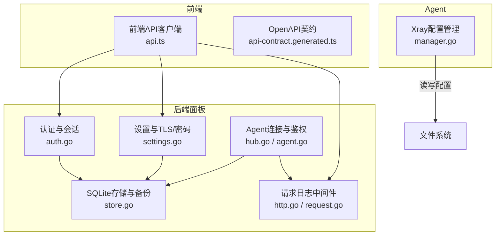
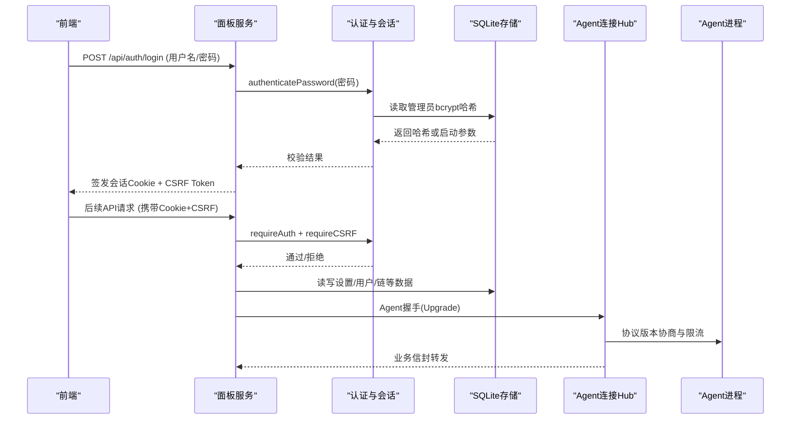
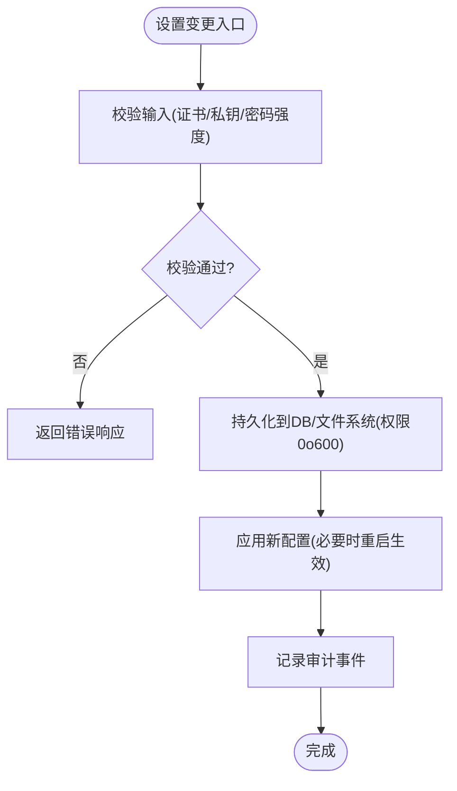
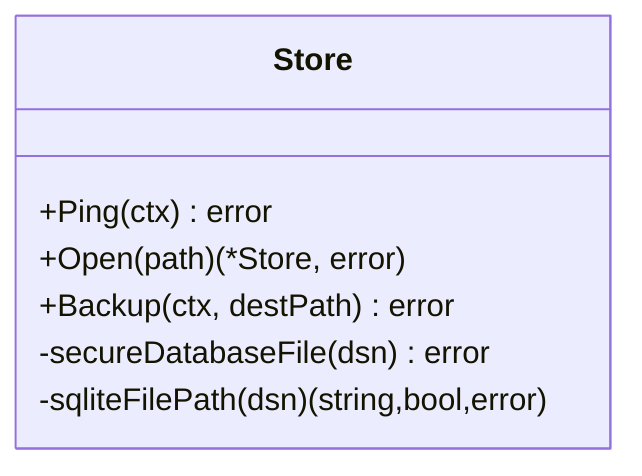
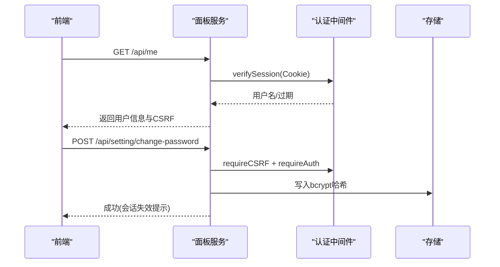
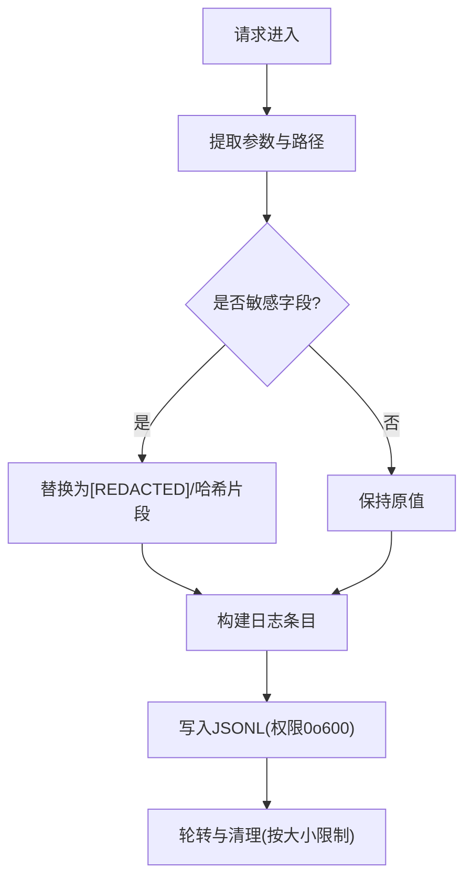
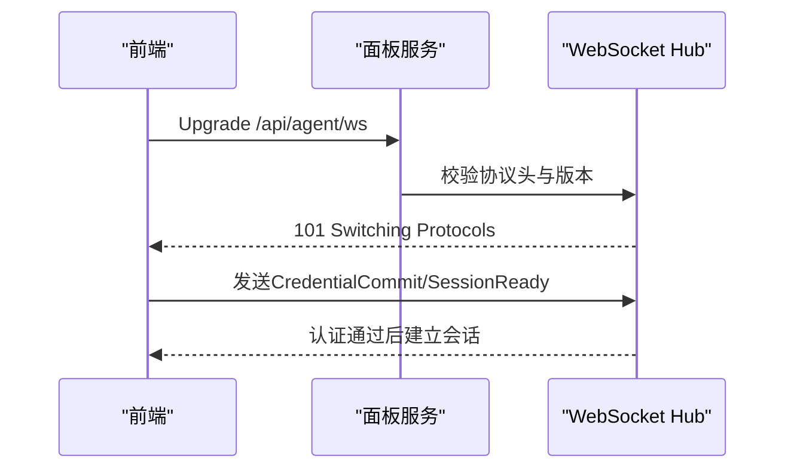
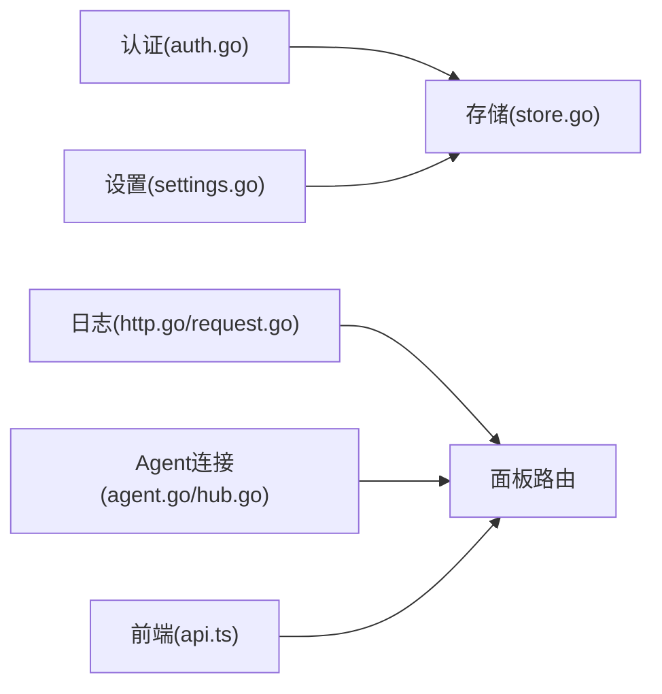

# 数据安全

<cite>
**本文引用的文件**   
- [store.go](file://src/backend/internal/store/store.go)
- [auth.go](file://src/backend/internal/panel/auth.go)
- [settings.go](file://src/backend/internal/panel/settings.go)
- [http.go](file://src/backend/internal/logging/http.go)
- [request.go](file://src/backend/internal/logging/request.go)
- [agent.go](file://src/backend/internal/ws/agent.go)
- [hub.go](file://src/backend/internal/ws/hub.go)
- [manager.go](file://src/agent/internal/xray/manager.go)
- [api.ts](file://src/frontend/src/lib/api.ts)
- [api-contract.generated.ts](file://src/frontend/src/lib/api-contract.generated.ts)
</cite>

## 目录
1. [引言](#引言)
2. [项目结构](#项目结构)
3. [核心组件](#核心组件)
4. [架构总览](#架构总览)
5. [详细组件分析](#详细组件分析)
6. [依赖关系分析](#依赖关系分析)
7. [性能考虑](#性能考虑)
8. [故障排查指南](#故障排查指南)
9. [结论](#结论)
10. [附录](#附录)

## 引言
本文件面向 Lattix-codex 项目的数据安全，覆盖敏感信息保护、数据库安全、数据访问控制、数据生命周期管理、数据传输加密与隐私保护等关键主题。文档基于代码仓库中的实现进行梳理，并提供可视化图示与最佳实践建议，帮助读者理解并落地安全配置与风险管控。

## 项目结构
本项目包含后端面板（Panel）、Agent、前端（Frontend）以及共享模块。与安全相关的关键位置包括：
- 后端存储层：SQLite 文件权限、备份与一致性快照
- 认证与会话：密码哈希、会话签名、CSRF、同源校验
- 日志与审计：请求日志脱敏、操作审计事件
- Agent 侧配置：配置文件权限、漂移检测与回滚
- 前端 API：登录、设置变更、令牌轮换等接口调用

**图表来源** 
- [auth.go:1-269](file://src/backend/internal/panel/auth.go#L1-L269)
- [settings.go:1-354](file://src/backend/internal/panel/settings.go#L1-L354)
- [http.go:1-409](file://src/backend/internal/logging/http.go#L1-L409)
- [request.go:1-538](file://src/backend/internal/logging/request.go#L1-L538)
- [store.go:1-494](file://src/backend/internal/store/store.go#L1-L494)
- [agent.go:61-79](file://src/backend/internal/ws/agent.go#L61-L79)
- [hub.go:25-46](file://src/backend/internal/ws/hub.go#L25-L46)
- [manager.go:259-371](file://src/agent/internal/xray/manager.go#L259-L371)
- [api.ts:99-259](file://src/frontend/src/lib/api.ts#L99-L259)
- [api-contract.generated.ts:1-40](file://src/frontend/src/lib/api-contract.generated.ts#L1-L40)

**章节来源**
- [store.go:1-494](file://src/backend/internal/store/store.go#L1-L494)
- [auth.go:1-269](file://src/backend/internal/panel/auth.go#L1-L269)
- [settings.go:1-354](file://src/backend/internal/panel/settings.go#L1-L354)
- [http.go:1-409](file://src/backend/internal/logging/http.go#L1-L409)
- [request.go:1-538](file://src/backend/internal/logging/request.go#L1-L538)
- [agent.go:61-79](file://src/backend/internal/ws/agent.go#L61-L79)
- [hub.go:25-46](file://src/backend/internal/ws/hub.go#L25-L46)
- [manager.go:259-371](file://src/agent/internal/xray/manager.go#L259-L371)
- [api.ts:99-259](file://src/frontend/src/lib/api.ts#L99-L259)
- [api-contract.generated.ts:1-40](file://src/frontend/src/lib/api-contract.generated.ts#L1-L40)

## 核心组件
- 认证与会话：基于 bcrypt 哈希的密码校验、HMAC-SHA256 签名的会话 Cookie、CSRF 防护、同源校验与速率限制
- 存储与备份：SQLite 文件权限强制为 0o600、VACUUM INTO 一致性备份、单连接并发控制
- 日志与审计：请求日志自动脱敏、操作审计事件记录、日志大小与轮转策略
- Agent 配置安全：配置文件权限 0o600、漂移检测与回滚、受管状态净化
- 前端 API：登录、设置更新、密码修改、服务器令牌轮换等接口

**章节来源**
- [auth.go:1-269](file://src/backend/internal/panel/auth.go#L1-L269)
- [settings.go:1-354](file://src/backend/internal/panel/settings.go#L1-L354)
- [store.go:1-494](file://src/backend/internal/store/store.go#L1-L494)
- [http.go:1-409](file://src/backend/internal/logging/http.go#L1-L409)
- [request.go:1-538](file://src/backend/internal/logging/request.go#L1-L538)
- [manager.go:259-371](file://src/agent/internal/xray/manager.go#L259-L371)
- [api.ts:99-259](file://src/frontend/src/lib/api.ts#L99-L259)

## 架构总览
下图展示从前端到后端面板、存储与 Agent 的数据流与安全控制点：

**图表来源** 
- [auth.go:81-145](file://src/backend/internal/panel/auth.go#L81-L145)
- [settings.go:540-619](file://src/backend/internal/panel/settings.go#L540-L619)
- [store.go:368-419](file://src/backend/internal/store/store.go#L368-L419)
- [agent.go:61-79](file://src/backend/internal/ws/agent.go#L61-L79)
- [hub.go:25-46](file://src/backend/internal/ws/hub.go#L25-L46)

## 详细组件分析

### 敏感信息保护机制（密码哈希、密钥管理、配置加密）
- 密码哈希存储：管理员密码优先使用 DB 中 bcrypt 哈希；若未设置则回退到启动参数。改密会刷新会话密钥派生源，导致全部会话失效。
- 会话密钥派生：由管理员凭证派生 HMAC 密钥，避免将密钥持久化；改密即换源，保证旧会话不可用。
- TLS 证书与私钥：支持 cert/acme/path 模式；提交时进行完整性校验，仅返回只读摘要，私钥不出接口。
- Agent 配置文件：写入前校验、权限设为 0o600，异常时回滚至上一份可用配置。

**图表来源** 
- [settings.go:340-354](file://src/backend/internal/panel/settings.go#L340-L354)
- [settings.go:540-619](file://src/backend/internal/panel/settings.go#L540-L619)
- [manager.go:259-371](file://src/agent/internal/xray/manager.go#L259-L371)

**章节来源**
- [settings.go:1-354](file://src/backend/internal/panel/settings.go#L1-L354)
- [settings.go:540-619](file://src/backend/internal/panel/settings.go#L540-L619)
- [manager.go:259-371](file://src/agent/internal/xray/manager.go#L259-L371)

### 数据库安全（SQLite 权限、SQL 注入防护、备份加密）
- 文件权限：打开数据库时强制创建/修正权限为 0o600，禁止世界可读；备份文件同样设置为 0o600。
- 并发与锁：单连接 + busy_timeout，降低 database is locked 概率。
- SQL 注入防护：使用现代 SQLite 驱动与参数化查询（通过 store 封装），避免拼接 SQL。
- 备份一致性：VACUUM INTO 生成一致快照，配合权限控制确保备份安全。

**图表来源** 
- [store.go:358-419](file://src/backend/internal/store/store.go#L358-L419)
- [store.go:448-494](file://src/backend/internal/store/store.go#L448-L494)

**章节来源**
- [store.go:1-494](file://src/backend/internal/store/store.go#L1-L494)

### 数据访问控制（API 权限验证、数据隔离、访问审计）
- 会话校验：requireAuth 中间件校验 Cookie 签名与有效期；更新进行中限制非进度接口。
- CSRF 防护：requireCSRF 校验 X-CSRF-Token 与会话 Secret 的 HMAC。
- 同源校验：requireSameOrigin 校验 Origin/Referer 与 Host 匹配，HTTPS 下要求来源为 https。
- 数据隔离：用户-节点关联表 user_nodes，无关联即无访问权。
- 访问审计：登录失败/成功、设置变更、操作清理等均记录审计事件。

**图表来源** 
- [auth.go:197-249](file://src/backend/internal/panel/auth.go#L197-L249)
- [auth.go:81-145](file://src/backend/internal/panel/auth.go#L81-L145)
- [store.go:1-494](file://src/backend/internal/store/store.go#L1-L494)

**章节来源**
- [auth.go:1-269](file://src/backend/internal/panel/auth.go#L1-L269)
- [store.go:1-494](file://src/backend/internal/store/store.go#L1-L494)

### 数据生命周期管理（敏感数据清理、日志脱敏、临时文件处理）
- 日志脱敏：路径参数与查询参数按敏感名模式替换为 [REDACTED]；子订阅 token 在路径中以哈希片段替代。
- 操作日志清理：Clear 操作保留审计条目，防止掩盖清理行为。
- 临时文件：Agent 配置写入采用原子重命名与权限设置，损坏时备份为 .broken；回滚使用 .prev。
- 备份下载：VACUUM INTO 输出空文件或不存在的路径，确保幂等与安全。

**图表来源** 
- [http.go:240-290](file://src/backend/internal/logging/http.go#L240-L290)
- [request.go:246-333](file://src/backend/internal/logging/request.go#L246-L333)
- [manager.go:259-371](file://src/agent/internal/xray/manager.go#L259-L371)

**章节来源**
- [http.go:1-409](file://src/backend/internal/logging/http.go#L1-L409)
- [request.go:1-538](file://src/backend/internal/logging/request.go#L1-L538)
- [manager.go:259-371](file://src/agent/internal/xray/manager.go#L259-L371)

### 数据传输加密（API 请求响应加密、内部通信安全）
- HTTPS/TLS：面板支持 off/cert/acme/path 模式；path 模式支持热加载续期。
- WebSocket 升级：/api/agent/ws 升级后记录握手事件，限制消息大小，认证后再建立会话。
- 前端 API：登录、设置、令牌轮换等接口通过浏览器 Cookie 与 CSRF 保护。

**图表来源** 
- [agent.go:61-79](file://src/backend/internal/ws/agent.go#L61-L79)
- [hub.go:25-46](file://src/backend/internal/ws/hub.go#L25-L46)
- [settings.go:27-44](file://src/backend/internal/panel/settings.go#L27-L44)

**章节来源**
- [agent.go:61-79](file://src/backend/internal/ws/agent.go#L61-L79)
- [hub.go:25-46](file://src/backend/internal/ws/hub.go#L25-L46)
- [settings.go:27-44](file://src/backend/internal/panel/settings.go#L27-L44)

### 隐私保护措施（匿名化、最小化、合规性）
- 用户数据最小化：仅暴露必要字段（如 UUID、sub_token），不返回私钥或完整配置。
- 日志最小化：限制捕获响应长度、参数 JSON 大小上限，避免泄露敏感内容。
- 合规性：审计事件记录 operator、IP、RequestID/TraceID，便于追踪与审计。

**章节来源**
- [http.go:20-40](file://src/backend/internal/logging/http.go#L20-L40)
- [request.go:25-53](file://src/backend/internal/logging/request.go#L25-L53)
- [store.go:116-125](file://src/backend/internal/store/store.go#L116-L125)

## 依赖关系分析
- 面板认证依赖存储层获取管理员密码哈希；设置变更依赖存储层持久化；日志中间件贯穿所有 HTTP 请求。
- Agent 连接通过 Hub 统一认证与限流，业务信封经 WS 传输。
- 前端 API 依赖 OpenAPI 契约生成类型定义，确保前后端一致性。

**图表来源** 
- [auth.go:1-269](file://src/backend/internal/panel/auth.go#L1-L269)
- [settings.go:1-354](file://src/backend/internal/panel/settings.go#L1-L354)
- [http.go:1-409](file://src/backend/internal/logging/http.go#L1-L409)
- [request.go:1-538](file://src/backend/internal/logging/request.go#L1-L538)
- [store.go:1-494](file://src/backend/internal/store/store.go#L1-L494)
- [agent.go:61-79](file://src/backend/internal/ws/agent.go#L61-L79)
- [hub.go:25-46](file://src/backend/internal/ws/hub.go#L25-L46)
- [api.ts:99-259](file://src/frontend/src/lib/api.ts#L99-L259)

**章节来源**
- [auth.go:1-269](file://src/backend/internal/panel/auth.go#L1-L269)
- [settings.go:1-354](file://src/backend/internal/panel/settings.go#L1-L354)
- [http.go:1-409](file://src/backend/internal/logging/http.go#L1-L409)
- [request.go:1-538](file://src/backend/internal/logging/request.go#L1-L538)
- [store.go:1-494](file://src/backend/internal/store/store.go#L1-L494)
- [agent.go:61-79](file://src/backend/internal/ws/agent.go#L61-L79)
- [hub.go:25-46](file://src/backend/internal/ws/hub.go#L25-L46)
- [api.ts:99-259](file://src/frontend/src/lib/api.ts#L99-L259)

## 性能考虑
- SQLite 单连接与 busy_timeout 降低锁竞争，适合面板场景。
- 请求日志异步写入与分段轮转，避免阻塞主流程。
- Agent 配置校验与回滚减少无效运行时间，提升稳定性。

[本节为通用指导，无需具体文件引用]

## 故障排查指南
- 登录失败：检查 bcrypt 哈希是否存在、密码强度、速率限制与审计事件 auth.login_failed。
- 会话失效：确认 Cookie HttpOnly/SameSite、CSRF Token 是否匹配、是否已改密。
- 备份失败：检查目标路径权限与是否为空文件，查看 VACUUM INTO 错误。
- 日志丢失：查看 RequestLog 队列丢弃计数与磁盘空间，确认轮转策略。
- Agent 配置漂移：检查 .prev/.broken 文件与权限，恢复上一份可用配置。

**章节来源**
- [auth.go:81-145](file://src/backend/internal/panel/auth.go#L81-L145)
- [store.go:448-494](file://src/backend/internal/store/store.go#L448-L494)
- [request.go:246-333](file://src/backend/internal/logging/request.go#L246-L333)
- [manager.go:259-371](file://src/agent/internal/xray/manager.go#L259-L371)

## 结论
Lattix-codex 在敏感信息保护、数据库安全、访问控制、日志审计与 Agent 配置管理方面具备完善实现。通过严格的权限控制、参数化存储、脱敏日志与一致性备份，有效降低了数据泄露与篡改风险。建议在生产环境启用 HTTPS/TLS、强化日志轮转与备份策略，并结合合规要求进行定期审计。

[本节为总结，无需具体文件引用]

## 附录
- 最佳实践清单
  - 始终启用 HTTPS/TLS，优先 ACME 自动续期
  - 管理员密码使用强密码并定期更换
  - 限制日志大小与保留周期，避免敏感信息泄露
  - 备份文件权限 0o600，离线保存
  - 定期审查审计事件与登录失败记录
- 风险评估方法
  - 识别敏感数据流向（存储、日志、传输）
  - 评估权限模型（RBAC/最小权限）
  - 检查外部集成（证书、代理、反向代理）的安全配置
  - 模拟攻击面（CSRF、重放、注入、越权）

[本节为通用指导，无需具体文件引用]