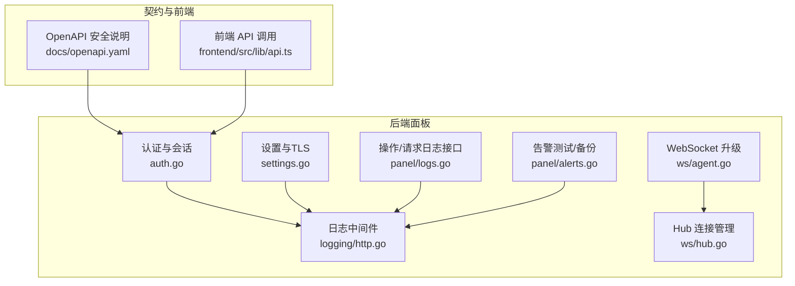
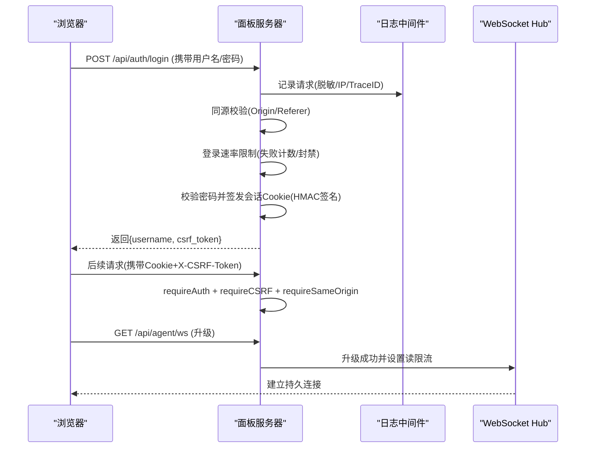
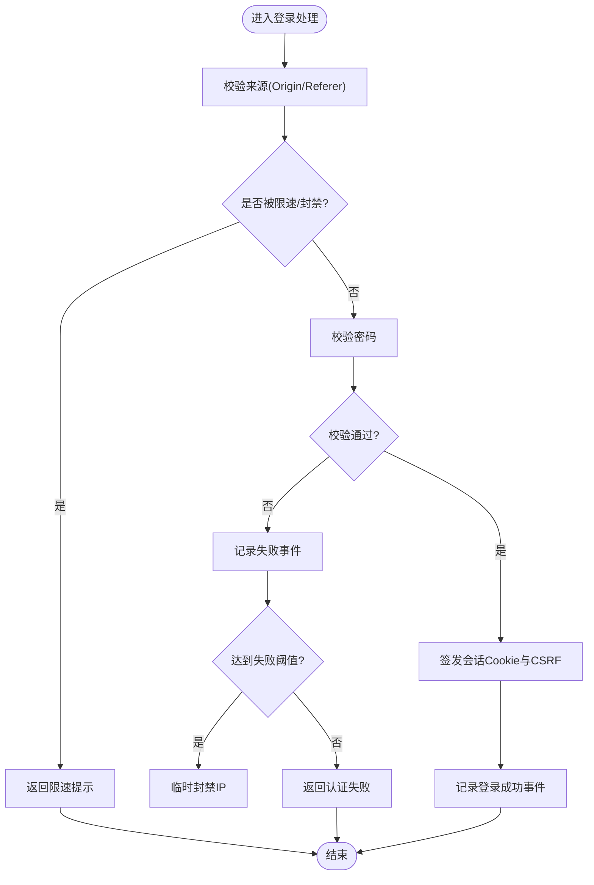
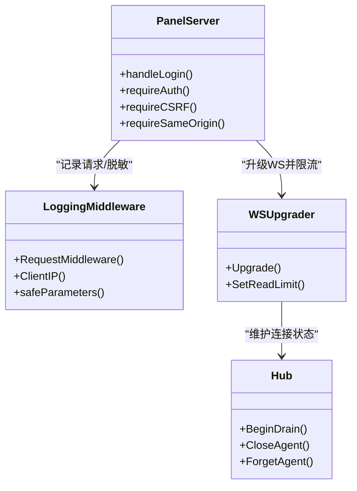
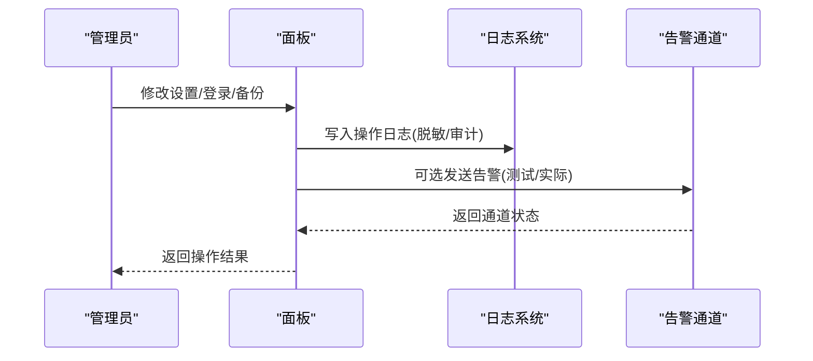
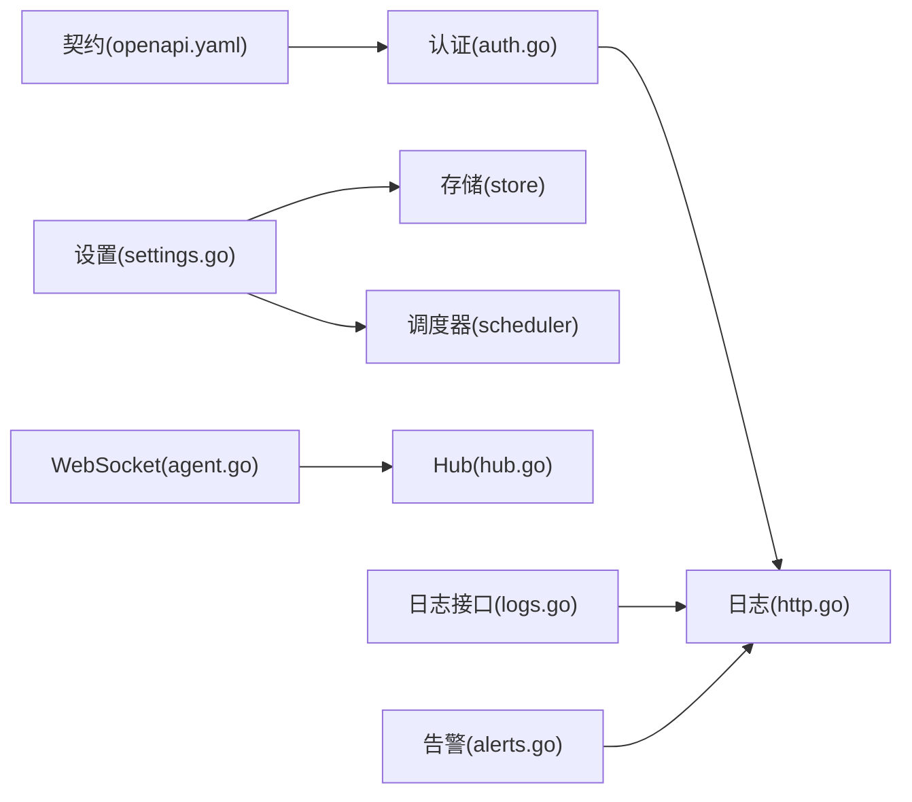

# 网络安全

<cite>
**本文引用的文件**   
- [auth.go](file://src/backend/internal/panel/auth.go)
- [settings.go](file://src/backend/internal/panel/settings.go)
- [http.go](file://src/backend/internal/logging/http.go)
- [openapi.yaml](file://docs/openapi.yaml)
- [agent.go](file://src/backend/internal/ws/agent.go)
- [hub.go](file://src/backend/internal/ws/hub.go)
- [logs.go](file://src/backend/internal/panel/logs.go)
- [alert.go](file://src/backend/internal/panel/alerts.go)
</cite>

## 目录
1. [简介](#简介)
2. [项目结构](#项目结构)
3. [核心组件](#核心组件)
4. [架构总览](#架构总览)
5. [详细组件分析](#详细组件分析)
6. [依赖关系分析](#依赖关系分析)
7. [性能考虑](#性能考虑)
8. [故障排查指南](#故障排查指南)
9. [结论](#结论)
10. [附录](#附录)

## 简介
本文件为 Lattix-codex 项目的网络安全文档，聚焦访问控制、速率限制、请求来源验证、网络层防护、防火墙与隔离策略、监控告警以及最佳实践。内容基于后端面板（Panel）与 WebSocket（WS）实现的安全机制，结合日志与审计能力，给出可操作的配置建议与常见攻击场景的防护方案。

## 项目结构
本项目采用多模块 Go 工程组织：
- backend/internal/panel：HTTP API、认证与会话、设置管理、审计与告警等
- backend/internal/logging：请求/响应日志、敏感信息脱敏、客户端 IP 解析
- backend/internal/ws：Agent 连接管理与 WebSocket 升级
- docs/openapi.yaml：API 契约与安全要求说明

图表来源
- [auth.go:1-269](file://src/backend/internal/panel/auth.go#L1-L269)
- [settings.go:1-200](file://src/backend/internal/panel/settings.go#L1-L200)
- [http.go:1-120](file://src/backend/internal/logging/http.go#L1-L120)
- [agent.go:61-79](file://src/backend/internal/ws/agent.go#L61-L79)
- [hub.go:156-216](file://src/backend/internal/ws/hub.go#L156-L216)
- [logs.go:74-120](file://src/backend/internal/panel/logs.go#L74-L120)
- [alerts.go:1-69](file://src/backend/internal/panel/alerts.go#L1-L69)
- [openapi.yaml:1-40](file://docs/openapi.yaml#L1-L40)

章节来源
- [auth.go:1-269](file://src/backend/internal/panel/auth.go#L1-L269)
- [settings.go:1-200](file://src/backend/internal/panel/settings.go#L1-L200)
- [http.go:1-120](file://src/backend/internal/logging/http.go#L1-L120)
- [openapi.yaml:1-40](file://docs/openapi.yaml#L1-L40)

## 核心组件
- 认证与会话
  - 登录流程签发带签名的会话 Cookie，支持 CSRF Token 校验与同源校验
  - 会话密钥由管理员凭证派生，改密即失效全部会话
- 速率限制与防暴力破解
  - 登录失败次数阈值触发临时封禁，含最大跟踪 IP 上限
- 请求来源验证
  - Origin/Referer 同源校验；HTTPS 下强制来源为 HTTPS
  - OpenAPI 明确登录接口的来源校验要求
- 网络层与传输安全
  - TLS 模式（关闭/自带证书/ACME/路径热加载）
  - WebSocket 读限流与连接状态管理
- 日志与审计
  - 请求级日志、敏感字段脱敏、客户端 IP 解析
  - 操作日志与请求日志查询、清理与容量控制
- 告警与备份
  - 告警通道测试与审计记录
  - 数据库备份下载与审计

章节来源
- [auth.go:1-269](file://src/backend/internal/panel/auth.go#L1-L269)
- [settings.go:1-200](file://src/backend/internal/panel/settings.go#L1-L200)
- [http.go:1-120](file://src/backend/internal/logging/http.go#L1-L120)
- [agent.go:61-79](file://src/backend/internal/ws/agent.go#L61-L79)
- [hub.go:156-216](file://src/backend/internal/ws/hub.go#L156-L216)
- [logs.go:74-120](file://src/backend/internal/panel/logs.go#L74-L120)
- [alerts.go:1-69](file://src/backend/internal/panel/alerts.go#L1-L69)
- [openapi.yaml:1-40](file://docs/openapi.yaml#L1-L40)

## 架构总览
下图展示从浏览器到后端面板的关键安全路径：同源校验、CSRF、会话签名、速率限制、日志记录与 WS 升级。

图表来源
- [auth.go:82-145](file://src/backend/internal/panel/auth.go#L82-L145)
- [auth.go:197-268](file://src/backend/internal/panel/auth.go#L197-L268)
- [http.go:43-82](file://src/backend/internal/logging/http.go#L43-L82)
- [agent.go:61-79](file://src/backend/internal/ws/agent.go#L61-L79)

## 详细组件分析

### 访问控制与认证
- 会话与令牌
  - 会话值由“用户|过期时间”经 HMAC-SHA256 签名后 Base64URL 编码，Cookie 标记 HttpOnly、Secure（HTTPS 时）、SameSite=Lax
  - CSRF Token 由会话值与密钥派生，通过 X-CSRF-Token 头提交
- 中间件
  - requireAuth：校验会话有效性，并在面板更新进行中限制非轮询/探活接口
  - requireCSRF：校验 X-CSRF-Token 与 Cookie 中会话的一致性
  - requireSameOrigin：校验 Origin/Referer 与 Host 一致，HTTPS 下来源必须为 https
- 登录流程
  - 先进行来源校验与速率限制，再校验密码；成功后记录成功事件，失败记录警告事件并可能触发封禁

图表来源
- [auth.go:82-145](file://src/backend/internal/panel/auth.go#L82-L145)
- [auth.go:197-268](file://src/backend/internal/panel/auth.go#L197-L268)

章节来源
- [auth.go:1-269](file://src/backend/internal/panel/auth.go#L1-L269)
- [openapi.yaml:1-40](file://docs/openapi.yaml#L1-L40)

### 速率限制与防暴力破解
- 登录失败限制
  - 按 IP 维度记录失败次数，超过阈值后对同一 IP 实施临时封禁
  - 提供 retryAfter 判断与 recordFailure/recordSuccess 接口
  - 存在最大跟踪 IP 数量上限，防止内存膨胀
- 适用场景
  - 登录接口、密码修改等高敏感操作均受速率限制保护

章节来源
- [auth.go:82-145](file://src/backend/internal/panel/auth.go#L82-L145)
- [settings.go:540-585](file://src/backend/internal/panel/settings.go#L540-L585)
- [auth_test.go:66-95](file://src/backend/internal/panel/auth_test.go#L66-L95)

### 请求来源验证与跨域控制
- 同源校验
  - 优先读取 Origin，缺失时回退 Referer；Host 必须匹配，HTTPS 下来源协议必须为 https
- OpenAPI 约束
  - 登录接口明确要求浏览器端携带同源 Origin/Referer，且 HTTPS 环境需使用 https 来源
- 建议
  - 生产环境务必启用 HTTPS，并确保反向代理正确透传 Host/Origin/Referer

章节来源
- [auth.go:251-268](file://src/backend/internal/panel/auth.go#L251-L268)
- [openapi.yaml:14-23](file://docs/openapi.yaml#L14-L23)

### 网络层安全防护
- TLS 配置
  - 支持 off/cert/acme/path 四种模式；path 模式支持外部 ACME 续期后的热加载
  - 设置页提供证书摘要查看与重启需求判断
- WebSocket 安全
  - 升级后设置消息读限流，避免超大消息导致资源耗尽
  - Hub 支持优雅排空（BeginDrain）与单连接撤销（CloseAgent），便于令牌轮换或异常断开
- 客户端 IP 解析
  - 本地环回地址时优先取 X-Forwarded-For 首个有效 IP，否则回退 RemoteAddr

图表来源
- [settings.go:27-44](file://src/backend/internal/panel/settings.go#L27-L44)
- [agent.go:61-79](file://src/backend/internal/ws/agent.go#L61-L79)
- [hub.go:156-216](file://src/backend/internal/ws/hub.go#L156-L216)
- [http.go:302-318](file://src/backend/internal/logging/http.go#L302-L318)

章节来源
- [settings.go:1-200](file://src/backend/internal/panel/settings.go#L1-L200)
- [agent.go:61-79](file://src/backend/internal/ws/agent.go#L61-L79)
- [hub.go:156-216](file://src/backend/internal/ws/hub.go#L156-L216)
- [http.go:302-318](file://src/backend/internal/logging/http.go#L302-L318)

### 防火墙规则与网络隔离（部署建议）
- 入站流量
  - 仅开放必要端口（如 443/80），限制来源 CIDR（管理网段、代理网段）
  - 对 /api/* 与 /sub/* 开启速率限制与来源校验（已在应用层实现）
- 出站流量
  - 限制对外 HTTP(S) 访问至白名单域名（如 ACME、汇率服务、告警 Webhook）
  - 禁止直连公网数据库或其他敏感服务
- 网络隔离
  - 将面板与 Agent/数据平面隔离在不同子网，仅允许必要的 RPC/WS 通信
  - 使用内部 DNS 与 mTLS（若扩展）增强内网安全

本节为通用部署建议，不直接对应具体代码文件

### 监控与告警
- 操作日志
  - 登录成功/失败、设置变更、备份下载等均记录审计事件
  - 支持分页查询与清空，保留条数可配置
- 请求日志
  - 统一中间件记录请求/响应摘要，敏感字段自动脱敏
  - 支持 Tail 查询与容量控制（MB 级别）
- 告警通道
  - 提供测试接口，按当前配置向各通道发送测试消息并审计结果

图表来源
- [logs.go:74-120](file://src/backend/internal/panel/logs.go#L74-L120)
- [http.go:43-82](file://src/backend/internal/logging/http.go#L43-L82)
- [alerts.go:1-69](file://src/backend/internal/panel/alerts.go#L1-L69)

章节来源
- [logs.go:74-120](file://src/backend/internal/panel/logs.go#L74-L120)
- [http.go:43-82](file://src/backend/internal/logging/http.go#L43-L82)
- [alerts.go:1-69](file://src/backend/internal/panel/alerts.go#L1-L69)

## 依赖关系分析
- 认证模块依赖日志中间件进行审计与 IP 提取
- 设置模块依赖存储与调度器，影响 TLS/告警/巡检等行为
- WS 模块依赖 Hub 管理连接生命周期，配合读限流与优雅排空
- OpenAPI 契约约束了安全参数（CSRF、同源）与错误模型

图表来源
- [auth.go:1-269](file://src/backend/internal/panel/auth.go#L1-L269)
- [settings.go:1-200](file://src/backend/internal/panel/settings.go#L1-L200)
- [http.go:1-120](file://src/backend/internal/logging/http.go#L1-L120)
- [agent.go:61-79](file://src/backend/internal/ws/agent.go#L61-L79)
- [hub.go:156-216](file://src/backend/internal/ws/hub.go#L156-L216)
- [logs.go:74-120](file://src/backend/internal/panel/logs.go#L74-L120)
- [alerts.go:1-69](file://src/backend/internal/panel/alerts.go#L1-L69)
- [openapi.yaml:1-40](file://docs/openapi.yaml#L1-L40)

章节来源
- [auth.go:1-269](file://src/backend/internal/panel/auth.go#L1-L269)
- [settings.go:1-200](file://src/backend/internal/panel/settings.go#L1-L200)
- [http.go:1-120](file://src/backend/internal/logging/http.go#L1-L120)
- [agent.go:61-79](file://src/backend/internal/ws/agent.go#L61-L79)
- [hub.go:156-216](file://src/backend/internal/ws/hub.go#L156-L216)
- [logs.go:74-120](file://src/backend/internal/panel/logs.go#L74-L120)
- [alerts.go:1-69](file://src/backend/internal/panel/alerts.go#L1-L69)
- [openapi.yaml:1-40](file://docs/openapi.yaml#L1-L40)

## 性能考虑
- 会话与 CSRF 计算使用轻量 HMAC，开销可控
- 登录失败限制使用内存计数器，具备最大跟踪 IP 上限，避免 OOM
- 请求日志支持策略过滤（仅失败/全量/关闭），减少 IO 压力
- WS 读限流保护服务端免受大消息攻击
- 备份导出异步清理临时目录，降低阻塞风险

[本节为通用性能讨论，不直接分析具体文件]

## 故障排查指南
- 登录失败频繁
  - 检查登录速率限制是否触发封禁；查看操作日志中的 auth.login_failed 事件
  - 确认来源头是否正确（Origin/Referer/Host）
- 会话无效或 CSRF 错误
  - 检查 Cookie 是否 HttpOnly/Secure/SameSite 配置正确
  - 确认 X-CSRF-Token 是否与 Cookie 中的会话一致
- WS 连接不稳定
  - 检查 Hub 是否处于排空状态（IsDraining）；必要时 CloseAgent/ForgetAgent
  - 确认读限流未过小导致断连
- 日志过大或丢失
  - 调整 RequestLogMaxMB 与 OperationLogLimit；查看 dropped 计数
- 备份失败
  - 检查磁盘空间与权限；查看 panel.backup_failed 审计事件

章节来源
- [auth.go:82-145](file://src/backend/internal/panel/auth.go#L82-L145)
- [auth.go:197-268](file://src/backend/internal/panel/auth.go#L197-L268)
- [hub.go:156-216](file://src/backend/internal/ws/hub.go#L156-L216)
- [logs.go:74-120](file://src/backend/internal/panel/logs.go#L74-L120)
- [alerts.go:1-69](file://src/backend/internal/panel/alerts.go#L1-L69)

## 结论
Lattix-codex 在后端面板实现了较为完善的访问控制、速率限制、同源校验与 CSRF 防护，并通过日志与审计提供可观测性。结合合理的 TLS 配置、WS 限流与 Hub 管理，可有效抵御常见的认证滥用与资源耗尽攻击。建议在部署层面补充防火墙与网络隔离策略，以形成纵深防御。

[本节为总结性内容，不直接分析具体文件]

## 附录
- 常见攻击场景与防护要点
  - 暴力破解：启用登录失败限制与临时封禁；限制并发与重试频率
  - 跨站请求伪造：强制 SameSite/Lax、HttpOnly、Secure Cookie 与 CSRF Token
  - 来源伪造：严格 Origin/Referer 同源校验，HTTPS 下强制来源协议
  - DDoS/慢速攻击：应用层速率限制、WS 读限流、请求体大小限制（在网关/反代层加强）
  - 端口扫描：仅暴露必要端口，结合 IDS/IPS 与日志告警
  - 证书问题：使用 ACME 或路径热加载模式，定期巡检证书有效期
- 配置清单（建议）
  - 启用 HTTPS，强制重定向
  - 限制管理接口来源 CIDR
  - 配置告警通道并执行测试
  - 合理设置日志保留与容量
  - 定期轮换管理员密码与令牌

[本节为通用建议，不直接分析具体文件]