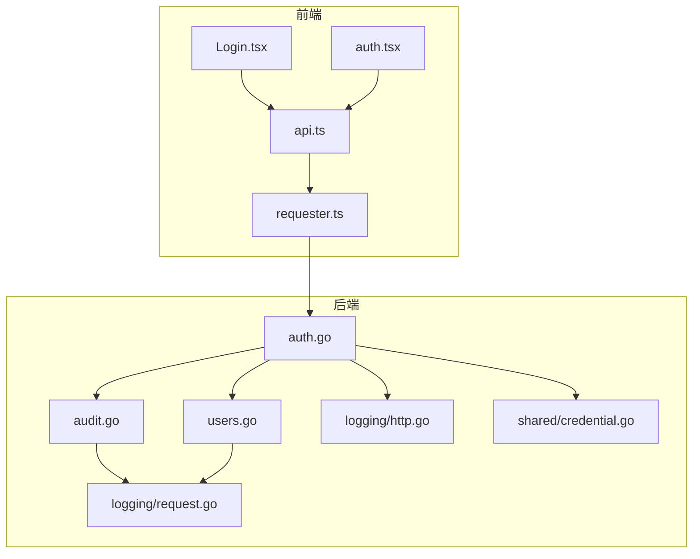
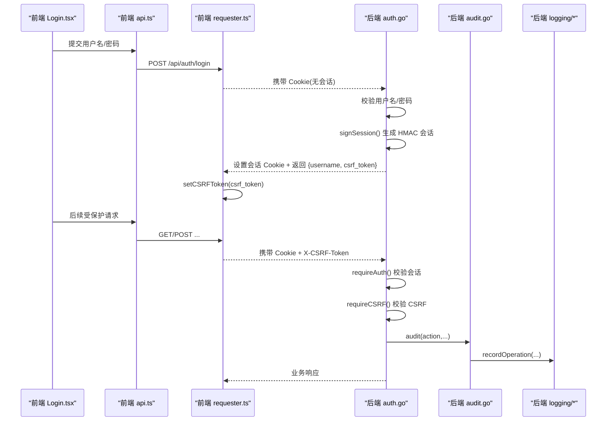
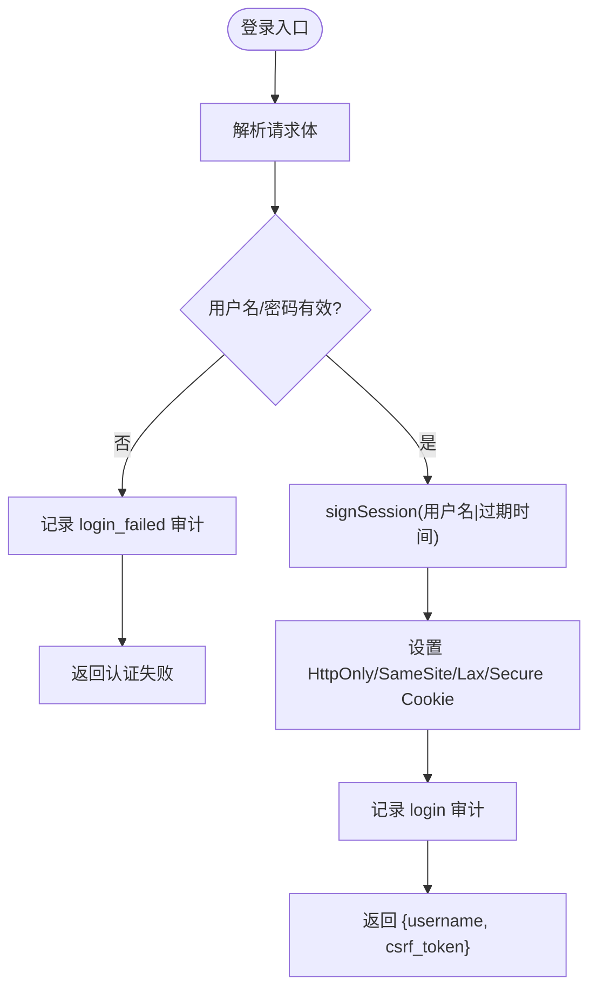
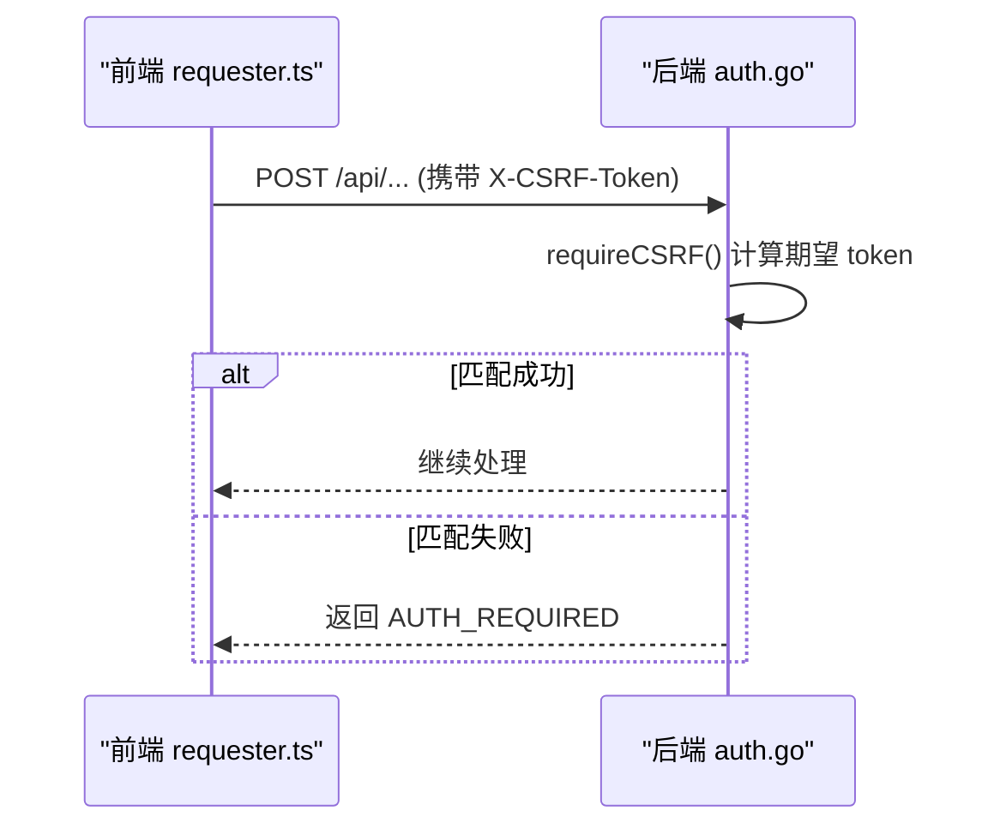
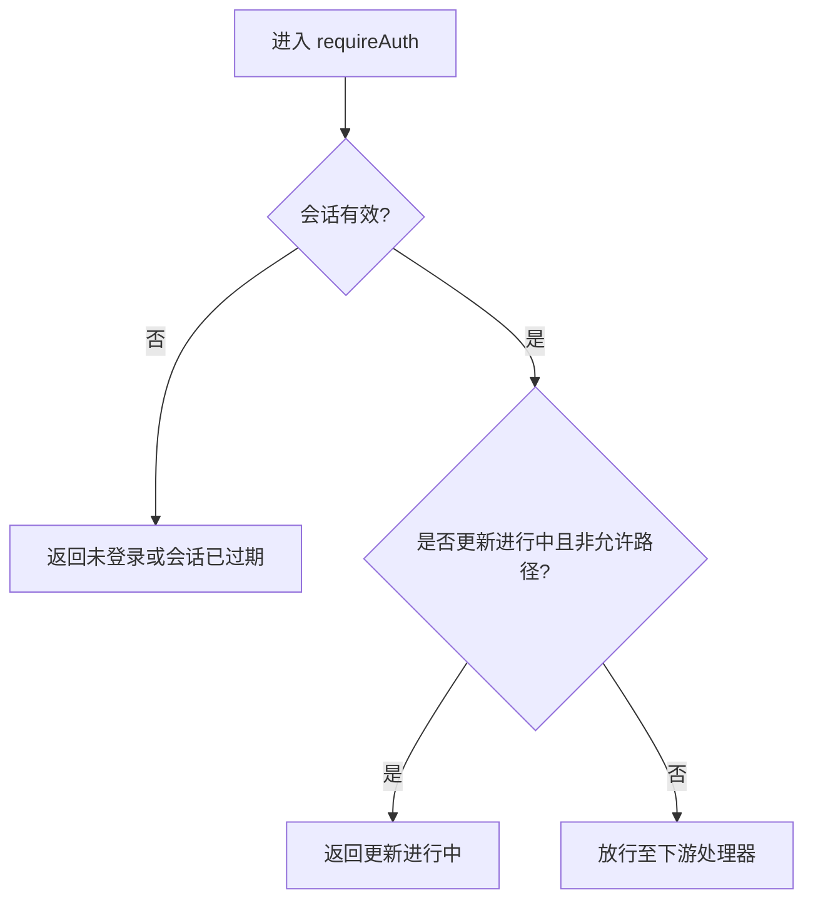
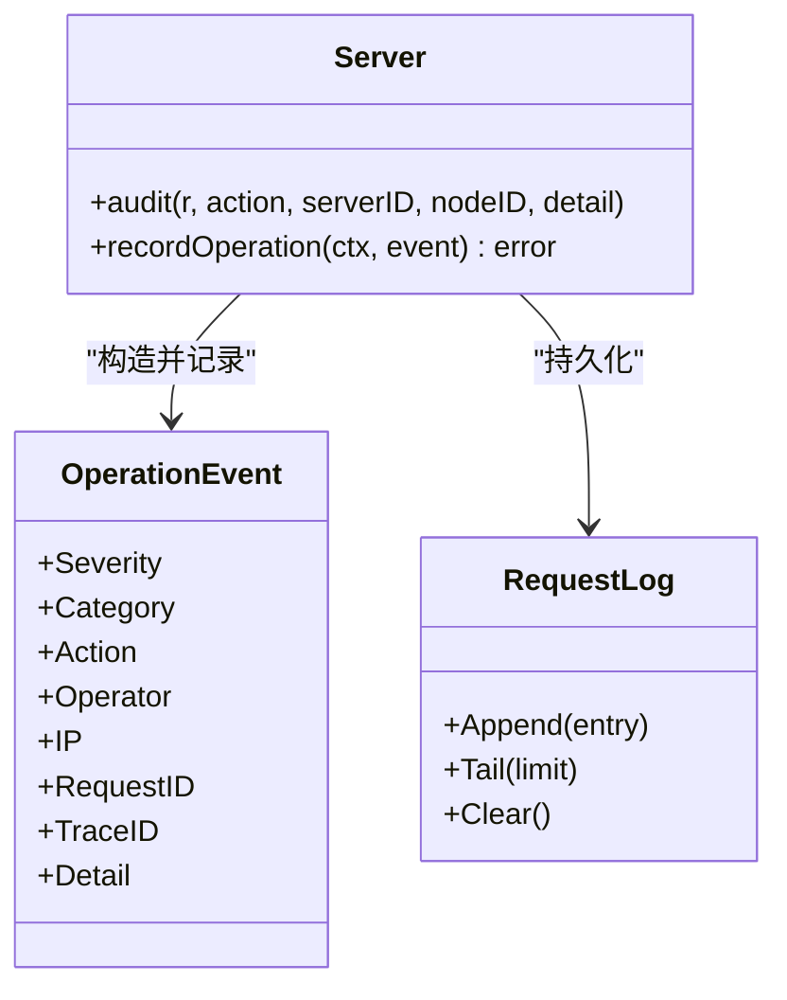
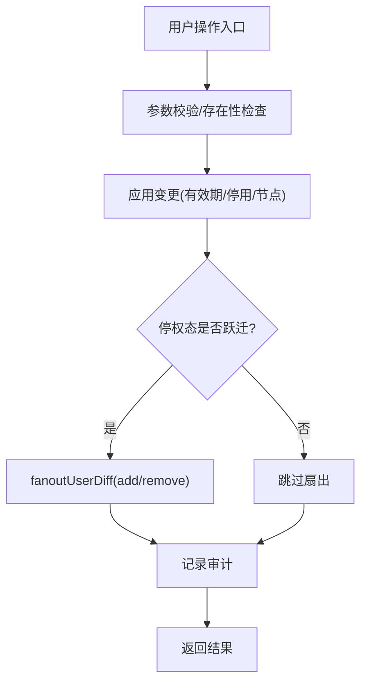
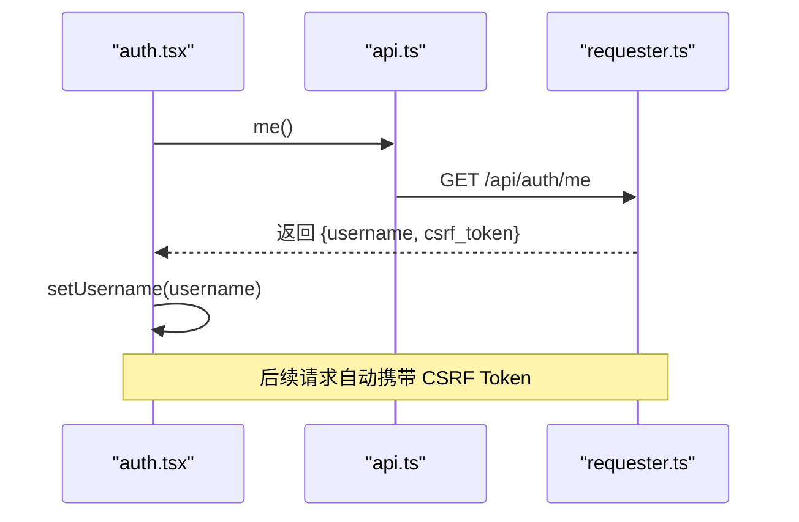
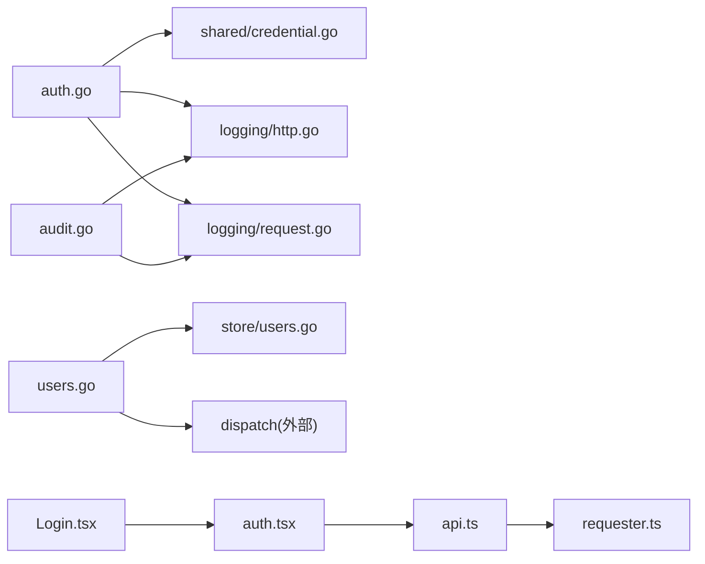

# 认证与授权

<cite>
**本文引用的文件**   
- [auth.go](file://src/backend/internal/panel/auth.go)
- [audit.go](file://src/backend/internal/panel/audit.go)
- [users.go](file://src/backend/internal/panel/users.go)
- [http.go](file://src/backend/internal/logging/http.go)
- [request.go](file://src/backend/internal/logging/request.go)
- [credential.go](file://src/shared/credential.go)
- [api.ts](file://src/frontend/src/lib/api.ts)
- [auth.tsx](file://src/frontend/src/lib/auth.tsx)
- [Login.tsx](file://src/frontend/src/pages/Login.tsx)
- [requester.ts](file://src/frontend/src/lib/requester.ts)
</cite>

## 目录
1. [简介](#简介)
2. [项目结构](#项目结构)
3. [核心组件](#核心组件)
4. [架构总览](#架构总览)
5. [详细组件分析](#详细组件分析)
6. [依赖关系分析](#依赖关系分析)
7. [性能考虑](#性能考虑)
8. [故障排查指南](#故障排查指南)
9. [结论](#结论)
10. [附录](#附录)

## 简介
本文件面向 Lattix-codex 项目的认证与授权机制，系统性说明管理员登录流程、会话管理（基于 HMAC 的签名 Cookie）、CSRF 保护、权限控制模型、登录状态管理、中间件使用与最佳实践，以及常见安全威胁防护与排障要点。文档同时覆盖前端在登录态维护、CSRF Token 注入与未授权处理方面的实现。

## 项目结构
认证与授权相关代码主要分布在后端面板模块与前端请求层：
- 后端
  - 认证与会话：auth.go（登录、登出、会话校验、CSRF、同源校验）
  - 审计日志：audit.go（操作审计分类与严重级别）
  - 用户管理：users.go（用户生命周期、节点分配、停权/恢复扇出）
  - 日志基础设施：http.go（请求日志、敏感信息脱敏、来源 IP 解析）、request.go（请求日志持久化）
  - 凭证格式：credential.go（面板实例与凭据结构）
- 前端
  - API 封装：api.ts（登录/登出/me、CSRF Token 设置）
  - 认证上下文：auth.tsx（登录态初始化、登录/登出动作）
  - 登录页面：Login.tsx（用户名密码表单提交）
  - 请求器：requester.ts（统一 fetch 封装、CSRF Token 注入、未授权回调）

**图表来源** 
- [auth.go:1-205](file://src/backend/internal/panel/auth.go#L1-L205)
- [audit.go:1-79](file://src/backend/internal/panel/audit.go#L1-L79)
- [users.go:1-461](file://src/backend/internal/panel/users.go#L1-L461)
- [http.go:1-409](file://src/backend/internal/logging/http.go#L1-L409)
- [request.go:1-527](file://src/backend/internal/logging/request.go#L1-L527)
- [credential.go:1-65](file://src/shared/credential.go#L1-L65)
- [api.ts:1-292](file://src/frontend/src/lib/api.ts#L1-L292)
- [auth.tsx:1-52](file://src/frontend/src/lib/auth.tsx#L1-L52)
- [Login.tsx:1-105](file://src/frontend/src/pages/Login.tsx#L1-L105)
- [requester.ts:1-309](file://src/frontend/src/lib/requester.ts#L1-L309)

**章节来源**
- [auth.go:1-205](file://src/backend/internal/panel/auth.go#L1-L205)
- [audit.go:1-79](file://src/backend/internal/panel/audit.go#L1-L79)
- [users.go:1-461](file://src/backend/internal/panel/users.go#L1-L461)
- [http.go:1-409](file://src/backend/internal/logging/http.go#L1-L409)
- [request.go:1-527](file://src/backend/internal/logging/request.go#L1-L527)
- [credential.go:1-65](file://src/shared/credential.go#L1-L65)
- [api.ts:1-292](file://src/frontend/src/lib/api.ts#L1-L292)
- [auth.tsx:1-52](file://src/frontend/src/lib/auth.tsx#L1-L52)
- [Login.tsx:1-105](file://src/frontend/src/pages/Login.tsx#L1-L105)
- [requester.ts:1-309](file://src/frontend/src/lib/requester.ts#L1-L309)

## 核心组件
- 管理员认证与会话
  - 登录接口：POST /api/auth/login，校验用户名与密码，成功后签发 HMAC 签名的会话 Cookie，并返回 csrf_token。
  - 会话校验：requireAuth 中间件从 Cookie 中解析并验证会话签名与过期时间，未通过则返回“未登录或会话已过期”。
  - 登出接口：POST /api/auth/logout，清除会话 Cookie。
  - 当前用户探活：GET /api/auth/me，返回 username 与 csrf_token，用于前端判断登录态。
- CSRF 保护
  - 服务端生成与校验：csrfForSession 基于会话值与 sessionSecret 计算 HMAC；requireCSRF 校验请求头 X-CSRF-Token。
  - 前端注入：requester 在 POST 请求时自动附加 X-CSRF-Token。
- 同源校验
  - requireSameOrigin 校验 Origin/Referer 与 Host 一致，HTTPS 下强制 https 协议。
- 审计与日志
  - audit 记录操作事件（含 operator、IP、RequestID、TraceID），按 action 前缀分类与严重级别。
  - 请求日志记录 HTTP 请求、RPC 码、错误摘要，并对敏感字段脱敏。
- 用户管理
  - 用户创建、更新有效期/停用、节点分配、删除等，均触发审计与必要的扇出操作。

**章节来源**
- [auth.go:1-205](file://src/backend/internal/panel/auth.go#L1-L205)
- [audit.go:1-79](file://src/backend/internal/panel/audit.go#L1-L79)
- [users.go:1-461](file://src/backend/internal/panel/users.go#L1-L461)
- [http.go:1-409](file://src/backend/internal/logging/http.go#L1-L409)
- [requester.ts:1-309](file://src/frontend/src/lib/requester.ts#L1-L309)

## 架构总览
下图展示从前端登录到后端鉴权、CSRF 校验与审计的整体调用链。

**图表来源** 
- [auth.go:67-185](file://src/backend/internal/panel/auth.go#L67-L185)
- [audit.go:12-34](file://src/backend/internal/panel/audit.go#L12-L34)
- [http.go:43-82](file://src/backend/internal/logging/http.go#L43-L82)
- [requester.ts:150-213](file://src/frontend/src/lib/requester.ts#L150-L213)
- [api.ts:59-75](file://src/frontend/src/lib/api.ts#L59-L75)

## 详细组件分析

### 管理员认证与会话管理（HMAC 签名）
- 会话密钥派生
  - sessionSecret 由 credentialKey 与固定字符串拼接后 SHA-256 得到，不持久化；修改管理员凭证即令所有会话失效。
- 会话生成与验证
  - signSession：payload 为 “用户名|过期时间戳”，以 HMAC-SHA256 签名，base64url 编码 payload 与签名，组合为 “payload.sig”。
  - verifySession：解码 payload，重算 HMAC 并与签名比对，校验过期时间，成功返回用户名。
- Cookie 安全配置
  - Name: lattix_session；Path: /；HttpOnly: true；Secure: 仅在 HTTPS（含反向代理）启用；SameSite: Lax；MaxAge: 7 天。
- 登录/登出/探活
  - handleLogin：校验失败记录审计（login_failed），成功写入 Cookie 并返回 csrf_token。
  - handleLogout：清空 Cookie（MaxAge=-1）。
  - handleMe：返回当前用户名与 csrf_token。

**图表来源** 
- [auth.go:67-109](file://src/backend/internal/panel/auth.go#L67-L109)
- [auth.go:26-38](file://src/backend/internal/panel/auth.go#L26-L38)
- [auth.go:40-65](file://src/backend/internal/panel/auth.go#L40-L65)

**章节来源**
- [auth.go:19-109](file://src/backend/internal/panel/auth.go#L19-L109)
- [auth.go:137-144](file://src/backend/internal/panel/auth.go#L137-L144)

### CSRF 保护机制
- Token 生成
  - csrfForSession：对 “csrf|sessionValue” 进行 HMAC-SHA256，返回 base64url 编码的 token。
- Token 校验
  - requireCSRF：从 Cookie 获取 sessionValue，计算期望 token，与请求头 X-CSRF-Token 比较。
- 前端注入
  - requester 在 POST 请求时自动附加 X-CSRF-Token；登录成功后 api.login 设置全局 CSRF Token。

**图表来源** 
- [auth.go:164-185](file://src/backend/internal/panel/auth.go#L164-L185)
- [requester.ts:168-176](file://src/frontend/src/lib/requester.ts#L168-L176)
- [api.ts:59-75](file://src/frontend/src/lib/api.ts#L59-L75)

**章节来源**
- [auth.go:164-185](file://src/backend/internal/panel/auth.go#L164-L185)
- [requester.ts:150-213](file://src/frontend/src/lib/requester.ts#L150-L213)
- [api.ts:59-75](file://src/frontend/src/lib/api.ts#L59-L75)

### 同源校验与访问控制
- requireSameOrigin：校验 Origin/Referer 与 Host 一致，HTTPS 下要求 https 协议。
- requireAuth：先校验会话，再在面板更新进行中限制非轮询/探活接口。

**图表来源** 
- [auth.go:146-162](file://src/backend/internal/panel/auth.go#L146-L162)
- [auth.go:187-204](file://src/backend/internal/panel/auth.go#L187-L204)

**章节来源**
- [auth.go:146-162](file://src/backend/internal/panel/auth.go#L146-L162)
- [auth.go:187-204](file://src/backend/internal/panel/auth.go#L187-L204)

### 审计与操作日志
- audit：根据 action 前缀确定类别与严重级别，记录 operator、IP、RequestID、TraceID 等。
- 请求日志：记录方法、路径、路由、属性、HTTP 状态、RPC 码、耗时、错误摘要，并对敏感字段脱敏。

**图表来源** 
- [audit.go:12-34](file://src/backend/internal/panel/audit.go#L12-L34)
- [audit.go:43-78](file://src/backend/internal/panel/audit.go#L43-L78)
- [request.go:24-52](file://src/backend/internal/logging/request.go#L24-L52)

**章节来源**
- [audit.go:12-34](file://src/backend/internal/panel/audit.go#L12-L34)
- [http.go:107-152](file://src/backend/internal/logging/http.go#L107-L152)
- [request.go:112-126](file://src/backend/internal/logging/request.go#L112-L126)

### 用户管理与权限模型
- 用户模型：包含 UUID、sub_token、有效期、到期停权标记、显式停用标记、创建时间等。
- 权限控制：
  - 有效停权态 = expired OR disabled；任一成立即视为停权。
  - 节点分配变更通过 fanoutUserDiff 增量下发 add_user/remove_user。
  - 删除用户前扇出 remove_user，再删除数据库记录。
- 审计：用户创建、更新、节点分配、删除等操作均记录审计事件。

**图表来源** 
- [users.go:176-278](file://src/backend/internal/panel/users.go#L176-L278)
- [users.go:347-379](file://src/backend/internal/panel/users.go#L347-L379)
- [users.go:381-412](file://src/backend/internal/panel/users.go#L381-L412)

**章节来源**
- [users.go:1-461](file://src/backend/internal/panel/users.go#L1-L461)
- [store/users.go:1-276](file://src/backend/internal/store/users.go#L1-L276)

### 前端登录状态与 CSRF 管理
- 登录态初始化：auth.tsx 在挂载时调用 me 接口，设置 username；未授权时清空状态。
- 登录/登出：api.login 设置 CSRF Token；api.logout 清理 CSRF Token。
- 请求器：requester 统一注入 X-Request-ID/X-Trace-ID，POST 时注入 X-CSRF-Token；AUTH_REQUIRED 触发未授权回调。

**图表来源** 
- [auth.tsx:14-26](file://src/frontend/src/lib/auth.tsx#L14-L26)
- [api.ts:59-75](file://src/frontend/src/lib/api.ts#L59-L75)
- [requester.ts:168-176](file://src/frontend/src/lib/requester.ts#L168-L176)

**章节来源**
- [auth.tsx:1-52](file://src/frontend/src/lib/auth.tsx#L1-52)
- [api.ts:59-75](file://src/frontend/src/lib/api.ts#L59-L75)
- [requester.ts:150-213](file://src/frontend/src/lib/requester.ts#L150-L213)

## 依赖关系分析
- 后端
  - auth.go 依赖 shared.credential 派生会话密钥，依赖 logging 进行审计与请求日志。
  - users.go 依赖 store 进行用户数据读写，依赖 dispatch 进行跨节点扇出。
  - audit.go 依赖 logging.OperationEvent 与 Category/Severity 映射。
- 前端
  - api.ts 依赖 requester 进行网络请求与错误处理。
  - auth.tsx 依赖 api 与 requester 的未授权回调能力。
  - Login.tsx 依赖 useAuth 与 api.login。

**图表来源** 
- [auth.go:1-205](file://src/backend/internal/panel/auth.go#L1-L205)
- [credential.go:1-65](file://src/shared/credential.go#L1-L65)
- [http.go:1-409](file://src/backend/internal/logging/http.go#L1-L409)
- [request.go:1-527](file://src/backend/internal/logging/request.go#L1-L527)
- [users.go:1-461](file://src/backend/internal/panel/users.go#L1-L461)
- [store/users.go:1-276](file://src/backend/internal/store/users.go#L1-L276)
- [api.ts:1-292](file://src/frontend/src/lib/api.ts#L1-L292)
- [auth.tsx:1-52](file://src/frontend/src/lib/auth.tsx#L1-52)
- [Login.tsx:1-105](file://src/frontend/src/pages/Login.tsx#L1-105)
- [requester.ts:1-309](file://src/frontend/src/lib/requester.ts#L1-309)

**章节来源**
- [auth.go:1-205](file://src/backend/internal/panel/auth.go#L1-L205)
- [users.go:1-461](file://src/backend/internal/panel/users.go#L1-L461)
- [audit.go:1-79](file://src/backend/internal/panel/audit.go#L1-L79)
- [http.go:1-409](file://src/backend/internal/logging/http.go#L1-L409)
- [request.go:1-527](file://src/backend/internal/logging/request.go#L1-L527)
- [credential.go:1-65](file://src/shared/credential.go#L1-L65)
- [api.ts:1-292](file://src/frontend/src/lib/api.ts#L1-L292)
- [auth.tsx:1-52](file://src/frontend/src/lib/auth.tsx#L1-52)
- [Login.tsx:1-105](file://src/frontend/src/pages/Login.tsx#L1-105)
- [requester.ts:1-309](file://src/frontend/src/lib/requester.ts#L1-309)

## 性能考虑
- 会话校验为纯内存 HMAC 计算，开销极低。
- 审计写入为旁路异步，失败不影响主流程。
- 请求日志采用队列与分段文件存储，支持限流与清理，避免阻塞请求。
- 建议在高并发场景下关注日志落盘 I/O 与队列丢弃统计。

[本节为通用指导，无需特定文件引用]

## 故障排查指南
- 登录失败
  - 检查用户名/密码是否正确；查看审计日志中的 login_failed 事件。
  - 确认后端是否处于更新锁定状态（仅允许探活与更新状态查询）。
- 会话无效或过期
  - 检查 Cookie 是否被浏览器策略拦截（HttpOnly/SameSite/Secure）。
  - 确认客户端时间与服务端时间偏差导致过期判定异常。
- CSRF 校验失败
  - 确认请求头 X-CSRF-Token 是否存在且与服务器计算的期望值一致。
  - 检查是否在登录后正确调用 api.login 设置 CSRF Token。
- 同源校验失败
  - 检查 Origin/Referer 与 Host 是否一致；HTTPS 环境下确保协议为 https。
- 审计与请求日志
  - 通过操作日志与请求日志定位问题，注意敏感字段已被脱敏。
  - 关注日志队列丢弃计数与文件大小限制。

**章节来源**
- [auth.go:67-185](file://src/backend/internal/panel/auth.go#L67-L185)
- [audit.go:12-34](file://src/backend/internal/panel/audit.go#L12-L34)
- [http.go:285-300](file://src/backend/internal/logging/http.go#L285-L300)
- [requester.ts:195-213](file://src/frontend/src/lib/requester.ts#L195-L213)

## 结论
Lattix-codex 的认证与授权体系围绕 HMAC 签名会话、严格的 CSRF 保护与同源校验构建，配合完善的审计与请求日志，形成端到端的安全闭环。前端通过统一的请求器与认证上下文简化了登录态与 CSRF 的管理。建议在部署时严格启用 Secure Cookie，合理配置 SameSite，并确保反代环境正确传递 Origin/Referer。

[本节为总结性内容，无需特定文件引用]

## 附录
- 常用接口
  - POST /api/auth/login：管理员登录，返回 username 与 csrf_token。
  - POST /api/auth/logout：登出，清除会话 Cookie。
  - GET /api/auth/me：探活，返回 username 与 csrf_token。
- 中间件使用建议
  - 对所有写操作与敏感读操作包裹 requireAuth 与 requireCSRF。
  - 对外暴露的公开接口可仅使用 requireAuth，避免不必要的 CSRF 校验。
  - 需要严格来源控制的接口额外使用 requireSameOrigin。

**章节来源**
- [auth.go:67-185](file://src/backend/internal/panel/auth.go#L67-L185)
- [requester.ts:150-213](file://src/frontend/src/lib/requester.ts#L150-L213)
- [api.ts:59-75](file://src/frontend/src/lib/api.ts#L59-L75)