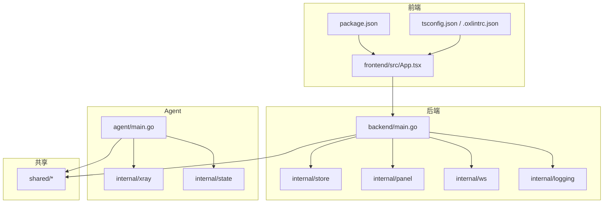
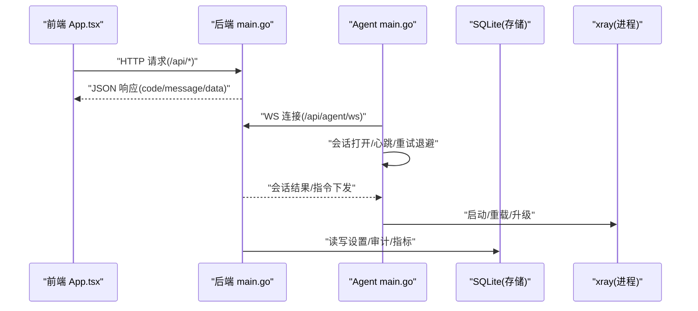
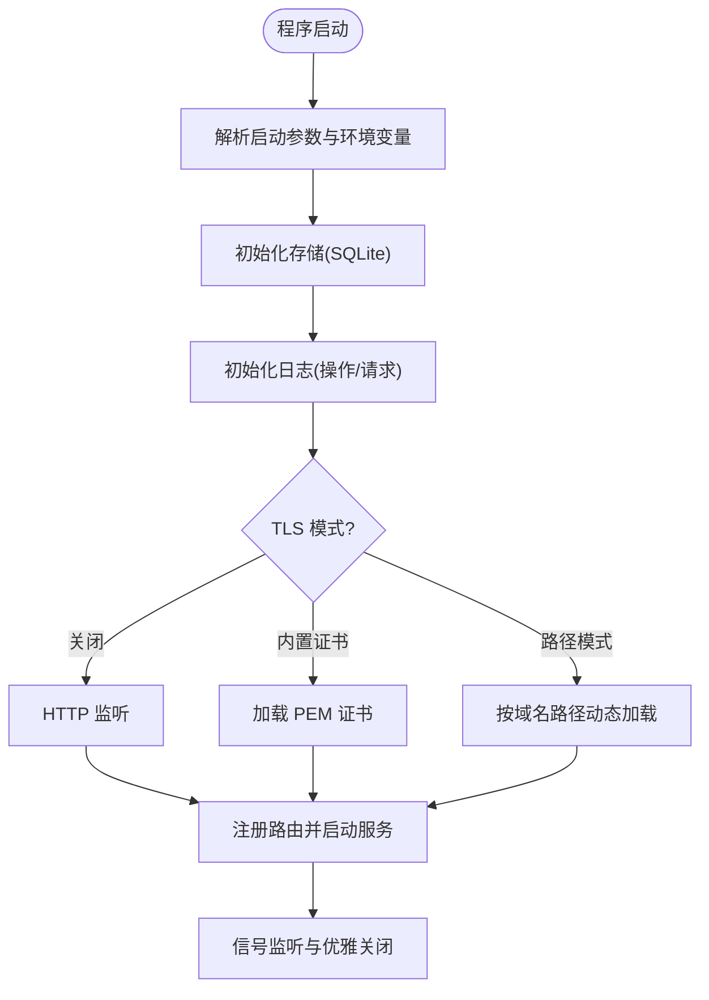
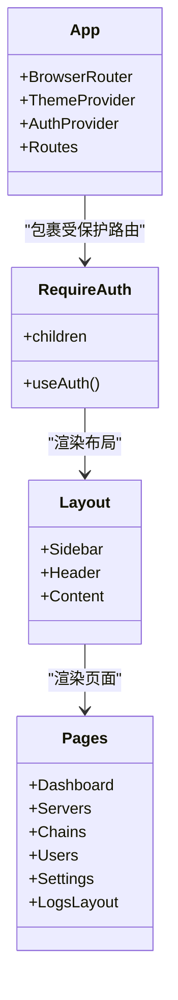
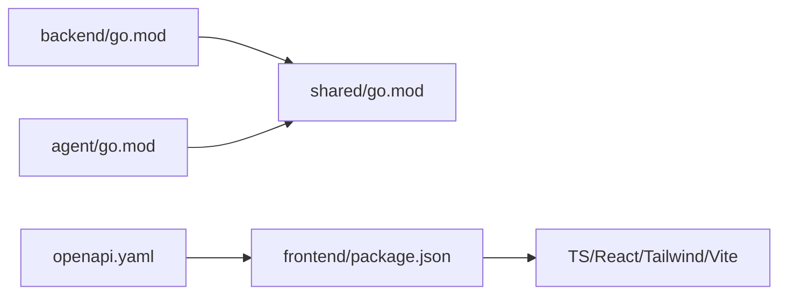

# 代码规范

<cite>
**本文引用的文件**   
- [src/backend/go.mod](file://src/backend/go.mod)
- [src/agent/go.mod](file://src/agent/go.mod)
- [src/shared/go.mod](file://src/shared/go.mod)
- [src/backend/cmd/backend/main.go](file://src/backend/cmd/backend/main.go)
- [src/agent/cmd/agent/main.go](file://src/agent/cmd/agent/main.go)
- [src/frontend/package.json](file://src/frontend/package.json)
- [src/frontend/.oxlintrc.json](file://src/frontend/.oxlintrc.json)
- [src/frontend/tsconfig.json](file://src/frontend/tsconfig.json)
- [src/frontend/vite.config.ts](file://src/frontend/vite.config.ts)
- [docs/openapi.yaml](file://docs/openapi.yaml)
</cite>

## 目录
1. [简介](#简介)
2. [项目结构](#项目结构)
3. [核心组件](#核心组件)
4. [架构总览](#架构总览)
5. [详细组件分析](#详细组件分析)
6. [依赖分析](#依赖分析)
7. [性能考量](#性能考量)
8. [故障排查指南](#故障排查指南)
9. [结论](#结论)
10. [附录](#附录)

## 简介
本规范面向 Lattix-codex 项目的 Go 与 TypeScript/React 开发，覆盖命名约定、文件组织、错误处理、并发编程、前端组件设计、状态管理、类型定义、样式规范、工具链配置（golangci-lint、Oxlint、Prettier）、注释与文档编写、代码审查清单与质量检查流程。规范以仓库现有实现为依据，确保可执行、可落地、可审计。

## 项目结构
- 后端服务：Go 模块 src/backend，提供 HTTP API、WebSocket 端点、SQLite 存储、日志与生命周期管理等。
- Agent：Go 模块 src/agent，独立二进制，通过 WebSocket 与后端通信，管理 xray 进程与配置。
- 共享库：Go 模块 src/shared，前后端与 agent 共享的数据结构与消息协议。
- 前端：TypeScript + React + Vite + Tailwind，构建产物由后端内嵌或外部静态目录提供。
- 文档与契约：OpenAPI 描述 RPC 接口；WebSocket 协议使用 JSON Schema。

**图示来源** 
- [src/backend/cmd/backend/main.go:1-200](file://src/backend/cmd/backend/main.go#L1-L200)
- [src/agent/cmd/agent/main.go:1-200](file://src/agent/cmd/agent/main.go#L1-L200)
- [src/frontend/src/App.tsx:1-73](file://src/frontend/src/App.tsx#L1-L73)
- [src/frontend/package.json:1-48](file://src/frontend/package.json#L1-L48)
- [src/frontend/tsconfig.json:1-13](file://src/frontend/tsconfig.json#L1-L13)
- [src/frontend/.oxlintrc.json:1-9](file://src/frontend/.oxlintrc.json#L1-L9)

**章节来源**
- [src/backend/go.mod:1-28](file://src/backend/go.mod#L1-L28)
- [src/agent/go.mod:1-57](file://src/agent/go.mod#L1-L57)
- [src/shared/go.mod:1-4](file://src/shared/go.mod#L1-L4)
- [src/frontend/package.json:1-48](file://src/frontend/package.json#L1-L48)
- [src/frontend/tsconfig.json:1-13](file://src/frontend/tsconfig.json#L1-L13)
- [src/frontend/.oxlintrc.json:1-9](file://src/frontend/.oxlintrc.json#L1-L9)

## 核心组件
- 后端入口与启动参数解析、TLS 配置、日志与存储初始化、HTTP/WS 路由注册、优雅关闭。
- Agent 连接建立、认证、心跳保活、重连退避、xray 进程管理与配置热更新。
- 前端应用壳、路由与鉴权守卫、主题与时区上下文、页面布局。

**章节来源**
- [src/backend/cmd/backend/main.go:1-200](file://src/backend/cmd/backend/main.go#L1-L200)
- [src/agent/cmd/agent/main.go:1-200](file://src/agent/cmd/agent/main.go#L1-L200)
- [src/frontend/src/App.tsx:1-73](file://src/frontend/src/App.tsx#L1-L73)

## 架构总览
后端提供 REST/RPC 与 WebSocket 接口，Agent 通过 WS 长连接上报遥测并接收指令，前端通过 HTTP 访问后端 API。OpenAPI 作为契约驱动前端类型生成。

**图示来源** 
- [src/backend/cmd/backend/main.go:1-200](file://src/backend/cmd/backend/main.go#L1-L200)
- [src/agent/cmd/agent/main.go:1-200](file://src/agent/cmd/agent/main.go#L1-L200)
- [docs/openapi.yaml:1-200](file://docs/openapi.yaml#L1-L200)

## 详细组件分析

### Go 编码规范（后端与 Agent）
- 命名约定
  - 包名小写、短而清晰；文件名与功能对应，避免缩写堆砌。
  - 导出标识符首字母大写，非导出小写；常量全大写蛇形；变量与函数遵循动词短语语义。
  - 结构体字段按用途分组，必要时使用空行分隔。
- 文件组织
  - cmd 下为可执行程序入口；internal 下按领域划分子包；go.mod 声明 module 与依赖替换。
  - shared 包仅暴露纯数据与通用工具，不引入业务耦合。
- 错误处理
  - 使用 errors 与 fmt.Errorf 包装错误，保持调用栈可读性；对外返回结构化 code/message。
  - 资源释放使用 defer 集中管理；对 I/O 操作设置超时与上下文取消。
- 并发编程
  - goroutine 边界清晰，使用 context 控制生命周期；避免无界 goroutine 泄漏。
  - 共享状态加锁保护；对 WebSocket 写入进行串行化（如 safeConn）。
  - 重连策略采用指数退避与上限限制，区分认证拒绝与临时不可用场景。
- 配置与环境
  - 启动参数与环境变量统一读取，敏感信息不落盘明文；证书路径统一绝对化。
- 日志与可观测性
  - 操作日志与请求日志分离，支持轮转与丢弃告警；TraceID 贯穿请求链路。

**图示来源** 
- [src/backend/cmd/backend/main.go:1-200](file://src/backend/cmd/backend/main.go#L1-L200)

**章节来源**
- [src/backend/go.mod:1-28](file://src/backend/go.mod#L1-L28)
- [src/agent/go.mod:1-57](file://src/agent/go.mod#L1-L57)
- [src/backend/cmd/backend/main.go:1-200](file://src/backend/cmd/backend/main.go#L1-L200)
- [src/agent/cmd/agent/main.go:1-200](file://src/agent/cmd/agent/main.go#L1-L200)

### TypeScript/React 编码规范（前端）
- 组件设计
  - 组件职责单一，UI 与业务逻辑解耦；使用组合优于继承；受控与非受控组件明确。
  - 公共 UI 组件位于 components/ui，业务组件位于 components；页面位于 pages。
- 状态管理
  - 局部状态使用 useState/useReducer；跨组件状态通过 Context 或轻量状态库；服务端状态通过请求层缓存与同步。
  - 鉴权状态集中管理，路由守卫统一拦截未登录访问。
- 类型定义
  - 严格 TS 编译选项；API 类型由 OpenAPI 自动生成；避免 any，使用联合类型与字面量类型。
  - 路径别名 @ 指向 src，提升可读性与引用稳定性。
- 样式规范
  - 使用 Tailwind CSS 原子类；class-variance-authority 管理变体；避免内联样式与硬编码颜色。
- 路由与导航
  - react-router-dom v7 风格；嵌套路由与懒加载结合；未匹配路由统一重定向。
- 构建与脚本
  - Vite 插件生态；代理到后端 API；构建前校验 API 类型一致性。

**图示来源** 
- [src/frontend/src/App.tsx:1-73](file://src/frontend/src/App.tsx#L1-L73)

**章节来源**
- [src/frontend/package.json:1-48](file://src/frontend/package.json#L1-L48)
- [src/frontend/tsconfig.json:1-13](file://src/frontend/tsconfig.json#L1-L13)
- [src/frontend/vite.config.ts:1-21](file://src/frontend/vite.config.ts#L1-L21)
- [src/frontend/.oxlintrc.json:1-9](file://src/frontend/.oxlintrc.json#L1-L9)
- [src/frontend/src/App.tsx:1-73](file://src/frontend/src/App.tsx#L1-L73)

### 代码格式化工具与规则
- Go 工具链
  - golangci-lint：建议启用 gofmt、govet、errcheck、staticcheck、gocritic 等规则集；CI 中强制 lint 与格式化。
  - 推荐启用 gofumpt 与 misspell；对并发与错误处理设置更严格规则。
- TypeScript/前端工具链
  - Oxlint：已启用 react、typescript、oxc 插件；rules-of-hooks 报错，only-export-components 警告允许常量导出。
  - Prettier：建议统一配置（单引号、尾逗号、行宽 120），与编辑器集成保存时自动格式化。
  - TypeScript 严格模式开启；路径别名 @ 映射至 src。
- 脚本与命令
  - 前端脚本：dev/build/lint/check:api/generate:api；构建前校验 API 类型一致性。

**章节来源**
- [src/frontend/.oxlintrc.json:1-9](file://src/frontend/.oxlintrc.json#L1-L9)
- [src/frontend/package.json:1-48](file://src/frontend/package.json#L1-L48)
- [src/frontend/tsconfig.json:1-13](file://src/frontend/tsconfig.json#L1-L13)

### 注释与文档编写规范
- 函数与包注释
  - 包级注释说明职责与边界；导出函数需有简短说明与参数/返回值含义；复杂算法附复杂度与注意事项。
- 模块文档
  - README/设计文档置于 docs；OpenAPI 与 WS Schema 作为契约维护；变更需同步更新。
- API 文档
  - OpenAPI 描述所有 REST/RPC 端点；code/message/data 信封统一；示例请求/响应包含边界情况。
- 代码内注释
  - 解释“为什么”而非“是什么”；TODO/FIXME 标注问题与责任人；避免过时注释。

**章节来源**
- [docs/openapi.yaml:1-200](file://docs/openapi.yaml#L1-L200)

### 代码审查清单与质量检查流程
- 审查清单
  - 命名与结构是否符合规范；错误是否被正确包装与传播；是否存在 goroutine 泄漏风险；并发安全是否保证。
  - 前端组件是否受控、类型是否严格；样式是否使用 Tailwind；路由守卫是否完备。
  - 配置项是否安全（敏感信息、证书路径）；日志是否脱敏且可追踪。
- 质量检查流程
  - 本地：golangci-lint run、tsc --build、oxlint、vite build。
  - CI：lint、类型检查、单元测试、端到端测试、构建产物校验。
  - 发布：OpenAPI 与 WS Schema 版本化；向后兼容检查。

[本节为通用流程说明，不直接分析具体文件]

## 依赖分析
- Go 模块依赖
  - backend 依赖 gorilla/websocket、sqlite、crypto 等；agent 依赖 grpc、websocket、xray-core 等；shared 为纯数据与协议。
  - 通过 replace 指向本地 shared，便于开发与调试。
- 前端依赖
  - React、Tailwind、Vite、Oxlint、TypeScript；脚本用于生成 API 类型与构建。

**图示来源** 
- [src/backend/go.mod:1-28](file://src/backend/go.mod#L1-L28)
- [src/agent/go.mod:1-57](file://src/agent/go.mod#L1-L57)
- [src/shared/go.mod:1-4](file://src/shared/go.mod#L1-L4)
- [src/frontend/package.json:1-48](file://src/frontend/package.json#L1-L48)
- [docs/openapi.yaml:1-200](file://docs/openapi.yaml#L1-L200)

**章节来源**
- [src/backend/go.mod:1-28](file://src/backend/go.mod#L1-L28)
- [src/agent/go.mod:1-57](file://src/agent/go.mod#L1-L57)
- [src/shared/go.mod:1-4](file://src/shared/go.mod#L1-L4)
- [src/frontend/package.json:1-48](file://src/frontend/package.json#L1-L48)
- [docs/openapi.yaml:1-200](file://docs/openapi.yaml#L1-L200)

## 性能考量
- 后端
  - SQLite 并发写入需合理设置 busy_timeout；请求日志异步落盘与大小限制；WebSocket 读超时与写超时控制。
  - TLS 证书路径模式支持热加载，避免重启；ACME 自动续期减少运维成本。
- Agent
  - 重连退避策略降低风暴；xray 进程管理最小化重启开销；配置变更增量更新。
- 前端
  - 路由懒加载与组件拆分；图片与图标按需加载；Tailwind 构建优化。

[本节为通用指导，不直接分析具体文件]

## 故障排查指南
- 连接与认证
  - Agent 首次连接需要 bootstrap token；认证拒绝时停止自动重试，提示重新绑定。
  - 面板不可用时使用专用退避策略；WS 心跳失败判定连接死亡并重试。
- 证书与 TLS
  - 路径模式下证书文件需符合命名与权限；ACME 域名需公网可达；设置页保存的证书需有效。
- 日志与审计
  - 请求日志丢弃会记录操作日志；审计日志限流与轮转；TraceID 用于链路追踪。

**章节来源**
- [src/agent/cmd/agent/main.go:1-200](file://src/agent/cmd/agent/main.go#L1-L200)
- [src/backend/cmd/backend/main.go:1-200](file://src/backend/cmd/backend/main.go#L1-L200)

## 结论
本规范基于仓库实际实现提炼，覆盖 Go 与 TypeScript/React 的关键实践，强调错误处理、并发安全、类型约束与工具链一致性。通过 OpenAPI 与 WS Schema 驱动前后端协作，配合严格的 lint 与 CI 流程，保障代码质量与可维护性。

[本节为总结，不直接分析具体文件]

## 附录
- 反模式对比（示例路径）
  - Go 错误处理：避免忽略 error 返回值；应使用 fmt.Errorf 包装并向上返回。参考：[src/backend/cmd/backend/main.go:1-200](file://src/backend/cmd/backend/main.go#L1-L200)
  - Go 并发：避免无锁共享状态；对 gorilla WS 写入加锁串行化。参考：[src/agent/cmd/agent/main.go:1-200](file://src/agent/cmd/agent/main.go#L1-L200)
  - 前端类型：避免 any；使用生成的 API 类型与严格 TS。参考：[src/frontend/package.json:1-48](file://src/frontend/package.json#L1-L48)、[src/frontend/tsconfig.json:1-13](file://src/frontend/tsconfig.json#L1-L13)
  - 前端样式：避免内联样式与硬编码颜色；使用 Tailwind 与 CVA。参考：[src/frontend/package.json:1-48](file://src/frontend/package.json#L1-L48)
  - 配置安全：避免明文密码；使用 bcrypt 哈希与环境变量注入。参考：[src/backend/cmd/backend/main.go:1-200](file://src/backend/cmd/backend/main.go#L1-L200)

[本节为补充说明，不直接分析具体文件]