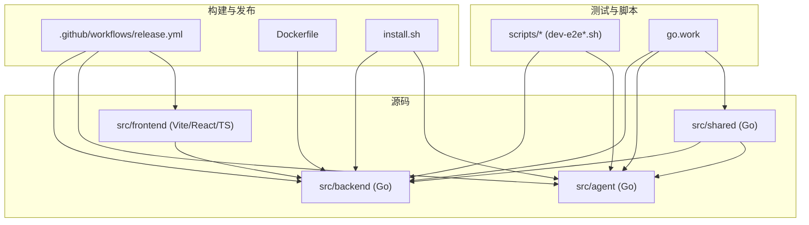
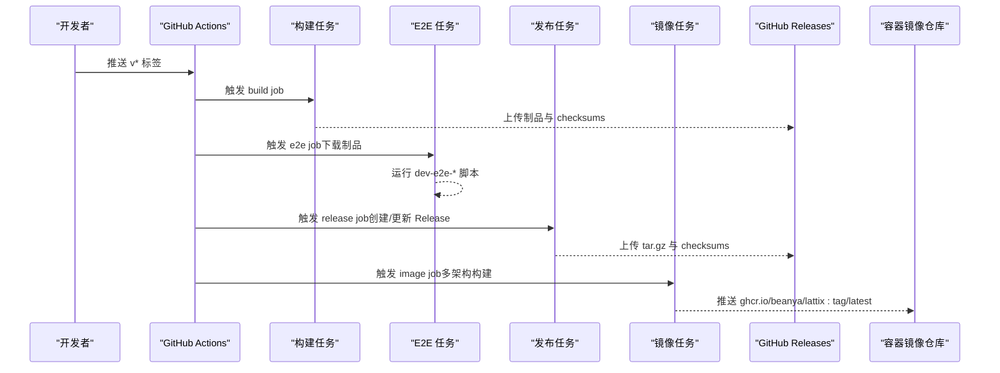
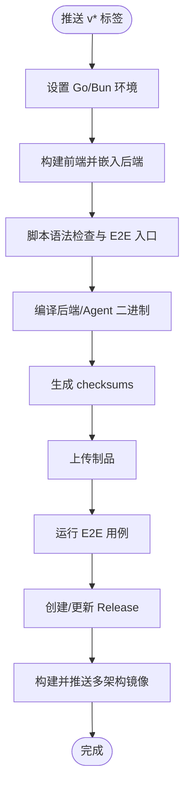
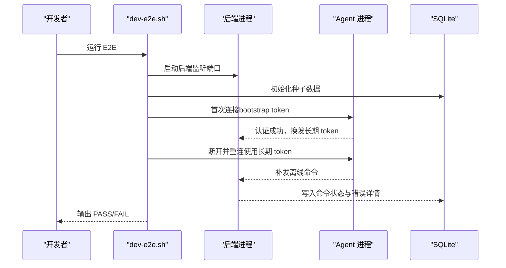
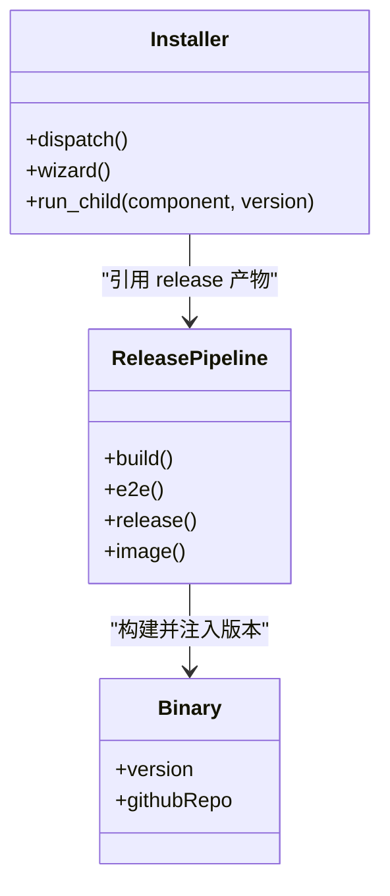
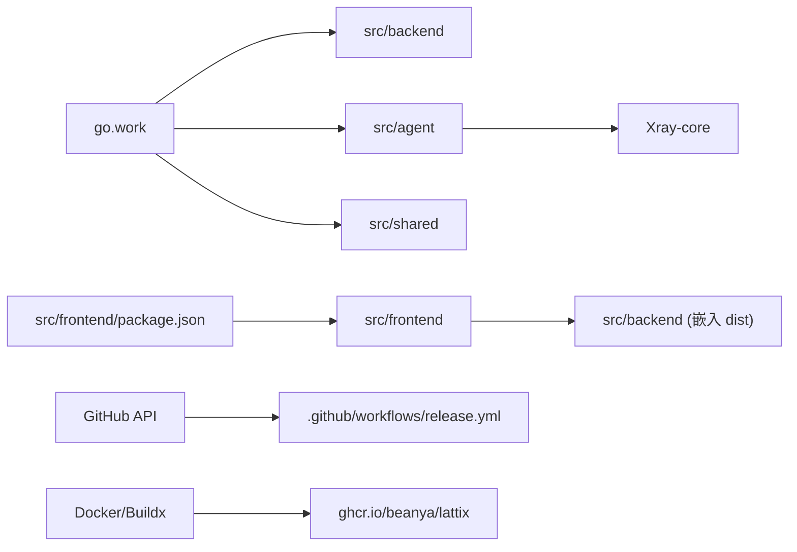

# 开发工作流

<cite>
**本文引用的文件**   
- [.github/workflows/release.yml](file://.github/workflows/release.yml)
- [go.work](file://go.work)
- [Dockerfile](file://Dockerfile)
- [AGENTS.md](file://AGENTS.md)
- [install.sh](file://install.sh)
- [src/frontend/package.json](file://src/frontend/package.json)
- [scripts/dev-e2e.sh](file://scripts/dev-e2e.sh)
- [scripts/dev-e2e-install-agent.sh](file://scripts/dev-e2e-install-agent.sh)
- [scripts/dev-e2e-install-panel.sh](file://scripts/dev-e2e-install-panel.sh)
- [docs/openapi.yaml](file://docs/openapi.yaml)
- [src/backend/internal/panel/servers.go](file://src/backend/internal/panel/servers.go)
- [src/backend/internal/panel/update.go](file://src/backend/internal/panel/update.go)
- [src/backend/internal/ws/hub.go](file://src/backend/internal/ws/hub.go)
- [src/agent/internal/xray/manager.go](file://src/agent/internal/xray/manager.go)
- [src/backend/cmd/backend/main_test.go](file://src/backend/cmd/backend/main_test.go)
- [src/frontend/.oxlintrc.json](file://src/frontend/.oxlintrc.json)
</cite>

## 目录
1. [简介](#简介)
2. [项目结构](#项目结构)
3. [核心组件](#核心组件)
4. [架构总览](#架构总览)
5. [详细组件分析](#详细组件分析)
6. [依赖分析](#依赖分析)
7. [性能考虑](#性能考虑)
8. [故障排查指南](#故障排查指南)
9. [结论](#结论)
10. [附录](#附录)

## 简介
本指南面向 Lattix-codex 项目的开发者与维护者，系统化说明分支与提交规范、代码审查与 CI/CD 流水线、测试执行策略、构建与发布流程、以及本地开发与调试效率工具。内容基于仓库中的实际配置与脚本，确保可操作与可追溯。

## 项目结构
- 多模块 Go 工程：后端 panel、agent、共享库 shared，通过 go.work 统一编排。
- 前端使用 Vite + React + TypeScript，构建产物嵌入后端二进制。
- 自动化由 GitHub Actions 驱动，触发条件为版本标签推送；包含构建、E2E、打包、镜像发布等阶段。
- 安装与运维脚本集中在 scripts 与根目录 install.sh，提供面板与 Agent 的统一入口。

**图表来源** 
- [.github/workflows/release.yml:1-216](file://.github/workflows/release.yml#L1-L216)
- [Dockerfile:1-44](file://Dockerfile#L1-L44)
- [go.work:1-10](file://go.work#L1-L10)

**章节来源**
- [go.work:1-10](file://go.work#L1-L10)
- [.github/workflows/release.yml:1-216](file://.github/workflows/release.yml#L1-L216)

## 核心组件
- 后端 Panel：HTTP API（OpenAPI 定义）、WebSocket Hub、存储层、调度器、更新检测与发布管理。
- Agent：节点生命周期管理、xray 配置热更新与回滚、遥测上报。
- 前端：SPA 页面、API 类型生成、UI 组件与主题。
- 构建与发布：GitHub Actions 流水线、Docker 多架构镜像、Release 包与校验和。
- 安装与运维：统一安装入口、子脚本分发、交互式向导。

**章节来源**
- [docs/openapi.yaml:1-200](file://docs/openapi.yaml#L1-L200)
- [src/backend/internal/ws/hub.go:360-412](file://src/backend/internal/ws/hub.go#L360-L412)
- [src/agent/internal/xray/manager.go:109-304](file://src/agent/internal/xray/manager.go#L109-L304)
- [src/frontend/package.json:1-53](file://src/frontend/package.json#L1-L53)
- [install.sh:1-146](file://install.sh#L1-L146)

## 架构总览
下图展示从前端到后端、再到 Agent 的端到端交互，以及 CI/CD 在版本标签触发时的构建与发布路径。

**图表来源** 
- [.github/workflows/release.yml:1-216](file://.github/workflows/release.yml#L1-L216)

**章节来源**
- [.github/workflows/release.yml:1-216](file://.github/workflows/release.yml#L1-L216)

## 详细组件分析

### 分支管理与合并请求流程
- 主分支保护：仓库未显式配置分支保护规则，建议启用 main 分支保护，要求至少 1 位审查者批准、状态检查通过后方可合并。
- 功能分支命名：建议使用 feature/xxx、fix/xxx、chore/xxx、release/vX.Y.Z 等前缀，保持语义清晰。
- 合并请求流程：
  - 从功能分支发起 PR 至 main。
  - 必须通过 CI（lint、单元测试、E2E）。
  - 至少一位维护者 Review 并 Approve。
  - 合并后打 tag 触发 release 流水线。

[本节为通用实践建议，不直接分析具体文件]

### 代码提交流程与提交信息规范
- 提交信息建议采用约定式提交（Conventional Commits），如 feat、fix、docs、refactor、test、chore 等前缀，便于自动生成变更日志。
- 建议在 PR 描述中关联需求或问题编号，列出影响范围与验证步骤。
- 禁止将敏感信息（密钥、证书）提交至仓库。

[本节为通用实践建议，不直接分析具体文件]

### 代码审查要求
- 关注点：
  - 接口契约一致性（OpenAPI 与路由注册）。
  - 错误处理与幂等性（例如命令重发、去重键）。
  - 安全相关（CSRF、鉴权、权限控制）。
  - 性能与资源限制（HTTP 超时、最大头大小）。
- 审查清单：
  - 是否新增/修改 OpenAPI 路径？是否同步更新 docs/openapi.yaml？
  - 是否引入新的外部依赖？是否锁定版本？
  - 是否覆盖单元测试/E2E 用例？

**章节来源**
- [docs/openapi.yaml:1-200](file://docs/openapi.yaml#L1-L200)
- [src/backend/cmd/backend/main_test.go:21-33](file://src/backend/cmd/backend/main_test.go#L21-L33)

### CI/CD 流水线详解
- 触发条件：推送以 v 开头的标签。
- 构建阶段：
  - 安装 Go/Bun，构建前端并嵌入后端。
  - 运行脚本语法检查与 E2E 入口脚本。
  - 编译 amd64/arm64 二进制，注入版本与仓库信息。
  - 生成 checksums，上传制品。
- E2E 阶段：
  - 下载制品，安装 xray-core。
  - 运行协议与面板 E2E 用例。
- 发布阶段：
  - 创建或更新 GitHub Release，上传所有产物。
- 镜像阶段：
  - 多架构 Docker 镜像构建与推送，标记 latest。

**图表来源** 
- [.github/workflows/release.yml:1-216](file://.github/workflows/release.yml#L1-L216)

**章节来源**
- [.github/workflows/release.yml:1-216](file://.github/workflows/release.yml#L1-L216)

### 测试执行流程
- 单元测试：
  - Go 测试：go test ./src/backend/... ./src/agent/... ./src/shared/...
  - 前端：TypeScript 构建与类型检查（build 脚本包含 tsc -b）。
- E2E 测试：
  - 使用 scripts/dev-e2e.sh 与 scripts/dev-e2e-install-*.sh 启动后端与 Agent，模拟认证换发、离线命令滞留与补发、状态机推进等场景。
- 报告与断言：
  - 脚本通过 grep/SQL 查询断言关键状态，失败时输出日志并退出非零码。

**图表来源** 
- [scripts/dev-e2e.sh:1-91](file://scripts/dev-e2e.sh#L1-L91)

**章节来源**
- [scripts/dev-e2e.sh:1-91](file://scripts/dev-e2e.sh#L1-L91)
- [scripts/dev-e2e-install-agent.sh:26-55](file://scripts/dev-e2e-install-agent.sh#L26-L55)
- [scripts/dev-e2e-install-panel.sh:105-126](file://scripts/dev-e2e-install-panel.sh#L105-L126)

### 构建与发布流程
- 版本管理：
  - 通过 Git 标签 vX.Y.Z 驱动构建与发布。
  - 二进制通过 ldflags 注入版本号与仓库信息，并在构建后校验版本一致性。
- 打包发布：
  - 生成 panel 与 agent 的 tar.gz 包，附带 checksums.txt。
  - GitHub Release 自动创建或更新，上传全部产物。
- 部署策略：
  - 支持 Docker 镜像（ghcr.io/beanya/lattix:tag 与 latest）。
  - 安装脚本 install.sh 解析最新 release，分派子脚本进行面板或 Agent 安装。

**图表来源** 
- [.github/workflows/release.yml:1-216](file://.github/workflows/release.yml#L1-L216)
- [install.sh:1-146](file://install.sh#L1-L146)

**章节来源**
- [.github/workflows/release.yml:1-216](file://.github/workflows/release.yml#L1-L216)
- [install.sh:1-146](file://install.sh#L1-L146)

### 开发效率工具与调试配置
- 前端开发：
  - 使用 vite dev 启动热重载。
  - 使用 oxlint 进行代码风格检查（.oxlintrc.json）。
  - 通过 generate:api 生成 API 类型，check:api 校验契约一致性。
- 后端与 Agent：
  - 使用 go work 统一管理多模块。
  - 通过 scripts/dev-e2e*.sh 快速拉起端到端环境。
- 调试建议：
  - 在本地开启 HTTP 超时与资源限制（参考 main_test 中的断言）。
  - 使用 Docker 镜像进行隔离测试，避免环境差异。

**章节来源**
- [src/frontend/package.json:1-53](file://src/frontend/package.json#L1-L53)
- [src/frontend/.oxlintrc.json:1-9](file://src/frontend/.oxlintrc.json#L1-L9)
- [go.work:1-10](file://go.work#L1-L10)
- [scripts/dev-e2e.sh:1-91](file://scripts/dev-e2e.sh#L1-L91)
- [src/backend/cmd/backend/main_test.go:21-33](file://src/backend/cmd/backend/main_test.go#L21-L33)

### 团队协作最佳实践
- 使用 AGENTS.md 中的 .worktree 规范进行并行开发，避免冲突。
- 在 PR 中明确变更范围与影响面，附测试证据。
- 对公共接口变更需同步更新 OpenAPI 文档与前端类型生成。

**章节来源**
- [AGENTS.md:1-8](file://AGENTS.md#L1-L8)
- [docs/openapi.yaml:1-200](file://docs/openapi.yaml#L1-L200)

## 依赖分析
- Go 工作区：go.work 声明了 agent、backend、shared 三个模块，统一工具链版本。
- 前端依赖：package.json 定义了运行时与开发依赖，构建脚本包含类型生成与校验。
- 外部依赖：
  - GitHub API（版本解析、Release 下载）。
  - Xray-core（Agent 侧流量转发）。
  - Docker/Buildx（多架构镜像构建）。

**图表来源** 
- [go.work:1-10](file://go.work#L1-L10)
- [src/frontend/package.json:1-53](file://src/frontend/package.json#L1-L53)
- [.github/workflows/release.yml:1-216](file://.github/workflows/release.yml#L1-L216)

**章节来源**
- [go.work:1-10](file://go.work#L1-L10)
- [src/frontend/package.json:1-53](file://src/frontend/package.json#L1-L53)
- [.github/workflows/release.yml:1-216](file://.github/workflows/release.yml#L1-L216)

## 性能考虑
- HTTP 服务器应设置合理的读写超时与最大头大小，防止慢客户端攻击。
- Agent 侧 xray 配置变更优先尝试热更新，失败则回滚并重启，保障服务可用性。
- 构建阶段启用 CGO_ENABLED=0 与 -trimpath，减小二进制体积并提升可移植性。
- 前端构建使用 --frozen-lockfile 保证依赖稳定，减少缓存失效。

**章节来源**
- [src/backend/cmd/backend/main_test.go:21-33](file://src/backend/cmd/backend/main_test.go#L21-L33)
- [src/agent/internal/xray/manager.go:109-304](file://src/agent/internal/xray/manager.go#L109-L304)
- [.github/workflows/release.yml:44-51](file://.github/workflows/release.yml#L44-L51)
- [src/frontend/package.json:1-53](file://src/frontend/package.json#L1-L53)

## 故障排查指南
- 版本不一致：
  - 检查二进制 -version 输出是否与标签一致；CI 中有版本一致性校验。
- 安装失败：
  - 使用 install.sh 的 --version 指定版本，查看子脚本返回码与日志。
- E2E 用例失败：
  - 检查后端与 Agent 日志，确认 WebSocket 连接与命令状态机推进。
- 配置漂移：
  - Agent 会检测 xray 配置漂移并修复，必要时回滚到上一份可用配置。

**章节来源**
- [.github/workflows/release.yml:53-58](file://.github/workflows/release.yml#L53-L58)
- [install.sh:1-146](file://install.sh#L1-L146)
- [scripts/dev-e2e.sh:1-91](file://scripts/dev-e2e.sh#L1-L91)
- [src/agent/internal/xray/manager.go:333-371](file://src/agent/internal/xray/manager.go#L333-L371)

## 结论
本指南基于仓库现有配置与脚本，提供了从分支管理、提交规范、代码审查、CI/CD、测试、构建发布到调试工具的完整工作流。遵循该流程可显著提升协作效率与交付质量，降低生产风险。

[本节为总结性内容，不直接分析具体文件]

## 附录
- 常用命令速查：
  - 前端开发：bun run dev
  - 前端构建：bun run build
  - 前端类型生成：bun run generate:api
  - 前端契约校验：bun run check:api
  - Go 测试：go test ./src/backend/... ./src/agent/... ./src/shared/...
  - E2E 测试：bash scripts/dev-e2e.sh
- 环境变量与配置：
  - LATX_RELEASE_BASE：覆盖 release 基址（用于镜像内 latest 解析）。
  - LATTIX_DEPLOY_MODE、LATTIX_DB、LATTIX_TLS_DIR、LATTIX_ACME_CACHE：Docker 部署相关。

**章节来源**
- [src/frontend/package.json:1-53](file://src/frontend/package.json#L1-L53)
- [src/backend/internal/panel/update.go:93-134](file://src/backend/internal/panel/update.go#L93-L134)
- [Dockerfile:33-37](file://Dockerfile#L33-L37)