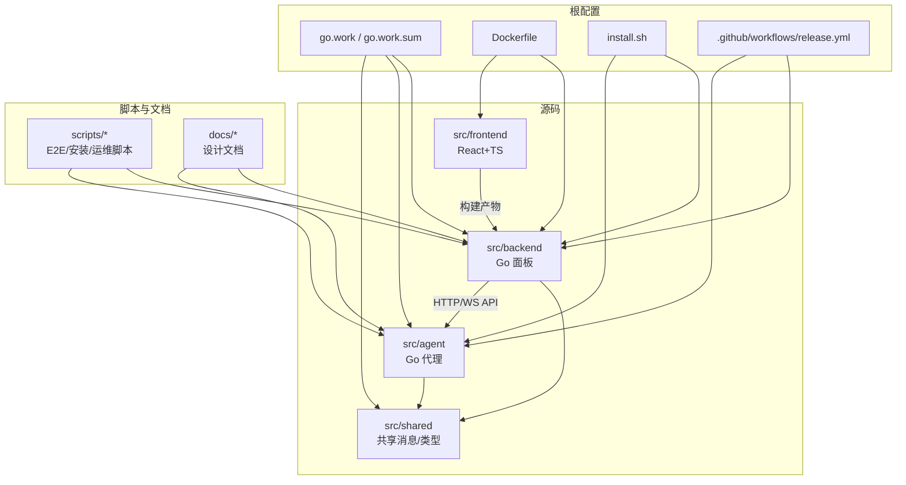
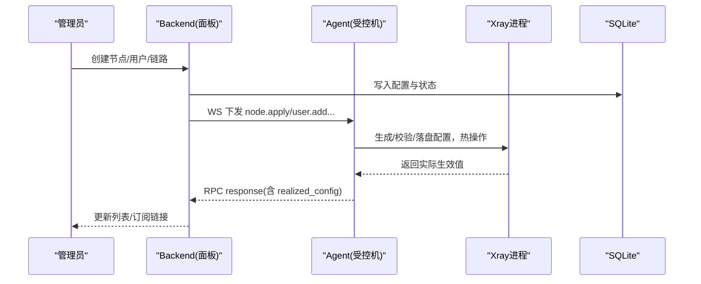
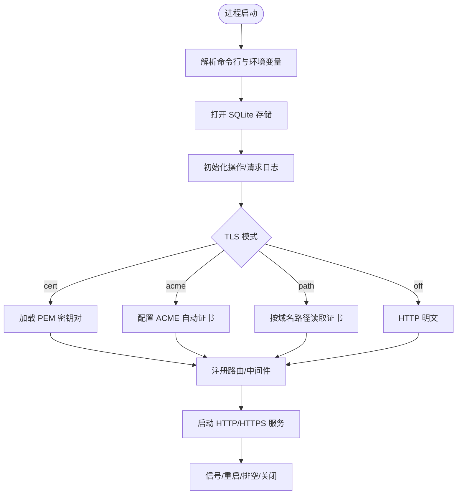
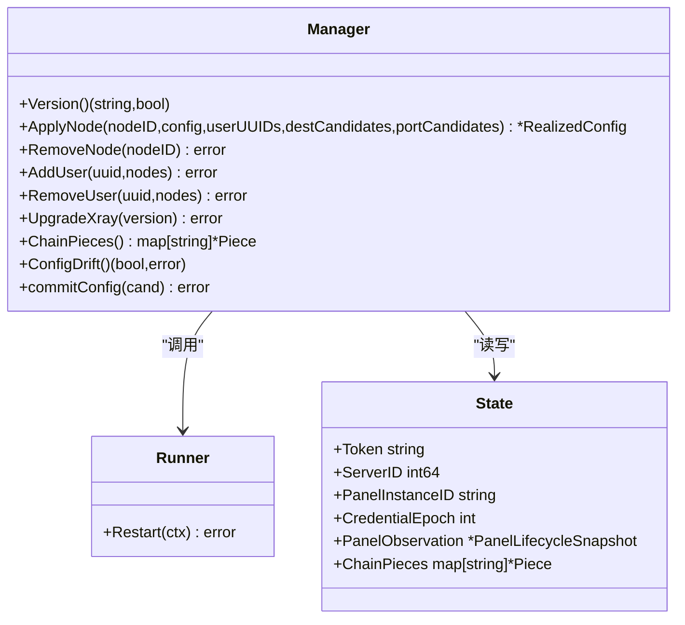
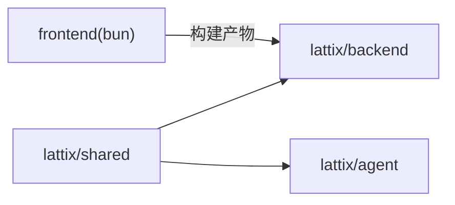
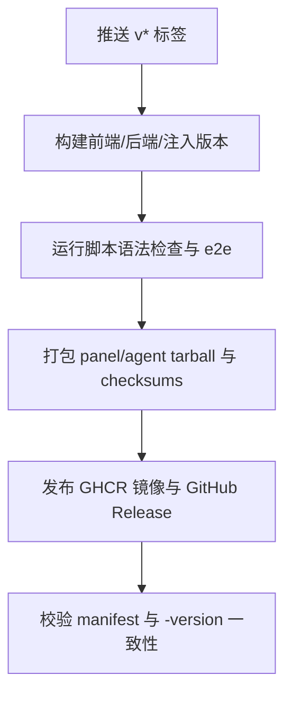

# 开发指南

<cite>
**本文引用的文件**
- [go.work](file://go.work)
- [Dockerfile](file://Dockerfile)
- [install.sh](file://install.sh)
- [AGENTS.md](file://AGENTS.md)
- [src/backend/cmd/backend/main.go](file://src/backend/cmd/backend/main.go)
- [src/agent/cmd/agent/main.go](file://src/agent/cmd/agent/main.go)
- [src/backend/go.mod](file://src/backend/go.mod)
- [src/agent/go.mod](file://src/agent/go.mod)
- [src/shared/go.mod](file://src/shared/go.mod)
- [scripts/dev-e2e.sh](file://scripts/dev-e2e.sh)
- [.github/workflows/release.yml](file://.github/workflows/release.yml)
- [README.md](file://README.md)
- [docs/framework-design.md](file://docs/framework-design.md)
- [src/frontend/package.json](file://src/frontend/package.json)
- [src/frontend/tsconfig.json](file://src/frontend/tsconfig.json)
- [src/backend/internal/store/store.go](file://src/backend/internal/store/store.go)
- [src/backend/internal/panel/settings.go](file://src/backend/internal/panel/settings.go)
- [src/agent/internal/xray/manager.go](file://src/agent/internal/xray/manager.go)
- [scripts/dev-e2e-install-panel.sh](file://scripts/dev-e2e-install-panel.sh)
- [scripts/dev-e2e-install-agent.sh](file://scripts/dev-e2e-install-agent.sh)
</cite>

## 目录
1. [简介](#简介)
2. [项目结构](#项目结构)
3. [核心组件](#核心组件)
4. [架构总览](#架构总览)
5. [详细组件分析](#详细组件分析)
6. [依赖关系分析](#依赖关系分析)
7. [性能与可观测性](#性能与可观测性)
8. [故障排查指南](#故障排查指南)
9. [扩展开发指南](#扩展开发指南)
10. [贡献与发布流程](#贡献与发布流程)
11. [附录：环境与工具清单](#附录环境与工具清单)

## 简介
本指南面向 Lattix-codex 项目的开发者，覆盖环境搭建、代码规范、模块组织、开发工作流、调试技巧、扩展开发与贡献发布等。项目由后端面板（Backend）、受控端代理（Agent）、前端 SPA（Frontend）与共享协议定义（Shared）组成，通过单条 WebSocket 长连接实现双向控制通道，SQLite 作为持久化存储。

## 项目结构
仓库采用 monorepo 组织，Go 多模块通过 go.work 统一管理；前端使用 Vite + React + TypeScript，包管理器为 bun；构建产物嵌入到后端二进制中统一分发。

**图示来源**
- [go.work:1-8](file://go.work#L1-L8)
- [Dockerfile:1-44](file://Dockerfile#L1-L44)
- [install.sh:1-146](file://install.sh#L1-L146)
- [.github/workflows/release.yml:1-216](file://.github/workflows/release.yml#L1-L216)

**章节来源**
- [README.md:94-119](file://README.md#L94-L119)
- [docs/framework-design.md:45-62](file://docs/framework-design.md#L45-L62)

## 核心组件
- 后端面板（Backend）：提供 HTTP API、WebSocket 端点、SQLite 存储、TLS/ACME、订阅与日志等能力。
- 代理（Agent）：在受控服务器上运行，主动拨出至 Backend，管理 xray 配置与生命周期，上报遥测与漂移。
- 前端（Frontend）：React SPA，Vite 构建，bun 管理依赖，构建产物嵌入后端。
- 共享（Shared）：Go module，定义 WS 信封、消息类型、虚拟配置等跨端类型。

关键入口与职责：
- 后端主程序：解析参数、初始化存储/日志/生命周期、注册路由、启动 HTTP/TLS、处理 Agent WS 与面板 API。
- 代理主程序：建立 WS 连接、会话握手、设置同步、命令处理、xray 管理、遥测与漂移检测。

**章节来源**
- [src/backend/cmd/backend/main.go:62-112](file://src/backend/cmd/backend/main.go#L62-L112)
- [src/agent/cmd/agent/main.go:33-98](file://src/agent/cmd/agent/main.go#L33-L98)

## 架构总览
系统以“单通道”为核心：Agent → Backend 的 WebSocket 长连接承担全部控制面通信；Backend 不主动外连 Agent。数据面由 xray 承载，面板仅下发虚拟配置并热操作生效。

**图示来源**
- [src/backend/cmd/backend/main.go:319-374](file://src/backend/cmd/backend/main.go#L319-L374)
- [src/agent/cmd/agent/main.go:528-666](file://src/agent/cmd/agent/main.go#L528-L666)
- [src/agent/internal/xray/manager.go:232-273](file://src/agent/internal/xray/manager.go#L232-L273)

## 详细组件分析

### 后端（Backend）
- 启动与参数：支持监听地址、数据库路径、日志目录、静态资源覆盖、管理员凭据、对外 URL、TLS/ACME、重置管理员密码等。
- TLS 模式：off/cert/acme/path（域名路径模式），支持热加载证书免重启。
- 路由与中间件：Agent WS、面板 API、健康检查、就绪检查、SPA 回退、请求日志与操作日志。
- 生命周期与排空：优雅关停、信号处理、重启协调、Hub 排空。

**图示来源**
- [src/backend/cmd/backend/main.go:69-112](file://src/backend/cmd/backend/main.go#L69-L112)
- [src/backend/cmd/backend/main.go:172-238](file://src/backend/cmd/backend/main.go#L172-L238)
- [src/backend/cmd/backend/main.go:442-472](file://src/backend/cmd/backend/main.go#L442-L472)

**章节来源**
- [src/backend/cmd/backend/main.go:62-112](file://src/backend/cmd/backend/main.go#L62-L112)
- [src/backend/internal/panel/settings.go:26-43](file://src/backend/internal/panel/settings.go#L26-L43)

### 代理（Agent）
- 连接与会话：携带 token 拨出 WS，完成 session.open/ready、凭证交换、首次 liveness。
- 命令处理：node.apply/remove、user.add/remove、xray.upgrade、agent.upgrade、uninstall 等。
- 配置落地：模板填充、dest 预检、xray run -test 校验、原子替换、热操作失败回滚。
- 遥测与漂移：周期上报主机指标与流量增量，检测配置文件漂移并上报。

**图示来源**
- [src/agent/internal/xray/manager.go:221-304](file://src/agent/internal/xray/manager.go#L221-L304)
- [src/agent/cmd/agent/main.go:528-666](file://src/agent/cmd/agent/main.go#L528-L666)

**章节来源**
- [src/agent/cmd/agent/main.go:137-231](file://src/agent/cmd/agent/main.go#L137-L231)
- [src/agent/internal/xray/manager.go:232-273](file://src/agent/internal/xray/manager.go#L232-L273)

### 前端（Frontend）
- 技术栈：Vite + React + TypeScript + shadcn/ui，bun 管理依赖。
- 构建与类型：build 包含 API 类型生成、tsc 类型检查与 vite build。
- 开发命令：dev/build/lint/preview。

**章节来源**
- [src/frontend/package.json:1-48](file://src/frontend/package.json#L1-L48)
- [src/frontend/tsconfig.json:1-13](file://src/frontend/tsconfig.json#L1-L13)

### 共享（Shared）
- Go module 定义 WS 信封、消息类型、虚拟配置等，被 backend/agent 共用，保证协议一致性。

**章节来源**
- [src/shared/go.mod:1-4](file://src/shared/go.mod#L1-L4)

## 依赖关系分析
- Go 工作区：go.work 聚合 agent/backend/shared 三个模块，便于统一构建与测试。
- 模块依赖：backend/agent 均 replace lattix/shared => ../shared，确保本地联调一致。
- 前端依赖：package.json 声明运行时与开发依赖，lock 文件入库保证可重复构建。

**图示来源**
- [go.work:1-8](file://go.work#L1-L8)
- [src/backend/go.mod:1-28](file://src/backend/go.mod#L1-L28)
- [src/agent/go.mod:1-57](file://src/agent/go.mod#L1-L57)
- [src/frontend/package.json:1-48](file://src/frontend/package.json#L1-L48)

**章节来源**
- [src/backend/go.mod:27](file://src/backend/go.mod#L27-L27)
- [src/agent/go.mod:56](file://src/agent/go.mod#L56-L56)

## 性能与可观测性
- 请求日志：分段 JSONL，容量限制，敏感字段不落日志。
- 操作日志：独立 SQLite，记录面板启停、事件告警、状态跃迁等。
- 遥测：Agent 周期上报主机指标、xray 版本/状态、流量增量；后端持久化游标计算增量。
- 健康检查：/healthz 与 /readyz，后者结合 Hub 排空与 DB Ping。

**章节来源**
- [src/backend/cmd/backend/main.go:144-170](file://src/backend/cmd/backend/main.go#L144-L170)
- [src/backend/cmd/backend/main.go:376-424](file://src/backend/cmd/backend/main.go#L376-L424)
- [docs/framework-design.md:251-266](file://docs/framework-design.md#L251-L266)

## 故障排查指南
- 认证失败：Agent 收到明确拒绝进入 auth_rejected 状态，需重新绑定新 bootstrap token。
- 离线命令补发：重连后队列 sent 未终态命令重置重发，超过次数标记 failed。
- 配置漂移：Agent 周期性比对哈希，外部修改即上报 drift；面板提供修复按钮重放 active 节点。
- TLS 问题：检查 mode/cert/acme/path 配置与端口可达性；路径模式支持热加载续期。
- 订阅异常：确认服务器 address 正确、NAT 端口段有效、用户已分配链路。

**章节来源**
- [src/agent/cmd/agent/main.go:66-98](file://src/agent/cmd/agent/main.go#L66-L98)
- [src/agent/internal/xray/manager.go:275-304](file://src/agent/internal/xray/manager.go#L275-L304)
- [src/backend/cmd/backend/main.go:172-238](file://src/backend/cmd/backend/main.go#L172-L238)

## 扩展开发指南
- 插件化传输层：Backend 侧 requester 接口隔离“发送命令”与具体传输，MVP 仅 WS 实现，后续可扩展 gRPC/HTTP。
- 自定义协议：新增消息类型走新 type，保持向后兼容；Shared 模块统一类型定义。
- 第三方集成：Webhook/Telegram 告警通道、FRANKFURTER 汇率源、xray 升级镜像基址等均可通过设置或参数扩展。

**章节来源**
- [docs/framework-design.md:40-44](file://docs/framework-design.md#L40-L44)
- [docs/framework-design.md:363-384](file://docs/framework-design.md#L363-L384)

## 贡献与发布流程
- 分支与提交：遵循 Git 工作树约定，worktrees 置于 .worktree 下并被忽略。
- 本地验证：运行 e2e 脚本集，覆盖控制通道、协议、TLS、升级、备份等场景。
- CI/CD：push v* 标签触发 release.yml，构建前后端、打包 tarball、校验 checksums、执行 e2e、发布镜像与 Release。
- 版本注入：通过 -ldflags 注入 main.version 与 githubRepo，-version 输出用于一致性校验。

**图示来源**
- [.github/workflows/release.yml:12-103](file://.github/workflows/release.yml#L12-L103)
- [.github/workflows/release.yml:147-216](file://.github/workflows/release.yml#L147-L216)

**章节来源**
- [AGENTS.md:1-8](file://AGENTS.md#L1-L8)
- [README.md:319-331](file://README.md#L319-L331)

## 附录：环境与工具清单
- Go：1.26（go.work 指定）
- Bun：用于前端依赖管理与构建
- Docker：可选，用于镜像构建与容器部署
- SQLite：modernc.org/sqlite（纯 Go 实现）
- 其他：curl、tar、sha256sum（安装与校验）

**章节来源**
- [go.work:1-8](file://go.work#L1-L8)
- [src/backend/go.mod:1-28](file://src/backend/go.mod#L1-L28)
- [src/agent/go.mod:1-57](file://src/agent/go.mod#L1-L57)
- [src/frontend/package.json:1-48](file://src/frontend/package.json#L1-L48)