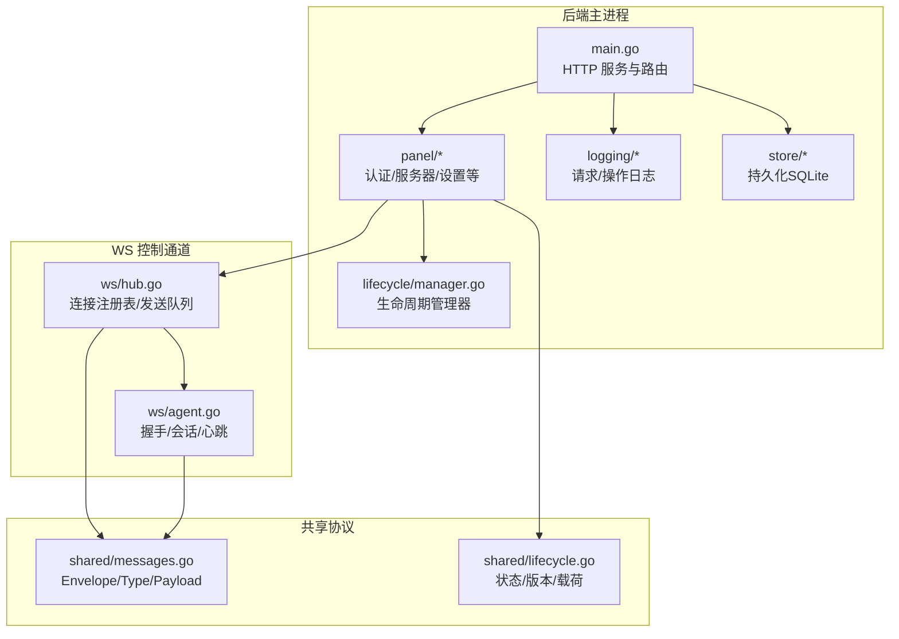
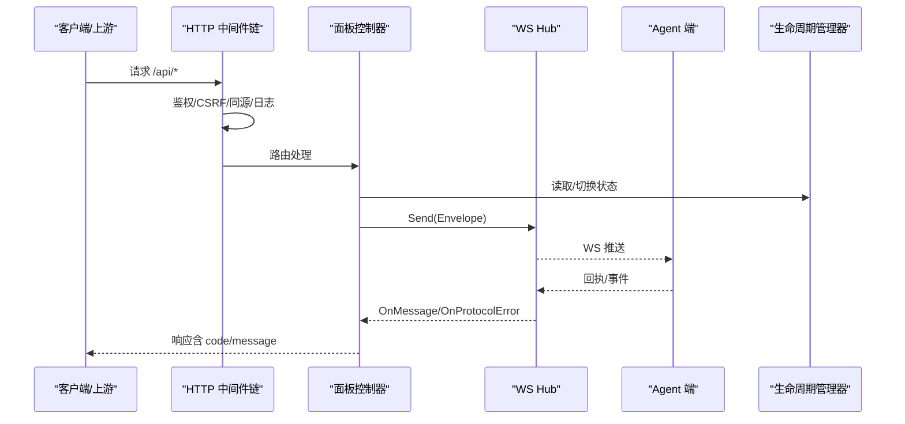
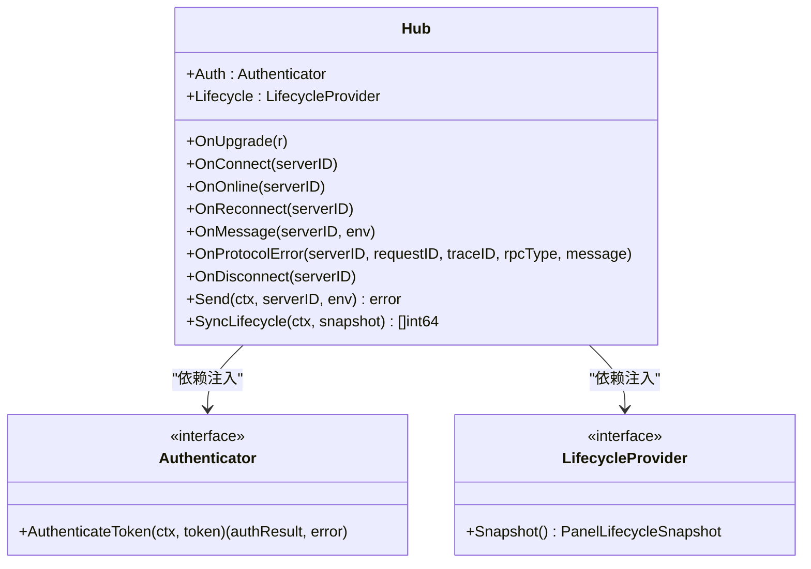
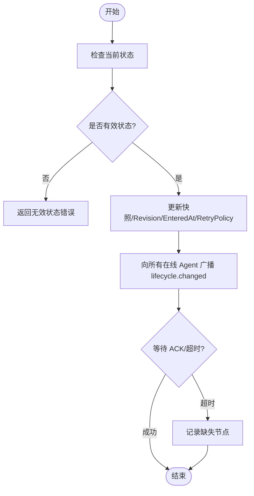
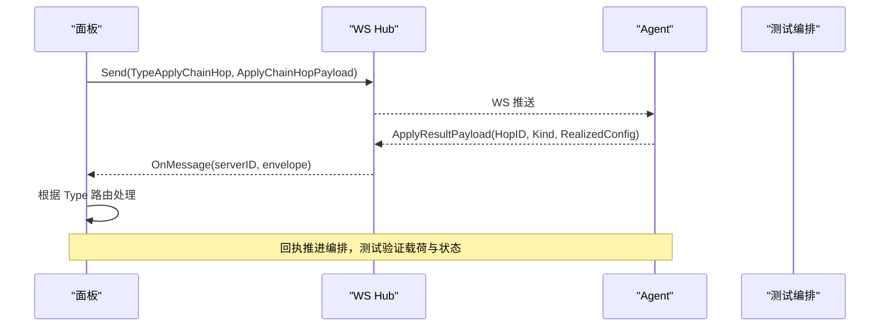
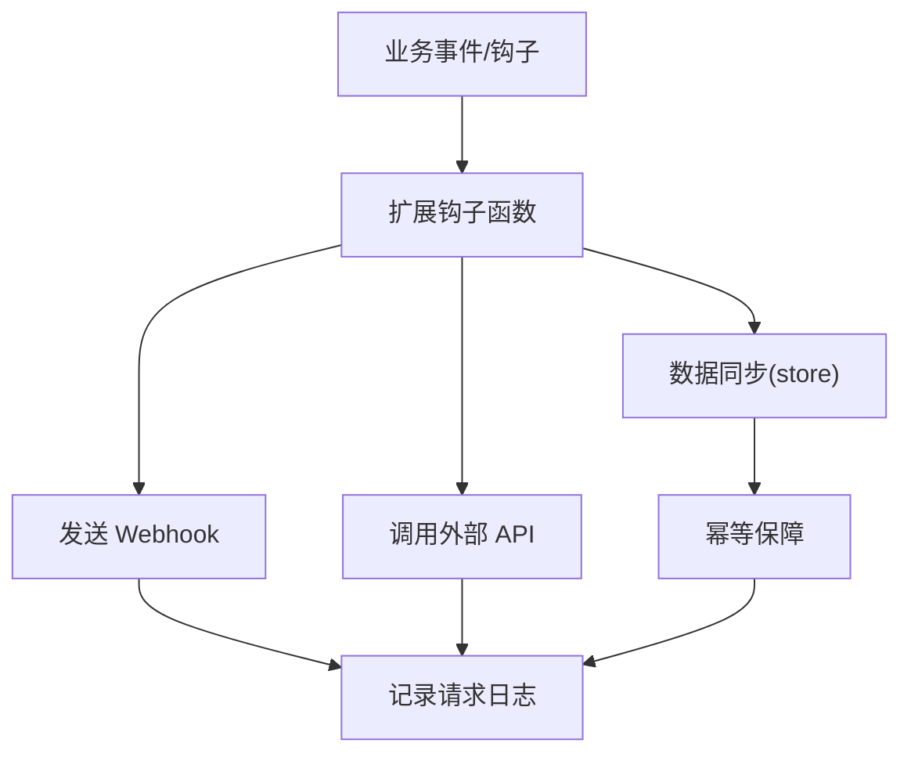
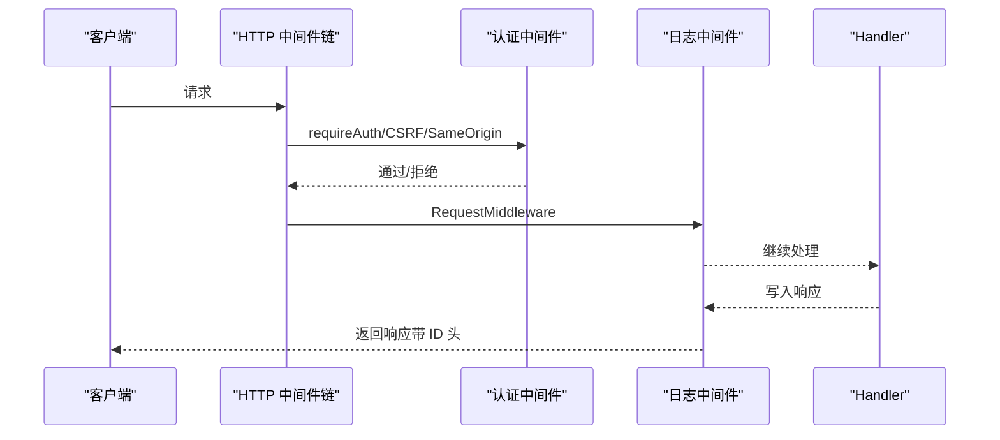
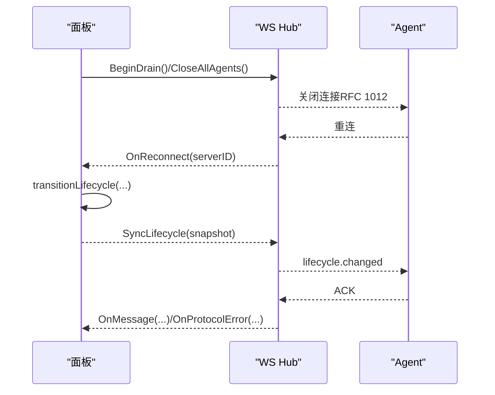
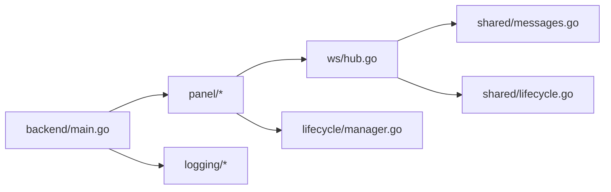

# 扩展开发

<cite>
**本文引用的文件**   
- [src/shared/messages.go](file://src/shared/messages.go)
- [src/shared/lifecycle.go](file://src/shared/lifecycle.go)
- [src/backend/internal/ws/hub.go](file://src/backend/internal/ws/hub.go)
- [src/backend/internal/ws/agent.go](file://src/backend/internal/ws/agent.go)
- [src/backend/internal/lifecycle/manager.go](file://src/backend/internal/lifecycle/manager.go)
- [src/backend/cmd/backend/main.go](file://src/backend/cmd/backend/main.go)
- [src/backend/internal/logging/context.go](file://src/backend/internal/logging/context.go)
- [src/backend/internal/logging/http.go](file://src/backend/internal/logging/http.go)
- [src/backend/internal/panel/auth.go](file://src/backend/internal/panel/auth.go)
- [src/backend/internal/panel/servers.go](file://src/backend/internal/panel/servers.go)
- [src/backend/internal/panel/lifecycle.go](file://src/backend/internal/panel/lifecycle.go)
- [src/backend/internal/dispatch/chain_test.go](file://src/backend/internal/dispatch/chain_test.go)
</cite>

## 目录
1. [简介](#简介)
2. [项目结构](#项目结构)
3. [核心组件](#核心组件)
4. [架构总览](#架构总览)
5. [详细组件分析](#详细组件分析)
6. [依赖关系分析](#依赖关系分析)
7. [性能考量](#性能考量)
8. [故障排查指南](#故障排查指南)
9. [结论](#结论)
10. [附录：扩展模板与示例](#附录扩展模板与示例)

## 简介
本指南面向希望在 Lattix-codex 中实现“插件化”能力的开发者，围绕以下目标展开：
- 插件系统架构设计：接口、生命周期管理、依赖注入
- 自定义协议实现：消息格式、处理器、序列化机制
- 第三方集成：Webhook、外部 API 调用、数据同步
- 中间件开发与注册：请求处理、认证授权、日志记录
- 扩展点使用：事件监听、钩子函数、回调机制
- 最佳实践与性能优化建议
- 完整的扩展开发示例与模板代码（以路径引用形式提供）

本项目通过统一的 RPC 信封与 WebSocket 控制通道，将面板（Panel）、调度器（Dispatcher）、Agent 连接集线器（Hub）以及 HTTP 中间件有机组合，形成可扩展的运行时。

## 项目结构
- 共享协议与类型定义位于 shared 包，确保 Panel 与 Agent 两端一致
- WS 传输与连接管理由 ws 包实现，提供 Hub、Agent 会话、心跳与错误上报
- 生命周期管理由 lifecycle 包维护，对外暴露快照与状态迁移
- HTTP 服务启动、TLS 配置、路由装配在 backend main 中完成
- 日志与上下文元数据由 logging 包提供，贯穿 HTTP 与 WS 链路
- 面板业务逻辑（认证、服务器管理等）在 panel 包内实现

**图表来源** 
- [src/backend/cmd/backend/main.go:1-200](file://src/backend/cmd/backend/main.go#L1-L200)
- [src/backend/internal/ws/hub.go:1-120](file://src/backend/internal/ws/hub.go#L1-L120)
- [src/backend/internal/ws/agent.go:31-111](file://src/backend/internal/ws/agent.go#L31-L111)
- [src/shared/messages.go:1-120](file://src/shared/messages.go#L1-L120)
- [src/shared/lifecycle.go:1-86](file://src/shared/lifecycle.go#L1-L86)

**章节来源**
- [src/backend/cmd/backend/main.go:1-200](file://src/backend/cmd/backend/main.go#L1-L200)
- [src/backend/internal/ws/hub.go:1-120](file://src/backend/internal/ws/hub.go#L1-L120)
- [src/backend/internal/ws/agent.go:31-111](file://src/backend/internal/ws/agent.go#L31-L111)
- [src/shared/messages.go:1-120](file://src/shared/messages.go#L1-L120)
- [src/shared/lifecycle.go:1-86](file://src/shared/lifecycle.go#L1-L86)

## 核心组件
- 统一 RPC 信封 Envelope：包含 kind/type/request_id/trace_id/data，支持 request/response/event 三种形态，并严格校验字段与 JSON 有效性
- 消息类型常量：session.open/ready、credential.commit、lifecycle.changed、settings.sync/changed、node.apply/remove、user.add/remove、uninstall、xray.upgrade、agent.upgrade、telemetry.report、config.drift、chain-hop.apply/remove
- WS Hub：连接注册表、发送队列、在线状态、断线重连、生命周期广播、协议错误上报
- 生命周期 Manager：状态机（startup/active/updating/faulted），快照与迁移，重试策略
- HTTP 中间件：鉴权、CSRF、同源校验、请求日志、幂等回放标记、RPC 结果码透传

**章节来源**
- [src/shared/messages.go:13-137](file://src/shared/messages.go#L13-L137)
- [src/shared/messages.go:72-91](file://src/shared/messages.go#L72-L91)
- [src/backend/internal/ws/hub.go:25-154](file://src/backend/internal/ws/hub.go#L25-L154)
- [src/backend/internal/lifecycle/manager.go:1-63](file://src/backend/internal/lifecycle/manager.go#L1-L63)
- [src/backend/internal/logging/http.go:43-82](file://src/backend/internal/logging/http.go#L43-L82)
- [src/backend/internal/panel/auth.go:197-269](file://src/backend/internal/panel/auth.go#L197-L269)

## 架构总览
下图展示扩展点如何接入：HTTP 中间件负责鉴权与日志；WS Hub 负责 Agent 连接与消息分发；Lifecycle 管理器驱动状态变更并广播；Panel 层通过接口抽象进行依赖注入，便于替换或扩展。

**图表来源** 
- [src/backend/internal/logging/http.go:43-82](file://src/backend/internal/logging/http.go#L43-L82)
- [src/backend/internal/panel/auth.go:197-269](file://src/backend/internal/panel/auth.go#L197-L269)
- [src/backend/internal/ws/hub.go:111-154](file://src/backend/internal/ws/hub.go#L111-L154)
- [src/backend/internal/ws/agent.go:31-111](file://src/backend/internal/ws/agent.go#L31-L111)
- [src/backend/internal/lifecycle/manager.go:36-51](file://src/backend/internal/lifecycle/manager.go#L36-L51)

## 详细组件分析

### 插件系统与依赖注入
- 依赖注入点
  - Hub.Auth：用于 WS 升级时的令牌认证与会话打开
  - Hub.Lifecycle：提供当前面板生命周期快照
  - Panel 对 Hub 的 CloseAgent/SyncLifecycle 等能力通过接口访问
- 扩展方式
  - 实现 Authenticator 接口（令牌校验、会话创建）
  - 实现 LifecycleProvider 接口（返回快照）
  - 在 main 组装时注入到 Hub 与 Panel

**图表来源** 
- [src/backend/internal/ws/hub.go:25-67](file://src/backend/internal/ws/hub.go#L25-L67)
- [src/shared/lifecycle.go:32-45](file://src/shared/lifecycle.go#L32-L45)

**章节来源**
- [src/backend/internal/ws/hub.go:25-67](file://src/backend/internal/ws/hub.go#L25-L67)
- [src/shared/lifecycle.go:32-45](file://src/shared/lifecycle.go#L32-L45)

### 生命周期管理与广播
- 状态机：startup → active → updating → faulted
- 迁移方法 Transition(state, fault) 更新快照并递增 revision
- 广播 SyncLifecycle：向所有在线 Agent 发送 lifecycle.changed，等待 ACK 或超时
- 面板侧 handlePanelState 暴露快照查询；transitionLifecycle 触发同步

**图表来源** 
- [src/backend/internal/lifecycle/manager.go:36-51](file://src/backend/internal/lifecycle/manager.go#L36-L51)
- [src/backend/internal/ws/hub.go:322-378](file://src/backend/internal/ws/hub.go#L322-L378)
- [src/backend/internal/panel/lifecycle.go:23-43](file://src/backend/internal/panel/lifecycle.go#L23-L43)

**章节来源**
- [src/backend/internal/lifecycle/manager.go:1-63](file://src/backend/internal/lifecycle/manager.go#L1-L63)
- [src/backend/internal/ws/hub.go:322-378](file://src/backend/internal/ws/hub.go#L322-L378)
- [src/backend/internal/panel/lifecycle.go:1-43](file://src/backend/internal/panel/lifecycle.go#L1-L43)

### 自定义协议实现（消息格式、处理器、序列化）
- 消息格式：Envelope（kind/type/request_id/trace_id/data），MarshalJSON 保证 response 携带 code/message
- 序列化：strictUnmarshal 禁止未知字段，Validate 校验必填字段与 JSON 合法性
- 处理器：Hub.OnMessage 上抛业务信封；Panel 根据 Type 分派处理；测试用例演示 chain-hop 命令与回执流程

**图表来源** 
- [src/shared/messages.go:13-45](file://src/shared/messages.go#L13-L45)
- [src/backend/internal/ws/agent.go:302-329](file://src/backend/internal/ws/agent.go#L302-L329)
- [src/backend/internal/dispatch/chain_test.go:115-231](file://src/backend/internal/dispatch/chain_test.go#L115-L231)

**章节来源**
- [src/shared/messages.go:13-137](file://src/shared/messages.go#L13-L137)
- [src/backend/internal/ws/agent.go:302-329](file://src/backend/internal/ws/agent.go#L302-L329)
- [src/backend/internal/dispatch/chain_test.go:115-231](file://src/backend/internal/dispatch/chain_test.go#L115-L231)

### 第三方集成（Webhook、外部 API、数据同步）
- Webhook：可在 Panel 的业务处理器中发起 HTTP 请求（例如审计事件、告警通知），结合 logging 的 RequestMeta 注入 trace_id 以便追踪
- 外部 API：通过标准 http.Client 调用，建议在 Panel 层封装为可插拔的服务提供者（依赖注入）
- 数据同步：利用 store 接口进行读写，结合幂等性保障（如 ReserveIdempotencyRecord）避免重复执行

[此图为概念流程图，不直接映射具体源码文件]

### 中间件开发与注册（请求处理、认证授权、日志记录）
- 认证授权：requireAuth/requireCSRF/requireSameOrigin 中间件保护 API；登录/登出与会话签名
- 日志记录：RequestMiddleware 生成 X-Request-ID/X-Trace-ID，捕获响应状态与字节数，WebSocket 升级单独记录
- 优雅停机：drainMiddleware 在面板重启期间拒绝新请求并返回 ServiceUnavailable

**图表来源** 
- [src/backend/internal/panel/auth.go:197-269](file://src/backend/internal/panel/auth.go#L197-L269)
- [src/backend/internal/logging/http.go:43-82](file://src/backend/internal/logging/http.go#L43-L82)
- [src/backend/cmd/backend/main.go:586-604](file://src/backend/cmd/backend/main.go#L586-L604)

**章节来源**
- [src/backend/internal/panel/auth.go:197-269](file://src/backend/internal/panel/auth.go#L197-L269)
- [src/backend/internal/logging/http.go:43-82](file://src/backend/internal/logging/http.go#L43-L82)
- [src/backend/cmd/backend/main.go:586-604](file://src/backend/cmd/backend/main.go#L586-L604)

### 扩展点使用示例（事件监听、钩子函数、回调机制）
- WS 事件回调：Hub.OnOnline/OnReconnect/OnDisconnect/OnMessage/OnProtocolError
- 生命周期回调：Panel.transitionLifecycle 触发后通过 syncer 接口广播
- 服务器管理回调：旋转 Token 时 CloseAgent 强制断开旧连接

**图表来源** 
- [src/backend/internal/ws/hub.go:156-173](file://src/backend/internal/ws/hub.go#L156-L173)
- [src/backend/internal/panel/lifecycle.go:23-43](file://src/backend/internal/panel/lifecycle.go#L23-L43)
- [src/backend/internal/panel/servers.go:361-383](file://src/backend/internal/panel/servers.go#L361-L383)

**章节来源**
- [src/backend/internal/ws/hub.go:156-173](file://src/backend/internal/ws/hub.go#L156-L173)
- [src/backend/internal/panel/lifecycle.go:23-43](file://src/backend/internal/panel/lifecycle.go#L23-L43)
- [src/backend/internal/panel/servers.go:361-383](file://src/backend/internal/panel/servers.go#L361-L383)

## 依赖关系分析
- Panel 依赖 Hub 进行 WS 通信，依赖 LifecycleManager 获取/切换状态
- Hub 依赖 shared.Envelope 与 shared.LifecycleSnapshot 作为协议与状态载体
- HTTP 中间件依赖 logging.RequestMiddleware 与 panel 的 requireAuth/CSRF
- 测试用例通过 store 与 dispatcher 模拟 chain-hop 编排，验证载荷与回执

**图表来源** 
- [src/backend/cmd/backend/main.go:1-200](file://src/backend/cmd/backend/main.go#L1-L200)
- [src/backend/internal/ws/hub.go:1-120](file://src/backend/internal/ws/hub.go#L1-L120)
- [src/shared/messages.go:1-120](file://src/shared/messages.go#L1-L120)
- [src/shared/lifecycle.go:1-86](file://src/shared/lifecycle.go#L1-L86)

**章节来源**
- [src/backend/cmd/backend/main.go:1-200](file://src/backend/cmd/backend/main.go#L1-L200)
- [src/backend/internal/ws/hub.go:1-120](file://src/backend/internal/ws/hub.go#L1-L120)
- [src/shared/messages.go:1-120](file://src/shared/messages.go#L1-L120)
- [src/shared/lifecycle.go:1-86](file://src/shared/lifecycle.go#L1-L86)

## 性能考量
- WS 写超时与缓冲：writeTimeout=10s，sendBuffer=256，满则断开慢连接并重连补发
- 心跳与存活：Agent 每 30s Ping，Panel 90s 无字节判定死亡
- 批量广播：SyncLifecycle 并发等待 ACK，超时收集缺失节点
- 日志裁剪：safeValue/截断策略限制敏感字段与参数大小，避免大负载
- 幂等与去重：ReserveIdempotencyRecord 防止重复执行，CompleteIdempotencyRecord 完成回填

**章节来源**
- [src/backend/internal/ws/hub.go:16-23](file://src/backend/internal/ws/hub.go#L16-L23)
- [src/backend/internal/ws/hub.go:111-154](file://src/backend/internal/ws/hub.go#L111-L154)
- [src/backend/internal/ws/hub.go:322-378](file://src/backend/internal/ws/hub.go#L322-L378)
- [src/backend/internal/logging/http.go:252-290](file://src/backend/internal/logging/http.go#L252-L290)

## 故障排查指南
- WS 协议错误：protocolError 上报 requestID/traceID/rpcType/message，便于定位
- 连接状态：ConnectionStateNeverConnected/Connecting/Reconnecting/Online/Offline/AuthRejected
- 生命周期异常：PanelStateFaulted 时拒绝业务命令；BeginDrain 优雅停机
- 认证失败：AUTH_REQUIRED/AUTH_INVALID_CREDENTIALS；CSRF 校验失败
- 日志定位：X-Request-ID/X-Trace-ID 贯穿 HTTP 与 WS，配合 RequestMiddleware 输出

**章节来源**
- [src/backend/internal/ws/agent.go:287-300](file://src/backend/internal/ws/agent.go#L287-L300)
- [src/shared/lifecycle.go:11-20](file://src/shared/lifecycle.go#L11-L20)
- [src/backend/internal/ws/hub.go:156-173](file://src/backend/internal/ws/hub.go#L156-L173)
- [src/backend/internal/panel/auth.go:197-269](file://src/backend/internal/panel/auth.go#L197-L269)
- [src/backend/internal/logging/http.go:43-82](file://src/backend/internal/logging/http.go#L43-L82)

## 结论
Lattix-codex 通过统一的信封协议、WS Hub 连接管理、生命周期状态机与完善的中间件体系，提供了清晰的扩展点与良好的可观测性。开发者可以基于这些基础能力实现插件式扩展、自定义协议处理器、第三方集成与中间件，同时借助日志与幂等机制保障稳定性与性能。

## 附录：扩展模板与示例
- 自定义协议处理器模板
  - 参考消息类型与载荷定义：[src/shared/messages.go:72-91](file://src/shared/messages.go#L72-L91)
  - 参考回执处理流程：[src/backend/internal/dispatch/chain_test.go:115-231](file://src/backend/internal/dispatch/chain_test.go#L115-L231)
- 第三方集成模板
  - 在 Panel 处理器中调用外部 API，结合 logging.SetRPCOutcome 与 SetIdempotencyReplayed：[src/backend/internal/logging/context.go:45-56](file://src/backend/internal/logging/context.go#L45-L56)
- 中间件模板
  - 鉴权与 CSRF：[src/backend/internal/panel/auth.go:197-269](file://src/backend/internal/panel/auth.go#L197-L269)
  - 请求日志与 WS 升级记录：[src/backend/internal/logging/http.go:43-105](file://src/backend/internal/logging/http.go#L43-L105)
- 生命周期广播模板
  - 状态迁移与广播：[src/backend/internal/lifecycle/manager.go:36-51](file://src/backend/internal/lifecycle/manager.go#L36-L51)，[src/backend/internal/ws/hub.go:322-378](file://src/backend/internal/ws/hub.go#L322-L378)