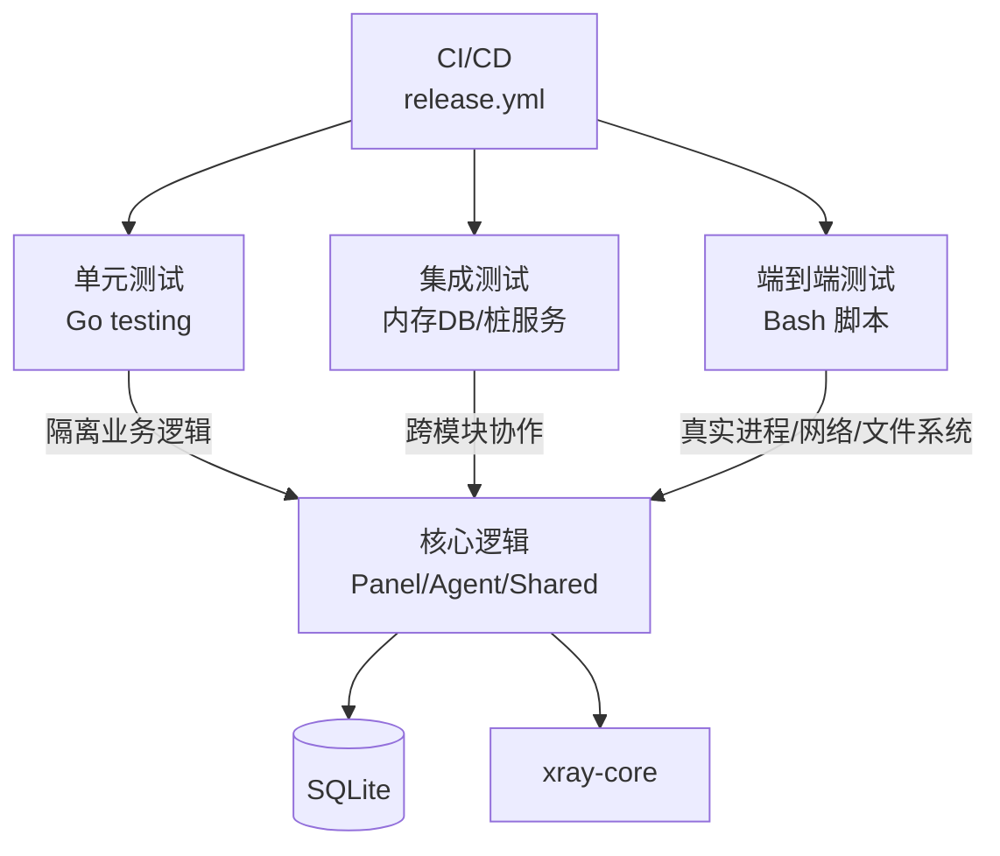
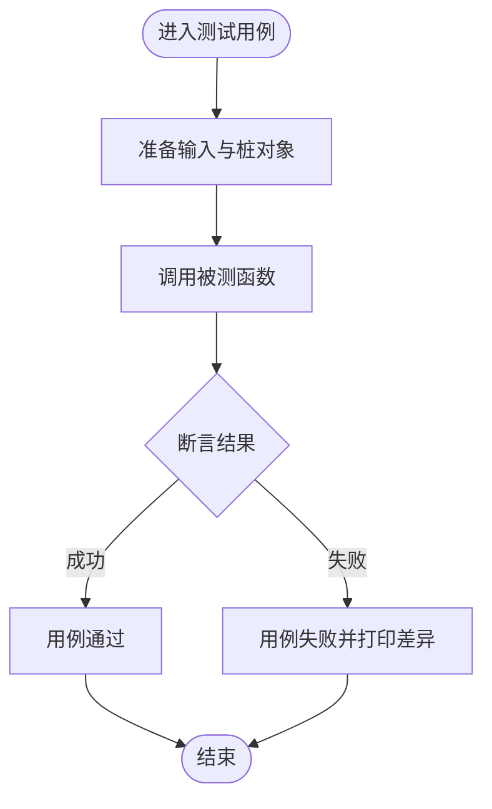
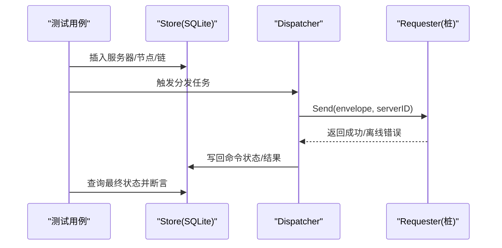
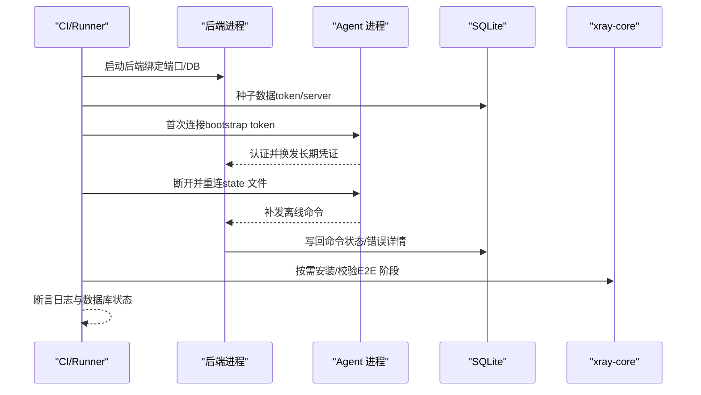
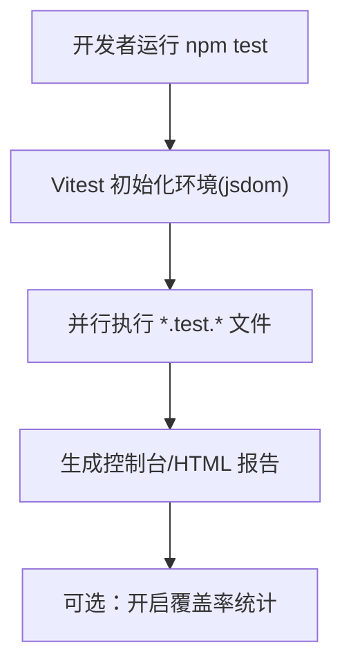
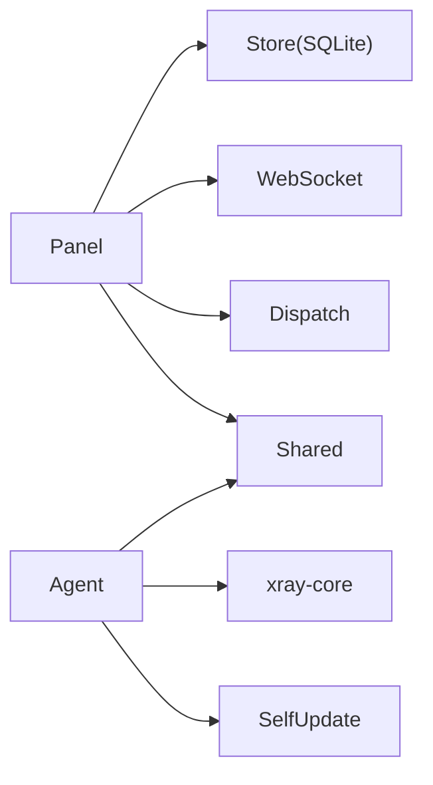
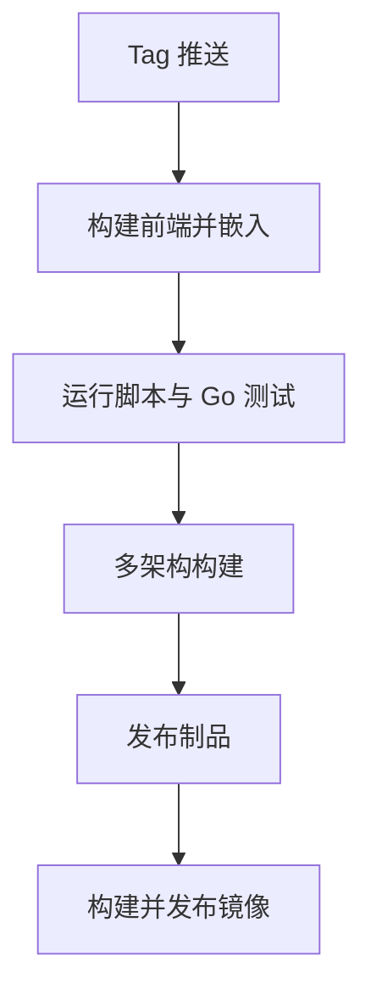

# 测试策略

<cite>
**本文引用的文件**   
- [release.yml](file://.github/workflows/release.yml)
- [dev-e2e.sh](file://scripts/dev-e2e.sh)
- [dev-e2e-install-panel.sh](file://scripts/dev-e2e-install-panel.sh)
- [dev-e2e-install-agent.sh](file://scripts/dev-e2e-install-agent.sh)
- [dev-e2e-vlessenc.sh](file://scripts/dev-e2e-vlessenc.sh)
- [dev-e2e-settings.sh](file://scripts/dev-e2e-settings.sh)
- [package.json](file://src/frontend/package.json)
- [vite.config.ts](file://src/frontend/vite.config.ts)
- [go.mod (backend)](file://src/backend/go.mod)
- [go.mod (agent)](file://src/agent/go.mod)
- [telemetry_test.go](file://src/agent/cmd\agent\telemetry_test.go)
- [servers_install_test.go](file://src/backend/internal\panel\servers_install_test.go)
- [idempotency_test.go](file://src/backend/internal\store\idempotency_test.go)
- [chain_test.go](file://src/backend/internal\dispatch\chain_test.go)
- [contract_test.go](file://src/backend/internal\panel\contract_test.go)
- [manager.go](file://src/agent/internal\xray\manager.go)
</cite>

## 目录
1. [简介](#简介)
2. [项目结构](#项目结构)
3. [核心组件](#核心组件)
4. [架构总览](#架构总览)
5. [详细组件分析](#详细组件分析)
6. [依赖分析](#依赖分析)
7. [性能考虑](#性能考虑)
8. [故障排查指南](#故障排查指南)
9. [结论](#结论)
10. [附录](#附录)

## 简介
本文件为 Lattix-codex 项目的全面测试策略与指南，覆盖测试金字塔（单元测试、集成测试、端到端测试）、测试框架使用（Go testing、Bun/Vitest）、测试数据管理（内存数据库、Mock 服务、fixtures）、自动化执行（CI/CD、覆盖率、报告）、性能与压力测试（基准、负载、剖析），以及最佳实践与常见模式。内容基于仓库现有实现与脚本进行归纳与扩展建议，确保读者既能快速上手，也能按工程化标准持续演进。

## 项目结构
Lattix-codex 采用多模块 Go 工程与前端 Vite+React 的组合：
- Go 后端与 Agent 分别位于 src/backend 与 src/agent，共享代码在 src/shared
- 前端位于 src/frontend，构建产物由 CI 嵌入后端静态资源
- 测试以 Go 原生 testing 为主，E2E 通过 Bash 脚本驱动真实二进制与 SQLite 数据库
- CI 流程定义在 .github/workflows/release.yml，包含构建、测试、打包与发布

```mermaid
graph TB
subgraph "后端"
BMain["cmd/backend/main.go"]
BPanel["internal/panel/*"]
BStore["internal/store/*"]
BDispatch["internal/dispatch/*"]
BWS["internal/ws/*"]
end
subgraph "Agent"
AMain["cmd/agent/main.go"]
AXRay["internal/xray/*"]
ASelf["internal/selfupdate/*"]
end
subgraph "共享"
Shared["shared/*"]
end
subgraph "前端"
FE["src/frontend/*"]
end
subgraph "测试与脚本"
Tests["*_test.go"]
E2E["scripts/dev-e2e*.sh"]
end
subgraph "CI"
CI[".github/workflows/release.yml"]
end
BMain --> BPanel
BPanel --> BStore
BPanel --> BDispatch
BPanel --> BWS
AMain --> AXRay
AMain --> ASelf
BPanel --> Shared
AMain --> Shared
FE --> BMain
Tests --> BPanel
Tests --> BStore
Tests --> BDispatch
Tests --> AMain
E2E --> BMain
E2E --> AMain
CI --> Tests
CI --> E2E
```

图表来源
- [release.yml](file://.github/workflows/release.yml)
- [vite.config.ts](file://src/frontend/vite.config.ts)

章节来源
- [release.yml](file://.github/workflows/release.yml)
- [package.json](file://src/frontend/package.json)
- [vite.config.ts](file://src/frontend/vite.config.ts)

## 核心组件
- 后端面板（Panel）：HTTP API、路由注册、鉴权、计费、设置、节点与链管理、WebSocket 通信、存储层（SQLite）
- Agent：与 Panel 的 WebSocket 控制通道、Xray 配置生成与热更新、自更新、遥测采集
- 共享库：消息体、端口、生命周期等公共类型与工具
- 前端：Vite + React，代理到后端 /api 与 /sub

测试现状概览
- 单元测试：Go testing 广泛覆盖业务逻辑（如遥测聚合、幂等性、分发链路、OpenAPI 契约一致性）
- 集成测试：通过内存 SQLite 或临时 DB 验证持久化与事务语义
- 端到端测试：Bash 脚本启动真实后端与 Agent，校验认证换发、命令补发、安装流程、TLS 热加载等

章节来源
- [go.mod (backend)](file://src/backend/go.mod)
- [go.mod (agent)](file://src/agent/go.mod)
- [telemetry_test.go](file://src/agent/cmd\agent\telemetry_test.go)
- [idempotency_test.go](file://src/backend/internal\store\idempotency_test.go)
- [chain_test.go](file://src/backend/internal\dispatch\chain_test.go)
- [contract_test.go](file://src/backend/internal\panel\contract_test.go)

## 架构总览
下图展示测试金字塔在各层的职责与交互关系，以及关键外部依赖（SQLite、xray-core）。



图表来源
- [release.yml](file://.github/workflows/release.yml)
- [dev-e2e.sh](file://scripts/dev-e2e.sh)

章节来源
- [release.yml](file://.github/workflows/release.yml)
- [dev-e2e.sh](file://scripts/dev-e2e.sh)

## 详细组件分析

### 单元测试策略与实践
- 目标：以最小成本验证函数与方法的正确性、边界条件与错误路径
- 常用模式
  - 纯函数与数据结构：直接断言输入输出
  - 并发与状态机：构造可控上下文与锁保护，验证状态迁移
  - 外部依赖：使用接口桩（如 fakeRequester）替代真实网络/系统调用
- 示例参考
  - 遥测计数器聚合：验证不同来源的流量计数归一化与合并
  - 安装命令拼接：校验参数注入与默认值行为
  - 幂等性记录：创建、重复创建冲突、完成写入响应体、二次完成拒绝



章节来源
- [telemetry_test.go](file://src/agent/cmd\agent\telemetry_test.go)
- [servers_install_test.go](file://src/backend/internal\panel\servers_install_test.go)
- [idempotency_test.go](file://src/backend/internal\store\idempotency_test.go)
- [chain_test.go](file://src/backend/internal\dispatch\chain_test.go)

### 集成测试策略与实践
- 目标：验证模块间协作、存储语义、事务与一致性
- 常用模式
  - 内存数据库：Open(":memory:") 或临时文件 DB，保证用例隔离
  - 桩/模拟：对网络请求、文件系统、外部二进制进行可控替换
  - 场景编排：先建基础数据，再触发业务流程，最后校验最终状态
- 示例参考
  - 分发链路：构造 entry/mid/exit 三跳拓扑，验证信封下发与在线状态
  - OpenAPI 契约：读取 docs/openapi.yaml，比对已注册路由，防止漂移



图表来源
- [chain_test.go](file://src/backend/internal\dispatch\chain_test.go)
- [idempotency_test.go](file://src/backend/internal\store\idempotency_test.go)

章节来源
- [chain_test.go](file://src/backend/internal\dispatch\chain_test.go)
- [contract_test.go](file://src/backend/internal\panel\contract_test.go)

### 端到端测试策略与实践
- 目标：以真实二进制与依赖（SQLite、xray-core）验证完整用户旅程
- 常用模式
  - 临时工作目录：mktemp -d，清理 trap，避免污染环境
  - 子进程管理：后台启动后端/Agent，等待就绪后发起操作
  - 数据种子：python3 sqlite3 脚本初始化必要行
  - 断言日志与数据库：grep 日志关键字，SQL 查询状态机推进
- 典型脚本
  - dev-e2e.sh：认证换发、离线命令滞留与重连补发、状态回写
  - dev-e2e-install-panel.sh：假 release 安装、checksum 校验、latx 管理命令
  - dev-e2e-install-agent.sh：Agent 连接、state 文件换发、版本/状态检查
  - dev-e2e-vlessenc.sh：协议与加密端到端验证
  - dev-e2e-settings.sh：设置页、管理员改密、TLS 域名路径模式与证书热加载



图表来源
- [dev-e2e.sh](file://scripts/dev-e2e.sh)
- [dev-e2e-install-panel.sh](file://scripts/dev-e2e-install-panel.sh)
- [dev-e2e-install-agent.sh](file://scripts/dev-e2e-install-agent.sh)
- [dev-e2e-vlessenc.sh](file://scripts/dev-e2e-vlessenc.sh)
- [dev-e2e-settings.sh](file://scripts/dev-e2e-settings.sh)

章节来源
- [dev-e2e.sh](file://scripts/dev-e2e.sh)
- [dev-e2e-install-panel.sh](file://scripts/dev-e2e-install-panel.sh)
- [dev-e2e-install-agent.sh](file://scripts/dev-e2e-install-agent.sh)
- [dev-e2e-vlessenc.sh](file://scripts/dev-e2e-vlessenc.sh)
- [dev-e2e-settings.sh](file://scripts/dev-e2e-settings.sh)

### 前端测试策略（Vitest/Bun）
- 现状：当前 package.json 未定义 test 脚本；可引入 Vitest 作为 Jest 兼容的轻量选择
- 建议
  - 新增 scripts.test 与 vitest.config.ts，启用 jsdom 环境
  - 针对 UI 组件编写渲染与交互测试（按钮点击、表单校验、弹窗）
  - 针对 API 客户端封装进行 Mock 请求与响应断言
  - 利用 Vite 的 proxy 配置在本地联调时指向后端开发实例



章节来源
- [package.json](file://src/frontend/package.json)
- [vite.config.ts](file://src/frontend/vite.config.ts)

### 配置与依赖
- Go 模块：backend 与 agent 均 replace shared，便于本地开发与测试
- 前端构建：Vite 插件与别名配置，支持开发代理到后端

章节来源
- [go.mod (backend)](file://src/backend/go.mod)
- [go.mod (agent)](file://src/agent/go.mod)
- [vite.config.ts](file://src/frontend/vite.config.ts)

## 依赖分析
- 组件耦合
  - Panel 依赖 Store（SQLite）、WS（WebSocket）、Dispatch（命令分发）
  - Agent 依赖 Xray（配置校验与热更新）、SelfUpdate（自更新）
  - 共享库被前后端复用，降低重复实现
- 外部依赖
  - SQLite：用于轻量级持久化与测试隔离
  - xray-core：Agent 侧配置校验与转发能力
- 潜在风险
  - 对外部二进制（xray）强依赖可能导致 E2E 不稳定，需做好降级与超时处理
  - 文件系统权限与路径差异影响 Agent 配置落盘与热加载



图表来源
- [manager.go](file://src/agent/internal\xray\manager.go)

章节来源
- [manager.go](file://src/agent/internal\xray\manager.go)

## 性能考虑
- 基准测试（Go benchmark）
  - 对热点函数（如遥测聚合、配置渲染、哈希计算）添加 _test.go 中的 BenchmarkXxx
  - 使用 go test -bench=. -benchmem 评估时间与内存分配
- 负载测试
  - 使用 wrk/k6 对 /api 与 /sub 接口进行并发压测，关注 QPS、延迟分布与错误率
  - 结合 SQLite 的 WAL 模式与连接池优化吞吐
- 性能剖析
  - 使用 pprof 对后端与 Agent 进行 CPU/Memory 剖析，定位热点与泄漏
  - 针对 Xray 配置校验路径，减少临时文件 IO 与字符串拼接

章节来源
- [telemetry_test.go](file://src/agent/cmd\agent\telemetry_test.go)
- [manager.go](file://src/agent/internal\xray\manager.go)

## 故障排查指南
- 常见问题
  - 认证失败：检查 bootstrap token 是否一致、state 文件是否损坏或被篡改
  - 命令未补发：确认 Agent 离线期间命令状态为 queued/sent，重连后应重试
  - TLS 热加载失败：证书路径与文件名需符合 tls_mode=path 约定
  - 安装校验失败：checksums.txt 与实际包不一致将中止安装
- 调试技巧
  - 查看后端/Agent 日志关键字（如 authenticated、apply_node、failed）
  - 使用 python3 sqlite3 直接查询命令与节点状态
  - 在 dev 模式下通过 LATX_DEV=1 跳过 systemd，简化排障

章节来源
- [dev-e2e.sh](file://scripts/dev-e2e.sh)
- [dev-e2e-install-panel.sh](file://scripts/dev-e2e-install-panel.sh)
- [dev-e2e-install-agent.sh](file://scripts/dev-e2e-install-agent.sh)
- [dev-e2e-settings.sh](file://scripts/dev-e2e-settings.sh)

## 结论
本项目已形成以 Go testing 为核心的单元测试体系，辅以丰富的 Bash E2E 脚本覆盖关键用户旅程。建议在保持现有稳定性的基础上，逐步引入前端 Vitest 测试、Go 基准测试与覆盖率收集，并将更多 E2E 场景纳入 CI 流水线，形成“快反馈、广覆盖、高可信”的测试闭环。

## 附录

### 自动化测试执行流程（CI/CD）
- 触发：tag v* 推送
- 步骤：
  - 构建前端并嵌入后端静态资源
  - 运行脚本语法检查与 E2E 入口脚本
  - 执行 Go 测试（backend/agent/shared）
  - 多架构构建与版本一致性校验
  - 打包发布与镜像构建



图表来源
- [release.yml](file://.github/workflows/release.yml)

章节来源
- [release.yml](file://.github/workflows/release.yml)

### 测试数据管理最佳实践
- 使用内存 SQLite 或临时文件 DB，确保用例隔离与快速清理
- 通过 python3 脚本集中维护种子数据，避免硬编码
- 对不可变 fixtures（如 OpenAPI 文档、证书模板）置于 docs 或 fixtures 目录，配合契约测试

章节来源
- [idempotency_test.go](file://src/backend/internal\store\idempotency_test.go)
- [contract_test.go](file://src/backend/internal\panel\contract_test.go)

### 常见测试模式与示例路径
- 桩对象：fakeRequester 捕获发送信封与在线状态
  - 参考：[chain_test.go](file://src/backend/internal\dispatch\chain_test.go)
- 状态机推进：命令从 sent → failed，节点状态机回写错误详情
  - 参考：[dev-e2e.sh](file://scripts/dev-e2e.sh)
- 配置校验与回滚：xray 配置校验失败丢弃，成功则备份旧配置并原子替换
  - 参考：[manager.go](file://src/agent/internal\xray\manager.go)

章节来源
- [chain_test.go](file://src/backend/internal\dispatch\chain_test.go)
- [dev-e2e.sh](file://scripts/dev-e2e.sh)
- [manager.go](file://src/agent/internal\xray\manager.go)