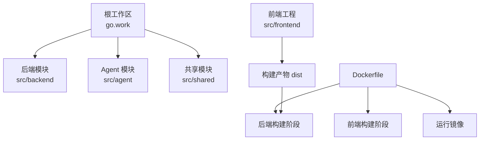
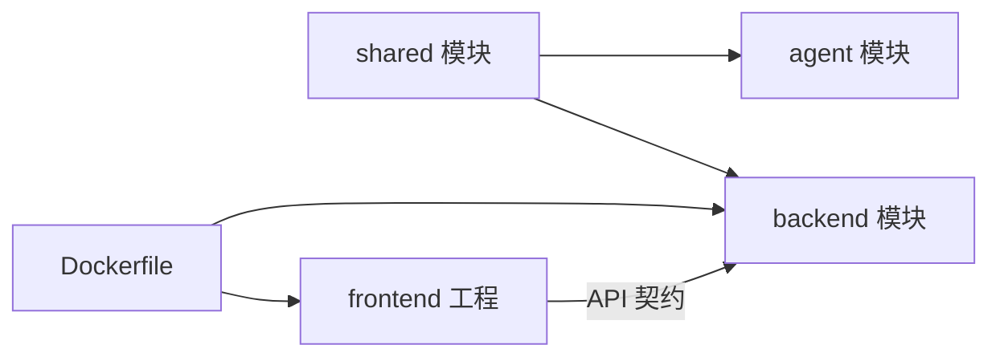

# 环境搭建

<cite>
**本文引用的文件**   
- [go.work](file://go.work)
- [Dockerfile](file://Dockerfile)
- [src/frontend/package.json](file://src/frontend/package.json)
- [src/agent/go.mod](file://src/agent/go.mod)
- [src/backend/go.mod](file://src/backend/go.mod)
- [src/shared/go.mod](file://src/shared/go.mod)
- [install.sh](file://install.sh)
- [README.md](file://README.md)
- [docs/frontend.md](file://docs/frontend.md)
- [scripts/dev-e2e.sh](file://scripts/dev-e2e.sh)
- [docs/KNOWN_ISSUES.md](file://docs/KNOWN_ISSUES.md)
</cite>

## 目录
1. [简介](#简介)
2. [项目结构](#项目结构)
3. [核心组件](#核心组件)
4. [架构总览](#架构总览)
5. [详细组件分析](#详细组件分析)
6. [依赖分析](#依赖分析)
7. [性能考虑](#性能考虑)
8. [故障排查指南](#故障排查指南)
9. [结论](#结论)
10. [附录](#附录)

## 简介
本指南面向 Lattix-codex 项目的开发者与运维人员，提供完整的环境搭建说明。内容涵盖系统要求、Go 工具链与 Node.js/Bun 版本、开发工具配置、依赖管理方式（Go Modules、Bun、Docker）、从零初始化到构建运行、Docker 环境使用，以及常见问题排查。文档严格基于仓库中的配置文件与脚本进行说明，确保可操作性与一致性。

## 项目结构
Lattix 采用多模块 Go Workspace + 前端独立工程 + Docker 构建的组合：
- 后端与 Agent 均为 Go 模块，通过 go.work 统一管理
- 前端为 Vite + React + TypeScript，包管理器为 Bun
- Docker 镜像构建包含前端构建产物嵌入后端二进制



图表来源
- [go.work:1-8](file://go.work#L1-L8)
- [Dockerfile:1-44](file://Dockerfile#L1-L44)

章节来源
- [go.work:1-8](file://go.work#L1-L8)
- [README.md:94-119](file://README.md#L94-L119)

## 核心组件
- 后端（Backend）：提供 HTTP API、WebSocket 端点、SQLite 存储，并内嵌前端静态资源
- Agent：受控服务器上的独立二进制，负责 xray 配置落地与热操作
- 共享模块（Shared）：前后端与 Agent/Backend 共用的消息结构与类型定义
- 前端（Frontend）：React SPA，Vite 构建，Bun 管理依赖

章节来源
- [README.md:94-119](file://README.md#L94-L119)
- [src/backend/go.mod:1-28](file://src/backend/go.mod#L1-L28)
- [src/agent/go.mod:1-57](file://src/agent/go.mod#L1-L57)
- [src/shared/go.mod:1-4](file://src/shared/go.mod#L1-L4)
- [src/frontend/package.json:1-48](file://src/frontend/package.json#L1-L48)

## 架构总览
下图展示面板（Backend）、Agent 与前端的关系及数据流。后端通过单条 WebSocket 长连接与 Agent 通信；前端由后端直接托管构建产物。

```mermaid
graph TB
subgraph "客户端"
FE["前端 SPA<br/>Vite + React"]
end
subgraph "后端服务"
BE["Backend<br/>HTTP API + WS + SQLite"]
end
subgraph "受控节点"
AG["Agent<br/>xray 管理"]
end
FE --> BE
BE < --> |WebSocket 长连接| AG
BE --> DB[("SQLite")]
```

图表来源
- [README.md:94-119](file://README.md#L94-L119)

## 详细组件分析

### 系统与环境要求
- 操作系统：Linux（amd64/arm64），安装脚本不支持 macOS/Windows
- Go 版本：1.26（由 go.work 指定）
- Node.js：前端构建脚本使用 node（vite 构建流程中调用 scripts/generate-api-types.mjs）
- Bun：前端包管理与构建工具
- Docker：可选，用于容器化部署与本地快速验证

章节来源
- [go.work:1-8](file://go.work#L1-L8)
- [src/frontend/package.json:1-48](file://src/frontend/package.json#L1-L48)
- [docs/KNOWN_ISSUES.md:48-51](file://docs/KNOWN_ISSUES.md#L48-L51)

### 开发工具安装与配置
- Go 工具链：安装 Go 1.26+，启用 Go Modules
- Bun：安装最新稳定版，用于前端依赖安装与构建
- VS Code 插件建议：
  - Go 语言支持（gopls）
  - TypeScript/JavaScript 支持
  - Tailwind CSS IntelliSense（前端样式）
  - Docker（容器化调试）
- 代理与网络：若需访问 GitHub Release/GHCR，请确保网络可达或配置代理

章节来源
- [src/frontend/package.json:1-48](file://src/frontend/package.json#L1-L48)
- [README.md:332-370](file://README.md#L332-L370)

### 依赖管理方式
- Go Modules：后端、Agent、共享模块各自维护 go.mod，并通过 replace 指向本地 shared
- Go Workspace：根 go.work 统一三个模块的编译与依赖解析
- Bun：前端依赖锁定在 bun.lock，使用 --frozen-lockfile 保证可重复构建
- Docker：多阶段构建，先构建前端再构建后端，最终生成最小运行镜像

章节来源
- [go.work:1-8](file://go.work#L1-L8)
- [src/backend/go.mod:1-28](file://src/backend/go.mod#L1-L28)
- [src/agent/go.mod:1-57](file://src/agent/go.mod#L1-L57)
- [src/shared/go.mod:1-4](file://src/shared/go.mod#L1-L4)
- [Dockerfile:1-44](file://Dockerfile#L1-L44)

### 环境初始化步骤（从零开始）
1. 克隆代码
   - 将仓库克隆至本地工作目录
2. 安装 Go 工具链（1.26+）
   - 确保 go 命令可用，且 GOPROXY 等代理设置正确
3. 安装 Bun
   - 按官方指引安装最新稳定版
4. 安装前端依赖
   - 进入 src/frontend，执行依赖安装与构建
5. 构建后端与 Agent
   - 使用 go build 构建后端与 Agent 二进制
6. 运行后端
   - 默认监听端口 8080，可通过参数调整 TLS 模式与证书路径

章节来源
- [README.md:332-370](file://README.md#L332-L370)
- [docs/frontend.md:1-17](file://docs/frontend.md#L1-L17)
- [Dockerfile:1-44](file://Dockerfile#L1-L44)

### Docker 环境搭建与使用
- 构建镜像
  - 使用仓库根目录的 Dockerfile，自动完成前端构建与后端打包
- 运行容器
  - 暴露 8080 端口，持久化 /data 目录（数据库、证书、ACME 缓存）
  - 环境变量包括 LATTIX_DEPLOY_MODE、LATTIX_DB、LATTIX_TLS_DIR、LATTIX_ACME_CACHE
- 反向代理
  - 推荐宿主机 Nginx/OpenResty 终止 TLS，转发 WebSocket 升级头与必要头部

章节来源
- [Dockerfile:1-44](file://Dockerfile#L1-L44)
- [README.md:211-247](file://README.md#L211-L247)
- [docs/KNOWN_ISSUES.md:23-36](file://docs/KNOWN_ISSUES.md#L23-L36)

### 端到端测试与验收
- 使用 dev-e2e 脚本进行功能回归，例如基础流水线、协议、TLS、订阅、设置页等
- 需要本机存在 xray 二进制（可通过 XRAY_BIN 覆盖路径）

章节来源
- [scripts/dev-e2e.sh:1-91](file://scripts/dev-e2e.sh#L1-L91)
- [README.md:332-370](file://README.md#L332-L370)

## 依赖分析
- 模块耦合
  - backend 与 agent 均依赖 shared 模块，通过 replace 指向本地路径
  - frontend 与后端无直接代码耦合，仅通过 API 契约交互
- 外部依赖
  - Go 生态：websocket、sqlite、crypto、yaml 等
  - 前端生态：React、Vite、Tailwind、Three.js 等
- 构建依赖
  - Docker 多阶段构建依赖 bun 与 golang 镜像
  - 前端构建依赖 node 执行脚本生成 API 类型



图表来源
- [src/backend/go.mod:1-28](file://src/backend/go.mod#L1-L28)
- [src/agent/go.mod:1-57](file://src/agent/go.mod#L1-L57)
- [src/shared/go.mod:1-4](file://src/shared/go.mod#L1-L4)
- [Dockerfile:1-44](file://Dockerfile#L1-L44)

章节来源
- [src/backend/go.mod:1-28](file://src/backend/go.mod#L1-L28)
- [src/agent/go.mod:1-57](file://src/agent/go.mod#L1-L57)
- [src/shared/go.mod:1-4](file://src/shared/go.mod#L1-L4)
- [Dockerfile:1-44](file://Dockerfile#L1-L44)

## 性能考虑
- 构建优化
  - 使用 --frozen-lockfile 避免依赖变更导致的构建差异
  - CGO_ENABLED=0 构建后端二进制，减少体积与依赖
- 运行时优化
  - SQLite 作为轻量存储，适合面板规模
  - WebSocket 长连接降低握手开销
- 缓存策略
  - 前端静态资源启用长期缓存
  - ACME 缓存目录持久化，避免频繁申请证书

章节来源
- [Dockerfile:1-44](file://Dockerfile#L1-L44)
- [README.md:211-247](file://README.md#L211-L247)

## 故障排查指南
- 前端构建失败
  - 检查 bun 版本与锁文件一致性
  - 确认 node 可用（构建脚本依赖）
- Go 构建失败
  - 确认 Go 版本为 1.26
  - 检查 GOPROXY 与网络连通性
- Docker 启动失败
  - 检查端口占用与权限
  - 确认证书目录挂载与路径正确
- WebSocket 连接异常
  - 检查反代是否正确转发 Upgrade/Connection 头
  - 确认 TLS 模式与证书配置一致

章节来源
- [docs/frontend.md:1-17](file://docs/frontend.md#L1-L17)
- [README.md:211-247](file://README.md#L211-L247)
- [docs/KNOWN_ISSUES.md:23-36](file://docs/KNOWN_ISSUES.md#L23-L36)

## 结论
通过本指南，您可以完成 Lattix-codex 的开发环境搭建、依赖管理、构建运行与 Docker 部署。遵循仓库中的配置与脚本，可确保环境的一致性与可重复性。遇到问题时，参考故障排查部分逐步定位与解决。

## 附录
- 一键安装与运维
  - 使用 install.sh 进行交互式或非交互式安装
  - 原生模式下使用 latx 命令进行运维管理
- 版本发布与更新
  - CI/CD 触发构建与镜像发布
  - 面板与 Agent 同版本发布，确保协议一致

章节来源
- [install.sh:1-146](file://install.sh#L1-L146)
- [README.md:16-92](file://README.md#L16-L92)
- [README.md:319-331](file://README.md#L319-L331)