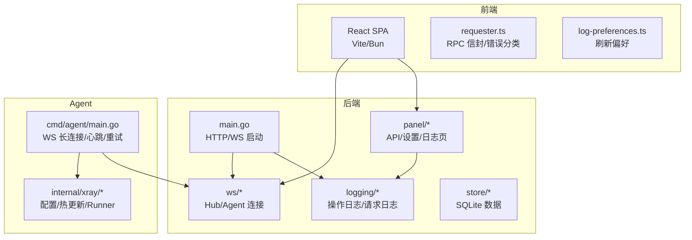
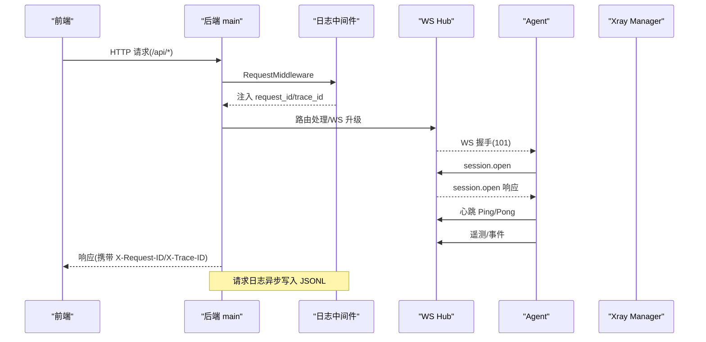
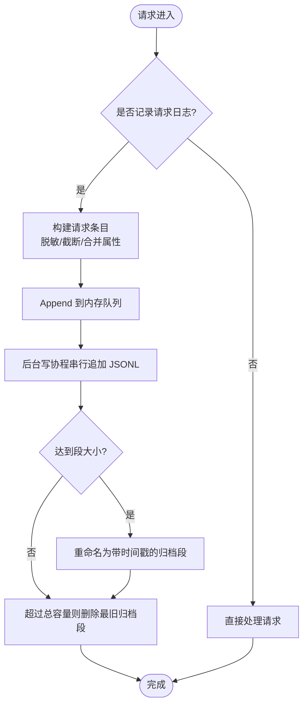
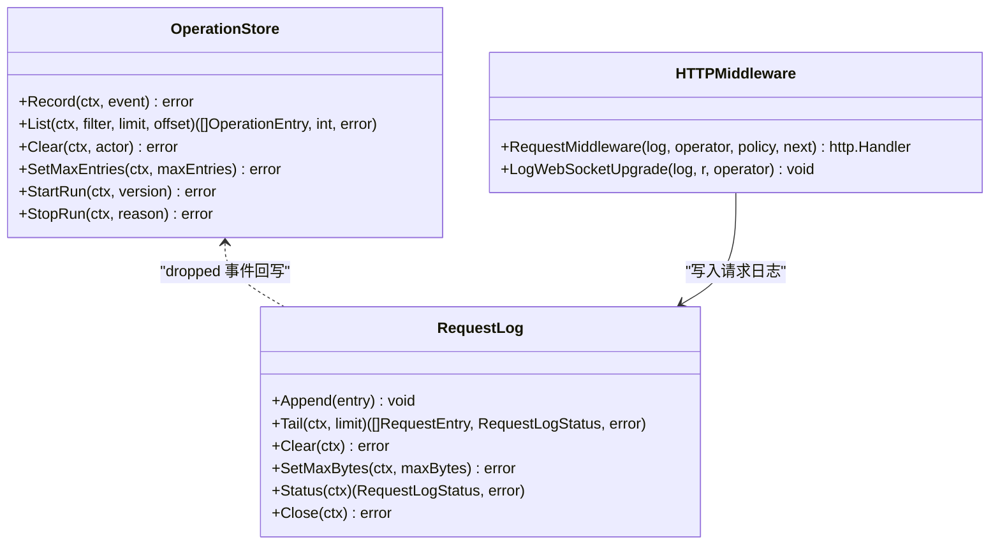
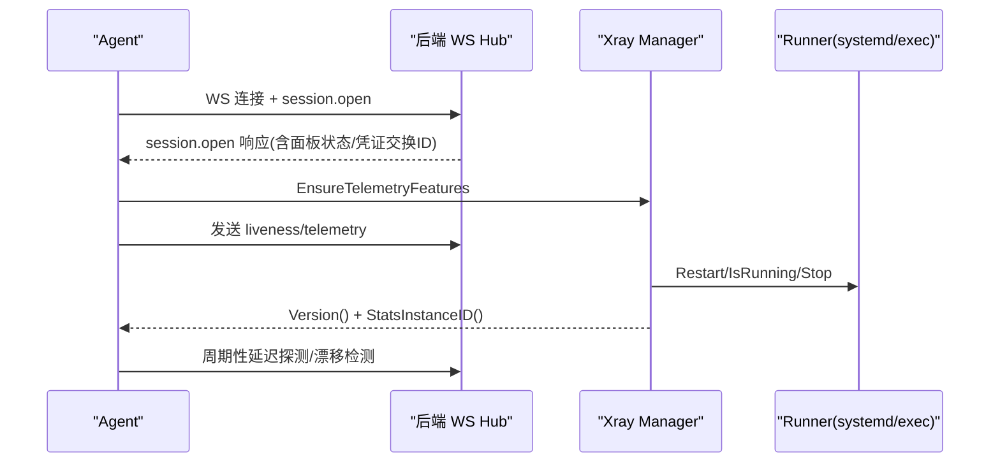
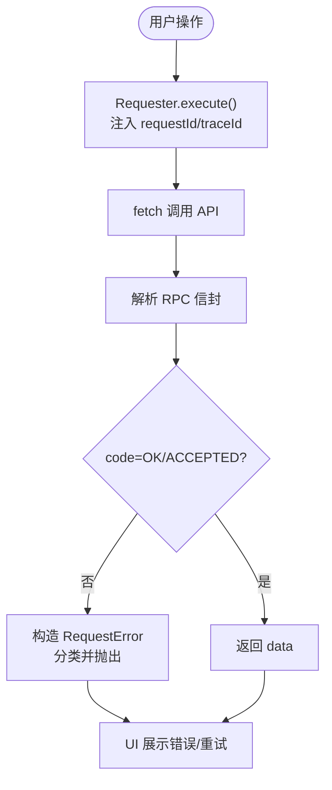
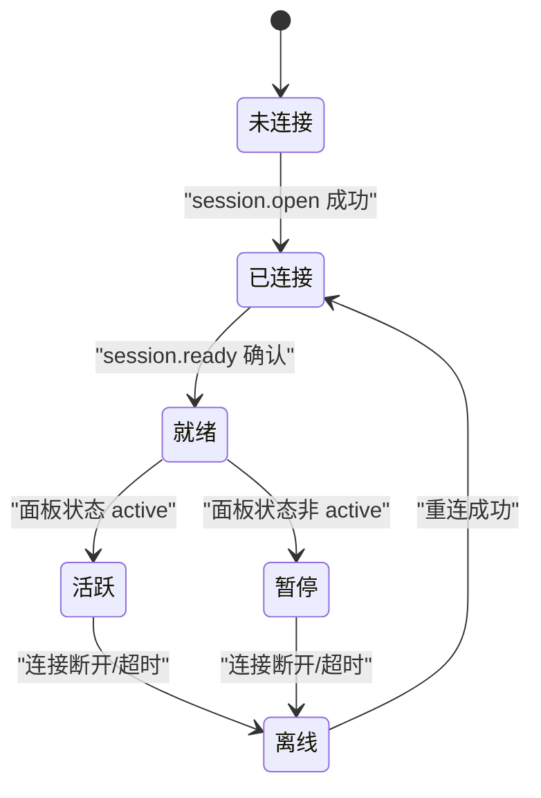
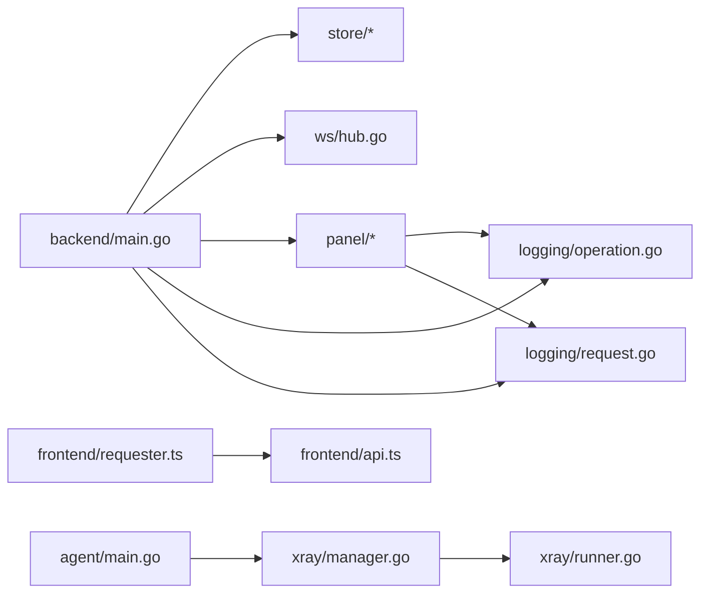

# 调试指南

<cite>
**本文引用的文件**   
- [logging-design.md](file://docs/logging-design.md)
- [backend_main.go](file://src/backend/cmd/backend/main.go)
- [logging_context.go](file://src/backend/internal/logging/context.go)
- [logging_http.go](file://src/backend/internal/logging/http.go)
- [logging_operation.go](file://src/backend/internal/logging/operation.go)
- [logging_request.go](file://src/backend/internal/logging/request.go)
- [panel_logs.go](file://src/backend/internal/panel/logs.go)
- [ws_hub.go](file://src/backend/internal/ws/hub.go)
- [ws_agent.go](file://src/backend/internal/ws/agent.go)
- [agent_main.go](file://src/agent/cmd/agent/main.go)
- [xray_manager.go](file://src/agent/internal/xray/manager.go)
- [xray_runner.go](file://src/agent/internal/xray/runner.go)
- [frontend_log_preferences.ts](file://src/frontend/src/lib/log-preferences.ts)
- [frontend_requester.ts](file://src/frontend/src/lib/requester.ts)
- [frontend_api.ts](file://src/frontend/src/lib/api.ts)
- [frontend_server_monitor.tsx](file://src/frontend/src/components/ServerMonitor.tsx)
- [frontend_docs.md](file://docs/frontend.md)
- [known_issues.md](file://docs/KNOWN_ISSUES.md)
</cite>

## 目录
1. [简介](#简介)
2. [项目结构](#项目结构)
3. [核心组件](#核心组件)
4. [架构总览](#架构总览)
5. [详细组件分析](#详细组件分析)
6. [依赖关系分析](#依赖关系分析)
7. [性能考虑](#性能考虑)
8. [故障排查指南](#故障排查指南)
9. [结论](#结论)
10. [附录](#附录)

## 简介
本指南面向 Lattix-codex 的运维与开发人员，系统化说明如何调试后端服务、Agent、前端以及分布式链路。重点覆盖：
- 日志系统配置与使用（操作日志、请求日志）
- 后端 Go 服务调试（HTTP、WebSocket、SQLite）
- Agent 进程监控与 Xray 管理
- 前端 React 应用调试（网络、性能）
- 分布式链路追踪与消息跟踪
- 常见问题定位与解决步骤

## 项目结构
Lattix-codex 由三部分组成：
- 后端（Backend）：提供 HTTP API、WebSocket 控制通道、SQLite 存储与日志子系统
- Agent：运行在被控服务器上的独立二进制，负责 xray 生命周期管理与遥测上报
- 前端（Frontend）：React SPA，通过 HTTP 与 WebSocket 与后端交互

图表来源
- [backend_main.go:70-170](file://src/backend/cmd/backend/main.go#L70-L170)
- [logging_http.go:43-82](file://src/backend/internal/logging/http.go#L43-L82)
- [logging_operation.go:116-136](file://src/backend/internal/logging/operation.go#L116-L136)
- [logging_request.go:90-105](file://src/backend/internal/logging/request.go#L90-L105)
- [ws_hub.go:57-63](file://src/backend/internal/ws/hub.go#L57-L63)
- [agent_main.go:33-98](file://src/agent/cmd/agent/main.go#L33-L98)
- [xray_manager.go:24-37](file://src/agent/internal/xray/manager.go#L24-L37)
- [xray_runner.go:27-33](file://src/agent/internal/xray/runner.go#L27-L33)
- [frontend_requester.ts:71-120](file://src/frontend/src/lib/requester.ts#L71-L120)
- [frontend_log_preferences.ts:1-30](file://src/frontend/src/lib/log-preferences.ts#L1-L30)

章节来源
- [backend_main.go:70-170](file://src/backend/cmd/backend/main.go#L70-L170)
- [logging-design.md:1-120](file://docs/logging-design.md#L1-L120)

## 核心组件
- 日志子系统
  - 操作日志：独立 SQLite 文件 operation.db，记录状态变更、面板生命周期、告警等
  - 请求日志：JSONL 分段文件，记录 HTTP/WS RPC 元数据与脱敏参数
- 后端 HTTP/WS 中间件
  - RequestMiddleware：生成 request_id/trace_id，按策略决定是否记录请求日志
  - LogPolicy：full/failures_only/none，路由注册时声明
- Agent 主循环
  - WS 长连接建立、会话打开、心跳保活、延迟探测、遥测上报、配置漂移检测
- 前端请求器
  - Requester：统一封装 fetch，注入 X-Request-ID/X-Trace-ID，错误分类与重试

章节来源
- [logging-http.go:43-82](file://src/backend/internal/logging/http.go#L43-L82)
- [logging-operation.go:116-136](file://src/backend/internal/logging/operation.go#L116-L136)
- [logging-request.go:90-105](file://src/backend/internal/logging/request.go#L90-L105)
- [agent_main.go:141-186](file://src/agent/cmd/agent/main.go#L141-L186)
- [frontend_requester.ts:157-220](file://src/frontend/src/lib/requester.ts#L157-L220)

## 架构总览
后端作为控制面板，暴露 HTTP API 与 /api/agent/ws；Agent 主动拨出建立 WS 长连接，承载命令下发与事件上报。日志子系统贯穿前后端，确保可观测性。

图表来源
- [backend_main.go:370-382](file://src/backend/cmd/backend/main.go#L370-L382)
- [logging-http.go:43-82](file://src/backend/internal/logging/http.go#L43-L82)
- [ws_agent.go:113-155](file://src/backend/internal/ws/agent.go#L113-L155)
- [agent_main.go:168-207](file://src/agent/cmd/agent/main.go#L168-L207)

## 详细组件分析

### 日志系统设计与使用
- 设计目标与边界
  - 操作日志与请求日志独立存储与限额，不进入业务数据库备份
  - 请求日志不记录敏感字段，支持脱敏与截断
- 目录与权限
  - 默认 logs/ 与业务数据库同级，可通过 -log-dir 或环境变量覆盖
  - 目录权限 0700，请求日志文件 0600
- 操作日志
  - 表结构包含 severity/category/action/detail/operator/ip/request_id/trace_id 等
  - 支持分页查询、清空审计、保留条数限制
- 请求日志
  - JSONL 格式，字段包括 timestamp/request_id/trace_id/severity/transport/method/path/route/rpc_code/duration_ms/response_bytes 等
  - 异步写入，队列满或写入失败丢弃，累计上报 dropped 计数
  - 分段归档与容量上限，只读取尾部窗口

图表来源
- [logging-http.go:107-152](file://src/backend/internal/logging/http.go#L107-L152)
- [logging-request.go:205-244](file://src/backend/internal/logging/request.go#L205-L244)
- [logging-design.md:139-257](file://docs/logging-design.md#L139-L257)

章节来源
- [logging-design.md:1-120](file://docs/logging-design.md#L1-L120)
- [logging-operation.go:42-66](file://src/backend/internal/logging/operation.go#L42-L66)
- [logging-request.go:25-53](file://src/backend/internal/logging/request.go#L25-L53)
- [logging-http.go:226-228](file://src/backend/internal/logging/http.go#L226-L228)

### 后端服务调试方法
- 启动与配置
  - 监听地址、数据库路径、日志目录、管理员账号、TLS 模式（off/cert/path/acme）
  - 健康检查 /healthz 与就绪 /readyz
- HTTP 调试
  - 使用 curl 或浏览器开发者工具查看 X-Request-ID/X-Trace-ID
  - 观察请求日志 JSONL 与操作日志 operation.db
- WebSocket 调试
  - 使用 ws 客户端或浏览器 WS 控制台，关注 session.open/ready/lifecycle 流程
  - 通过 hub 的连接状态与断开原因判断在线/离线/重连
- 数据库调试
  - 使用 sqlite3 直接查询 operation.db 与业务库
  - 注意 busy_timeout 与并发限制

图表来源
- [logging-operation.go:142-182](file://src/backend/internal/logging/operation.go#L142-L182)
- [logging-request.go:115-129](file://src/backend/internal/logging/request.go#L115-L129)
- [logging-http.go:43-82](file://src/backend/internal/logging/http.go#L43-L82)

章节来源
- [backend_main.go:70-170](file://src/backend/cmd/backend/main.go#L70-L170)
- [ws_hub.go:111-139](file://src/backend/internal/ws/hub.go#L111-L139)
- [logging-operation.go:184-228](file://src/backend/internal/logging/operation.go#L184-L228)
- [logging-request.go:131-158](file://src/backend/internal/logging/request.go#L131-L158)

### Agent 程序调试技巧
- 进程监控
  - 使用 latx-ag status/version/log 查看进程状态、版本与日志
  - systemd 模式下 systemctl status xray；dev 模式 exec runner 输出并入 agent 日志
- Xray 日志分析
  - 配置文件校验 run -test，原子落盘与回滚机制
  - 漂移检测 ConfigDrift 比对哈希，外部修改会触发上报
- 网络问题排查
  - WS 心跳与超时：readTimeout 90s，writeControl 10s
  - 重连退避策略与面板不可用时的特殊延迟

图表来源
- [agent_main.go:141-186](file://src/agent/cmd/agent/main.go#L141-L186)
- [xray_manager.go:86-107](file://src/agent/internal/xray/manager.go#L86-L107)
- [xray_runner.go:41-53](file://src/agent/internal/xray/runner.go#L41-L53)

章节来源
- [agent_main.go:141-186](file://src/agent/cmd/agent/main.go#L141-L186)
- [xray_manager.go:259-304](file://src/agent/internal/xray/manager.go#L259-L304)
- [xray_runner.go:77-114](file://src/agent/internal/xray/runner.go#L77-L114)

### 前端应用调试方法
- React DevTools
  - 使用浏览器扩展查看组件树、状态与 props
- 网络请求调试
  - 查看 Network 面板中的 X-Request-ID/X-Trace-ID，关联后端请求日志
  - 使用 Requester 的错误分类（business/transport/protocol/cancelled）快速定位
- 性能分析
  - Performance 面板录制关键交互，关注首屏与大数据块加载
  - 日志页面刷新偏好与窗口大小本地存储，避免频繁刷新

图表来源
- [frontend_requester.ts:157-220](file://src/frontend/src/lib/requester.ts#L157-L220)
- [frontend_api.ts:257-278](file://src/frontend/src/lib/api.ts#L257-L278)
- [frontend_log_preferences.ts:17-29](file://src/frontend/src/lib/log-preferences.ts#L17-L29)

章节来源
- [frontend_docs.md:1-17](file://docs/frontend.md#L1-L17)
- [frontend_requester.ts:71-120](file://src/frontend/src/lib/requester.ts#L71-L120)
- [frontend_api.ts:257-278](file://src/frontend/src/lib/api.ts#L257-L278)

### 分布式系统调试策略
- 链路追踪
  - 全链路 request_id/trace_id 贯穿 HTTP/WS，前端/后端/Agent 均透传
- 消息跟踪
  - WS 协议错误通过 OnProtocolError 记录，非业务消息不调用
  - 幂等重放 IdempotencyReplayed 标记在请求日志中体现
- 状态同步
  - PanelLifecycleSnapshot 通过 LifecycleChanged 推送，Agent 确认并持久化
  - Hub.SyncLifecycle 等待所有 Agent 确认，缺失列表用于诊断

图表来源
- [ws_hub.go:232-249](file://src/backend/internal/ws/hub.go#L232-L249)
- [agent_main.go:416-453](file://src/agent/cmd/agent/main.go#L416-L453)
- [logging-http.go:166-183](file://src/backend/internal/logging/http.go#L166-L183)

章节来源
- [logging-design.md:258-311](file://docs/logging-design.md#L258-L311)
- [ws_hub.go:322-378](file://src/backend/internal/ws/hub.go#L322-L378)

## 依赖关系分析
- 后端模块耦合
  - main 初始化 store、lifecycle、hub、dispatcher、panel、logging
  - logging 模块被 panel 与 main 共同使用，operation 与 request 解耦
- Agent 依赖
  - manager 依赖 runner（systemd/exec），config 路径独占管理
  - telemetry 采集主机指标与网络统计
- 前端依赖
  - requester 统一封装 fetch，api.ts 生成类型契约

图表来源
- [backend_main.go:141-170](file://src/backend/cmd/backend/main.go#L141-L170)
- [xray_manager.go:24-37](file://src/agent/internal/xray/manager.go#L24-L37)
- [xray_runner.go:27-33](file://src/agent/internal/xray/runner.go#L27-L33)
- [frontend_requester.ts:1-20](file://src/frontend/src/lib/requester.ts#L1-L20)

章节来源
- [backend_main.go:141-170](file://src/backend/cmd/backend/main.go#L141-L170)
- [xray_manager.go:24-37](file://src/agent/internal/xray/manager.go#L24-L37)

## 性能考虑
- 日志写入
  - 请求日志异步队列 1024，单写协程串行追加，避免阻塞请求
  - 操作日志 SQLite 单连接，busy_timeout 降低竞争
- 网络与连接
  - WS 写超时 10s，读超时 90s，发送队列满断开慢连接
  - Agent 重连退避与面板不可用特殊延迟
- 前端渲染
  - 日志页面默认不刷新，窗口大小本地缓存
  - 大数据块（国家/城市）按需加载，启用长期缓存

[本节为通用指导，无需特定文件引用]

## 故障排查指南
- 连接问题
  - 检查 /healthz 与 /readyz，确认面板存活与就绪
  - 查看 Agent WS 连接状态与断开原因，关注 OnDisconnect 回调
- 配置错误
  - TLS 模式与证书路径一致性，ACME 域名与端口可达性
  - Agent state.json 与 bootstrap token 优先级
- 性能瓶颈
  - 请求日志 dropped 计数与占用空间，调整 max_mb
  - 操作日志保留条数与清理策略
- 常见错误
  - 协议错误：OnProtocolError 记录 rpc_type 与 message
  - 业务错误：RequestError 分类 business/transport/protocol/cancelled

章节来源
- [backend_main.go:385-432](file://src/backend/cmd/backend/main.go#L385-L432)
- [ws_hub.go:265-285](file://src/backend/internal/ws/hub.go#L265-L285)
- [logging-design.md:258-311](file://docs/logging-design.md#L258-L311)
- [known_issues.md:23-36](file://docs/KNOWN_ISSUES.md#L23-L36)

## 结论
Lattix-codex 的调试体系围绕结构化日志、链路追踪与模块化设计展开。通过操作日志与请求日志的可观测性、Agent 与后端的双向通信、前端的统一请求封装，能够快速定位问题并优化性能。建议结合本文档的步骤与图示，逐步验证各组件状态与数据流。

[本节为总结，无需特定文件引用]

## 附录
- 常用命令
  - 后端：latx status/version/reset-admin
  - Agent：latx-ag status/version/log/update/xray-update/uninstall
- 日志位置
  - 操作日志：logs/operation.db
  - 请求日志：logs/requests/*.jsonl
- 前端开发
  - bun install/bun dev/bun build/bun preview

章节来源
- [backend_main.go:97-120](file://src/backend/cmd/backend/main.go#L97-L120)
- [logging-design.md:19-49](file://docs/logging-design.md#L19-L49)
- [frontend_docs.md:1-17](file://docs/frontend.md#L1-L17)