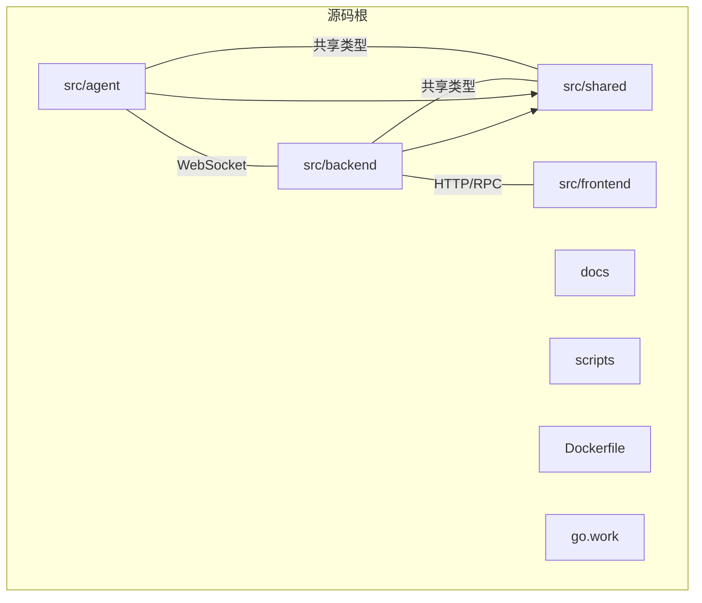
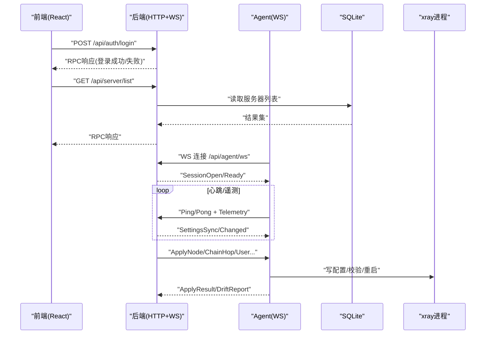
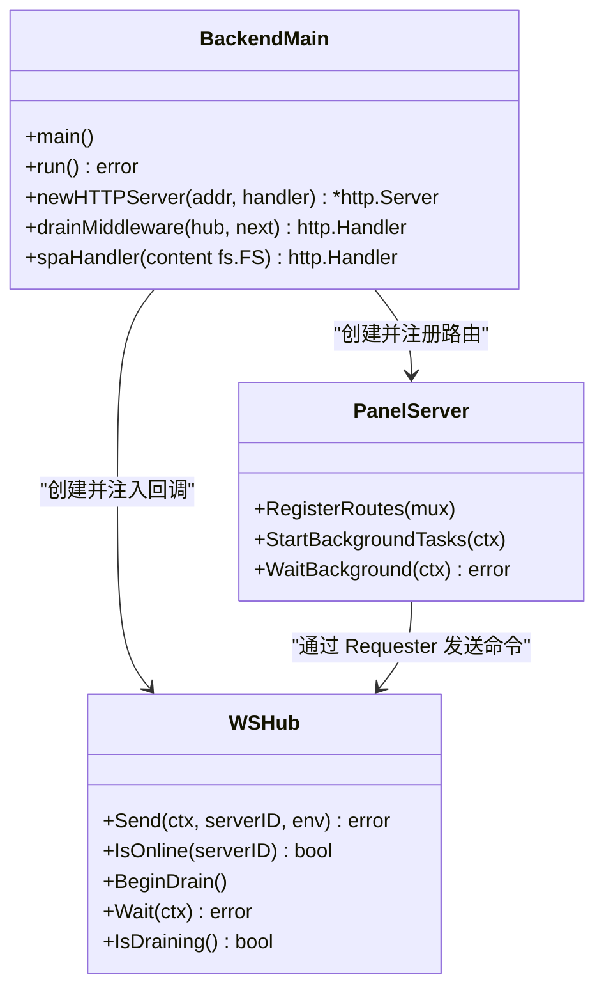
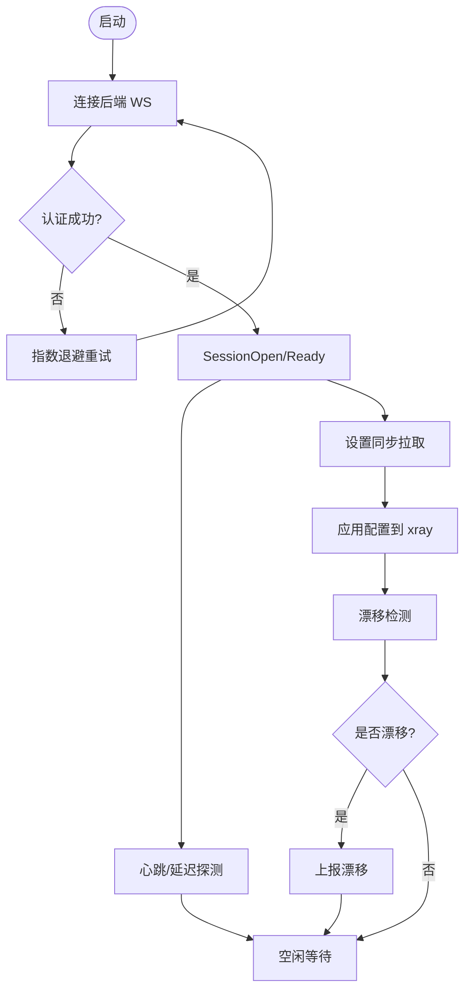
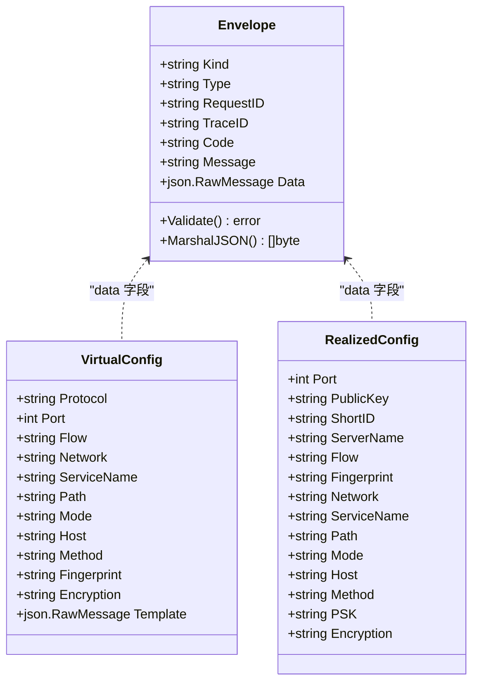
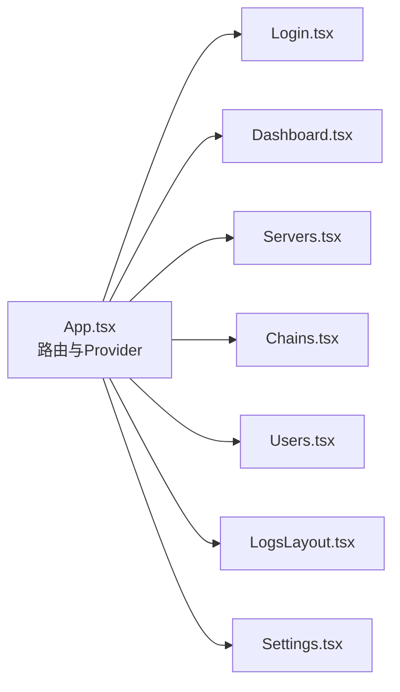
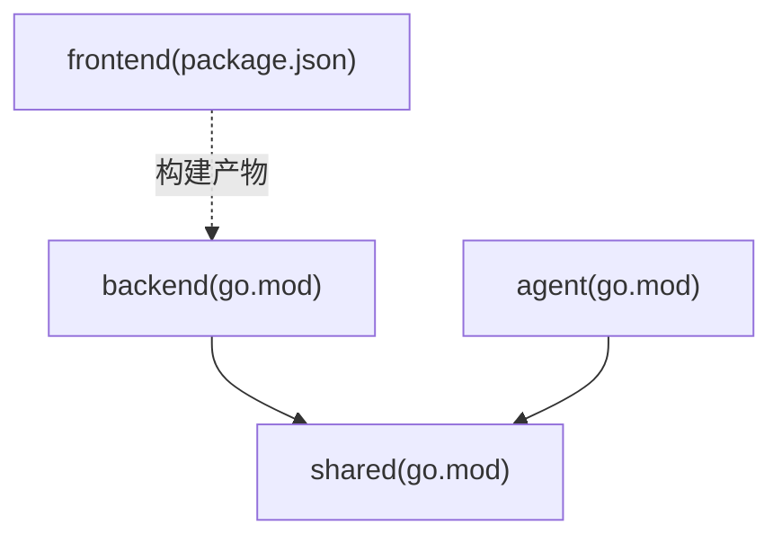

# 项目结构

<cite>
**本文引用的文件**   
- [go.work](file://go.work)
- [Dockerfile](file://Dockerfile)
- [src/backend/go.mod](file://src/backend/go.mod)
- [src/agent/go.mod](file://src/agent/go.mod)
- [src/shared/go.mod](file://src/shared/go.mod)
- [src/frontend/package.json](file://src/frontend/package.json)
- [src/backend/cmd/backend/main.go](file://src/backend/cmd/backend/main.go)
- [src/agent/cmd/agent/main.go](file://src/agent/cmd/agent/main.go)
- [src/backend/internal/panel/panel.go](file://src/backend/internal/panel/panel.go)
- [src/backend/internal/ws/hub.go](file://src/backend/internal/ws/hub.go)
- [src/backend/internal/panel/settings.go](file://src/backend/internal/panel/settings.go)
- [src/agent/internal/xray/manager.go](file://src/agent/internal/xray/manager.go)
- [src/agent/internal/state/state.go](file://src/agent/internal/state/state.go)
- [src/shared/config.go](file://src/shared/config.go)
- [src/shared/messages.go](file://src/shared/messages.go)
- [src/frontend/src/App.tsx](file://src/frontend/src/App.tsx)
- [docs/openapi.yaml](file://docs/openapi.yaml)
</cite>

## 目录
1. [简介](#简介)
2. [项目结构](#项目结构)
3. [核心组件](#核心组件)
4. [架构总览](#架构总览)
5. [详细组件分析](#详细组件分析)
6. [依赖分析](#依赖分析)
7. [性能考量](#性能考量)
8. [故障排查指南](#故障排查指南)
9. [结论](#结论)
10. [附录：新模块添加规范与最佳实践](#附录新模块添加规范与最佳实践)

## 简介
本文件为 Lattix-codex 项目的“项目结构”说明，面向开发与运维人员，系统化阐述整体目录架构、各模块职责与关系、通信机制（HTTP API、WebSocket、共享模块）、配置管理方式、第三方库集成与版本策略，以及新增模块的规范。文档以仓库实际代码为依据，配合图示帮助读者快速理解系统组织与数据流向。

## 项目结构
仓库采用多模块 Go 工作区 + 前端独立工程的结构：
- src/backend：Go 后端服务，提供 HTTP RPC 面板接口、WebSocket Agent 控制通道、SQLite 存储、日志与告警等能力。
- src/agent：Go 代理程序，运行在被控服务器上，通过 WebSocket 主动连接后端，负责 xray 进程管理与配置下发。
- src/shared：Go 共享包，定义前后端/Agent 间协议类型、常量与通用数据结构。
- src/frontend：React + TypeScript + Vite 前端工程，构建产物由后端内嵌或外部静态目录提供。
- docs：设计文档与 OpenAPI 描述。
- scripts：安装与 E2E 脚本。
- Dockerfile：镜像构建流程，先构建前端，再构建后端并内嵌前端产物。
- go.work：Go 工作区，统一 agent、backend、shared 三个模块的版本与替换。

**图表来源** 
- [go.work:1-10](file://go.work#L1-L10)
- [Dockerfile:1-44](file://Dockerfile#L1-L44)

**章节来源**
- [go.work:1-10](file://go.work#L1-L10)
- [Dockerfile:1-44](file://Dockerfile#L1-L44)

## 核心组件
- 后端（Backend）
  - HTTP 路由与 RPC 处理：注册 /api/* 路由，统一鉴权、CSRF、幂等键、日志策略等。
  - WebSocket Hub：维护 Agent 连接、认证、消息分发、生命周期事件回调。
  - 存储与日志：SQLite 持久化；操作日志与请求日志分离。
  - TLS 支持：内置证书、域名路径模式热加载、ACME 自动证书。
- 代理（Agent）
  - WS 长连接：主动拨出到后端，会话建立、心跳、延迟探测、遥测上报。
  - xray 管理：配置生成、校验、原子替换、漂移检测、升级与卸载。
  - 本地状态：长期凭证、链 piece 记录、设置同步。
- 共享（Shared）
  - 协议信封 Envelope、业务码、消息类型、虚拟/生效配置结构、工具函数。
- 前端（Frontend）
  - React SPA：路由、鉴权、主题、页面组件；通过 API 与后端交互。
  - 构建产物：Vite 构建，OpenAPI 类型生成，供 TS 使用。

**章节来源**
- [src/backend/cmd/backend/main.go:1-120](file://src/backend/cmd/backend/main.go#L1-L120)
- [src/backend/internal/panel/panel.go:1-120](file://src/backend/internal/panel/panel.go#L1-L120)
- [src/backend/internal/ws/hub.go:1-120](file://src/backend/internal/ws/hub.go#L1-L120)
- [src/agent/cmd/agent/main.go:1-120](file://src/agent/cmd/agent/main.go#L1-L120)
- [src/agent/internal/xray/manager.go:259-304](file://src/agent/internal/xray/manager.go#L259-L304)
- [src/agent/internal/state/state.go:1-29](file://src/agent/internal/state/state.go#L1-L29)
- [src/shared/config.go:1-120](file://src/shared/config.go#L1-L120)
- [src/shared/messages.go:1-120](file://src/shared/messages.go#L1-L120)
- [src/frontend/src/App.tsx:1-73](file://src/frontend/src/App.tsx#L1-L73)

## 架构总览
系统由三部分组成：前端浏览器、后端面板服务、被控服务器上的 Agent。前端通过 HTTP RPC 调用后端；后端通过 WebSocket 与 Agent 双向通信；共享包保证协议一致性。

**图表来源** 
- [src/backend/cmd/backend/main.go:370-450](file://src/backend/cmd/backend/main.go#L370-L450)
- [src/backend/internal/ws/hub.go:110-154](file://src/backend/internal/ws/hub.go#L110-L154)
- [src/agent/cmd/agent/main.go:140-260](file://src/agent/cmd/agent/main.go#L140-L260)
- [src/agent/internal/xray/manager.go:259-304](file://src/agent/internal/xray/manager.go#L259-L304)
- [docs/openapi.yaml:14-35](file://docs/openapi.yaml#L14-L35)

## 详细组件分析

### 后端（Backend）
- 入口与启动
  - 解析命令行与环境变量，初始化 SQLite、日志、TLS、WS Hub、Panel API、订阅服务等。
  - 健康检查与健康就绪探针：/healthz、/readyz。
  - SPA 静态资源回退逻辑与 /api/* 协议错误处理。
- Panel API
  - 统一鉴权、CSRF、幂等键、日志策略；按功能划分处理器（auth、dashboard、server、provider、exchange-rate 等）。
  - 后台任务调度：过期清理、指标保留、发布版本刷新、计费巡检、汇率刷新。
- WebSocket Hub
  - 连接注册表、发送队列、Pong 超时、优雅关停（BeginDrain）、重连与离线补发。
- 配置与 TLS
  - 支持三种 TLS 模式：关闭、内置证书、域名路径热加载、ACME 自动证书。
  - 设置页可覆盖部分运行时行为（如公共 URL、TLS 模式与域名）。

**图表来源** 
- [src/backend/cmd/backend/main.go:574-638](file://src/backend/cmd/backend/main.go#L574-L638)
- [src/backend/internal/panel/panel.go:160-220](file://src/backend/internal/panel/panel.go#L160-L220)
- [src/backend/internal/ws/hub.go:110-193](file://src/backend/internal/ws/hub.go#L110-L193)

**章节来源**
- [src/backend/cmd/backend/main.go:70-120](file://src/backend/cmd/backend/main.go#L70-L120)
- [src/backend/internal/panel/panel.go:160-220](file://src/backend/internal/panel/panel.go#L160-L220)
- [src/backend/internal/ws/hub.go:110-193](file://src/backend/internal/ws/hub.go#L110-L193)

### 代理（Agent）
- 连接与会话
  - 主动拨出 WS 连接，完成 SessionOpen/Ready、凭据交换、心跳与延迟探测。
  - 周期性拉取设置同步，变更时重新应用。
- xray 管理
  - 渲染配置、校验、备份与原子替换；漂移检测与修复上报。
  - 升级与卸载流程，自升级后退出等待 systemd 拉起。
- 本地状态
  - 落盘长期凭证、面板观察快照、链 piece 记录，用于重启重建与幂等。

**图表来源** 
- [src/agent/cmd/agent/main.go:140-260](file://src/agent/cmd/agent/main.go#L140-L260)
- [src/agent/internal/xray/manager.go:259-304](file://src/agent/internal/xray/manager.go#L259-L304)
- [src/agent/internal/state/state.go:1-29](file://src/agent/internal/state/state.go#L1-L29)

**章节来源**
- [src/agent/cmd/agent/main.go:140-260](file://src/agent/cmd/agent/main.go#L140-L260)
- [src/agent/internal/xray/manager.go:259-304](file://src/agent/internal/xray/manager.go#L259-L304)
- [src/agent/internal/state/state.go:1-29](file://src/agent/internal/state/state.go#L1-L29)

### 共享模块（Shared）
- 协议信封与业务码
  - Envelope 统一封装 kind/type/request_id/trace_id/data，响应携带 code/message。
  - 统一的 RPC 业务码，HTTP 与 WS 共用语义。
- 配置与模板
  - VirtualConfig/RealizedConfig 描述节点/链跳的虚拟与生效配置，含占位符替换规则。
  - 协议族与传输方式常量、指纹、加密方法等。

**图表来源** 
- [src/shared/messages.go:13-137](file://src/shared/messages.go#L13-L137)
- [src/shared/config.go:170-206](file://src/shared/config.go#L170-L206)

**章节来源**
- [src/shared/messages.go:13-137](file://src/shared/messages.go#L13-L137)
- [src/shared/config.go:170-206](file://src/shared/config.go#L170-L206)

### 前端（Frontend）
- 路由与鉴权
  - React Router 定义页面路由，AuthProvider 管理登录态，未登录跳转 /login。
- 页面与组件
  - Dashboard/Servers/Chains/Users/Logs/Settings 等页面；UI 组件基于 shadcn/tailwind。
- 构建与类型
  - Vite 构建，OpenAPI 类型生成脚本，TypeScript 严格类型约束。

**图表来源** 
- [src/frontend/src/App.tsx:1-73](file://src/frontend/src/App.tsx#L1-L73)

**章节来源**
- [src/frontend/src/App.tsx:1-73](file://src/frontend/src/App.tsx#L1-L73)

## 依赖分析
- Go 工作区
  - go.work 声明了 agent、backend、shared 三个模块，并使用 replace 指向相对路径，确保本地开发一致。
- 模块依赖
  - backend 依赖 gorilla/websocket、sqlite、crypto 等，并通过 replace 引入 shared。
  - agent 依赖 gorilla/websocket、grpc、xray-core 等，同样 replace shared。
  - shared 无外部依赖，仅标准库。
- 前端依赖
  - package.json 管理 React、Vite、Tailwind、shadcn 等依赖与脚本。

**图表来源** 
- [src/backend/go.mod:1-33](file://src/backend/go.mod#L1-L33)
- [src/agent/go.mod:1-59](file://src/agent/go.mod#L1-L59)
- [src/shared/go.mod:1-6](file://src/shared/go.mod#L1-L6)
- [src/frontend/package.json:1-53](file://src/frontend/package.json#L1-L53)

**章节来源**
- [src/backend/go.mod:1-33](file://src/backend/go.mod#L1-L33)
- [src/agent/go.mod:1-59](file://src/agent/go.mod#L1-L59)
- [src/shared/go.mod:1-6](file://src/shared/go.mod#L1-L6)
- [src/frontend/package.json:1-53](file://src/frontend/package.json#L1-L53)

## 性能考量
- WebSocket 传输
  - 单连接承载全部控制面消息，避免频繁握手开销；发送缓冲满即断开，重连后补发，保证可靠性。
  - Pong 超时与读超时保障连接健康，心跳与延迟探测提升可观测性。
- 日志与存储
  - 操作日志与请求日志分离，限制大小与滚动策略，避免阻塞主流程。
  - SQLite 作为轻量存储，适合单机部署场景。
- 配置更新
  - 原子替换与校验，降低失败风险；漂移检测及时恢复受管状态。
- 前端
  - SPA 静态资源内嵌减少依赖；按需路由与组件懒加载优化首屏。

[本节为通用指导，不直接分析具体文件]

## 故障排查指南
- 连接与认证
  - 检查 WS 地址与 token；首次连接需 bootstrap token；认证拒绝将停止自动重试。
- 配置漂移
  - 若配置文件被外部修改，Agent 会报告漂移；重新下发 apply 即可修复。
- 健康检查
  - /healthz 返回 ok；/readyz 在面板非活跃或数据库不可用时返回 not ready。
- 日志定位
  - 操作日志与请求日志分别位于 logs 目录下的 operation.db 与 requests 子目录。

**章节来源**
- [src/agent/cmd/agent/main.go:66-98](file://src/agent/cmd/agent/main.go#L66-L98)
- [src/backend/cmd/backend/main.go:384-432](file://src/backend/cmd/backend/main.go#L384-L432)
- [src/agent/internal/xray/manager.go:289-304](file://src/agent/internal/xray/manager.go#L289-L304)

## 结论
Lattix-codex 采用清晰的分层与模块化设计：后端提供稳定的 HTTP RPC 与 WS 控制通道，Agent 专注执行与状态管理，共享包确保协议一致性，前端提供可视化界面。通过工作区与 replace 策略实现跨模块依赖管理，结合容器化构建与内嵌静态资源，便于部署与维护。新增模块应遵循现有命名与分层约定，优先复用 shared 类型，明确依赖边界，完善日志与错误处理。

[本节为总结，不直接分析具体文件]

## 附录：新模块添加规范与最佳实践
- 模块划分
  - 后端 internal 下按功能分包（如 panel、dispatch、store、ws、logging、alert、sub、lifecycle），保持高内聚低耦合。
  - Agent 内部按职责分包（state、selfupdate、xray），避免与业务逻辑混杂。
- 文件命名
  - Go 包名与目录名一致；测试文件 *_test.go；入口 cmd/<module>/main.go。
- 依赖管理
  - 新增依赖需在对应 go.mod 中声明；共享类型放入 shared，避免重复定义。
  - 前端新增依赖通过 package.json 管理，脚本与构建流程保持一致。
- 配置与环境
  - 环境变量前缀 LATTIX_*；敏感信息通过参数或文件传入；证书与密钥路径统一绝对化。
  - 设置项通过 store.Setting* 常量管理，变更需考虑向后兼容。
- 通信契约
  - 新增 RPC 动作需在 shared/messages.go 中定义类型与常量；OpenAPI 文档同步更新。
- 构建与发布
  - Dockerfile 中固定版本号与构建参数；前端构建产物内嵌至后端二进制。
- 测试与可观测性
  - 关键逻辑补充单元测试；增加操作日志与请求日志埋点；暴露健康检查与就绪探针。

**章节来源**
- [src/backend/cmd/backend/main.go:83-98](file://src/backend/cmd/backend/main.go#L83-L98)
- [src/backend/internal/panel/settings.go:391-429](file://src/backend/internal/panel/settings.go#L391-L429)
- [docs/openapi.yaml:1-20](file://docs/openapi.yaml#L1-L20)
- [Dockerfile:10-23](file://Dockerfile#L10-L23)