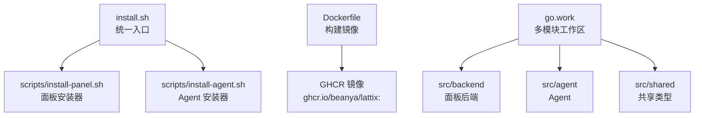
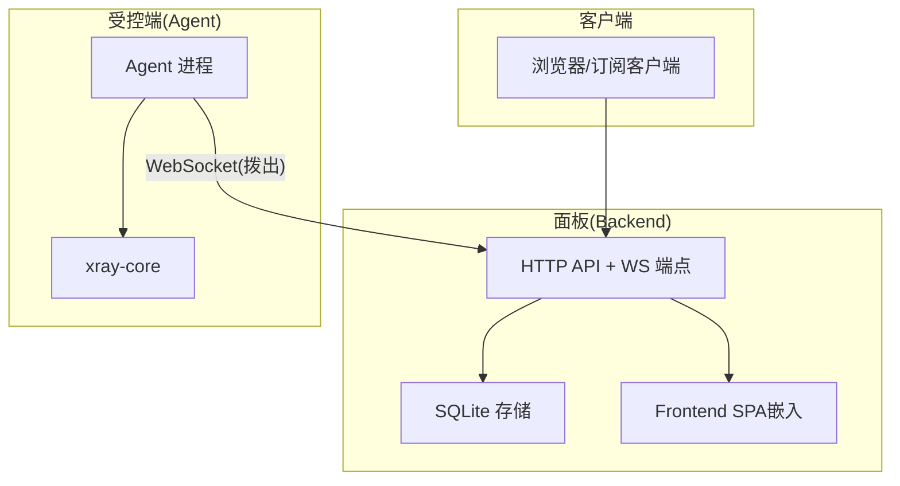
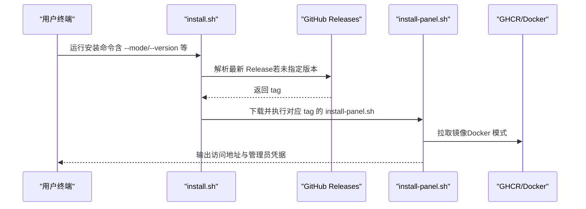
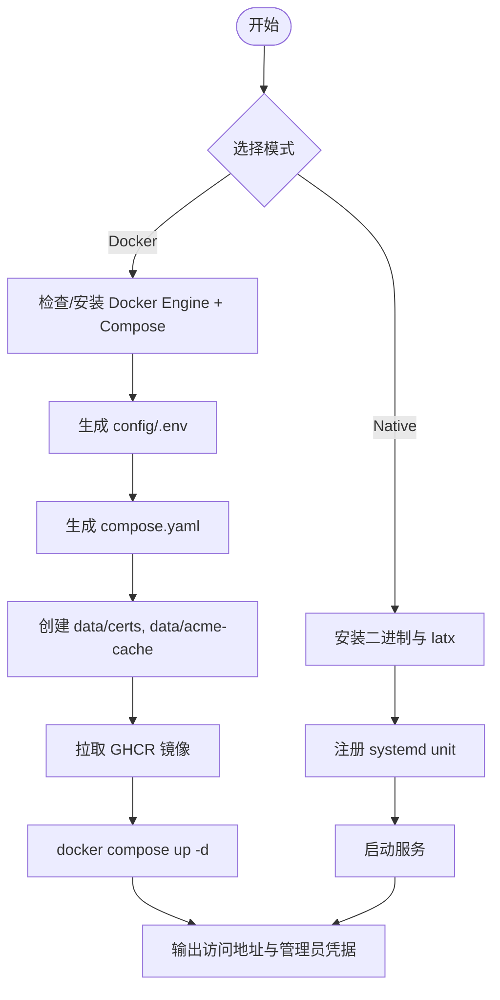
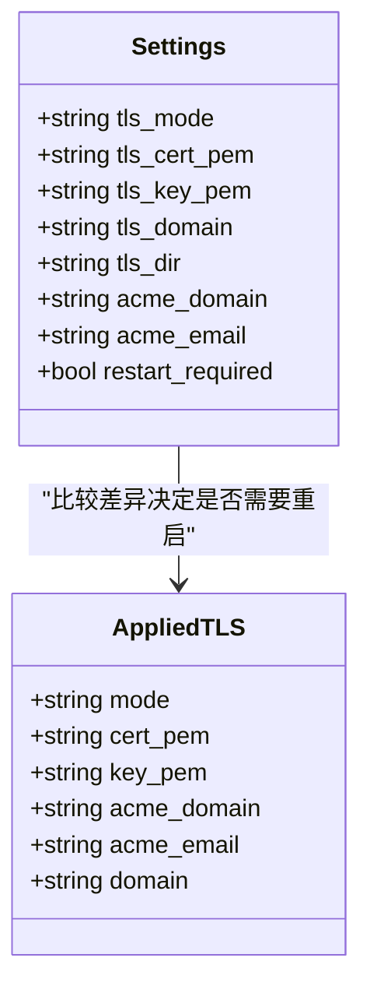
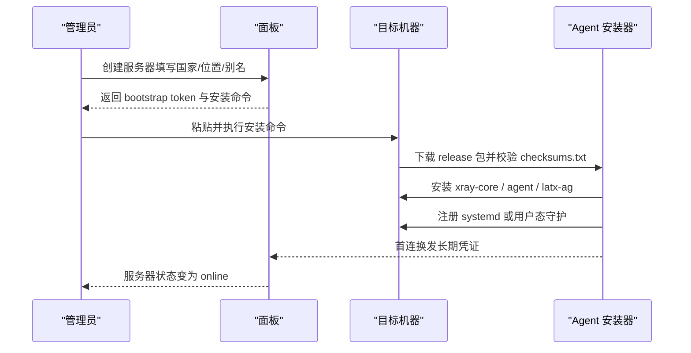
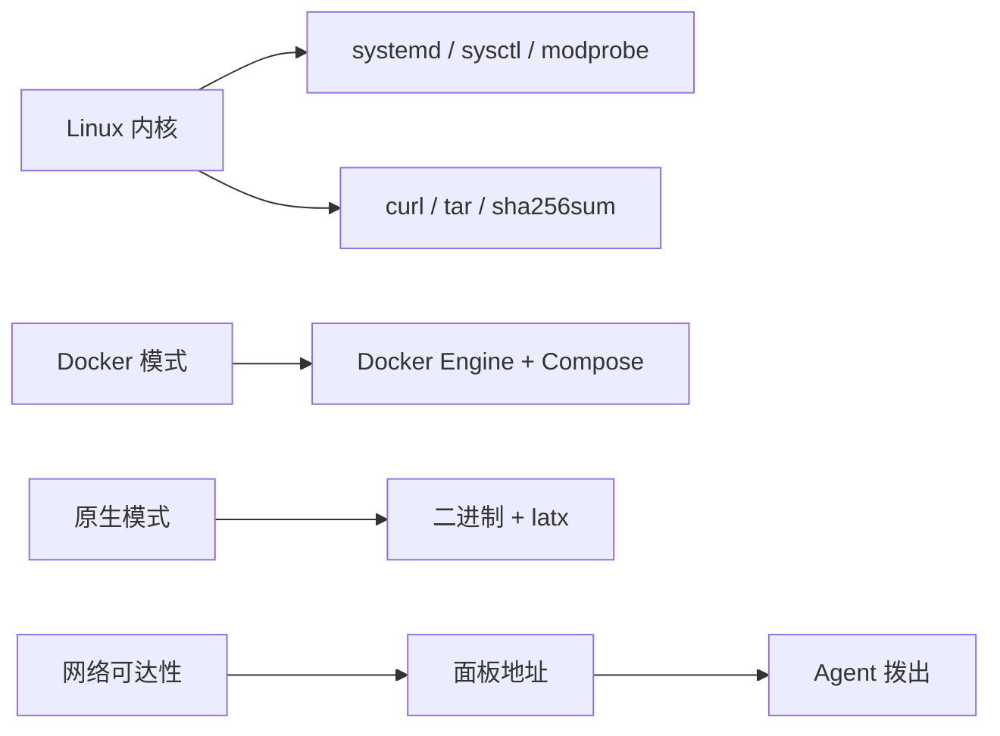

# 快速开始

<cite>
**本文引用的文件**   
- [README.md](file://README.md)
- [Dockerfile](file://Dockerfile)
- [install.sh](file://install.sh)
- [scripts/install-panel.sh](file://scripts/install-panel.sh)
- [scripts/install-agent.sh](file://scripts/install-agent.sh)
- [go.work](file://go.work)
- [src/backend/internal/panel/settings.go](file://src/backend/internal/panel/settings.go)
- [docs/KNOWN_ISSUES.md](file://docs/KNOWN_ISSUES.md)
</cite>

## 目录
1. [简介](#简介)
2. [项目结构](#项目结构)
3. [核心组件](#核心组件)
4. [架构总览](#架构总览)
5. [详细组件分析](#详细组件分析)
6. [依赖关系分析](#依赖关系分析)
7. [性能与部署注意事项](#性能与部署注意事项)
8. [故障排查指南](#故障排查指南)
9. [结论](#结论)
10. [附录：安装命令速查](#附录安装命令速查)

## 简介
本快速开始指南面向首次使用 Lattix-codex 的用户，涵盖环境准备、安装（Docker 与原生）、首次配置（管理员账户、TLS 证书、网络）、添加服务器与节点配置示例、常见问题与验证方法。内容基于仓库中的安装脚本、Docker 构建与面板设置逻辑整理而成，确保步骤可执行且结果可预期。

## 项目结构
Lattix 由三部分组成：前端（React SPA）、后端（Go 面板 API + WebSocket）、Agent（Go 受控端）。安装入口统一为根 install.sh，按模式分发到 scripts/install-panel.sh 或 scripts/install-agent.sh。Docker 镜像通过 Dockerfile 构建，包含前端产物与后端二进制。

图表来源
- [install.sh:1-146](file://install.sh#L1-L146)
- [scripts/install-panel.sh:1-200](file://scripts/install-panel.sh#L1-L200)
- [scripts/install-agent.sh:1-200](file://scripts/install-agent.sh#L1-L200)
- [Dockerfile:1-44](file://Dockerfile#L1-L44)
- [go.work:1-8](file://go.work#L1-L8)

章节来源
- [README.md:1-120](file://README.md#L1-L120)
- [Dockerfile:1-44](file://Dockerfile#L1-L44)
- [go.work:1-8](file://go.work#L1-L8)

## 核心组件
- 安装入口与向导：install.sh 提供交互式与非交互式两种安装方式，支持 Docker 与原生模式，自动解析版本并下载对应 tag 的安装实现。
- 面板安装器：scripts/install-panel.sh 负责生成 .env、compose.yaml、持久化目录，支持自动安装 Docker Engine（可选），输出访问地址与管理员凭据。
- Agent 安装器：scripts/install-agent.sh 负责下载 xray-core、安装 agent 与 latx-ag，注册 systemd 或用户态守护，启用 BBR（best-effort），首连换发长期凭证。
- 面板 TLS 设置：settings.go 暴露 off/cert/acme/path 四种 TLS 模式，支持热加载域名路径模式证书，保存后重启生效。

章节来源
- [install.sh:1-146](file://install.sh#L1-L146)
- [scripts/install-panel.sh:1-200](file://scripts/install-panel.sh#L1-L200)
- [scripts/install-agent.sh:1-200](file://scripts/install-agent.sh#L1-L200)
- [src/backend/internal/panel/settings.go:1-204](file://src/backend/internal/panel/settings.go#L1-L204)

## 架构总览
Lattix 采用“单条 WebSocket 长连接”承载面板与 Agent 的双向通信；面板内置 SQLite 存储，前端静态资源由后端直接托管。

图表来源
- [README.md:94-120](file://README.md#L94-L120)

章节来源
- [README.md:94-120](file://README.md#L94-L120)

## 详细组件分析

### 安装入口与交互流程
install.sh 根据参数选择 panel/agent 子安装器，默认从 GitHub Releases 解析最新版本，并按 tag 拉取对应安装脚本，保证一致性。

图表来源
- [install.sh:1-146](file://install.sh#L1-L146)
- [scripts/install-panel.sh:1-200](file://scripts/install-panel.sh#L1-L200)

章节来源
- [install.sh:1-146](file://install.sh#L1-L146)
- [README.md:16-73](file://README.md#L16-L73)

### 面板安装（Docker 与原生）
- Docker 模式：生成 config/.env 与 compose.yaml，创建 data/certs、data/acme-cache 目录，启动容器，默认监听 127.0.0.1:8080。
- 原生模式：安装二进制与 latx 管理程序，注册 systemd unit，默认监听 0.0.0.0:8080。
- 重复安装保留数据与账号密码，命令行参数优先于 .env。

图表来源
- [scripts/install-panel.sh:1-200](file://scripts/install-panel.sh#L1-L200)

章节来源
- [scripts/install-panel.sh:1-200](file://scripts/install-panel.sh#L1-L200)
- [README.md:74-92](file://README.md#L74-L92)

### TLS 证书配置（面板）
面板支持四种 TLS 模式：off、cert、acme、path。其中 path 模式支持热加载续期证书，无需重启。

图表来源
- [src/backend/internal/panel/settings.go:1-204](file://src/backend/internal/panel/settings.go#L1-L204)

章节来源
- [src/backend/internal/panel/settings.go:1-204](file://src/backend/internal/panel/settings.go#L1-L204)
- [README.md:239-247](file://README.md#L239-L247)

### 添加服务器与安装 Agent
在面板“添加服务器”页面生成 bootstrap token 与完整安装命令，将命令复制到目标机器执行。Agent 安装器会校验 checksums.txt，安装 xray-core、agent、latx-ag，并尝试启用 BBR。

图表来源
- [scripts/install-agent.sh:1-200](file://scripts/install-agent.sh#L1-L200)
- [README.md:279-306](file://README.md#L279-L306)

章节来源
- [scripts/install-agent.sh:1-200](file://scripts/install-agent.sh#L1-L200)
- [README.md:279-306](file://README.md#L279-L306)

### 首次配置要点
- 管理员账户：可通过安装参数 --admin-user/--admin-pass 设置，或在设置页重置。
- 对外访问地址：--public-url 用于反向代理场景，面板设置页也可修改。
- 监听地址与端口：Docker 默认 127.0.0.1:8080，原生默认 0.0.0.0:8080。
- TLS 模式：推荐反代终止 TLS；如需面板自管证书，可使用 acme 或 path 模式。

章节来源
- [install.sh:61-76](file://install.sh#L61-L76)
- [scripts/install-panel.sh:122-156](file://scripts/install-panel.sh#L122-L156)
- [README.md:49-73](file://README.md#L49-L73)
- [src/backend/internal/panel/settings.go:1-204](file://src/backend/internal/panel/settings.go#L1-L204)

## 依赖关系分析
- 系统要求：Linux（amd64/arm64），root 或 sudo，curl。
- Docker 模式：需要 Docker Engine 与 Compose 插件（可自动安装）。
- 原生模式：需要 systemd、curl、tar、sha256sum。
- 网络：面板需可达（本地或公网），Agent 主动拨出至面板 WS 地址。

图表来源
- [README.md:11-15](file://README.md#L11-L15)
- [scripts/install-panel.sh:46-52](file://scripts/install-panel.sh#L46-L52)
- [scripts/install-agent.sh:171-177](file://scripts/install-agent.sh#L171-L177)

章节来源
- [README.md:11-15](file://README.md#L11-L15)
- [scripts/install-panel.sh:46-52](file://scripts/install-panel.sh#L46-L52)
- [scripts/install-agent.sh:171-177](file://scripts/install-agent.sh#L171-L177)

## 性能与部署注意事项
- 反向代理：建议使用 Nginx/OpenResty 终止 TLS，转发 Host、X-Forwarded-Proto、X-Forwarded-For 与 WebSocket Upgrade 头。
- ACME：面板内置 ACME 需要公网 443 可达；否则推荐使用外部 ACME 写入 path 模式目录，免重启续期。
- 证书路径：Docker 模式下宿主机与容器内路径不同，注意映射。
- 城市数据块：前端离线数据约 8 MB（gzip 约 2.3 MB），建议开启长期缓存。

章节来源
- [README.md:232-247](file://README.md#L232-L247)
- [docs/KNOWN_ISSUES.md:1-51](file://docs/KNOWN_ISSUES.md#L1-L51)

## 故障排查指南
- 安装失败（缺少依赖）：确认 curl、tar、sha256sum 可用；Docker 模式确认 docker 与 compose 可用。
- 面板无法访问：检查绑定地址与端口；Docker 模式默认仅本地可达，需通过反代或端口映射。
- TLS 错误：确认证书路径与权限；path 模式需确保 fullchain.pem 与 privkey.pem 存在。
- Agent 未上线：检查 bootstrap token 是否有效、面板地址是否正确、防火墙是否放行。
- 更新不一致：Docker 模式页面显示版本可能与镜像版本短暂不一致，属正常现象。

章节来源
- [scripts/install-panel.sh:1-200](file://scripts/install-panel.sh#L1-L200)
- [scripts/install-agent.sh:1-200](file://scripts/install-agent.sh#L1-L200)
- [docs/KNOWN_ISSUES.md:1-51](file://docs/KNOWN_ISSUES.md#L1-L51)

## 结论
通过统一的安装入口与脚本，Lattix 提供了开箱即用的面板与 Agent 部署体验。推荐在生产中使用 Docker 模式配合反向代理终止 TLS；开发或轻量场景可选择原生模式。完成安装后，建议在设置页完善管理员密码、对外地址与 TLS 配置，并通过“添加服务器”引导 Agent 上线。

## 附录：安装命令速查
- 交互式安装（推荐）
  - 在目标 Linux 服务器执行：curl -fsSL https://raw.githubusercontent.com/BeanYa/Lattix/main/install.sh | bash
- 非交互式安装
  - Docker Compose（推荐）：curl -fsSL https://raw.githubusercontent.com/BeanYa/Lattix/main/install.sh | bash -s -- panel --mode docker
  - 自动安装 Docker：curl -fsSL https://raw.githubusercontent.com/BeanYa/Lattix/main/install.sh | bash -s -- panel --mode docker --install-docker
  - 原生二进制 + systemd：curl -fsSL https://raw.githubusercontent.com/BeanYa/Lattix/main/install.sh | bash -s -- panel --mode native
- 常用选项
  - --mode docker|native
  - --version vX.Y.Z
  - --bind <地址>
  - --port <端口>
  - --admin-user <用户名>
  - --admin-pass <密码>
  - --public-url <URL>
  - --config-dir <绝对路径>

章节来源
- [README.md:16-73](file://README.md#L16-L73)
- [install.sh:1-146](file://install.sh#L1-L146)