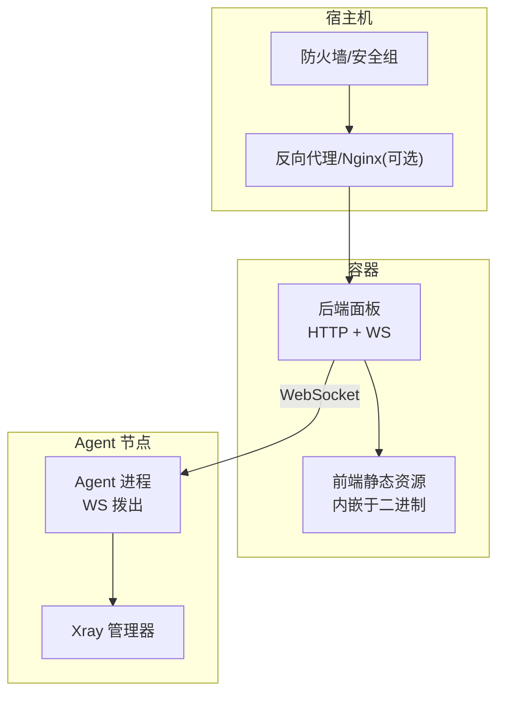
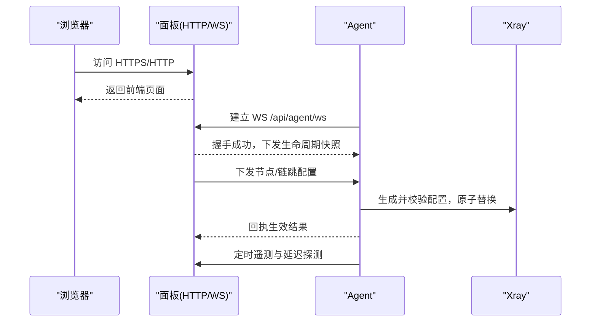
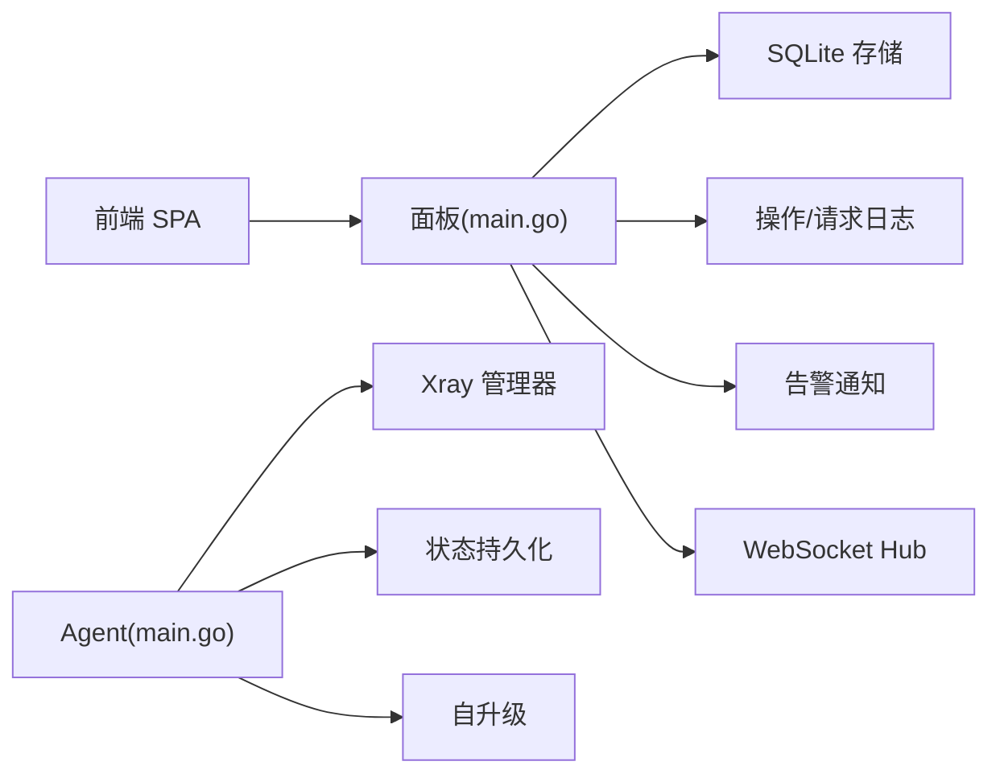

# 常见问题

<cite>
**本文引用的文件**   
- [Dockerfile](file://Dockerfile)
- [install.sh](file://install.sh)
- [KNOWN_ISSUES.md](file://docs/KNOWN_ISSUES.md)
- [backend/main.go](file://src/backend/cmd/backend/main.go)
- [agent/main.go](file://src/agent/cmd/agent/main.go)
- [panel/settings.go](file://src/backend/internal/panel/settings.go)
- [xray/manager.go](file://src/agent/internal/xray/manager.go)
- [shared/config.go](file://src/shared/config.go)
- [dev-e2e-install-panel.sh](file://scripts/dev-e2e-install-panel.sh)
- [dev-e2e-install-agent.sh](file://scripts/dev-e2e-install-agent.sh)
</cite>

## 目录
1. [简介](#简介)
2. [项目结构](#项目结构)
3. [核心组件](#核心组件)
4. [架构总览](#架构总览)
5. [详细组件分析](#详细组件分析)
6. [依赖关系分析](#依赖关系分析)
7. [性能与稳定性建议](#性能与稳定性建议)
8. [故障排查指南](#故障排查指南)
9. [结论](#结论)
10. [附录：安装与配置速查](#附录安装与配置速查)

## 简介
本 FAQ 聚焦 Lattix-codex 在安装、配置与使用过程中的典型问题，覆盖 Docker 部署、面板启动、Agent 连接三大场景。每个问题包含错误现象、根因分析与解决步骤，并给出预防与最佳实践，帮助用户快速定位并解决问题。

## 项目结构
Lattix-codex 由后端面板（Go）、Agent（Go）、前端（Bun/Vite）组成，通过 WebSocket 建立长连接进行双向控制。Docker 镜像将前端构建产物内嵌到后端二进制中，默认监听 8080 端口，支持多种 TLS 模式（关闭、自带证书、ACME、域名路径）。

图表来源
- [Dockerfile:1-44](file://Dockerfile#L1-L44)
- [backend/main.go:442-472](file://src/backend/cmd/backend/main.go#L442-L472)
- [agent/main.go:137-155](file://src/agent/cmd/agent/main.go#L137-L155)

章节来源
- [Dockerfile:1-44](file://Dockerfile#L1-L44)
- [backend/main.go:62-90](file://src/backend/cmd/backend/main.go#L62-L90)
- [agent/main.go:33-48](file://src/agent/cmd/agent/main.go#L33-L48)

## 核心组件
- 后端面板：提供 HTTP API、WebSocket 端点、SQLite 存储、日志与告警、TLS 管理、自更新等能力。
- Agent：在受控服务器上运行，维护 xray 配置、热更新、遥测上报、漂移检测、自升级等。
- 前端：SPA 构建产物内嵌到后端，提供可视化操作界面。

章节来源
- [backend/main.go:319-441](file://src/backend/cmd/backend/main.go#L319-L441)
- [agent/main.go:50-98](file://src/agent/cmd/agent/main.go#L50-L98)
- [Dockerfile:19-31](file://Dockerfile#L19-L31)

## 架构总览
面板与 Agent 通过 /api/agent/ws 建立 WebSocket 长连接，承载命令下发、状态同步、遥测与事件上报。面板支持多 TLS 模式，默认监听 8080；可通过反向代理终止 TLS 或使用内置 ACME。

图表来源
- [backend/main.go:367-374](file://src/backend/cmd/backend/main.go#L367-L374)
- [agent/main.go:137-155](file://src/agent/cmd/agent/main.go#L137-L155)
- [xray/manager.go:232-273](file://src/agent/internal/xray/manager.go#L232-L273)

## 详细组件分析

### Docker 部署问题
- 镜像拉取失败
  - 现象：docker pull 或 docker compose up 时报网络错误或认证失败。
  - 根因：GHCR 镜像需公开可匿名拉取；若仓库私有则无法匿名获取。
  - 处理：确保 ghcr.io/beanya/lattix 为公开；或在 CI/私有环境配置凭据后拉取。
  - 预防：发布流程保持镜像公开；文档明确说明依赖公开镜像。
  - 参考：[KNOWN_ISSUES.md:38-41](file://docs/KNOWN_ISSUES.md#L38-L41)

- 端口冲突
  - 现象：容器启动失败，提示端口被占用。
  - 根因：默认暴露 8080，宿主或其他服务占用了该端口。
  - 处理：修改映射端口或释放占用端口；检查防火墙与安全组。
  - 预防：统一端口规划，避免与 Nginx/其他服务冲突。
  - 参考：[Dockerfile:37-43](file://Dockerfile#L37-L43)

- 权限问题
  - 现象：写入数据目录失败、证书不可读。
  - 根因：容器以非 root 用户运行，挂载目录权限不足。
  - 处理：确保挂载目录属主为 lattix:lattix 或赋予相应读写权限。
  - 预防：安装脚本创建标准目录结构；生产环境提前准备权限。
  - 参考：[Dockerfile:27-31](file://Dockerfile#L27-L31)

- 证书路径不一致
  - 现象：设置页显示的路径与外部工具写入路径不一致。
  - 根因：容器内路径为 /data/certs，宿主机为 /opt/lattix-panel/data/certs。
  - 处理：按对应路径写入证书；ACME 缓存位于 /opt/lattix-panel/data/acme-cache。
  - 预防：使用安装脚本统一管理证书目录。
  - 参考：[KNOWN_ISSUES.md:29-36](file://docs/KNOWN_ISSUES.md#L29-L36)

章节来源
- [Dockerfile:24-43](file://Dockerfile#L24-L43)
- [KNOWN_ISSUES.md:23-41](file://docs/KNOWN_ISSUES.md#L23-L41)

### 面板启动问题
- 端口占用
  - 现象：面板启动失败，报端口已占用。
  - 根因：-addr 指定的地址与端口已被占用。
  - 处理：更换端口或释放占用；检查系统服务。
  - 预防：使用独立端口，避免与其他服务冲突。
  - 参考：[backend/main.go:75-80](file://src/backend/cmd/backend/main.go#L75-L80)

- 证书配置错误
  - 现象：启动时报证书/私钥无效或互斥参数错误。
  - 根因：-tls-cert 与 -tls-key 必须同时提供；与 ACME 参数互斥；路径模式需要有效域名与可用证书文件。
  - 处理：修正参数组合；确保 PEM 配对有效；path 模式下确认文件存在且可读。
  - 预防：通过设置页保存并校验后再重启；遵循“重启生效”的变更策略。
  - 参考：[backend/main.go:215-238](file://src/backend/cmd/backend/main.go#L215-L238), [panel/settings.go:339-388](file://src/backend/internal/panel/settings.go#L339-L388)

- 环境变量错误
  - 现象：数据库路径、日志目录、证书目录未生效或报错。
  - 根因：环境变量名或值不正确；相对路径解析异常。
  - 处理：使用绝对路径；核对 LATTIX_DB、LATTIX_LOG_DIR、LATTIX_TLS_DIR、LATTIX_ACME_CACHE。
  - 预防：在 .env 文件中集中管理；启动前校验路径存在。
  - 参考：[backend/main.go:76-88](file://src/backend/cmd/backend/main.go#L76-L88), [Dockerfile:33-36](file://Dockerfile#L33-L36)

- 对外地址 PublicURL 不合法
  - 现象：设置保存时报错。
  - 根因：PublicURL 须为 http(s)://域名或IP[:端口]。
  - 处理：修正 URL 格式；去除尾部斜杠。
  - 预防：在设置页输入时即时校验。
  - 参考：[panel/settings.go:313-320](file://src/backend/internal/panel/settings.go#L313-L320)

章节来源
- [backend/main.go:75-88](file://src/backend/cmd/backend/main.go#L75-L88)
- [panel/settings.go:313-388](file://src/backend/internal/panel/settings.go#L313-L388)

### Agent 连接问题
- 网络连通性
  - 现象：Agent 无法连接面板，反复重连。
  - 根因：面板地址不可达、防火墙阻断、DNS 解析失败。
  - 处理：检查面板可达性；开放必要端口；验证 DNS。
  - 预防：使用稳定域名；监控网络连通性。
  - 参考：[agent/main.go:137-155](file://src/agent/cmd/agent/main.go#L137-L155)

- 防火墙设置
  - 现象：WS 握手失败或被中断。
  - 根因：中间设备丢弃 Upgrade 头或限制长连接。
  - 处理：放行 WebSocket 升级；允许长连接；必要时调整超时。
  - 预防：统一网络策略；测试不同代理行为。
  - 参考：[backend/main.go:367-374](file://src/backend/cmd/backend/main.go#L367-L374)

- 认证拒绝
  - 现象：首次连接即被拒绝，不再重试。
  - 根因：面板明确拒绝当前凭证（面板重建或凭证替换）。
  - 处理：使用新的面板安装命令重新绑定；更新 bootstrap token。
  - 预防：面板实例变更后及时刷新 Agent 配置。
  - 参考：[agent/main.go:78-85](file://src/agent/cmd/agent/main.go#L78-L85)

- 心跳与延迟探测
  - 现象：连接频繁断开或延迟高。
  - 根因：心跳超时、网络抖动、代理限制。
  - 处理：调整心跳间隔；检查代理超时；优化网络。
  - 预防：端到端监控延迟与丢包。
  - 参考：[agent/main.go:118-124](file://src/agent/cmd/agent/main.go#L118-L124), [agent/latency.go:12-34](file://src/agent/cmd/agent/latency.go#L12-L34)

章节来源
- [agent/main.go:118-155](file://src/agent/cmd/agent/main.go#L118-L155)
- [agent/latency.go:12-34](file://src/agent/cmd/agent/latency.go#L12-L34)

### Xray 配置与热更新问题
- 配置校验失败
  - 现象：应用节点/链跳时报“xray 配置校验失败”。
  - 根因：模板或占位符替换后生成的 JSON 非法。
  - 处理：检查模板与协议参数；确认占位符正确替换。
  - 预防：先在开发环境验证模板；使用向导生成。
  - 参考：[xray/manager.go:256-259](file://src/agent/internal/xray/manager.go#L256-L259)

- 配置漂移检测
  - 现象：面板检测到 config.json 被外部修改。
  - 根因：外部工具直接编辑了配置文件。
  - 处理：恢复受管状态；避免手动修改；使用面板下发配置。
  - 预防：锁定配置文件权限；仅 Agent 管理。
  - 参考：[xray/manager.go:275-297](file://src/agent/internal/xray/manager.go#L275-L297)

- 回滚机制
  - 现象：热操作失败且重启失败。
  - 根因：热更新失败且重启兜底也失败。
  - 处理：查看备份配置；修复后重试；必要时回滚到 prev。
  - 预防：变更前备份；灰度发布。
  - 参考：[xray/manager.go:221-227](file://src/agent/internal/xray/manager.go#L221-L227)

章节来源
- [xray/manager.go:221-273](file://src/agent/internal/xray/manager.go#L221-L273)
- [shared/config.go:149-168](file://src/shared/config.go#L149-L168)

## 依赖关系分析
- 面板依赖 SQLite、日志子系统、告警通知、WebSocket Hub、调度器。
- Agent 依赖 xray 管理器、状态持久化、自升级模块。
- 前端依赖后端 API 与 WebSocket 端点。

图表来源
- [backend/main.go:319-441](file://src/backend/cmd/backend/main.go#L319-L441)
- [agent/main.go:50-98](file://src/agent/cmd/agent/main.go#L50-L98)

章节来源
- [backend/main.go:319-441](file://src/backend/cmd/backend/main.go#L319-L441)
- [agent/main.go:50-98](file://src/agent/cmd/agent/main.go#L50-L98)

## 性能与稳定性建议
- 日志轮转与大小限制：合理设置操作日志条数与请求日志 MB 上限，避免磁盘膨胀。
- 健康检查：利用 /healthz 与 /readyz 实现存活与就绪探针。
- 优雅关停：面板支持信号处理与 draining，确保连接平滑退出。
- 证书热加载：path 模式支持续期免重启，减少业务中断。

章节来源
- [backend/main.go:377-424](file://src/backend/cmd/backend/main.go#L377-L424)
- [panel/settings.go:250-263](file://src/backend/internal/panel/settings.go#L250-L263)

## 故障排查指南
- 安装与版本
  - 使用 install.sh 选择 Docker Compose 或原生模式；交互式向导引导填写绑定地址、端口、管理员账号密码与配置目录。
  - 一键安装会下载最新 release 并调用子脚本完成部署。
  - 参考：[install.sh:78-101](file://install.sh#L78-L101), [install.sh:103-143](file://install.sh#L103-L143)

- 面板可用性验证
  - 通过 curl 检查 200 响应；登录后获取设置项中的 tls_dir 是否一致。
  - 参考：[dev-e2e-install-panel.sh:84-94](file://scripts/dev-e2e-install-panel.sh#L84-L94)

- Agent 安装与清理
  - 构建 agent 与 backend 二进制；清理残留进程与 crontab 条目；确保临时目录清理。
  - 参考：[dev-e2e-install-agent.sh:26-55](file://scripts/dev-e2e-install-agent.sh#L26-L55)

- 常见错误定位
  - 端口冲突：检查 -addr 与系统端口占用。
  - 证书错误：校验 PEM 配对、路径模式域名与文件存在性。
  - 环境变量：核对 LATTIX_* 变量与绝对路径。
  - 认证拒绝：使用新面板安装命令重新绑定 Agent。
  - 配置漂移：避免外部修改 config.json，使用面板下发。

章节来源
- [install.sh:78-143](file://install.sh#L78-L143)
- [dev-e2e-install-panel.sh:84-103](file://scripts/dev-e2e-install-panel.sh#L84-L103)
- [dev-e2e-install-agent.sh:26-55](file://scripts/dev-e2e-install-agent.sh#L26-L55)

## 结论
通过理解面板与 Agent 的交互模型、TLS 模式与证书路径差异、以及配置落盘与漂移检测机制，可以快速定位并解决大多数安装与运行问题。建议在生产环境中采用反向代理终止 TLS、统一端口与路径管理、启用健康检查与日志轮转，以提升稳定性与可运维性。

## 附录：安装与配置速查
- Docker 部署要点
  - 镜像公开：确保 GHCR 镜像可匿名拉取。
  - 端口映射：默认 8080，避免冲突。
  - 权限：挂载目录属主 lattix:lattix。
  - 证书路径：容器内 /data/certs，宿主机 /opt/lattix-panel/data/certs。
  - 参考：[Dockerfile:24-43](file://Dockerfile#L24-L43), [KNOWN_ISSUES.md:29-41](file://docs/KNOWN_ISSUES.md#L29-L41)

- 面板启动参数与环境变量
  - 关键参数：-addr、-db、-log-dir、-static、-admin-user、-admin-pass、-public-url、-tls-cert/-tls-key、-tls-dir、-tls-acme-domain、-tls-acme-email、-reset-admin。
  - 环境变量：LATTIX_DB、LATTIX_LOG_DIR、LATTIX_STATIC、LATTIX_ADMIN_USER、LATTIX_ADMIN_PASS、LATTIX_PUBLIC_URL、LATTIX_TLS_DIR、LATTIX_ACME_CACHE。
  - 参考：[backend/main.go:75-88](file://src/backend/cmd/backend/main.go#L75-L88)

- Agent 连接参数
  - 关键参数：-panel、-token、-state、-settings、-xray-bin、-xray-config、-xray-api、-xray-runner、-xray-release-base。
  - 参考：[agent/main.go:34-43](file://src/agent/cmd/agent/main.go#L34-L43)

- 设置页校验规则
  - PublicURL 格式、TLS 模式与完整性校验、Webhook 地址校验、日志保留范围等。
  - 参考：[panel/settings.go:313-388](file://src/backend/internal/panel/settings.go#L313-L388)