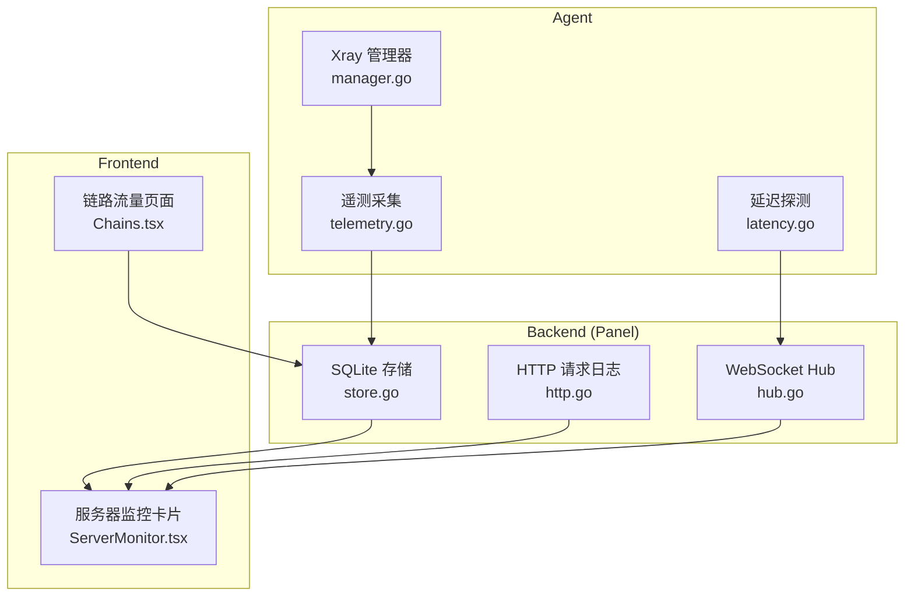
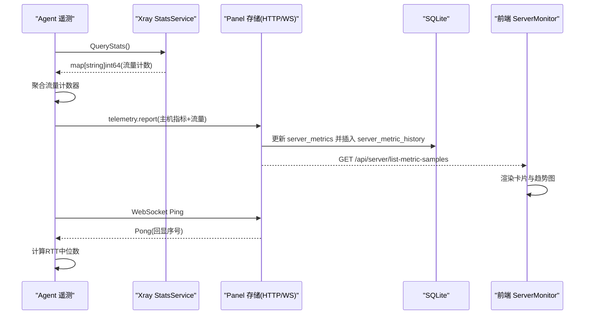
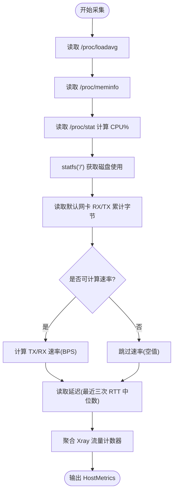
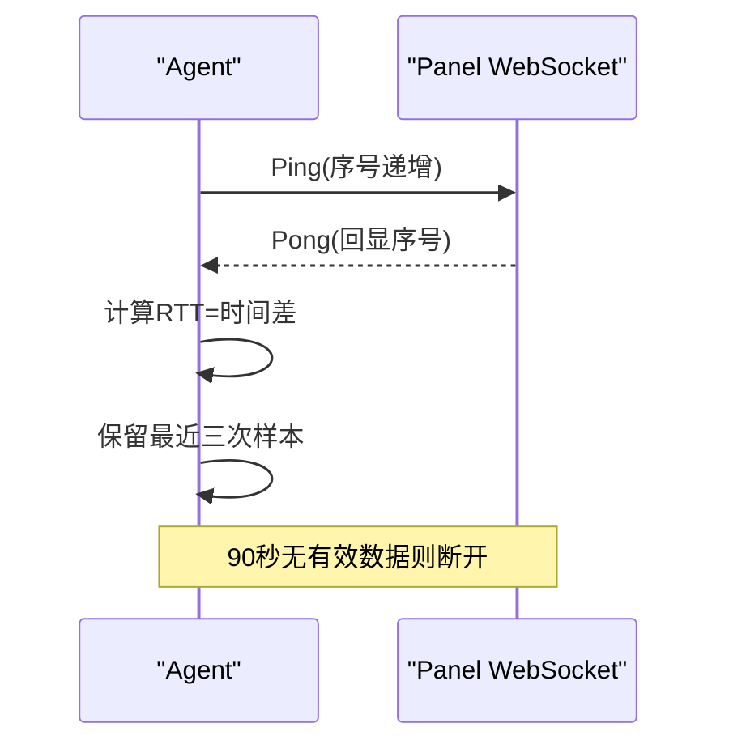
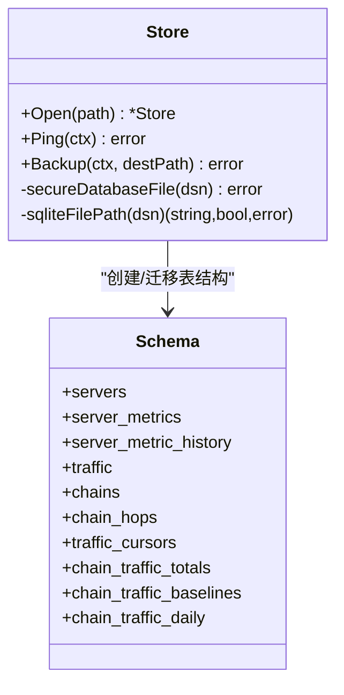
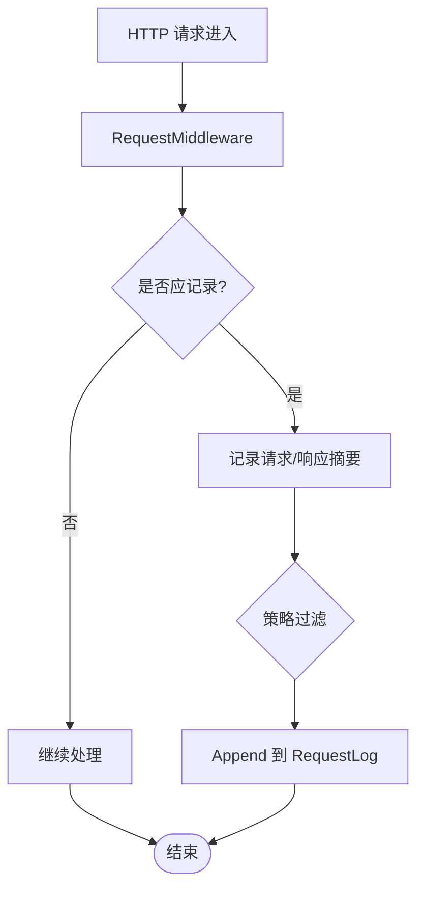
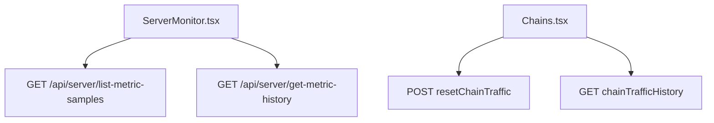
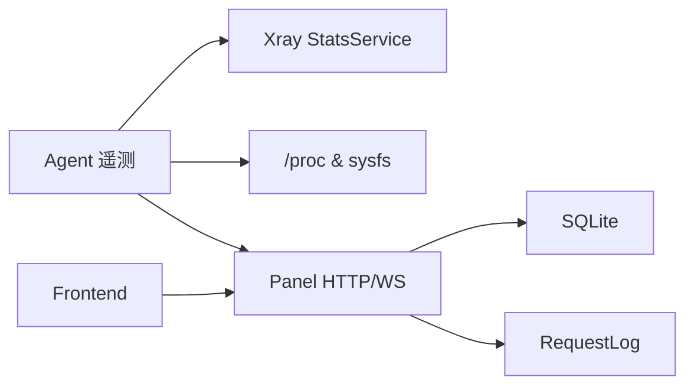

# 性能诊断

<cite>
**本文引用的文件**   
- [telemetry.go](file://src/agent/cmd/agent/telemetry.go)
- [latency.go](file://src/agent/cmd/agent/latency.go)
- [manager.go](file://src/agent/internal/xray/manager.go)
- [store.go](file://src/backend/internal/store/store.go)
- [http.go](file://src/backend/internal/logging/http.go)
- [ServerMonitor.tsx](file://src/frontend/src/components/ServerMonitor.tsx)
- [Chains.tsx](file://src/frontend/src/pages/Chains.tsx)
- [hub.go](file://src/backend/internal/ws/hub.go)
- [server-probe-monitoring-design.md](file://docs/server-probe-monitoring-design.md)
</cite>

## 目录
1. [简介](#简介)
2. [项目结构](#项目结构)
3. [核心组件](#核心组件)
4. [架构总览](#架构总览)
5. [详细组件分析](#详细组件分析)
6. [依赖关系分析](#依赖关系分析)
7. [性能考量与优化建议](#性能考量与优化建议)
8. [故障排查指南](#故障排查指南)
9. [结论](#结论)
10. [附录](#附录)

## 简介
本指南面向 Lattix-codex 的性能诊断与优化，覆盖系统资源监控（CPU、内存、磁盘 I/O、网络带宽）、瓶颈识别技巧（慢查询、连接池、内存泄漏）、调优最佳实践（数据库、缓存、并发控制）、内置指标与外部工具使用、性能测试方法与基准数据，以及常见问题诊断流程与解决方案。文档基于仓库中 Agent 遥测采集、Panel 存储与日志、前端可视化等实现进行说明。

## 项目结构
本项目由三部分组成：
- Agent：运行在目标主机上，负责采集主机指标、Xray 流量统计、延迟探测并上报 Panel。
- Backend（Panel）：提供 HTTP/WebSocket API，持久化指标与历史，维护连接状态与命令分发。
- Frontend：展示服务器卡片、实时指标与趋势图，支持历史查询与链路流量管理。

**图表来源** 
- [telemetry.go:103-155](file://src/agent/cmd/agent/telemetry.go#L103-L155)
- [latency.go:64-97](file://src/agent/cmd/agent/latency.go#L64-L97)
- [manager.go:377-402](file://src/agent/internal/xray/manager.go#L377-L402)
- [store.go:172-214](file://src/backend/internal/store/store.go#L172-L214)
- [http.go:43-82](file://src/backend/internal/logging/http.go#L43-L82)
- [hub.go:48-108](file://src/backend/internal/ws/hub.go#L48-L108)
- [ServerMonitor.tsx:396-431](file://src/frontend/src/components/ServerMonitor.tsx#L396-L431)
- [Chains.tsx:686-695](file://src/frontend/src/pages/Chains.tsx#L686-L695)

**章节来源**
- [server-probe-monitoring-design.md:1-104](file://docs/server-probe-monitoring-design.md#L1-L104)

## 核心组件
- 遥测采集（Agent）：从 /proc/stat、/proc/loadavg、/proc/meminfo、statfs("/")、/sys/class/net 读取 CPU、负载、内存、磁盘、网卡计数器，计算速率与延迟，聚合 Xray 流量统计。
- 延迟探测（Agent）：通过 WebSocket Ping/Pong 计算 RTT，保留最近三次样本的中位数作为当前延迟。
- 存储（Panel）：SQLite 单连接 + busy_timeout，最新指标表 server_metrics 与历史表 server_metric_history，索引按 server_id, sampled_at；提供 VACUUM INTO 备份。
- 日志（Panel）：HTTP 请求中间件记录请求/响应摘要、耗时、错误摘要，支持策略过滤与敏感信息脱敏。
- 前端（Frontend）：服务器卡片网格展示 CPU/内存/磁盘/网络速率/延迟，支持 24 小时历史与批量样本趋势。

**章节来源**
- [telemetry.go:103-155](file://src/agent/cmd/agent/telemetry.go#L103-L155)
- [latency.go:64-97](file://src/agent/cmd/agent/latency.go#L64-L97)
- [store.go:172-214](file://src/backend/internal/store/store.go#L172-L214)
- [http.go:43-82](file://src/backend/internal/logging/http.go#L43-L82)
- [ServerMonitor.tsx:396-431](file://src/frontend/src/components/ServerMonitor.tsx#L396-L431)

## 架构总览
下图展示了从 Agent 采集到 Panel 存储与前端的完整数据流，包括遥测帧组装、Xray 统计拉取、WebSocket 延迟探测、SQLite 写入与前端渲染。

**图表来源** 
- [telemetry.go:48-53](file://src/agent/cmd/agent/telemetry.go#L48-L53)
- [telemetry.go:103-155](file://src/agent/cmd/agent/telemetry.go#L103-L155)
- [store.go:172-214](file://src/backend/internal/store/store.go#L172-L214)
- [latency.go:64-97](file://src/agent/cmd/agent/latency.go#L64-L97)
- [ServerMonitor.tsx:396-431](file://src/frontend/src/components/ServerMonitor.tsx#L396-L431)

## 详细组件分析

### 遥测采集与主机指标（Agent）
- CPU 使用率：两次采样差值计算，首帧不可用；空闲 tick 包含 idle+iowait。
- 负载：load1/load5/load15 直接解析。
- 内存：MemTotal - MemAvailable。
- 磁盘：statfs("/") 获取总量与已用量。
- 网络：默认路由接口 RX/TX 累计字节与速率（差值/时间），首次或接口切换时速率不可用。
- 延迟：WebSocket Ping/Pong 的最近三次 RTT 中位数。
- 健康阈值：CPU/内存/磁盘 <80% 正常，80–90% 警告，>90% 严重；延迟 <100ms 正常，100–300ms 警告，>300ms 严重。

**图表来源** 
- [telemetry.go:103-155](file://src/agent/cmd/agent/telemetry.go#L103-L155)
- [telemetry.go:157-184](file://src/agent/cmd/agent/telemetry.go#L157-L184)
- [telemetry.go:298-320](file://src/agent/cmd/agent/telemetry.go#L298-L320)
- [latency.go:64-97](file://src/agent/cmd/agent/latency.go#L64-L97)

**章节来源**
- [telemetry.go:103-155](file://src/agent/cmd/agent/telemetry.go#L103-L155)
- [telemetry.go:157-184](file://src/agent/cmd/agent/telemetry.go#L157-L184)
- [telemetry.go:298-320](file://src/agent/cmd/agent/telemetry.go#L298-L320)
- [latency.go:64-97](file://src/agent/cmd/agent/latency.go#L64-L97)
- [server-probe-monitoring-design.md:28-46](file://docs/server-probe-monitoring-design.md#L28-L46)

### 延迟探测与连接保活（Agent/Panel）
- Agent 主动发送 Ping，Panel 原样回显 Pong；Agent 使用本地单调时钟计算 RTT。
- 初始化测试失败（10 秒无响应）关闭连接并重连；周期探测每 30 秒一次。
- 连续 90 秒未收到有效数据判定连接失效；不再主动 Ping，保活与控制帧共用。

**图表来源** 
- [latency.go:64-97](file://src/agent/cmd/agent/latency.go#L64-L97)
- [server-probe-monitoring-design.md:19-26](file://docs/server-probe-monitoring-design.md#L19-L26)

**章节来源**
- [latency.go:64-97](file://src/agent/cmd/agent/latency.go#L64-L97)
- [server-probe-monitoring-design.md:19-26](file://docs/server-probe-monitoring-design.md#L19-L26)

### 存储与历史清理（Panel）
- 最新指标表 server_metrics 每台服务器一行，快速读取。
- 历史表 server_metric_history 保存时间序列，索引 (server_id, sampled_at)。
- 每小时清理 24 小时以前数据；删除服务器时同步删除最新与历史指标。
- SQLite 单连接 + busy_timeout(5000)，避免并发写锁冲突；VACUUM INTO 导出一致性快照。

**图表来源** 
- [store.go:368-389](file://src/backend/internal/store/store.go#L368-L389)
- [store.go:172-214](file://src/backend/internal/store/store.go#L172-L214)
- [store.go:448-465](file://src/backend/internal/store/store.go#L448-L465)

**章节来源**
- [store.go:172-214](file://src/backend/internal/store/store.go#L172-L214)
- [store.go:368-389](file://src/backend/internal/store/store.go#L368-L389)
- [store.go:448-465](file://src/backend/internal/store/store.go#L448-L465)

### 请求日志与慢请求识别（Panel）
- HTTP 中间件记录请求 ID、TraceID、路径、参数、状态码、耗时、错误摘要。
- 策略支持 full/failures_only/none；对敏感字段脱敏；WebSocket 升级单独记录。
- 慢请求阈值：>2s 标记为 Warning；5xx 或内部错误标记为 Error。

**图表来源** 
- [http.go:43-82](file://src/backend/internal/logging/http.go#L43-L82)
- [http.go:166-183](file://src/backend/internal/logging/http.go#L166-L183)

**章节来源**
- [http.go:43-82](file://src/backend/internal/logging/http.go#L43-L82)
- [http.go:166-183](file://src/backend/internal/logging/http.go#L166-L183)

### 前端可视化与趋势（Frontend）
- 服务器卡片网格展示 CPU/内存/磁盘/网络速率/延迟，支持健康阈值颜色。
- 详情抽屉显示 24 小时历史趋势，批量样本接口减少请求次数。
- 链路流量页支持重置累计流量与查看历史。

**图表来源** 
- [ServerMonitor.tsx:396-431](file://src/frontend/src/components/ServerMonitor.tsx#L396-L431)
- [ServerMonitor.tsx:698-710](file://src/frontend/src/components/ServerMonitor.tsx#L698-L710)
- [Chains.tsx:686-695](file://src/frontend/src/pages/Chains.tsx#L686-L695)

**章节来源**
- [ServerMonitor.tsx:396-431](file://src/frontend/src/components/ServerMonitor.tsx#L396-L431)
- [ServerMonitor.tsx:698-710](file://src/frontend/src/components/ServerMonitor.tsx#L698-L710)
- [Chains.tsx:686-695](file://src/frontend/src/pages/Chains.tsx#L686-L695)

## 依赖关系分析
- Agent 遥测依赖 Xray StatsService 拉取流量计数，依赖 /proc 与 sysfs 读取主机指标。
- Panel 存储依赖 SQLite，单连接避免锁争用；日志模块依赖 HTTP 中间件。
- 前端依赖 Panel API 获取指标与历史，WebSocket 用于连接状态与延迟探测。

**图表来源** 
- [telemetry.go:48-53](file://src/agent/cmd/agent/telemetry.go#L48-L53)
- [store.go:368-389](file://src/backend/internal/store/store.go#L368-L389)
- [http.go:43-82](file://src/backend/internal/logging/http.go#L43-L82)
- [ServerMonitor.tsx:396-431](file://src/frontend/src/components/ServerMonitor.tsx#L396-L431)

**章节来源**
- [telemetry.go:48-53](file://src/agent/cmd/agent/telemetry.go#L48-L53)
- [store.go:368-389](file://src/backend/internal/store/store.go#L368-L389)
- [http.go:43-82](file://src/backend/internal/logging/http.go#L43-L82)
- [ServerMonitor.tsx:396-431](file://src/frontend/src/components/ServerMonitor.tsx#L396-L431)

## 性能考量与优化建议
- 数据库优化
  - 保持 SQLite 单连接与 busy_timeout，避免“database is locked”；定期 VACUUM INTO 备份。
  - 利用索引 (server_id, sampled_at) 加速历史查询；限制历史保留窗口（24 小时）。
- 缓存策略
  - 前端批量样本接口减少多次请求；后端可考虑短期缓存热点指标（如最近 5 分钟）。
- 并发控制
  - 遥测采集与日志写入需限流，避免阻塞主循环；WebSocket Hub 使用读写锁保护连接状态。
- 资源监控
  - 关注 CPU%、负载、内存使用率、磁盘占用、网卡速率与延迟；设置健康阈值告警。
- 外部监控工具
  - 结合系统级工具（top、htop、iostat、sar、netstat/ss）验证 Agent 指标；使用 Prometheus/Grafana 接入 Panel API 或 Agent 遥测端点（若暴露）。

[本节为通用指导，不直接分析具体文件]

## 故障排查指南
- 慢查询定位
  - 通过 Panel 请求日志筛选 DurationMS > 2s 的记录，结合 TraceID 追踪调用链。
- 连接池与连接状态
  - 检查 WebSocket Hub 的 IsOnline 与 ConnectionState；确认 Pong 超时与重连逻辑。
- 内存泄漏检测
  - 观察 Agent 进程 RSS/Heap 增长；检查遥测采集循环是否持有大对象引用。
- 磁盘 I/O 问题
  - 使用 iostat/sar 验证 statfs("/") 与 SQLite 写入是否造成高 IOWait；必要时调整 flush 频率。
- 网络带宽瓶颈
  - 对比网卡 RX/TX 速率与业务流量；检查默认路由接口切换导致的速率基线重置。

**章节来源**
- [http.go:166-183](file://src/backend/internal/logging/http.go#L166-L183)
- [hub.go:48-108](file://src/backend/internal/ws/hub.go#L48-L108)
- [telemetry.go:157-184](file://src/agent/cmd/agent/telemetry.go#L157-L184)

## 结论
Lattix-codex 通过 Agent 遥测与 Panel 存储实现了完整的系统资源监控能力。结合 SQLite 单连接、请求日志与前端可视化，可有效识别性能瓶颈并进行针对性优化。建议持续完善缓存策略、并发控制与外部监控集成，以提升整体稳定性与可观测性。

[本节为总结，不直接分析具体文件]

## 附录
- 健康阈值参考：CPU/内存/磁盘 <80% 正常，80–90% 警告，>90% 严重；延迟 <100ms 正常，100–300ms 警告，>300ms 严重。
- 关键 API：/api/server/list、/api/server/list-metric-samples、/api/server/get-metric-history、resetChainTraffic、chainTrafficHistory。

[本节为补充信息，不直接分析具体文件]