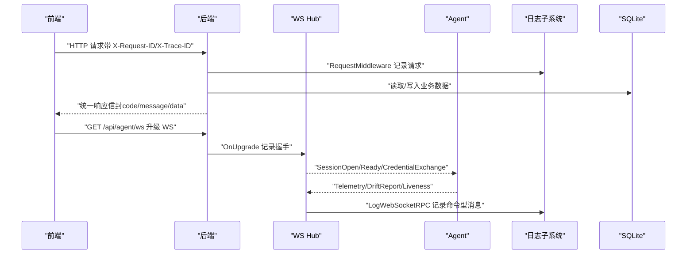
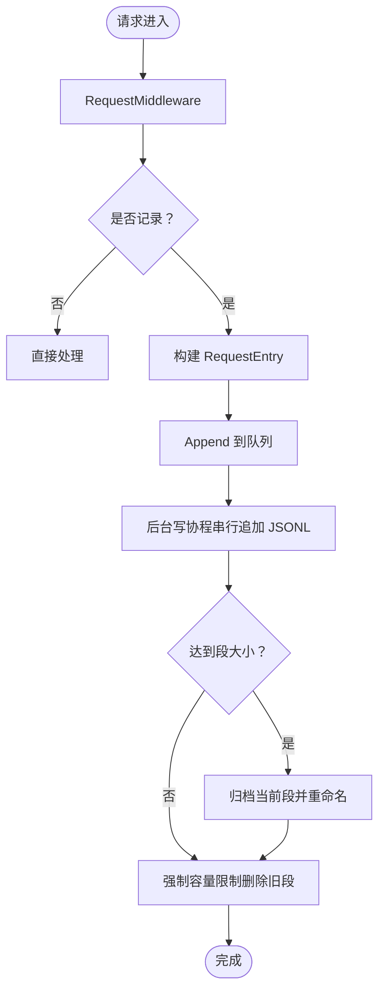
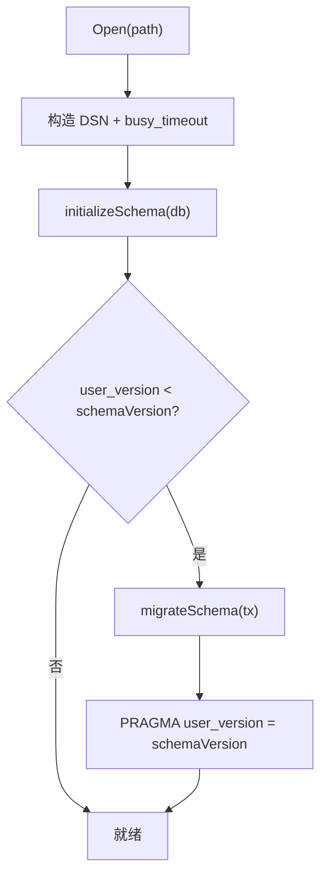
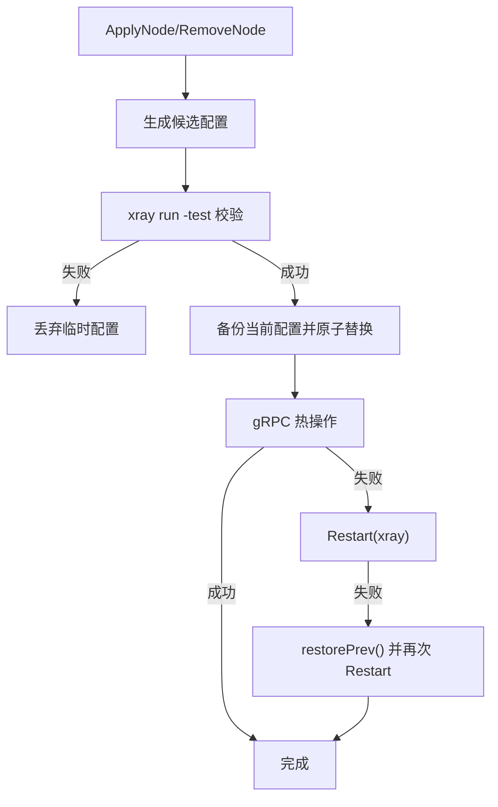
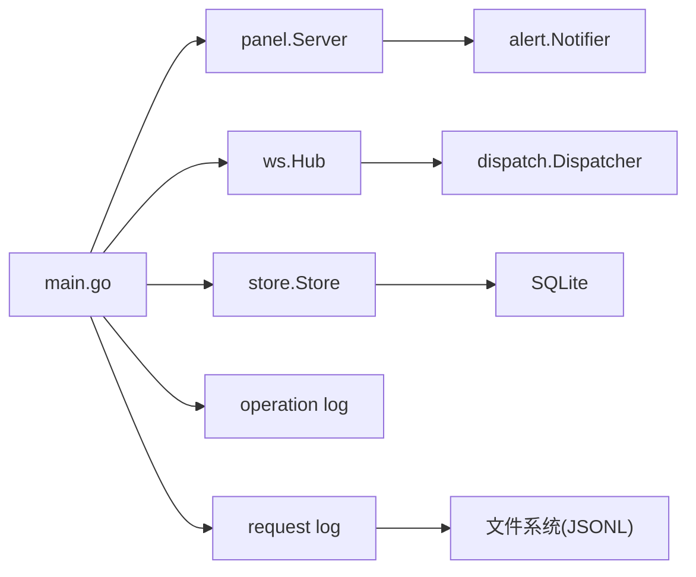

# 故障排查

<cite>
**本文引用的文件**   
- [KNOWN_ISSUES.md](file://docs/KNOWN_ISSUES.md)
- [logging-design.md](file://docs/logging-design.md)
- [rpc-api-design.md](file://docs/rpc-api-design.md)
- [main.go（后端入口）](file://src/backend/cmd/backend/main.go)
- [context.go（请求元数据）](file://src/backend/internal/logging/context.go)
- [http.go（HTTP 日志中间件）](file://src/backend/internal/logging/http.go)
- [request.go（请求日志实现）](file://src/backend/internal/logging/request.go)
- [logs.go（日志 API）](file://src/backend/internal/panel/logs.go)
- [hub.go（WebSocket Hub）](file://src/backend/internal/ws/hub.go)
- [alert.go（告警通知）](file://src/backend/internal/alert/alert.go)
- [migrations.go（数据库迁移）](file://src/backend/internal/store/migrations.go)
- [store.go（SQLite 存储）](file://src/backend/internal/store/store.go)
- [manager.go（xray 配置管理）](file://src/agent/internal/xray/manager.go)
- [latency.go（延迟探测）](file://src/agent/cmd/agent/latency.go)
- [install.sh（统一安装入口）](file://install.sh)
</cite>

## 目录
1. [简介](#简介)
2. [项目结构](#项目结构)
3. [核心组件](#核心组件)
4. [架构总览](#架构总览)
5. [详细组件分析](#详细组件分析)
6. [依赖关系分析](#依赖关系分析)
7. [性能注意事项](#性能注意事项)
8. [故障排查指南](#故障排查指南)
9. [结论](#结论)
10. [附录](#附录)

## 简介
本文件为 Lattix-codex 的故障排查手册，覆盖安装、配置、运行、日志、网络、数据库与系统级问题，并提供性能诊断方法与应急恢复流程。内容基于代码与设计文档提炼，确保可操作、可追溯。

## 项目结构
- 后端：Go 编写的 HTTP API + WebSocket 服务端，负责面板管理、Agent 通道、日志与存储。
- Agent：部署在受控服务器，通过 WebSocket 与后端通信，管理 xray 配置与生命周期。
- 前端：React SPA，提供可视化界面与日志查看能力。
- 脚本与文档：安装脚本、E2E 测试脚本、设计文档与已知问题说明。

```mermaid
graph TB
subgraph "后端"
BE["后端服务<br/>HTTP + WS"]
LOG["日志子系统<br/>操作日志 + 请求日志"]
DB["SQLite 存储"]
HUB["WS Hub<br/>连接管理与分发"]
ALERT["告警通知<br/>Webhook / Telegram"]
end
subgraph "Agent"
AG["Agent 进程"]
XRAY["xray 管理器"]
end
subgraph "前端"
FE["前端 SPA"]
end
FE --> BE
BE --> HUB
HUB < --> AG
AG --> XRAY
BE --> LOG
BE --> DB
BE --> ALERT
```

图表来源 
- [main.go（后端入口）:1-120](file://src/backend/cmd/backend/main.go#L1-L120)
- [hub.go（WebSocket Hub）:1-120](file://src/backend/internal/ws/hub.go#L1-L120)
- [request.go（请求日志实现）:1-120](file://src/backend/internal/logging/request.go#L1-L120)
- [store.go（SQLite 存储）:355-396](file://src/backend/internal/store/store.go#L355-L396)
- [alert.go（告警通知）:1-80](file://src/backend/internal/alert/alert.go#L1-L80)

章节来源
- [main.go（后端入口）:1-120](file://src/backend/cmd/backend/main.go#L1-L120)
- [logging-design.md:1-60](file://docs/logging-design.md#L1-L60)

## 核心组件
- 日志子系统：操作日志（SQLite）与请求日志（JSONL），支持容量控制、脱敏、异步写入与降级。
- WebSocket Hub：维护 Agent 连接、状态跃迁、重连与优雅关停。
- 存储层：SQLite，单连接 + busy_timeout，事务化迁移与备份。
- 告警通知：Webhook 与 Telegram 双通道，防抖动窗口。
- xray 管理器：配置校验、热更新与回滚、漂移修复。

章节来源
- [logging-design.md:1-120](file://docs/logging-design.md#L1-L120)
- [hub.go（WebSocket Hub）:1-120](file://src/backend/internal/ws/hub.go#L1-L120)
- [store.go（SQLite 存储）:355-396](file://src/backend/internal/store/store.go#L355-L396)
- [alert.go（告警通知）:1-120](file://src/backend/internal/alert/alert.go#L1-L120)
- [manager.go（xray 配置管理）:109-170](file://src/agent/internal/xray/manager.go#L109-L170)

## 架构总览
后端启动时初始化日志、存储、Hub、调度与路由；Agent 通过 WS 建立会话并上报遥测与配置漂移；请求经中间件记录日志并返回统一信封；健康检查不进入业务日志。



图表来源 
- [http.go（HTTP 日志中间件）:43-105](file://src/backend/internal/logging/http.go#L43-L105)
- [request.go（请求日志实现）:112-150](file://src/backend/internal/logging/request.go#L112-L150)
- [hub.go（WebSocket Hub）:229-278](file://src/backend/internal/ws/hub.go#L229-L278)
- [rpc-api-design.md:283-354](file://docs/rpc-api-design.md#L283-L354)

## 详细组件分析

### 日志子系统
- 操作日志：独立 SQLite 表，按类别/重要程度/时间范围查询，清空审计保留一条记录。
- 请求日志：JSONL 分段存储，默认 10 MiB，队列满或写入失败丢弃，累计上报操作日志。
- 中间件：注入 RequestID/TraceID，白名单属性收集，敏感字段脱敏，策略控制记录级别。



图表来源 
- [http.go（HTTP 日志中间件）:43-105](file://src/backend/internal/logging/http.go#L43-L105)
- [request.go（请求日志实现）:197-322](file://src/backend/internal/logging/request.go#L197-L322)

章节来源
- [logging-design.md:120-260](file://docs/logging-design.md#L120-L260)
- [logs.go（日志 API）:38-142](file://src/backend/internal/panel/logs.go#L38-L142)
- [http.go（HTTP 日志中间件）:106-204](file://src/backend/internal/logging/http.go#L106-L204)
- [request.go（请求日志实现）:235-322](file://src/backend/internal/logging/request.go#L235-L322)

### WebSocket Hub
- 连接注册与注销：同服务器新连接替换旧连接，仅真实 offline→online 跃迁触发 OnDisconnect。
- 发送队列：每连接 256 缓冲，写满断开连接，重连后补发 queued 命令。
- 优雅关停：BeginDrain 拒绝新工作并关闭所有持久连接，等待 Wait。

```mermaid
classDiagram
class Hub {
+Auth
+Lifecycle
+OnUpgrade(r)
+OnConnect(serverID)
+OnOnline(serverID)
+OnReconnect(serverID)
+OnMessage(serverID, env)
+OnProtocolError(...)
+OnDisconnect(serverID)
+Send(ctx, serverID, env) error
+BeginDrain()
+Wait(ctx) error
+IsDraining() bool
+CloseAgent(serverID, code, reason)
+ForgetAgent(serverID, code, reason)
+CloseAllAgents(code, reason)
+SyncLifecycle(ctx, snapshot) []int64
}
class agentConn {
-hub *Hub
-serverID int64
-sessionID string
-sessionKind string
-ws *websocket.Conn
-send chan shared.Envelope
-done chan struct{}
+registerLifecycleAck(requestID) <-chan struct{}
+resolveLifecycleAck(requestID) bool
+removeLifecycleAck(requestID)
+close()
+closeWithCode(code, reason)
+writePump()
}
Hub --> agentConn : "管理多个连接"
```

图表来源 
- [hub.go（WebSocket Hub）:25-120](file://src/backend/internal/ws/hub.go#L25-L120)
- [hub.go（WebSocket Hub）:280-395](file://src/backend/internal/ws/hub.go#L280-L395)

章节来源
- [hub.go（WebSocket Hub）:155-192](file://src/backend/internal/ws/hub.go#L155-L192)
- [hub.go（WebSocket Hub）:229-278](file://src/backend/internal/ws/hub.go#L229-L278)

### 存储层与迁移
- 单连接 + busy_timeout(5s)，避免 database is locked。
- 启动时执行 PRAGMA user_version 与 schema 迁移，保证向后兼容。
- Backup 使用 VACUUM INTO 导出一致性快照。



图表来源 
- [store.go（SQLite 存储）:365-396](file://src/backend/internal/store/store.go#L365-L396)
- [migrations.go（数据库迁移）:18-52](file://src/backend/internal/store/migrations.go#L18-L52)

章节来源
- [store.go（SQLite 存储）:355-396](file://src/backend/internal/store/store.go#L355-L396)
- [migrations.go（数据库迁移）:18-52](file://src/backend/internal/store/migrations.go#L18-L52)

### xray 配置管理
- 配置生成 → 校验（xray run -test）→ 原子替换 → 热操作（gRPC ReplaceInbound）。
- 热操作失败则重启；重启失败回滚上一份可用配置并再次重启。
- 漂移检测：外部修改 config.json 时净化为骨架 + 受管 inbound。



图表来源 
- [manager.go（xray 配置管理）:109-170](file://src/agent/internal/xray/manager.go#L109-L170)
- [manager.go（xray 配置管理）:232-260](file://src/agent/internal/xray/manager.go#L232-L260)

章节来源
- [manager.go（xray 配置管理）:109-170](file://src/agent/internal/xray/manager.go#L109-L170)
- [manager.go（xray 配置管理）:232-260](file://src/agent/internal/xray/manager.go#L232-L260)

### 告警通知
- 事件类型：server_offline、config_drift、node_failed、chain_degraded。
- 防抖动：同一服务器同一事件默认 5 分钟窗口内不重复发送。
- 通道：Webhook 与 Telegram Bot，失败仅记日志不阻塞主路径。

章节来源
- [alert.go（告警通知）:1-120](file://src/backend/internal/alert/alert.go#L1-L120)
- [alert.go（告警通知）:105-172](file://src/backend/internal/alert/alert.go#L105-L172)

## 依赖关系分析
- 后端入口 main.go 初始化日志、存储、Hub、面板服务与路由。
- 日志中间件依赖 RequestLog 与 OperationStore。
- Hub 依赖 dispatcher 与 lifecycleManager，OnDisconnect 触发告警。
- store 依赖 sqlite 驱动与迁移逻辑。
- alert 依赖 external WebhookRequester。



图表来源 
- [main.go（后端入口）:120-220](file://src/backend/cmd/backend/main.go#L120-L220)
- [logs.go（日志 API）:1-40](file://src/backend/internal/panel/logs.go#L1-L40)
- [store.go（SQLite 存储）:355-396](file://src/backend/internal/store/store.go#L355-L396)
- [alert.go（告警通知）:1-80](file://src/backend/internal/alert/alert.go#L1-L80)

章节来源
- [main.go（后端入口）:120-220](file://src/backend/cmd/backend/main.go#L120-L220)

## 性能注意事项
- 请求日志异步写入，队列满丢弃，避免阻塞 HTTP 响应。
- SQLite 单连接 + busy_timeout，降低锁竞争。
- WS 发送队列 256，写满断开连接，重连后补发。
- 健康检查不写请求日志，减少高频轮询开销。

章节来源
- [request.go（请求日志实现）:112-150](file://src/backend/internal/logging/request.go#L112-L150)
- [store.go（SQLite 存储）:365-396](file://src/backend/internal/store/store.go#L365-L396)
- [hub.go（WebSocket Hub）:110-138](file://src/backend/internal/ws/hub.go#L110-L138)
- [rpc-api-design.md:356-365](file://docs/rpc-api-design.md#L356-L365)

## 故障排查指南

### 安装问题
- Docker 模式镜像版本与页面更新不一致：容器重建会拉取 .env 指定镜像版本，需先更新 LATTIX_VERSION 再 pull/up。
- Docker 模式不提供宿主机运维能力：BBR、防火墙、Nginx、日志轮转由管理员负责。
- 内置 ACME 需要公网 443 可达：若用 Nginx 反代，需转发 Host、X-Forwarded-* 与 Upgrade 头。
- 证书路径差异：容器内 /data/certs，宿主机 /opt/lattix-panel/data/certs。
- GHCR 镜像必须公开：匿名拉取失败将导致安装失败。
- 城市数据块体积较大：首次加载约 8 MB（gzip 2.3 MB），建议反向代理启用长期缓存。
- 仅支持 Linux：不支持 macOS/Windows/Docker Desktop 生产环境。

章节来源
- [KNOWN_ISSUES.md:1-51](file://docs/KNOWN_ISSUES.md#L1-L51)
- [install.sh（统一安装入口）:1-146](file://install.sh#L1-L146)

### 配置问题
- TLS 模式：off/cert/acme/path，DB 设置优先于启动参数，重启生效。
- 管理员密码重置：-reset-admin 参数覆盖 bcrypt 哈希，改密即会话失效。
- 日志目录：-log-dir 或 LATTIX_LOG_DIR，空则与数据库同级 logs/。
- 静态资源：-static 覆盖前端构建产物。
- 公共 URL：-public-url 用于生成安装命令与订阅链接。

章节来源
- [main.go（后端入口）:75-132](file://src/backend/cmd/backend/main.go#L75-L132)
- [settings.go（设置页）:115-135](file://src/backend/internal/panel/settings.go#L115-L135)

### 运行问题
- 健康检查：/healthz 进程存活，/readyz 检查初始化与 SQLite 可用性。
- 优雅关停：drain 期间拒绝新工作，10 秒预算内完成关闭。
- 重启回调：RequestRestart 未配置将导致更新失败。
- WS 连接超时：读超时 90s，写超时 10s，心跳由 Agent 主动 Ping。

章节来源
- [main.go（后端入口）:377-424](file://src/backend/cmd/backend/main.go#L377-L424)
- [main.go（后端入口）:524-567](file://src/backend/cmd/backend/main.go#L524-L567)
- [hub.go（WebSocket Hub）:15-22](file://src/backend/internal/ws/hub.go#L15-L22)

### 日志分析方法
- 日志级别：info/warning/error，由服务端根据动作判定。
- 日志位置：logs/operation.db 与 requests/*.jsonl，可通过设置页查看目录与容量。
- 关键信息：request_id、trace_id、rpc_code、error_summary、duration_ms。
- 清空与限额：操作日志默认 1000 条，请求日志默认 10 MiB，支持动态调整。
- 脱敏规则：token/password/secret/key/cookie/authorization/cert/private 等关键字段值替换为 [REDACTED]。

章节来源
- [logging-design.md:51-138](file://docs/logging-design.md#L51-L138)
- [logging-design.md:139-257](file://docs/logging-design.md#L139-L257)
- [logs.go（日志 API）:86-142](file://src/backend/internal/panel/logs.go#L86-L142)
- [http.go（HTTP 日志中间件）:226-290](file://src/backend/internal/logging/http.go#L226-L290)

### 网络连接问题
- WebSocket 连接失败：检查认证凭据、防火墙、反向代理头转发。
- API 调用失败：查看 request_id/trace_id 与 rpc_code，确认路由与参数合法性。
- 证书问题：TLS 模式与证书路径是否正确，ACME 域名与邮箱配置。
- 延迟与丢包：Agent 侧延迟探测，中位数作为遥测指标。

章节来源
- [rpc-api-design.md:283-354](file://docs/rpc-api-design.md#L283-L354)
- [latency.go（延迟探测）:64-103](file://src/agent/cmd/agent/latency.go#L64-L103)
- [hub.go（WebSocket Hub）:15-22](file://src/backend/internal/ws/hub.go#L15-L22)

### 数据库相关问题
- 连接池问题：单连接 + busy_timeout，避免 database is locked。
- 迁移失败：检查 user_version 与 schemaVersion，查看迁移日志。
- 数据损坏：使用 VACUUM INTO 备份，必要时重建数据库。

章节来源
- [store.go（SQLite 存储）:365-396](file://src/backend/internal/store/store.go#L365-L396)
- [migrations.go（数据库迁移）:18-52](file://src/backend/internal/store/migrations.go#L18-L52)

### 系统级问题诊断
- 进程管理：systemd 单元状态、coredump 分析。
- 资源监控：CPU/内存/磁盘 I/O 与网络接口流量。
- 网络诊断：ss/netstat、tcpdump、curl -v 调试。

[本节为通用指导，无需特定文件引用]

### 紧急情况应急处理
- 面板崩溃循环：检查二进制自检失败与替换失败日志，回滚至上一版本。
- Agent 认证被拒：重新绑定凭证，停止自动重试并等待新 token。
- 链退化：离线节点恢复后自动 recompute chains，必要时手动重试。
- 日志丢弃过多：增大请求日志容量或优化上游写入。

章节来源
- [update.go（面板更新）:389-421](file://src/backend/internal/panel/update.go#L389-L421)
- [agent main.go（连接重试）:69-98](file://src/agent/cmd/agent/main.go#L69-L98)
- [hub.go（WebSocket Hub）:250-278](file://src/backend/internal/ws/hub.go#L250-L278)
- [request.go（请求日志实现）:207-211](file://src/backend/internal/logging/request.go#L207-L211)

## 结论
本指南围绕日志、网络、数据库与系统层面提供系统化排障方法，结合代码与设计文档确保可操作性。建议在生产环境中启用告警通知与日志容量监控，定期演练应急流程。

## 附录
- 常用 API：/api/log/list-operations、/api/log/clear-operations、/api/log/list-requests、/api/log/clear-requests。
- 健康端点：/healthz、/readyz。
- 安装脚本：install.sh 支持交互式与非交互模式。

章节来源
- [rpc-api-design.md:195-209](file://docs/rpc-api-design.md#L195-L209)
- [install.sh（统一安装入口）:1-146](file://install.sh#L1-L146)