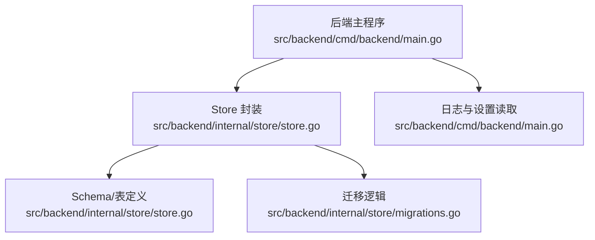
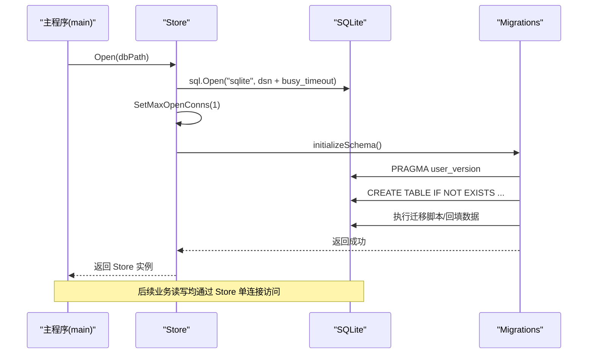
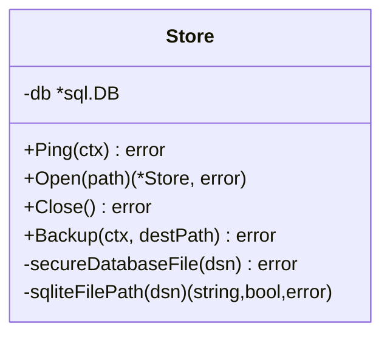
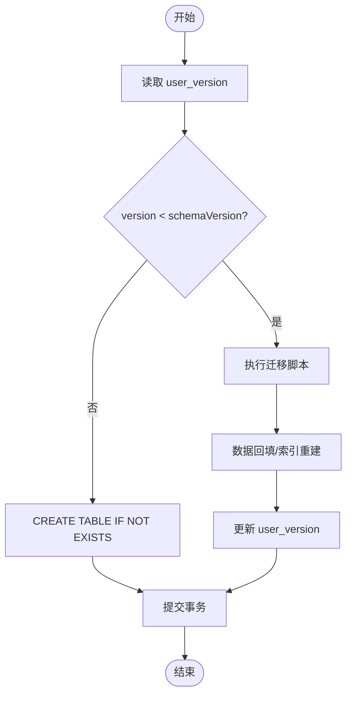
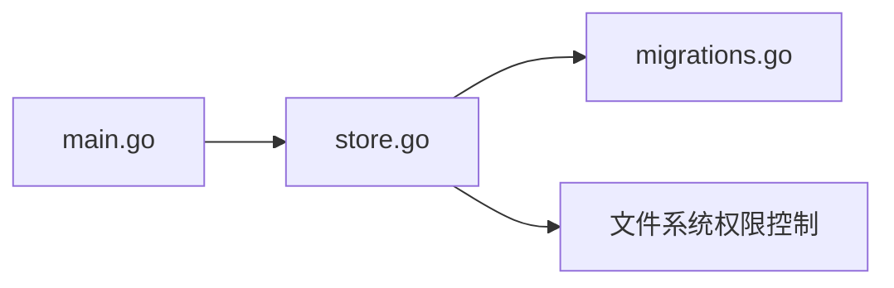

# 数据库问题排查

<cite>
**本文引用的文件**   
- [src/backend/internal/store/store.go](file://src/backend/internal/store/store.go)
- [src/backend/internal/store/migrations.go](file://src/backend/internal/store/migrations.go)
- [src/backend/cmd/backend/main.go](file://src/backend/cmd/backend/main.go)
- [scripts/dev-e2e-settings.sh](file://scripts/dev-e2e-settings.sh)
</cite>

## 目录
1. [简介](#简介)
2. [项目结构](#项目结构)
3. [核心组件](#核心组件)
4. [架构总览](#架构总览)
5. [详细组件分析](#详细组件分析)
6. [依赖关系分析](#依赖关系分析)
7. [性能考虑](#性能考虑)
8. [故障排查指南](#故障排查指南)
9. [结论](#结论)
10. [附录](#附录)

## 简介
本指南面向 Lattix-codex 项目的 SQLite 数据库运维与排障，覆盖连接池耗尽、文件锁冲突、数据库损坏等常见问题；提供数据迁移失败的诊断与修复步骤；说明备份与恢复操作流程；给出索引优化、查询优化、存储空间管理等性能建议；介绍数据一致性检查与修复方法；并包含紧急情况下的人工干预与数据恢复方案。

## 项目结构
本项目使用 Go 后端服务，SQLite 作为持久化存储。数据库相关代码集中在 backend 的 store 包中，启动入口通过命令行参数指定数据库路径，并在启动时完成初始化与迁移。

**图表来源** 
- [src/backend/cmd/backend/main.go:83-94](file://src/backend/cmd/backend/main.go#L83-L94)
- [src/backend/internal/store/store.go:368-389](file://src/backend/internal/store/store.go#L368-L389)
- [src/backend/internal/store/migrations.go:18-52](file://src/backend/internal/store/migrations.go#L18-L52)

**章节来源**
- [src/backend/cmd/backend/main.go:83-94](file://src/backend/cmd/backend/main.go#L83-L94)
- [src/backend/internal/store/store.go:368-389](file://src/backend/internal/store/store.go#L368-L389)
- [src/backend/internal/store/migrations.go:18-52](file://src/backend/internal/store/migrations.go#L18-L52)

## 核心组件
- Store 封装：负责打开数据库、设置单连接、busy_timeout、创建/校验表结构、安全权限控制、备份导出（VACUUM INTO）。
- Schema：集中定义所有表结构与索引，确保首次启动或升级时自动建表。
- Migrations：按版本进行增量迁移，包括新增列、重命名表、数据回填、索引重建等。
- 启动集成：main 通过命令行参数 -db 指定 SQLite 文件路径，并在启动流程中调用 Store.Open 完成初始化。

关键要点
- 单连接模式：SetMaxOpenConns(1)，避免并发写导致的锁竞争。
- busy_timeout：通过 _pragma=busy_timeout(5000) 降低“database is locked”概率。
- 安全加固：数据库文件权限强制为 0o600，禁止符号链接与非普通文件。
- 备份导出：VACUUM INTO 生成一致性快照，目标文件需为空且权限受限。

**章节来源**
- [src/backend/internal/store/store.go:368-389](file://src/backend/internal/store/store.go#L368-L389)
- [src/backend/internal/store/store.go:391-419](file://src/backend/internal/store/store.go#L391-L419)
- [src/backend/internal/store/store.go:448-465](file://src/backend/internal/store/store.go#L448-L465)
- [src/backend/internal/store/migrations.go:18-52](file://src/backend/internal/store/migrations.go#L18-L52)
- [src/backend/cmd/backend/main.go:83-94](file://src/backend/cmd/backend/main.go#L83-L94)

## 架构总览
下图展示了后端启动到数据库初始化的整体流程，以及备份导出的调用链。

**图表来源** 
- [src/backend/cmd/backend/main.go:83-94](file://src/backend/cmd/backend/main.go#L83-L94)
- [src/backend/internal/store/store.go:368-389](file://src/backend/internal/store/store.go#L368-L389)
- [src/backend/internal/store/migrations.go:18-52](file://src/backend/internal/store/migrations.go#L18-L52)

## 详细组件分析

### Store 组件分析
职责
- 打开数据库并配置单连接与超时策略
- 校验并设置数据库文件权限
- 初始化/迁移 Schema
- 提供一致性备份导出接口

实现要点
- DSN 拼接 busy_timeout 参数，降低锁冲突
- 强制单连接，避免连接池耗尽
- 备份前准备目标文件，确保空文件与权限正确

**图表来源** 
- [src/backend/internal/store/store.go:358-389](file://src/backend/internal/store/store.go#L358-L389)
- [src/backend/internal/store/store.go:391-419](file://src/backend/internal/store/store.go#L391-L419)
- [src/backend/internal/store/store.go:448-465](file://src/backend/internal/store/store.go#L448-L465)

**章节来源**
- [src/backend/internal/store/store.go:358-389](file://src/backend/internal/store/store.go#L358-L389)
- [src/backend/internal/store/store.go:391-419](file://src/backend/internal/store/store.go#L391-L419)
- [src/backend/internal/store/store.go:448-465](file://src/backend/internal/store/store.go#L448-L465)

### 迁移组件分析
职责
- 读取当前 schema version
- 执行 CREATE TABLE IF NOT EXISTS
- 执行增量迁移（新增列、重命名表、数据回填）
- 记录新版本号

实现要点
- 在事务内执行，失败回滚
- 针对旧表结构做兼容迁移（如 commands 表重构）
- 对 server_metrics 等历史表进行字段补齐与类型修正

**图表来源** 
- [src/backend/internal/store/migrations.go:18-52](file://src/backend/internal/store/migrations.go#L18-L52)
- [src/backend/internal/store/migrations.go:54-144](file://src/backend/internal/store/migrations.go#L54-L144)
- [src/backend/internal/store/migrations.go:184-245](file://src/backend/internal/store/migrations.go#L184-L245)

**章节来源**
- [src/backend/internal/store/migrations.go:18-52](file://src/backend/internal/store/migrations.go#L18-L52)
- [src/backend/internal/store/migrations.go:54-144](file://src/backend/internal/store/migrations.go#L54-L144)
- [src/backend/internal/store/migrations.go:184-245](file://src/backend/internal/store/migrations.go#L184-L245)

### 启动集成分析
职责
- 解析命令行参数 -db 指定数据库路径
- 启动后读取设置项（含 TLS 等），影响运行时行为

实现要点
- 默认数据库路径可通过环境变量覆盖
- 日志目录、静态资源、TLS 等配置与数据库交互

**章节来源**
- [src/backend/cmd/backend/main.go:83-94](file://src/backend/cmd/backend/main.go#L83-L94)
- [src/backend/cmd/backend/main.go:152-188](file://src/backend/cmd/backend/main.go#L152-L188)

## 依赖关系分析
- main 依赖 Store.Open 完成数据库初始化
- Store 依赖 migrations.initializeSchema 完成表结构与版本管理
- 备份功能依赖 VACUUM INTO 与文件系统权限控制

**图表来源** 
- [src/backend/cmd/backend/main.go:83-94](file://src/backend/cmd/backend/main.go#L83-L94)
- [src/backend/internal/store/store.go:368-389](file://src/backend/internal/store/store.go#L368-L389)
- [src/backend/internal/store/migrations.go:18-52](file://src/backend/internal/store/migrations.go#L18-L52)

**章节来源**
- [src/backend/cmd/backend/main.go:83-94](file://src/backend/cmd/backend/main.go#L83-L94)
- [src/backend/internal/store/store.go:368-389](file://src/backend/internal/store/store.go#L368-L389)
- [src/backend/internal/store/migrations.go:18-52](file://src/backend/internal/store/migrations.go#L18-L52)

## 性能考虑
- 连接模型：单连接 + busy_timeout，避免连接池耗尽与频繁锁等待。
- 写入路径：尽量批量操作，减少事务次数；避免长事务阻塞。
- 索引策略：优先使用已有索引（如 rpc_idempotency.created_at、server_metric_history.server_sampled），谨慎添加新索引。
- 空间管理：定期 VACUUM 回收碎片；监控磁盘使用率。
- 查询优化：避免全表扫描，合理使用 WHERE 条件与排序字段。

[本节为通用指导，不直接分析具体文件]

## 故障排查指南

### 常见问题与解决方法
- 连接池耗尽
  - 现象：应用无法获取数据库连接，请求超时。
  - 原因：未正确使用连接池或并发过高。
  - 解决：确认已启用单连接模式（SetMaxOpenConns(1)），避免额外连接；检查是否有长事务未释放。
  - 参考实现位置：[src/backend/internal/store/store.go:368-389](file://src/backend/internal/store/store.go#L368-L389)

- 文件锁冲突（database is locked）
  - 现象：写入时报错“database is locked”。
  - 原因：并发写导致锁争用。
  - 解决：启用 busy_timeout（_pragma=busy_timeout(5000)），减少并发写；必要时拆分事务。
  - 参考实现位置：[src/backend/internal/store/store.go:368-389](file://src/backend/internal/store/store.go#L368-L389)

- 数据库损坏
  - 现象：读写出错、表结构异常。
  - 原因：进程崩溃、磁盘错误、外部修改。
  - 解决：从备份恢复；必要时重建骨架配置（Agent 侧有类似机制，DB 侧以备份为准）。
  - 参考实现位置：[src/backend/internal/store/store.go:448-465](file://src/backend/internal/store/store.go#L448-L465)

- 权限与安全
  - 现象：无法创建/写入数据库文件。
  - 原因：权限不足或路径非普通文件。
  - 解决：确保文件权限为 0o600，路径为普通文件，非符号链接。
  - 参考实现位置：[src/backend/internal/store/store.go:391-419](file://src/backend/internal/store/store.go#L391-L419)

### 数据迁移失败的诊断与修复
- 诊断步骤
  - 查看启动日志中的迁移错误信息。
  - 检查 user_version 与实际 schema 是否一致。
  - 核对迁移脚本是否完整执行（新增列、重命名表、数据回填）。
- 修复步骤
  - 停止服务，清理临时状态。
  - 根据错误定位具体迁移阶段，手动补执行缺失语句。
  - 重新运行服务，观察迁移是否成功。
- 参考实现位置：
  - [src/backend/internal/store/migrations.go:18-52](file://src/backend/internal/store/migrations.go#L18-L52)
  - [src/backend/internal/store/migrations.go:54-144](file://src/backend/internal/store/migrations.go#L54-L144)
  - [src/backend/internal/store/migrations.go:184-245](file://src/backend/internal/store/migrations.go#L184-L245)

### 备份与恢复操作流程
- 备份
  - 使用 Backup 接口导出一致性快照（VACUUM INTO）。
  - 目标文件必须为空且权限为 0o600。
  - 参考实现位置：[src/backend/internal/store/store.go:448-465](file://src/backend/internal/store/store.go#L448-L465)
- 恢复
  - 停止服务，替换数据库文件为备份副本。
  - 启动服务，验证迁移与表结构正常。
  - 若存在权限问题，手动修正文件权限。

### 数据一致性检查与修复工具
- 检查 user_version 与 Schema 一致性
  - 查询 PRAGMA user_version，对比期望版本。
  - 参考实现位置：[src/backend/internal/store/migrations.go:18-52](file://src/backend/internal/store/migrations.go#L18-L52)
- 检查表结构与索引
  - 使用 PRAGMA table_info 与 PRAGMA index_list 验证。
  - 参考实现位置：[src/backend/internal/store/migrations.go:165-182](file://src/backend/internal/store/migrations.go#L165-L182)
- 修复命令队列与幂等性
  - 检查 commands 表结构与数据完整性。
  - 参考实现位置：[src/backend/internal/store/migrations.go:184-245](file://src/backend/internal/store/migrations.go#L184-L245)

### 紧急情况下的干预与恢复
- 快速恢复
  - 从最近备份恢复数据库文件。
  - 重启服务，确认迁移成功。
- 人工干预
  - 若迁移卡住，暂停服务，手动执行缺失 SQL。
  - 修正权限与路径问题后重试。
- 参考实现位置：
  - [src/backend/internal/store/store.go:391-419](file://src/backend/internal/store/store.go#L391-L419)
  - [src/backend/internal/store/migrations.go:18-52](file://src/backend/internal/store/migrations.go#L18-L52)

### 密码与设置变更的影响
- 管理员密码修改会触发 bcrypt 哈希落库与旧 session 失效。
- 相关测试脚本可辅助验证变更效果。
- 参考实现位置：
  - [scripts/dev-e2e-settings.sh:112-123](file://scripts/dev-e2e-settings.sh#L112-L123)

## 结论
通过单连接与 busy_timeout 的策略，Lattix-codex 有效降低了 SQLite 的锁冲突风险；迁移机制保障了 Schema 演进的安全性；备份接口提供了可靠的恢复能力。运维中应重点关注权限、锁冲突与迁移失败场景，结合日志与一致性检查工具快速定位与修复问题。

## 附录
- 常用 SQL 检查
  - PRAGMA user_version;
  - PRAGMA table_info(servers);
  - SELECT COUNT(*) FROM commands WHERE status='queued';
- 监控指标
  - 磁盘使用率、数据库文件大小、备份成功率。
- 最佳实践
  - 定期备份、最小权限原则、避免长事务、合理索引设计。

[本节为通用指导，不直接分析具体文件]