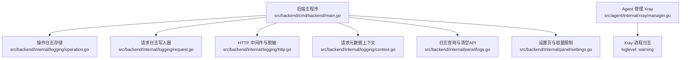
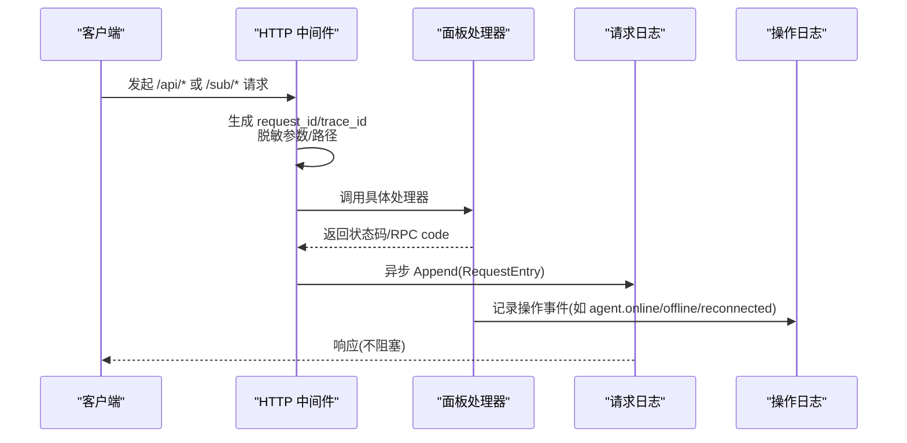
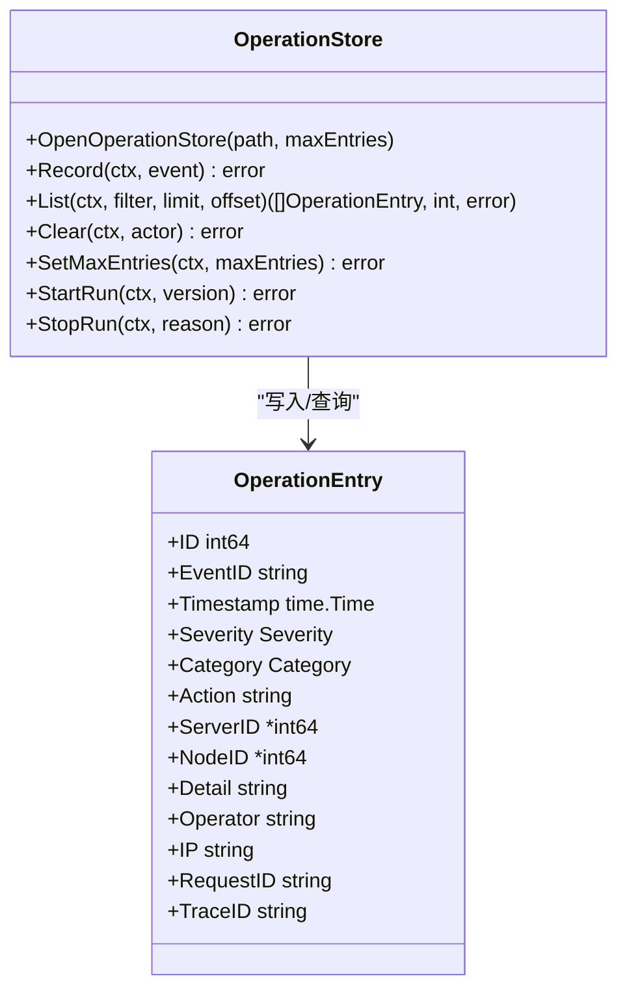
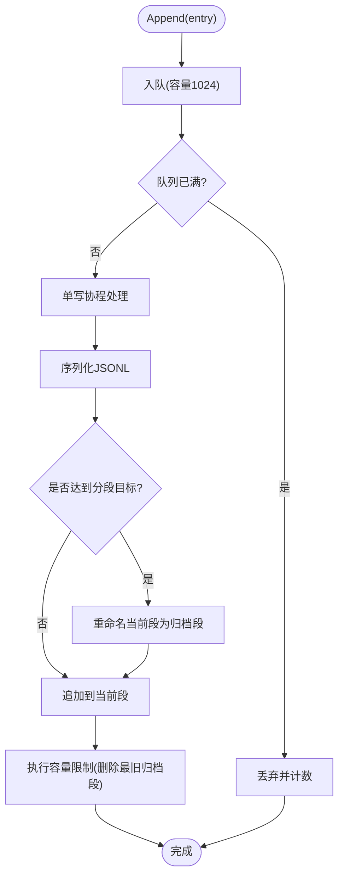
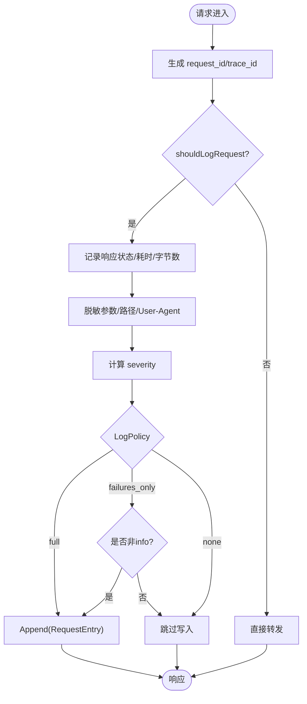
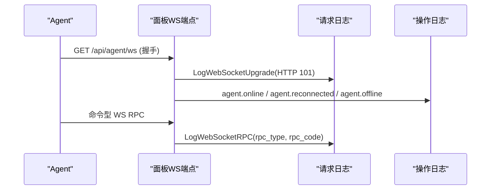
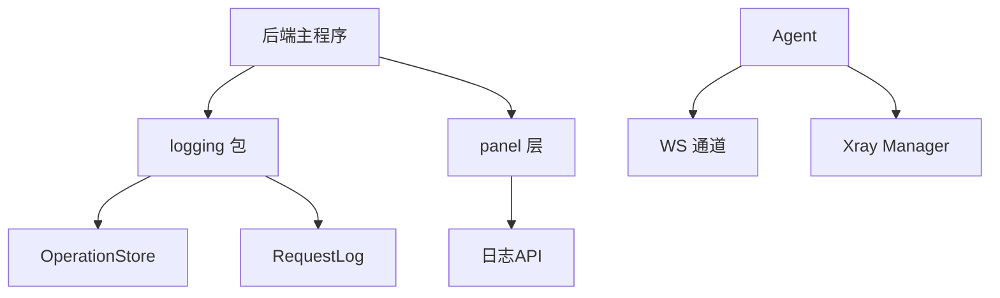

# 日志分析

<cite>
**本文引用的文件**   
- [logging-design.md](file://docs/logging-design.md)
- [main.go](file://src/backend/cmd/backend/main.go)
- [operation.go](file://src/backend/internal/logging/operation.go)
- [request.go](file://src/backend/internal/logging/request.go)
- [http.go](file://src/backend/internal/logging/http.go)
- [context.go](file://src/backend/internal/logging/context.go)
- [logs.go](file://src/backend/internal/panel/logs.go)
- [settings.go](file://src/backend/internal/panel/settings.go)
- [manager.go](file://src/agent/internal/xray/manager.go)
- [agent main.go](file://src/agent/cmd/agent/main.go)
</cite>

## 目录
1. [简介](#简介)
2. [项目结构](#项目结构)
3. [核心组件](#核心组件)
4. [架构总览](#架构总览)
5. [详细组件分析](#详细组件分析)
6. [依赖关系分析](#依赖关系分析)
7. [性能考量](#性能考量)
8. [故障排查指南](#故障排查指南)
9. [结论](#结论)
10. [附录](#附录)

## 简介
本指南面向 Lattix-codex 的运维与开发人员，系统化说明日志系统的存储位置、命名规则、轮转策略、日志级别与使用场景，并提供关键日志（HTTP、WebSocket、数据库操作、Xray 进程）的解读方法、常见错误模式识别与解决步骤、搜索与分析命令及工具推荐，以及自定义日志格式与输出目标的配置方式。

## 项目结构
Lattix-codex 的日志系统由“操作日志”和“请求日志”两部分组成：
- 操作日志：记录“谁在何时修改了什么、系统发生了什么状态变化”，持久化到独立 SQLite 文件 operation.db。
- 请求日志：记录“哪些 API 请求进入了面板、结果和耗时如何”，以 JSONL 分段文件形式落盘。

默认日志根目录为业务数据库同级 logs/，可通过启动参数或环境变量覆盖。

图表来源 
- [main.go:144-170](file://src/backend/cmd/backend/main.go#L144-L170)
- [operation.go:116-136](file://src/backend/internal/logging/operation.go#L116-L136)
- [request.go:87-102](file://src/backend/internal/logging/request.go#L87-L102)
- [http.go:43-82](file://src/backend/internal/logging/http.go#L43-L82)
- [context.go:21-24](file://src/backend/internal/logging/context.go#L21-L24)
- [logs.go:38-98](file://src/backend/internal/panel/logs.go#L38-L98)
- [settings.go:243-263](file://src/backend/internal/panel/settings.go#L243-L263)
- [manager.go:363-371](file://src/agent/internal/xray/manager.go#L363-L371)

章节来源
- [logging-design.md:19-49](file://docs/logging-design.md#L19-L49)
- [main.go:124-131](file://src/backend/cmd/backend/main.go#L124-L131)

## 核心组件
- 操作日志存储 OperationStore：SQLite 独立连接，固定表结构与索引，支持按重要程度、类别、服务器、操作员、关键字和时间范围查询；默认保留最新 1000 条，可配置 100–100000 条。
- 请求日志 RequestLog：内存队列 + 单写协程串行追加 JSONL；自动分段与归档，超过总容量删除最旧归档段；提供 Tail/Clear/SetMaxBytes/Status 等能力。
- HTTP 中间件 RequestMiddleware：注入 request_id/trace_id，脱敏敏感字段，计算 severity，决定 LogPolicy（full/failures_only/none），并异步 Append。
- WebSocket 升级与 RPC 日志：握手成功立即记录 HTTP 101；命令型 WS RPC 通过 LogWebSocketRPC 记录。
- 前端日志页面：两个子页面分别展示操作日志与请求日志，支持分页、过滤与窗口大小选择。

章节来源
- [operation.go:42-66](file://src/backend/internal/logging/operation.go#L42-L66)
- [operation.go:184-228](file://src/backend/internal/logging/operation.go#L184-L228)
- [request.go:18-22](file://src/backend/internal/logging/request.go#L18-L22)
- [request.go:128-155](file://src/backend/internal/logging/request.go#L128-L155)
- [http.go:43-82](file://src/backend/internal/logging/http.go#L43-L82)
- [http.go:84-105](file://src/backend/internal/logging/http.go#L84-L105)
- [http.go:154-164](file://src/backend/internal/logging/http.go#L154-L164)
- [logging-design.md:271-289](file://docs/logging-design.md#L271-L289)

## 架构总览
后端启动时初始化操作日志与请求日志，注册 HTTP 中间件与路由，处理 Agent 控制通道与面板 API。请求进入后由中间件生成 request_id/trace_id，记录请求元数据，根据策略决定是否写入请求日志；操作日志通过 OperationStore 持久化。

图表来源 
- [http.go:43-82](file://src/backend/internal/logging/http.go#L43-L82)
- [http.go:107-152](file://src/backend/internal/logging/http.go#L107-L152)
- [request.go:112-126](file://src/backend/internal/logging/request.go#L112-L126)
- [main.go:267-317](file://src/backend/cmd/backend/main.go#L267-L317)

## 详细组件分析

### 操作日志（Operation Store）
- 数据模型：operation_log 表包含 id、event_id、ts、severity、category、action、server_id、node_id、detail、operator、ip、request_id、trace_id；runtime_state 表保存运行标记。
- 类别：server、chain、user、settings、panel、agent、command、auth、log。
- 重要程度：info/warning/error，由服务端根据动作固定判定。
- 生命周期：启动记录 panel.started，异常退出检测 panel.unclean_shutdown，停止记录 panel.stopped。
- 查询与清空：支持多条件过滤与分页；清空后记录 operation_log.cleared。

图表来源 
- [operation.go:109-114](file://src/backend/internal/logging/operation.go#L109-L114)
- [operation.go:70-84](file://src/backend/internal/logging/operation.go#L70-L84)

章节来源
- [logging-design.md:52-98](file://docs/logging-design.md#L52-L98)
- [operation.go:116-136](file://src/backend/internal/logging/operation.go#L116-L136)
- [operation.go:184-228](file://src/backend/internal/logging/operation.go#L184-L228)
- [operation.go:276-352](file://src/backend/internal/logging/operation.go#L276-L352)

### 请求日志（Request Log）
- 存储格式：JSONL，每行一个对象，包含 timestamp、request_id、trace_id、severity、transport、method、path、route、rpc_type、attributes、http_status、rpc_code、duration_ms、response_bytes、operator、ip、user_agent、error_summary、idempotency_replayed。
- 记录范围：/api/*、/sub/*、/api/agent/ws 握手、有响应的命令型 WS RPC；默认不记录静态文件与健康检查等。
- 分段与容量：当前段 requests-current.jsonl，达到目标大小重命名为带 UTC 时间的归档段；超过总容量删除最旧归档段。
- 异步写入：内存队列容量 1024，单写协程串行追加；队列满或写入失败丢弃，不影响响应。

图表来源 
- [request.go:112-126](file://src/backend/internal/logging/request.go#L112-L126)
- [request.go:235-252](file://src/backend/internal/logging/request.go#L235-L252)
- [request.go:282-301](file://src/backend/internal/logging/request.go#L282-L301)
- [request.go:303-322](file://src/backend/internal/logging/request.go#L303-L322)

章节来源
- [logging-design.md:139-256](file://docs/logging-design.md#L139-L256)
- [request.go:24-52](file://src/backend/internal/logging/request.go#L24-L52)
- [request.go:128-155](file://src/backend/internal/logging/request.go#L128-L155)

### HTTP 中间件与脱敏
- 注入 request_id/trace_id，设置响应头 X-Request-ID/X-Trace-ID。
- 脱敏规则：对 token/password/secret/key/cookie/authorization/cert/private 等关键字替换为 [REDACTED]；/sub/{token} 路径中的 token 替换为 SHA-256 摘要前 4 字节。
- 严重级别：panic/5xx/特定 RPC code -> error；4xx/慢请求 -> warning；其他 -> info。
- 策略：full/failures_only/none，由路由注册时声明。

图表来源 
- [http.go:43-82](file://src/backend/internal/logging/http.go#L43-L82)
- [http.go:226-228](file://src/backend/internal/logging/http.go#L226-L228)
- [http.go:240-250](file://src/backend/internal/logging/http.go#L240-L250)
- [http.go:166-183](file://src/backend/internal/logging/http.go#L166-L183)
- [http.go:185-204](file://src/backend/internal/logging/http.go#L185-L204)

章节来源
- [http.go:43-82](file://src/backend/internal/logging/http.go#L43-L82)
- [http.go:226-228](file://src/backend/internal/logging/http.go#L226-L228)
- [http.go:240-250](file://src/backend/internal/logging/http.go#L240-L250)
- [http.go:166-183](file://src/backend/internal/logging/http.go#L166-L183)
- [http.go:185-204](file://src/backend/internal/logging/http.go#L185-L204)

### WebSocket 连接与 RPC 日志
- 握手成功立即记录 HTTP 101，不等待连接关闭。
- 命令型 WS RPC 通过 LogWebSocketRPC 记录，包含 rpc_type、rpc_code、error_summary 等。
- Agent 在线/离线/重连事件记录为操作日志，避免伪造离线/上线。

图表来源 
- [http.go:84-105](file://src/backend/internal/logging/http.go#L84-L105)
- [http.go:154-164](file://src/backend/internal/logging/http.go#L154-L164)
- [main.go:267-317](file://src/backend/cmd/backend/main.go#L267-L317)

章节来源
- [logging-design.md:172-192](file://docs/logging-design.md#L172-L192)
- [http.go:84-105](file://src/backend/internal/logging/http.go#L84-L105)
- [http.go:154-164](file://src/backend/internal/logging/http.go#L154-L164)
- [main.go:267-317](file://src/backend/cmd/backend/main.go#L267-L317)

### 数据库操作日志
- 操作日志独立 SQLite 文件，不与业务数据库竞争连接池。
- 每次写入后裁剪超出限制的记录，保证容量可控。
- 清空操作会记录一条新的 operation_log.cleared，包含清除条数和操作者。

章节来源
- [logging-design.md:41-49](file://docs/logging-design.md#L41-L49)
- [operation.go:377-389](file://src/backend/internal/logging/operation.go#L377-L389)
- [operation.go:230-261](file://src/backend/internal/logging/operation.go#L230-L261)

### Xray 进程日志
- Xray 进程日志级别设置为 warning，仅记录警告及以上信息。
- Agent 侧通过 Manager 管理 xray 二进制、配置文件与热操作。

章节来源
- [manager.go:363-371](file://src/agent/internal/xray/manager.go#L363-L371)

## 依赖关系分析
- 后端主程序依赖 logging 包实现操作日志与请求日志，panel 层暴露日志查询与清空 API。
- 请求日志与操作日志物理隔离，互不影响。
- Agent 侧通过 WS 与面板通信，Xray 进程日志独立于面板日志。

图表来源 
- [main.go:144-170](file://src/backend/cmd/backend/main.go#L144-L170)
- [operation.go:116-136](file://src/backend/internal/logging/operation.go#L116-L136)
- [request.go:87-102](file://src/backend/internal/logging/request.go#L87-L102)
- [logs.go:38-98](file://src/backend/internal/panel/logs.go#L38-L98)

章节来源
- [main.go:144-170](file://src/backend/cmd/backend/main.go#L144-L170)
- [operation.go:116-136](file://src/backend/internal/logging/operation.go#L116-L136)
- [request.go:87-102](file://src/backend/internal/logging/request.go#L87-L102)
- [logs.go:38-98](file://src/backend/internal/panel/logs.go#L38-L98)

## 性能考量
- 请求日志异步写入，内存队列容量 1024，单写协程串行追加，避免阻塞业务请求。
- 操作日志使用独立 SQLite 连接，busy_timeout 降低锁竞争。
- 请求日志分段与容量限制，自动删除最旧归档段，防止磁盘膨胀。
- 前端日志页面只读取尾部窗口，不扫描完整文件，减少 IO 压力。

章节来源
- [request.go:18-22](file://src/backend/internal/logging/request.go#L18-L22)
- [request.go:197-233](file://src/backend/internal/logging/request.go#L197-L233)
- [operation.go:120-126](file://src/backend/internal/logging/operation.go#L120-L126)
- [logging-design.md:246-256](file://docs/logging-design.md#L246-L256)

## 故障排查指南
- 请求日志丢弃：检查队列是否已满或写入失败，查看设置页累计丢弃数；恢复后聚合记录为 request_log.dropped 操作日志。
- 操作日志未启用：确认 OperationStore 初始化成功，检查日志目录权限。
- WebSocket 连接异常：查看握手日志与 agent.* 操作日志，确认认证与生命周期状态。
- Xray 进程问题：检查 Xray 日志级别与配置文件漂移检测。

章节来源
- [request.go:104-110](file://src/backend/internal/logging/request.go#L104-L110)
- [request.go:207-211](file://src/backend/internal/logging/request.go#L207-L211)
- [logs.go:86-98](file://src/backend/internal/panel/logs.go#L86-L98)
- [manager.go:275-297](file://src/agent/internal/xray/manager.go#L275-L297)

## 结论
Lattix-codex 的日志系统设计清晰、职责分离，操作日志与请求日志独立存储与限额，满足高并发下的低开销记录需求。通过严格的脱敏与策略控制，确保敏感数据安全与日志体积可控。建议结合前端日志页面与命令行工具进行日常监控与故障排查。

## 附录

### 日志文件存储位置与命名规则
- 默认根目录：业务数据库同级 logs/
- 操作日志：logs/operation.db
- 请求日志：logs/requests/requests-current.jsonl 与归档段 requests-<UTC时间>-<纳秒时间戳>.jsonl

章节来源
- [logging-design.md:19-31](file://docs/logging-design.md#L19-L31)

### 日志轮转策略
- 请求日志：当前段达到目标大小（总容量的 1/10，最小 64 KiB）重命名为归档段；超过总容量删除最旧归档段。
- 操作日志：每次写入后裁剪超出限制的最旧记录，默认保留 1000 条。

章节来源
- [logging-design.md:246-256](file://docs/logging-design.md#L246-L256)
- [operation.go:377-389](file://src/backend/internal/logging/operation.go#L377-L389)

### 日志级别含义与使用场景
- DEBUG：未在系统中使用，建议避免在生产环境启用。
- INFO：成功操作、正常状态变化、登录成功、Agent 上线和正常停止。
- WARN：Agent 离线、连接或链路退化、配置漂移、登录失败、重启请求、更新开始、上次异常退出。
- ERROR：命令失败或死信、链路失败、更新失败、备份失败、日志写入丢弃。

章节来源
- [logging-design.md:92-98](file://docs/logging-design.md#L92-L98)

### 关键日志信息解读
- HTTP 请求日志：关注 http_status、rpc_code、duration_ms、error_summary、attributes。
- WebSocket 连接日志：关注 transport=websocket、rpc_type、rpc_code、error_summary。
- 数据库操作日志：关注 category、action、detail、operator、ip。
- Xray 进程日志：关注 loglevel=warning 的输出。

章节来源
- [logging-design.md:142-167](file://docs/logging-design.md#L142-L167)
- [http.go:107-152](file://src/backend/internal/logging/http.go#L107-L152)
- [http.go:154-164](file://src/backend/internal/logging/http.go#L154-L164)

### 常见错误模式与解决步骤
- 请求日志丢弃：增加请求日志容量或优化写入路径；检查磁盘空间与权限。
- 操作日志未启用：确认 OperationStore 初始化成功；检查日志目录权限。
- WebSocket 连接异常：检查认证令牌与生命周期状态；查看 agent.* 操作日志。
- Xray 配置漂移：检查外部修改 config.json；使用漂移修复机制。

章节来源
- [request.go:104-110](file://src/backend/internal/logging/request.go#L104-L110)
- [logs.go:86-98](file://src/backend/internal/panel/logs.go#L86-L98)
- [manager.go:275-297](file://src/agent/internal/xray/manager.go#L275-L297)

### 日志搜索与分析命令与工具
- 查看操作日志：使用前端 /logs/operations 页面，支持过滤与分页。
- 查看请求日志：使用前端 /logs/requests 页面，支持窗口大小选择。
- 命令行工具：tail -f logs/requests/requests-current.jsonl；grep 筛选关键字。
- 分析工具：jq 解析 JSONL；awk/sed 处理文本。

章节来源
- [logging-design.md:271-289](file://docs/logging-design.md#L271-L289)

### 自定义日志格式与输出目标
- 当前设计不包含日志导入/导出、全文索引或远程聚合。
- 如需自定义格式，可在 Append 前转换 RequestEntry；如需输出到不同目标，可封装 RequestLog 适配器。
- 注意保持脱敏与安全策略一致。

章节来源
- [logging-design.md:298-307](file://docs/logging-design.md#L298-L307)