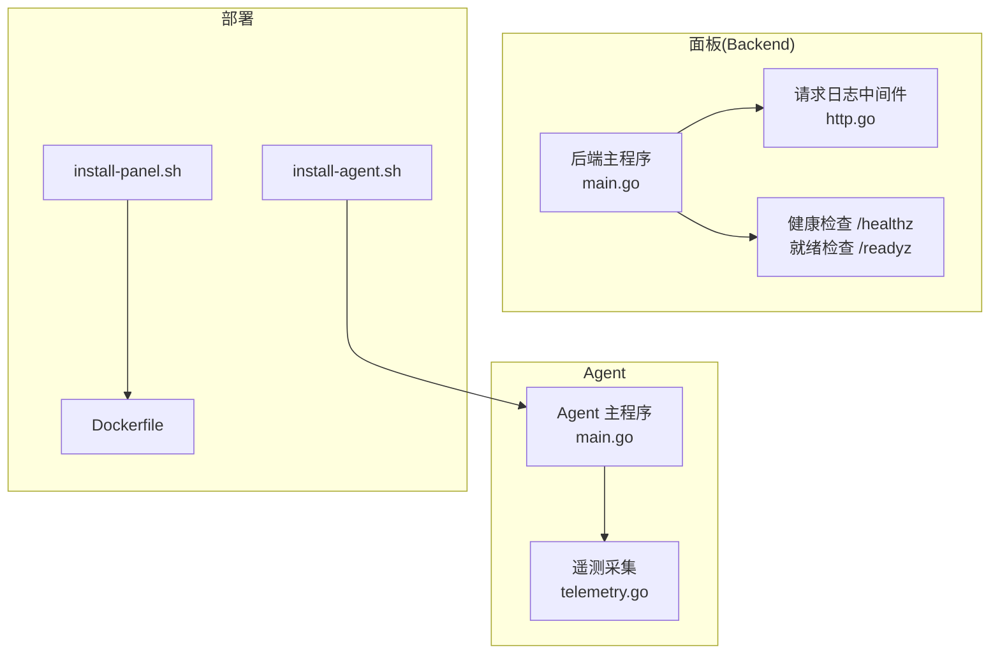
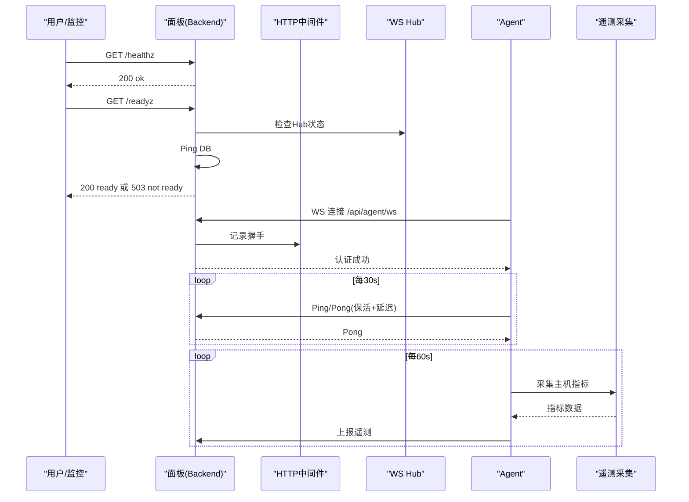
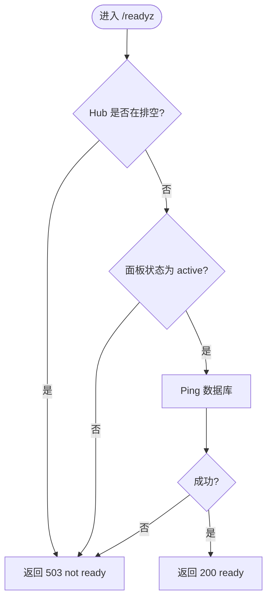
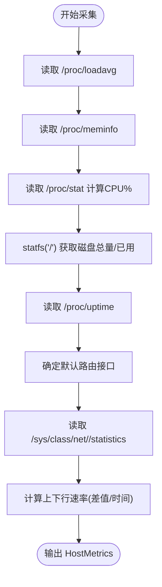
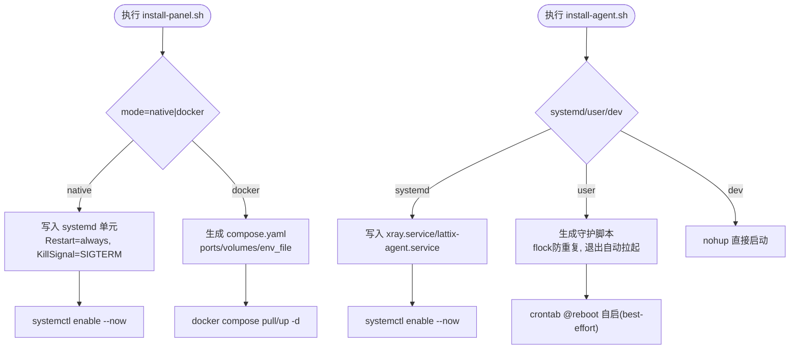
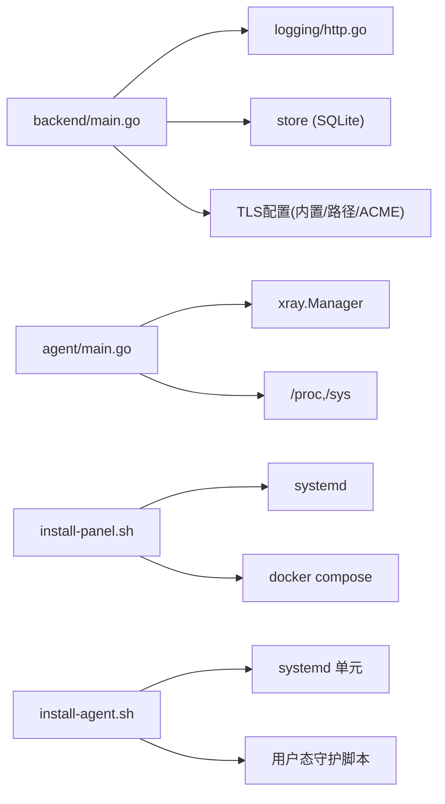

# 系统级问题排查

<cite>
**本文引用的文件**   
- [src/agent/cmd/agent/main.go](file://src/agent/cmd/agent/main.go)
- [src/agent/cmd/agent/telemetry.go](file://src/agent/cmd/agent/telemetry.go)
- [src/backend/cmd/backend/main.go](file://src/backend/cmd/backend/main.go)
- [Dockerfile](file://Dockerfile)
- [scripts/install-panel.sh](file://scripts/install-panel.sh)
- [scripts/install-agent.sh](file://scripts/install-agent.sh)
- [src/backend/internal/logging/http.go](file://src/backend/internal/logging/http.go)
- [docs/server-probe-monitoring-design.md](file://docs/server-probe-monitoring-design.md)
</cite>

## 目录
1. [简介](#简介)
2. [项目结构](#项目结构)
3. [核心组件](#核心组件)
4. [架构总览](#架构总览)
5. [详细组件分析](#详细组件分析)
6. [依赖关系分析](#依赖关系分析)
7. [性能与容量规划](#性能与容量规划)
8. [故障排查指南](#故障排查指南)
9. [容器化部署排查](#容器化部署排查)
10. [安全相关排查](#安全相关排查)
11. [升级与回滚](#升级与回滚)
12. [结论](#结论)

## 简介
本指南面向 Lattix-codex 的系统运维与排障人员，聚焦系统级监控、进程管理、诊断工具使用、容器化部署问题定位、安全策略检查以及升级回滚操作。内容基于代码实现与安装脚本，提供可操作的步骤与命令参考，帮助快速定位并恢复服务。

## 项目结构
Lattix-codex 由后端面板（Backend）、Agent（受控节点代理）和前端组成。系统级问题排查主要涉及：
- Backend：HTTP API + WebSocket 控制通道 + SQLite，提供健康检查端点 /healthz 与就绪检查 /readyz。
- Agent：systemd 或用户态守护运行，采集主机指标并通过 WS 上报遥测。
- 安装脚本：原生 systemd 模式与 Docker Compose 模式两种部署方式。

图表来源 
- [src/backend/cmd/backend/main.go:384-432](file://src/backend/cmd/backend/main.go#L384-L432)
- [src/backend/internal/logging/http.go:43-82](file://src/backend/internal/logging/http.go#L43-L82)
- [src/agent/cmd/agent/main.go:141-186](file://src/agent/cmd/agent/main.go#L141-L186)
- [src/agent/cmd/agent/telemetry.go:103-155](file://src/agent/cmd/agent/telemetry.go#L103-L155)
- [Dockerfile:24-44](file://Dockerfile#L24-L44)
- [scripts/install-panel.sh:270-292](file://scripts/install-panel.sh#L270-L292)
- [scripts/install-agent.sh:333-372](file://scripts/install-agent.sh#L333-L372)

章节来源
- [src/backend/cmd/backend/main.go:384-432](file://src/backend/cmd/backend/main.go#L384-L432)
- [src/backend/internal/logging/http.go:43-82](file://src/backend/internal/logging/http.go#L43-L82)
- [src/agent/cmd/agent/main.go:141-186](file://src/agent/cmd/agent/main.go#L141-L186)
- [src/agent/cmd/agent/telemetry.go:103-155](file://src/agent/cmd/agent/telemetry.go#L103-L155)
- [Dockerfile:24-44](file://Dockerfile#L24-L44)
- [scripts/install-panel.sh:270-292](file://scripts/install-panel.sh#L270-L292)
- [scripts/install-agent.sh:333-372](file://scripts/install-agent.sh#L333-L372)

## 核心组件
- 后端主程序：启动 HTTP Server，注册路由，处理 TLS（内置证书、路径模式、ACME），暴露 /healthz 与 /readyz 健康检查，优雅关停与重启流程。
- Agent 主程序：建立到面板的 WS 长连接，认证会话，周期性发送心跳与遥测，管理 xray 生命周期（systemd/exec）。
- 遥测采集：从 /proc 与 /sys 读取 CPU、负载、内存、磁盘、网卡流量、系统运行时间，计算延迟中位数。
- 安装脚本：支持 native/systemd 与 docker-compose 两种模式，生成 unit/env/compose 配置，自动校验与下载二进制。

章节来源
- [src/backend/cmd/backend/main.go:70-120](file://src/backend/cmd/backend/main.go#L70-L120)
- [src/backend/cmd/backend/main.go:384-432](file://src/backend/cmd/backend/main.go#L384-L432)
- [src/agent/cmd/agent/main.go:33-98](file://src/agent/cmd/agent/main.go#L33-L98)
- [src/agent/cmd/agent/telemetry.go:103-155](file://src/agent/cmd/agent/telemetry.go#L103-L155)
- [scripts/install-panel.sh:270-292](file://scripts/install-panel.sh#L270-L292)
- [scripts/install-agent.sh:333-372](file://scripts/install-agent.sh#L333-L372)

## 架构总览
下图展示面板与 Agent 的交互、健康检查与日志记录的关键路径。

图表来源 
- [src/backend/cmd/backend/main.go:384-432](file://src/backend/cmd/backend/main.go#L384-L432)
- [src/backend/internal/logging/http.go:84-105](file://src/backend/internal/logging/http.go#L84-L105)
- [src/agent/cmd/agent/main.go:141-186](file://src/agent/cmd/agent/main.go#L141-L186)
- [src/agent/cmd/agent/telemetry.go:103-155](file://src/agent/cmd/agent/telemetry.go#L103-L155)

## 详细组件分析

### 后端健康检查与就绪检查
- /healthz：返回 200 表示进程存活。
- /readyz：检查 Hub 是否处于 draining 或面板生命周期非 active，同时 Ping 数据库；失败返回 503。

图表来源 
- [src/backend/cmd/backend/main.go:384-432](file://src/backend/cmd/backend/main.go#L384-L432)

章节来源
- [src/backend/cmd/backend/main.go:384-432](file://src/backend/cmd/backend/main.go#L384-L432)

### Agent 遥测采集与网络接口选择
- 从 /proc/loadavg、/proc/meminfo、/proc/stat、/proc/uptime、/sys/class/net/*/statistics 采集指标。
- 默认路由接口优先 IPv4，其次 IPv6；忽略虚拟接口（docker、veth、br-、virbr、tun、tap）。
- 首次采样无法计算速率时为空值，不伪装为 0。

图表来源 
- [src/agent/cmd/agent/telemetry.go:103-155](file://src/agent/cmd/agent/telemetry.go#L103-L155)
- [src/agent/cmd/agent/telemetry.go:215-282](file://src/agent/cmd/agent/telemetry.go#L215-L282)
- [src/agent/cmd/agent/telemetry.go:284-296](file://src/agent/cmd/agent/telemetry.go#L284-L296)

章节来源
- [src/agent/cmd/agent/telemetry.go:103-155](file://src/agent/cmd/agent/telemetry.go#L103-L155)
- [src/agent/cmd/agent/telemetry.go:215-282](file://src/agent/cmd/agent/telemetry.go#L215-L282)
- [src/agent/cmd/agent/telemetry.go:284-296](file://src/agent/cmd/agent/telemetry.go#L284-L296)

### 安装脚本与进程管理
- 面板安装脚本：支持 native/systemd 与 docker-compose；生成 .env 与 compose.yaml；systemd 单元包含 Restart=always、KillSignal=SIGTERM、TimeoutStopSec。
- Agent 安装脚本：支持 systemd、user 模式（守护脚本常驻）与 DEV 模式；生成 xray.service 与 lattix-agent.service；user 模式通过 crontab @reboot 自启。

图表来源 
- [scripts/install-panel.sh:270-292](file://scripts/install-panel.sh#L270-L292)
- [scripts/install-panel.sh:174-186](file://scripts/install-panel.sh#L174-L186)
- [scripts/install-agent.sh:333-372](file://scripts/install-agent.sh#L333-L372)
- [scripts/install-agent.sh:374-412](file://scripts/install-agent.sh#L374-L412)

章节来源
- [scripts/install-panel.sh:270-292](file://scripts/install-panel.sh#L270-L292)
- [scripts/install-panel.sh:174-186](file://scripts/install-panel.sh#L174-L186)
- [scripts/install-agent.sh:333-372](file://scripts/install-agent.sh#L333-L372)
- [scripts/install-agent.sh:374-412](file://scripts/install-agent.sh#L374-L412)

## 依赖关系分析
- 后端依赖：WebSocket Hub、日志中间件、SQLite Store、TLS 配置（内置/路径/ACME）。
- Agent 依赖：xray Manager（systemd/exec）、state/settings 持久化、/proc 与 /sys 系统接口。
- 安装脚本依赖：curl、sha256sum、tar/unzip、systemctl/docker。

图表来源 
- [src/backend/cmd/backend/main.go:70-120](file://src/backend/cmd/backend/main.go#L70-L120)
- [src/backend/internal/logging/http.go:43-82](file://src/backend/internal/logging/http.go#L43-L82)
- [src/agent/cmd/agent/main.go:33-98](file://src/agent/cmd/agent/main.go#L33-L98)
- [scripts/install-panel.sh:270-292](file://scripts/install-panel.sh#L270-L292)
- [scripts/install-agent.sh:333-372](file://scripts/install-agent.sh#L333-L372)

章节来源
- [src/backend/cmd/backend/main.go:70-120](file://src/backend/cmd/backend/main.go#L70-L120)
- [src/backend/internal/logging/http.go:43-82](file://src/backend/internal/logging/http.go#L43-L82)
- [src/agent/cmd/agent/main.go:33-98](file://src/agent/cmd/agent/main.go#L33-L98)
- [scripts/install-panel.sh:270-292](file://scripts/install-panel.sh#L270-L292)
- [scripts/install-agent.sh:333-372](file://scripts/install-agent.sh#L333-L372)

## 性能与容量规划
- 后端日志：操作日志与请求日志大小可通过设置页调整；请求日志有最大 MB 限制与丢弃统计。
- Agent 遥测：每 60 秒上报一次，避免高频 IO；CPU% 首帧不可用，需等待两次采样。
- 存储：SQLite 单文件，建议定期备份；历史指标每小时清理 24 小时以前数据。

章节来源
- [src/backend/cmd/backend/main.go:152-178](file://src/backend/cmd/backend/main.go#L152-L178)
- [docs/server-probe-monitoring-design.md:63-75](file://docs/server-probe-monitoring-design.md#L63-L75)
- [src/agent/cmd/agent/telemetry.go:103-155](file://src/agent/cmd/agent/telemetry.go#L103-L155)

## 故障排查指南

### 系统资源监控方法
- 进程状态
  - 面板（systemd）：systemctl status lattix-panel
  - Agent（systemd）：systemctl status lattix-agent.service
  - Agent（user 模式）：查看守护脚本进程与锁文件
- 内存使用
  - top/htop 观察进程 RSS/VSZ
  - 通过面板“服务器详情”查看 mem_total/mem_used
- 文件描述符
  - lsof -p <pid> | wc -l
  - 关注打开的文件数与 socket 数量
- 网络连接数
  - ss -s 或 netstat -s
  - ss -tnp | grep :8080 查看面板端口连接
  - 面板 /readyz 失败时检查 Hub 状态与 DB Ping

章节来源
- [src/backend/cmd/backend/main.go:384-432](file://src/backend/cmd/backend/main.go#L384-L432)
- [src/agent/cmd/agent/telemetry.go:103-155](file://src/agent/cmd/agent/telemetry.go#L103-L155)

### 进程管理与问题恢复
- 服务重启
  - systemd：systemctl restart lattix-panel / lattix-agent.service
  - user 模式：latx-ag stop/start（守护脚本）
- 进程清理
  - pkill -f "lattix-agent-run" 或 pkill -f "lattix-backend"
  - 删除锁文件（/opt/lattix-agent/data/lattix-agent.lock）
- 僵尸进程处理
  - ps aux | grep Z
  - 检查父进程是否异常，必要时 kill 父进程

章节来源
- [scripts/install-agent.sh:374-412](file://scripts/install-agent.sh#L374-L412)
- [scripts/install-panel.sh:270-292](file://scripts/install-panel.sh#L270-L292)

### 系统级诊断工具使用方法
- top/htop：实时查看 CPU、内存、进程状态
- netstat/ss：查看监听端口与连接数
- lsof：查看进程打开的文件与 socket
- journalctl：查看 systemd 服务日志
- curl：测试 /healthz 与 /readyz

章节来源
- [src/backend/cmd/backend/main.go:384-432](file://src/backend/cmd/backend/main.go#L384-L432)

### 常见错误与定位
- 认证拒绝
  - Agent 首次连接被面板拒绝时停止重试，需重新绑定凭证
- 连接超时
  - WS 读超时 90s，写超时 10s；检查网络与防火墙
- 配置漂移
  - Agent 检测到 config.json 被外部修改，上报漂移事件

章节来源
- [src/agent/cmd/agent/main.go:69-98](file://src/agent/cmd/agent/main.go#L69-L98)
- [src/agent/cmd/agent/main.go:316-358](file://src/agent/cmd/agent/main.go#L316-L358)

## 容器化部署排查

### Docker 容器状态
- 查看容器状态：docker ps -a
- 查看日志：docker logs lattix-panel
- 进入容器：docker exec -it lattix-panel sh

### 卷挂载与数据持久化
- 数据目录：/data（数据库、证书、ACME缓存）
- 配置文件：config/.env
- 检查挂载：docker inspect lattix-panel | grep Mounts

### 网络配置
- 端口映射：host:container 8080
- 防火墙规则：确保 8080 端口可达
- ACME 自动证书：需要 443 端口公网可达

章节来源
- [Dockerfile:24-44](file://Dockerfile#L24-L44)
- [scripts/install-panel.sh:174-186](file://scripts/install-panel.sh#L174-L186)

## 安全相关排查

### 权限问题
- 文件权限：确保 /data 目录权限正确（Docker 用户 10001）
- systemd 权限：UMask=0077，限制文件访问
- SELinux/AppArmor：检查是否阻止了文件读写或网络连接

### TLS 配置
- 内置证书：-tls-cert 与 -tls-key 必须成对提供
- 路径模式：证书文件按 mtime 热加载，无需重启
- ACME：需要域名解析与 443 端口可达

章节来源
- [Dockerfile:28-32](file://Dockerfile#L28-L32)
- [scripts/install-panel.sh:270-292](file://scripts/install-panel.sh#L270-L292)
- [src/backend/cmd/backend/main.go:194-246](file://src/backend/cmd/backend/main.go#L194-L246)

## 升级与回滚

### 面板升级
- 原生模式：重新执行 install-panel.sh --version vX.Y.Z
- Docker 模式：更新镜像版本并重启容器

### Agent 升级
- 通过面板下发 agent.upgrade 命令
- 自升级成功后退出，由 systemd 拉起新二进制

### 回滚操作
- 面板：恢复到之前的版本包或镜像
- Agent：使用 latx-ag update 指定版本回滚

章节来源
- [src/agent/cmd/agent/main.go:642-656](file://src/agent/cmd/agent/main.go#L642-L656)
- [scripts/install-panel.sh:210-230](file://scripts/install-panel.sh#L210-L230)

## 结论
本指南提供了 Lattix-codex 系统级问题排查的完整方法论，涵盖资源监控、进程管理、诊断工具使用、容器化部署与安全配置。通过代码级分析与脚本解读，帮助运维人员快速定位并解决系统问题，保障服务稳定运行。