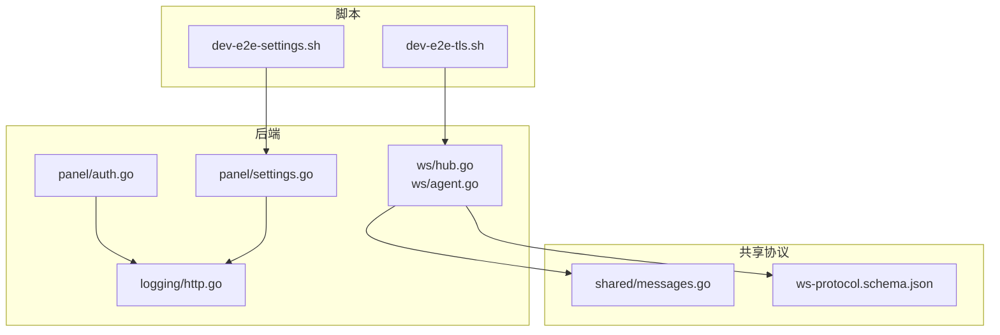
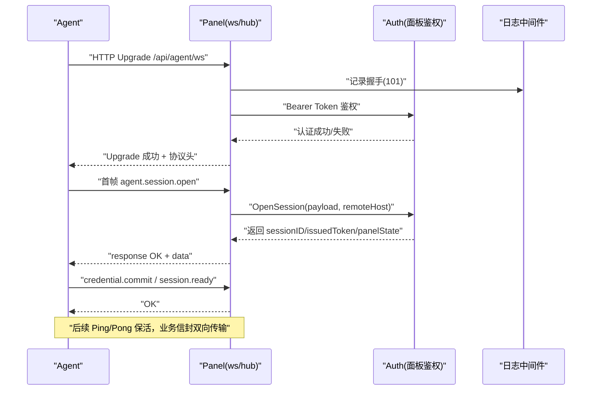
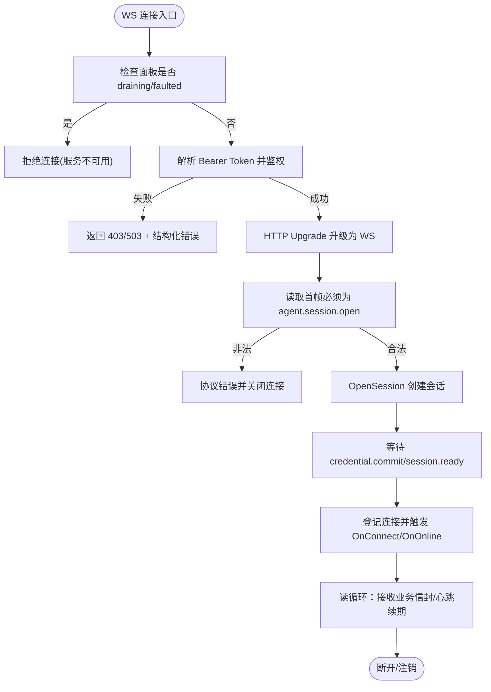
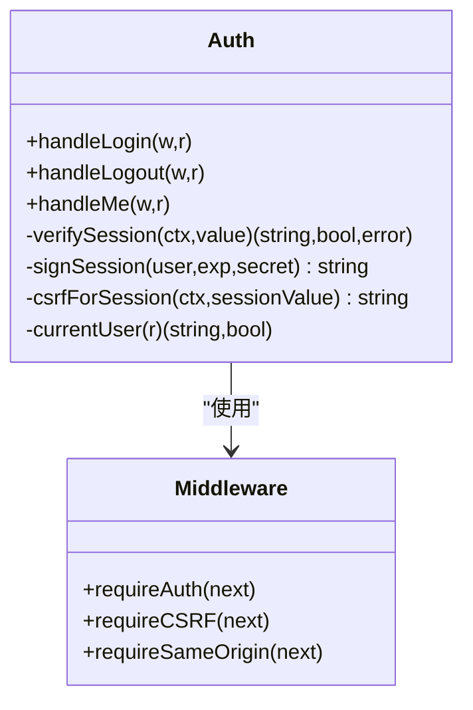
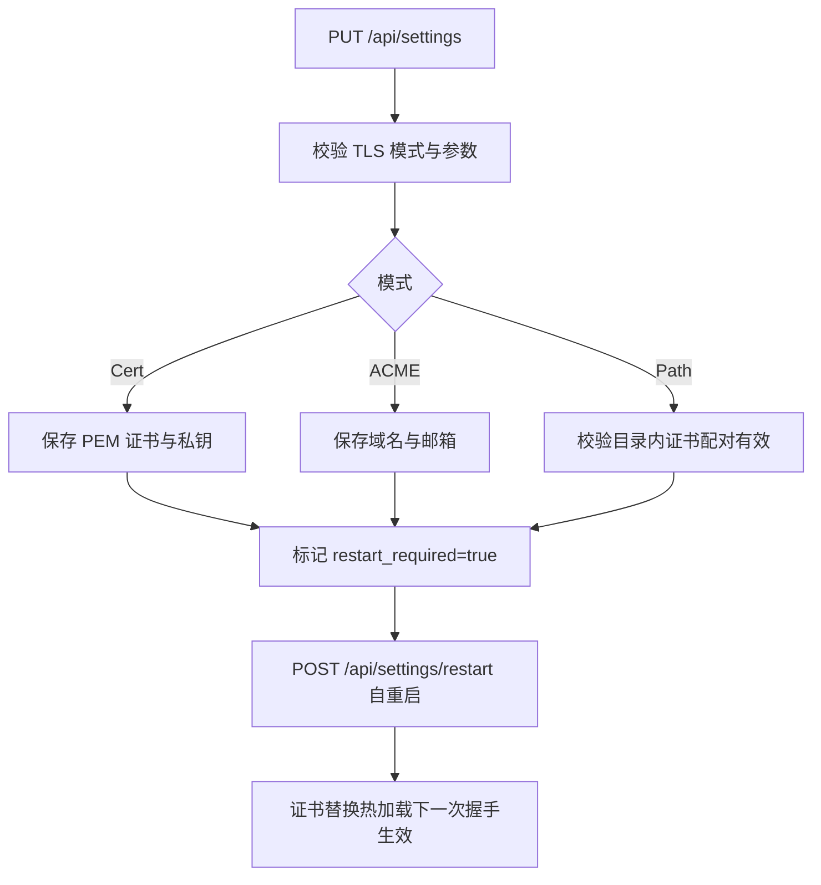
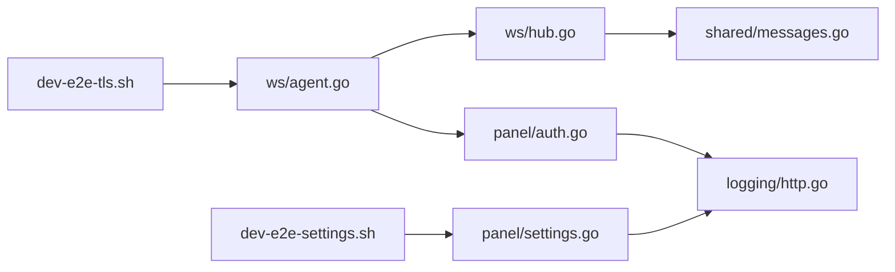

# 网络问题排查

<cite>
**本文引用的文件**   
- [src/backend/internal/ws/hub.go](file://src/backend/internal/ws/hub.go)
- [src/backend/internal/ws/agent.go](file://src/backend/internal/ws/agent.go)
- [docs/ws-protocol.schema.json](file://docs/ws-protocol.schema.json)
- [src/shared/messages.go](file://src/shared/messages.go)
- [src/backend/internal/logging/http.go](file://src/backend/internal/logging/http.go)
- [src/backend/internal/panel/auth.go](file://src/backend/internal/panel/auth.go)
- [src/backend/internal/panel/settings.go](file://src/backend/internal/panel/settings.go)
- [scripts/dev-e2e-tls.sh](file://scripts/dev-e2e-tls.sh)
- [scripts/dev-e2e-settings.sh](file://scripts/dev-e2e-settings.sh)
</cite>

## 目录
1. [简介](#简介)
2. [项目结构](#项目结构)
3. [核心组件](#核心组件)
4. [架构总览](#架构总览)
5. [详细组件分析](#详细组件分析)
6. [依赖关系分析](#依赖关系分析)
7. [性能考量](#性能考量)
8. [故障排查指南](#故障排查指南)
9. [结论](#结论)
10. [附录](#附录)

## 简介
本指南面向 Lattix-codex 项目的运维与开发人员，聚焦网络问题的系统化排查：WebSocket 连接建立失败、连接中断、消息传输异常；HTTP API 调用失败（状态码、超时、认证）；TLS 证书问题（验证失败、域名不匹配、过期）；防火墙与网络策略要求；连通性测试方法与代理链路端到端诊断流程。文档基于后端 WebSocket 实现、HTTP 鉴权与 TLS 配置逻辑、日志记录与端到端脚本进行说明，并提供可操作的步骤与图示。

## 项目结构
本项目包含后端（Go）、Agent（Go）、前端（TypeScript/React）以及共享协议定义。网络相关的关键代码集中在后端 ws 包、panel 鉴权与设置模块、日志中间件与共享消息类型定义中，同时提供端到端脚本用于 TLS 与设置变更的自动化验证。

**图表来源** 
- [src/backend/internal/ws/hub.go:1-413](file://src/backend/internal/ws/hub.go#L1-L413)
- [src/backend/internal/ws/agent.go:1-359](file://src/backend/internal/ws/agent.go#L1-L359)
- [src/shared/messages.go:1-313](file://src/shared/messages.go#L1-L313)
- [docs/ws-protocol.schema.json:1-356](file://docs/ws-protocol.schema.json#L1-L356)
- [src/backend/internal/logging/http.go:1-409](file://src/backend/internal/logging/http.go#L1-L409)
- [src/backend/internal/panel/auth.go:1-269](file://src/backend/internal/panel/auth.go#L1-L269)
- [src/backend/internal/panel/settings.go:162-389](file://src/backend/internal/panel/settings.go#L162-L389)
- [scripts/dev-e2e-tls.sh:1-112](file://scripts/dev-e2e-tls.sh#L1-L112)
- [scripts/dev-e2e-settings.sh:1-192](file://scripts/dev-e2e-settings.sh#L1-L192)

**章节来源**
- [src/backend/internal/ws/hub.go:1-413](file://src/backend/internal/ws/hub.go#L1-L413)
- [src/backend/internal/ws/agent.go:1-359](file://src/backend/internal/ws/agent.go#L1-L359)
- [src/shared/messages.go:1-313](file://src/shared/messages.go#L1-L313)
- [docs/ws-protocol.schema.json:1-356](file://docs/ws-protocol.schema.json#L1-L356)
- [src/backend/internal/logging/http.go:1-409](file://src/backend/internal/logging/http.go#L1-L409)
- [src/backend/internal/panel/auth.go:1-269](file://src/backend/internal/panel/auth.go#L1-L269)
- [src/backend/internal/panel/settings.go:162-389](file://src/backend/internal/panel/settings.go#L162-L389)
- [scripts/dev-e2e-tls.sh:1-112](file://scripts/dev-e2e-tls.sh#L1-L112)
- [scripts/dev-e2e-settings.sh:1-192](file://scripts/dev-e2e-settings.sh#L1-L192)

## 核心组件
- WebSocket Hub：负责 Agent 连接的注册、发送队列、心跳与生命周期事件回调，维护在线状态与重连语义。
- WebSocket 握手与会话：处理 HTTP Upgrade、鉴权、首个应用帧校验、Ping/Pong 保活、读超时续期。
- HTTP 鉴权与会话：登录、登出、CSRF、同源校验、会话 Cookie 安全标记。
- TLS 设置与热加载：支持多种 TLS 模式（内置证书、ACME、路径模式），保存后重启生效，证书替换热加载。
- 请求日志与 RPC 编码：统一错误码、RPC 响应封装、WebSocket RPC 日志记录。

**章节来源**
- [src/backend/internal/ws/hub.go:1-413](file://src/backend/internal/ws/hub.go#L1-L413)
- [src/backend/internal/ws/agent.go:1-359](file://src/backend/internal/ws/agent.go#L1-L359)
- [src/backend/internal/panel/auth.go:1-269](file://src/backend/internal/panel/auth.go#L1-L269)
- [src/backend/internal/panel/settings.go:162-389](file://src/backend/internal/panel/settings.go#L162-L389)
- [src/shared/messages.go:1-313](file://src/shared/messages.go#L1-L313)
- [src/backend/internal/logging/http.go:1-409](file://src/backend/internal/logging/http.go#L1-L409)

## 架构总览
下图展示 Panel-Agent 通过 WebSocket 控制通道交互的整体流程，包括 HTTP 升级、鉴权、首个应用帧、Ping/Pong 保活、业务信封收发与生命周期同步。

**图表来源** 
- [src/backend/internal/ws/agent.go:33-239](file://src/backend/internal/ws/agent.go#L33-L239)
- [src/backend/internal/ws/hub.go:1-213](file://src/backend/internal/ws/hub.go#L1-L213)
- [src/backend/internal/logging/http.go:84-105](file://src/backend/internal/logging/http.go#L84-L105)

## 详细组件分析

### WebSocket 连接与保活
- 连接建立：Hub.ServeHTTP 处理 HTTP Upgrade，检查面板状态与 draining，解析 Authorization Bearer Token，调用 Auth.AuthenticateToken，成功后执行 upgrader.Upgrade，并设置协议头 X-Lattix-Protocol。
- 首帧校验：读取第一个应用帧必须为 agent.session.open，严格校验数据字段与协议版本，否则关闭连接并返回协议错误。
- 保活机制：Agent 主动发送 Ping，Panel 原样 Pong 并以收到的控制帧续期读超时；默认 pongTimeout=90s，writeTimeout=10s，sendBuffer=256。
- 连接状态：register/unregister 管理在线状态与快照，OnOnline/OnReconnect/OnDisconnect 回调用于告警与离线命令补发。
- 错误处理：握手失败、鉴权失败、首帧非法、session.open 失败等场景均返回结构化错误响应或关闭连接。

**图表来源** 
- [src/backend/internal/ws/agent.go:33-239](file://src/backend/internal/ws/agent.go#L33-L239)
- [src/backend/internal/ws/hub.go:1-213](file://src/backend/internal/ws/hub.go#L1-L213)

**章节来源**
- [src/backend/internal/ws/agent.go:19-239](file://src/backend/internal/ws/agent.go#L19-L239)
- [src/backend/internal/ws/hub.go:16-213](file://src/backend/internal/ws/hub.go#L16-L213)

### HTTP 鉴权与会话
- 登录接口 POST /api/login：校验请求体、速率限制、密码校验，签发带 Secure 标记的会话 Cookie，记录操作日志。
- 登出接口 POST /api/logout：清除会话 Cookie。
- 当前用户 GET /api/me：从 Cookie 解析用户，生成 CSRF token。
- 中间件 requireAuth/requireCSRF/requireSameOrigin：校验登录态、CSRF 与同源，HTTPS 下强制 Secure Cookie。

**图表来源** 
- [src/backend/internal/panel/auth.go:81-269](file://src/backend/internal/panel/auth.go#L81-L269)

**章节来源**
- [src/backend/internal/panel/auth.go:81-269](file://src/backend/internal/panel/auth.go#L81-L269)

### TLS 设置与热加载
- 支持三种 TLS 模式：
  - 内置证书（PEM）：保存后重启生效。
  - ACME：自动申请证书，需域名。
  - 路径模式（path）：证书目录 <tls-dir>/<域名>/fullchain.pem|privkey.pem，保存即校验可用，重启后生效，证书替换热加载。
- 设置更新 PUT /api/settings：校验 public_url/timezone/tls_mode/tls_domain/acme_* 等参数，返回 restart_required 与证书摘要信息。
- 自重启：POST /api/settings/restart 触发进程自派生切换新版本，同端口 HTTPS 生效。

**图表来源** 
- [src/backend/internal/panel/settings.go:162-389](file://src/backend/internal/panel/settings.go#L162-L389)
- [scripts/dev-e2e-settings.sh:131-192](file://scripts/dev-e2e-settings.sh#L131-L192)

**章节来源**
- [src/backend/internal/panel/settings.go:162-389](file://src/backend/internal/panel/settings.go#L162-L389)
- [scripts/dev-e2e-settings.sh:131-192](file://scripts/dev-e2e-settings.sh#L131-L192)

### 日志与 RPC 编码
- 请求日志中间件：为 /api/* 与 /sub/* 路径记录请求/响应、状态码、耗时、IP、UserAgent、RPC 错误码与安全化参数。
- WebSocket RPC 日志：对已完成的命令型 WS RPC 记录，高频 event 由调用方过滤。
- 统一错误码：CodeOK、AUTH_REQUIRED、AUTH_INVALID_CREDENTIALS、INVALID_ARGUMENT、NOT_FOUND、CONFLICT、SERVICE_UNAVAILABLE、SERVER_OFFLINE 等。

**章节来源**
- [src/backend/internal/logging/http.go:43-164](file://src/backend/internal/logging/http.go#L43-L164)
- [src/shared/messages.go:47-70](file://src/shared/messages.go#L47-L70)

## 依赖关系分析
- ws/hub 依赖 shared.Envelope 与 shared 常量（消息类型、错误码）。
- ws/agent 依赖 gorilla/websocket 与 panel 的 Authenticator/LifecycleProvider 接口。
- panel/auth 依赖 logging 中间件与 shared 错误码。
- panel/settings 依赖 store 与 TLS 工具函数。
- 日志中间件依赖 shared 错误码与 RequestLog。

**图表来源** 
- [src/backend/internal/ws/hub.go:1-413](file://src/backend/internal/ws/hub.go#L1-L413)
- [src/backend/internal/ws/agent.go:1-359](file://src/backend/internal/ws/agent.go#L1-L359)
- [src/backend/internal/panel/auth.go:1-269](file://src/backend/internal/panel/auth.go#L1-L269)
- [src/backend/internal/panel/settings.go:162-389](file://src/backend/internal/panel/settings.go#L162-L389)
- [src/backend/internal/logging/http.go:1-409](file://src/backend/internal/logging/http.go#L1-L409)
- [scripts/dev-e2e-tls.sh:1-112](file://scripts/dev-e2e-tls.sh#L1-L112)
- [scripts/dev-e2e-settings.sh:1-192](file://scripts/dev-e2e-settings.sh#L1-L192)

**章节来源**
- [src/backend/internal/ws/hub.go:1-413](file://src/backend/internal/ws/hub.go#L1-L413)
- [src/backend/internal/ws/agent.go:1-359](file://src/backend/internal/ws/agent.go#L1-L359)
- [src/backend/internal/panel/auth.go:1-269](file://src/backend/internal/panel/auth.go#L1-L269)
- [src/backend/internal/panel/settings.go:162-389](file://src/backend/internal/panel/settings.go#L162-L389)
- [src/backend/internal/logging/http.go:1-409](file://src/backend/internal/logging/http.go#L1-L409)
- [scripts/dev-e2e-tls.sh:1-112](file://scripts/dev-e2e-tls.sh#L1-L112)
- [scripts/dev-e2e-settings.sh:1-192](file://scripts/dev-e2e-settings.sh#L1-L192)

## 性能考量
- WS 写超时与缓冲：单次写超时 10s，发送队列长度 256，满则断连并重连补发，避免慢连接阻塞。
- 心跳与读超时：Agent 每 30s 主动 Ping，Panel 90s 未收到任何字节判定连接死亡。
- 日志采样：高频 event 由调用方过滤，降低 I/O 压力。
- TLS 热加载：证书替换无需重启，减少服务抖动。

[本节为通用指导，不直接分析具体文件]

## 故障排查指南

### WebSocket 连接问题诊断
- 连接建立失败
  - 检查面板状态与 draining：若面板处于 faulted 或重启中，将拒绝连接。
  - 检查 Authorization 头：Bearer Token 缺失或无效将返回 403 与结构化错误。
  - 检查首帧：第一个应用帧必须为 agent.session.open，否则返回协议错误并关闭连接。
  - 查看日志：Hub 在握手失败、鉴权失败、首帧非法时记录日志与错误码。
- 连接中断
  - 检查 Ping/Pong：Agent 应每 30s 发送 Ping，Panel 90s 未收到任何字节将判定连接死亡。
  - 检查 sendBuffer：发送队列满会断连，重连后补发 queued 命令。
  - 查看连接状态快照：Hub 维护 online/offline/neverConnected 状态与 session_id/session_kind。
- 消息传输异常
  - 检查 Envelope 结构：kind/type/request_id/trace_id/data 必须满足 schema 校验。
  - 检查业务类型：仅 session.open/credential.commit/session.ready 等在注册前允许。
  - 查看协议错误回调：OnProtocolError 记录无正常响应的协议错误。

**章节来源**
- [src/backend/internal/ws/agent.go:33-239](file://src/backend/internal/ws/agent.go#L33-L239)
- [src/backend/internal/ws/hub.go:16-213](file://src/backend/internal/ws/hub.go#L16-L213)
- [docs/ws-protocol.schema.json:1-356](file://docs/ws-protocol.schema.json#L1-L356)
- [src/shared/messages.go:112-137](file://src/shared/messages.go#L112-L137)

### HTTP API 调用失败排查
- 状态码分析
  - 401/403：认证失败或权限不足，检查 Cookie/CSRF/同源。
  - 400：请求体或参数校验失败，检查必填字段与格式。
  - 404：资源不存在，检查 ID 与路径。
  - 423：面板更新进行中，等待更新完成。
  - 500/503：内部错误或上游不可用，查看日志与依赖服务。
- 超时问题
  - 检查客户端超时设置与服务端处理时间，关注日志 DurationMS。
  - 对于长任务（如节点 active 等待），采用轮询与合理重试。
- 认证失败
  - 检查登录接口返回的 Cookie 是否带 Secure 标记（HTTPS 下）。
  - 检查 CSRF token 是否正确传递（X-CSRF-Token）。
  - 检查 requireSameOrigin 是否通过（Origin/Referer 与 Host 一致）。

**章节来源**
- [src/backend/internal/panel/auth.go:81-269](file://src/backend/internal/panel/auth.go#L81-L269)
- [src/backend/internal/logging/http.go:107-164](file://src/backend/internal/logging/http.go#L107-L164)

### TLS 证书相关问题解决
- 证书验证失败
  - 检查 CA 证书是否被客户端信任（SSL_CERT_FILE 或系统信任库）。
  - 检查证书链完整性（fullchain.pem 顺序正确）。
- 域名不匹配
  - 检查证书 SAN/CN 与实际访问域名一致。
  - 路径模式下确保目录结构与域名对应。
- 证书过期
  - 检查证书有效期，及时续签或更换。
  - 路径模式下替换证书后，下一次握手即生效，无需重启。

**章节来源**
- [scripts/dev-e2e-tls.sh:28-74](file://scripts/dev-e2e-tls.sh#L28-L74)
- [src/backend/internal/panel/settings.go:356-389](file://src/backend/internal/panel/settings.go#L356-L389)

### 防火墙与网络策略配置要求
- 放行 Panel 监听端口（HTTP/HTTPS/WSS）。
- 放行 Agent 到 Panel 的出站连接（wss://panel-host/api/agent/ws）。
- 若使用反代（nginx/caddy），确保转发 X-Forwarded-For/X-Forwarded-Proto 头。
- 检查 NAT/防火墙规则是否阻断 TCP 连接或 WebSocket 升级。

[本节为通用指导，不直接分析具体文件]

### 网络连通性测试工具与方法
- curl：测试 HTTP/HTTPS/WSS 连通性与证书有效性。
- openssl s_client：检查 TLS 握手与证书指纹。
- ping/traceroute：检测基础网络连通性与路由路径。
- ss/netstat：查看本地端口监听与连接状态。
- 使用端到端脚本：dev-e2e-tls.sh 与 dev-e2e-settings.sh 模拟真实场景验证。

**章节来源**
- [scripts/dev-e2e-tls.sh:47-74](file://scripts/dev-e2e-tls.sh#L47-L74)
- [scripts/dev-e2e-settings.sh:131-192](file://scripts/dev-e2e-settings.sh#L131-L192)

### 代理链路端到端诊断流程
- 确认反代配置：X-Forwarded-For/X-Forwarded-Proto 正确传递。
- 验证 HTTPS 订阅与登录：使用 curl 携带 --cacert 与 Cookie。
- 检查 Agent wss 首连：设置 SSL_CERT_FILE 指向 CA 证书，观察日志“authenticated as server”。
- 逐步排除：先直连 Panel，再经反代，最后经多层代理，定位问题环节。

**章节来源**
- [scripts/dev-e2e-tls.sh:98-112](file://scripts/dev-e2e-tls.sh#L98-L112)
- [src/backend/internal/logging/http.go:302-318](file://src/backend/internal/logging/http.go#L302-L318)

## 结论
通过对 WebSocket 连接、HTTP 鉴权、TLS 配置与日志记录的深入分析，结合端到端脚本与标准网络工具，可以系统化地定位与解决 Lattix-codex 的网络问题。建议在生产环境中启用详细日志、定期演练证书轮换与代理配置，确保高可用与可观测性。

[本节为总结，不直接分析具体文件]

## 附录
- 常用命令示例（参考脚本中的用法）：
  - curl 测试 HTTPS 订阅与登录。
  - openssl s_client 检查证书指纹与 SAN。
  - 设置 SSL_CERT_FILE 指定 CA 证书。
  - 使用 Python 解析 JSON 输出进行断言。

[本节为补充信息，不直接分析具体文件]