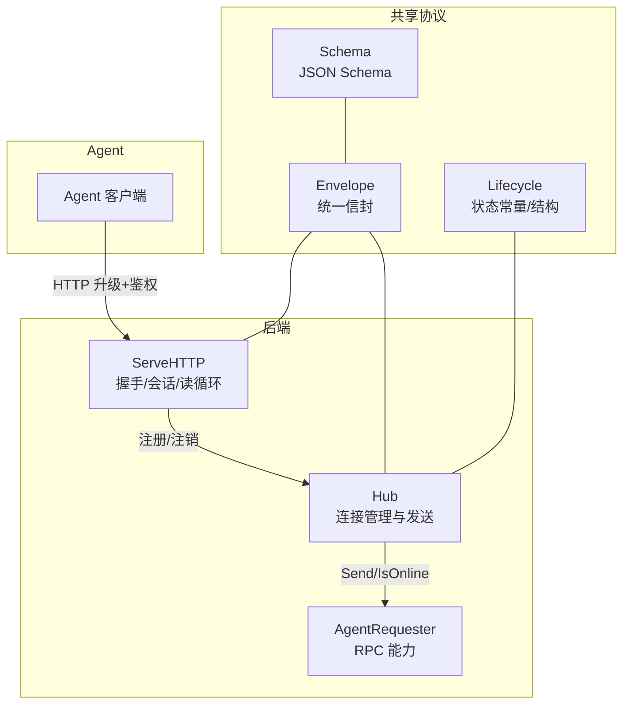
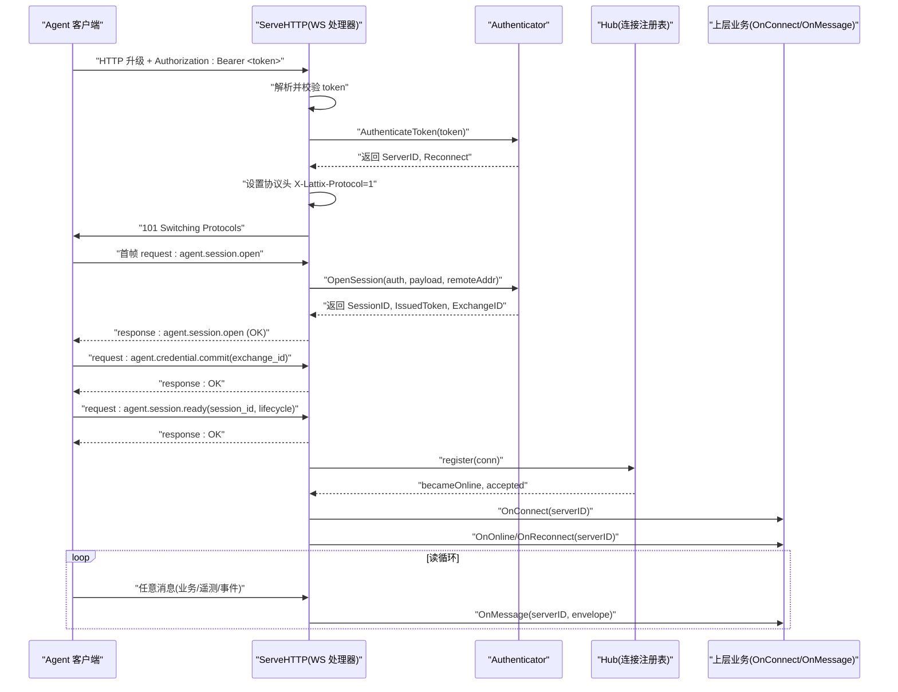
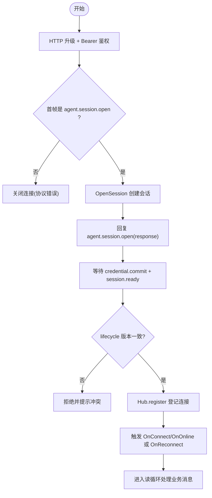
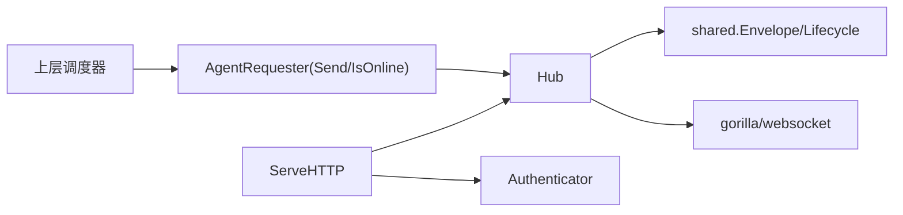
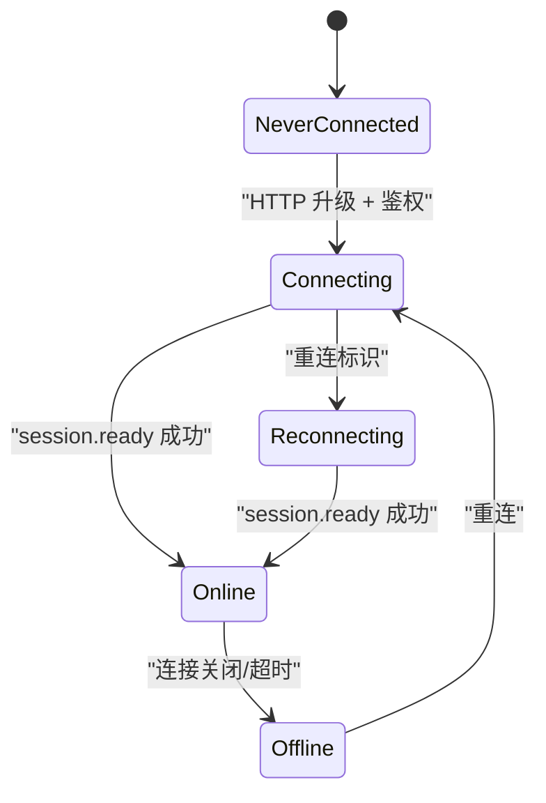

# WebSocket 消息流

<cite>
**本文引用的文件**   
- [src/backend/internal/ws/hub.go](file://src/backend/internal/ws/hub.go)
- [src/backend/internal/ws/agent.go](file://src/backend/internal/ws/agent.go)
- [src/backend/internal/ws/requester.go](file://src/backend/internal/ws/requester.go)
- [src/shared/messages.go](file://src/shared/messages.go)
- [src/shared/lifecycle.go](file://src/shared/lifecycle.go)
- [docs/ws-protocol.schema.json](file://docs/ws-protocol.schema.json)
- [src/backend/cmd/backend/main.go](file://src/backend/cmd/backend/main.go)
</cite>

## 目录
1. [简介](#简介)
2. [项目结构](#项目结构)
3. [核心组件](#核心组件)
4. [架构总览](#架构总览)
5. [详细组件分析](#详细组件分析)
6. [依赖关系分析](#依赖关系分析)
7. [性能考量](#性能考量)
8. [故障排查指南](#故障排查指南)
9. [结论](#结论)
10. [附录](#附录)

## 简介
本文件面向后端与 Agent 之间的 WebSocket 控制通道，系统化描述双向通信协议、握手与会话管理、心跳与超时重连、消息路由与并发安全、序列化与错误码、以及调试方法。目标是让读者在不深入源码的情况下也能正确实现或对接该协议。

## 项目结构
WebSocket 相关代码主要位于后端 ws 包与共享协议定义中：
- Hub：连接注册表、发送队列、状态快照、生命周期同步、优雅停机（drain）
- ServeHTTP：HTTP 升级、鉴权、会话建立、读循环、心跳处理
- Requester/Authenticator：对外暴露的 RPC 能力与认证接口
- shared.Envelope：统一信封格式、类型常量、校验与序列化
- lifecycle：面板与连接的生命周期状态常量与数据结构
- schema：JSON Schema 约束协议字段与类型



图表来源
- [src/backend/internal/ws/hub.go:26-55](file://src/backend/internal/ws/hub.go#L26-L55)
- [src/backend/internal/ws/agent.go:33-79](file://src/backend/internal/ws/agent.go#L33-L79)
- [src/backend/internal/ws/requester.go:18-24](file://src/backend/internal/ws/requester.go#L18-L24)
- [src/shared/messages.go:14-22](file://src/shared/messages.go#L14-L22)
- [src/shared/lifecycle.go:5-20](file://src/shared/lifecycle.go#L5-L20)
- [docs/ws-protocol.schema.json:106-132](file://docs/ws-protocol.schema.json#L106-L132)

章节来源
- [src/backend/internal/ws/hub.go:1-120](file://src/backend/internal/ws/hub.go#L1-L120)
- [src/backend/internal/ws/agent.go:1-120](file://src/backend/internal/ws/agent.go#L1-L120)
- [src/backend/internal/ws/requester.go:1-43](file://src/backend/internal/ws/requester.go#L1-L43)
- [src/shared/messages.go:1-140](file://src/shared/messages.go#L1-L140)
- [src/shared/lifecycle.go:1-86](file://src/shared/lifecycle.go#L1-L86)
- [docs/ws-protocol.schema.json:1-132](file://docs/ws-protocol.schema.json#L1-L132)

## 核心组件
- 信封 Envelope：统一 kind/type/request_id/trace_id/data/code/message 字段；请求/响应/事件三类；响应强制 code/message；请求/事件禁止携带 code/message
- Hub：维护 serverID→连接映射、连接状态快照、发送缓冲、优雅停机、生命周期 ACK 等待
- ServeHTTP：Bearer Token 鉴权、协议头协商、首次帧 agent.session.open、credential.commit、session.ready、读循环与心跳续期
- Requester/Authenticator：Send/IsOnline 能力；AuthenticateToken/OpenSession/CommitCredential 认证流程

章节来源
- [src/shared/messages.go:14-137](file://src/shared/messages.go#L14-L137)
- [src/backend/internal/ws/hub.go:26-139](file://src/backend/internal/ws/hub.go#L26-L139)
- [src/backend/internal/ws/agent.go:33-120](file://src/backend/internal/ws/agent.go#L33-L120)
- [src/backend/internal/ws/requester.go:18-43](file://src/backend/internal/ws/requester.go#L18-L43)

## 架构总览
下图展示从 HTTP 升级到应用层会话建立的完整时序，包括鉴权、握手、会话打开、凭证提交与就绪、注册上线与回调。



图表来源
- [src/backend/internal/ws/agent.go:33-120](file://src/backend/internal/ws/agent.go#L33-L120)
- [src/backend/internal/ws/agent.go:158-197](file://src/backend/internal/ws/agent.go#L158-L197)
- [src/backend/internal/ws/agent.go:199-212](file://src/backend/internal/ws/agent.go#L199-L212)
- [src/backend/internal/ws/hub.go:232-249](file://src/backend/internal/ws/hub.go#L232-L249)
- [src/backend/cmd/backend/main.go:281-314](file://src/backend/cmd/backend/main.go#L281-L314)

## 详细组件分析

### 信封与类型规范
- 信封字段
  - kind：request/response/event
  - type：domain.action 命名规范（小写字母与短横线组成层级）
  - request_id/trace_id：32 位十六进制随机 ID，用于匹配请求与链路追踪
  - data：JSON 载荷
  - response 专用：code/message
- 类型常量
  - 会话：agent.session.open、agent.session.ready、agent.credential.commit
  - 生命周期：panel.lifecycle.changed
  - 设置同步：agent.settings.sync、agent.settings.changed
  - 节点/用户/卸载/升级/遥测/漂移/链跳等
- 校验规则
  - Validate() 强制 kind/type/request_id/trace_id/data 存在且合法
  - response 必须包含 code/message；request/event 不得包含 code/message

章节来源
- [src/shared/messages.go:14-137](file://src/shared/messages.go#L14-L137)
- [src/shared/messages.go:47-91](file://src/shared/messages.go#L47-L91)
- [docs/ws-protocol.schema.json:106-132](file://docs/ws-protocol.schema.json#L106-L132)

### 握手与会话管理
- HTTP 升级阶段
  - 校验 Authorization: Bearer <token>
  - 通过 Authenticator.AuthenticateToken 获取 ServerID 与是否重连
  - 设置协议头 X-Lattix-Protocol=1
- 应用层会话
  - 首帧必须是 request: agent.session.open，payload 包含 protocol_version、agent_version、xray_version、xray_running 等
  - OpenSession 成功后返回 session_id、issued_token、credential_exchange_id、panel_state
  - 在 session.ready 之前仅允许 credential.commit 与 session.ready
  - session.ready 需携带 session_id 与当前 lifecycle version，不一致则拒绝
- 连接登记与回调
  - register 成功即视为在线，触发 OnConnect/OnOnline 或 OnReconnect
  - unregister 时若为真实下线（非被新连接顶替），触发 OnDisconnect



图表来源
- [src/backend/internal/ws/agent.go:33-120](file://src/backend/internal/ws/agent.go#L33-L120)
- [src/backend/internal/ws/agent.go:158-197](file://src/backend/internal/ws/agent.go#L158-L197)
- [src/backend/internal/ws/hub.go:232-249](file://src/backend/internal/ws/hub.go#L232-L249)

章节来源
- [src/backend/internal/ws/agent.go:33-120](file://src/backend/internal/ws/agent.go#L33-L120)
- [src/backend/internal/ws/agent.go:158-197](file://src/backend/internal/ws/agent.go#L158-L197)
- [src/backend/internal/ws/hub.go:232-249](file://src/backend/internal/ws/hub.go#L232-L249)

### 心跳机制与超时检测
- Ping/Pong
  - Agent 主动发送 Ping；Panel 原样 Pong 并重置读超时
  - 任何消息到达都会续期读超时
- 超时策略
  - 默认 pongTimeout=90s；writeTimeout=10s
  - 写超时即判定连接死亡；读超时未收到任何字节也判定连接死亡
- 自动重连
  - Agent 侧根据 panel_state.retry_policy 进行指数退避重试
  - Hub 支持 BeginDrain 优雅停机，使用 RFC 6455 CloseServiceRestart 通知 Agent 走快速重启路径

章节来源
- [src/backend/internal/ws/agent.go:102-111](file://src/backend/internal/ws/agent.go#L102-L111)
- [src/backend/internal/ws/hub.go:16-24](file://src/backend/internal/ws/hub.go#L16-L24)
- [src/backend/internal/ws/hub.go:156-173](file://src/backend/internal/ws/hub.go#L156-L173)

### 消息路由与并发安全
- 发送路径
  - Send(ctx, serverID, env) 投递到连接的 send channel（每连接独立缓冲）
  - writePump 串行写出，避免 gorilla 并发写限制
- 在线判断
  - IsOnline(serverID) 基于连接是否存在
- 并发安全
  - Hub 使用读写锁保护 conns/states/drain 标志
  - agentConn 使用 once 保证 close 幂等；lifecycleAcks 使用互斥锁保护
- 优雅停机
  - BeginDrain 拒绝新工作并关闭所有连接；在此期间不触发 OnDisconnect

```mermaid
classDiagram
class Hub {
+Send(ctx, serverID, env) error
+IsOnline(serverID) bool
+BeginDrain() void
+SyncLifecycle(ctx, snapshot) []int64
+CloseAgent(serverID, code, reason) void
+ForgetAgent(serverID, code, reason) void
+CloseAllAgents(code, reason) void
-conns map[int64]*agentConn
-states map[int64]ConnectionSnapshot
-draining bool
}
class agentConn {
-hub *Hub
-serverID int64
-sessionID string
-sessionKind string
-ws *websocket.Conn
-send chan Envelope
-done chan struct{}
-lifecycleAcks map[string]chan struct{}
+writePump() void
+close() void
+closeWithCode(code, reason) void
}
Hub --> agentConn : "管理/发送"
```

图表来源
- [src/backend/internal/ws/hub.go:26-55](file://src/backend/internal/ws/hub.go#L26-L55)
- [src/backend/internal/ws/hub.go:110-139](file://src/backend/internal/ws/hub.go#L110-L139)
- [src/backend/internal/ws/hub.go:282-318](file://src/backend/internal/ws/hub.go#L282-L318)
- [src/backend/internal/ws/hub.go:398-412](file://src/backend/internal/ws/hub.go#L398-L412)

章节来源
- [src/backend/internal/ws/hub.go:110-139](file://src/backend/internal/ws/hub.go#L110-L139)
- [src/backend/internal/ws/hub.go:282-318](file://src/backend/internal/ws/hub.go#L282-L318)
- [src/backend/internal/ws/hub.go:398-412](file://src/backend/internal/ws/hub.go#L398-L412)

### 消息序列化处理
- 严格反序列化
  - strictUnmarshal 禁用未知字段，确保 JSON 结构稳定
- 信封序列化
  - MarshalJSON 区分请求与响应字段，确保响应必带 code/message
- 数据校验
  - Envelope.Validate() 校验 kind/type/id/data 合法性

章节来源
- [src/backend/internal/ws/agent.go:316-329](file://src/backend/internal/ws/agent.go#L316-L329)
- [src/shared/messages.go:24-45](file://src/shared/messages.go#L24-L45)
- [src/shared/messages.go:111-137](file://src/shared/messages.go#L111-L137)

### 错误码定义
- 通用 RPC 错误码
  - OK、ACCEPTED、AUTH_REQUIRED、AUTH_INVALID_CREDENTIALS、INVALID_ARGUMENT、NOT_FOUND、CONFLICT、OPERATION_LOCKED、UNSUPPORTED_ACTION、INTERNAL_ERROR、UPSTREAM_ERROR、SERVICE_UNAVAILABLE、SERVER_OFFLINE、PORT_OUT_OF_RANGE、UPDATE_IN_PROGRESS
- 握手/协议错误
  - 握手失败返回标准 HTTP 状态码 + Envelope(response)
  - 协议错误使用 WS CloseMessage(4002) 关闭连接

章节来源
- [src/shared/messages.go:54-70](file://src/shared/messages.go#L54-L70)
- [src/backend/internal/ws/agent.go:264-274](file://src/backend/internal/ws/agent.go#L264-L274)
- [src/backend/internal/ws/agent.go:95-98](file://src/backend/internal/ws/agent.go#L95-L98)

### 调试工具与日志
- 协议头
  - X-Lattix-Protocol=1 用于版本协商
- 日志钩子
  - OnUpgrade：记录 101 握手
  - OnMessage：上抛业务信封
  - OnProtocolError：记录无正常响应的协议错误
  - OnOnline/OnReconnect/OnDisconnect：连接状态跃迁
- 客户端 IP
  - clientIP 优先信任回环代理的 X-Forwarded-For，直连场景不信任

章节来源
- [src/backend/internal/ws/agent.go:77-79](file://src/backend/internal/ws/agent.go#L77-L79)
- [src/backend/internal/ws/agent.go:287-300](file://src/backend/internal/ws/agent.go#L287-L300)
- [src/backend/internal/ws/agent.go:334-350](file://src/backend/internal/ws/agent.go#L334-L350)
- [src/backend/cmd/backend/main.go:281-314](file://src/backend/cmd/backend/main.go#L281-L314)

## 依赖关系分析
- Hub 依赖 shared.Envelope、shared.LifecycleSnapshot、gorilla/websocket
- ServeHTTP 依赖 Authenticator 接口完成鉴权与会话建立
- Requester 抽象出 Send/IsOnline 能力，供上层调度器调用
- 测试覆盖关键行为：注册/注销、drain、启动态阻断业务命令、生命周期 ACK 等待



图表来源
- [src/backend/internal/ws/hub.go:1-14](file://src/backend/internal/ws/hub.go#L1-L14)
- [src/backend/internal/ws/requester.go:1-17](file://src/backend/internal/ws/requester.go#L1-L17)
- [src/backend/internal/ws/agent.go:1-17](file://src/backend/internal/ws/agent.go#L1-L17)

章节来源
- [src/backend/internal/ws/hub.go:1-14](file://src/backend/internal/ws/hub.go#L1-L14)
- [src/backend/internal/ws/requester.go:1-17](file://src/backend/internal/ws/requester.go#L1-L17)
- [src/backend/internal/ws/agent.go:1-17](file://src/backend/internal/ws/agent.go#L1-L17)

## 性能考量
- 单连接写串行化：writePump 避免并发写，降低锁竞争
- 发送缓冲：每连接 256 条，满则断开慢连接并重连补发
- 超时控制：写超时 10s，读超时 90s，及时释放资源
- 启动态阻断：startup/faulted 状态下拒绝业务命令，减少无效负载
- 优雅停机：BeginDrain 快速关闭连接，利用 Agent 快速重启路径

章节来源
- [src/backend/internal/ws/hub.go:16-24](file://src/backend/internal/ws/hub.go#L16-L24)
- [src/backend/internal/ws/hub.go:119-122](file://src/backend/internal/ws/hub.go#L119-L122)
- [src/backend/internal/ws/hub.go:156-173](file://src/backend/internal/ws/hub.go#L156-L173)

## 故障排查指南
- 握手失败
  - 检查 Authorization: Bearer 是否正确
  - 查看 HTTP 状态码与返回的 Envelope(response) 中的 code/message
- 首帧错误
  - 确认首帧为 agent.session.open，payload 字段齐全
  - 协议错误会返回 CloseMessage(4002)
- 会话未就绪
  - 在 session.ready 前只接受 credential.commit 与 session.ready
  - lifecycle 版本不一致将返回 CONFLICT
- 连接频繁断开
  - 检查 Ping/Pong 是否正常；确认读超时未被拉大
  - 观察 BeginDrain 是否处于优雅停机
- 无法发送消息
  - IsOnline 是否为真；Send 是否返回 ErrOffline/ErrDraining/ErrPanelNotActive

章节来源
- [src/backend/internal/ws/agent.go:264-274](file://src/backend/internal/ws/agent.go#L264-L274)
- [src/backend/internal/ws/agent.go:95-98](file://src/backend/internal/ws/agent.go#L95-L98)
- [src/backend/internal/ws/agent.go:158-197](file://src/backend/internal/ws/agent.go#L158-L197)
- [src/backend/internal/ws/hub.go:110-139](file://src/backend/internal/ws/hub.go#L110-L139)

## 结论
该 WebSocket 协议以统一信封为核心，结合严格的握手与会话流程、健壮的心跳与超时机制、以及高并发安全的 Hub 路由，实现了稳定可靠的 Agent 控制通道。配合 JSON Schema 与完善的错误码体系，便于两端对齐与问题定位。

## 附录

### 消息类型表
- 会话类
  - agent.session.open：请求，建立应用会话
  - agent.session.ready：请求，声明会话就绪
  - agent.credential.commit：请求，提交凭证交换
- 生命周期类
  - panel.lifecycle.changed：请求，面板生命周期变更广播
- 设置同步类
  - agent.settings.sync：请求，拉取 Agent 设置
  - agent.settings.changed：事件，设置变更通知
- 节点/用户/卸载/升级/遥测/漂移/链跳
  - node.apply / node.remove
  - user.add / user.remove
  - agent.uninstall
  - xray.upgrade / agent.upgrade
  - telemetry.report
  - config.drift
  - chain-hop.apply / chain-hop.remove

章节来源
- [src/shared/messages.go:73-91](file://src/shared/messages.go#L73-L91)

### 交互时序图（会话建立）
见“架构总览”中的 sequence 图。

### 连接状态机


图表来源
- [src/shared/lifecycle.go:11-20](file://src/shared/lifecycle.go#L11-L20)
- [src/backend/internal/ws/agent.go:61-67](file://src/backend/internal/ws/agent.go#L61-L67)
- [src/backend/internal/ws/hub.go:232-249](file://src/backend/internal/ws/hub.go#L232-L249)