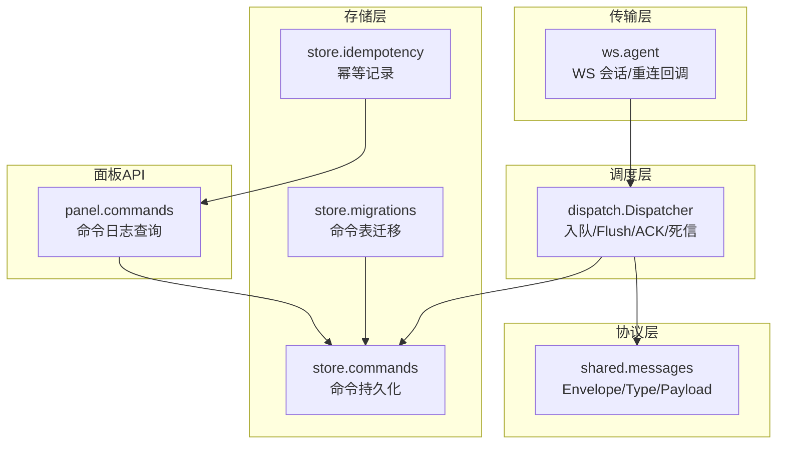
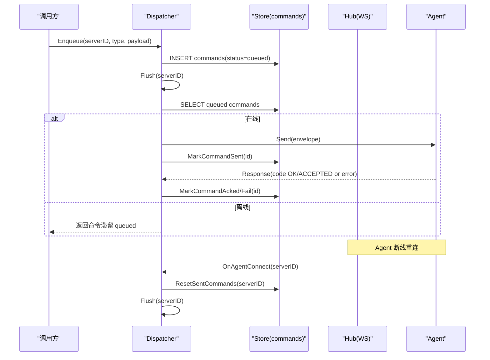
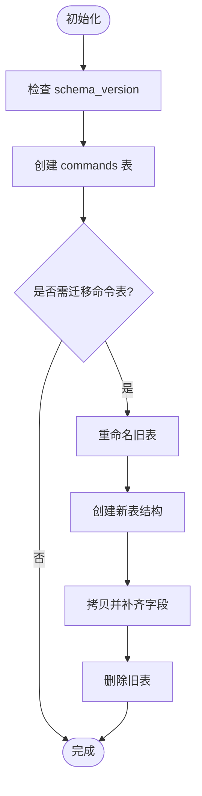
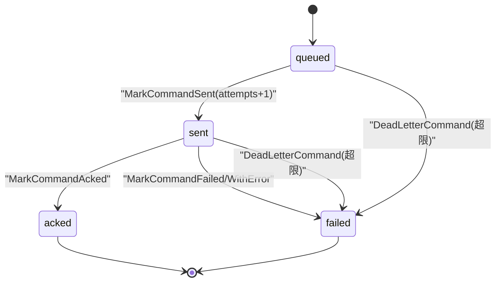
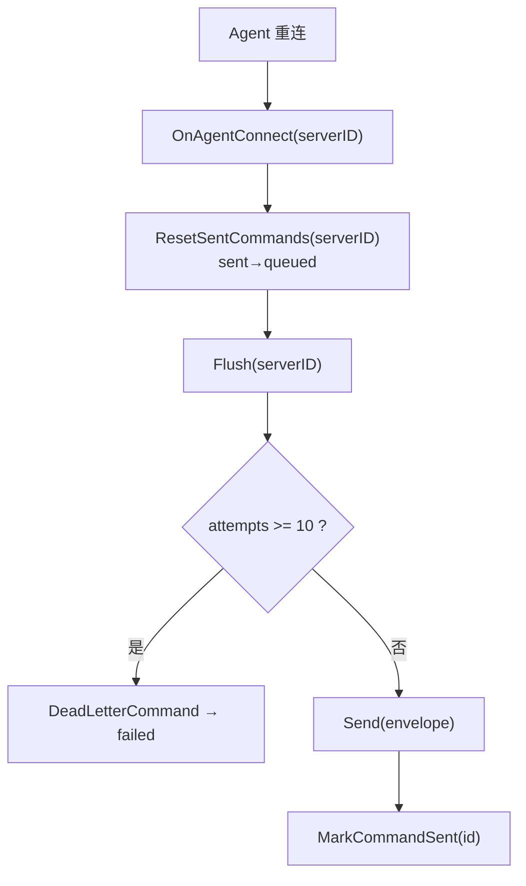
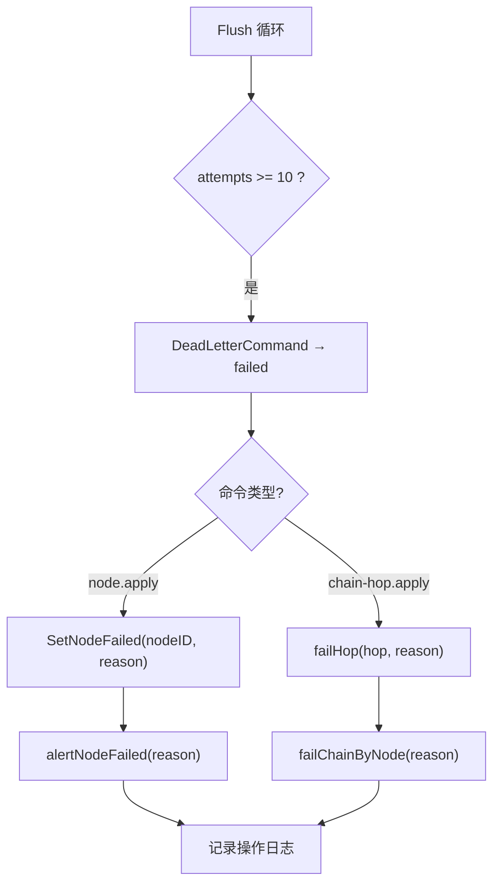
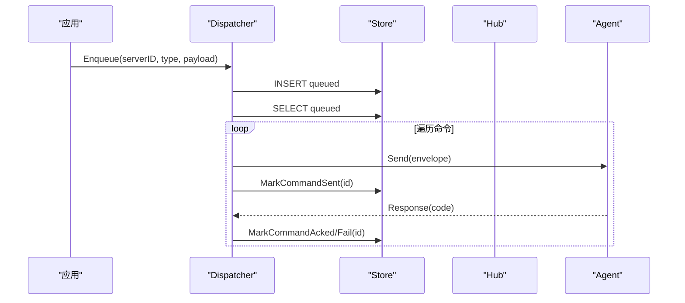
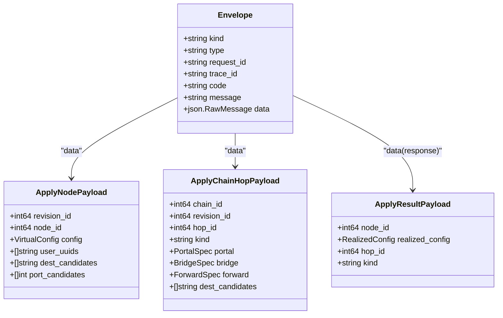
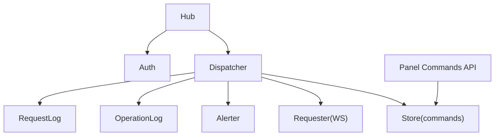

# 命令队列数据流

<cite>
**本文引用的文件**   
- [commands.go](file://src/backend/internal/store/commands.go)
- [migrations.go](file://src/backend/internal/store/migrations.go)
- [dispatcher.go](file://src/backend/internal/dispatch/dispatcher.go)
- [agent.go](file://src/backend/internal/ws/agent.go)
- [main.go](file://src/backend/cmd/backend/main.go)
- [messages.go](file://src/shared/messages.go)
- [idempotency.go](file://src/backend/internal/store/idempotency.go)
- [commands_api.go](file://src/backend/internal/panel/commands.go)
</cite>

## 目录
1. [简介](#简介)
2. [项目结构](#项目结构)
3. [核心组件](#核心组件)
4. [架构总览](#架构总览)
5. [详细组件分析](#详细组件分析)
6. [依赖关系分析](#依赖关系分析)
7. [性能考量](#性能考量)
8. [故障排查指南](#故障排查指南)
9. [结论](#结论)
10. [附录](#附录)

## 简介
本文件系统化梳理“离线命令队列”的数据流与状态机，覆盖以下关键点：
- commands 表结构与字段语义
- 命令状态机（queued → sent → acked | failed；abandoned 预留）
- 重发策略（连接恢复后的补发、幂等性保证、重试上限控制）
- 死信处理（attempts 超过上限的终态化、node.apply 失败时的节点状态同步）
- 命令生命周期（创建、发送、确认、完成或失败的完整流程）
- 命令优先级、批量处理、错误恢复机制
- 具体命令类型定义与状态转换示例

## 项目结构
命令队列相关代码主要分布在后端存储层、调度分发层、WebSocket 会话层以及共享协议定义中：
- 存储层：commands 表操作、迁移脚本、幂等记录
- 调度层：命令入队、Flush 批量投递、ACK 处理、死信与编排联动
- WebSocket 层：Agent 连接建立、重连回调触发补发
- 共享协议：Envelope、消息类型、载荷结构
- 面板 API：命令日志查询接口

**图表来源** 
- [commands.go:1-188](file://src/backend/internal/store/commands.go#L1-L188)
- [migrations.go:184-245](file://src/backend/internal/store/migrations.go#L184-L245)
- [dispatcher.go:50-241](file://src/backend/internal/dispatch/dispatcher.go#L50-L241)
- [agent.go:200-212](file://src/backend/internal/ws/agent.go#L200-L212)
- [messages.go:73-91](file://src/shared/messages.go#L73-L91)
- [commands_api.go:25-71](file://src/backend/internal/panel/commands.go#L25-L71)

**章节来源**
- [commands.go:1-188](file://src/backend/internal/store/commands.go#L1-L188)
- [migrations.go:184-245](file://src/backend/internal/store/migrations.go#L184-L245)
- [dispatcher.go:50-241](file://src/backend/internal/dispatch/dispatcher.go#L50-L241)
- [agent.go:200-212](file://src/backend/internal/ws/agent.go#L200-L212)
- [messages.go:73-91](file://src/shared/messages.go#L73-L91)
- [commands_api.go:25-71](file://src/backend/internal/panel/commands.go#L25-L71)

## 核心组件
- 命令模型与状态常量
  - Command 结构体包含 id、request_id、trace_id、server_id、type、data、status、error、attempts、created_at、updated_at
  - 状态常量：queued、sent、acked、failed、abandoned（abandoned 为预留扩展）
- 存储接口
  - EnqueueCommand：插入 queued 命令并返回 id
  - QueuedCommands：按 server_id 拉取 queued 命令（按 id 升序）
  - ResetSentCommands：重连时将 sent 未终态的命令重置为 queued
  - MarkCommandSent：标记已投递（attempts +1），仅允许从 queued/sent 迁移到 sent
  - MarkCommandAcked / MarkCommandFailed / MarkCommandFailedWithError：仅允许从 sent 迁移到 acked/failed
  - DeadLetterCommand：将超上限的 queued/sent 命令终态化为 failed
  - RecentCommands：操作日志查询（不返回 data 敏感字段）
- 调度器 Dispatcher
  - Enqueue：写入 commands 表并尝试立即 Flush
  - Flush：批量拉取 queued 命令，逐条通过 Requester 发送；离线时停止并滞留；对 attempts 超限进行死信处理
  - OnAgentConnect：重连后重置 sent→queued 并 Flush
  - handleCommandResponse：根据 response code 更新命令状态，联动节点/链编排状态
- WebSocket Hub
  - 在 session.ready 完成后触发 OnConnect，驱动 Dispatcher 补发离线命令
- 共享协议 messages
  - Envelope 统一信封，Type 定义命令类型（如 node.apply、chain-hop.apply、agent.uninstall 等）
  - ApplyResultPayload：回执载荷，携带 NodeID/HopID/RealizedConfig 等
- 幂等性 store.idempotency
  - 提供 RPC 幂等记录（operator/route/key）的预留与完成，用于 HTTP 侧幂等控制

**章节来源**
- [commands.go:12-34](file://src/backend/internal/store/commands.go#L12-L34)
- [commands.go:36-187](file://src/backend/internal/store/commands.go#L36-L187)
- [dispatcher.go:50-111](file://src/backend/internal/dispatch/dispatcher.go#L50-L111)
- [dispatcher.go:166-241](file://src/backend/internal/dispatch/dispatcher.go#L166-L241)
- [dispatcher.go:402-409](file://src/backend/internal/dispatch/dispatcher.go#L402-L409)
- [dispatcher.go:625-730](file://src/backend/internal/dispatch/dispatcher.go#L625-L730)
- [agent.go:200-212](file://src/backend/internal/ws/agent.go#L200-L212)
- [messages.go:73-91](file://src/shared/messages.go#L73-L91)
- [messages.go:185-193](file://src/shared/messages.go#L185-L193)
- [idempotency.go:17-81](file://src/backend/internal/store/idempotency.go#L17-L81)

## 架构总览
命令队列的整体交互如下：
- 调用方通过 Dispatcher.Enqueue 入队命令（写入 commands 表，状态 queued）
- Dispatcher.Flush 批量拉取 queued 命令并通过 Requester.Send 投递至 Agent
- Agent 执行后回传 response（code OK/ACCEPTED 表示成功，其他表示失败）
- Dispatcher.handleCommandResponse 根据 code 更新命令状态（acked/failed），并联动节点/链编排状态
- Agent 断线重连后，Hub.OnConnect 触发 Dispatcher.OnAgentConnect，重置 sent→queued 并补发

**图表来源** 
- [dispatcher.go:50-67](file://src/backend/internal/dispatch/dispatcher.go#L50-L67)
- [dispatcher.go:166-241](file://src/backend/internal/dispatch/dispatcher.go#L166-L241)
- [dispatcher.go:625-730](file://src/backend/internal/dispatch/dispatcher.go#L625-L730)
- [agent.go:200-212](file://src/backend/internal/ws/agent.go#L200-L212)
- [commands.go:53-92](file://src/backend/internal/store/commands.go#L53-L92)

## 详细组件分析

### 命令表结构与迁移
- 表字段
  - id：自增主键
  - request_id：唯一请求标识（用于 ACK 归属校验）
  - trace_id：追踪标识
  - server_id：目标服务器
  - type：命令类型（如 node.apply、chain-hop.apply、agent.uninstall 等）
  - data：JSON 载荷（可能含敏感信息，日志接口不返回）
  - status：命令状态（queued/sent/acked/failed/abandoned）
  - error：失败原因（来自 apply_result.error 或死信说明）
  - attempts：投递次数
  - created_at/updated_at：时间戳（RecentCommands 使用）
- 迁移脚本
  - 兼容旧表结构（payload/data/status/attempts 等），确保向后兼容

**图表来源** 
- [migrations.go:184-245](file://src/backend/internal/store/migrations.go#L184-L245)

**章节来源**
- [commands.go:20-34](file://src/backend/internal/store/commands.go#L20-L34)
- [migrations.go:184-245](file://src/backend/internal/store/migrations.go#L184-L245)

### 状态机与转换规则
- 状态常量
  - queued：待发送
  - sent：已投递但未终态
  - acked：成功执行
  - failed：执行失败
  - abandoned：预留扩展（当前未使用）
- 转换约束
  - queued → sent：MarkCommandSent（attempts +1）
  - sent → acked：MarkCommandAcked（仅允许从 sent 迁移）
  - sent → failed：MarkCommandFailed / MarkCommandFailedWithError
  - queued/sent → failed：DeadLetterCommand（attempts 超限）
  - 迟到的 ACK 不得翻回终态（非 sent 状态被忽略）

**图表来源** 
- [commands.go:11-18](file://src/backend/internal/store/commands.go#L11-L18)
- [commands.go:85-137](file://src/backend/internal/store/commands.go#L85-L137)
- [commands.go:169-187](file://src/backend/internal/store/commands.go#L169-L187)

**章节来源**
- [commands.go:11-18](file://src/backend/internal/store/commands.go#L11-L18)
- [commands.go:85-137](file://src/backend/internal/store/commands.go#L85-L137)
- [commands.go:169-187](file://src/backend/internal/store/commands.go#L169-L187)

### 重发策略与幂等性保证
- 连接恢复后的补发
  - Hub.OnConnect 触发 Dispatcher.OnAgentConnect
  - ResetSentCommands 将 sent 未终态命令重置为 queued
  - Flush 重新拉取并发送
- 幂等性保证
  - 每次重发复用相同 request_id，Agent 可据此去重
  - HTTP 侧可通过 rpc_idempotency 表实现幂等预留与完成
- 重试上限控制
  - maxCommandAttempts = 10（Dispatcher 常量）
  - attempts 达到上限即 DeadLetterCommand 置 failed，不再重发

**图表来源** 
- [agent.go:200-212](file://src/backend/internal/ws/agent.go#L200-L212)
- [dispatcher.go:402-409](file://src/backend/internal/dispatch/dispatcher.go#L402-L409)
- [dispatcher.go:166-241](file://src/backend/internal/dispatch/dispatcher.go#L166-L241)
- [commands.go:77-92](file://src/backend/internal/store/commands.go#L77-L92)
- [idempotency.go:37-81](file://src/backend/internal/store/idempotency.go#L37-L81)

**章节来源**
- [agent.go:200-212](file://src/backend/internal/ws/agent.go#L200-L212)
- [dispatcher.go:166-241](file://src/backend/internal/dispatch/dispatcher.go#L166-L241)
- [dispatcher.go:402-409](file://src/backend/internal/dispatch/dispatcher.go#L402-L409)
- [commands.go:77-92](file://src/backend/internal/store/commands.go#L77-L92)
- [idempotency.go:37-81](file://src/backend/internal/store/idempotency.go#L37-L81)

### 死信处理与节点状态同步
- 死信触发条件
  - attempts ≥ maxCommandAttempts（10）
- 死信动作
  - DeadLetterCommand 将命令置 failed
  - 针对 node.apply：SetNodeFailed(nodeID, reason)，并告警
  - 针对 chain-hop.apply：failHop(hop, reason)，链置 failed 定位到跳
- 节点状态同步
  - handleCommandResponse 中失败路径：SetNodeFailed + alertNodeFailed + failChainByNode

**图表来源** 
- [dispatcher.go:191-226](file://src/backend/internal/dispatch/dispatcher.go#L191-L226)
- [dispatcher.go:774-780](file://src/backend/internal/dispatch/dispatcher.go#L774-L780)

**章节来源**
- [dispatcher.go:191-226](file://src/backend/internal/dispatch/dispatcher.go#L191-L226)
- [dispatcher.go:774-780](file://src/backend/internal/dispatch/dispatcher.go#L774-L780)

### 命令生命周期与批量处理
- 创建：Enqueue → INSERT commands(status=queued)
- 发送：Flush → SELECT queued → Send → MarkCommandSent
- 确认：handleCommandResponse → MarkCommandAcked/FailWithError
- 完成/失败：acked/failed 终态；dead-lettered 进入 failed
- 批量处理：Flush 按 server_id 拉取全部 queued，顺序发送；离线时中断并滞留

**图表来源** 
- [dispatcher.go:50-67](file://src/backend/internal/dispatch/dispatcher.go#L50-L67)
- [dispatcher.go:166-241](file://src/backend/internal/dispatch/dispatcher.go#L166-L241)
- [dispatcher.go:625-730](file://src/backend/internal/dispatch/dispatcher.go#L625-L730)

**章节来源**
- [dispatcher.go:50-67](file://src/backend/internal/dispatch/dispatcher.go#L50-L67)
- [dispatcher.go:166-241](file://src/backend/internal/dispatch/dispatcher.go#L166-L241)
- [dispatcher.go:625-730](file://src/backend/internal/dispatch/dispatcher.go#L625-L730)

### 命令类型与载荷
- 常用命令类型
  - node.apply / node.remove：节点配置下发/移除
  - chain-hop.apply / chain-hop.remove：链跳配置件下发/移除
  - agent.uninstall：卸载 Agent
  - agent.upgrade / xray.upgrade：升级 Agent/Xray
  - user.add / user.remove：用户热加/热删
  - telemetry.report / config.drift：遥测/漂移上报
- 载荷结构
  - ApplyNodePayload：config、user_uuids、dest_candidates、port_candidates
  - ApplyChainHopPayload：kind(portal/bridge/forward)、spec、dest_candidates
  - ApplyResultPayload：node_id/hop_id/realized_config

**图表来源** 
- [messages.go:13-22](file://src/shared/messages.go#L13-L22)
- [messages.go:139-149](file://src/shared/messages.go#L139-L149)
- [messages.go:255-267](file://src/shared/messages.go#L255-L267)
- [messages.go:185-193](file://src/shared/messages.go#L185-L193)

**章节来源**
- [messages.go:73-91](file://src/shared/messages.go#L73-L91)
- [messages.go:139-149](file://src/shared/messages.go#L139-L149)
- [messages.go:255-267](file://src/shared/messages.go#L255-L267)
- [messages.go:185-193](file://src/shared/messages.go#L185-L193)

### 命令优先级与批量处理
- 优先级
  - 当前按 id 升序拉取 queued，无显式优先级字段；如需优先级可扩展 status 或新增 priority 字段
- 批量处理
  - Flush 一次性拉取 server_id 的全部 queued，顺序发送；离线时中断并滞留
  - 每服务器独立锁（flushMu）避免并发重复投递

**章节来源**
- [commands.go:53-75](file://src/backend/internal/store/commands.go#L53-L75)
- [dispatcher.go:166-241](file://src/backend/internal/dispatch/dispatcher.go#L166-L241)
- [dispatcher.go:782-791](file://src/backend/internal/dispatch/dispatcher.go#L782-L791)

### 错误恢复机制
- 网络错误
  - Requester.Send 失败则中断 Flush，剩余命令保持 queued，等待重连补发
- 执行失败
  - handleCommandResponse 将命令置 failed，记录 error，联动节点/链状态
- 死信恢复
  - 管理员可手动重试（例如 RetryChain），失败跳复位并重新下发

**章节来源**
- [dispatcher.go:166-241](file://src/backend/internal/dispatch/dispatcher.go#L166-L241)
- [dispatcher.go:625-730](file://src/backend/internal/dispatch/dispatcher.go#L625-L730)

## 依赖关系分析
- Dispatcher 依赖 Store（commands 表操作）、Requester（WS 发送）、Alerter/OperationLog/RequestLog（告警与日志）
- Hub 依赖 Dispatcher（OnConnect 回调）、Auth（认证）
- Panel API 依赖 Store（RecentCommands）

**图表来源** 
- [dispatcher.go:24-48](file://src/backend/internal/dispatch/dispatcher.go#L24-L48)
- [agent.go:33-59](file://src/backend/internal/ws/agent.go#L33-L59)
- [commands_api.go:25-71](file://src/backend/internal/panel/commands.go#L25-L71)

**章节来源**
- [dispatcher.go:24-48](file://src/backend/internal/dispatch/dispatcher.go#L24-L48)
- [agent.go:33-59](file://src/backend/internal/ws/agent.go#L33-L59)
- [commands_api.go:25-71](file://src/backend/internal/panel/commands.go#L25-L71)

## 性能考量
- 数据库查询
  - QueuedCommands 按 server_id + status 过滤，建议索引 (server_id, status)
  - RecentCommands 限制 limit（默认 50，最大 200）
- 内存与缓冲
  - WS 发送缓冲 sendBuffer，避免阻塞读循环
- 重试退避
  - UninstallWithRetry 使用指数退避（base 100ms，cap 10s）
- 并发控制
  - 每服务器 flushMu 防止重复 Flush

[本节为通用指导，无需特定文件引用]

## 故障排查指南
- 命令未送达
  - 检查 Agent 是否在线（Hub.IsOnline）
  - 查看 commands 表 status 是否为 sent/acked
  - 检查 attempts 是否达到上限（死信）
- 命令失败
  - 查看 error 字段（apply_result.error 或死信说明）
  - 检查节点/链状态（SetNodeFailed/failChainByNode）
- 重连未补发
  - 确认 OnAgentConnect 是否触发
  - 检查 ResetSentCommands 是否成功
- 幂等问题
  - 检查 rpc_idempotency 表预留与完成状态

**章节来源**
- [commands.go:139-167](file://src/backend/internal/store/commands.go#L139-L167)
- [dispatcher.go:191-226](file://src/backend/internal/dispatch/dispatcher.go#L191-L226)
- [dispatcher.go:625-730](file://src/backend/internal/dispatch/dispatcher.go#L625-L730)
- [idempotency.go:17-81](file://src/backend/internal/store/idempotency.go#L17-L81)

## 结论
命令队列通过 commands 表与 Dispatcher 协作，实现了可靠的离线排队、重连补发、幂等保证与死信处理。状态机严格约束转换，确保一致性；结合节点/链编排状态，形成完整的控制面闭环。建议在后续迭代中考虑优先级扩展与更细粒度的重试策略。

[本节为总结，无需特定文件引用]

## 附录
- 启动流程中的命令队列刷新
  - main.go 在 ResumeChains 成功后，对在线服务器执行 Flush，确保启动时队列清空

**章节来源**
- [main.go:479-502](file://src/backend/cmd/backend/main.go#L479-L502)