# 数据流设计

<cite>
**本文引用的文件**   
- [src/backend/internal/panel/chains.go](file://src/backend/internal/panel/chains.go)
- [src/backend/internal/panel/servers.go](file://src/backend/internal/panel/servers.go)
- [src/backend/internal/dispatch/dispatcher.go](file://src/backend/internal/dispatch/dispatcher.go)
- [src/backend/internal/dispatch/revision_plan.go](file://src/backend/internal/dispatch/revision_plan.go)
- [src/backend/internal/ws/hub.go](file://src/backend/internal/ws/hub.go)
- [src/backend/internal/store/commands.go](file://src/backend/internal/store/commands.go)
- [src/backend/internal/store/metrics.go](file://src/backend/internal/store/metrics.go)
- [src/backend/internal/store/nodes.go](file://src/backend/internal/store/nodes.go)
- [src/shared/config.go](file://src/shared/config.go)
- [src/shared/messages.go](file://src/shared/messages.go)
- [src/agent/cmd/agent/main.go](file://src/agent/cmd/agent/main.go)
- [src/agent/internal/xray/config.go](file://src/agent/internal/xray/config.go)
- [src/agent/internal/xray/fill.go](file://src/agent/internal/xray/fill.go)
- [src/agent/internal/xray/manager.go](file://src/agent/internal/xray/manager.go)
</cite>

## 目录
1. [引言](#引言)
2. [项目结构](#项目结构)
3. [核心组件](#核心组件)
4. [架构总览](#架构总览)
5. [详细组件分析](#详细组件分析)
6. [依赖关系分析](#依赖关系分析)
7. [性能考量](#性能考量)
8. [故障排查指南](#故障排查指南)
9. [结论](#结论)
10. [附录](#附录)

## 引言
本文件系统性阐述系统的数据流设计，覆盖从用户输入到持久化、从配置生成到下发执行的全生命周期；解释虚拟配置模板机制（占位符填充与参数分工）；说明配置漂移检测（哈希比对与自动修复）；描述遥测数据流（主机指标采集、流量统计、健康检查上报）；并给出命令队列机制（离线排队、重试策略、死信处理）。文末包含典型场景的数据流转图与状态转换图，如服务器添加、节点配置、用户管理等。

## 项目结构
系统由前端面板、后端服务、Agent 代理与共享协议组成：
- 前端面板：提供用户界面与 API 调用入口。
- 后端服务：负责业务编排、存储、WebSocket Hub、命令分发与遥测聚合。
- Agent：运行在受控服务器上，管理 xray 进程、填充配置模板、上报遥测与漂移。
- 共享协议：定义控制信封、消息类型与虚拟/实际配置结构。

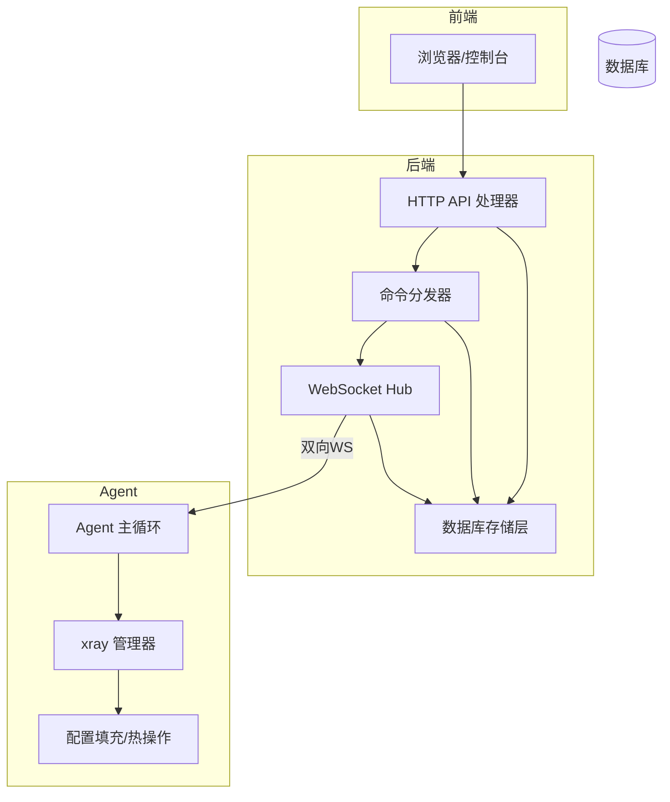

图表来源
- [src/backend/internal/panel/chains.go:154-171](file://src/backend/internal/panel/chains.go#L154-L171)
- [src/backend/internal/ws/hub.go:24-54](file://src/backend/internal/ws/hub.go#L24-L54)
- [src/backend/internal/dispatch/dispatcher.go:24-48](file://src/backend/internal/dispatch/dispatcher.go#L24-L48)
- [src/agent/cmd/agent/main.go:33-98](file://src/agent/cmd/agent/main.go#L33-L98)

章节来源
- [src/backend/internal/panel/chains.go:154-171](file://src/backend/internal/panel/chains.go#L154-L171)
- [src/backend/internal/ws/hub.go:24-54](file://src/backend/internal/ws/hub.go#L24-L54)
- [src/backend/internal/dispatch/dispatcher.go:24-48](file://src/backend/internal/dispatch/dispatcher.go#L24-L48)
- [src/agent/cmd/agent/main.go:33-98](file://src/agent/cmd/agent/main.go#L33-L98)

## 核心组件
- 命令队列与分发：将命令入队至数据库，按连接在线状态尽力投递，支持重连补发与死信。
- 配置模板与填充：面板侧生成虚拟配置模板（含占位符），Agent 侧完成占位符替换与端口/密钥派生，输出实际生效配置。
- 遥测与流量：Agent 周期上报主机指标与绝对流量计数器，后端持久化并计算增量。
- 配置漂移检测：Agent 对配置文件进行哈希比对，变化时上报，后端记录并可触发修复。
- 链式编排与修订：基于内容寻址的 diff 规划，逐跳下发 portal/bridge/forward 等配置件，失败定位到跳。

章节来源
- [src/backend/internal/store/commands.go:11-18](file://src/backend/internal/store/commands.go#L11-L18)
- [src/backend/internal/dispatch/dispatcher.go:50-67](file://src/backend/internal/dispatch/dispatcher.go#L50-L67)
- [src/shared/config.go:149-186](file://src/shared/config.go#L149-L186)
- [src/agent/internal/xray/fill.go:20-142](file://src/agent/internal/xray/fill.go#L20-L142)
- [src/agent/cmd/agent/main.go:311-353](file://src/agent/cmd/agent/main.go#L311-L353)
- [src/backend/internal/dispatch/revision_plan.go:51-92](file://src/backend/internal/dispatch/revision_plan.go#L51-L92)

## 架构总览
下图展示端到端数据流：用户通过面板创建链路或节点，后端落库并生成修订计划，经 WebSocket 下发至 Agent，Agent 填充模板并写入 xray 配置，随后上报回执与遥测。

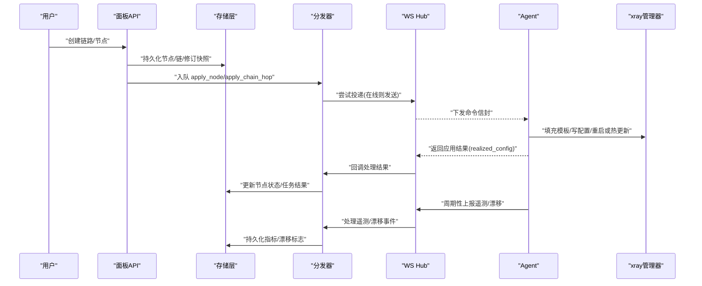

图表来源
- [src/backend/internal/panel/chains.go:199-433](file://src/backend/internal/panel/chains.go#L199-L433)
- [src/backend/internal/dispatch/dispatcher.go:171-241](file://src/backend/internal/dispatch/dispatcher.go#L171-L241)
- [src/backend/internal/ws/hub.go:109-138](file://src/backend/internal/ws/hub.go#L109-L138)
- [src/agent/cmd/agent/main.go:559-666](file://src/agent/cmd/agent/main.go#L559-L666)
- [src/agent/internal/xray/fill.go:20-142](file://src/agent/internal/xray/fill.go#L20-L142)

## 详细组件分析

### 虚拟配置模板机制（占位符填充与参数分工）
- 面板侧职责：
  - 生成 VirtualConfig（协议、端口、传输、指纹、加密方式、模板 JSON）。
  - 将模板以字符串形式存入 nodes.config_template，仅保留占位符，不做任何“翻译层”。
- Agent 侧职责：
  - 解析模板占位符：PORT、CLIENTS、PRIVATE_KEY、DECRYPTION、TAG。
  - 端口选择：优先指定端口，否则使用 port_candidates（受限直连 NAT）或随机空闲端口。
  - 密钥派生：Reality 私钥由 x25519 生成；VLESS Encryption 由 vlessenc 生成，客户端字符串随 realized 上报。
  - 用户列表构造：按协议生成 clients/accounts 条目（含 level 用于统计）。
  - dest 预检：Reality 目标不可达时按白名单回退。
  - 输出 RealizedConfig 供订阅与面板展示。

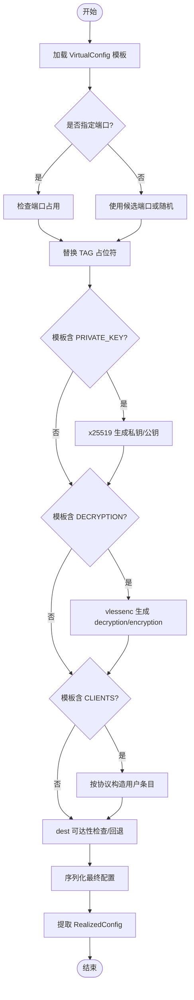

图表来源
- [src/shared/config.go:149-186](file://src/shared/config.go#L149-L186)
- [src/agent/internal/xray/fill.go:20-142](file://src/agent/internal/xray/fill.go#L20-L142)
- [src/agent/internal/xray/config.go:83-114](file://src/agent/internal/xray/config.go#L83-L114)

章节来源
- [src/shared/config.go:149-186](file://src/shared/config.go#L149-L186)
- [src/agent/internal/xray/fill.go:20-142](file://src/agent/internal/xray/fill.go#L20-L142)
- [src/agent/internal/xray/config.go:83-114](file://src/agent/internal/xray/config.go#L83-L114)

### 配置漂移检测（哈希比对与自动修复）
- 漂移检测：
  - Agent 维护最后一次受管配置的哈希基线，定时读取 config.json 计算哈希，若不一致则标记 drifted。
  - 首次调用以当前文件为基线；文件被删除视为漂移。
- 上报与记录：
  - Agent 仅在状态变化时上报 drift_report，后端记录并可选告警。
- 自动修复：
  - 面板可触发 repair_server，重放 active 节点的 apply_node，Agent 重建配置并清除漂移标志。
  - 加载配置时若检测到漂移，将以骨架+受管 inbound+链 piece 净化外部改动。

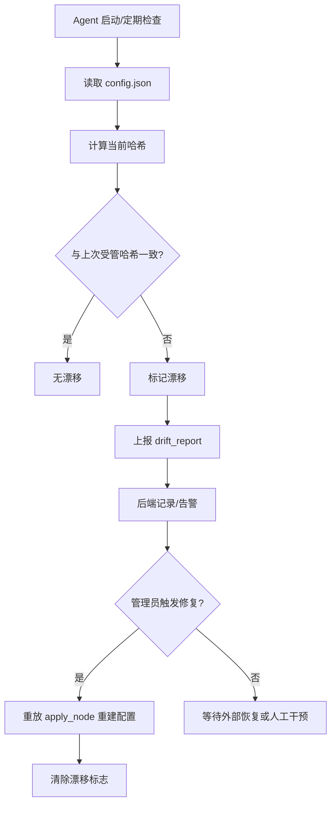

图表来源
- [src/agent/internal/xray/manager.go:275-316](file://src/agent/internal/xray/manager.go#L275-L316)
- [src/agent/cmd/agent/main.go:311-353](file://src/agent/cmd/agent/main.go#L311-L353)
- [src/backend/internal/dispatch/dispatcher.go:594-623](file://src/backend/internal/dispatch/dispatcher.go#L594-L623)
- [src/backend/internal/panel/servers.go:671-717](file://src/backend/internal/panel/servers.go#L671-L717)

章节来源
- [src/agent/internal/xray/manager.go:275-316](file://src/agent/internal/xray/manager.go#L275-L316)
- [src/agent/cmd/agent/main.go:311-353](file://src/agent/cmd/agent/main.go#L311-L353)
- [src/backend/internal/dispatch/dispatcher.go:594-623](file://src/backend/internal/dispatch/dispatcher.go#L594-L623)
- [src/backend/internal/panel/servers.go:671-717](file://src/backend/internal/panel/servers.go#L671-L717)

### 遥测数据流（主机指标、流量统计、健康检查）
- Agent 采集：
  - 主机指标：负载、内存、CPU、磁盘、网络接口与速率、开机时长、延迟中位数。
  - 流量统计：xray StatsService 拉取绝对计数器（节点维度、每跳 forward、用户维度）。
  - 健康检查：session.open/ready 建立会话，Ping/Pong 保活与延迟探测。
- 后端处理：
  - 持久化最新指标与历史样本，累计每日网络用量。
  - 应用流量快照，按游标计算增量，保证幂等与丢帧恢复。
  - 记录 WebSocket RPC 请求日志与操作日志。

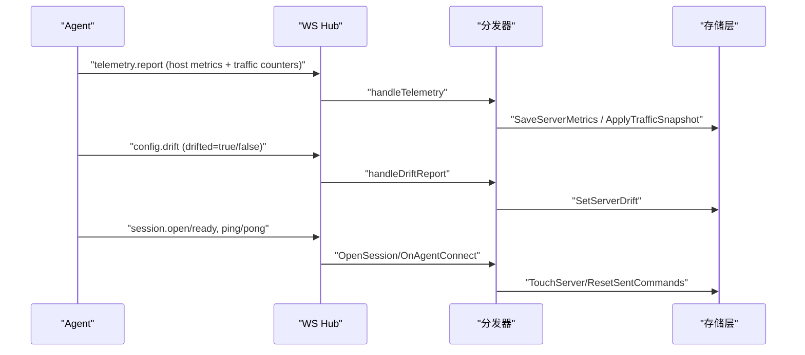

图表来源
- [src/agent/cmd/agent/main.go:278-309](file://src/agent/cmd/agent/main.go#L278-L309)
- [src/backend/internal/dispatch/dispatcher.go:553-592](file://src/backend/internal/dispatch/dispatcher.go#L553-L592)
- [src/backend/internal/store/metrics.go:47-107](file://src/backend/internal/store/metrics.go#L47-L107)

章节来源
- [src/agent/cmd/agent/main.go:278-309](file://src/agent/cmd/agent/main.go#L278-L309)
- [src/backend/internal/dispatch/dispatcher.go:553-592](file://src/backend/internal/dispatch/dispatcher.go#L553-L592)
- [src/backend/internal/store/metrics.go:47-107](file://src/backend/internal/store/metrics.go#L47-L107)

### 命令队列机制（离线排队、重试策略、死信处理）
- 入队与投递：
  - Enqueue 将命令写入 commands 表（queued），尽力立即 Flush 投递。
  - 连接在线则 Send 到 Hub 的发送队列；离线则滞留 queued。
- 重连补发：
  - OnAgentConnect 重置 sent 未终态的命令为 queued，再 Flush 补发。
- 重试与死信：
  - attempts 超过上限（默认 10）标记 failed（死信），不再重发。
  - 特定命令（如 apply_node/chain-hop）死信会置对应节点/跳为 failed，便于定位。
- 回执与状态机：
  - 仅允许 sent → acked/failed 迁移，迟到的 ack 不得翻回终态。
  - 清理类命令（remove_*）不触碰工作拓扑节点状态机。

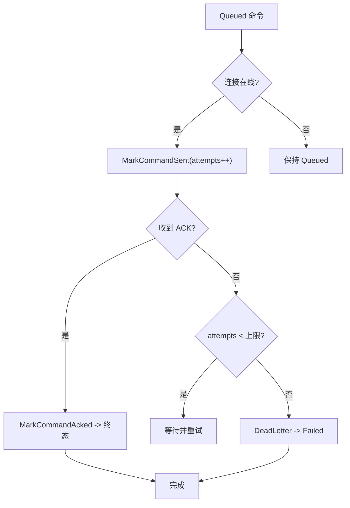

图表来源
- [src/backend/internal/store/commands.go:36-83](file://src/backend/internal/store/commands.go#L36-L83)
- [src/backend/internal/dispatch/dispatcher.go:167-241](file://src/backend/internal/dispatch/dispatcher.go#L167-L241)
- [src/backend/internal/ws/hub.go:109-138](file://src/backend/internal/ws/hub.go#L109-L138)

章节来源
- [src/backend/internal/store/commands.go:36-83](file://src/backend/internal/store/commands.go#L36-L83)
- [src/backend/internal/dispatch/dispatcher.go:167-241](file://src/backend/internal/dispatch/dispatcher.go#L167-L241)
- [src/backend/internal/ws/hub.go:109-138](file://src/backend/internal/ws/hub.go#L109-L138)

### 链式编排与修订（内容寻址与逐跳下发）
- 修订规划：
  - PlanRevision 对 current/desired 拓扑进行内容寻址 diff，产出 Apply/Reuse/Cleanup 列表。
  - 每个 piece 包含 spec_hash 与 depends_hash，确保下游依赖不变才复用。
- 下发顺序：
  - Apply 阶段从出口向入口推进；Cleanup 阶段从入口向出口清理。
  - 针对 reverse/encrypted 传输，生成 portal/bridge/forward 三类配置件。
- 回执与定位：
  - 回执携带 hop_id/kind，失败时定位到跳，链状态置 failed。

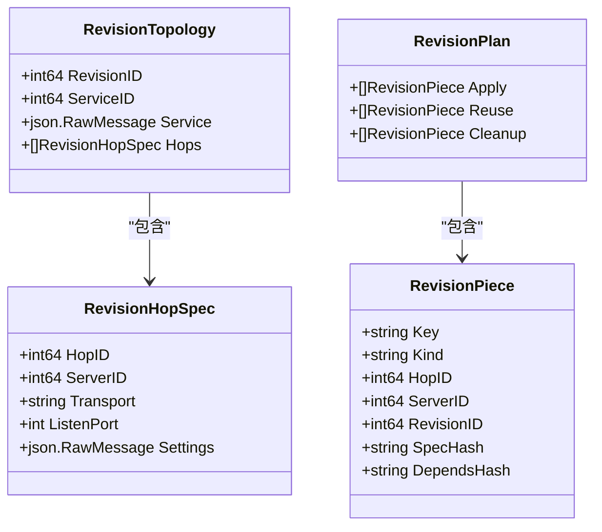

图表来源
- [src/backend/internal/dispatch/revision_plan.go:18-49](file://src/backend/internal/dispatch/revision_plan.go#L18-L49)
- [src/backend/internal/dispatch/revision_plan.go:51-92](file://src/backend/internal/dispatch/revision_plan.go#L51-L92)

章节来源
- [src/backend/internal/dispatch/revision_plan.go:51-92](file://src/backend/internal/dispatch/revision_plan.go#L51-L92)

### 典型场景数据路径

#### 服务器添加
- 流程要点：
  - 面板校验并插入服务器记录，生成 bootstrap token 与安装命令。
  - Agent 首次连接完成 session.open/ready，建立长连接。
  - 后续命令（升级、卸载等）经队列投递。

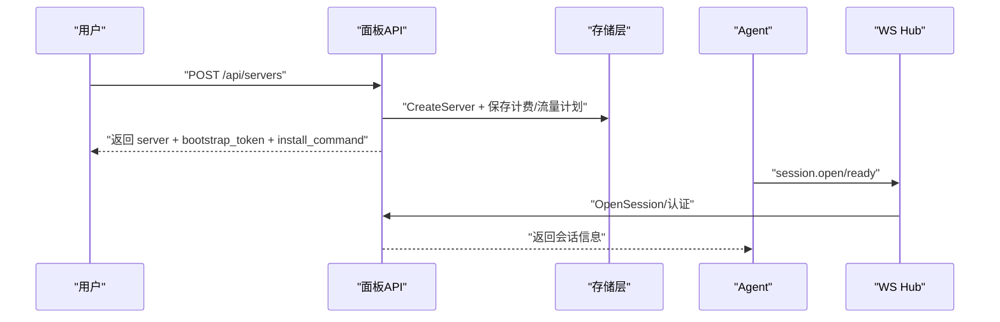

图表来源
- [src/backend/internal/panel/servers.go:208-319](file://src/backend/internal/panel/servers.go#L208-L319)
- [src/agent/cmd/agent/main.go:137-256](file://src/agent/cmd/agent/main.go#L137-L256)

章节来源
- [src/backend/internal/panel/servers.go:208-319](file://src/backend/internal/panel/servers.go#L208-L319)
- [src/agent/cmd/agent/main.go:137-256](file://src/agent/cmd/agent/main.go#L137-L256)

#### 节点配置（apply_node）
- 流程要点：
  - 面板构建 VirtualConfig，持久化 nodes.config_template。
  - 入队 apply_node，Agent 填充模板，写 config.json，上报 RealizedConfig。
  - 成功后节点状态 active，可用于订阅与流量统计。

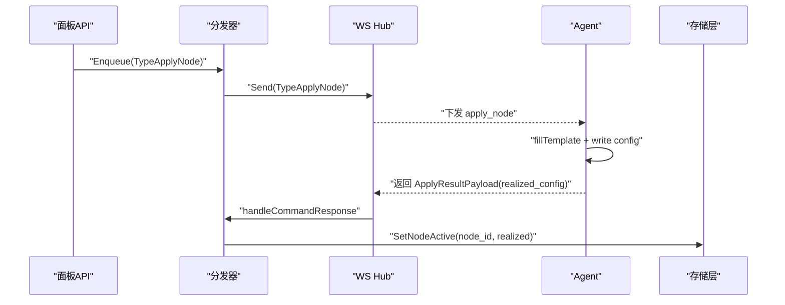

图表来源
- [src/backend/internal/panel/chains.go:304-332](file://src/backend/internal/panel/chains.go#L304-L332)
- [src/backend/internal/dispatch/dispatcher.go:625-730](file://src/backend/internal/dispatch/dispatcher.go#L625-L730)
- [src/agent/cmd/agent/main.go:559-601](file://src/agent/cmd/agent/main.go#L559-L601)

章节来源
- [src/backend/internal/panel/chains.go:304-332](file://src/backend/internal/panel/chains.go#L304-L332)
- [src/backend/internal/dispatch/dispatcher.go:625-730](file://src/backend/internal/dispatch/dispatcher.go#L625-L730)
- [src/agent/cmd/agent/main.go:559-601](file://src/agent/cmd/agent/main.go#L559-L601)

#### 用户管理（add_user/remove_user）
- 流程要点：
  - add_user/remove_user 载荷携带 Nodes 映射（tag→UserNodeParams）。
  - Agent 按 tag 匹配 inbound，增删 users/accounts 条目，无需重启。
  - 回执不触碰节点状态机（NodeID=0），仅更新配置。

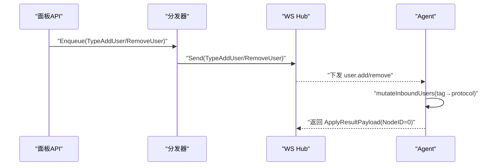

图表来源
- [src/shared/messages.go:156-178](file://src/shared/messages.go#L156-L178)
- [src/agent/internal/xray/config.go:83-114](file://src/agent/internal/xray/config.go#L83-L114)
- [src/agent/cmd/agent/main.go:602-626](file://src/agent/cmd/agent/main.go#L602-L626)

章节来源
- [src/shared/messages.go:156-178](file://src/shared/messages.go#L156-L178)
- [src/agent/internal/xray/config.go:83-114](file://src/agent/internal/xray/config.go#L83-L114)
- [src/agent/cmd/agent/main.go:602-626](file://src/agent/cmd/agent/main.go#L602-L626)

### 状态转换图（节点与命令）
- 节点状态机：pending → applying → active | failed。
- 命令状态机：queued → sent → acked | failed（abandoned 用于失效场景）。

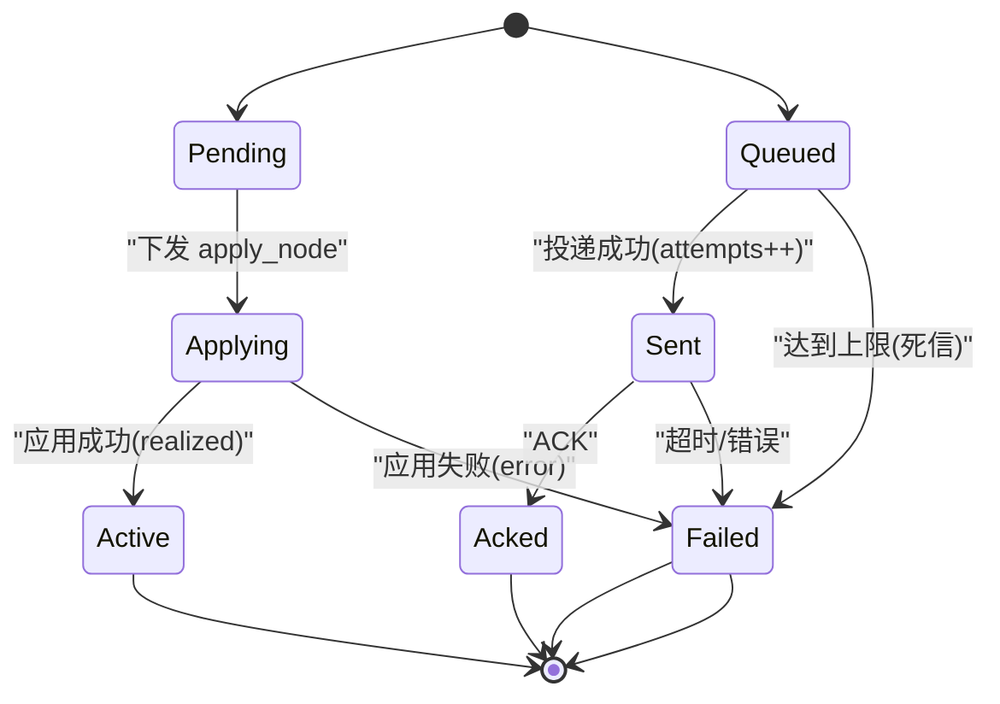

图表来源
- [src/backend/internal/store/nodes.go:12-18](file://src/backend/internal/store/nodes.go#L12-L18)
- [src/backend/internal/store/commands.go:11-18](file://src/backend/internal/store/commands.go#L11-L18)

章节来源
- [src/backend/internal/store/nodes.go:12-18](file://src/backend/internal/store/nodes.go#L12-L18)
- [src/backend/internal/store/commands.go:11-18](file://src/backend/internal/store/commands.go#L11-L18)

## 依赖关系分析
- 面板依赖 store 与 dispatch，dispatch 依赖 ws.Hub 与 store。
- Agent 依赖 xray.Manager 与 shared 协议。
- 遥测与漂移通过 WS 通道与 dispatcher 解耦。

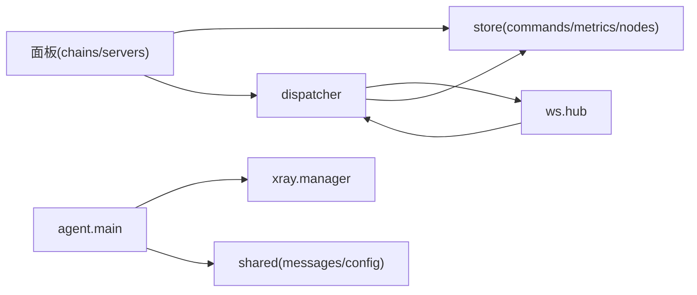

图表来源
- [src/backend/internal/panel/chains.go:154-171](file://src/backend/internal/panel/chains.go#L154-L171)
- [src/backend/internal/dispatch/dispatcher.go:24-48](file://src/backend/internal/dispatch/dispatcher.go#L24-L48)
- [src/backend/internal/ws/hub.go:24-54](file://src/backend/internal/ws/hub.go#L24-L54)
- [src/agent/cmd/agent/main.go:33-98](file://src/agent/cmd/agent/main.go#L33-L98)

章节来源
- [src/backend/internal/panel/chains.go:154-171](file://src/backend/internal/panel/chains.go#L154-L171)
- [src/backend/internal/dispatch/dispatcher.go:24-48](file://src/backend/internal/dispatch/dispatcher.go#L24-L48)
- [src/backend/internal/ws/hub.go:24-54](file://src/backend/internal/ws/hub.go#L24-L54)
- [src/agent/cmd/agent/main.go:33-98](file://src/agent/cmd/agent/main.go#L33-L98)

## 性能考量
- 命令队列：每服务器独立锁避免并发重复 Flush；发送缓冲满视为慢连接断开，重连后补发。
- 遥测：仅上报增量与绝对计数器，后端按游标去重与累加，降低带宽与存储压力。
- 配置填充：模板原样写入，避免复杂解析；dest 预检带超时与白名单回退，减少失败重试。
- 修订规划：内容寻址复用不变 piece，减少不必要下发与重启。

## 故障排查指南
- 命令失败：
  - 查看命令最近日志（RecentCommands），关注 status/attempts/error。
  - 死信命令会被标记 failed，需人工介入或重试。
- 节点失败：
  - SetNodeFailed 记录 error 详情；死信路径也会置 failed 并告警。
- 漂移问题：
  - 观察 ConfigDrift 标志与 drift_report；必要时触发 repair_server。
- 遥测缺失：
  - 确认 session.ready 与 Ping/Pong；检查 EnsureTelemetryFeatures 是否启用 stats/policy。

章节来源
- [src/backend/internal/store/commands.go:139-167](file://src/backend/internal/store/commands.go#L139-L167)
- [src/backend/internal/dispatch/dispatcher.go:191-226](file://src/backend/internal/dispatch/dispatcher.go#L191-L226)
- [src/agent/internal/xray/manager.go:275-316](file://src/agent/internal/xray/manager.go#L275-L316)

## 结论
本设计通过虚拟配置模板、内容寻址修订、可靠命令队列与遥测闭环，实现了高可用、可观测、易运维的配置下发与链路编排。Agent 侧严格遵循“原样写入”原则，保障配置透明与可追溯；后端通过漂移检测与自动修复提升鲁棒性。典型场景（服务器添加、节点配置、用户管理）均具备清晰的数据路径与状态机，便于扩展与维护。

## 附录
- 关键常量与类型参考：
  - 协议与传输：Protocol*/Network*
  - 占位符：PlaceholderPort/PlaceholderClients/PlaceholderRealityPrivateKey/PlaceholderVLessDecryption/PlaceholderTag
  - 消息类型：TypeApplyNode/TypeApplyChainHop/TypeTelemetry/TypeDriftReport 等

章节来源
- [src/shared/config.go:13-48](file://src/shared/config.go#L13-L48)
- [src/shared/config.go:149-186](file://src/shared/config.go#L149-L186)
- [src/shared/messages.go:73-91](file://src/shared/messages.go#L73-L91)