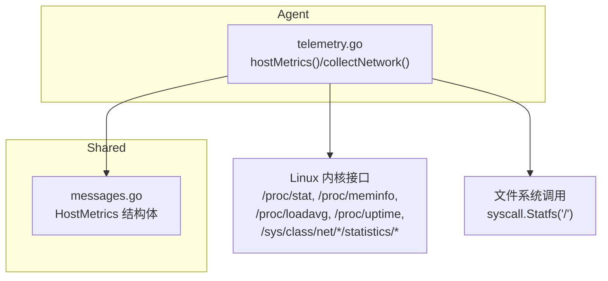
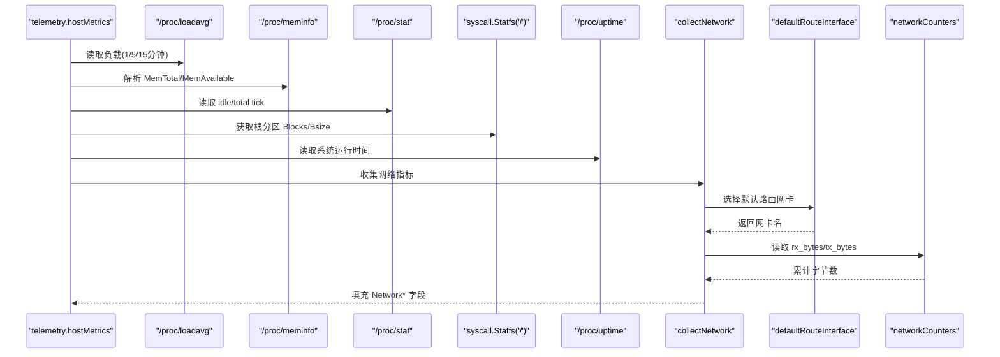
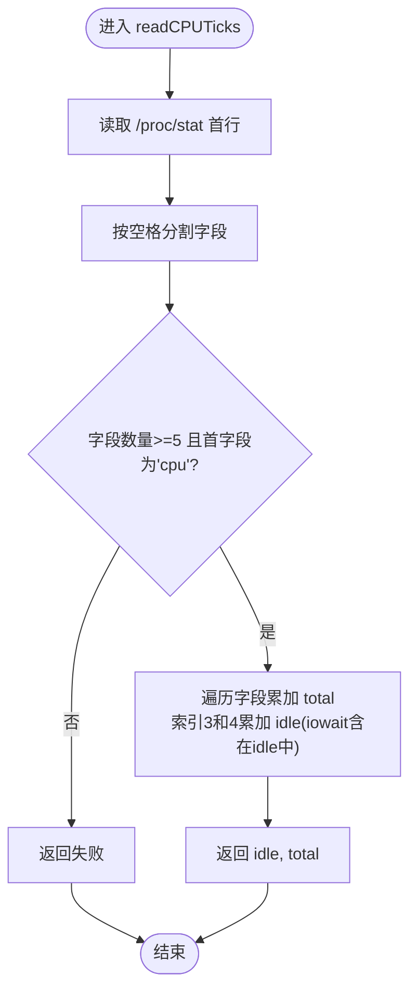
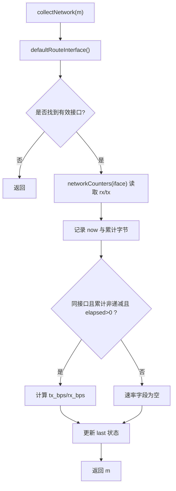
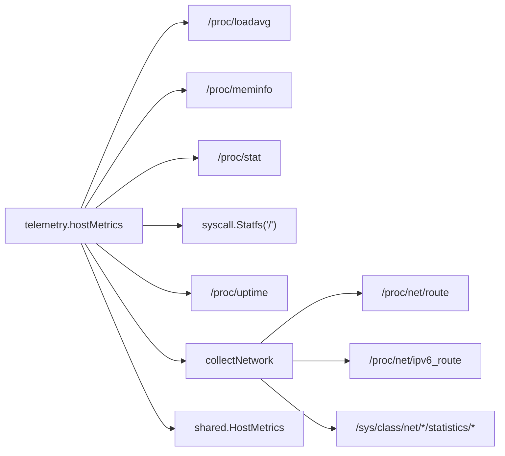

# 主机指标采集

<cite>
**本文引用的文件**   
- [telemetry.go](file://src/agent/cmd/agent/telemetry.go)
- [messages.go](file://src/shared/messages.go)
</cite>

## 目录
1. [简介](#简介)
2. [项目结构](#项目结构)
3. [核心组件](#核心组件)
4. [架构总览](#架构总览)
5. [详细组件分析](#详细组件分析)
6. [依赖关系分析](#依赖关系分析)
7. [性能考量](#性能考量)
8. [故障排查指南](#故障排查指南)
9. [结论](#结论)
10. [附录：字段定义与数据格式](#附录字段定义与数据格式)

## 简介
本文件面向“主机指标采集”的实现，系统性说明 CPU 使用率、内存监控、磁盘统计、网络接口检测、系统运行时间以及网络速率计算的实现逻辑与数据来源。所有计算均基于 Linux 内核暴露的 /proc 与 sysfs 接口，并通过 syscall.Statfs 获取根分区容量信息。文档同时给出 HostMetrics 数据结构字段定义与单位说明，便于上层消费与展示。

## 项目结构
- Agent 侧遥测模块负责周期性采集主机指标并上报。
- shared 包定义 HostMetrics 等跨进程共享的数据结构，保证前后端/Agent-Backend 协议一致。

图表来源 
- [telemetry.go:103-155](file://src/agent/cmd/agent/telemetry.go#L103-L155)
- [messages.go:206-222](file://src/shared/messages.go#L206-L222)

章节来源
- [telemetry.go:1-326](file://src/agent/cmd/agent/telemetry.go#L1-L326)
- [messages.go:206-222](file://src/shared/messages.go#L206-L222)

## 核心组件
- 遥测采集器 telemetry：维护上次采样状态（CPU tick、网络计数器、时间戳），周期性组装 HostMetrics。
- 主机指标 hostMetrics：读取负载、内存、CPU、磁盘、运行时间、网络接口与速率。
- 网络收集 collectNetwork：识别默认路由网卡，读取累计收发字节并计算速率。
- 共享结构 HostMetrics：承载所有主机指标字段及类型。

章节来源
- [telemetry.go:19-33](file://src/agent/cmd/agent/telemetry.go#L19-L33)
- [telemetry.go:103-155](file://src/agent/cmd/agent/telemetry.go#L103-L155)
- [telemetry.go:157-184](file://src/agent/cmd/agent/telemetry.go#L157-L184)
- [messages.go:206-222](file://src/shared/messages.go#L206-L222)

## 架构总览
下图展示了从内核接口到 HostMetrics 的数据流，以及关键函数之间的调用关系。

图表来源 
- [telemetry.go:103-155](file://src/agent/cmd/agent/telemetry.go#L103-L155)
- [telemetry.go:157-184](file://src/agent/cmd/agent/telemetry.go#L157-L184)
- [telemetry.go:186-213](file://src/agent/cmd/agent/telemetry.go#L186-L213)
- [telemetry.go:215-282](file://src/agent/cmd/agent/telemetry.go#L215-L282)
- [telemetry.go:284-296](file://src/agent/cmd/agent/telemetry.go#L284-L296)

## 详细组件分析

### CPU 使用率计算
- 数据来源：/proc/stat 首行 cpu 字段，包含 user、nice、system、idle、iowait、irq、softirq、steal 等计数。
- 算法要点：
  - 两次采样间隔内，计算 total 与 idle 的增量 dTotal、dIdle。
  - CPU 使用率 = (dTotal - dIdle) / dTotal × 100%。
  - 首次采样不输出百分比（保持为 nil），后续采样才计算。
- 复杂度：O(CPU 核数)，仅解析一行文本。
- 边界处理：若 total 未增长或解析失败则跳过计算。

图表来源 
- [telemetry.go:298-320](file://src/agent/cmd/agent/telemetry.go#L298-L320)

章节来源
- [telemetry.go:135-143](file://src/agent/cmd/agent/telemetry.go#L135-L143)
- [telemetry.go:298-320](file://src/agent/cmd/agent/telemetry.go#L298-L320)

### 内存监控
- 数据来源：/proc/meminfo 中的 MemTotal 与 MemAvailable（单位为 kB）。
- 计算逻辑：
  - 将 kB 转换为字节（乘以 1024）后填入 MemTotal。
  - MemUsed = MemTotal - MemAvailable（仅在 MemTotal > MemAvailable 时设置）。
- 复杂度：逐行扫描 meminfo，线性于行数。

章节来源
- [telemetry.go:113-134](file://src/agent/cmd/agent/telemetry.go#L113-L134)

### 磁盘统计
- 数据来源：syscall.Statfs("/") 获取根分区的 Blocks 与 Bsize。
- 计算逻辑：
  - DiskTotal = Blocks × Bsize
  - Free = Bfree × Bsize
  - DiskUsed = DiskTotal - Free（当 DiskTotal >= Free）
- 返回值：成功时返回 total、used 与 ok=true；否则返回零值与 false。

章节来源
- [telemetry.go:186-197](file://src/agent/cmd/agent/telemetry.go#L186-L197)

### 网络接口检测与速率计算
- 默认路由接口选择：
  - 优先 IPv4：解析 /proc/net/route，筛选目标为 0.0.0.0（十六进制 00000000）、标志位包含 UP、metric 最小的接口。
  - 回退 IPv6：解析 /proc/net/ipv6_route，筛选全零前缀与掩码 00 的默认路由条目。
  - 过滤虚拟接口：忽略 lo 以及以 docker、veth、br-、virbr、tun、tap 开头的名称。
- 累计字节读取：
  - 从 /sys/class/net/<iface>/statistics/rx_bytes 与 tx_bytes 读取开机以来的累计字节。
- 速率计算：
  - 记录上次采样时间与累计字节，本次采样时计算 elapsed 秒差。
  - 若同一接口且累计值非递减，则 tx_bps = Δtx / elapsed，rx_bps = Δrx / elapsed。
  - 首次或异常情况下速率字段为空（nil）。

图表来源 
- [telemetry.go:157-184](file://src/agent/cmd/agent/telemetry.go#L157-L184)
- [telemetry.go:215-282](file://src/agent/cmd/agent/telemetry.go#L215-L282)
- [telemetry.go:284-296](file://src/agent/cmd/agent/telemetry.go#L284-L296)

章节来源
- [telemetry.go:157-184](file://src/agent/cmd/agent/telemetry.go#L157-L184)
- [telemetry.go:215-282](file://src/agent/cmd/agent/telemetry.go#L215-L282)
- [telemetry.go:284-296](file://src/agent/cmd/agent/telemetry.go#L284-L296)

### 系统运行时间
- 数据来源：/proc/uptime 第一个字段（秒，浮点）。
- 转换：取整为 uint64 秒。

章节来源
- [telemetry.go:199-213](file://src/agent/cmd/agent/telemetry.go#L199-L213)

## 依赖关系分析
- telemetry.hostMetrics 依赖：
  - /proc/loadavg：负载
  - /proc/meminfo：内存总量与可用量
  - /proc/stat：CPU tick
  - syscall.Statfs：根分区容量
  - /proc/uptime：运行时间
  - /proc/net/route 与 /proc/net/ipv6_route：默认路由接口
  - /sys/class/net/*/statistics/*：网络累计字节
- 数据结构依赖：shared.HostMetrics 作为统一输出载体。

图表来源 
- [telemetry.go:103-155](file://src/agent/cmd/agent/telemetry.go#L103-L155)
- [telemetry.go:157-184](file://src/agent/cmd/agent/telemetry.go#L157-L184)
- [telemetry.go:215-296](file://src/agent/cmd/agent/telemetry.go#L215-L296)
- [messages.go:206-222](file://src/shared/messages.go#L206-L222)

章节来源
- [telemetry.go:103-155](file://src/agent/cmd/agent/telemetry.go#L103-L155)
- [messages.go:206-222](file://src/shared/messages.go#L206-L222)

## 性能考量
- CPU 使用率：每次采样需解析 /proc/stat 首行，时间复杂度 O(CPU 核数)，开销极低。
- 内存监控：逐行扫描 /proc/meminfo，I/O 开销可控。
- 磁盘统计：单次 syscall.Statfs 调用，成本很低。
- 网络速率：需要两次采样才能计算速率，避免抖动；对 /sys/class/net 的读取为轻量 I/O。
- 建议：
  - 合理设置采样间隔（默认 60 秒），平衡精度与开销。
  - 在容器环境中确认 /proc 与 /sys 挂载权限。

[本节为通用指导，不直接分析具体文件]

## 故障排查指南
- CPU 使用率为空：
  - 检查是否为首次采样（预期为空）。
  - 确认 /proc/stat 可读且首行为 cpu。
- 内存使用量为空：
  - 检查 /proc/meminfo 是否存在 MemTotal 与 MemAvailable。
- 磁盘统计为空：
  - 确认 root 路径可访问，syscall.Statfs 成功。
- 网络接口为空或速率为空：
  - 检查 /proc/net/route 与 /proc/net/ipv6_route 是否存在默认路由。
  - 确认网卡未被 ignoredNetworkInterface 过滤（如 docker/veth/br-/virbr/tun/tap）。
  - 确认 /sys/class/net/<iface>/statistics/rx_bytes、tx_bytes 可读。
- 运行时间为空：
  - 检查 /proc/uptime 可读且首个字段合法。

章节来源
- [telemetry.go:135-143](file://src/agent/cmd/agent/telemetry.go#L135-L143)
- [telemetry.go:186-197](file://src/agent/cmd/agent/telemetry.go#L186-L197)
- [telemetry.go:215-282](file://src/agent/cmd/agent/telemetry.go#L215-L282)
- [telemetry.go:284-296](file://src/agent/cmd/agent/telemetry.go#L284-L296)
- [telemetry.go:199-213](file://src/agent/cmd/agent/telemetry.go#L199-L213)

## 结论
该实现通过标准 Linux 接口完成主机指标的可靠采集：CPU 使用率采用双采样区间法，内存使用量基于 MemTotal/MemAvailable 推导，磁盘统计使用 Statfs 获取根分区容量，网络接口自动识别默认路由并过滤虚拟接口，速率基于累计字节差分计算。HostMetrics 提供统一的字段定义，便于上层展示与分析。

[本节为总结性内容，不直接分析具体文件]

## 附录：字段定义与数据格式
- 负载
  - load1：1 分钟平均负载（float64）
  - load5：5 分钟平均负载（float64）
  - load15：15 分钟平均负载（float64）
- CPU
  - cpu_percent：采样区间 CPU 使用率百分比（float64 指针，首次为空）
- 内存（单位：字节）
  - mem_total：总内存
  - mem_used：已用内存（mem_total - mem_available）
- 磁盘（单位：字节）
  - disk_total：根分区总容量
  - disk_used：根分区已用空间
- 网络
  - network_interface：默认路由出口网卡名（字符串）
  - network_tx_bytes：开机以来累计上传字节（uint64）
  - network_rx_bytes：开机以来累计下载字节（uint64）
  - network_tx_bps：采样区间上传速率（B/s，float64 指针，首次或异常为空）
  - network_rx_bps：采样区间下载速率（B/s，float64 指针，首次或异常为空）
- 其他
  - uptime_seconds：系统运行时间（秒，uint64）
  - latency_ms：最近三次 WebSocket RTT 的中位数（毫秒，float64 指针）

章节来源
- [messages.go:206-222](file://src/shared/messages.go#L206-L222)