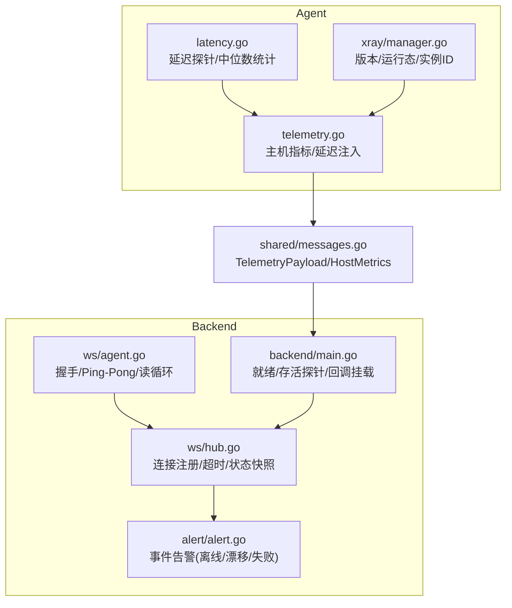
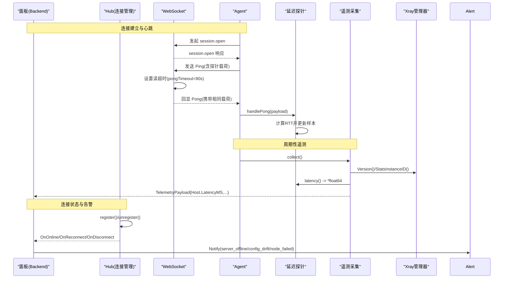
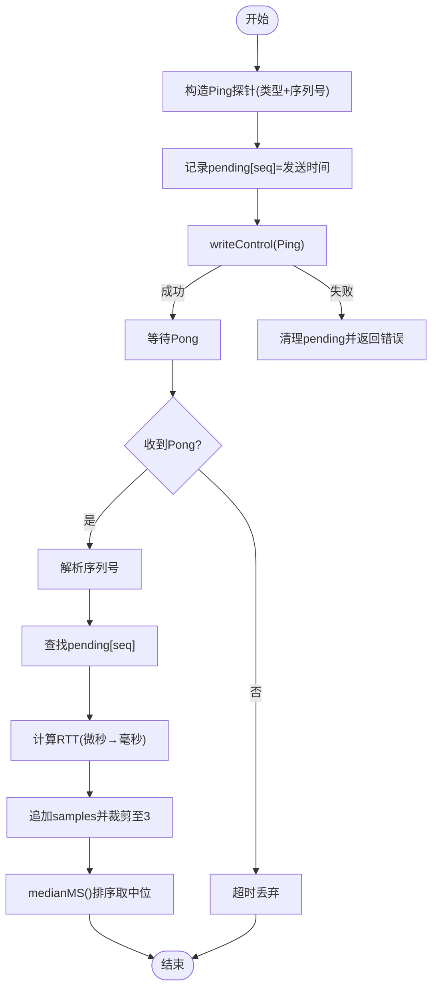
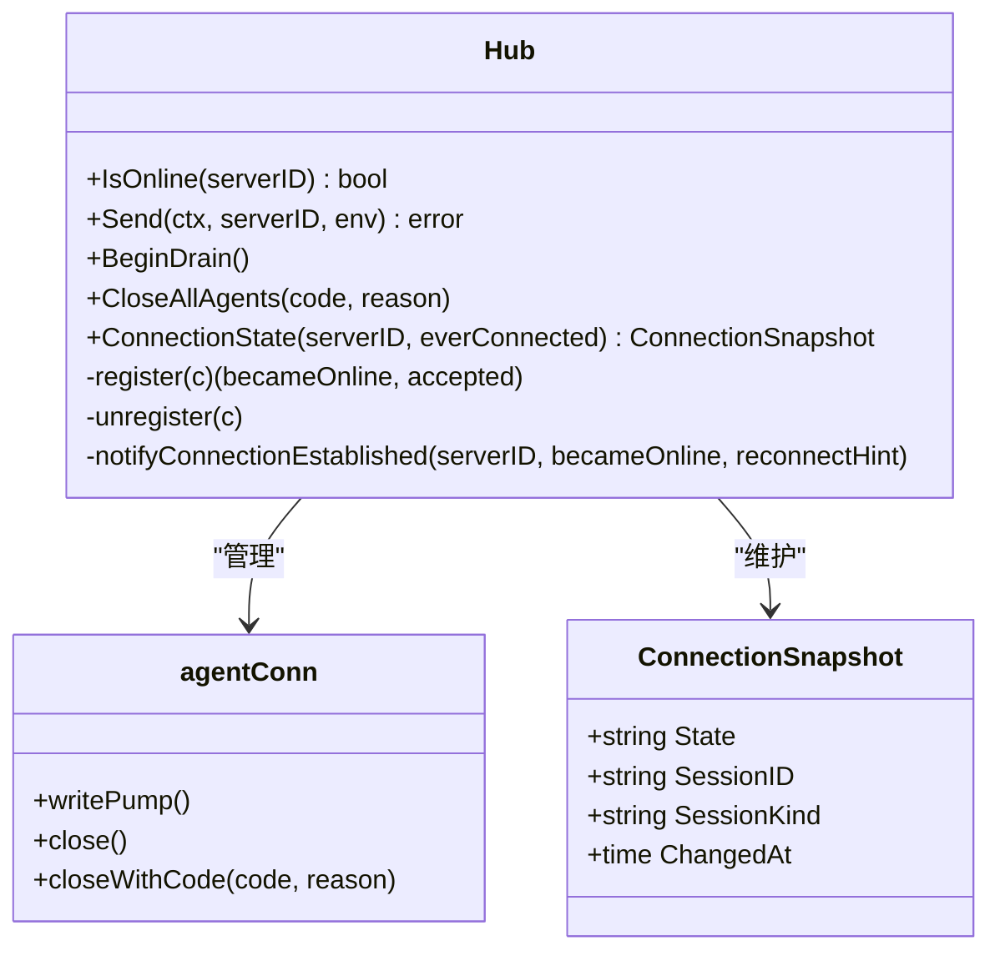
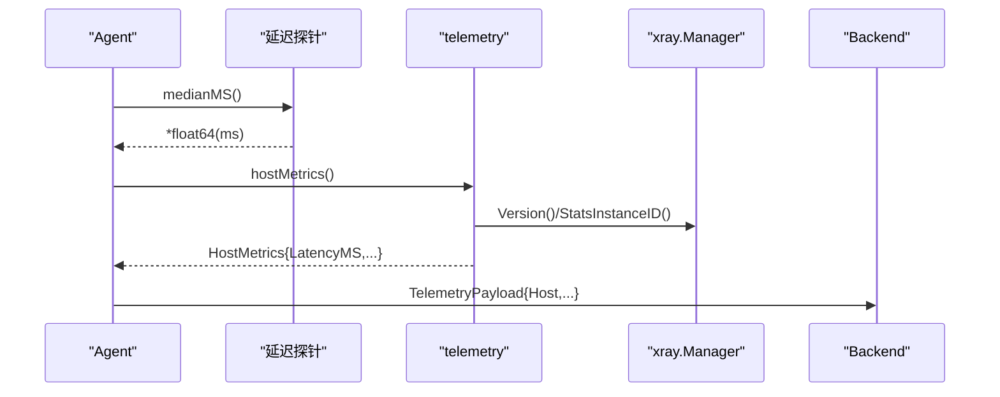
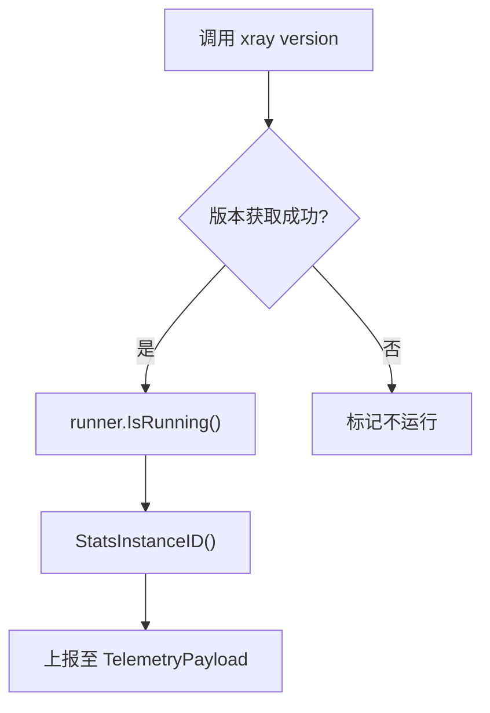
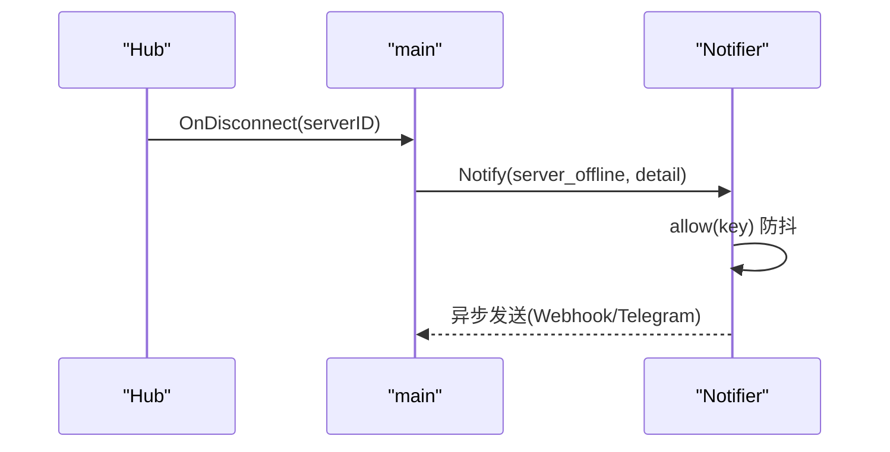
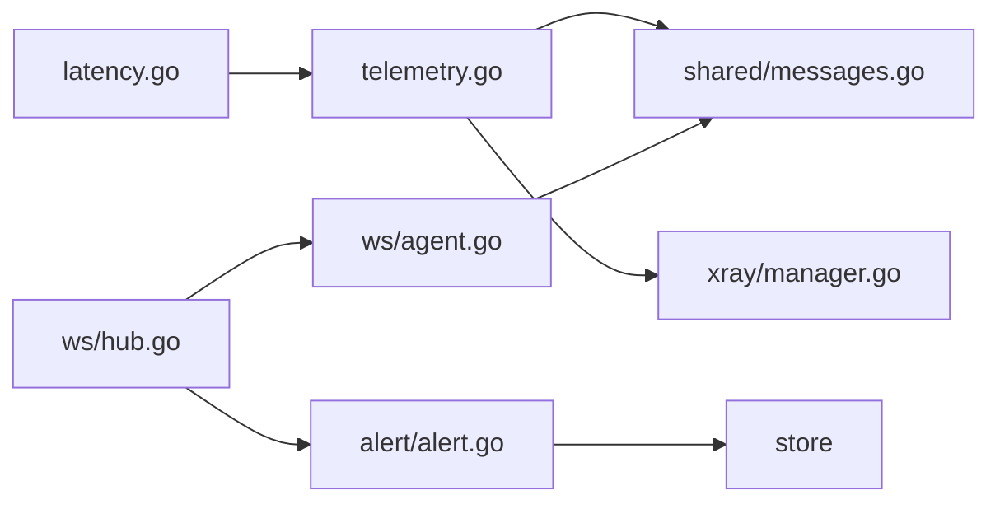

# 健康检查系统

<cite>
**本文引用的文件**   
- [latency.go](file://src/agent/cmd/agent/latency.go)
- [telemetry.go](file://src/agent/cmd/agent/telemetry.go)
- [hub.go](file://src/backend/internal/ws/hub.go)
- [agent.go](file://src/backend/internal/ws/agent.go)
- [messages.go](file://src/shared/messages.go)
- [manager.go](file://src/agent/internal/xray/manager.go)
- [alert.go](file://src/backend/internal/alert/alert.go)
- [main.go](file://src/backend/cmd/backend/main.go)
</cite>

## 目录
1. [简介](#简介)
2. [项目结构](#项目结构)
3. [核心组件](#核心组件)
4. [架构总览](#架构总览)
5. [详细组件分析](#详细组件分析)
6. [依赖关系分析](#依赖关系分析)
7. [性能考量](#性能考量)
8. [故障排查指南](#故障排查指南)
9. [结论](#结论)
10. [附录](#附录)

## 简介
本文件面向健康检查系统，覆盖以下目标：
- liveness 探测机制：Xray 进程状态检查、实例 ID 验证、服务可用性判断
- 延迟测量：latency 函数实现、网络延迟测试、测量精度控制
- 连接状态维护：WebSocket 连接健康检查、心跳机制、重连策略
- HostMetrics.LatencyMS 字段更新逻辑与延迟数据上报流程
- 健康检查触发时机、失败处理、告警机制与恢复策略
- 健康状态定义与诊断方法

## 项目结构
健康检查相关代码分布在 Agent 端（延迟测量与遥测）、Backend 端（WS 连接管理、生命周期与告警）以及共享协议类型。

图表来源
- [latency.go:1-114](file://src/agent/cmd/agent/latency.go#L1-L114)
- [telemetry.go:1-326](file://src/agent/cmd/agent/telemetry.go#L1-L326)
- [manager.go:86-109](file://src/agent/internal/xray/manager.go#L86-L109)
- [hub.go:1-413](file://src/backend/internal/ws/hub.go#L1-L413)
- [agent.go:1-359](file://src/backend/internal/ws/agent.go#L1-L359)
- [messages.go:195-222](file://src/shared/messages.go#L195-L222)
- [alert.go:1-253](file://src/backend/internal/alert/alert.go#L1-L253)
- [main.go:384-432](file://src/backend/cmd/backend/main.go#L384-L432)

章节来源
- [latency.go:1-114](file://src/agent/cmd/agent/latency.go#L1-L114)
- [telemetry.go:103-155](file://src/agent/cmd/agent/telemetry.go#L103-L155)
- [hub.go:16-24](file://src/backend/internal/ws/hub.go#L16-L24)
- [agent.go:102-111](file://src/backend/internal/ws/agent.go#L102-L111)
- [messages.go:195-222](file://src/shared/messages.go#L195-L222)

## 核心组件
- 延迟探针与中位数统计（Agent）
  - 使用 WebSocket Ping/Pong 控制帧发送探针，记录序列号与时间戳，收到 Pong 后计算 RTT（微秒转毫秒），保留最近 3 个样本并求中位数。
- 遥测采集与 HostMetrics 注入（Agent）
  - 周期采集 /proc 负载、内存、CPU、磁盘、网络接口与速率；通过注入的 latency 函数获取 LatencyMS，并随 TelemetryPayload 上报。
- Xray 进程健康与实例标识（Agent）
  - 调用 xray version 获取版本，结合 runner.IsRunning 判定运行态；StatsInstanceID 提供跨重启稳定的实例标识用于绝对流量计数。
- WS 连接健康与心跳（Backend）
  - Agent 主动 Ping，Panel 原样 Pong 并续期读超时；90s 无消息即判死连接；写超时 10s；发送队列满则断开并重连补发。
- 连接状态机与快照（Backend）
  - 维护 online/offline/reconnecting/never_connected 等状态快照，区分首次上线与重连，触发 OnOnline/OnReconnect/OnDisconnect。
- 告警与事件（Backend）
  - 基于 Hub 注销路径触发 server_offline 事件，支持 Webhook/Telegram 双通道异步推送，含防抖窗口。

章节来源
- [latency.go:18-97](file://src/agent/cmd/agent/latency.go#L18-L97)
- [telemetry.go:103-155](file://src/agent/cmd/agent/telemetry.go#L103-L155)
- [manager.go:86-109](file://src/agent/internal/xray/manager.go#L86-L109)
- [hub.go:16-24](file://src/backend/internal/ws/hub.go#L16-L24)
- [agent.go:102-111](file://src/backend/internal/ws/agent.go#L102-L111)
- [alert.go:19-28](file://src/backend/internal/alert/alert.go#L19-L28)

## 架构总览
健康检查贯穿“Agent 侧探针 + 遥测”和“Backend 侧 WS 心跳 + 状态机 + 告警”。

图表来源
- [agent.go:88-130](file://src/backend/internal/ws/agent.go#L88-L130)
- [agent.go:102-111](file://src/backend/internal/ws/agent.go#L102-L111)
- [latency.go:36-85](file://src/agent/cmd/agent/latency.go#L36-L85)
- [telemetry.go:35-45](file://src/agent/cmd/agent/telemetry.go#L35-L45)
- [manager.go:86-109](file://src/agent/internal/xray/manager.go#L86-L109)
- [hub.go:230-279](file://src/backend/internal/ws/hub.go#L230-L279)
- [alert.go:106-133](file://src/backend/internal/alert/alert.go#L106-L133)

## 详细组件分析

### 延迟测量与精度控制
- 探针发送
  - 使用 WebSocket PingMessage 控制帧，payload[0] 为探针类型，payload[1:] 为大端序序列号。
  - 发送前将 sequence 与当前时间写入 pending 表，清理过期项（超过 3 个序列号的旧项）。
- Pong 处理
  - 校验 payload 长度与类型，解析 sequence，查找 pending 中的发送时间，计算 RTT（微秒→毫秒），追加到 samples，保持最近 3 个样本。
  - 首个成功样本时关闭 ready 通道，供上层等待首次可用。
- 中位数计算
  - 对 samples 排序取中间值，返回指针；若未启用或无样本则返回 nil。
- 精度控制
  - 以微秒计时，最终输出毫秒；仅保留最近 3 次样本，降低抖动影响。

图表来源
- [latency.go:36-85](file://src/agent/cmd/agent/latency.go#L36-L85)
- [latency.go:87-97](file://src/agent/cmd/agent/latency.go#L87-L97)

章节来源
- [latency.go:12-16](file://src/agent/cmd/agent/latency.go#L12-L16)
- [latency.go:36-85](file://src/agent/cmd/agent/latency.go#L36-L85)
- [latency.go:87-97](file://src/agent/cmd/agent/latency.go#L87-L97)

### 连接状态维护与心跳机制
- 心跳与超时
  - Agent 每 30s 发送 Ping；Panel 设置读超时 90s，任何消息到达均续期；90s 无消息视为连接死亡。
  - 写超时 10s，单次写失败即关闭连接。
- 连接注册与状态快照
  - register() 登记连接，如已有旧连接则踢掉；states 保存 state/session_id/session_kind/changed_at。
  - unregister() 移除连接并置 offline，仅在非 draining 时触发 OnDisconnect。
- 重连策略
  - 当 auth.Reconnect=true，sessionKind=Reconnect，connectionState=Reconnecting；首次上线触发 OnOnline，重连触发 OnReconnect。
  - 发送队列满（sendBuffer=256）视为慢连接，直接断开，重连后由命令补发机制补齐。

图表来源
- [hub.go:26-55](file://src/backend/internal/ws/hub.go#L26-L55)
- [hub.go:76-100](file://src/backend/internal/ws/hub.go#L76-L100)
- [hub.go:230-279](file://src/backend/internal/ws/hub.go#L230-L279)
- [agent.go:102-111](file://src/backend/internal/ws/agent.go#L102-L111)

章节来源
- [hub.go:16-24](file://src/backend/internal/ws/hub.go#L16-L24)
- [hub.go:230-279](file://src/backend/internal/ws/hub.go#L230-L279)
- [agent.go:102-111](file://src/backend/internal/ws/agent.go#L102-L111)

### HostMetrics.LatencyMS 更新与上报流程
- 更新逻辑
  - telemetry.hostMetrics() 在每次采集时调用 t.latency()，该函数来自延迟探针的中位数计算，返回 *float64（毫秒）。
  - 若 latency 函数不可用或未启用，则 LatencyMS 为空。
- 上报流程
  - telemetry.collect() 组装 TelemetryPayload，包含 XrayVersion/XrayRunning/XrayInstanceID/Host/Traffic。
  - 通过 WS 上行上报给 Backend，后端持久化并展示。

图表来源
- [telemetry.go:103-155](file://src/agent/cmd/agent/telemetry.go#L103-L155)
- [telemetry.go:35-45](file://src/agent/cmd/agent/telemetry.go#L35-L45)
- [messages.go:195-222](file://src/shared/messages.go#L195-L222)

章节来源
- [telemetry.go:103-155](file://src/agent/cmd/agent/telemetry.go#L103-L155)
- [messages.go:195-222](file://src/shared/messages.go#L195-L222)

### liveness 探测与 Xray 进程健康
- Xray 版本与运行态
  - Manager.Version() 执行 xray version 获取版本字符串，并结合 runner.IsRunning(context) 判定是否运行。
- 实例 ID 验证
  - Manager.StatsInstanceID() 从 runner 获取稳定标识，用于绝对流量计数器关联，重启后变化。
- 服务可用性判断
  - Backend 暴露 /healthz 与 /readyz：/healthz 简单返回 ok；/readyz 检查面板生命周期与存储 Ping，失败则标记 not_ready。

图表来源
- [manager.go:86-109](file://src/agent/internal/xray/manager.go#L86-L109)
- [main.go:384-432](file://src/backend/cmd/backend/main.go#L384-L432)

章节来源
- [manager.go:86-109](file://src/agent/internal/xray/manager.go#L86-L109)
- [main.go:384-432](file://src/backend/cmd/backend/main.go#L384-L432)

### 告警机制与恢复策略
- 触发时机
  - Hub.unregister() 在非 draining 状态下触发 OnDisconnect，主程序挂载 alert.Notify("server_offline")。
  - 其他事件（配置漂移、节点失败）在 dispatcher 处理点触发。
- 防抖与通道
  - 默认防抖窗口 5 分钟，同一服务器同一事件不重复发送；支持 Webhook 与 Telegram 双通道异步推送。
- 恢复策略
  - 重连场景：auth.Reconnect=true 时，OnReconnect 被调用，不伪造 offline→online 跃迁；连接成功后可继续业务。
  - 发送队列满：断开连接，重连后由命令补发机制补齐。

图表来源
- [hub.go:263-279](file://src/backend/internal/ws/hub.go#L263-L279)
- [alert.go:106-133](file://src/backend/internal/alert/alert.go#L106-L133)
- [main.go:281-314](file://src/backend/cmd/backend/main.go#L281-L314)

章节来源
- [alert.go:19-28](file://src/backend/internal/alert/alert.go#L19-L28)
- [alert.go:106-133](file://src/backend/internal/alert/alert.go#L106-L133)
- [main.go:281-314](file://src/backend/cmd/backend/main.go#L281-L314)

## 依赖关系分析
- Agent 侧
  - latencyTracker 依赖 gorilla/websocket 控制帧能力；telemetry 依赖 /proc 与 xray.Manager。
- Backend 侧
  - Hub 依赖 gorilla/websocket 与 shared 协议类型；alert 依赖 store 与外部请求器。
- 共享协议
  - TelemetryPayload/HostMetrics 定义 LatencyMS 字段语义与结构。

图表来源
- [latency.go:1-114](file://src/agent/cmd/agent/latency.go#L1-L114)
- [telemetry.go:1-326](file://src/agent/cmd/agent/telemetry.go#L1-L326)
- [messages.go:195-222](file://src/shared/messages.go#L195-L222)
- [manager.go:86-109](file://src/agent/internal/xray/manager.go#L86-L109)
- [hub.go:1-413](file://src/backend/internal/ws/hub.go#L1-L413)
- [agent.go:1-359](file://src/backend/internal/ws/agent.go#L1-L359)
- [alert.go:1-253](file://src/backend/internal/alert/alert.go#L1-L253)

章节来源
- [messages.go:195-222](file://src/shared/messages.go#L195-L222)
- [hub.go:1-413](file://src/backend/internal/ws/hub.go#L1-L413)
- [agent.go:1-359](file://src/backend/internal/ws/agent.go#L1-L359)

## 性能考量
- 延迟测量
  - 仅保留最近 3 个样本，避免内存增长；中位数抗抖动优于均值。
- WS 传输
  - 写超时 10s，读超时 90s；发送队列 256，满则断链重连，避免拥塞扩散。
- 遥测采集
  - CPU 使用率基于两次采样区间计算，首帧为 0；网络速率基于相邻采样间隔计算，忽略虚拟网卡。
- 告警
  - 异步发送，失败仅记日志；防抖窗口减少噪声。

[本节为通用指导，无需具体文件引用]

## 故障排查指南
- 连接频繁断开
  - 检查 Panel 的 pongTimeout（90s）与 Agent 的 Ping 频率（30s）是否匹配；查看 Hub 的 writeTimeout（10s）与 sendBuffer（256）是否导致慢连接断链。
- 延迟异常
  - 确认 latencyTracker.enabled 是否为 true；检查 Pong 载荷类型与长度；观察 samples 数量与中位数趋势。
- Xray 不运行
  - 调用 Manager.Version() 检查版本与运行态；确认 runner.IsRunning 返回值；查看 xray 二进制与配置文件权限。
- 告警风暴
  - 调整 LATTIX_ALERT_DEBOUNCE 环境变量增大防抖窗口；检查 Webhook/Telegram 配置是否正确。
- 就绪探针失败
  - /readyz 失败时检查生命周期状态与存储 Ping；查看 main.go 中 ready 转换记录。

章节来源
- [hub.go:16-24](file://src/backend/internal/ws/hub.go#L16-L24)
- [latency.go:99-106](file://src/agent/cmd/agent/latency.go#L99-L106)
- [manager.go:86-109](file://src/agent/internal/xray/manager.go#L86-L109)
- [alert.go:46-68](file://src/backend/internal/alert/alert.go#L46-L68)
- [main.go:384-432](file://src/backend/cmd/backend/main.go#L384-L432)

## 结论
健康检查系统通过 Agent 侧的延迟探针与遥测采集、Backend 侧的 WS 心跳与状态机、以及告警子系统，形成闭环监控。延迟测量采用中位数与短样本窗口提升稳定性；连接健康通过严格的超时与队列保护保障可靠性；告警具备防抖与多通道能力，便于运维快速定位与恢复。

[本节为总结性内容，无需具体文件引用]

## 附录
- 健康状态定义
  - ConnectionStateNeverConnected：从未连接过
  - ConnectionStateOffline：曾经在线但当前离线
  - ConnectionStateReconnecting：正在重连
  - ConnectionStateOnline：已在线
- 诊断要点
  - 查看 Hub.ConnectionState 快照与 IsOnline；检查 TelemetryPayload.Host.LatencyMS 趋势；关注 OnDisconnect/OnReconnect 回调日志。

章节来源
- [hub.go:76-100](file://src/backend/internal/ws/hub.go#L76-L100)
- [messages.go:195-222](file://src/shared/messages.go#L195-L222)