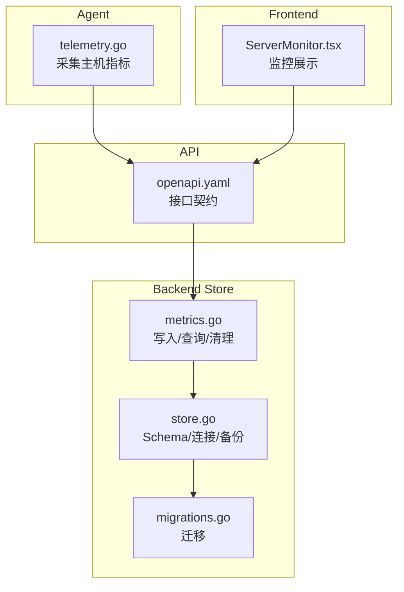
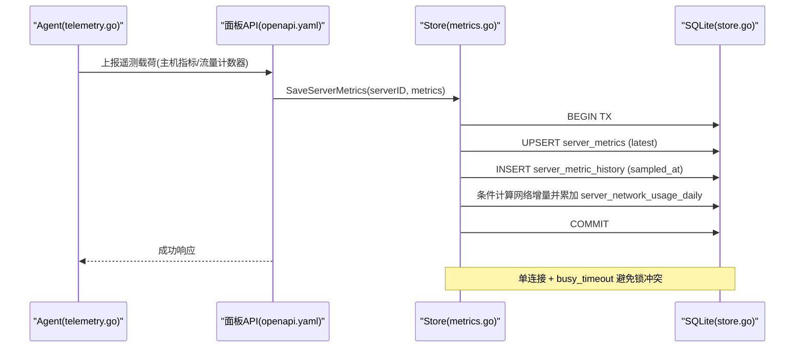
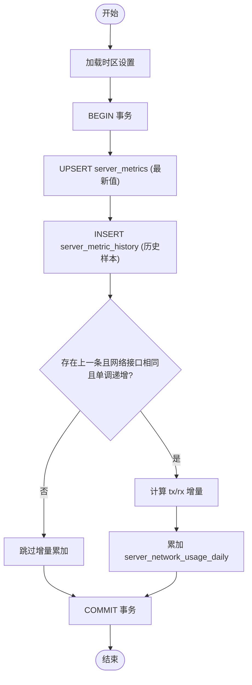

# 数据持久化

<cite>
**本文引用的文件**   
- [metrics.go](file://src/backend/internal/store/metrics.go)
- [store.go](file://src/backend/internal/store/store.go)
- [migrations.go](file://src/backend/internal/store/migrations.go)
- [telemetry.go](file://src/agent/cmd/agent/telemetry.go)
- [openapi.yaml](file://docs/openapi.yaml)
- [ServerMonitor.tsx](file://src/frontend/src/components/ServerMonitor.tsx)
</cite>

## 目录
1. [简介](#简介)
2. [项目结构](#项目结构)
3. [核心组件](#核心组件)
4. [架构总览](#架构总览)
5. [详细组件分析](#详细组件分析)
6. [依赖关系分析](#依赖关系分析)
7. [性能考虑](#性能考虑)
8. [故障排查指南](#故障排查指南)
9. [结论](#结论)
10. [附录：SQL 操作示例与调优建议](#附录sql-操作示例与调优建议)

## 简介
本文件围绕遥测数据的持久化进行系统化说明，重点覆盖 server_metrics 表结构与相关时序存储策略、写入流程（事务、并发安全、错误处理）、查询优化（时间范围、分组、聚合）、清理与备份恢复机制，并给出可操作的 SQL 示例与性能调优建议。读者无需深入代码即可理解整体设计与使用方式。

## 项目结构
后端通过 SQLite 提供持久化能力，指标采集由 Agent 侧完成，面板侧通过 API 暴露查询接口，前端用于可视化展示。关键文件职责如下：
- store.go：定义数据库 Schema（包含 server_metrics、server_metric_history、server_network_usage_daily、traffic 等），以及数据库连接、备份等基础设施。
- metrics.go：实现指标写入、历史样本查询、最近样本聚合、过期清理、流量累计与汇总等。
- migrations.go：负责 schema 版本管理与增量迁移，确保旧库平滑升级。
- telemetry.go：Agent 端采集主机指标（负载、CPU、内存、磁盘、网络、延迟）并组装上报载荷。
- openapi.yaml：对外 API 契约，包括获取指标历史与最近样本的接口定义。
- ServerMonitor.tsx：前端展示服务器监控详情与最近 24 小时趋势。

图表来源
- [store.go:18-356](file://src/backend/internal/store/store.go#L18-L356)
- [metrics.go:48-107](file://src/backend/internal/store/metrics.go#L48-L107)
- [migrations.go:18-52](file://src/backend/internal/store/migrations.go#L18-L52)
- [telemetry.go:35-53](file://src/agent/cmd/agent/telemetry.go#L35-L53)
- [openapi.yaml:48-64](file://docs/openapi.yaml#L48-L64)
- [ServerMonitor.tsx:698-712](file://src/frontend/src/components/ServerMonitor.tsx#L698-L712)

章节来源
- [store.go:18-356](file://src/backend/internal/store/store.go#L18-L356)
- [metrics.go:48-107](file://src/backend/internal/store/metrics.go#L48-L107)
- [migrations.go:18-52](file://src/backend/internal/store/migrations.go#L18-L52)
- [telemetry.go:35-53](file://src/agent/cmd/agent/telemetry.go#L35-L53)
- [openapi.yaml:48-64](file://docs/openapi.yaml#L48-L64)
- [ServerMonitor.tsx:698-712](file://src/frontend/src/components/ServerMonitor.tsx#L698-L712)

## 核心组件
- 数据模型与表结构
  - server_metrics：每台服务器最新指标快照（主键为 server_id）。
  - server_metric_history：时序历史样本（自增 id，按 server_id + sampled_at 索引）。
  - server_network_usage_daily：按日聚合的网络流量（server_id, usage_date 复合主键）。
  - traffic：节点维度与用户维度的流量累计（唯一约束 node_id+user_uuid）。
- 写入与更新
  - SaveServerMetrics：原子 upsert 最新值并插入历史样本；在满足条件时计算网络增量并累加到 daily 表。
  - AddTraffic：对节点或用户维度进行流量增量累加。
- 查询与聚合
  - ServerMetricsMap：返回所有服务器的最新指标映射。
  - RecentServerMetricSamples：按服务器取最近 N 个样本（窗口函数 ROW_NUMBER）。
  - ServerMetricHistory：按服务器和时间范围查询历史样本。
  - TrafficByNode / TrafficByUser / UserTraffic：流量合计查询。
- 清理与备份
  - DeleteExpiredServerMetricHistory：按保留期删除过期历史样本。
  - Backup：基于 VACUUM INTO 的一致性快照导出。

章节来源
- [store.go:173-214](file://src/backend/internal/store/store.go#L173-L214)
- [metrics.go:48-107](file://src/backend/internal/store/metrics.go#L48-L107)
- [metrics.go:142-190](file://src/backend/internal/store/metrics.go#L142-L190)
- [metrics.go:192-200](file://src/backend/internal/store/metrics.go#L192-L200)
- [metrics.go:202-275](file://src/backend/internal/store/metrics.go#L202-L275)
- [store.go:448-465](file://src/backend/internal/store/store.go#L448-L465)

## 架构总览
遥测数据从 Agent 采集，经面板 API 落库，前端通过 API 拉取并渲染。SQLite 单连接 + busy_timeout 保证并发写安全；Schema 初始化与迁移在启动阶段执行；备份通过 VACUUM INTO 生成一致性快照。

图表来源
- [telemetry.go:35-53](file://src/agent/cmd/agent/telemetry.go#L35-L53)
- [openapi.yaml:48-64](file://docs/openapi.yaml#L48-L64)
- [metrics.go:48-107](file://src/backend/internal/store/metrics.go#L48-L107)
- [store.go:368-389](file://src/backend/internal/store/store.go#L368-L389)

## 详细组件分析

### server_metrics 表结构
- 字段与类型
  - server_id：INTEGER 主键，外键关联 servers(id)。
  - load1/load5/load15：REAL，默认 0。
  - cpu_percent：REAL，可为空。
  - mem_total/mem_used/disk_total/disk_used：INTEGER，默认 0。
  - network_interface：TEXT，默认空串。
  - network_tx_bytes/network_rx_bytes：INTEGER，默认 0。
  - network_tx_bps/network_rx_bps：REAL，可为空。
  - uptime_seconds：INTEGER，默认 0。
  - latency_ms：REAL，可为空。
  - updated_at：DATETIME，默认 CURRENT_TIMESTAMP。
- 索引与约束
  - 主键：server_id（唯一）。
  - 外键：references servers(id)。
  - 非空与默认值：多数数值字段有 NOT NULL 与 DEFAULT 0。
- 设计要点
  - 以 server_id 作为“最新值”视图，便于快速读取当前状态。
  - 可选字段（cpu_percent、bps、latency_ms）支持部分上报场景。

章节来源
- [store.go:173-191](file://src/backend/internal/store/store.go#L173-L191)
- [migrations.go:122-144](file://src/backend/internal/store/migrations.go#L122-L144)

### 时序数据存储策略
- 数据点记录
  - server_metric_history：每条采样一行，包含全部指标字段与 sampled_at 时间戳，id 自增。
  - sampled_at 由数据库 CURRENT_TIMESTAMP 生成，保证一致性与高性能。
- 时间戳管理
  - 最新值更新时间戳为 updated_at（CURRENT_TIMESTAMP）。
  - 历史采样时间戳为 sampled_at（CURRENT_TIMESTAMP）。
- 历史数据保留策略
  - 通过 DeleteExpiredServerMetricHistory 按 retention 阈值删除 sampled_at 早于截止时间的记录。
  - 可按业务需求定时调度清理任务，控制存储空间增长。

章节来源
- [store.go:193-214](file://src/backend/internal/store/store.go#L193-L214)
- [metrics.go:192-200](file://src/backend/internal/store/metrics.go#L192-L200)

### 数据写入流程
- 批量插入
  - 当前实现为逐条 upsert 最新值与插入历史样本；如需更高吞吐，可在应用层批量化后分批提交。
- 事务处理
  - SaveServerMetrics 使用 BeginTx/Commit/Rollback 包裹 Upsert、历史插入与网络增量累加，保证原子性。
- 并发安全
  - SQLite 单连接 + busy_timeout(5000ms)，避免 database is locked。
  - 写入路径无复杂锁竞争，适合高并发读、中等并发写场景。
- 错误重试
  - 方法返回 error，调用方可根据错误类型决定是否重试（如网络 IO 异常）。
  - 对于幂等写入（upsert），重试是安全的。

图表来源
- [metrics.go:48-107](file://src/backend/internal/store/metrics.go#L48-L107)
- [store.go:368-389](file://src/backend/internal/store/store.go#L368-L389)

章节来源
- [metrics.go:48-107](file://src/backend/internal/store/metrics.go#L48-L107)
- [store.go:368-389](file://src/backend/internal/store/store.go#L368-L389)

### 数据查询优化
- 按时间范围查询
  - ServerMetricHistory：WHERE server_id=? AND sampled_at>=? ORDER BY sampled_at,id，利用索引 idx_server_metric_history_server_sampled。
- 按服务器分组
  - RecentServerMetricSamples：使用窗口函数 ROW_NUMBER() OVER(PARTITION BY server_id ORDER BY sampled_at DESC, id DESC) 取最近 limit 条。
- 聚合统计查询
  - server_network_usage_daily：按 server_id+usage_date 聚合每日流量，适合报表与配额统计。
  - traffic 表：按 node_id 或 user_uuid 聚合 up/down 总量。

章节来源
- [store.go:213-214](file://src/backend/internal/store/store.go#L213-L214)
- [metrics.go:142-190](file://src/backend/internal/store/metrics.go#L142-L190)
- [store.go:87-93](file://src/backend/internal/store/store.go#L87-L93)
- [store.go:222-275](file://src/backend/internal/store/store.go#L222-L275)

### 数据清理策略、存储空间管理与备份恢复
- 清理策略
  - DeleteExpiredServerMetricHistory：按 retention 删除过时历史样本，释放空间。
  - 建议定时任务（如每小时）执行，结合磁盘水位线触发。
- 存储空间管理
  - 定期 VACUUM 回收碎片（备份前可先 VACUUM 提升效率）。
  - 合理设置采样间隔与保留周期，平衡精度与容量。
- 备份恢复
  - Backup：VACUUM INTO 生成一致性快照，文件权限 0o600，确保敏感数据安全。
  - 恢复：将备份文件替换为当前数据库文件（需停机或停止写入进程）。

章节来源
- [metrics.go:192-200](file://src/backend/internal/store/metrics.go#L192-L200)
- [store.go:448-465](file://src/backend/internal/store/store.go#L448-L465)

## 依赖关系分析
- 模块耦合
  - metrics.go 依赖 store.go 提供的 db 连接与 Schema。
  - migrations.go 在启动阶段执行，确保表结构兼容。
  - telemetry.go 仅负责采集与组装载荷，不直接访问数据库。
- 外部依赖
  - SQLite（modernc.org/sqlite），单连接模式，busy_timeout 防锁。
- 潜在循环依赖
  - 无循环导入；Store 作为底层数据访问抽象，被上层逻辑调用。

图表来源
- [telemetry.go:35-53](file://src/agent/cmd/agent/telemetry.go#L35-L53)
- [openapi.yaml:48-64](file://docs/openapi.yaml#L48-L64)
- [metrics.go:48-107](file://src/backend/internal/store/metrics.go#L48-L107)
- [store.go:18-356](file://src/backend/internal/store/store.go#L18-L356)
- [migrations.go:18-52](file://src/backend/internal/store/migrations.go#L18-L52)

章节来源
- [store.go:368-389](file://src/backend/internal/store/store.go#L368-L389)
- [migrations.go:18-52](file://src/backend/internal/store/migrations.go#L18-L52)

## 性能考虑
- 写入性能
  - 单连接 SQLite 限制并发写，但 busy_timeout 降低锁冲突概率。
  - 建议在上层做批量化与合并（例如多服务器指标合并提交），减少事务次数。
- 查询性能
  - 充分利用索引 idx_server_metric_history_server_sampled。
  - 窗口函数查询最近样本时限制 limit，避免全表扫描。
- 存储增长
  - 合理设置采样间隔（默认 60s）与保留周期（如 24h/7d/30d 分层）。
  - 定期清理过期历史与 VACUUM 回收空间。
- 备份性能
  - VACUUM INTO 会占用额外空间与 CPU，建议在低峰期执行。

[本节为通用指导，不直接分析具体文件]

## 故障排查指南
- 常见问题
  - database is locked：检查是否有多连接写入；确认单连接配置与 busy_timeout。
  - 指标缺失：检查 Agent 上报频率与网络连通性；查看 API 日志。
  - 历史数据未清理：确认清理任务是否运行及 retention 参数是否正确。
- 定位手段
  - 查看最近样本与历史数据接口返回，验证数据完整性。
  - 检查备份文件权限与大小，确认备份成功。
  - 使用测试用例验证写入与清理逻辑（参考 metrics_test.go）。

章节来源
- [store.go:368-389](file://src/backend/internal/store/store.go#L368-L389)
- [metrics_test.go:9-55](file://src/backend/internal/store/metrics_test.go#L9-L55)
- [metrics_test.go:57-83](file://src/backend/internal/store/metrics_test.go#L57-L83)

## 结论
本项目采用 SQLite 作为遥测数据持久化方案，通过 server_metrics 与 server_metric_history 分离“最新值”和“时序历史”，配合 server_network_usage_daily 与 traffic 表实现多维统计。写入路径使用事务保证一致性，单连接与 busy_timeout 保障并发安全；查询通过索引与窗口函数优化；清理与备份机制完善，适合中小规模部署与运维场景。

[本节为总结性内容，不直接分析具体文件]

## 附录：SQL 操作示例与调优建议
- 创建与初始化
  - 启动时自动执行 Schema 与迁移，无需手动建表。
- 写入示例
  - 插入/更新最新指标并记录历史样本（参考 SaveServerMetrics 的事务逻辑）。
- 查询示例
  - 按时间范围查询某服务器历史样本：WHERE server_id=? AND sampled_at>=? ORDER BY sampled_at,id。
  - 获取每台服务器最近 N 个样本：使用 ROW_NUMBER() 窗口函数并按 server_id 分区排序。
  - 查询每日网络流量：SELECT server_id, usage_date, SUM(tx_bytes), SUM(rx_bytes) FROM server_network_usage_daily GROUP BY server_id, usage_date。
  - 查询节点/用户流量合计：SELECT node_id, SUM(up), SUM(down) FROM traffic WHERE user_uuid='' GROUP BY node_id。
- 清理示例
  - DELETE FROM server_metric_history WHERE sampled_at < ?; （retention 截止时间）
- 备份与恢复
  - 备份：VACUUM INTO 'backup.db';
  - 恢复：替换当前数据库文件为 backup.db（需停止写入进程）。
- 调优建议
  - 调整采样间隔（默认 60s）与保留周期（如 24h/7d/30d 分层）。
  - 批量写入合并，减少事务开销。
  - 定期 VACUUM 与清理任务，控制存储增长。
  - 监控磁盘空间与查询慢日志，必要时增加索引或改写查询。

[本节为通用指导，不直接分析具体文件]