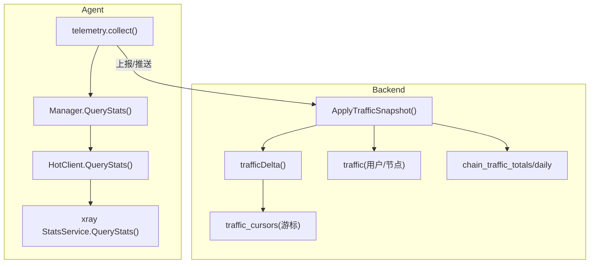
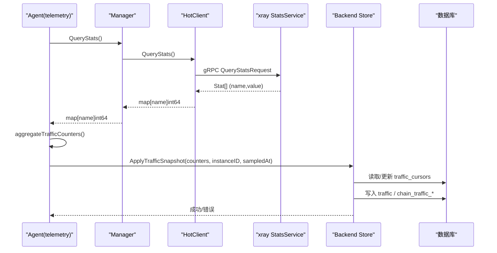
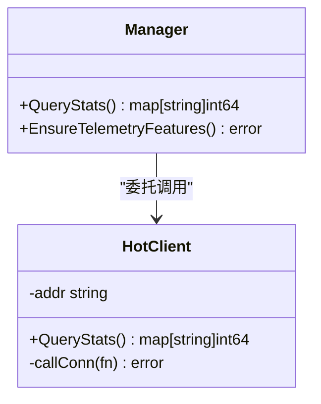
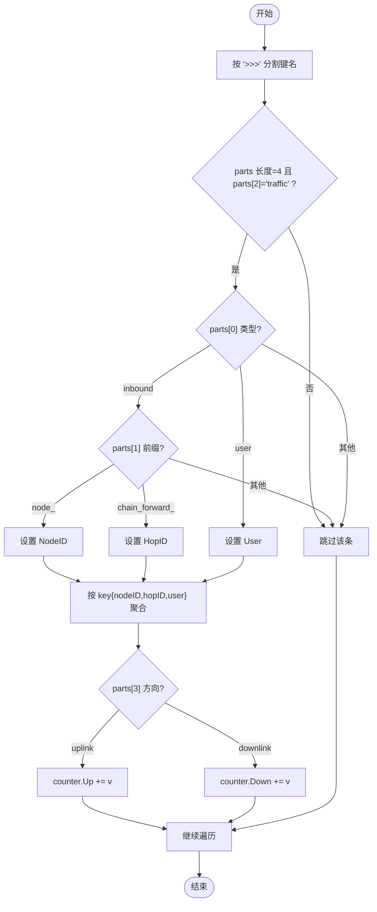
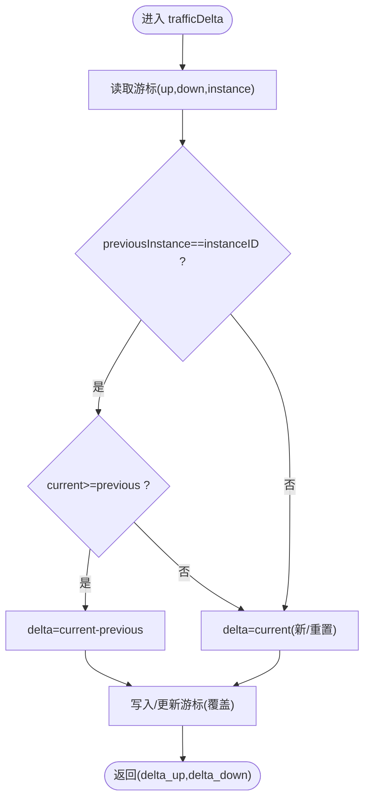
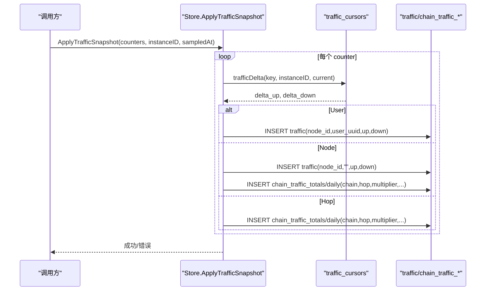
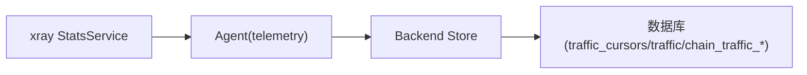

# 流量统计

<cite>
**本文引用的文件**   
- [telemetry.go](file://src/agent/cmd/agent/telemetry.go)
- [hot.go](file://src/agent/internal/xray/hot.go)
- [manager.go](file://src/agent/internal/xray/manager.go)
- [messages.go](file://src/shared/messages.go)
- [chain_traffic.go](file://src/backend/internal/store/chain_traffic.go)
- [chain_traffic_test.go](file://src/backend/internal/store/chain_traffic_test.go)
- [chain.go](file://src/shared/chain.go)
</cite>

## 目录
1. [简介](#简介)
2. [项目结构](#项目结构)
3. [核心组件](#核心组件)
4. [架构总览](#架构总览)
5. [详细组件分析](#详细组件分析)
6. [依赖关系分析](#依赖关系分析)
7. [性能考量](#性能考量)
8. [故障排查指南](#故障排查指南)
9. [结论](#结论)
10. [附录](#附录)

## 简介
本文件系统性梳理 Agent 侧的流量统计机制，重点包括：
- Xray StatsService 集成与 QueryStats 调用链路
- 绝对计数器游标管理与增量计算（uplink/downlink）
- 溢出处理与数据一致性保证
- 按 nodeID、hopID、user 维度的聚合逻辑与统计键解析（>>>分隔）
- TrafficCounter 数据结构与分类统计（节点、转发链路、用户）
- 统计键格式、聚合算法与性能优化策略

## 项目结构
Agent 负责从 xray 进程拉取绝对流量计数器，并聚合为结构化结果；Backend 负责持久化游标、计算增量并落库。关键路径如下：
- Agent: telemetry → xray.Manager → xray.HotClient → xray StatsService
- Backend: ApplyTrafficSnapshot → trafficDelta → 游标表 → 业务表/链统计表

**图表来源** 
- [telemetry.go:36-53](file://src/agent/cmd/agent/telemetry.go#L36-L53)
- [manager.go:399-402](file://src/agent/internal/xray/manager.go#L399-L402)
- [hot.go:56-70](file://src/agent/internal/xray/hot.go#L56-L70)
- [chain_traffic.go:39-104](file://src/backend/internal/store/chain_traffic.go#L39-L104)

**章节来源**
- [telemetry.go:36-53](file://src/agent/cmd/agent/telemetry.go#L36-L53)
- [manager.go:399-402](file://src/agent/internal/xray/manager.go#L399-L402)
- [hot.go:56-70](file://src/agent/internal/xray/hot.go#L56-L70)
- [chain_traffic.go:39-104](file://src/backend/internal/store/chain_traffic.go#L39-L104)

## 核心组件
- Xray 配置与遥测能力保障：确保 stats/policy/StatsService 开启，必要时重启生效
- gRPC 客户端：对 xray StatsService 发起 QueryStats，返回“计数器名→累计值”
- 聚合器：将原始计数器按维度聚合为 TrafficCounter 列表
- 游标与增量：基于绝对计数器和实例 ID 计算增量，支持溢出与幂等
- 存储层：写入用户/节点流量、链级总量与日粒度桶

**章节来源**
- [manager.go:404-459](file://src/agent/internal/xray/manager.go#L404-L459)
- [hot.go:56-70](file://src/agent/internal/xray/hot.go#L56-L70)
- [telemetry.go:55-101](file://src/agent/cmd/agent/telemetry.go#L55-L101)
- [chain_traffic.go:39-104](file://src/backend/internal/store/chain_traffic.go#L39-L104)

## 架构总览
下图展示从 Agent 采集到 Backend 落库的端到端流程，包含错误处理与幂等性设计。

**图表来源** 
- [telemetry.go:46-53](file://src/agent/cmd/agent/telemetry.go#L46-L53)
- [manager.go:399-402](file://src/agent/internal/xray/manager.go#L399-L402)
- [hot.go:56-70](file://src/agent/internal/xray/hot.go#L56-L70)
- [chain_traffic.go:39-104](file://src/backend/internal/store/chain_traffic.go#L39-L104)

## 详细组件分析

### Xray StatsService 集成与 QueryStats 调用
- Manager 暴露 QueryStats，委托 HotClient 完成 gRPC 调用
- HotClient 使用短超时建立连接，调用 StatsService.QueryStats，返回“名称→累计值”映射
- Manager 同时具备 EnsureTelemetryFeatures，自动补齐 stats/policy/services 并重启 xray

**图表来源** 
- [manager.go:399-402](file://src/agent/internal/xray/manager.go#L399-L402)
- [hot.go:56-70](file://src/agent/internal/xray/hot.go#L56-L70)

**章节来源**
- [manager.go:399-402](file://src/agent/internal/xray/manager.go#L399-L402)
- [hot.go:56-70](file://src/agent/internal/xray/hot.go#L56-L70)
- [manager.go:404-459](file://src/agent/internal/xray/manager.go#L404-L459)

### 统计数据解析与聚合（>>>分隔键）
- 原始键格式示例：
  - inbound>>>node_7>>>traffic>>>uplink
  - inbound>>>chain_forward_11>>>traffic>>>downlink
  - user>>>user-id>>>traffic>>>uplink
- 聚合规则：
  - 仅保留 parts[2] == "traffic" 的项
  - inbound/node_前缀 → NodeID；inbound/chain_forward_前缀 → HopID；user/* → User
  - uplink 累加 Up，downlink 累加 Down
  - 输出 shared.TrafficCounter 切片

**图表来源** 
- [telemetry.go:55-101](file://src/agent/cmd/agent/telemetry.go#L55-L101)

**章节来源**
- [telemetry.go:55-101](file://src/agent/cmd/agent/telemetry.go#L55-L101)

### TrafficCounter 数据结构与分类统计
- TrafficCounter 字段：NodeID、HopID、User、Up、Down
- 分类：
  - 节点流量：NodeID > 0
  - 转发链路流量：HopID > 0
  - 用户流量：User != ""
- 测试用例验证三类聚合的正确性与过滤无关项（如 api inbound）

**章节来源**
- [messages.go:224-232](file://src/shared/messages.go#L224-L232)
- [telemetry.go:55-101](file://src/agent/cmd/agent/telemetry.go#L55-L101)
- [chain_traffic_test.go:72-110](file://src/backend/internal/store/chain_traffic_test.go#L72-L110)

### 绝对计数器游标管理：增量计算、溢出处理与一致性
- 游标表：traffic_cursors(server_id, counter_key, instance_id, up, down)
- 增量计算：
  - 若 previousInstance == instanceID 且 current >= previous，则 delta = current - previous
  - 否则视为新实例或重置，delta = current（从 0 起算）
- 溢出处理：由于上游为绝对计数器，下游以差值计算，天然规避溢出问题
- 一致性：
  - 同一 server_id + counter_key 的游标唯一，覆盖写
  - 通过 instance_id 区分不同 xray 实例，避免跨实例污染
  - 事务包裹写入，失败回滚

**图表来源** 
- [chain_traffic.go:119-140](file://src/backend/internal/store/chain_traffic.go#L119-L140)

**章节来源**
- [chain_traffic.go:119-140](file://src/backend/internal/store/chain_traffic.go#L119-L140)
- [chain_traffic_test.go:125-146](file://src/backend/internal/store/chain_traffic_test.go#L125-L146)

### 流量聚合与落库：用户/节点/链路
- ApplyTrafficSnapshot 接收 counters 与 sampledAt，按 counter_key 生成增量
- 用户/节点：直接写入 traffic 表
- 链路：根据 published_chain 快照匹配 chainID、exitHopID 与 multiplier，写入 chain_traffic_totals 与 chain_traffic_daily
- 乘数计算：multiplyTraffic(value, multiplier, remainder)，保留小数位余量以保证精度

**图表来源** 
- [chain_traffic.go:39-104](file://src/backend/internal/store/chain_traffic.go#L39-L104)
- [chain_traffic.go:195-223](file://src/backend/internal/store/chain_traffic.go#L195-L223)

**章节来源**
- [chain_traffic.go:39-104](file://src/backend/internal/store/chain_traffic.go#L39-L104)
- [chain_traffic.go:195-223](file://src/backend/internal/store/chain_traffic.go#L195-L223)

### 统计键格式与 hopID 命名约定
- inbound/node_{nodeID}/traffic/{uplink|downlink}
- inbound/chain_forward_{hopID}/traffic/{uplink|downlink}
- user/{user}/traffic/{uplink|downlink}
- 转发入站 tag 由 shared.ChainForwardTag(hopID) 生成，便于前后端一致识别

**章节来源**
- [telemetry.go:68-78](file://src/agent/cmd/agent/telemetry.go#L68-L78)
- [chain.go:16-20](file://src/shared/chain.go#L16-L20)

## 依赖关系分析
- Agent 侧依赖 xray 的 StatsService 提供绝对计数器
- Backend 依赖数据库游标与业务表，实现幂等与一致性
- 聚合逻辑强依赖统计键规范（>>>分隔），任何变更需同步更新解析

**图表来源** 
- [hot.go:56-70](file://src/agent/internal/xray/hot.go#L56-L70)
- [chain_traffic.go:39-104](file://src/backend/internal/store/chain_traffic.go#L39-L104)

**章节来源**
- [hot.go:56-70](file://src/agent/internal/xray/hot.go#L56-L70)
- [chain_traffic.go:39-104](file://src/backend/internal/store/chain_traffic.go#L39-L104)

## 性能考量
- gRPC 调用超时控制：rpcTimeout=5s，避免阻塞
- 聚合复杂度：O(N) 遍历计数器集合，哈希聚合 O(1) 插入/更新
- 游标写入：单行覆盖写，减少锁竞争
- 乘数精度：采用千分位余量累积，避免浮点误差
- 批量处理：ApplyTrafficSnapshot 内循环写入，事务提交一次

**章节来源**
- [hot.go:24-26](file://src/agent/internal/xray/hot.go#L24-L26)
- [telemetry.go:55-101](file://src/agent/cmd/agent/telemetry.go#L55-L101)
- [chain_traffic.go:225-231](file://src/backend/internal/store/chain_traffic.go#L225-L231)

## 故障排查指南
- 无统计数据：检查 xray 是否启用 stats/policy/StatsService；必要时调用 EnsureTelemetryFeatures 修复并重启
- 增量异常：确认 instanceID 稳定；检查游标记录是否被跨实例覆盖
- 溢出/负值：上游为绝对计数器，若出现负值应检查上游实现；当前实现已做非负校验
- 链路统计缺失：确认 published_chain 快照存在且 hop/server 匹配；未命中将忽略

**章节来源**
- [manager.go:404-459](file://src/agent/internal/xray/manager.go#L404-L459)
- [chain_traffic.go:119-140](file://src/backend/internal/store/chain_traffic.go#L119-L140)
- [chain_traffic.go:150-193](file://src/backend/internal/store/chain_traffic.go#L150-L193)

## 结论
本方案通过“绝对计数器+游标差分”的设计，实现了高可靠、幂等的流量统计。Agent 侧专注采集与聚合，Backend 侧专注持久化与一致性，结合明确的统计键规范与乘数精度策略，满足节点、链路、用户多维度的统计需求，并在性能与可维护性之间取得平衡。

## 附录
- 统计键示例与测试断言见单元测试
- 前端展示与重置操作参考面板页面（不在此文档展开）

**章节来源**
- [chain_traffic_test.go:72-110](file://src/backend/internal/store/chain_traffic_test.go#L72-L110)
- [telemetry_test.go:5-31](file://src/agent/cmd/agent/telemetry_test.go#L5-L31)