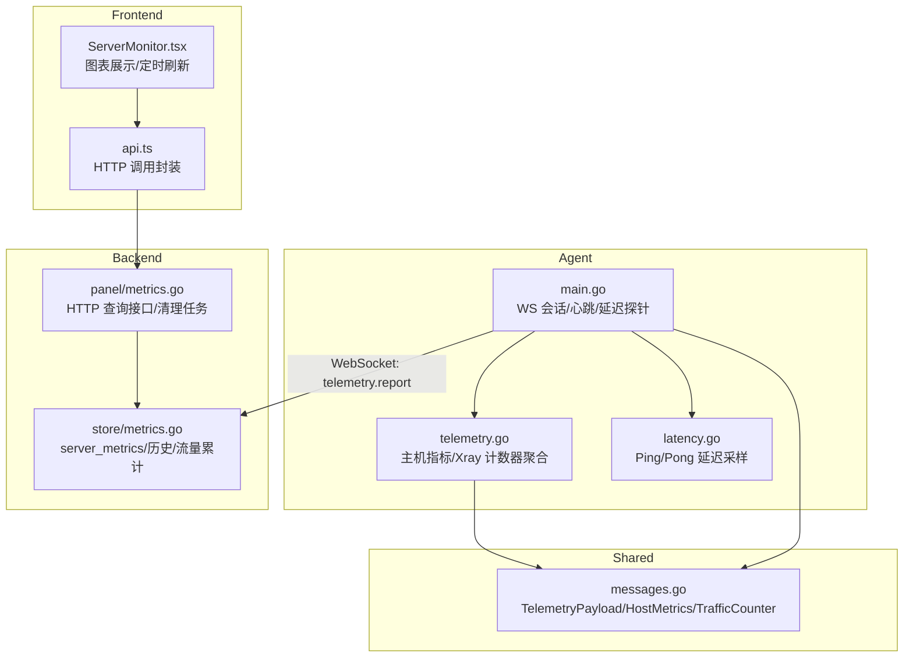
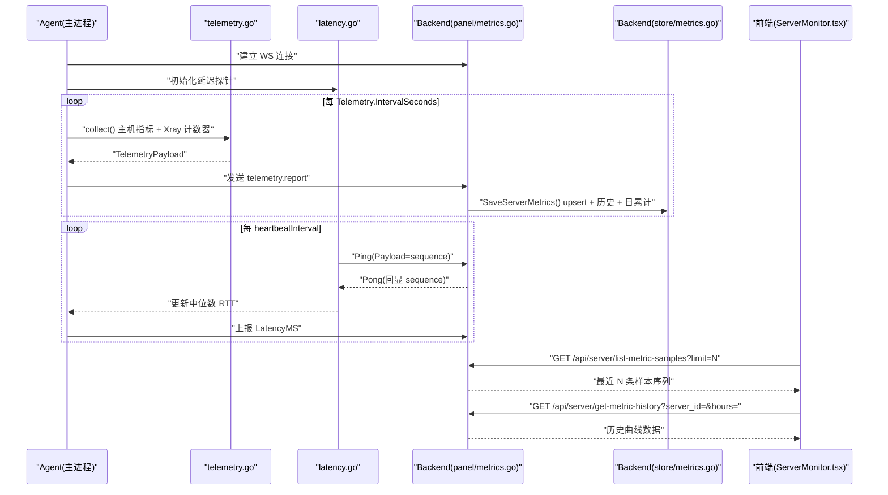
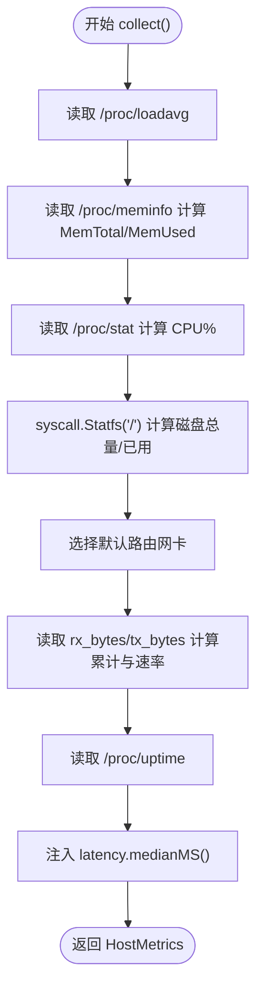
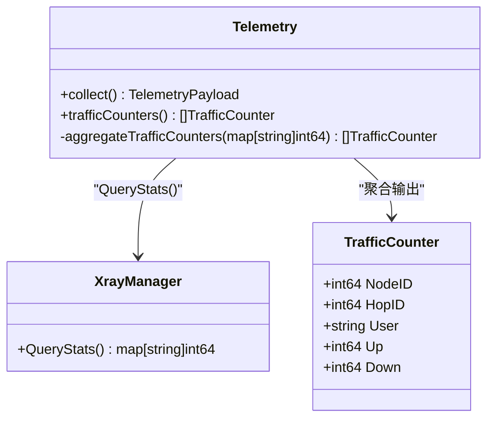
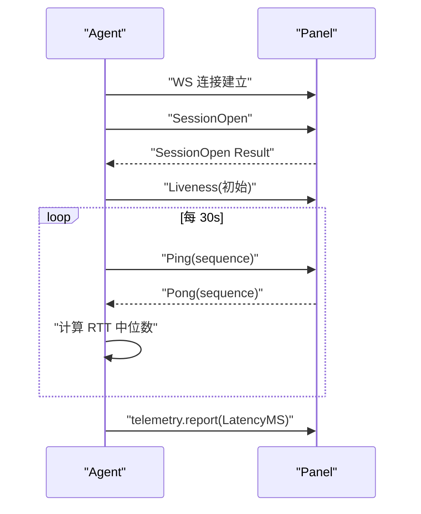
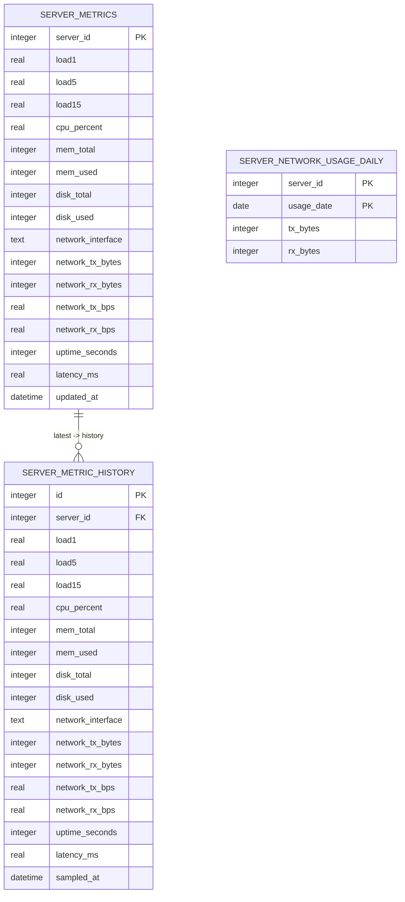
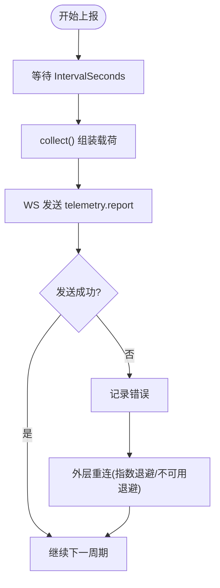
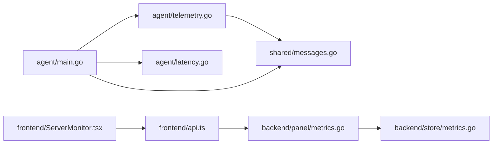

# 遥测数据流

<cite>
**本文引用的文件**   
- [src/agent/cmd/agent/telemetry.go](file://src/agent/cmd/agent/telemetry.go)
- [src/agent/cmd/agent/main.go](file://src/agent/cmd/agent/main.go)
- [src/agent/cmd/agent/latency.go](file://src/agent/cmd/agent/latency.go)
- [src/backend/internal/store/metrics.go](file://src/backend/internal/store/metrics.go)
- [src/backend/internal/panel/metrics.go](file://src/backend/internal/panel/metrics.go)
- [src/backend/internal/store/migrations.go](file://src/backend/internal/store/migrations.go)
- [src/shared/messages.go](file://src/shared/messages.go)
- [src/frontend/src/components/ServerMonitor.tsx](file://src/frontend/src/components/ServerMonitor.tsx)
- [src/frontend/src/lib/api.ts](file://src/frontend/src/lib/api.ts)
</cite>

## 目录
1. [引言](#引言)
2. [项目结构](#项目结构)
3. [核心组件](#核心组件)
4. [架构总览](#架构总览)
5. [详细组件分析](#详细组件分析)
6. [依赖关系分析](#依赖关系分析)
7. [性能考量](#性能考量)
8. [故障排查指南](#故障排查指南)
9. [结论](#结论)
10. [附录：指标字段与查询示例](#附录指标字段与查询示例)

## 引言
本文件系统性梳理 Lattix 的遥测数据流，覆盖主机指标采集（CPU、内存、磁盘、网络速率）、Xray StatsService 集成与流量统计机制、健康检查流程（liveness、延迟测量、连接状态维护）、遥测数据的持久化（server_metrics 表、时序历史、保留策略），以及数据上报周期、错误重试与离线补差逻辑。文末提供指标字段定义与常用查询示例，便于运维与前端展示使用。

## 项目结构
遥测相关代码主要分布在 Agent 端采集与上报、Backend 端存储与 API、共享协议类型与前端展示：
- Agent 端负责从 /proc 与 xray gRPC 接口采集指标，并通过 WebSocket 周期性上报。
- Backend 端接收遥测事件，原子更新最新值并写入历史样本，同时暴露查询接口供面板展示。
- Shared 包定义 TelemetryPayload、HostMetrics、TrafficCounter 等协议结构。
- 前端通过 HTTP API 拉取最近样本与历史趋势，进行可视化展示。

**图示来源** 
- [src/agent/cmd/agent/main.go](file://src/agent/cmd/agent/main.go)
- [src/agent/cmd/agent/telemetry.go](file://src/agent/cmd/agent/telemetry.go)
- [src/agent/cmd/agent/latency.go](file://src/agent/cmd/agent/latency.go)
- [src/backend/internal/store/metrics.go](file://src/backend/internal/store/metrics.go)
- [src/backend/internal/panel/metrics.go](file://src/backend/internal/panel/metrics.go)
- [src/shared/messages.go](file://src/shared/messages.go)
- [src/frontend/src/components/ServerMonitor.tsx](file://src/frontend/src/components/ServerMonitor.tsx)
- [src/frontend/src/lib/api.ts](file://src/frontend/src/lib/api.ts)

**章节来源**
- [src/agent/cmd/agent/main.go](file://src/agent/cmd/agent/main.go)
- [src/agent/cmd/agent/telemetry.go](file://src/agent/cmd/agent/telemetry.go)
- [src/backend/internal/store/metrics.go](file://src/backend/internal/store/metrics.go)
- [src/backend/internal/panel/metrics.go](file://src/backend/internal/panel/metrics.go)
- [src/shared/messages.go](file://src/shared/messages.go)
- [src/frontend/src/components/ServerMonitor.tsx](file://src/frontend/src/components/ServerMonitor.tsx)
- [src/frontend/src/lib/api.ts](file://src/frontend/src/lib/api.ts)

## 核心组件
- Agent 遥测采集器：从 /proc 读取负载、内存、CPU、磁盘、系统运行时间；计算默认网卡收发字节及速率；聚合 Xray 绝对计数器为节点/跳/用户维度增量。
- 延迟与健康探针：基于 WS Ping/Pong 实现 liveness 探测与 RTT 中位数估计，作为 HostMetrics.LatencyMS 上报。
- Backend 存储层：原子 upsert 最新 server_metrics，并插入 server_metric_history 时序样本；按日累计 network_usage；支持按服务器查询历史与最近 N 条样本。
- 面板 API：提供最近样本列表与指定服务器历史曲线；定时清理过期历史。
- 共享协议：TelemetryPayload、HostMetrics、TrafficCounter 等结构体确保两端一致。

**章节来源**
- [src/agent/cmd/agent/telemetry.go](file://src/agent/cmd/agent/telemetry.go)
- [src/agent/cmd/agent/latency.go](file://src/agent/cmd/agent/latency.go)
- [src/backend/internal/store/metrics.go](file://src/backend/internal/store/metrics.go)
- [src/backend/internal/panel/metrics.go](file://src/backend/internal/panel/metrics.go)
- [src/shared/messages.go](file://src/shared/messages.go)

## 架构总览
遥测数据流的关键路径如下：
- Agent 启动后建立到 Backend 的 WS 长连接，开启心跳与延迟探针。
- 周期性采集主机指标与 Xray 流量计数器，组装 TelemetryPayload 并通过 TypeTelemetry 事件上报。
- Backend 接收后原子更新最新值与历史样本，并累计当日网络用量。
- 前端通过 HTTP 接口获取最近样本与历史曲线，渲染 CPU、内存、磁盘、网络速率与延迟趋势。

**图示来源** 
- [src/agent/cmd/agent/main.go](file://src/agent/cmd/agent/main.go)
- [src/agent/cmd/agent/telemetry.go](file://src/agent/cmd/agent/telemetry.go)
- [src/agent/cmd/agent/latency.go](file://src/agent/cmd/agent/latency.go)
- [src/backend/internal/panel/metrics.go](file://src/backend/internal/panel/metrics.go)
- [src/backend/internal/store/metrics.go](file://src/backend/internal/store/metrics.go)
- [src/frontend/src/components/ServerMonitor.tsx](file://src/frontend/src/components/ServerMonitor.tsx)
- [src/frontend/src/lib/api.ts](file://src/frontend/src/lib/api.ts)

## 详细组件分析

### 主机指标采集（CPU、内存、磁盘、网络速率）
- 负载：读取 /proc/loadavg，解析 1/5/15 分钟负载。
- 内存：读取 /proc/meminfo，计算 MemTotal 与 MemUsed（MemTotal - MemAvailable）。
- CPU：读取 /proc/stat 首行 idle 与 total tick，两次采样区间计算使用率百分比；首帧为 0。
- 磁盘：syscall.Statfs("/") 获取根文件系统总量与已用。
- 网络：选择默认路由出口网卡（IPv4/IPv6 优先），读取 /sys/class/net/{iface}/statistics/rx_bytes, tx_bytes，计算累计字节与速率（BPS）；忽略 lo 与 docker/veth/br-/virbr/tun/tap 等虚拟接口。
- 系统运行时间：读取 /proc/uptime。
- 延迟：注入 latency.medianMS() 返回最近 3 次 RTT 的中位数（毫秒）。

**图示来源** 
- [src/agent/cmd/agent/telemetry.go](file://src/agent/cmd/agent/telemetry.go)

**章节来源**
- [src/agent/cmd/agent/telemetry.go](file://src/agent/cmd/agent/telemetry.go)

### Xray StatsService 集成与流量统计机制
- Agent 通过 xray.Manager.QueryStats() 拉取绝对计数器（map[string]int64），键名形如 "inbound>>>node_xxx>>>traffic>>>uplink|downlink" 或 "user>>>uuid>>>traffic>>>uplink|downlink"。
- aggregateTrafficCounters() 将绝对计数器聚合为 TrafficCounter 列表，按 nodeID/hopID/user 维度汇总 up/down 字节数。
- Backend 在 SaveServerMetrics() 中仅做“仅统计”的 AddTraffic() 累加，不重置游标，天然支持幂等重发与丢帧补差。

**图示来源** 
- [src/agent/cmd/agent/telemetry.go](file://src/agent/cmd/agent/telemetry.go)
- [src/shared/messages.go](file://src/shared/messages.go)

**章节来源**
- [src/agent/cmd/agent/telemetry.go](file://src/agent/cmd/agent/telemetry.go)
- [src/shared/messages.go](file://src/shared/messages.go)

### 健康检查流程（liveness、延迟测量、连接状态维护）
- WS 心跳：Agent 每 30s 发送 Ping，Panel 回 Pong；读超时 90s 内无消息判定连接死亡，外层触发退避重连。
- 延迟探针：自定义 Ping Payload 携带 sequence，Pong 回显相同 sequence，计算 RTT 微秒转毫秒，维护最近 3 个样本的中位数。
- liveness 探测：首次连接后立即发送一次轻量 liveness 事件，后续每 heartbeatInterval 发送；失败则关闭连接并重连。
- 连接状态：SessionOpen/Ready 握手成功后进入活跃态；生命周期变化时调整延迟探针开关。

**图示来源** 
- [src/agent/cmd/agent/main.go](file://src/agent/cmd/agent/main.go)
- [src/agent/cmd/agent/latency.go](file://src/agent/cmd/agent/latency.go)

**章节来源**
- [src/agent/cmd/agent/main.go](file://src/agent/cmd/agent/main.go)
- [src/agent/cmd/agent/latency.go](file://src/agent/cmd/agent/latency.go)

### 遥测数据持久化（server_metrics 表、时序数据存储、历史保留策略）
- server_metrics：按 server_id 主键 upsert 最新值，包含负载、CPU%、内存、磁盘、网卡、累计字节、速率、Uptime、延迟、更新时间。
- server_metric_history：每次保存同步插入一条时序样本，用于历史曲线与最近 N 条样本查询。
- server_network_usage_daily：按 usage_date 累计当日 tx_bytes/rx_bytes，支持 ON CONFLICT 累加。
- 保留策略：DeleteExpiredServerMetricHistory 定期删除早于 retention（默认 24h）的历史记录。
- 迁移：migrations.go 保证 schemaVersion 与列存在性，必要时重建表并回填数据。

**图示来源** 
- [src/backend/internal/store/metrics.go](file://src/backend/internal/store/metrics.go)
- [src/backend/internal/store/migrations.go](file://src/backend/internal/store/migrations.go)

**章节来源**
- [src/backend/internal/store/metrics.go](file://src/backend/internal/store/metrics.go)
- [src/backend/internal/store/migrations.go](file://src/backend/internal/store/migrations.go)

### 数据上报周期、错误重试与离线补差
- 上报周期：由 AgentSettings.Telemetry.IntervalSeconds 控制，Agent 侧 waitInterval 动态读取设置。
- 错误重试：WS 写失败记录日志，外层重连循环根据失败次数与面板可用性退避；认证拒绝时停止自动重试。
- 离线补差：Xray 计数器为绝对值，Backend 使用 AddTraffic() 累加，无需游标管理；WS 丢帧不影响最终一致性。

**图示来源** 
- [src/agent/cmd/agent/main.go](file://src/agent/cmd/agent/main.go)
- [src/agent/cmd/agent/telemetry.go](file://src/agent/cmd/agent/telemetry.go)

**章节来源**
- [src/agent/cmd/agent/main.go](file://src/agent/cmd/agent/main.go)
- [src/agent/cmd/agent/telemetry.go](file://src/agent/cmd/agent/telemetry.go)

### 前端展示与查询
- 最近样本：GET /api/server/list-metric-samples?limit=N，返回每台服务器最近 N 条样本序列。
- 历史曲线：GET /api/server/get-metric-history?server_id=&hours=，返回指定服务器过去 hours 小时的历史。
- 前端定时刷新：打开详情时每秒加载一次，间隔 60s 轮询，渲染 CPU、内存、磁盘、网络速率与延迟趋势。

**章节来源**
- [src/backend/internal/panel/metrics.go](file://src/backend/internal/panel/metrics.go)
- [src/frontend/src/components/ServerMonitor.tsx](file://src/frontend/src/components/ServerMonitor.tsx)
- [src/frontend/src/lib/api.ts](file://src/frontend/src/lib/api.ts)

## 依赖关系分析
- Agent 依赖 shared 协议类型与 xray.Manager 获取版本与 StatsService 计数器。
- Backend store 依赖数据库事务与 SQL 语句完成 upsert、历史插入与日累计。
- panel 层暴露 HTTP 接口，调用 store 方法并提供清理任务。
- 前端依赖 api.ts 封装请求，渲染 ServerMonitor.tsx 组件。

**图示来源** 
- [src/agent/cmd/agent/main.go](file://src/agent/cmd/agent/main.go)
- [src/agent/cmd/agent/telemetry.go](file://src/agent/cmd/agent/telemetry.go)
- [src/agent/cmd/agent/latency.go](file://src/agent/cmd/agent/latency.go)
- [src/backend/internal/panel/metrics.go](file://src/backend/internal/panel/metrics.go)
- [src/backend/internal/store/metrics.go](file://src/backend/internal/store/metrics.go)
- [src/shared/messages.go](file://src/shared/messages.go)
- [src/frontend/src/lib/api.ts](file://src/frontend/src/lib/api.ts)
- [src/frontend/src/components/ServerMonitor.tsx](file://src/frontend/src/components/ServerMonitor.tsx)

**章节来源**
- [src/agent/cmd/agent/main.go](file://src/agent/cmd/agent/main.go)
- [src/backend/internal/panel/metrics.go](file://src/backend/internal/panel/metrics.go)
- [src/backend/internal/store/metrics.go](file://src/backend/internal/store/metrics.go)
- [src/shared/messages.go](file://src/shared/messages.go)
- [src/frontend/src/lib/api.ts](file://src/frontend/src/lib/api.ts)
- [src/frontend/src/components/ServerMonitor.tsx](file://src/frontend/src/components/ServerMonitor.tsx)

## 性能考量
- 采集开销：/proc 与 /sys 文件读取为轻量 I/O，CPU 使用率需两次采样，避免频繁 IO。
- 网络速率计算：仅在同一网卡且累计值单调递增时计算 BPS，避免负增长或切换网卡导致异常。
- 存储事务：SaveServerMetrics 使用单事务完成 upsert、历史插入与日累计，减少锁竞争。
- 历史清理：每日清理超过 retention 的历史记录，控制 DB 膨胀。
- 前端刷新：限制 limit 范围（1~60），避免过大响应；历史查询限制 hours（1~24）。

[本节为通用指导，不直接分析具体文件]

## 故障排查指南
- WS 连接断开：检查 wsReadTimeout 与心跳；确认 Panel 是否处于 active 状态；观察重连退避日志。
- 延迟中位数为空：确认 PongHandler 正常回调；检查 PanelStateActive 开关。
- 指标缺失：确认 /proc 可读；默认网卡识别失败时跳过网络指标；CPU 首帧为 0 属预期。
- 历史为空：确认 SaveServerMetrics 事务提交成功；检查 DeleteExpiredServerMetricHistory 是否误删。
- 流量不一致：确认 Xray StatsService 启用；核对聚合键名格式；后端 AddTraffic 幂等累加。

**章节来源**
- [src/agent/cmd/agent/main.go](file://src/agent/cmd/agent/main.go)
- [src/agent/cmd/agent/latency.go](file://src/agent/cmd/agent/latency.go)
- [src/backend/internal/store/metrics.go](file://src/backend/internal/store/metrics.go)

## 结论
该遥测体系以 Agent 端轻量采集与 Backend 端原子持久化为核心，结合 WS 心跳与延迟探针保障连接健康与实时性。Xray 绝对计数器与幂等累加设计确保了丢帧可补差与最终一致性。通过清晰的表结构与保留策略，支撑了面板对实时与历史的可视化需求。整体架构简洁可靠，易于扩展与维护。

[本节为总结，不直接分析具体文件]

## 附录：指标字段与查询示例

### 指标字段定义（HostMetrics）
- load1/5/15：1/5/15 分钟负载
- cpu_percent：采样区间 CPU 使用率（%）
- mem_total/mem_used：内存总量与已用（字节）
- disk_total/disk_used：根文件系统总量与已用（字节）
- network_interface：默认路由出口网卡
- network_tx_bytes/network_rx_bytes：开机以来累计上传/下载字节
- network_tx_bps/network_rx_bps：采样区间上传/下载速率（BPS）
- uptime_seconds：系统运行时间（秒）
- latency_ms：最近 3 次 WS RTT 中位数（毫秒）

**章节来源**
- [src/shared/messages.go](file://src/shared/messages.go)

### 常用查询示例
- 最近 N 条样本（按服务器分组）：
  - GET /api/server/list-metric-samples?limit=30
- 指定服务器历史曲线（小时）：
  - GET /api/server/get-metric-history?server_id=1&hours=24
- 最近样本 SQL（按 sampled_at 降序取最近 N 条）：
  - SELECT ... FROM (SELECT ..., ROW_NUMBER() OVER(PARTITION BY server_id ORDER BY sampled_at DESC, id DESC) AS sample_rank FROM server_metric_history) WHERE sample_rank <= ? ORDER BY server_id, sampled_at
- 指定服务器历史（小时）SQL：
  - SELECT ... FROM server_metric_history WHERE server_id = ? AND sampled_at >= ? ORDER BY sampled_at, id
- 删除过期历史（retention=24h）：
  - DELETE FROM server_metric_history WHERE sampled_at < ?

**章节来源**
- [src/backend/internal/panel/metrics.go](file://src/backend/internal/panel/metrics.go)
- [src/backend/internal/store/metrics.go](file://src/backend/internal/store/metrics.go)
- [src/frontend/src/lib/api.ts](file://src/frontend/src/lib/api.ts)