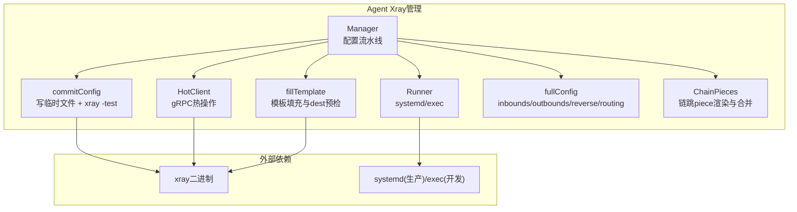
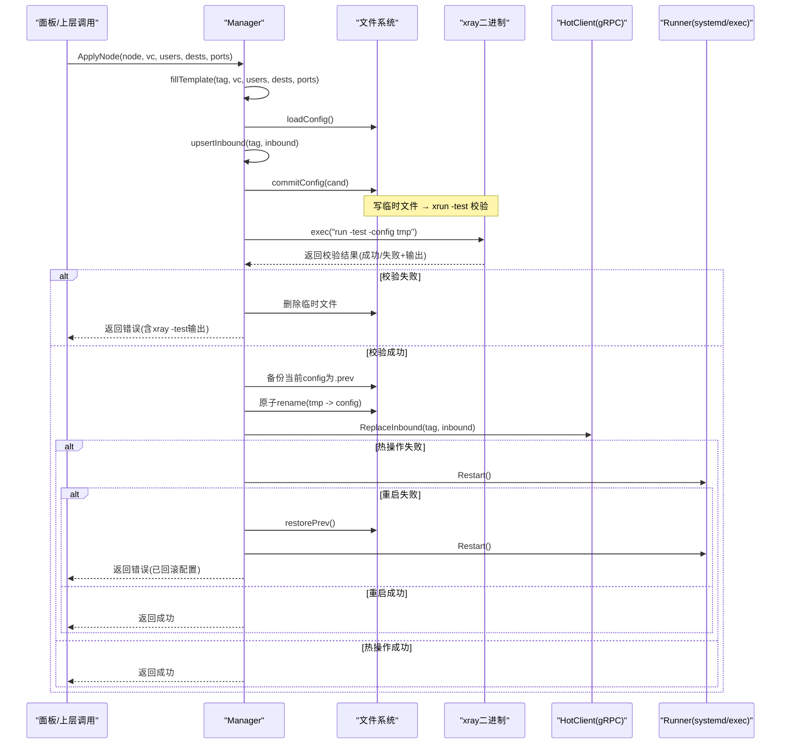
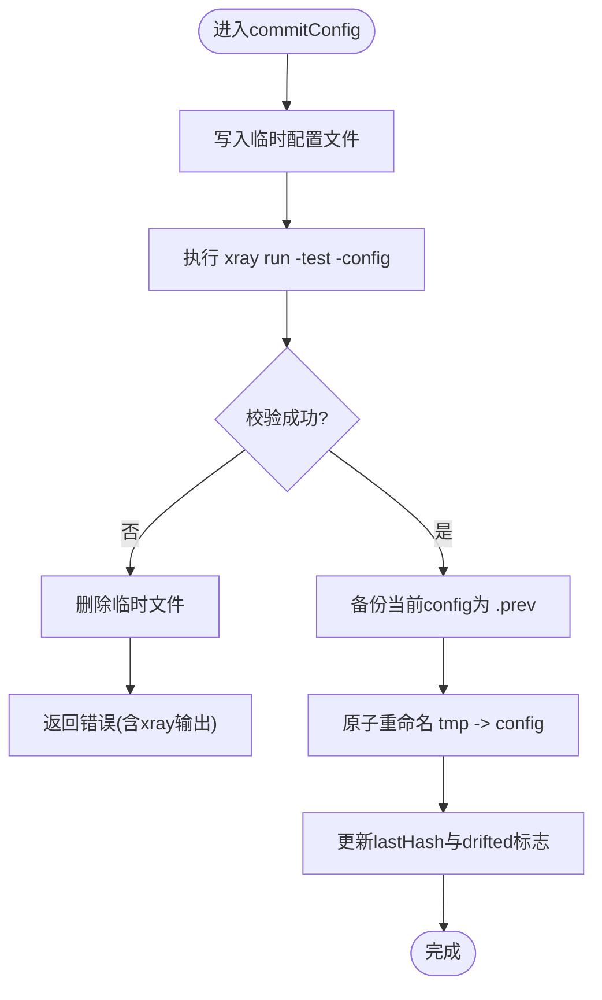
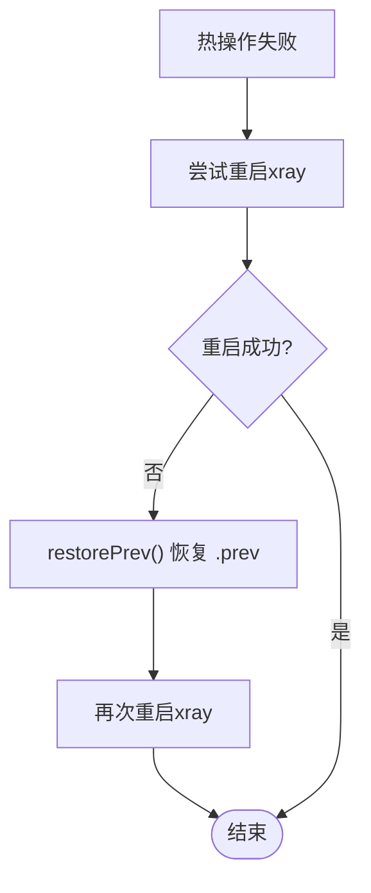
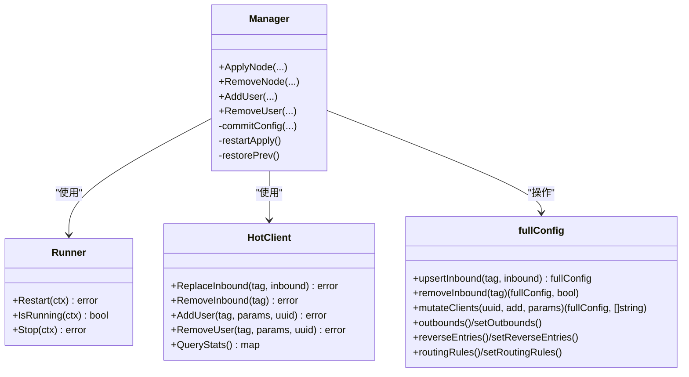

# Xray配置测试阶段

<cite>
**本文引用的文件**   
- [manager.go](file://src/agent/internal/xray/manager.go)
- [runner.go](file://src/agent/internal/xray/runner.go)
- [hot.go](file://src/agent/internal/xray/hot.go)
- [config.go](file://src/agent/internal/xray/config.go)
- [fill.go](file://src/agent/internal/xray/fill.go)
- [chain.go](file://src/agent/internal/xray/chain.go)
- [dev-e2e-xray.sh](file://scripts/dev-e2e-xray.sh)
</cite>

## 目录
1. [简介](#简介)
2. [项目结构](#项目结构)
3. [核心组件](#核心组件)
4. [架构总览](#架构总览)
5. [详细组件分析](#详细组件分析)
6. [依赖关系分析](#依赖关系分析)
7. [性能与超时特性](#性能与超时特性)
8. [故障排查指南](#故障排查指南)
9. [结论](#结论)

## 简介
本文聚焦于Xray配置“测试阶段”的完整实现：从调用xray -test命令、解析测试结果，到错误定位与修复建议；并说明测试超时处理、资源清理机制、失败回滚策略与状态恢复。同时给出安全执行配置测试与解析结果的最佳实践，以及常见配置错误的诊断方法与解决方案。

## 项目结构
围绕Xray配置测试的关键代码集中在agent侧的xray管理模块，包括配置组装、校验落盘、热操作与兜底重启、回滚恢复等。

图表来源
- [manager.go:235-287](file://src/agent/internal/xray/manager.go#L235-L287)
- [runner.go:27-33](file://src/agent/internal/xray/runner.go#L27-L33)
- [hot.go:24-48](file://src/agent/internal/xray/hot.go#L24-L48)
- [fill.go:20-142](file://src/agent/internal/xray/fill.go#L20-L142)
- [config.go:10-81](file://src/agent/internal/xray/config.go#L10-L81)
- [chain.go:74-119](file://src/agent/internal/xray/chain.go#L74-L119)

章节来源
- [manager.go:1-55](file://src/agent/internal/xray/manager.go#L1-L55)
- [runner.go:16-33](file://src/agent/internal/xray/runner.go#L16-L33)

## 核心组件
- Manager：编排配置流水线（模板填充 → xray -test → 原子落盘 → gRPC热操作 → 重启兜底 → 回滚）。
- commitConfig：将候选配置写入临时文件，调用xray run -test进行语法与语义校验，成功后备份当前配置并原子替换。
- Runner：抽象服务控制（systemd或exec），负责重启/停止/运行态检测。
- HotClient：通过gRPC对xray进行零重启的热操作（增删用户、替换inbound、查询统计）。
- fullConfig：对config.json的浅层表示与inbounds/outbounds/reverse/routing的增删改方法。
- fillTemplate：模板占位符填充、端口选择、dest可达性预检、realized_config提取。
- ChainPieces：链跳配置件渲染与合并，统一走“落盘→xray -test→重启→失败回滚”。

章节来源
- [manager.go:24-55](file://src/agent/internal/xray/manager.go#L24-L55)
- [manager.go:235-287](file://src/agent/internal/xray/manager.go#L235-L287)
- [runner.go:16-33](file://src/agent/internal/xray/runner.go#L16-L33)
- [hot.go:24-48](file://src/agent/internal/xray/hot.go#L24-L48)
- [config.go:10-81](file://src/agent/internal/xray/config.go#L10-L81)
- [fill.go:20-142](file://src/agent/internal/xray/fill.go#L20-L142)
- [chain.go:74-119](file://src/agent/internal/xray/chain.go#L74-L119)

## 架构总览
下图展示一次节点应用（apply_node）的完整流程，重点体现“xray -test”在配置落盘前的关键作用，以及失败时的回滚路径。

图表来源
- [manager.go:109-142](file://src/agent/internal/xray/manager.go#L109-L142)
- [manager.go:235-287](file://src/agent/internal/xray/manager.go#L235-L287)
- [hot.go:72-90](file://src/agent/internal/xray/hot.go#L72-L90)
- [runner.go:40-53](file://src/agent/internal/xray/runner.go#L40-L53)

## 详细组件分析

### 配置测试阶段（xray -test）
- 触发时机：commitConfig中，在写入临时文件后、原子替换前执行。
- 执行方式：以子进程方式调用xray run -test -config <tmpPath>，捕获CombinedOutput用于错误定位。
- 失败处理：立即删除临时文件，返回包含xray输出的错误信息，便于上层解析与提示。
- 成功处理：备份当前config为.config.prev，原子替换临时文件为最终config，更新漂移检测基线哈希。

图表来源
- [manager.go:235-287](file://src/agent/internal/xray/manager.go#L235-L287)

章节来源
- [manager.go:235-287](file://src/agent/internal/xray/manager.go#L235-L287)

### 测试超时与资源清理
- 子进程执行：使用exec.CommandContext(ctx, ...)形式可结合上下文取消；当前实现未显式设置超时，但可通过外层调用传入带超时的context来限制。
- 资源清理：若校验失败，会删除临时文件；若后续步骤异常（如备份失败），也会清理临时文件避免残留。
- 进程生命周期：ExecRunner在启动后会短暂观察是否“启动即崩”，并在重启前清理旧进程，避免端口占用导致新实例绑定失败。

章节来源
- [runner.go:77-114](file://src/agent/internal/xray/runner.go#L77-L114)
- [manager.go:235-287](file://src/agent/internal/xray/manager.go#L235-L287)

### 失败回滚与状态恢复
- 回滚策略：当热操作失败且重启失败时，调用restorePrev恢复上一份可用配置，再尝试重启一次，确保系统回到稳定状态。
- 状态恢复：restorePrev会读取.config.prev并覆盖当前config，同时重新计算lastHash，避免误报漂移。
- 漂移修复：loadConfig支持“漂移净化”，丢弃非受管内容，仅保留受管的节点inbounds与链piece，重建骨架配置。

图表来源
- [manager.go:131-140](file://src/agent/internal/xray/manager.go#L131-L140)
- [manager.go:319-334](file://src/agent/internal/xray/manager.go#L319-L334)

章节来源
- [manager.go:131-140](file://src/agent/internal/xray/manager.go#L131-L140)
- [manager.go:319-334](file://src/agent/internal/xray/manager.go#L319-L334)

### 热操作与兜底重启
- 热操作主路径：ReplaceInbound/AddUser/RemoveUser通过gRPC直接修改xray运行时配置，无需重启。
- 兜底重启：当热操作不可用或失败时，自动回退到重启xray使配置生效。
- 协议支持：AddUser/RemoveUser仅对vless/vmess/trojan有效，其他协议直接报错由上层回退重启。

章节来源
- [hot.go:72-135](file://src/agent/internal/xray/hot.go#L72-L135)
- [manager.go:109-142](file://src/agent/internal/xray/manager.go#L109-L142)

### 模板填充与dest预检
- 模板填充：替换PORT/TAG/CLIENTS等占位符，生成合法JSON。
- dest预检：对realitySettings.dest进行TCP+TLS1.3握手探测，不可达则按白名单候选逐个尝试并改写dest/serverNames。
- realized_config：提取实际生效值（端口、公钥、短ID、serverName、网络参数等）供上报。

章节来源
- [fill.go:20-142](file://src/agent/internal/xray/fill.go#L20-L142)
- [fill.go:170-237](file://src/agent/internal/xray/fill.go#L170-L237)

### 链跳配置件（reverse/routing/outbounds/inbounds）
- 渲染与合并：portal/bridge/forward三种角色分别渲染对应inbound/outbound/reverse/rule，并合并进config。
- 统一流水线：所有涉及reverse/routing/outbounds/inbounds的变更均走“落盘→xray -test→重启→失败回滚”的兜底流程。
- 幂等性：同hop_id+kind重发替换同名tag的配置件，复用已记录的端口与密钥。

章节来源
- [chain.go:74-119](file://src/agent/internal/xray/chain.go#L74-L119)
- [chain.go:146-154](file://src/agent/internal/xray/chain.go#L146-L154)

## 依赖关系分析
- Manager依赖Runner（systemd/exec）进行服务控制，依赖HotClient进行gRPC热操作，依赖fullConfig进行配置拼装。
- commitConfig依赖exec调用xray -test，失败则清理临时文件并返回错误。
- fillTemplate依赖exec调用xray x25519/vlessenc生成密钥与加密参数。
- chain.go依赖fullConfig的outbounds/reverse/routing操作方法。

图表来源
- [manager.go:24-55](file://src/agent/internal/xray/manager.go#L24-L55)
- [runner.go:16-33](file://src/agent/internal/xray/runner.go#L16-L33)
- [hot.go:24-48](file://src/agent/internal/xray/hot.go#L24-L48)
- [config.go:10-81](file://src/agent/internal/xray/config.go#L10-L81)
- [chain.go:419-526](file://src/agent/internal/xray/chain.go#L419-L526)

章节来源
- [manager.go:24-55](file://src/agent/internal/xray/manager.go#L24-L55)
- [runner.go:16-33](file://src/agent/internal/xray/runner.go#L16-L33)
- [hot.go:24-48](file://src/agent/internal/xray/hot.go#L24-L48)
- [config.go:10-81](file://src/agent/internal/xray/config.go#L10-L81)
- [chain.go:419-526](file://src/agent/internal/xray/chain.go#L419-L526)

## 性能与超时特性
- gRPC调用超时：HotClient单次调用默认5秒超时，避免阻塞。
- dest预检超时：单个dest探测超时4秒，防止长时间等待。
- 子进程执行：xray -test未显式设置超时，可通过外层传入带超时的context限制；当前实现依赖xray自身快速返回。
- 资源清理：失败路径及时删除临时文件，避免磁盘泄漏；ExecRunner重启前清理旧进程，避免端口冲突。

章节来源
- [hot.go:24-48](file://src/agent/internal/xray/hot.go#L24-L48)
- [fill.go:17-18](file://src/agent/internal/xray/fill.go#L17-L18)
- [runner.go:77-114](file://src/agent/internal/xray/runner.go#L77-L114)

## 故障排查指南
- 配置校验失败：查看xray -test输出，定位具体字段错误（如协议不支持、端口冲突、dest不可达等）。
- 热操作失败：检查gRPC连接与API地址，确认xray API inbound启用；必要时回退重启。
- 重启失败：确认systemd单元状态或exec模式下的子进程日志；检查端口占用与权限。
- 漂移检测：若config被外部修改，系统将自动净化并重建骨架配置，保留受管节点inbounds。
- 常见错误示例：
  - 非法模板：xray -test返回语法错误，需修正模板字段。
  - dest不可达：调整dest或提供白名单候选，确保reality握手成功。
  - 端口占用：更换端口或释放占用进程。

章节来源
- [manager.go:235-287](file://src/agent/internal/xray/manager.go#L235-L287)
- [fill.go:170-237](file://src/agent/internal/xray/fill.go#L170-L237)
- [chain.go:146-154](file://src/agent/internal/xray/chain.go#L146-L154)

## 结论
Xray配置测试阶段通过“xray -test”在落盘前进行严格校验，结合原子替换、备份回滚与热操作兜底，确保配置变更的安全性与一致性。超时控制与资源清理机制进一步提升了系统的健壮性。通过理解各组件职责与交互流程，可有效诊断与解决配置相关问题，保障服务稳定运行。