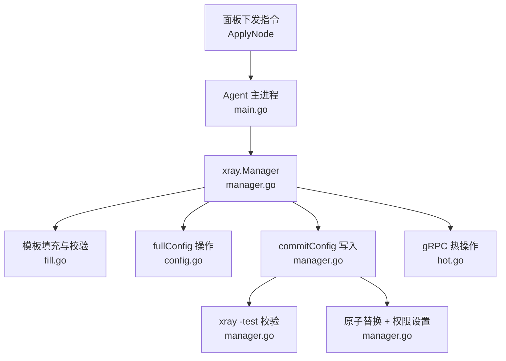
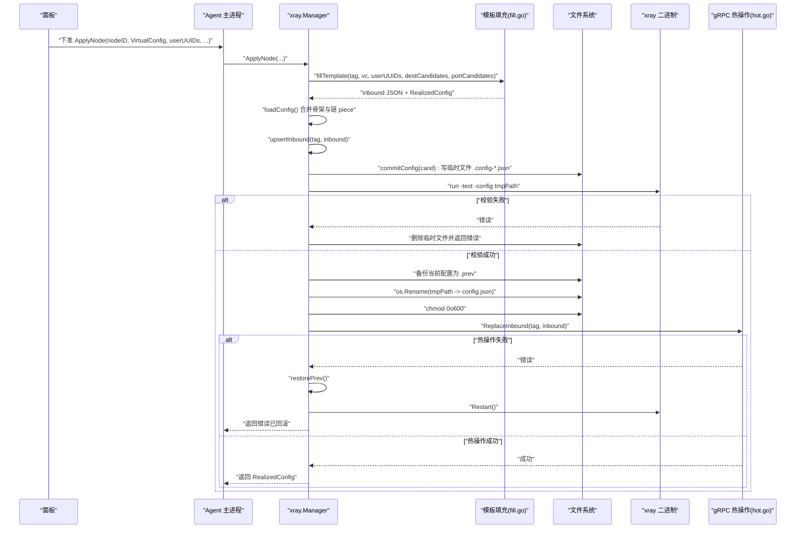
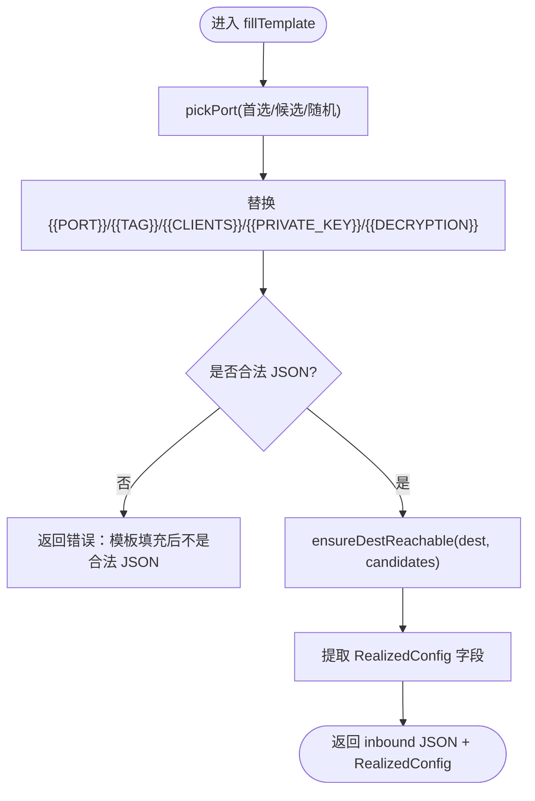
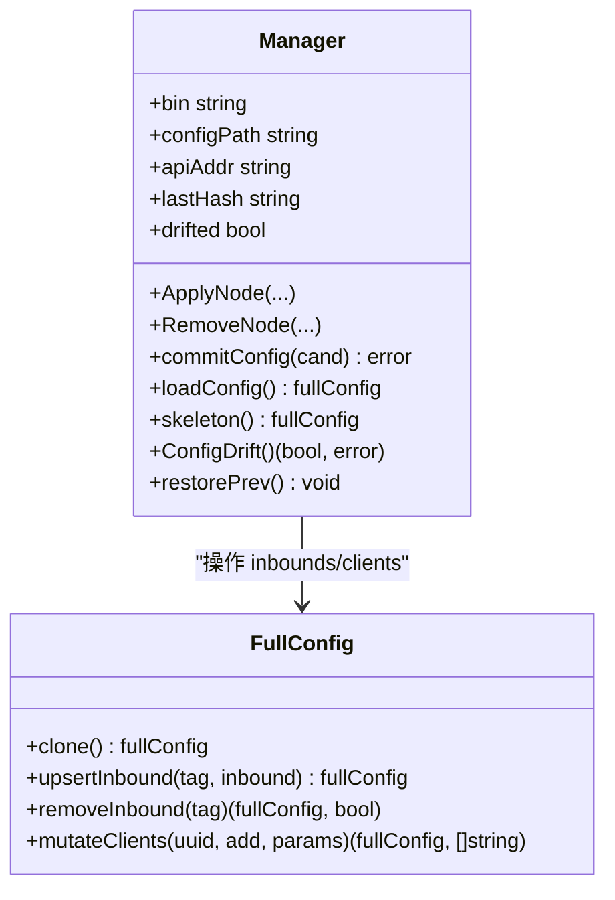
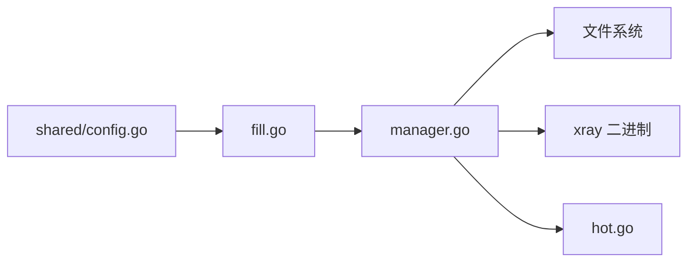

# 临时文件写入阶段

<cite>
**本文引用的文件**   
- [manager.go](file://src/agent/internal/xray/manager.go)
- [fill.go](file://src/agent/internal/xray/fill.go)
- [config.go](file://src/agent/internal/xray/config.go)
- [hot.go](file://src/agent/internal/xray/hot.go)
- [config.go](file://src/shared/config.go)
- [main.go](file://src/agent/cmd/agent/main.go)
</cite>

## 目录
1. [引言](#引言)
2. [项目结构](#项目结构)
3. [核心组件](#核心组件)
4. [架构总览](#架构总览)
5. [详细组件分析](#详细组件分析)
6. [依赖关系分析](#依赖关系分析)
7. [性能考量](#性能考量)
8. [故障排查指南](#故障排查指南)
9. [结论](#结论)

## 引言
本文聚焦于“临时文件写入阶段”的完整流程，围绕配置文件的生成与安全落盘展开：模板渲染与变量替换、JSON 格式校验、原子性保证、权限控制、损坏检测与回滚机制。通过代码级分析与图示，帮助读者理解 agent 侧 xray 配置从模板到最终生效的全过程，并提供调试技巧以快速定位问题。

## 项目结构
本项目的配置写入逻辑集中在 agent 端的 xray 管理模块中，关键文件如下：
- manager.go：实现 ApplyNode/RemoveNode 等编排流程，包含 commitConfig（写临时文件、校验、备份、原子替换）与 loadConfig/skeleton（骨架重建）、漂移检测与恢复。
- fill.go：负责模板占位符填充、端口选择、dest 可达性预检、VLESS Encryption 与 Reality 密钥对生成，并产出 realized_config 上报值。
- config.go：对 fullConfig/inbounds 进行浅层操作（增删 inbound、用户列表变更），保持 inbound JSON 原样透传。
- hot.go：gRPC 热操作客户端，用于零重启地添加/删除 inbound 和用户。
- shared/config.go：定义 VirtualConfig/RealizedConfig 及模板占位符常量。
- agent/main.go：接收面板下发指令，调用 Manager.ApplyNode 触发写入流水线。

图表来源 
- [manager.go:109-142](file://src/agent/internal/xray/manager.go#L109-L142)
- [fill.go:23-142](file://src/agent/internal/xray/fill.go#L23-L142)
- [config.go:50-81](file://src/agent/internal/xray/config.go#L50-L81)
- [hot.go:72-90](file://src/agent/internal/xray/hot.go#L72-L90)

章节来源
- [manager.go:109-142](file://src/agent/internal/xray/manager.go#L109-L142)
- [fill.go:23-142](file://src/agent/internal/xray/fill.go#L23-L142)
- [config.go:50-81](file://src/agent/internal/xray/config.go#L50-L81)
- [hot.go:72-90](file://src/agent/internal/xray/hot.go#L72-L90)
- [config.go:149-168](file://src/shared/config.go#L149-L168)
- [main.go:565-572](file://src/agent/cmd/agent/main.go#L565-L572)

## 核心组件
- 模板渲染与变量替换
  - 支持 PORT/TAG/CLIENTS/PRIVATE_KEY/DECRYPTION 等占位符；PORT/CLIENTS 连引号一起替换为 JSON 值，确保输出合法 JSON。
  - 针对 reality 协议，自动执行 xray x25519 生成私钥并替换 PRIVATE_KEY，公钥随 realized_config 上报。
  - 针对 VLESS Encryption，执行 xray vlessenc 生成 decryption/encryption 对，decryption 填入模板，encryption 随 realized_config 上报。
  - 填充后必须通过 JSON 解析校验，否则直接失败。
- 端口选择与 dest 预检
  - 若模板 port=0，则按候选段挑选空闲端口；冲突或全占用时报错。
  - reality 模板会检查 streamSettings.realitySettings.dest 的 TCP+TLS1.3 可达性，不可达时按白名单候选逐个尝试并改写 dest/serverNames。
- 原子写入与权限控制
  - 使用 os.CreateTemp 在目标目录下创建 .config-*.json 临时文件，写入完成后执行 xray run -test 校验。
  - 校验通过后，先备份当前可用配置为 .prev，再以 os.Rename 原子替换为目标路径，最后设置 0o600 权限。
  - 目录创建时使用 0o700 权限，确保仅所有者可访问。
- 损坏检测与回滚
  - 读取配置失败或 JSON 解析失败时，将原文件重命名为 .broken 并基于 skeleton 重建。
  - 支持漂移检测：对比 lastHash，若不一致标记 drifted，下次加载以净化后的骨架+受管 inbound 为基。
  - 热操作失败且重启失败时，自动恢复 .prev 配置并再次重启，确保一致性。

章节来源
- [fill.go:23-142](file://src/agent/internal/xray/fill.go#L23-L142)
- [fill.go:170-223](file://src/agent/internal/xray/fill.go#L170-L223)
- [fill.go:247-276](file://src/agent/internal/xray/fill.go#L247-L276)
- [manager.go:235-287](file://src/agent/internal/xray/manager.go#L235-L287)
- [manager.go:336-375](file://src/agent/internal/xray/manager.go#L336-L375)
- [manager.go:289-311](file://src/agent/internal/xray/manager.go#L289-L311)
- [manager.go:319-334](file://src/agent/internal/xray/manager.go#L319-L334)

## 架构总览
下图展示了从面板下发指令到配置文件原子落盘的完整序列，包括模板渲染、校验、备份、原子替换与热操作回退路径。

图表来源 
- [manager.go:109-142](file://src/agent/internal/xray/manager.go#L109-L142)
- [manager.go:235-287](file://src/agent/internal/xray/manager.go#L235-L287)
- [fill.go:23-142](file://src/agent/internal/xray/fill.go#L23-L142)
- [hot.go:72-90](file://src/agent/internal/xray/hot.go#L72-L90)

## 详细组件分析

### 组件A：模板渲染与变量替换（fill.go）
- 占位符处理
  - PORT/TAG/CLIENTS：字符串替换，CLIENTS 生成对应协议的 clients/accounts 数组。
  - PRIVATE_KEY：reality 协议模板需要，调用 xray x25519 生成并替换。
  - DECRYPTION：VLESS Encryption 需要，调用 xray vlessenc 生成并替换。
- 合法性校验
  - 替换后必须能解析为 JSON，否则报错。
- 端口与可达性
  - pickPort：优先指定端口，其次候选段，最后随机空闲端口。
  - ensureDestReachable：reality 模板的 dest 需 TCP+TLS1.3 可达，失败则按白名单候选改写。
- 产出 RealizedConfig
  - 提取 port/public_key/short_id/server_name/network/service_name/path/mode/host/method/psk/encryption 等字段，供订阅生成。

图表来源 
- [fill.go:23-142](file://src/agent/internal/xray/fill.go#L23-L142)
- [fill.go:170-223](file://src/agent/internal/xray/fill.go#L170-L223)
- [fill.go:247-276](file://src/agent/internal/xray/fill.go#L247-L276)

章节来源
- [fill.go:23-142](file://src/agent/internal/xray/fill.go#L23-L142)
- [fill.go:170-223](file://src/agent/internal/xray/fill.go#L170-L223)
- [fill.go:247-276](file://src/agent/internal/xray/fill.go#L247-L276)
- [config.go:149-168](file://src/shared/config.go#L149-L168)

### 组件B：原子写入与损坏检测（manager.go）
- commitConfig 流程
  - 创建临时文件 .config-*.json，写入 JSON 内容并关闭。
  - 调用 xray run -test 校验，失败则删除临时文件并返回错误。
  - 备份当前可用配置为 .prev（权限 0o600）。
  - 原子替换：os.Rename(tmpPath -> config.json)，设置 0o600 权限。
  - 更新 lastHash 与 drifted 状态。
- loadConfig 与 skeleton
  - 不存在或损坏时，基于 skeleton 重建；损坏文件重命名为 .broken。
  - 若检测到 drifted，则以骨架+受管 inbound 为基进行净化。
- 回滚与漂移修复
  - restorePrev 恢复 .prev 配置并同步 lastHash。
  - ConfigDrift 比较哈希，首次调用以当前文件为基线。

图表来源 
- [manager.go:235-287](file://src/agent/internal/xray/manager.go#L235-L287)
- [manager.go:336-375](file://src/agent/internal/xray/manager.go#L336-L375)
- [config.go:50-81](file://src/agent/internal/xray/config.go#L50-L81)

章节来源
- [manager.go:235-287](file://src/agent/internal/xray/manager.go#L235-L287)
- [manager.go:336-375](file://src/agent/internal/xray/manager.go#L336-L375)
- [manager.go:289-311](file://src/agent/internal/xray/manager.go#L289-L311)
- [manager.go:319-334](file://src/agent/internal/xray/manager.go#L319-L334)
- [config.go:50-81](file://src/agent/internal/xray/config.go#L50-L81)

### 组件C：gRPC 热操作与回退（hot.go）
- ReplaceInbound：幂等地下发 inbound（先移除同 tag 旧 inbound，再添加）。
- RemoveInbound：热删除 inbound。
- AddUser/RemoveUser：对 vless/vmess/trojan 支持热操作用户；其他协议返回错误，由 Manager 回退重启。
- QueryStats：拉取流量计数器。

章节来源
- [hot.go:72-90](file://src/agent/internal/xray/hot.go#L72-L90)
- [hot.go:92-100](file://src/agent/internal/xray/hot.go#L92-L100)
- [hot.go:102-135](file://src/agent/internal/xray/hot.go#L102-L135)
- [hot.go:56-70](file://src/agent/internal/xray/hot.go#L56-L70)

## 依赖关系分析
- 模板渲染依赖 shared/config.go 中的占位符常量与 VirtualConfig/RealizedConfig 结构。
- 原子写入依赖操作系统提供的临时文件与原子 rename 语义。
- 校验依赖外部 xray 二进制（run -test）。
- 热操作依赖 gRPC 接口（HandlerService/StatsService）。

图表来源 
- [config.go:149-168](file://src/shared/config.go#L149-L168)
- [fill.go:23-142](file://src/agent/internal/xray/fill.go#L23-L142)
- [manager.go:235-287](file://src/agent/internal/xray/manager.go#L235-L287)
- [hot.go:72-90](file://src/agent/internal/xray/hot.go#L72-L90)

章节来源
- [config.go:149-168](file://src/shared/config.go#L149-L168)
- [fill.go:23-142](file://src/agent/internal/xray/fill.go#L23-L142)
- [manager.go:235-287](file://src/agent/internal/xray/manager.go#L235-L287)
- [hot.go:72-90](file://src/agent/internal/xray/hot.go#L72-L90)

## 性能考量
- 模板渲染与 JSON 序列化开销较小，但 x25519/vlessenc 子进程调用存在一定延迟，建议批量处理节点应用。
- 原子替换与权限设置为系统级操作，成本极低。
- gRPC 热操作超时设置为 5 秒，避免阻塞主流程；失败时回退重启，整体鲁棒性强。
- 漂移检测基于哈希比对，时间复杂度 O(n)（n 为文件大小），适合周期性 reconcile。

## 故障排查指南
- 模板填充失败
  - 检查 VirtualConfig.Template 是否为合法 JSON；确认占位符名称与大小写一致。
  - 查看 fillTemplate 的错误信息，重点关注 JSON 解析失败与占位符未替换的情况。
- 端口冲突或候选全部占用
  - 检查 preferred port 是否被占用；若 port=0，确认 port_candidates 是否合理。
- dest 不可达
  - 对于 reality 模板，确认 dest 的 TCP+TLS1.3 可达性与 serverNames 匹配；必要时调整白名单候选。
- 校验失败
  - 查看 xray run -test 的输出日志，定位具体配置项错误。
- 原子替换失败
  - 检查目标目录权限（应为 0o700）与磁盘空间；确认 .prev 备份是否存在。
- 漂移检测与净化
  - 若 lastHash 变化，检查是否有外部修改；必要时清理 .broken/.prev 并重新应用。
- 热操作失败
  - 确认 gRPC 服务可用；若失败，观察是否触发重启与回滚流程。

章节来源
- [fill.go:23-142](file://src/agent/internal/xray/fill.go#L23-L142)
- [fill.go:170-223](file://src/agent/internal/xray/fill.go#L170-L223)
- [manager.go:235-287](file://src/agent/internal/xray/manager.go#L235-L287)
- [manager.go:336-375](file://src/agent/internal/xray/manager.go#L336-L375)
- [hot.go:72-90](file://src/agent/internal/xray/hot.go#L72-L90)

## 结论
临时文件写入阶段通过严格的模板渲染、JSON 校验、原子替换与权限控制，确保了配置文件的安全与一致性。结合损坏检测、漂移修复与回滚机制，系统在异常情况下仍能保持稳定。gRPC 热操作提供了高效的运行时变更能力，失败时自动回退至重启路径，进一步增强了鲁棒性。通过本文档的流程分析与调试指南，开发者可以快速定位并解决配置生成与写入过程中的常见问题。