# 正式落盘阶段

<cite>
**本文引用的文件**   
- [manager.go](file://src/agent/internal/xray/manager.go)
- [config.go](file://src/agent/internal/xray/config.go)
- [fill.go](file://src/agent/internal/xray/fill.go)
- [upgrade.go](file://src/agent/internal/xray/upgrade.go)
- [selfupdate.go](file://src/agent/internal/selfupdate/selfupdate.go)
- [state.go](file://src/agent/internal/state/state.go)
- [update.go](file://src/backend/internal/panel/update.go)
</cite>

## 目录
1. [简介](#简介)
2. [项目结构](#项目结构)
3. [核心组件](#核心组件)
4. [架构总览](#架构总览)
5. [详细组件分析](#详细组件分析)
6. [依赖关系分析](#依赖关系分析)
7. [性能考虑](#性能考虑)
8. [故障排查指南](#故障排查指南)
9. [结论](#结论)
10. [附录](#附录)

## 简介
本文件聚焦“正式落盘阶段”的完整流程与实现细节，覆盖从临时目录到生产目录的安全复制、权限设置、备份与回滚、原子性保证、多版本配置管理与清理策略。文档基于 Agent 侧 xray 配置管理、Agent 自升级、面板自更新等关键路径的代码实现进行系统化说明，并提供流程图与时序图帮助理解。

## 项目结构
与“正式落盘”相关的代码主要分布在以下模块：
- Agent 侧 xray 配置落盘与热更新：manager.go、config.go、fill.go、upgrade.go
- Agent 自升级（二进制替换）：selfupdate.go
- Agent 本地状态持久化（幂等与重建依据）：state.go
- 面板自更新（二进制替换与重启）：update.go

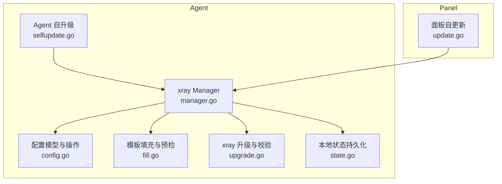

**图表来源** 
- [manager.go:1-120](file://src/agent/internal/xray/manager.go#L1-L120)
- [config.go:1-80](file://src/agent/internal/xray/config.go#L1-L80)
- [fill.go:1-120](file://src/agent/internal/xray/fill.go#L1-L120)
- [upgrade.go:1-120](file://src/agent/internal/xray/upgrade.go#L1-L120)
- [selfupdate.go:1-120](file://src/agent/internal/selfupdate/selfupdate.go#L1-L120)
- [state.go:1-80](file://src/agent/internal/state/state.go#L1-L80)
- [update.go:1-120](file://src/backend/internal/panel/update.go#L1-L120)

**章节来源**
- [manager.go:1-120](file://src/agent/internal/xray/manager.go#L1-L120)
- [selfupdate.go:1-120](file://src/agent/internal/selfupdate/selfupdate.go#L1-L120)
- [update.go:1-120](file://src/backend/internal/panel/update.go#L1-L120)

## 核心组件
- xray 配置管理器（Manager）：负责加载骨架配置、合并链 piece、生成候选配置、校验并原子落盘、热更新或重启兜底、漂移检测与修复、回滚上一份可用配置。
- 配置模型（fullConfig）：以原始 JSON 片段保留 inbound 等关键段，提供增删改查方法，确保“原样写入”。
- 模板填充（fillTemplate）：填充占位符、执行外部工具生成密钥/加密参数、dest 可达性预检、提取 realized_config。
- xray 升级（UpgradeXray）：下载 release 包与 .dgst 校验、备份旧二进制、原子替换、重启与版本校验、失败回滚。
- Agent 自升级（Apply）：下载 tarball、checksums.txt 校验、解压、二进制自检、备份并原子替换、退出由 systemd 拉起完成切换。
- 本地状态（State）：持久化 token、server_id、chain_pieces 等，Save 使用 tmp+rename 原子写。
- 面板自更新（panelUpdater.run）：check→download→verify→extract→apply→restart；replaceExecutable 使用 .new/.bak 原子替换。

**章节来源**
- [manager.go:1-120](file://src/agent/internal/xray/manager.go#L1-L120)
- [config.go:1-120](file://src/agent/internal/xray/config.go#L1-L120)
- [fill.go:1-160](file://src/agent/internal/xray/fill.go#L1-L160)
- [upgrade.go:1-120](file://src/agent/internal/xray/upgrade.go#L1-L120)
- [selfupdate.go:1-120](file://src/agent/internal/selfupdate/selfupdate.go#L1-L120)
- [state.go:1-80](file://src/agent/internal/state/state.go#L1-L80)
- [update.go:1-120](file://src/backend/internal/panel/update.go#L1-L120)

## 架构总览
下图展示一次“节点落地”的完整落盘流程，包括模板填充、校验、备份、原子替换、热更新与回滚路径。

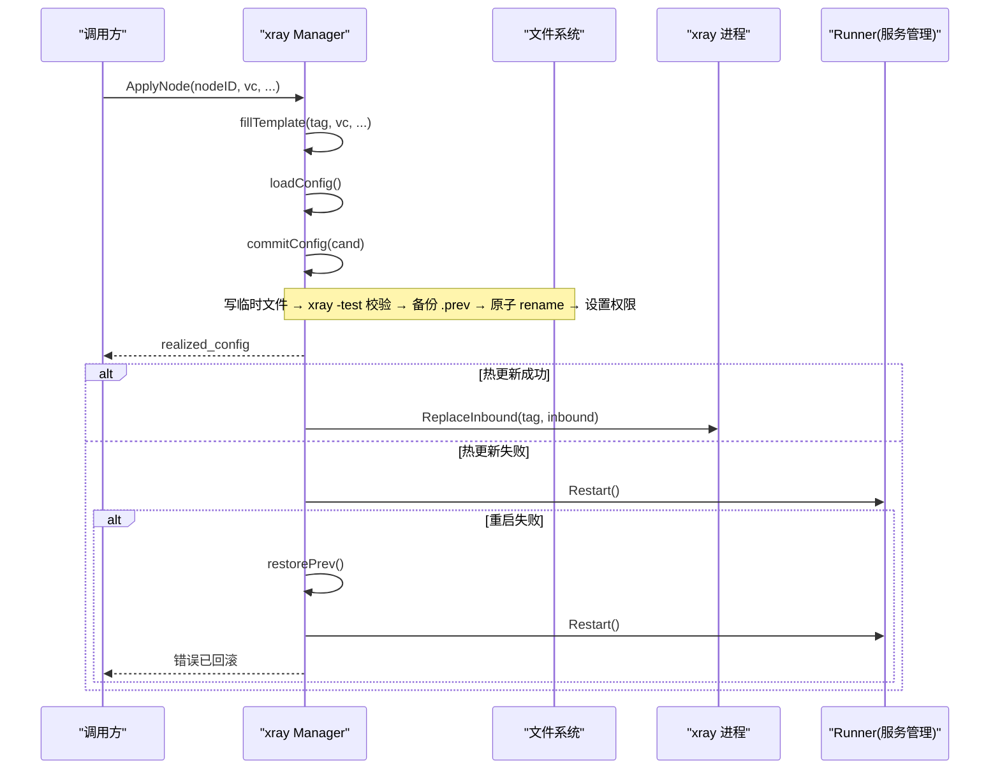

**图表来源** 
- [manager.go:109-170](file://src/agent/internal/xray/manager.go#L109-L170)
- [manager.go:235-287](file://src/agent/internal/xray/manager.go#L235-L287)
- [manager.go:319-334](file://src/agent/internal/xray/manager.go#L319-L334)
- [fill.go:20-142](file://src/agent/internal/xray/fill.go#L20-L142)

**章节来源**
- [manager.go:109-170](file://src/agent/internal/xray/manager.go#L109-L170)
- [manager.go:235-287](file://src/agent/internal/xray/manager.go#L235-L287)
- [manager.go:319-334](file://src/agent/internal/xray/manager.go#L319-L334)
- [fill.go:20-142](file://src/agent/internal/xray/fill.go#L20-L142)

## 详细组件分析

### xray 配置落盘（commitConfig）
- 临时文件：在目标目录创建临时文件写入候选配置。
- 校验：调用 xray run -test -config 对临时文件进行语法与运行时校验。
- 备份：读取当前 config.json 写入 .prev 作为回滚基线。
- 原子替换：使用 os.Rename 将临时文件重命名为最终路径。
- 权限：设置 0o600 确保仅受管用户可读写。
- 漂移基线：记录 lastHash，标记 drifted=false。

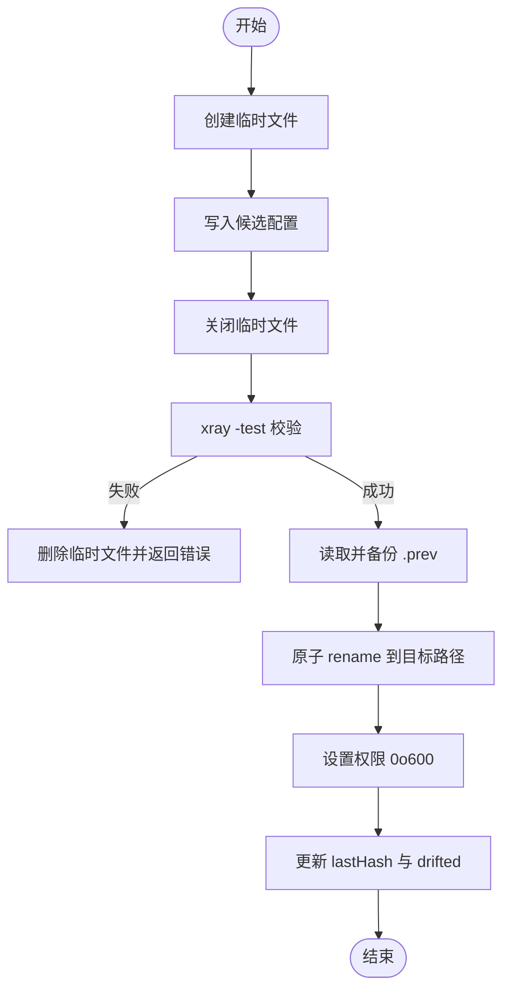

**图表来源** 
- [manager.go:235-287](file://src/agent/internal/xray/manager.go#L235-L287)

**章节来源**
- [manager.go:235-287](file://src/agent/internal/xray/manager.go#L235-L287)

### 配置漂移检测与修复（ConfigDrift / loadConfig）
- 首次调用以当前文件为基线；后续比对 lastHash。
- 文件被删除视为漂移。
- 若检测到漂移，loadConfig 以骨架 + 受管节点 inbound + chain pieces 为基，丢弃外部改动内容。
- 损坏配置自动重命名为 .broken 并重建骨架。

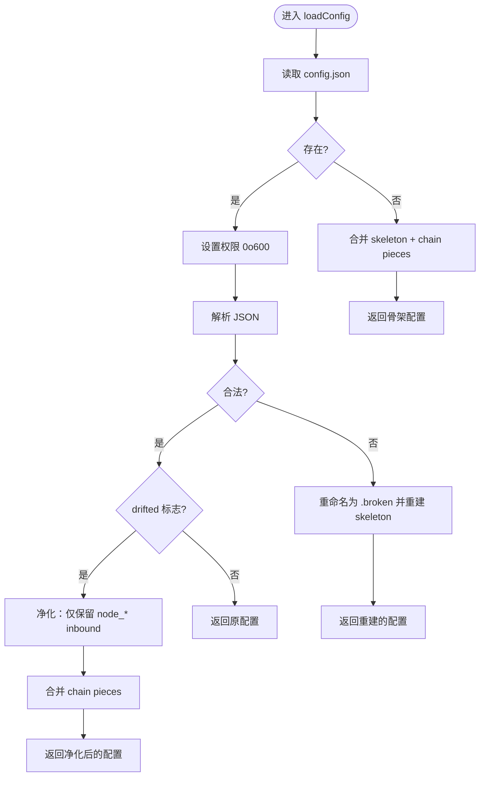

**图表来源** 
- [manager.go:336-375](file://src/agent/internal/xray/manager.go#L336-L375)

**章节来源**
- [manager.go:336-375](file://src/agent/internal/xray/manager.go#L336-L375)

### 回滚机制（restorePrev）
- 当热更新失败且重启失败时，恢复 .prev 配置并重试重启。
- 恢复后同步 lastHash，避免误报漂移。

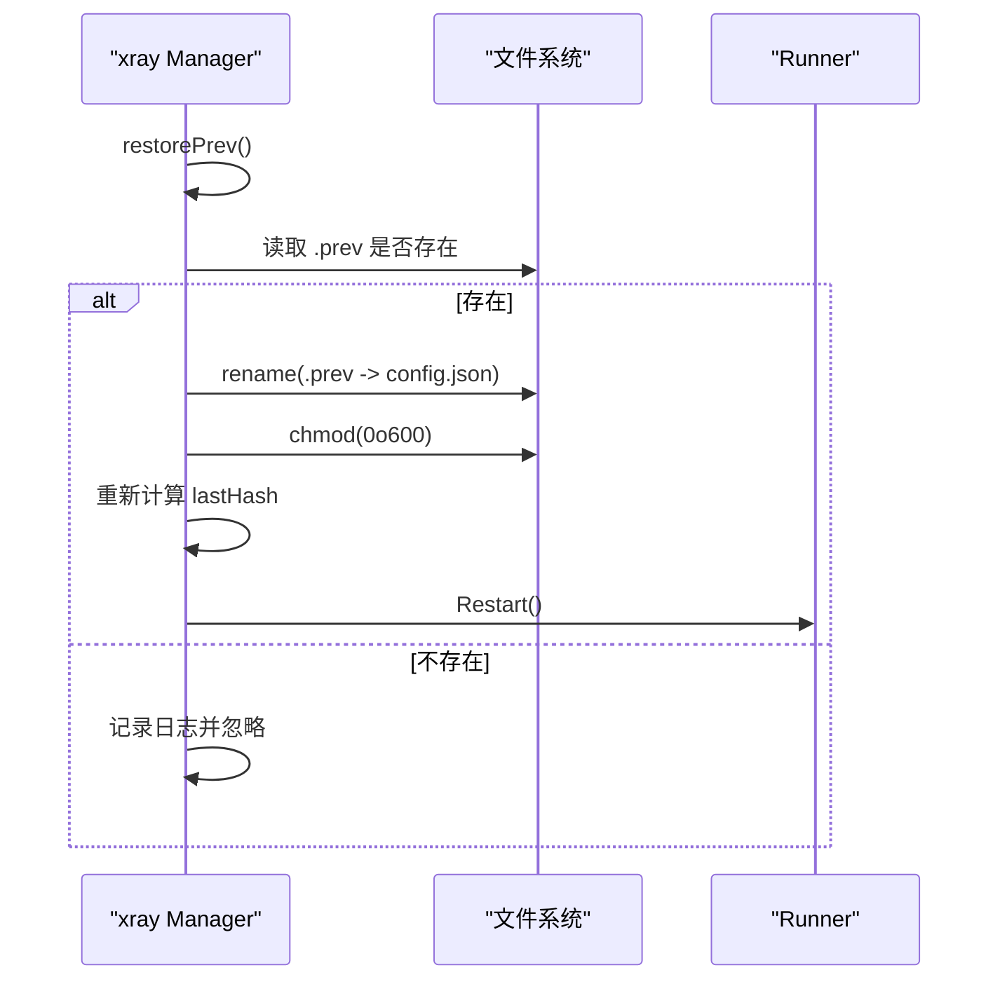

**图表来源** 
- [manager.go:319-334](file://src/agent/internal/xray/manager.go#L319-L334)

**章节来源**
- [manager.go:319-334](file://src/agent/internal/xray/manager.go#L319-L334)

### 模板填充与预检（fillTemplate）
- 填充 PORT/CLIENTS/TAG/Reality 私钥/VLESS Encryption 等占位符。
- dest 可达性预检：优先原 dest，不可达则按白名单候选逐个尝试。
- 提取 realized_config 用于上报与实际生效值确认。

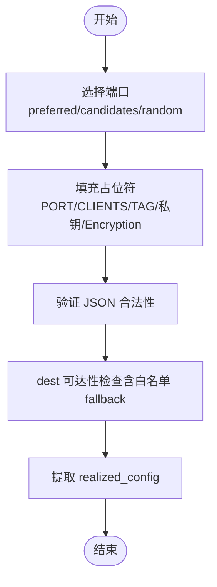

**图表来源** 
- [fill.go:20-142](file://src/agent/internal/xray/fill.go#L20-L142)

**章节来源**
- [fill.go:20-142](file://src/agent/internal/xray/fill.go#L20-L142)

### xray 升级与回滚（UpgradeXray）
- 解析 latest（镜像基址跳过 GitHub API）。
- 下载 zip 与 .dgst 校验 SHA2-256。
- 备份旧二进制（.bak），原子替换，重启并校验运行版本。
- 失败时回滚至 .bak 并尽力重启。

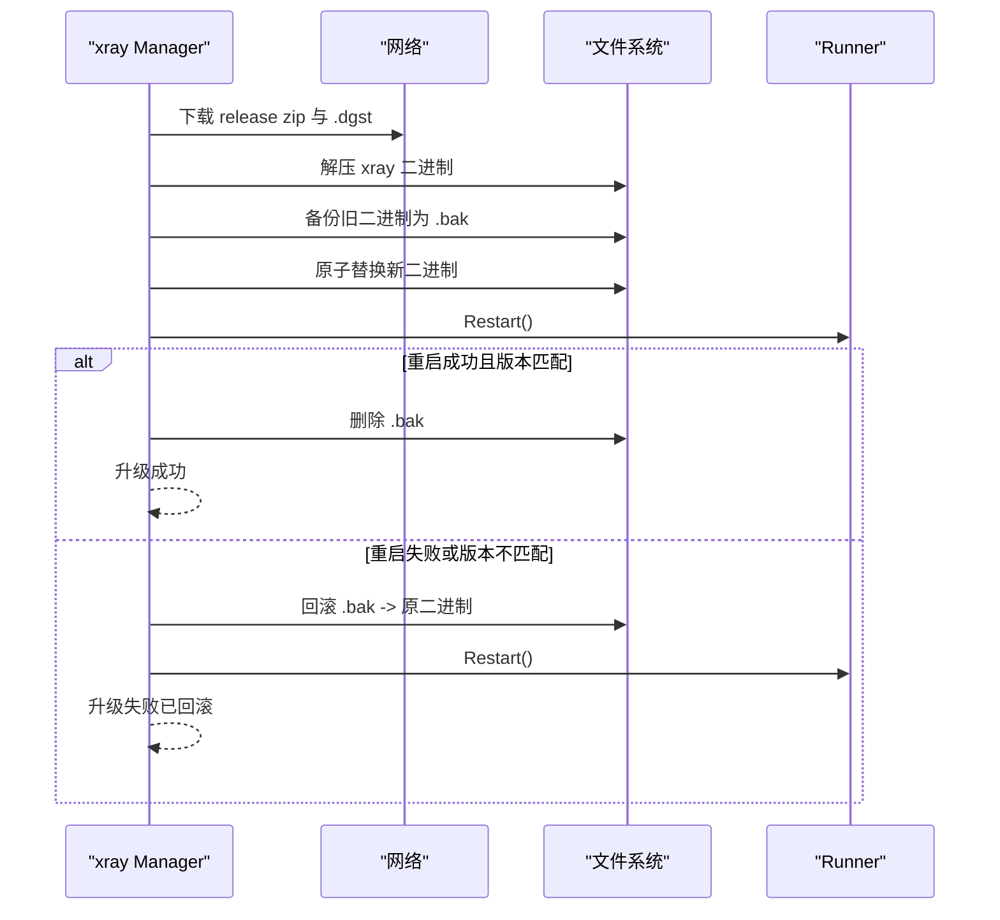

**图表来源** 
- [upgrade.go:28-113](file://src/agent/internal/xray/upgrade.go#L28-L113)

**章节来源**
- [upgrade.go:28-113](file://src/agent/internal/xray/upgrade.go#L28-L113)

### Agent 自升级（Apply）
- 下载 tarball 与 checksums.txt，校验 SHA256。
- 解压主二进制并进行 -version 自检。
- 备份当前二进制为 .bak，原子替换新二进制。
- 调用方回执后退出进程，由 systemd 拉起完成切换。

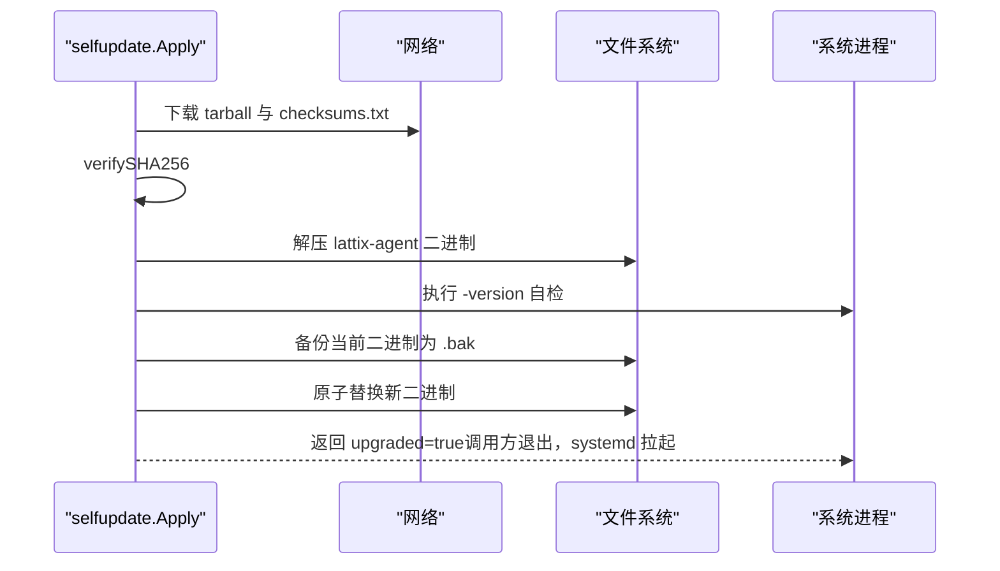

**图表来源** 
- [selfupdate.go:27-114](file://src/agent/internal/selfupdate/selfupdate.go#L27-L114)

**章节来源**
- [selfupdate.go:27-114](file://src/agent/internal/selfupdate/selfupdate.go#L27-L114)

### 面板自更新（panelUpdater.run）
- check→download→verify→extract→apply→restart。
- replaceExecutable 使用 .new/.bak 原子替换，失败时尽力恢复旧目录。
- 更新进行中通过生命周期守卫限制其他 API 操作。

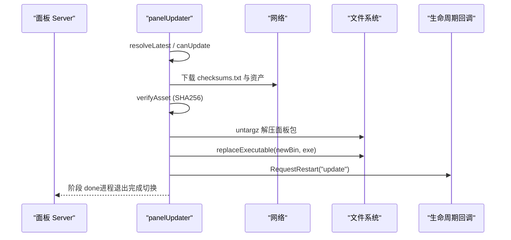

**图表来源** 
- [update.go:258-426](file://src/backend/internal/panel/update.go#L258-L426)
- [update.go:531-550](file://src/backend/internal/panel/update.go#L531-L550)

**章节来源**
- [update.go:258-426](file://src/backend/internal/panel/update.go#L258-L426)
- [update.go:531-550](file://src/backend/internal/panel/update.go#L531-L550)

### 本地状态持久化（State.Save）
- 使用 tmp+rename 原子写，权限 0o600。
- 保存 token、server_id、chain_pieces 等，供重启重建与幂等重发。

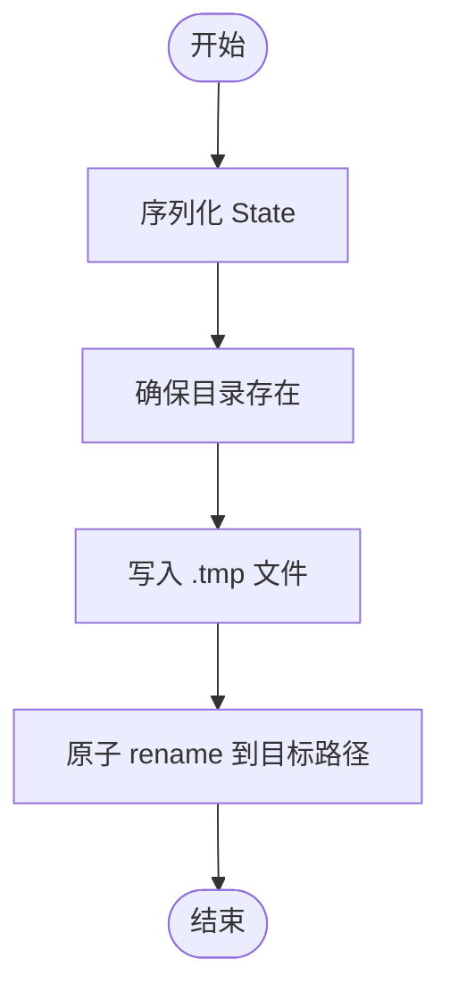

**图表来源** 
- [state.go:59-73](file://src/agent/internal/state/state.go#L59-L73)

**章节来源**
- [state.go:59-73](file://src/agent/internal/state/state.go#L59-L73)

## 依赖关系分析
- xray Manager 依赖配置模型（fullConfig）、模板填充（fillTemplate）、Runner（服务管理）、HotClient（gRPC 热操作）。
- Agent 自升级与面板自更新均依赖文件系统原子操作（tmp+rename）与外部校验（checksums.txt/.dgst）。
- 状态持久化（state.go）为 xray Manager 提供 chain_pieces 重建依据。

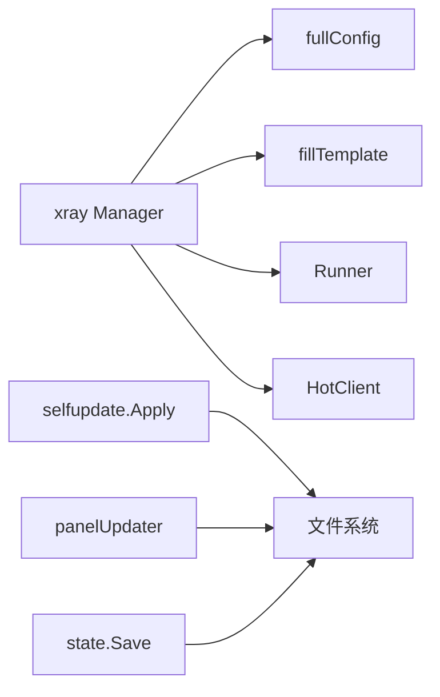

**图表来源** 
- [manager.go:1-120](file://src/agent/internal/xray/manager.go#L1-L120)
- [selfupdate.go:1-120](file://src/agent/internal/selfupdate/selfupdate.go#L1-L120)
- [update.go:1-120](file://src/backend/internal/panel/update.go#L1-L120)
- [state.go:1-80](file://src/agent/internal/state/state.go#L1-L80)

**章节来源**
- [manager.go:1-120](file://src/agent/internal/xray/manager.go#L1-L120)
- [selfupdate.go:1-120](file://src/agent/internal/selfupdate/selfupdate.go#L1-L120)
- [update.go:1-120](file://src/backend/internal/panel/update.go#L1-L120)
- [state.go:1-80](file://src/agent/internal/state/state.go#L1-L80)

## 性能考虑
- 原子替换（os.Rename）在同一文件系统上开销极低，避免跨文件系统回退导致的递归复制。
- 校验阶段前置（xray -test、checksums.txt/.dgst）可减少无效落盘与重启。
- 热更新优先（gRPC ReplaceInbound/AddUser/RemoveUser）降低重启频率。
- 配置漂移检测基于哈希比较，O(n) 读取文件大小，适合周期性 reconcile。
- 建议：
  - 将工作目录与目标目录置于同一挂载点，确保 rename 原子性。
  - 合理设置超时（下载、校验、重启），避免长时间阻塞。
  - 对大文件（如日志、备份）采用分块与增量策略。

[本节为通用指导，无需引用具体文件]

## 故障排查指南
- 配置校验失败：检查 xray -test 输出，定位模板占位符或 JSON 结构问题。
- 热更新失败：查看 HotClient 错误日志，必要时触发重启兜底。
- 回滚失败：确认 .prev 文件存在且权限正确，重试 restorePrev。
- 升级失败：检查 .dgst/checksums.txt 是否获取成功，确认二进制自检通过。
- 面板更新失败：查看阶段与百分比，确认 replaceExecutable 与生命周期回调正常。

**章节来源**
- [manager.go:235-287](file://src/agent/internal/xray/manager.go#L235-L287)
- [upgrade.go:28-113](file://src/agent/internal/xray/upgrade.go#L28-L113)
- [selfupdate.go:27-114](file://src/agent/internal/selfupdate/selfupdate.go#L27-L114)
- [update.go:258-426](file://src/backend/internal/panel/update.go#L258-L426)

## 结论
“正式落盘阶段”通过严格的临时文件写入、外部工具校验、原子替换与权限控制，结合备份与回滚机制，确保了配置与二进制部署的可靠性与一致性。多版本管理（.prev/.bak/.broken）与漂移检测进一步提升了系统的自愈能力。建议在部署环境中保持同文件系统、合理超时与监控，以获得最佳稳定性与性能。

[本节为总结，无需引用具体文件]

## 附录
- 安全最佳实践：
  - 所有落盘文件权限设置为 0o600（配置文件）或 0o755（二进制）。
  - 始终先写临时文件再原子替换，避免部分写入导致的不一致。
  - 对外部输入（模板、URL、压缩包）进行严格校验与白名单限制。
- 清理策略：
  - 升级成功后删除 .bak 备份，避免磁盘占用。
  - 损坏配置重命名为 .broken 并重建骨架，便于人工审计。
  - 定期清理临时目录与过期备份，防止资源泄漏。

[本节为补充信息，无需引用具体文件]