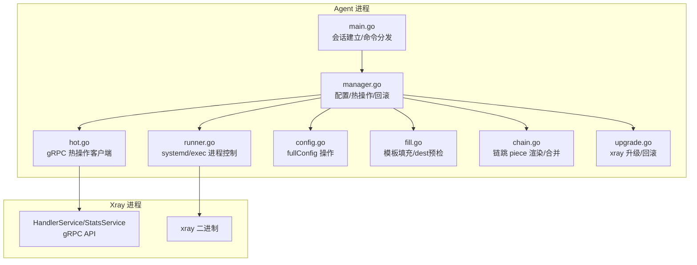
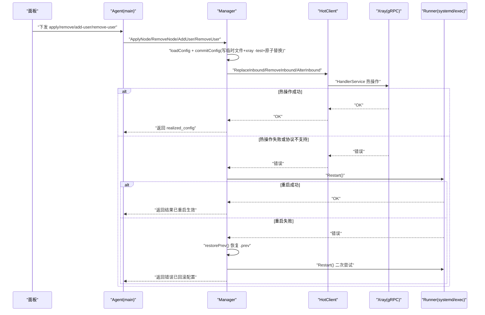
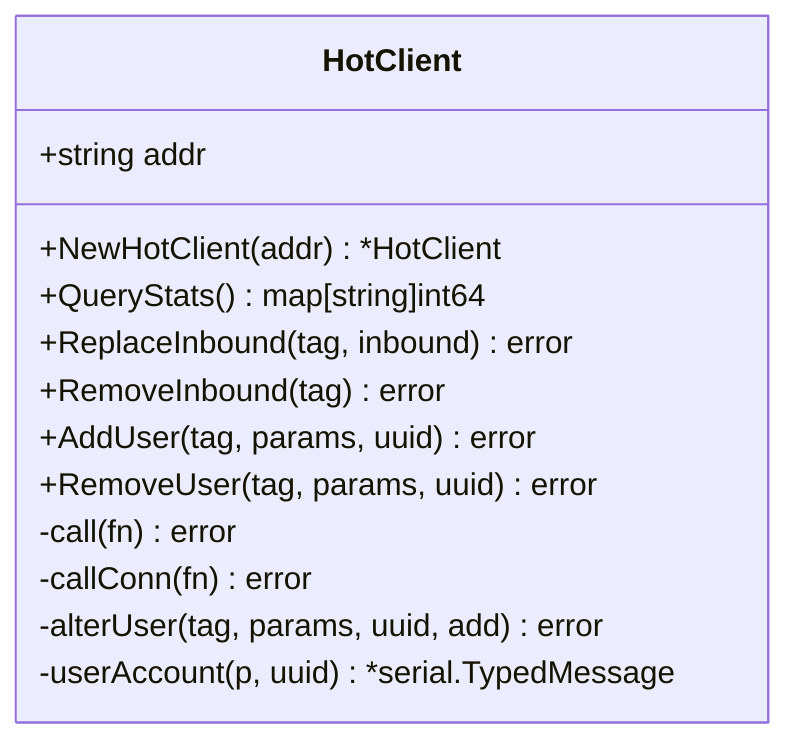
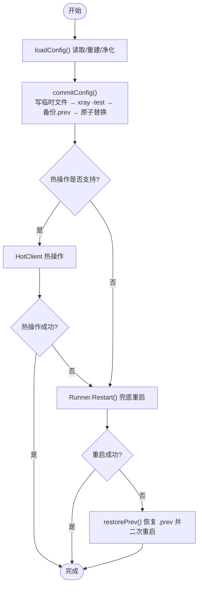
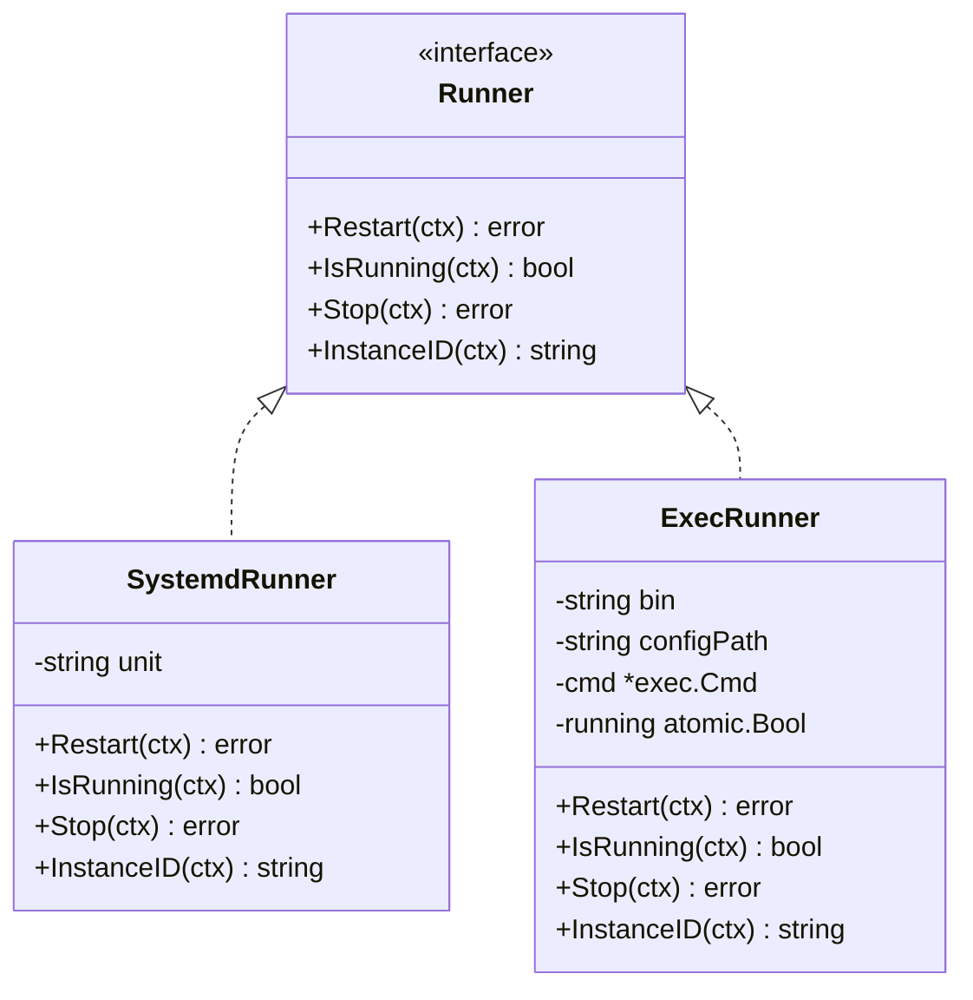
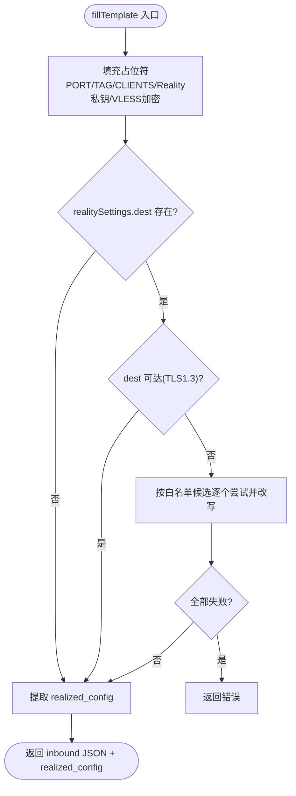
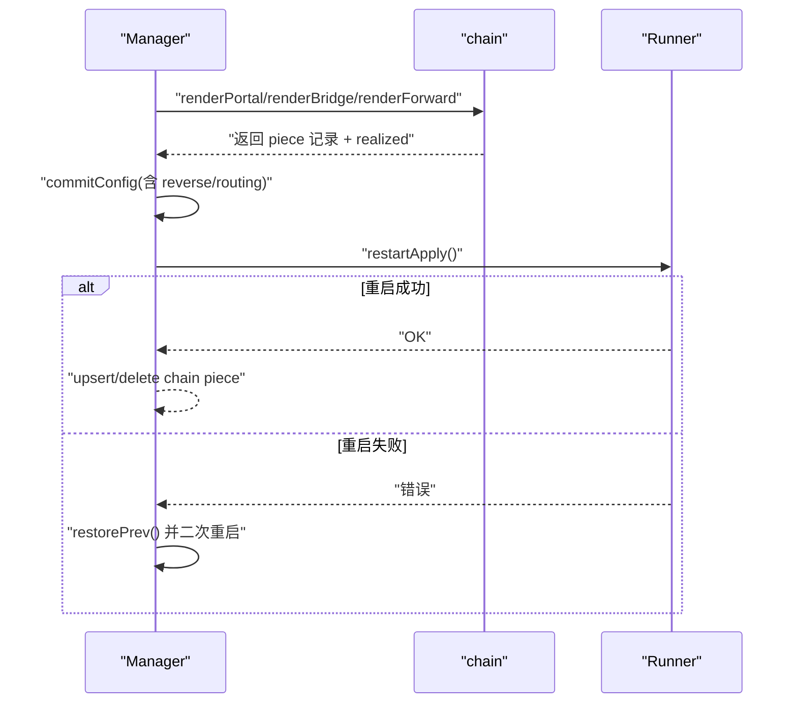
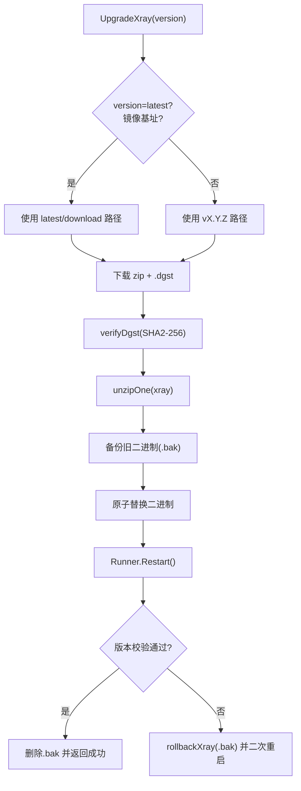
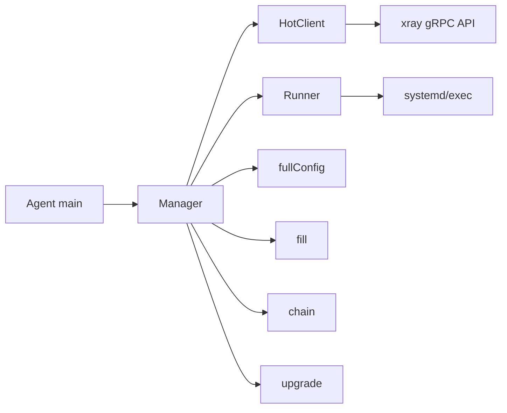

# 热更新执行阶段

<cite>
**本文引用的文件**   
- [hot.go](file://src/agent/internal/xray/hot.go)
- [manager.go](file://src/agent/internal/xray/manager.go)
- [runner.go](file://src/agent/internal/xray/runner.go)
- [config.go](file://src/agent/internal/xray/config.go)
- [chain.go](file://src/agent/internal/xray/chain.go)
- [fill.go](file://src/agent/internal/xray/fill.go)
- [upgrade.go](file://src/agent/internal/xray/upgrade.go)
- [main.go](file://src/agent/cmd/agent/main.go)
- [install-agent.sh](file://scripts/install-agent.sh)
- [graceful-shutdown-agent-settings-design.md](file://docs/graceful-shutdown-agent-settings-design.md)
</cite>

## 目录
1. [引言](#引言)
2. [项目结构](#项目结构)
3. [核心组件](#核心组件)
4. [架构总览](#架构总览)
5. [详细组件分析](#详细组件分析)
6. [依赖关系分析](#依赖关系分析)
7. [性能考量](#性能考量)
8. [故障排查指南](#故障排查指南)
9. [结论](#结论)
10. [附录](#附录)

## 引言
本章节聚焦“热更新执行阶段”的完整实现与保障机制，围绕以下目标展开：
- 零停机配置更新的实现路径：通过 xray gRPC API（HandlerService、StatsService）进行热操作；当热操作不可用或不支持时，回退到进程重启。
- 进程信号处理与服务可用性保证：在系统服务管理器（systemd）或开发模式（exec）下确保重启过程对业务影响最小化。
- 状态同步与漂移检测：基于配置哈希与骨架重建，确保外部修改被修复并恢复受管状态。
- 失败自动回滚策略：原子落盘、xray -test 校验、.prev 备份、失败后恢复上一份可用配置并二次重启。
- 监控指标与可观测性：通过 StatsService 拉取流量计数器、遥测上报实例 ID、版本与运行状态。
- 安全执行与监控示例：给出关键调用路径与日志定位方法，便于运维快速验证与排障。

## 项目结构
Agent 侧 xray 管理位于 src/agent/internal/xray，核心职责包括：
- 配置模板填充与校验（fill.go）
- 配置原子落盘与回滚（manager.go, config.go）
- 热操作客户端（gRPC HandlerService/StatsService）（hot.go）
- 进程控制抽象（systemd/exec）（runner.go）
- 链跳配置件渲染与合并（chain.go）
- 升级流程与回滚（upgrade.go）
- Agent 主循环与命令分发（main.go）
- 安装脚本与 systemd 集成（install-agent.sh）
- 优雅关停与设置同步设计（文档）

图表来源 
- [main.go:1-800](file://src/agent/cmd/agent/main.go#L1-L800)
- [manager.go:1-459](file://src/agent/internal/xray/manager.go#L1-L459)
- [hot.go:1-148](file://src/agent/internal/xray/hot.go#L1-L148)
- [runner.go:1-159](file://src/agent/internal/xray/runner.go#L1-L159)
- [config.go:1-202](file://src/agent/internal/xray/config.go#L1-L202)
- [fill.go:1-355](file://src/agent/internal/xray/fill.go#L1-L355)
- [chain.go:1-665](file://src/agent/internal/xray/chain.go#L1-L665)
- [upgrade.go:1-230](file://src/agent/internal/xray/upgrade.go#L1-L230)

章节来源
- [main.go:1-800](file://src/agent/cmd/agent/main.go#L1-L800)
- [manager.go:1-459](file://src/agent/internal/xray/manager.go#L1-L459)

## 核心组件
- Manager：编排配置变更全流程（模板填充 → 校验 → 原子落盘 → 热操作 → 重启兜底 → 回滚），维护 lastHash/drifted 基线与 chainPieces 记录。
- HotClient：封装 xray gRPC API（AddInbound/RemoveInbound/AlterInbound/AddUser/RemoveUser/QueryStats）。
- Runner：统一 Restart/IsRunning/Stop 接口，生产使用 systemd，开发使用 exec。
- fullConfig：对 config.json 的浅层表示，提供 inbounds/outbounds/reverse/routing 的增删改能力。
- fill：模板占位符替换、dest 可达性预检、端口选择、vlessenc/x25519 子命令调用。
- chain：渲染 portal/bridge/forward 三种角色配置件，合并入配置并重启生效。
- upgrade：下载、校验、原子替换 xray 二进制，失败回滚并重启。

章节来源
- [manager.go:1-459](file://src/agent/internal/xray/manager.go#L1-L459)
- [hot.go:1-148](file://src/agent/internal/xray/hot.go#L1-L148)
- [runner.go:1-159](file://src/agent/internal/xray/runner.go#L1-L159)
- [config.go:1-202](file://src/agent/internal/xray/config.go#L1-L202)
- [fill.go:1-355](file://src/agent/internal/xray/fill.go#L1-L355)
- [chain.go:1-665](file://src/agent/internal/xray/chain.go#L1-L665)
- [upgrade.go:1-230](file://src/agent/internal/xray/upgrade.go#L1-L230)

## 架构总览
热更新执行的主路径与兜底路径如下：
- 主路径（零停机）：Manager.ApplyNode/RemoveNode/AddUser/RemoveUser → HotClient 调用 gRPC API 热操作。
- 兜底路径（重启）：热操作失败或协议不支持 → Runner.Restart → 若失败则 restorePrev() 恢复 .prev 配置并再次重启。
- 链跳配置件：因涉及 reverse/routing 等无法热操作的段，一律走“落盘 → xray -test → restart → 失败回滚”。

图表来源 
- [manager.go:109-170](file://src/agent/internal/xray/manager.go#L109-L170)
- [hot.go:72-135](file://src/agent/internal/xray/hot.go#L72-L135)
- [runner.go:40-114](file://src/agent/internal/xray/runner.go#L40-L114)

章节来源
- [manager.go:109-170](file://src/agent/internal/xray/manager.go#L109-L170)
- [hot.go:72-135](file://src/agent/internal/xray/hot.go#L72-L135)
- [runner.go:40-114](file://src/agent/internal/xray/runner.go#L40-L114)

## 详细组件分析

### 组件A：热操作客户端（HotClient）
- 功能：封装 xray gRPC API 调用，包含 ReplaceInbound、RemoveInbound、AddUser、RemoveUser、QueryStats。
- 关键点：
  - 超时控制：单次 gRPC 调用默认 5s 超时。
  - 用户热操作仅支持 vless/vmess/trojan，其他协议直接报错，由上层回退重启。
  - QueryStats 用于拉取累计流量计数器（stats 启用需 policy levels["0"]）。

图表来源 
- [hot.go:27-148](file://src/agent/internal/xray/hot.go#L27-L148)

章节来源
- [hot.go:27-148](file://src/agent/internal/xray/hot.go#L27-L148)

### 组件B：配置管理与回滚（Manager + fullConfig）
- 功能：编排配置变更全流程，保证原子性与可回滚。
- 关键点：
  - commitConfig：写临时文件 → xray run -test 校验 → 备份当前为 .prev → 原子替换 → 更新 lastHash。
  - ConfigDrift：比较 lastHash 检测外部漂移；首次以当前文件为基线；删除视为漂移。
  - loadConfig：不存在或损坏时以 skeleton 重建；drifted=true 时净化保留 node_* inbound。
  - mutateClients：按 tag 增删用户列表（clients/accounts），幂等。

图表来源 
- [manager.go:235-334](file://src/agent/internal/xray/manager.go#L235-L334)
- [config.go:83-114](file://src/agent/internal/xray/config.go#L83-L114)

章节来源
- [manager.go:235-334](file://src/agent/internal/xray/manager.go#L235-L334)
- [config.go:83-114](file://src/agent/internal/xray/config.go#L83-L114)

### 组件C：进程控制（Runner）
- 功能：统一 Restart/IsRunning/Stop 接口，适配 systemd 与 exec。
- 关键点：
  - SystemdRunner：systemctl restart/is-active/stop。
  - ExecRunner：杀掉旧子进程、清理孤儿、拉起新进程、观察启动健康。
  - InstanceID：systemd 通过 MainPID 获取，exec 通过 /proc/pid/stat 解析 starttime。

图表来源 
- [runner.go:16-159](file://src/agent/internal/xray/runner.go#L16-L159)

章节来源
- [runner.go:16-159](file://src/agent/internal/xray/runner.go#L16-L159)

### 组件D：模板填充与预检（fill）
- 功能：填充模板占位符（PORT/TAG/CLIENTS/Reality 私钥/VLESS Encryption）、dest 可达性预检、端口选择。
- 关键点：
  - ensureDestReachable：TLS1.3 握手探测，失败则按候选白名单逐个尝试并改写 dest/serverNames。
  - pickPort：优先指定端口，其次候选段，最后随机空闲端口。
  - vlessEnc/x25519：调用 xray 子命令生成加密参数与密钥对。

图表来源 
- [fill.go:23-142](file://src/agent/internal/xray/fill.go#L23-L142)
- [fill.go:170-223](file://src/agent/internal/xray/fill.go#L170-L223)
- [fill.go:247-276](file://src/agent/internal/xray/fill.go#L247-L276)

章节来源
- [fill.go:23-142](file://src/agent/internal/xray/fill.go#L23-L142)
- [fill.go:170-223](file://src/agent/internal/xray/fill.go#L170-L223)
- [fill.go:247-276](file://src/agent/internal/xray/fill.go#L247-L276)

### 组件E：链跳配置件（chain）
- 功能：渲染 portal/bridge/forward 三种角色，合并入配置，重启生效。
- 关键点：
  - ApplyChainHop/RemoveChainHop：渲染 → 合并 → commitConfig → restartApply（失败回滚）。
  - mergePieces：重启重建 config.json 时，将链 piece 记录并入骨架。
  - removeChainPieceItems：移除 inbound/outbound/reverse/routing 引用，保持幂等。

图表来源 
- [chain.go:82-154](file://src/agent/internal/xray/chain.go#L82-L154)
- [chain.go:632-664](file://src/agent/internal/xray/chain.go#L632-L664)

章节来源
- [chain.go:82-154](file://src/agent/internal/xray/chain.go#L82-L154)
- [chain.go:632-664](file://src/agent/internal/xray/chain.go#L632-L664)

### 组件F：升级与回滚（upgrade）
- 功能：下载 xray release 包与 .dgst，校验 SHA2-256，原子替换二进制，重启并校验版本。
- 关键点：
  - latest 解析：镜像基址时跳过 GitHub API，直接 latest/download 约定。
  - rollbackXray：从 .bak 恢复旧二进制并尽力重启。

图表来源 
- [upgrade.go:28-113](file://src/agent/internal/xray/upgrade.go#L28-L113)
- [upgrade.go:115-124](file://src/agent/internal/xray/upgrade.go#L115-L124)

章节来源
- [upgrade.go:28-113](file://src/agent/internal/xray/upgrade.go#L28-L113)
- [upgrade.go:115-124](file://src/agent/internal/xray/upgrade.go#L115-L124)

### 组件G：Agent 主循环与命令分发（main）
- 功能：建立 WS 长连接、会话认证、遥测与漂移检测、命令分发（apply/remove/add-user/remove-user/upgrade）。
- 关键点：
  - handle：根据 Type 分发到 mgr 对应方法，并回复结果。
  - drift detection：定时检查 ConfigDrift 并上报。
  - telemetry：周期性上报 xray 版本、运行状态、延迟等。

章节来源
- [main.go:532-671](file://src/agent/cmd/agent/main.go#L532-L671)
- [main.go:316-358](file://src/agent/cmd/agent/main.go#L316-L358)

## 依赖关系分析
- Manager 依赖 HotClient（gRPC 热操作）、Runner（进程控制）、fullConfig（配置操作）、fill（模板填充）、chain（链跳渲染）、upgrade（升级）。
- HotClient 依赖 xray gRPC API（HandlerService/StatsService）。
- Runner 依赖系统工具（systemctl 或 exec/pgrep/pkill）。
- main 依赖 state/settings 持久化、shared 消息协议。

图表来源 
- [manager.go:1-459](file://src/agent/internal/xray/manager.go#L1-L459)
- [hot.go:1-148](file://src/agent/internal/xray/hot.go#L1-L148)
- [runner.go:1-159](file://src/agent/internal/xray/runner.go#L1-L159)

章节来源
- [manager.go:1-459](file://src/agent/internal/xray/manager.go#L1-L459)
- [hot.go:1-148](file://src/agent/internal/xray/hot.go#L1-L148)
- [runner.go:1-159](file://src/agent/internal/xray/runner.go#L1-L159)

## 性能考量
- 热操作超时：gRPC 调用默认 5s，避免阻塞主路径。
- 配置校验：xray -test 在内存中校验，避免写入坏配置。
- 原子替换：rename 原子性保证并发读不读到半写状态。
- 重启观察：ExecRunner 启动后 500ms 观察健康，尽早发现“启动即崩”。
- 遥测采样：StatsService 拉取累计值，结合 instance_id 区分不同进程实例。

[本节为通用指导，无需特定文件引用]

## 故障排查指南
- 热操作失败日志：查看 manager 日志中的 “hot apply/remove failed (fallback to restart)” 与具体错误信息。
- 重启失败回滚：确认 .prev 是否存在，restorePrev 是否成功，二次重启是否成功。
- 配置漂移：检查 ConfigDrift 上报与净化日志，确认 node_* inbound 是否保留。
- 遥测不可用：确认 policy/stats/StatsService 是否启用，EnsureTelemetryFeatures 是否触发重启。
- 升级失败：检查 .dgst 校验、二进制替换、版本校验与 rollbackXray 日志。
- 信号与优雅关停：参考 graceful-shutdown 设计，确认 systemd 单元与超时配置。

章节来源
- [manager.go:109-170](file://src/agent/internal/xray/manager.go#L109-L170)
- [manager.go:289-334](file://src/agent/internal/xray/manager.go#L289-L334)
- [manager.go:404-458](file://src/agent/internal/xray/manager.go#L404-L458)
- [upgrade.go:115-124](file://src/agent/internal/xray/upgrade.go#L115-L124)
- [graceful-shutdown-agent-settings-design.md:1-154](file://docs/graceful-shutdown-agent-settings-design.md#L1-L154)

## 结论
热更新执行阶段通过“热操作为主、重启兜底、原子落盘、自动回滚”的组合策略，实现了零停机配置更新与高可用保障。配合遥测与漂移检测，可在复杂环境下稳定运行。运维可通过日志与指标快速定位问题，必要时借助 .prev/.bak 恢复。

[本节为总结，无需特定文件引用]

## 附录

### 安全执行热更新的步骤建议
- 准备阶段：
  - 确保 xray 二进制与配置文件权限正确（0o600/0o755）。
  - 确认 gRPC API 地址与端口可用。
- 执行阶段：
  - 调用 Manager.ApplyNode/RemoveNode/AddUser/RemoveUser。
  - 观察日志与返回值，确认热操作成功或进入兜底重启。
- 验证阶段：
  - 通过 QueryStats 拉取计数器，确认流量统计正常。
  - 通过 Version/IsRunning 确认进程状态。
- 回滚阶段：
  - 如重启失败，确认 .prev 恢复与二次重启结果。
  - 升级失败时检查 .bak 恢复。

章节来源
- [manager.go:235-334](file://src/agent/internal/xray/manager.go#L235-L334)
- [hot.go:57-135](file://src/agent/internal/xray/hot.go#L57-L135)
- [runner.go:40-114](file://src/agent/internal/xray/runner.go#L40-L114)
- [upgrade.go:28-113](file://src/agent/internal/xray/upgrade.go#L28-L113)

### 监控指标与可观测性
- 遥测上报：xray 版本、运行状态、延迟、实例 ID。
- 流量计数器：StatsService.QueryStats 返回累计值（键名→值）。
- 漂移检测：ConfigDrift 上报 drifted=true/false。
- 健康检查：systemd is-active、/healthz、/readyz。

章节来源
- [manager.go:86-107](file://src/agent/internal/xray/manager.go#L86-L107)
- [hot.go:57-70](file://src/agent/internal/xray/hot.go#L57-L70)
- [main.go:316-358](file://src/agent/cmd/agent/main.go#L316-L358)

### 安装与系统集成要点
- install-agent.sh：注册 systemd 单元、生成守护脚本、设置自启。
- xray 二进制与配置文件路径：-xray-bin、-xray-config、-xray-api。
- runner 模式：systemd（生产）或 exec（开发）。

章节来源
- [install-agent.sh:267-426](file://scripts/install-agent.sh#L267-L426)
- [main.go:33-53](file://src/agent/cmd/agent/main.go#L33-L53)