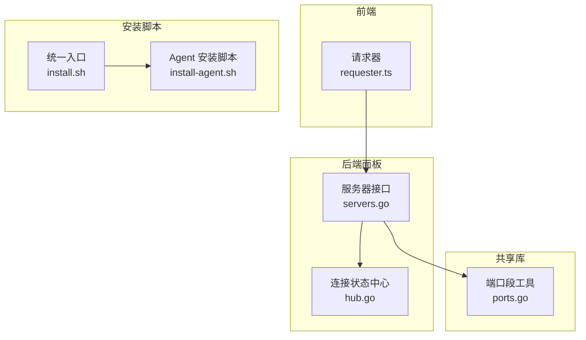
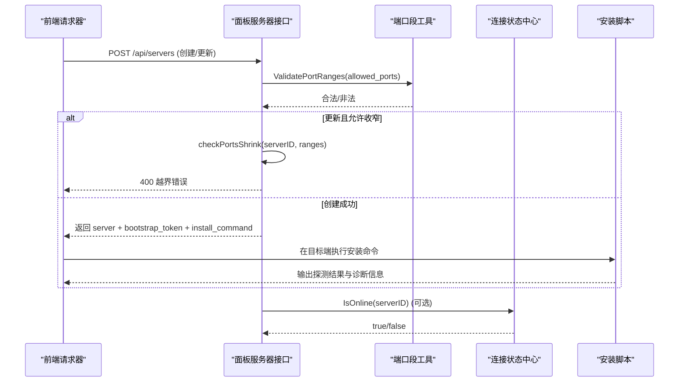
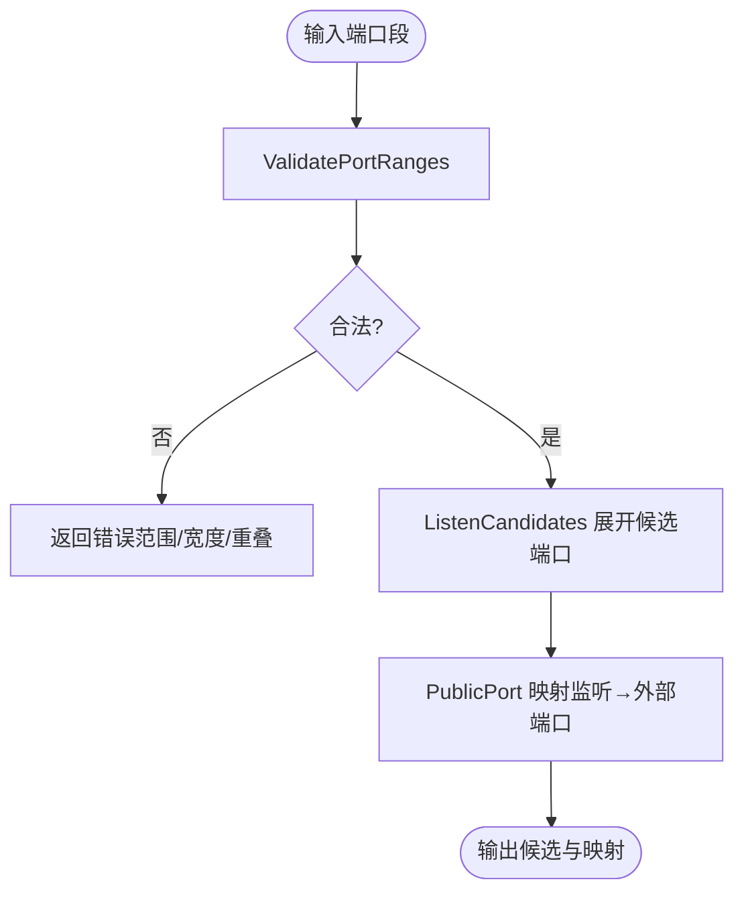
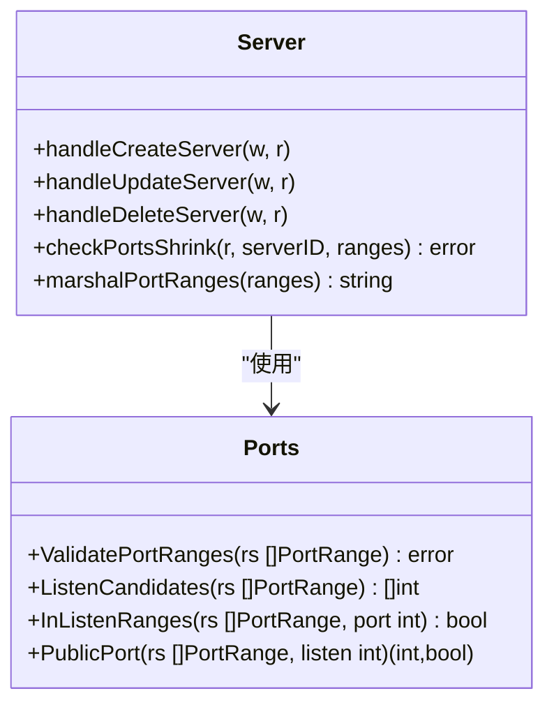
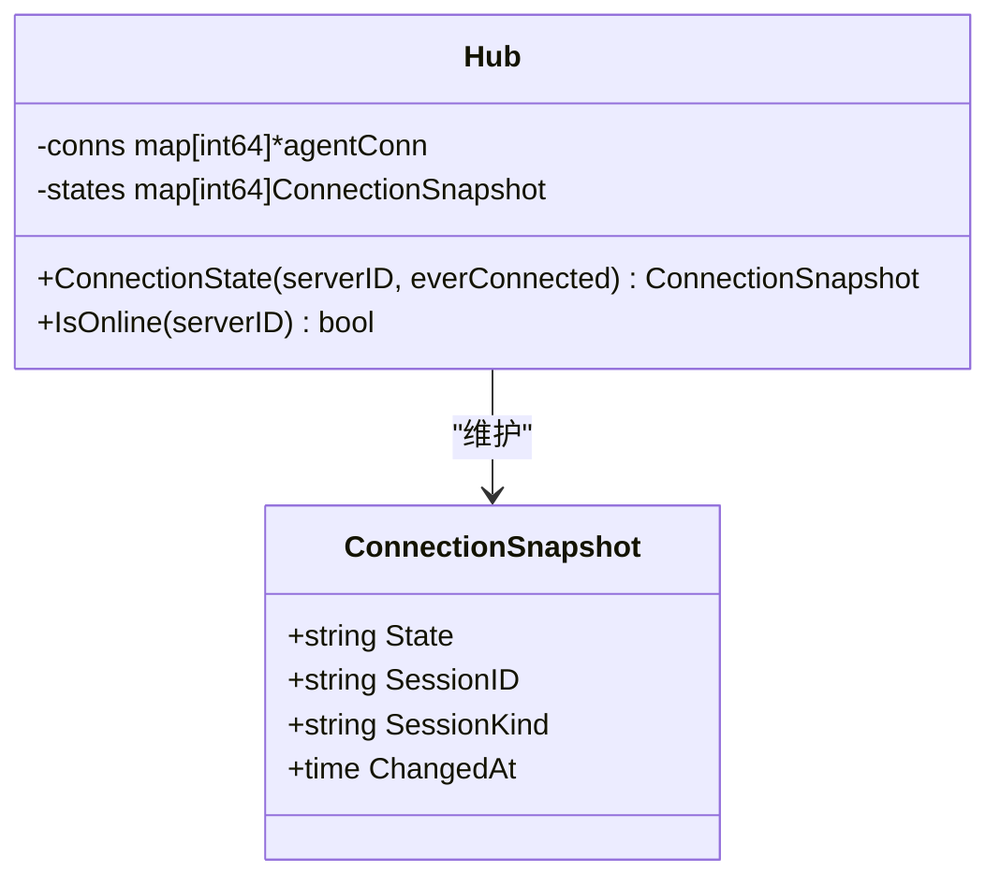
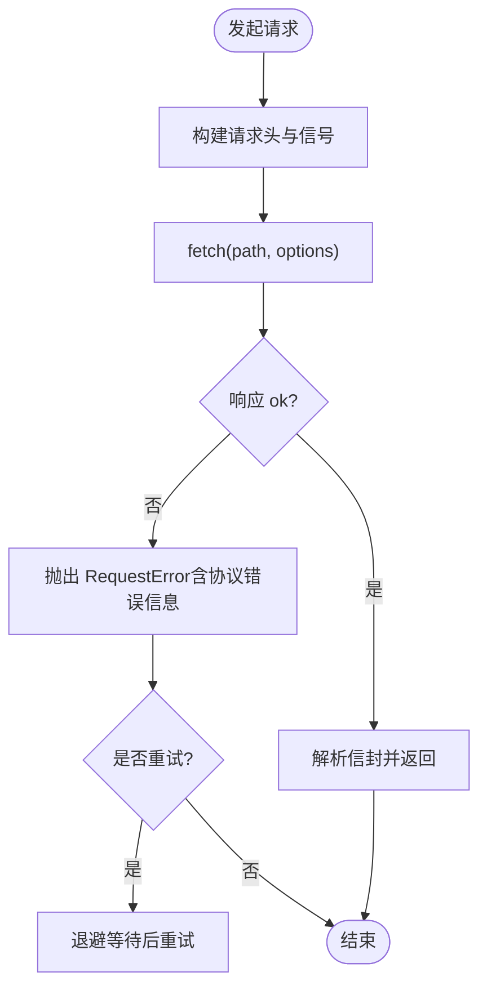
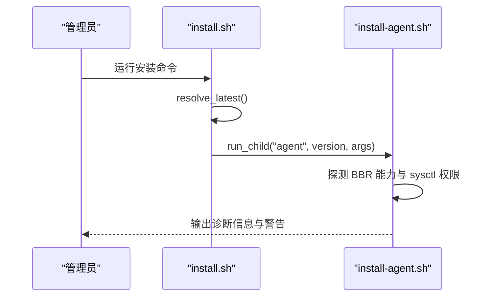
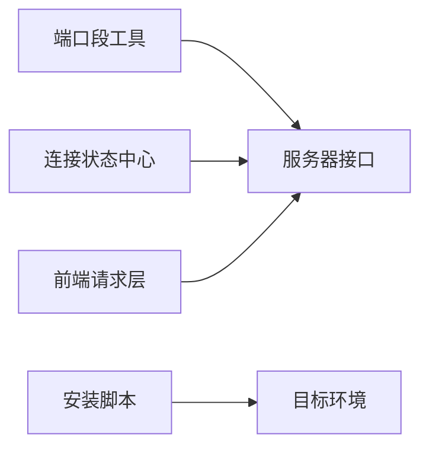

# 目标预检阶段

<cite>
**本文引用的文件**   
- [servers.go](file://src/backend/internal/panel/servers.go)
- [ports.go](file://src/shared/ports.go)
- [hub.go](file://src/backend/internal/ws/hub.go)
- [requester.ts](file://src/frontend/src/lib/requester.ts)
- [install.sh](file://install.sh)
- [install-agent.sh](file://scripts/install-agent.sh)
</cite>

## 目录
1. [简介](#简介)
2. [项目结构](#项目结构)
3. [核心组件](#核心组件)
4. [架构总览](#架构总览)
5. [详细组件分析](#详细组件分析)
6. [依赖关系分析](#依赖关系分析)
7. [性能考量](#性能考量)
8. [故障排查指南](#故障排查指南)
9. [结论](#结论)

## 简介
本章节聚焦“目标预检阶段”，即节点应用流水线中的第一个处理阶段：在部署与下发配置之前，验证目标服务器的可达性与端口可用性。该阶段负责：
- 网络连通性探测（主机可达、DNS解析、基础 TCP 握手）
- 端口占用与防火墙规则校验（监听端口是否可用、外部端口映射是否生效）
- 失败时的错误处理策略与重试机制
- 预检结果对后续流水线执行的影响（阻断或继续）
- 失败时提供详细的诊断信息（便于快速定位问题）

在本项目中，预检逻辑主要体现为面板侧的端口段管理与在线状态判定，以及前端请求层的超时与重试控制；安装脚本则承担目标环境的基础能力检查与 BBR 等系统参数探测。

## 项目结构
围绕目标预检的相关代码分布在以下位置：
- 后端面板服务：服务器管理、端口段校验、在线状态聚合
- 共享库：端口段定义与校验工具
- 前端请求层：HTTP 请求重试、超时与错误封装
- 安装脚本：目标环境能力探测（如 BBR）、基础依赖检测

**图表来源** 
- [servers.go:208-322](file://src/backend/internal/panel/servers.go#L208-L322)
- [ports.go:1-115](file://src/shared/ports.go#L1-L115)
- [hub.go:48-108](file://src/backend/internal/ws/hub.go#L48-L108)
- [requester.ts:169-201](file://src/frontend/src/lib/requester.ts#L169-L201)
- [install.sh:1-146](file://install.sh#L1-L146)
- [install-agent.sh:113-123](file://scripts/install-agent.sh#L113-L123)

**章节来源**
- [servers.go:208-322](file://src/backend/internal/panel/servers.go#L208-L322)
- [ports.go:1-115](file://src/shared/ports.go#L1-L115)
- [hub.go:48-108](file://src/backend/internal/ws/hub.go#L48-L108)
- [requester.ts:169-201](file://src/frontend/src/lib/requester.ts#L169-L201)
- [install.sh:1-146](file://install.sh#L1-L146)
- [install-agent.sh:113-123](file://scripts/install-agent.sh#L113-L123)

## 核心组件
- 端口段与校验（shared/ports.go）
  - 定义 PortRange（外部段与监听段映射），提供 ValidatePortRanges、ListenCandidates、InListenRanges、PublicPort 等工具函数
  - 用于面板创建/更新服务器时校验端口段合法性，以及后续分配与订阅时计算对外端口
- 服务器管理（backend/internal/panel/servers.go）
  - handleCreateServer：创建服务器并生成 bootstrap token 与安装命令
  - handleUpdateServer：更新地址与端口段，包含端口收窄校验 checkPortsShrink
  - checkPortsShrink：确保存量节点与链跳端口在新端口段内，越界返回 400
  - handleDeleteServer：删除前尝试卸载 agent/xray，支持重试与审计
- 连接状态（backend/internal/ws/hub.go）
  - Hub 维护 agent 连接快照与在线状态，IsOnline 用于判断目标是否可通信
- 前端请求层（frontend/src/lib/requester.ts）
  - 实现带超时与重试的请求封装，失败时抛出结构化错误（含 HTTP 状态码、traceId 等）
- 安装脚本（install.sh, scripts/install-agent.sh）
  - install.sh：解析版本、拉取子脚本、交互式向导
  - install-agent.sh：探测 BBR 能力、sysctl 权限与拥塞算法设置结果

**章节来源**
- [ports.go:1-115](file://src/shared/ports.go#L1-L115)
- [servers.go:208-322](file://src/backend/internal/panel/servers.go#L208-L322)
- [servers.go:385-536](file://src/backend/internal/panel/servers.go#L385-L536)
- [servers.go:538-585](file://src/backend/internal/panel/servers.go#L538-L585)
- [servers.go:800-859](file://src/backend/internal/panel/servers.go#L800-L859)
- [hub.go:48-108](file://src/backend/internal/ws/hub.go#L48-L108)
- [requester.ts:169-201](file://src/frontend/src/lib/requester.ts#L169-L201)
- [install.sh:1-146](file://install.sh#L1-L146)
- [install-agent.sh:113-123](file://scripts/install-agent.sh#L113-L123)

## 架构总览
目标预检阶段的整体流程如下：
- 前端发起创建/更新服务器请求，携带 alias、address、machine_type、allowed_ports 等
- 后端校验端口段合法性（ValidatePortRanges），并在更新时进行端口收窄校验（checkPortsShrink）
- 若需要，通过 hub.IsOnline 判断目标 agent 是否在线，辅助决策
- 安装脚本在目标端执行，探测基础能力（如 BBR），并输出诊断信息
- 前端请求层具备超时与重试，失败时返回结构化错误，便于用户定位

**图表来源** 
- [servers.go:208-322](file://src/backend/internal/panel/servers.go#L208-L322)
- [servers.go:385-536](file://src/backend/internal/panel/servers.go#L385-L536)
- [ports.go:1-115](file://src/shared/ports.go#L1-L115)
- [hub.go:48-108](file://src/backend/internal/ws/hub.go#L48-L108)
- [install.sh:1-146](file://install.sh#L1-L146)

## 详细组件分析

### 端口段与校验（shared/ports.go）
- PortRange：外部段 [PubStart,PubEnd] 映射到内部监听段 [ListenStart,ListenEnd]；当 ListenStart/ListenEnd 为 0 表示 1:1 映射
- ValidatePortRanges：校验端口段合法性（范围、宽度一致、无重叠）
- ListenCandidates：展开监听侧候选端口列表（供 Agent 按序挑选空闲端口）
- InListenRanges：判断端口是否落在某段的监听侧（用于建节点/建链指定端口与 PATCH 收窄校验）
- PublicPort：将监听端口映射为外部端口（订阅取 public_port）

**图表来源** 
- [ports.go:1-115](file://src/shared/ports.go#L1-L115)

**章节来源**
- [ports.go:1-115](file://src/shared/ports.go#L1-L115)

### 服务器管理接口（backend/internal/panel/servers.go）
- handleCreateServer：校验 machine_type、allowed_ports、地理信息，生成 bootstrap token 与安装命令
- handleUpdateServer：支持修改 alias、address、allowed_ports、tags、country_code、location、billing、traffic_plan
  - 端口收窄校验 checkPortsShrink：确保存量节点与链跳端口不越界，越界返回 400
- handleDeleteServer：在线则先下发 uninstall 命令（支持重试），随后级联删除记录

**图表来源** 
- [servers.go:208-322](file://src/backend/internal/panel/servers.go#L208-L322)
- [servers.go:385-536](file://src/backend/internal/panel/servers.go#L385-L536)
- [servers.go:538-585](file://src/backend/internal/panel/servers.go#L538-L585)
- [ports.go:1-115](file://src/shared/ports.go#L1-L115)

**章节来源**
- [servers.go:208-322](file://src/backend/internal/panel/servers.go#L208-L322)
- [servers.go:385-536](file://src/backend/internal/panel/servers.go#L385-L536)
- [servers.go:538-585](file://src/backend/internal/panel/servers.go#L538-L585)

### 连接状态与在线判定（backend/internal/ws/hub.go）
- Hub 维护 agent 连接快照与在线状态
- ConnectionState：根据连接与历史连接推断状态（从未连接/离线/在线）
- IsOnline：直接判断当前是否存在活跃连接

**图表来源** 
- [hub.go:48-108](file://src/backend/internal/ws/hub.go#L48-L108)

**章节来源**
- [hub.go:48-108](file://src/backend/internal/ws/hub.go#L48-L108)

### 前端请求层与重试（frontend/src/lib/requester.ts）
- 实现带超时与重试的 HTTP 请求封装
- 失败时抛出 RequestError，包含 code、message、httpStatus、requestId、traceId 等
- 适用于预检阶段的前端调用（如创建/更新服务器、查询状态）

**图表来源** 
- [requester.ts:169-201](file://src/frontend/src/lib/requester.ts#L169-L201)

**章节来源**
- [requester.ts:169-201](file://src/frontend/src/lib/requester.ts#L169-L201)

### 安装脚本与环境探测（install.sh, scripts/install-agent.sh）
- install.sh：解析最新版本、拉取子脚本、交互式向导（选择 Docker Compose 或原生二进制）
- install-agent.sh：探测 BBR 能力，设置 sysctl 参数，输出警告信息（如权限不足或当前拥塞算法未生效）

**图表来源** 
- [install.sh:1-146](file://install.sh#L1-L146)
- [install-agent.sh:113-123](file://scripts/install-agent.sh#L113-L123)

**章节来源**
- [install.sh:1-146](file://install.sh#L1-L146)
- [install-agent.sh:113-123](file://scripts/install-agent.sh#L113-L123)

## 依赖关系分析
- 端口段工具被服务器管理接口广泛使用，用于创建/更新时的合法性校验与收窄校验
- 连接状态中心为服务器管理提供在线判定能力，辅助预检与运维决策
- 前端请求层为所有 API 调用提供统一的超时与重试机制，提升鲁棒性
- 安装脚本在目标端执行，完成环境探测与能力检查，为后续部署提供依据

**图表来源** 
- [ports.go:1-115](file://src/shared/ports.go#L1-L115)
- [servers.go:208-322](file://src/backend/internal/panel/servers.go#L208-L322)
- [hub.go:48-108](file://src/backend/internal/ws/hub.go#L48-L108)
- [requester.ts:169-201](file://src/frontend/src/lib/requester.ts#L169-L201)
- [install.sh:1-146](file://install.sh#L1-L146)

**章节来源**
- [ports.go:1-115](file://src/shared/ports.go#L1-L115)
- [servers.go:208-322](file://src/backend/internal/panel/servers.go#L208-L322)
- [hub.go:48-108](file://src/backend/internal/ws/hub.go#L48-L108)
- [requester.ts:169-201](file://src/frontend/src/lib/requester.ts#L169-L201)
- [install.sh:1-146](file://install.sh#L1-L146)

## 性能考量
- 端口段校验为 O(n^2) 的重叠检查（n 为端口段数量），由于 n 通常很小，性能影响可忽略
- ListenCandidates 展开候选端口为线性复杂度，适合小范围端口段
- 前端请求层默认超时 15 秒，可根据网络状况调整；重试策略应避免雪崩
- 安装脚本的环境探测应尽量减少阻塞操作，必要时异步化

[本节为通用指导，无需特定文件引用]

## 故障排查指南
- 端口段收窄越界（400）
  - 现象：更新 allowed_ports 时报错“端口段收窄后节点/链跳端口越界”
  - 排查：检查存量节点与链跳的指定/realized 端口是否在新端口段内
  - 解决：扩大端口段或迁移端口后再收窄
- 目标不可达
  - 现象：创建/更新请求超时或协议错误
  - 排查：确认 DNS 解析、防火墙规则、NAT 映射是否正确；使用 IsOnline 判断 agent 在线状态
  - 解决：修正网络配置或放行端口
- 安装脚本探测失败
  - 现象：BBR 设置被拒绝或当前拥塞算法未生效
  - 排查：检查 sysctl 权限与内核支持；查看脚本输出的警告信息
  - 解决：提升权限或更换内核/驱动

**章节来源**
- [servers.go:538-585](file://src/backend/internal/panel/servers.go#L538-L585)
- [hub.go:48-108](file://src/backend/internal/ws/hub.go#L48-L108)
- [install-agent.sh:113-123](file://scripts/install-agent.sh#L113-L123)

## 结论
目标预检阶段通过端口段校验、在线状态判定与安装脚本环境探测，确保目标服务器在网络连通性与端口可用性方面满足部署要求。失败时提供结构化错误与诊断信息，结合前端重试机制，提升整体鲁棒性与用户体验。建议在大规模部署中进一步优化端口扫描与网络探测的性能，并完善错误分类与自动修复建议。

[本节为总结，无需特定文件引用]