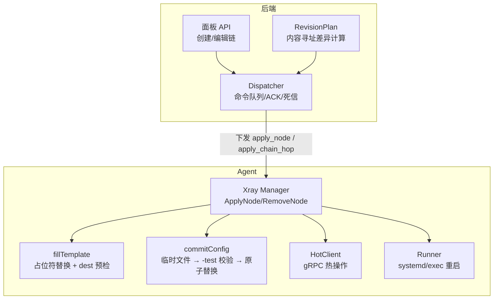
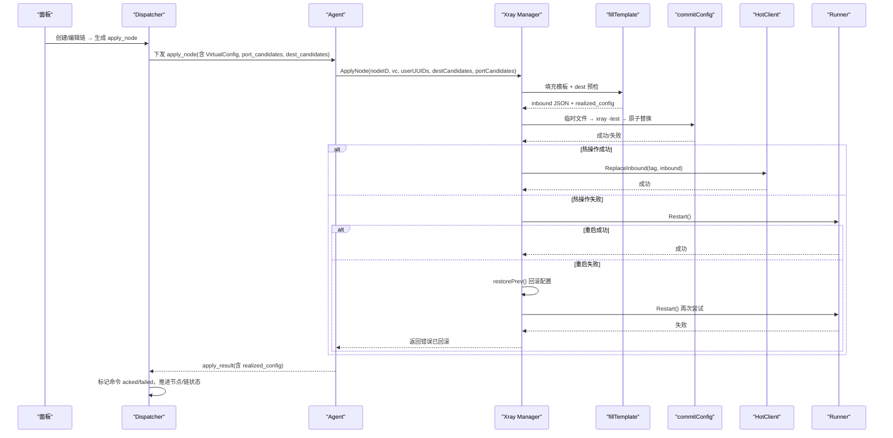
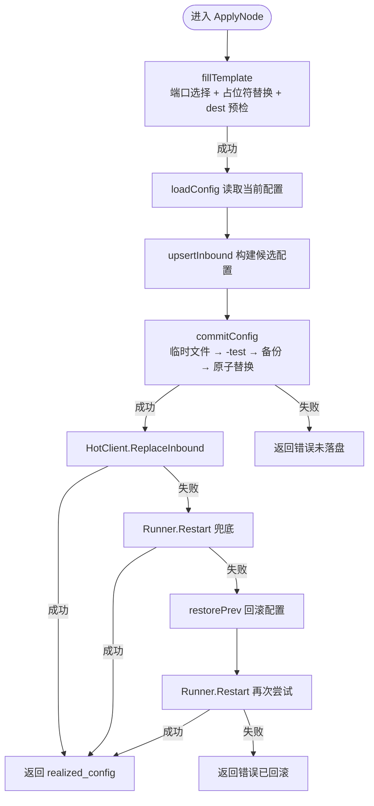
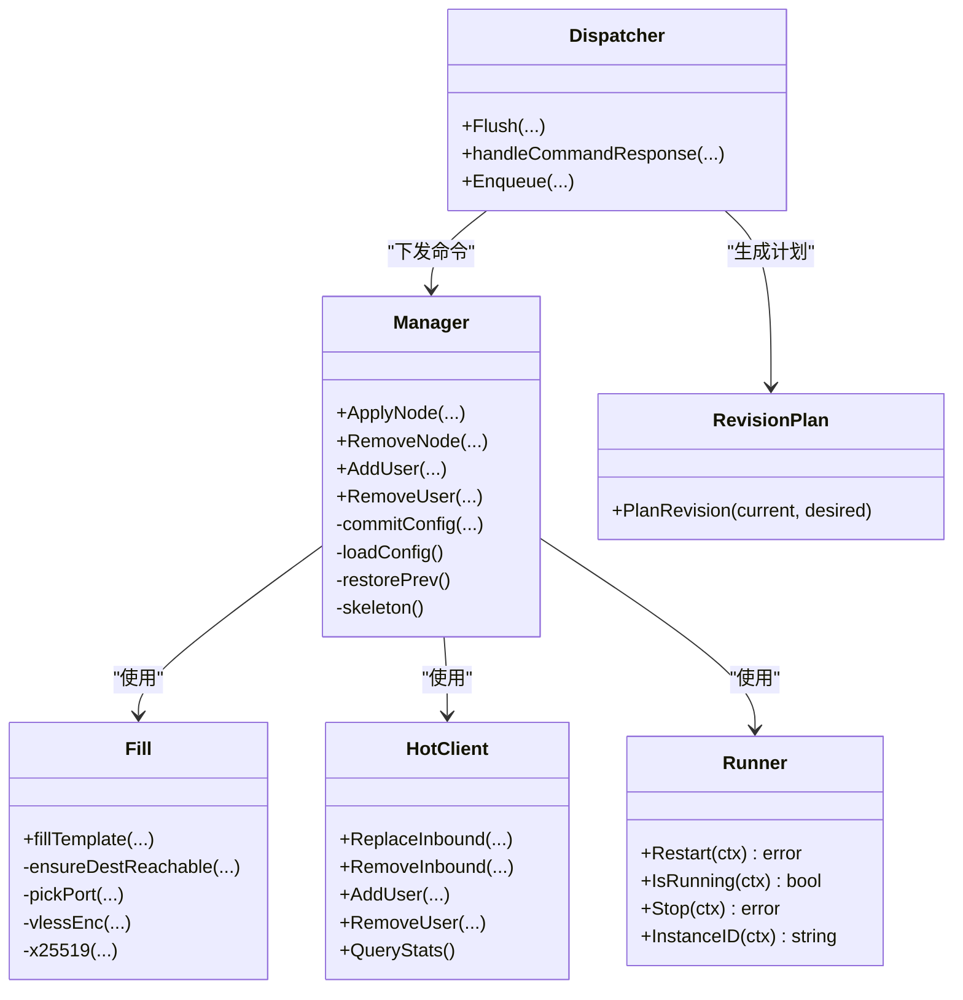
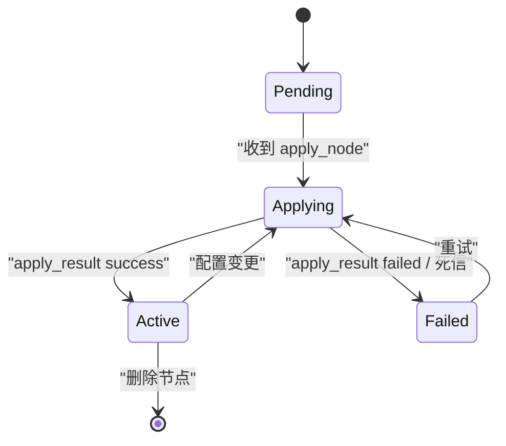

# 配置应用流水线

<cite>
**本文引用的文件**   
- [manager.go](file://src/agent/internal/xray/manager.go)
- [config.go](file://src/agent/internal/xray/config.go)
- [hot.go](file://src/agent/internal/xray/hot.go)
- [runner.go](file://src/agent/internal/xray/runner.go)
- [fill.go](file://src/agent/internal/xray/fill.go)
- [dispatcher.go](file://src/backend/internal/dispatch/dispatcher.go)
- [chains.go](file://src/backend/internal/panel/chains.go)
- [revision_plan.go](file://src/backend/internal/dispatch/revision_plan.go)
- [config.go](file://src/shared/config.go)
</cite>

## 目录
1. [引言](#引言)
2. [项目结构](#项目结构)
3. [核心组件](#核心组件)
4. [架构总览](#架构总览)
5. [详细组件分析](#详细组件分析)
6. [依赖关系分析](#依赖关系分析)
7. [性能考量](#性能考量)
8. [故障排查指南](#故障排查指南)
9. [结论](#结论)
10. [附录：状态图与调度逻辑](#附录状态图与调度逻辑)

## 引言
本文件面向“节点配置应用流水线”的完整实现，覆盖从目标可达性预检、临时文件落盘、xray 配置语法校验、正式落盘到热更新（零停机）的全链路。文档同时给出错误处理策略与回滚机制、典型场景的数据路径（服务器添加、节点配置变更）、以及调试技巧与可视化图示，帮助读者快速理解并排障。

## 项目结构
该流水线由后端编排与 Agent 执行两部分组成：
- 后端负责命令分发、任务编排、链式拓扑规划与结果汇总；
- Agent 侧 xray Manager 负责模板填充、dest 预检、配置校验、原子落盘、热操作与兜底重启、回滚。

图表来源
- [chains.go:199-383](file://src/backend/internal/panel/chains.go#L199-L383)
- [dispatcher.go:171-241](file://src/backend/internal/dispatch/dispatcher.go#L171-L241)
- [revision_plan.go:57-94](file://src/backend/internal/dispatch/revision_plan.go#L57-L94)
- [manager.go:109-142](file://src/agent/internal/xray/manager.go#L109-L142)
- [fill.go:23-142](file://src/agent/internal/xray/fill.go#L23-L142)
- [config.go:237-287](file://src/agent/internal/xray/config.go#L237-L287)
- [hot.go:72-100](file://src/agent/internal/xray/hot.go#L72-L100)
- [runner.go:41-53](file://src/agent/internal/xray/runner.go#L41-L53)

章节来源
- [chains.go:199-383](file://src/backend/internal/panel/chains.go#L199-L383)
- [dispatcher.go:171-241](file://src/backend/internal/dispatch/dispatcher.go#L171-L241)
- [revision_plan.go:57-94](file://src/backend/internal/dispatch/revision_plan.go#L57-L94)
- [manager.go:109-142](file://src/agent/internal/xray/manager.go#L109-L142)
- [fill.go:23-142](file://src/agent/internal/xray/fill.go#L23-L142)
- [config.go:237-287](file://src/agent/internal/xray/config.go#L237-L287)
- [hot.go:72-100](file://src/agent/internal/xray/hot.go#L72-L100)
- [runner.go:41-53](file://src/agent/internal/xray/runner.go#L41-L53)

## 核心组件
- Xray Manager：单实例管理一台服务器的 xray 配置与运行态，串行化所有写操作，保证 config.json 独占管理。
- fillTemplate：模板占位符替换、端口选择、dest 可达性预检、提取 realized_config。
- commitConfig：临时文件写入、xray run -test 校验、备份上一份可用配置、原子替换。
- HotClient：通过 gRPC HandlerService 进行 AddInbound/AlterInbound/RemoveInbound 等热操作。
- Runner：systemd 或 exec 两种模式，提供 Restart/IsRunning/Stop 能力。
- Dispatcher：命令入队、重试、ACK 处理、死信、节点/链状态推进。
- RevisionPlan：基于内容寻址的增量计划，避免重复下发。

章节来源
- [manager.go:24-40](file://src/agent/internal/xray/manager.go#L24-L40)
- [fill.go:23-142](file://src/agent/internal/xray/fill.go#L23-L142)
- [config.go:237-287](file://src/agent/internal/xray/config.go#L237-L287)
- [hot.go:27-100](file://src/agent/internal/xray/hot.go#L27-L100)
- [runner.go:16-53](file://src/agent/internal/xray/runner.go#L16-L53)
- [dispatcher.go:24-48](file://src/backend/internal/dispatch/dispatcher.go#L24-L48)
- [revision_plan.go:20-51](file://src/backend/internal/dispatch/revision_plan.go#L20-L51)

## 架构总览
下图展示一次“添加节点”的端到端流程：后端生成 apply_node 命令，经 WebSocket 下发至 Agent；Agent 完成模板填充、dest 预检、配置校验、原子落盘后尝试热操作；失败则兜底重启并回滚。

图表来源
- [chains.go:199-383](file://src/backend/internal/panel/chains.go#L199-L383)
- [dispatcher.go:171-241](file://src/backend/internal/dispatch/dispatcher.go#L171-L241)
- [manager.go:109-142](file://src/agent/internal/xray/manager.go#L109-L142)
- [fill.go:23-142](file://src/agent/internal/xray/fill.go#L23-L142)
- [config.go:237-287](file://src/agent/internal/xray/config.go#L237-L287)
- [hot.go:72-100](file://src/agent/internal/xray/hot.go#L72-L100)
- [runner.go:41-53](file://src/agent/internal/xray/runner.go#L41-L53)

## 详细组件分析

### 节点应用流水线（ApplyNode）
- 阶段一：模板填充与 dest 预检
  - 端口选择：优先指定端口，若冲突报错；否则按候选段挑选空闲端口，无候选则随机分配。
  - 模板占位符替换：PORT/TAG/CLIENTS/PRIVATE_KEY/DECRYPTION 等；Reality 私钥由 x25519 生成，VLESS Encryption 由 vlessenc 生成。
  - dest 预检：对 realitySettings.dest 做 TCP+TLS1.3 握手探测；不可达时按白名单逐个尝试并改写 dest/serverNames；全部失败则报错。
- 阶段二：临时文件写入与 xray 配置测试
  - 将候选配置写入临时文件，调用 xray run -test 校验语法与依赖；失败则丢弃临时文件并返回错误。
- 阶段三：正式落盘
  - 备份当前可用配置为 .prev；使用原子 rename 替换 config.json，设置权限 0600，记录哈希基线。
- 阶段四：热操作与兜底重启
  - 优先通过 gRPC 热操作 ReplaceInbound（幂等：先删后加）；失败则调用 Runner.Restart 兜底。
  - 若重启失败，恢复 .prev 配置并再次尝试重启；仍失败则返回错误（已回滚）。
- 阶段五：上报 realized_config
  - 包含端口、public_key、short_id、server_name、flow、fingerprint、network、service_name/path/mode/host、method、psk、encryption 等字段，供面板生成订阅。

图表来源
- [manager.go:109-142](file://src/agent/internal/xray/manager.go#L109-L142)
- [fill.go:23-142](file://src/agent/internal/xray/fill.go#L23-L142)
- [config.go:237-287](file://src/agent/internal/xray/config.go#L237-L287)
- [hot.go:72-100](file://src/agent/internal/xray/hot.go#L72-L100)
- [runner.go:41-53](file://src/agent/internal/xray/runner.go#L41-L53)

章节来源
- [manager.go:109-142](file://src/agent/internal/xray/manager.go#L109-L142)
- [fill.go:23-142](file://src/agent/internal/xray/fill.go#L23-L142)
- [config.go:237-287](file://src/agent/internal/xray/config.go#L237-L287)
- [hot.go:72-100](file://src/agent/internal/xray/hot.go#L72-L100)
- [runner.go:41-53](file://src/agent/internal/xray/runner.go#L41-L53)

### 删除节点（RemoveNode）
- 从当前配置中移除对应 tag 的 inbound；若无则幂等返回。
- 提交候选配置（同样经过 -test 校验与原子替换）。
- 优先热删除 RemoveInbound；失败则兜底重启，失败再回滚。

章节来源
- [manager.go:144-170](file://src/agent/internal/xray/manager.go#L144-L170)
- [config.go:64-81](file://src/agent/internal/xray/config.go#L64-L81)
- [hot.go:92-100](file://src/agent/internal/xray/hot.go#L92-L100)

### 用户增删（AddUser/RemoveUser）
- 针对 inbound 的用户列表（clients/accounts）进行增删，支持 vless/vmess/trojan 的热操作；其他协议自动回退重启。
- 逐 tag 执行 AlterInbound；任一失败则兜底重启，失败再回滚。

章节来源
- [manager.go:172-233](file://src/agent/internal/xray/manager.go#L172-L233)
- [config.go:83-114](file://src/agent/internal/xray/config.go#L83-L114)
- [hot.go:102-135](file://src/agent/internal/xray/hot.go#L102-L135)

### 配置漂移检测与修复
- 每次落盘记录 lastHash；ConfigDrift 比对当前文件哈希，首次以当前文件为基线；文件被删除视为漂移。
- 若检测到漂移，下一次 loadConfig 将以骨架 + 受管节点 inbound + 链 piece 为基，丢弃外部改动其他内容（净化）。

章节来源
- [manager.go:289-334](file://src/agent/internal/xray/manager.go#L289-L334)
- [manager.go:336-375](file://src/agent/internal/xray/manager.go#L336-L375)

### 遥测与统计
- EnsureTelemetryFeatures 确保 stats/policy/StatsService 存在，缺失则落盘并重启生效。
- QueryStats 通过 gRPC StatsService 拉取计数器。

章节来源
- [manager.go:399-458](file://src/agent/internal/xray/manager.go#L399-L458)
- [hot.go:56-70](file://src/agent/internal/xray/hot.go#L56-L70)

### 后端编排与任务调度
- Dispatcher.Flush 批量投递待发命令；超过最大尝试次数标记死信，并置节点/跳 failed。
- handleCommandResponse 根据 ACK/失败码推进节点状态机与链编排；清理类命令不触碰工作拓扑。
- RevisionPlan 基于内容寻址计算差异，避免重复下发；Apply/Cleanup 顺序严格。

章节来源
- [dispatcher.go:171-241](file://src/backend/internal/dispatch/dispatcher.go#L171-L241)
- [dispatcher.go:625-730](file://src/backend/internal/dispatch/dispatcher.go#L625-L730)
- [revision_plan.go:57-94](file://src/backend/internal/dispatch/revision_plan.go#L57-L94)

## 依赖关系分析
- Agent 侧 xray Manager 依赖：
  - fillTemplate：端口选择、dest 预检、模板替换、密钥生成。
  - commitConfig：临时文件、xray -test、备份与原子替换。
  - HotClient：gRPC HandlerService/StatsService。
  - Runner：systemd 或 exec 进程管理。
- 后端依赖：
  - Dispatcher：命令队列、ACK、死信、日志与告警。
  - RevisionPlan：拓扑差异计算与任务排序。
  - Panel API：创建/编辑链、触发编排。

图表来源
- [manager.go:109-142](file://src/agent/internal/xray/manager.go#L109-L142)
- [fill.go:23-142](file://src/agent/internal/xray/fill.go#L23-L142)
- [hot.go:72-100](file://src/agent/internal/xray/hot.go#L72-L100)
- [runner.go:41-53](file://src/agent/internal/xray/runner.go#L41-L53)
- [dispatcher.go:171-241](file://src/backend/internal/dispatch/dispatcher.go#L171-L241)
- [revision_plan.go:57-94](file://src/backend/internal/dispatch/revision_plan.go#L57-L94)

章节来源
- [manager.go:109-142](file://src/agent/internal/xray/manager.go#L109-L142)
- [fill.go:23-142](file://src/agent/internal/xray/fill.go#L23-L142)
- [hot.go:72-100](file://src/agent/internal/xray/hot.go#L72-L100)
- [runner.go:41-53](file://src/agent/internal/xray/runner.go#L41-L53)
- [dispatcher.go:171-241](file://src/backend/internal/dispatch/dispatcher.go#L171-L241)
- [revision_plan.go:57-94](file://src/backend/internal/dispatch/revision_plan.go#L57-L94)

## 性能考量
- 热操作优先：gRPC 热操作避免全量重启，降低延迟与抖动。
- 原子落盘：rename 原子替换减少中间态风险。
- 内容寻址：RevisionPlan 复用不变 piece，减少网络与磁盘 IO。
- 超时控制：gRPC 单次调用超时 5s，dest 预检单次 4s，避免阻塞。
- 并发保护：Manager 内部互斥锁串行化写操作，避免并发写坏 config.json。

[本节为通用指导，无需特定文件引用]

## 故障排查指南
- 配置校验失败（xray -test）
  - 现象：commitConfig 返回错误，临时文件被删除。
  - 排查：检查模板占位符替换是否正确、JSON 是否合法、依赖项是否存在。
  - 参考：[config.go:237-287](file://src/agent/internal/xray/config.go#L237-L287)
- dest 不可达
  - 现象：fillTemplate.ensureDestReachable 报错，白名单候选全部失败。
  - 排查：确认 realitySettings.dest 可达性与 serverNames；检查防火墙与证书。
  - 参考：[fill.go:170-223](file://src/agent/internal/xray/fill.go#L170-L223)
- 热操作失败
  - 现象：HotClient.ReplaceInbound 报错，触发兜底重启。
  - 排查：检查 gRPC 服务是否可用、inbound tag 是否正确、xray 版本兼容性。
  - 参考：[hot.go:72-100](file://src/agent/internal/xray/hot.go#L72-L100)
- 重启失败与回滚
  - 现象：Runner.Restart 失败，restorePrev 回滚配置。
  - 排查：检查 systemd 单元状态、配置文件权限、端口占用。
  - 参考：[runner.go:41-53](file://src/agent/internal/xray/runner.go#L41-L53), [manager.go:319-334](file://src/agent/internal/xray/manager.go#L319-L334)
- 命令死信
  - 现象：Dispatcher.Flush 超过最大尝试次数，标记 dead-lettered。
  - 排查：检查 Agent 在线状态、网络连通性、命令载荷合法性。
  - 参考：[dispatcher.go:171-241](file://src/backend/internal/dispatch/dispatcher.go#L171-L241)

章节来源
- [config.go:237-287](file://src/agent/internal/xray/config.go#L237-L287)
- [fill.go:170-223](file://src/agent/internal/xray/fill.go#L170-L223)
- [hot.go:72-100](file://src/agent/internal/xray/hot.go#L72-L100)
- [runner.go:41-53](file://src/agent/internal/xray/runner.go#L41-L53)
- [manager.go:319-334](file://src/agent/internal/xray/manager.go#L319-L334)
- [dispatcher.go:171-241](file://src/backend/internal/dispatch/dispatcher.go#L171-L241)

## 结论
本流水线通过“预检→校验→原子落盘→热操作→兜底重启→回滚”的多层保障，实现了高可靠、低抖动的节点配置应用。后端编排与 Agent 执行解耦，结合内容寻址与幂等设计，确保大规模部署下的稳定性与可观测性。

[本节为总结，无需特定文件引用]

## 附录：状态图与调度逻辑

### 节点状态机

[此图为概念性状态机，不直接映射具体代码文件]

### 典型场景数据路径
- 服务器添加（单跳链）
  - 面板创建链 → Dispatcher 生成 apply_node → Agent ApplyNode → fillTemplate → commitConfig → HotClient.ReplaceInbound → 成功返回 realized_config → 链状态推进。
- 节点配置变更（多跳链）
  - 面板编辑链 → RevisionPlan 计算差异 → Dispatcher 下发 apply_chain_hop（portal/bridge/forward）→ Agent 侧相应处理 → 成功后推进下一跳 → 入口最后生效。

章节来源
- [chains.go:199-383](file://src/backend/internal/panel/chains.go#L199-L383)
- [revision_plan.go:57-94](file://src/backend/internal/dispatch/revision_plan.go#L57-L94)
- [dispatcher.go:625-730](file://src/backend/internal/dispatch/dispatcher.go#L625-L730)

### 调试技巧
- 查看 xray 版本与运行状态：Manager.Version()
- 查询流量计数器：Manager.QueryStats()
- 检查配置漂移：Manager.ConfigDrift()
- 观察 Agent 日志：关注 “xray: hot apply ... failed”、“xray: config corrupted”、“xray: 配置漂移修复” 等关键字。
- 手动验证配置：在 Agent 机器上执行 xray run -test -config <临时文件路径>

章节来源
- [manager.go:86-96](file://src/agent/internal/xray/manager.go#L86-L96)
- [manager.go:399-402](file://src/agent/internal/xray/manager.go#L399-L402)
- [manager.go:289-311](file://src/agent/internal/xray/manager.go#L289-L311)
- [config.go:237-287](file://src/agent/internal/xray/config.go#L237-L287)