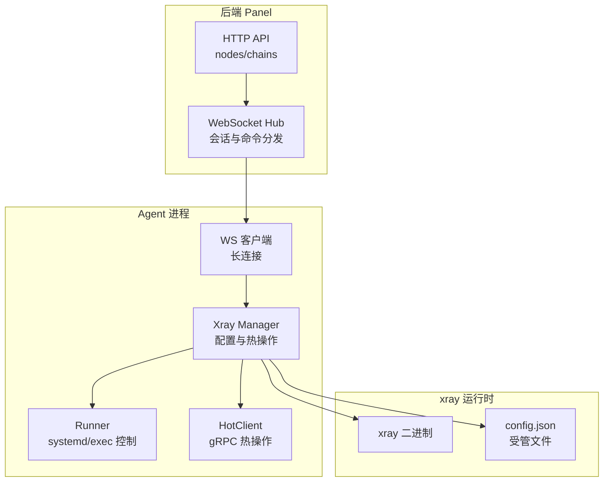
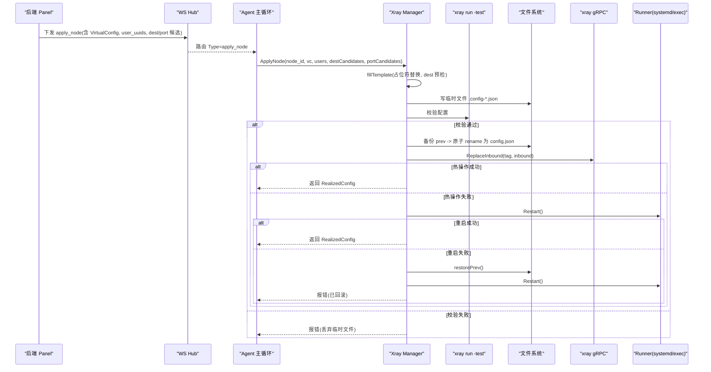
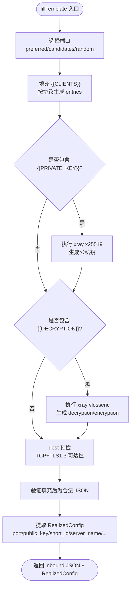
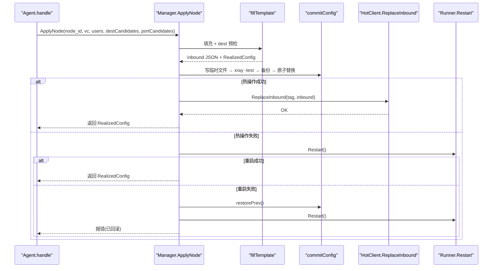
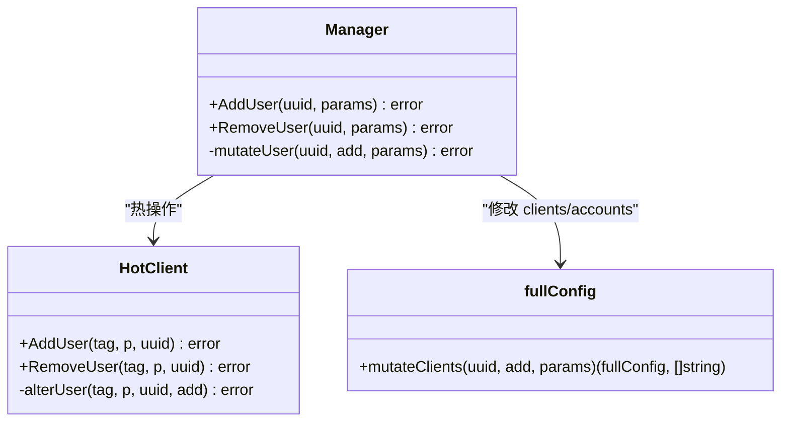
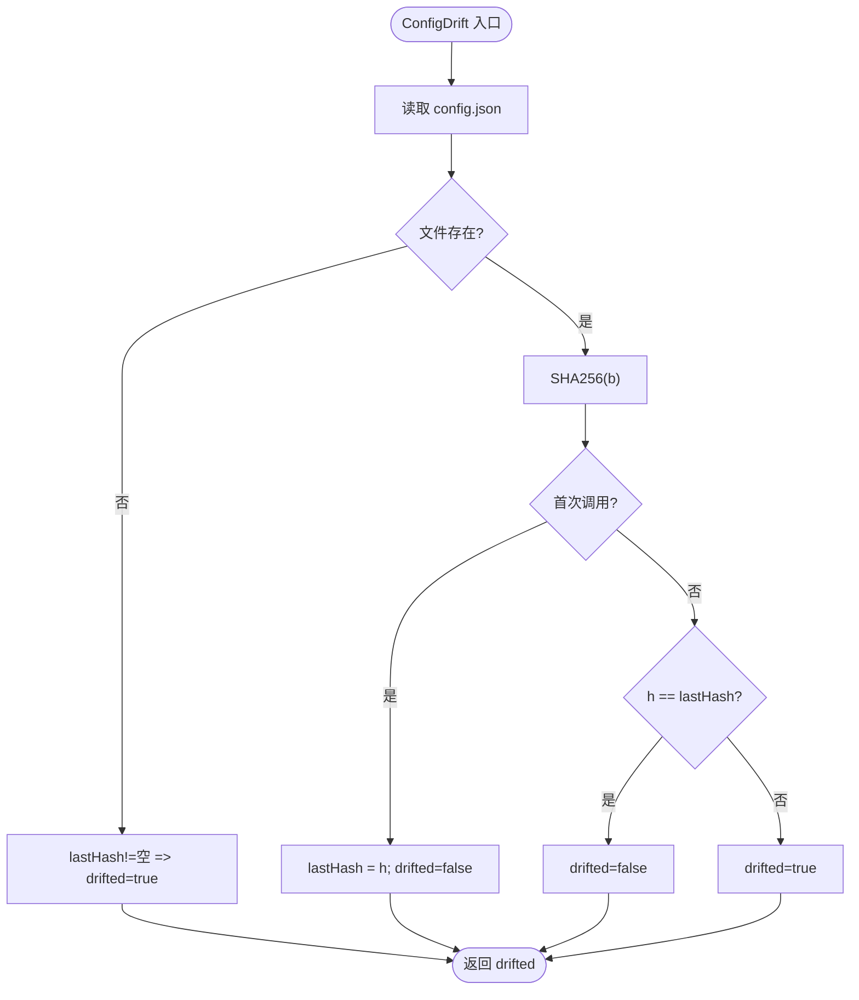
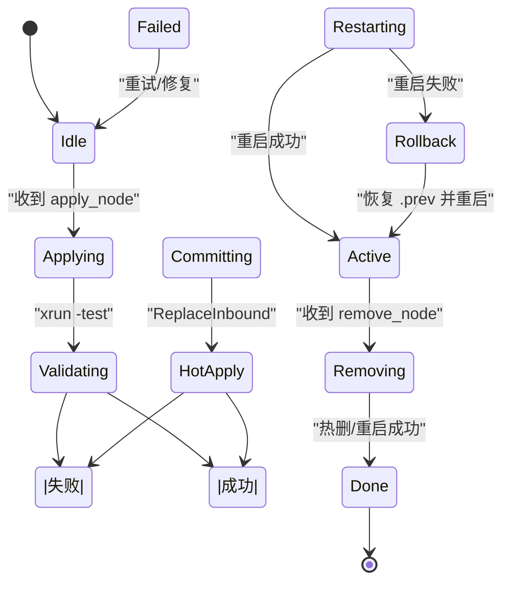
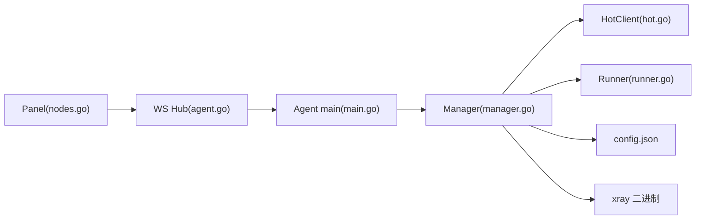
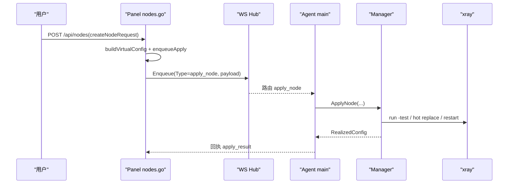
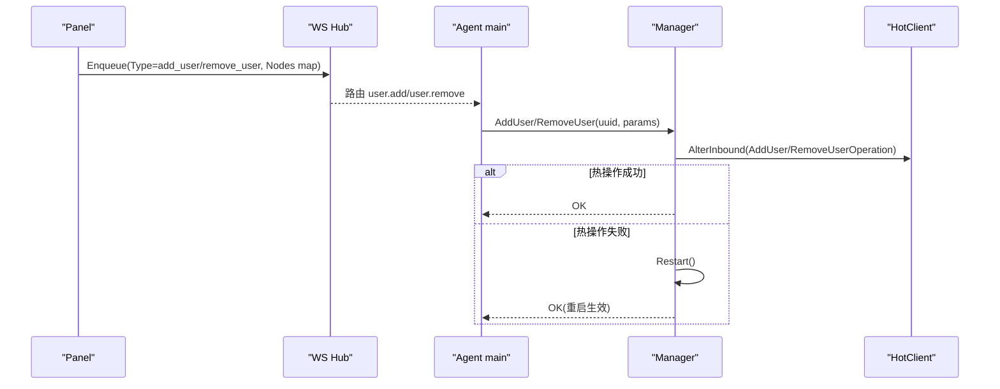

# 配置数据流

<cite>
**本文引用的文件**   
- [src/agent/internal/xray/config.go](file://src/agent/internal/xray/config.go)
- [src/agent/internal/xray/fill.go](file://src/agent/internal/xray/fill.go)
- [src/agent/internal/xray/hot.go](file://src/agent/internal/xray/hot.go)
- [src/agent/internal/xray/manager.go](file://src/agent/internal/xray/manager.go)
- [src/agent/internal/xray/runner.go](file://src/agent/internal/xray/runner.go)
- [src/shared/config.go](file://src/shared/config.go)
- [src/shared/messages.go](file://src/shared/messages.go)
- [src/backend/internal/panel/nodes.go](file://src/backend/internal/panel/nodes.go)
- [src/backend/internal/ws/agent.go](file://src/backend/internal/ws/agent.go)
- [src/agent/cmd/agent/main.go](file://src/agent/cmd/agent/main.go)
</cite>

## 目录
1. [简介](#简介)
2. [项目结构](#项目结构)
3. [核心组件](#核心组件)
4. [架构总览](#架构总览)
5. [详细组件分析](#详细组件分析)
6. [依赖关系分析](#依赖关系分析)
7. [性能考量](#性能考量)
8. [故障排查指南](#故障排查指南)
9. [结论](#结论)
10. [附录](#附录)

## 简介
本文系统化梳理“虚拟配置模板从面板生成到 Agent 执行”的完整数据流，覆盖：
- 模板占位符填充机制与参数分工（面板侧 vs Agent 侧）
- 配置校验与热更新过程
- 配置漂移检测（哈希比对、自动修复、基线管理）
- 节点应用流水线（dest 预检、临时文件写入、xray 配置测试、正式落盘、热操作执行）
- 配置流转图与状态转换图
- 典型场景（服务器添加、节点配置变更）的数据路径
- 错误处理策略与可观测性

## 项目结构
本仓库采用前后端分离与 Agent 三端协作：
- 后端（Panel）负责用户界面、编排与下发指令
- Agent 运行在目标服务器上，独占管理 xray 配置文件并执行热更新
- Shared 包定义两端共享的类型与消息协议

**图表来源** 
- [src/backend/internal/ws/agent.go:33-239](file://src/backend/internal/ws/agent.go#L33-L239)
- [src/agent/cmd/agent/main.go:141-386](file://src/agent/cmd/agent/main.go#L141-L386)
- [src/agent/internal/xray/manager.go:24-55](file://src/agent/internal/xray/manager.go#L24-L55)
- [src/agent/internal/xray/runner.go:18-33](file://src/agent/internal/xray/runner.go#L18-L33)
- [src/agent/internal/xray/hot.go:27-54](file://src/agent/internal/xray/hot.go#L27-L54)

**章节来源**
- [src/backend/internal/ws/agent.go:33-239](file://src/backend/internal/ws/agent.go#L33-L239)
- [src/agent/cmd/agent/main.go:141-386](file://src/agent/cmd/agent/main.go#L141-L386)

## 核心组件
- 虚拟配置与占位符（shared）
  - VirtualConfig：面板生成的 inbound JSON 模板 + 协议参数
  - RealizedConfig：Agent 填充后上报的实际生效值
  - 占位符：PORT、CLIENTS、PRIVATE_KEY、DECRYPTION、TAG
- Agent 侧 xray 管理（Manager）
  - ApplyNode/RemoveNode/AddUser/RemoveUser：节点生命周期与用户增删
  - commitConfig：原子落盘、xray -test 校验、备份与回滚
  - ConfigDrift：哈希比对漂移检测与净化恢复
- 热操作（HotClient）
  - ReplaceInbound/RemoveInbound/AddUser/RemoveUser：gRPC 零重启热更新
- Runner（系统服务控制）
  - systemd 或 exec 模式，兜底重启与实例 ID 上报

**章节来源**
- [src/shared/config.go:170-206](file://src/shared/config.go#L170-L206)
- [src/agent/internal/xray/manager.go:109-170](file://src/agent/internal/xray/manager.go#L109-L170)
- [src/agent/internal/xray/hot.go:72-148](file://src/agent/internal/xray/hot.go#L72-L148)
- [src/agent/internal/xray/runner.go:18-53](file://src/agent/internal/xray/runner.go#L18-L53)

## 架构总览
下图展示“虚拟配置模板 → Agent 填充 → 校验 → 落盘 → 热更新”的主流程。

**图表来源** 
- [src/agent/internal/xray/fill.go:23-142](file://src/agent/internal/xray/fill.go#L23-L142)
- [src/agent/internal/xray/manager.go:235-287](file://src/agent/internal/xray/manager.go#L235-L287)
- [src/agent/internal/xray/hot.go:72-90](file://src/agent/internal/xray/hot.go#L72-L90)
- [src/agent/internal/xray/runner.go:77-114](file://src/agent/internal/xray/runner.go#L77-L114)

## 详细组件分析

### 虚拟配置模板与占位符填充
- 面板侧职责
  - 构建 VirtualConfig：协议、端口（可为 0）、传输方式、Reality 参数、VLESS Encryption 等
  - 生成 inbound JSON 模板，嵌入占位符：{{PORT}}、{{CLIENTS}}、{{PRIVATE_KEY}}、{{DECRYPTION}}、{{TAG}}
  - 携带 dest 白名单与受限直连 NAT 机 port_candidates
- Agent 侧职责
  - 填充 PORT：若指定则检查占用；否则按候选挑选或随机空闲端口
  - 填充 CLIENTS：按协议构造 clients/accounts 列表（含 level 统计开关）
  - 填充 PRIVATE_KEY：调用 xray x25519 生成密钥对（私钥不出服务器），public_key 随 realized 上报
  - 填充 DECRYPTION：调用 xray vlessenc 生成 decryption/encryption 对（vision+Encryption 需 1-RTT）
  - 填充 TAG：NodeTag(nodeID)
  - dest 预检：realitySettings.dest 不可达时按白名单逐个尝试并改写 dest/serverNames

**图表来源** 
- [src/agent/internal/xray/fill.go:23-142](file://src/agent/internal/xray/fill.go#L23-L142)
- [src/shared/config.go:149-168](file://src/shared/config.go#L149-L168)

**章节来源**
- [src/backend/internal/panel/nodes.go:390-462](file://src/backend/internal/panel/nodes.go#L390-L462)
- [src/agent/internal/xray/fill.go:23-142](file://src/agent/internal/xray/fill.go#L23-L142)
- [src/shared/config.go:149-168](file://src/shared/config.go#L149-L168)

### 节点应用流水线（ApplyNode）
- 步骤
  1) 填充模板 + dest 预检
  2) 读取当前 config.json（不存在/损坏/漂移净化则重建骨架）
  3) upsertInbound(tag, inbound) 生成候选配置
  4) commitConfig：写临时文件 → xray run -test → 备份 prev → 原子 rename
  5) 热操作 ReplaceInbound（幂等：先删后加）
  6) 失败回退：Restart → 失败则 restorePrev 再 Restart
- 关键保障
  - 原子落盘与校验前置，避免脏配置
  - 热操作优先，失败才重启
  - 回滚基于 .prev 快照

**图表来源** 
- [src/agent/internal/xray/manager.go:109-170](file://src/agent/internal/xray/manager.go#L109-L170)
- [src/agent/internal/xray/manager.go:235-287](file://src/agent/internal/xray/manager.go#L235-L287)
- [src/agent/internal/xray/hot.go:72-90](file://src/agent/internal/xray/hot.go#L72-L90)

**章节来源**
- [src/agent/internal/xray/manager.go:109-170](file://src/agent/internal/xray/manager.go#L109-L170)
- [src/agent/internal/xray/manager.go:235-287](file://src/agent/internal/xray/manager.go#L235-L287)

### 用户增删（AddUser/RemoveUser）
- 面板侧下发 AddUser/RemoveUser，携带 Nodes 映射（tag → UserNodeParams）
- Agent 侧根据 tag 前缀 node_ 筛选 inbound，按协议构造 account/clients 条目
- 支持的热操作：vless/vmess/trojan 的 AlterInbound（AddUserOperation/RemoveUserOperation）
- 不支持的协议自动回退重启

**图表来源** 
- [src/agent/internal/xray/manager.go:172-233](file://src/agent/internal/xray/manager.go#L172-L233)
- [src/agent/internal/xray/hot.go:102-148](file://src/agent/internal/xray/hot.go#L102-L148)
- [src/agent/internal/xray/config.go:83-114](file://src/agent/internal/xray/config.go#L83-L114)

**章节来源**
- [src/shared/messages.go:156-178](file://src/shared/messages.go#L156-L178)
- [src/agent/internal/xray/config.go:83-114](file://src/agent/internal/xray/config.go#L83-L114)
- [src/agent/internal/xray/hot.go:102-148](file://src/agent/internal/xray/hot.go#L102-L148)

### 配置漂移检测与自动修复
- 哈希比对算法
  - 使用 SHA256 计算 config.json 内容哈希，作为基线 lastHash
  - 首次调用以当前文件为基线（停机期间外部改动视为基线）
  - 文件被删除视为漂移
- 自动修复机制
  - loadConfig 检测到 drifted=true 时，以 skeleton + 受管节点 inbound + 链 piece 为基，丢弃外部改动其他内容
  - commitConfig 成功后重置 drifted=false，lastHash 更新为新哈希
- 基线管理
  - lastHash 记录最后一次由本 agent 落盘的配置哈希
  - restorePrev 恢复 .prev 快照并同步 lastHash

**图表来源** 
- [src/agent/internal/xray/manager.go:289-317](file://src/agent/internal/xray/manager.go#L289-L317)
- [src/agent/internal/xray/manager.go:336-375](file://src/agent/internal/xray/manager.go#L336-L375)
- [src/agent/internal/xray/manager.go:319-334](file://src/agent/internal/xray/manager.go#L319-L334)

**章节来源**
- [src/agent/internal/xray/manager.go:289-317](file://src/agent/internal/xray/manager.go#L289-L317)
- [src/agent/internal/xray/manager.go:336-375](file://src/agent/internal/xray/manager.go#L336-L375)
- [src/agent/internal/xray/manager.go:319-334](file://src/agent/internal/xray/manager.go#L319-L334)

### 节点应用流水线状态转换

**图表来源** 
- [src/agent/internal/xray/manager.go:109-170](file://src/agent/internal/xray/manager.go#L109-L170)
- [src/agent/internal/xray/manager.go:235-287](file://src/agent/internal/xray/manager.go#L235-L287)

## 依赖关系分析
- 组件耦合
  - Manager 依赖 HotClient（gRPC 热操作）、Runner（服务控制）、文件系统（config.json）
  - fillTemplate 依赖 xray 子进程（x25519、vlessenc）与网络探测（destReachable）
  - shared 类型贯穿 Panel ↔ Agent 协议
- 外部依赖
  - xray 二进制提供 run -test、x25519、vlessenc、gRPC API
  - systemd 或 exec 环境用于服务控制

**图表来源** 
- [src/backend/internal/panel/nodes.go:344-369](file://src/backend/internal/panel/nodes.go#L344-L369)
- [src/backend/internal/ws/agent.go:33-239](file://src/backend/internal/ws/agent.go#L33-L239)
- [src/agent/cmd/agent/main.go:565-671](file://src/agent/cmd/agent/main.go#L565-L671)
- [src/agent/internal/xray/manager.go:24-55](file://src/agent/internal/xray/manager.go#L24-L55)

**章节来源**
- [src/backend/internal/panel/nodes.go:344-369](file://src/backend/internal/panel/nodes.go#L344-L369)
- [src/backend/internal/ws/agent.go:33-239](file://src/backend/internal/ws/agent.go#L33-L239)
- [src/agent/cmd/agent/main.go:565-671](file://src/agent/cmd/agent/main.go#L565-L671)

## 性能考量
- 热操作优先：减少 xray 重启带来的业务中断
- 原子落盘与校验前置：避免无效配置导致重启失败
- 端口选择优化：受限直连 NAT 机使用候选段内顺序挑选，降低冲突概率
- dest 预检超时：单次 4s，避免阻塞整体流程
- gRPC 调用超时：单次 5s，防止热操作长时间挂起

[本节为通用指导，不直接分析具体文件]

## 故障排查指南
- 常见错误与定位
  - 模板填充后非合法 JSON：检查占位符替换逻辑与模板结构
  - dest 不可达且候选全部失败：检查白名单与网络连通性
  - 端口被占用：确认 preferred/candidates 是否合理
  - xray -test 失败：查看输出日志定位配置语法问题
  - 热操作失败：检查 gRPC API 可用性（api inbound 端口与服务）
  - 重启失败：检查 systemd 单元状态或 exec 子进程退出码
  - 漂移检测触发：核查是否有外部编辑 config.json
- 回滚与恢复
  - 使用 .prev 快照恢复
  - 通过 /api/servers/{id}/repair 重放 active 节点的 apply_node

**章节来源**
- [src/agent/internal/xray/manager.go:235-287](file://src/agent/internal/xray/manager.go#L235-L287)
- [src/backend/internal/panel/servers.go:674-720](file://src/backend/internal/panel/servers.go#L674-L720)

## 结论
该配置数据流以“面板生成模板、Agent 填充与校验、热操作优先、回滚兜底”为核心设计，结合漂移检测与自动修复，确保配置一致性与高可用。通过清晰的职责划分与严格的校验/回滚机制，系统在复杂网络环境下仍能稳定交付节点配置。

[本节为总结，不直接分析具体文件]

## 附录

### 典型场景数据路径

#### 服务器添加（创建节点）

**图表来源** 
- [src/backend/internal/panel/nodes.go:196-250](file://src/backend/internal/panel/nodes.go#L196-L250)
- [src/backend/internal/panel/nodes.go:344-369](file://src/backend/internal/panel/nodes.go#L344-L369)
- [src/agent/cmd/agent/main.go:565-573](file://src/agent/cmd/agent/main.go#L565-L573)

#### 节点配置变更（用户增删）

**图表来源** 
- [src/shared/messages.go:156-178](file://src/shared/messages.go#L156-L178)
- [src/agent/cmd/agent/main.go:607-631](file://src/agent/cmd/agent/main.go#L607-L631)
- [src/agent/internal/xray/manager.go:172-233](file://src/agent/internal/xray/manager.go#L172-L233)
- [src/agent/internal/xray/hot.go:102-148](file://src/agent/internal/xray/hot.go#L102-L148)