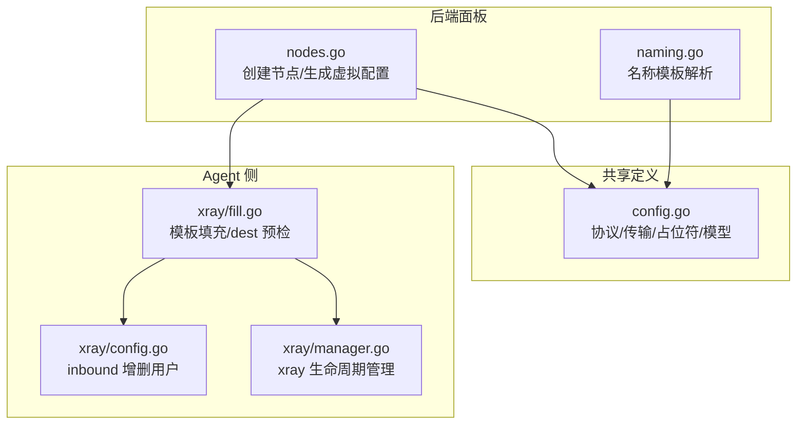
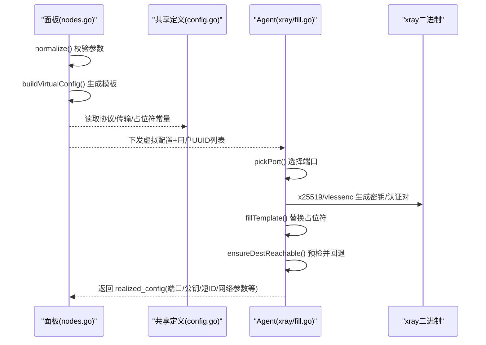
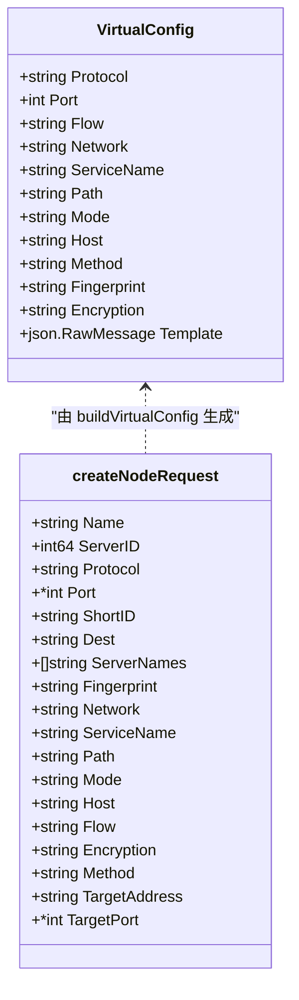
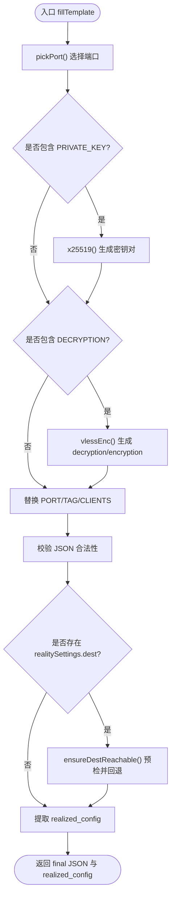
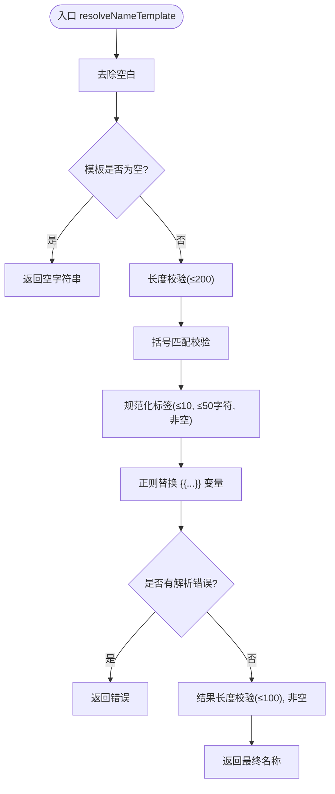
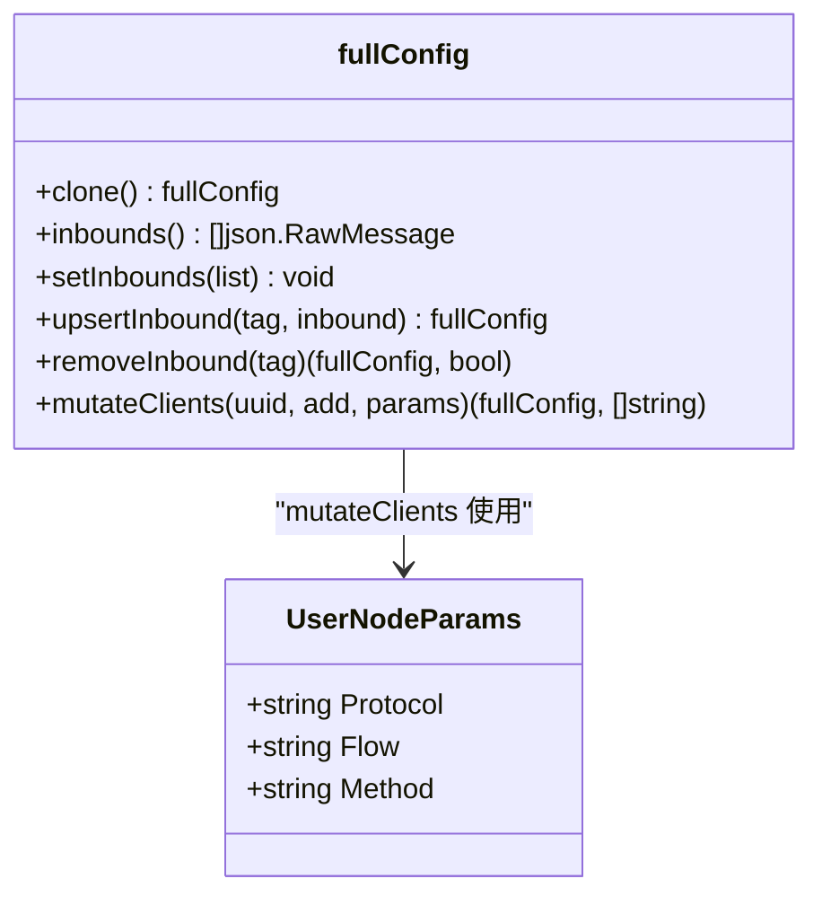
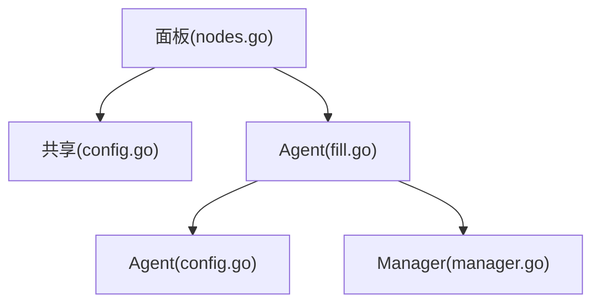

# 配置模板处理

<cite>
**本文引用的文件**   
- [src/backend/internal/panel/nodes.go](file://src/backend/internal/panel/nodes.go)
- [src/backend/internal/panel/naming.go](file://src/backend/internal/panel/naming.go)
- [src/shared/config.go](file://src/shared/config.go)
- [src/agent/internal/xray/fill.go](file://src/agent/internal/xray/fill.go)
- [src/agent/internal/xray/config.go](file://src/agent/internal/xray/config.go)
- [src/agent/internal/xray/manager.go](file://src/agent/internal/xray/manager.go)
</cite>

## 目录
1. [简介](#简介)
2. [项目结构](#项目结构)
3. [核心组件](#核心组件)
4. [架构总览](#架构总览)
5. [详细组件分析](#详细组件分析)
6. [依赖关系分析](#依赖关系分析)
7. [性能考量](#性能考量)
8. [故障排查指南](#故障排查指南)
9. [结论](#结论)
10. [附录](#附录)

## 简介
本文件聚焦“配置模板处理”的完整机制，围绕以下关键点展开：
- 虚拟配置模板生成：buildVirtualConfig 如何根据节点协议类型（VLESS、Reality、Socks 等）构造 inbound JSON 模板与占位符。
- 模板占位符填充：面板侧参数（端口、证书路径等）与 Agent 侧参数（动态端口分配、系统信息、密钥对、用户列表）的职责分工与替换过程。
- 命名模板解析：resolveNameTemplate 如何处理服务器别名、协议类型、端口号、跳数、标签等变量组合，形成最终管理名称。
- 错误处理与验证：从面板参数校验到 Agent 端模板填充、dest 可达性检查、JSON 合法性校验的全链路保障。

## 项目结构
与配置模板处理相关的代码分布在后端面板、共享定义与 Agent 侧 xray 管理模块中：
- 后端面板负责：
  - 接收创建节点的请求并规范化参数（normalize）。
  - 基于协议生成虚拟配置模板（buildVirtualConfig），包含协议相关 settings 与 streamSettings。
  - 解析名称模板（resolveNameTemplate），将模板中的变量替换为实际值。
- 共享定义提供：
  - 协议常量、传输方式、指纹、加密方式等枚举与工具函数。
  - 模板占位符常量（PORT、CLIENTS、PRIVATE_KEY、TAG、DECRYPTION 等）。
  - VirtualConfig 与 RealizedConfig 数据结构。
- Agent 侧负责：
  - 填充模板占位符（fillTemplate），包括端口选择、密钥对生成、VLESS Encryption 调用、用户列表构建。
  - 进行 dest 可达性预检与回退策略。
  - 输出 realized_config 供面板订阅使用。

**图表来源** 
- [src/backend/internal/panel/nodes.go:196-200](file://src/backend/internal/panel/nodes.go#L196-L200)
- [src/backend/internal/panel/naming.go:55-100](file://src/backend/internal/panel/naming.go#L55-L100)
- [src/shared/config.go:149-168](file://src/shared/config.go#L149-L168)
- [src/agent/internal/xray/fill.go:20-142](file://src/agent/internal/xray/fill.go#L20-L142)
- [src/agent/internal/xray/config.go:83-114](file://src/agent/internal/xray/config.go#L83-L114)
- [src/agent/internal/xray/manager.go:24-38](file://src/agent/internal/xray/manager.go#L24-L38)

**章节来源**
- [src/backend/internal/panel/nodes.go:101-194](file://src/backend/internal/panel/nodes.go#L101-L194)
- [src/backend/internal/panel/naming.go:55-100](file://src/backend/internal/panel/naming.go#L55-L100)
- [src/shared/config.go:149-168](file://src/shared/config.go#L149-L168)
- [src/agent/internal/xray/fill.go:20-142](file://src/agent/internal/xray/fill.go#L20-L142)

## 核心组件
- 虚拟配置模板生成器（buildVirtualConfig）
  - 根据协议类型设置不同的 settings（clients/accounts/method/port/address 等）。
  - Reality 协议额外注入 streamSettings.realitySettings，含 dest/serverNames/privateKey/shortIds。
  - 非 dokodemo 协议默认开启 sniffing。
- 名称模板解析器（resolveNameTemplate）
  - 支持全局变量（PROTOCOL、PORT、HOPS、ENTRY、EXIT、SERVER_*）、按位置作用域变量（ENTRY/HOP[n]/EXIT.*）以及 TAG 索引。
  - 严格校验模板语法、长度限制、标签数量与长度。
- 模板填充器（fillTemplate）
  - 端口选择（指定端口或候选段内挑选，否则随机空闲端口）。
  - 占位符替换（PORT、CLIENTS、TAG、PRIVATE_KEY、DECRYPTION）。
  - 生成用户条目（clientEntry）并按协议差异写入 clients/accounts。
  - dest 可达性检查与白名单回退。
  - 提取 realized_config（端口、公钥、短ID、serverNames、flow、fingerprint、network、service_name/path/mode/host、method、psk、encryption）。
- 用户列表变更（mutateClients/mutateInboundUsers/mutateUserList）
  - 针对 tag 前缀 node_ 的 inbound 进行增量增删用户，保持幂等。

**章节来源**
- [src/backend/internal/panel/nodes.go:390-490](file://src/backend/internal/panel/nodes.go#L390-L490)
- [src/backend/internal/panel/naming.go:55-100](file://src/backend/internal/panel/naming.go#L55-L100)
- [src/agent/internal/xray/fill.go:20-142](file://src/agent/internal/xray/fill.go#L20-L142)
- [src/agent/internal/xray/config.go:83-114](file://src/agent/internal/xray/config.go#L83-L114)

## 架构总览
下图展示了从面板创建节点到 Agent 填充模板并上报 realized_config 的端到端流程。

**图表来源** 
- [src/backend/internal/panel/nodes.go:196-200](file://src/backend/internal/panel/nodes.go#L196-L200)
- [src/backend/internal/panel/nodes.go:390-490](file://src/backend/internal/panel/nodes.go#L390-L490)
- [src/shared/config.go:149-168](file://src/shared/config.go#L149-L168)
- [src/agent/internal/xray/fill.go:20-142](file://src/agent/internal/xray/fill.go#L20-L142)

## 详细组件分析

### 虚拟配置模板生成（buildVirtualConfig）
- 输入：createNodeRequest（协议、端口、Flow、Network、ServiceName、Path、Mode、Host、Method、Fingerprint、Encryption 等）。
- 行为：
  - 根据不同协议设置 settings：
    - VLESS：clients=占位符；若启用 Encryption，则 decryption=占位符，否则 none。
    - VMess/Trojan：clients=占位符。
    - Shadowsocks：method、clients、network=tcp,udp；2022-blake3 系列生成节点级 PSK。
    - Socks：auth=password、accounts=占位符、udp=true。
    - HTTP：accounts=占位符。
    - Dokodemo：address、port、network=tcp,udp（无用户概念）。
  - 构造 inbound：tag=占位符、protocol=协议、port=占位符、settings=上述 settings。
  - Reality 协议：注入 streamSettings.realitySettings（dest、serverNames、privateKey=占位符、shortIds）。
  - 非 dokodemo 协议：默认开启 sniffing（http/tls/quic）。
- 输出：VirtualConfig（Protocol、Port、Flow、Network、ServiceName、Path、Mode、Host、Method、Fingerprint、Encryption、Template）。

**图表来源** 
- [src/backend/internal/panel/nodes.go:390-490](file://src/backend/internal/panel/nodes.go#L390-L490)
- [src/shared/config.go:170-186](file://src/shared/config.go#L170-L186)

**章节来源**
- [src/backend/internal/panel/nodes.go:390-490](file://src/backend/internal/panel/nodes.go#L390-L490)
- [src/shared/config.go:170-186](file://src/shared/config.go#L170-L186)

### 模板占位符填充（fillTemplate）
- 端口选择：
  - 若 preferred != 0：检查占用，冲突报错。
  - 若有 portCandidates：按序挑选第一个空闲端口。
  - 否则：随机分配空闲端口。
- 占位符替换：
  - PORT：带引号与不带引号两种形式均替换为数字。
  - CLIENTS：按协议生成用户条目数组（clientEntry），分别写入 clients 或 accounts。
  - TAG：替换为 NodeTag(nodeID)。
  - PRIVATE_KEY：仅 reality 模板存在，调用 x25519 生成私钥并替换。
  - DECRYPTION：仅当模板包含该占位符时执行 vlessenc，生成 decryption/encryption 对；若 flow 非空，需确保 1-RTT 模式。
- 合法性校验：
  - 填充后必须为合法 JSON，否则报错。
- dest 可达性：
  - 若存在 realitySettings.dest：尝试 TCP+TLS1.3 握手；失败则按白名单逐个尝试并改写 dest/serverNames。
  - 全部失败返回错误。
- 提取 realized_config：
  - 端口、公钥、短ID、serverNames、flow、fingerprint、network、service_name/path/mode/host、method、psk、encryption。

**图表来源** 
- [src/agent/internal/xray/fill.go:20-142](file://src/agent/internal/xray/fill.go#L20-L142)
- [src/agent/internal/xray/fill.go:247-276](file://src/agent/internal/xray/fill.go#L247-L276)
- [src/agent/internal/xray/fill.go:278-311](file://src/agent/internal/xray/fill.go#L278-L311)
- [src/agent/internal/xray/fill.go:322-347](file://src/agent/internal/xray/fill.go#L322-L347)
- [src/agent/internal/xray/fill.go:170-223](file://src/agent/internal/xray/fill.go#L170-L223)

**章节来源**
- [src/agent/internal/xray/fill.go:20-142](file://src/agent/internal/xray/fill.go#L20-L142)
- [src/agent/internal/xray/fill.go:247-276](file://src/agent/internal/xray/fill.go#L247-L276)
- [src/agent/internal/xray/fill.go:278-311](file://src/agent/internal/xray/fill.go#L278-L311)
- [src/agent/internal/xray/fill.go:322-347](file://src/agent/internal/xray/fill.go#L322-L347)
- [src/agent/internal/xray/fill.go:170-223](file://src/agent/internal/xray/fill.go#L170-L223)

### 名称模板解析（resolveNameTemplate）
- 支持的变量：
  - 全局：PROTOCOL、PORT（未指定时为 auto）、HOPS（跳数）、ENTRY、EXIT、SERVER、SERVER_ID、NAME、ID、COUNTRY、COUNTRY_CODE、COUNTRY_FLAG、LOCATION、ADDRESS。
  - 作用域：ENTRY/HOP[n]/EXIT 的属性访问，如 ENTRY.NAME、HOP[1].LOCATION、EXIT.COUNTRY_FLAG。
  - 标签：TAG[n] 与 HOP[n].TAG[index]。
- 校验规则：
  - 模板长度限制（最大 200 字符），解析结果长度限制（最大 100 字符）。
  - 模板括号匹配、未解析占位符检测。
  - 标签数量不超过 10，单个标签长度不超过 50 字符，不能为空。
  - 数组越界、不支持的参数名、属性不存在等错误提示。
- 输出：最终管理名称（字符串），空模板返回空字符串（自动命名）。

**图表来源** 
- [src/backend/internal/panel/naming.go:55-100](file://src/backend/internal/panel/naming.go#L55-L100)
- [src/backend/internal/panel/naming.go:102-163](file://src/backend/internal/panel/naming.go#L102-L163)
- [src/backend/internal/panel/naming.go:191-218](file://src/backend/internal/panel/naming.go#L191-L218)

**章节来源**
- [src/backend/internal/panel/naming.go:55-100](file://src/backend/internal/panel/naming.go#L55-L100)
- [src/backend/internal/panel/naming.go:102-163](file://src/backend/internal/panel/naming.go#L102-L163)
- [src/backend/internal/panel/naming.go:191-218](file://src/backend/internal/panel/naming.go#L191-L218)

### 用户列表变更（mutateClients / mutateInboundUsers / mutateUserList）
- 目标：在节点 inbound（tag 前缀 node_）的用户列表中增删一个用户，保持幂等。
- 协议差异：
  - vless/vmess/trojan/ss：操作 settings.clients。
  - socks/http：操作 settings.accounts。
  - dokodemo：跳过（无用户概念）。
- 匹配键：
  - clients 条目按 email（与 RemoveUserOperation 一致）。
  - accounts 条目按 user。
- 新增条目：
  - clientEntry 按协议构造（含 level:0 以启用用户级流量统计）。
  - ss 2022-blake3 系列：password 为定长 base64 密钥（SSUserPassword）。

**图表来源** 
- [src/agent/internal/xray/config.go:83-114](file://src/agent/internal/xray/config.go#L83-L114)
- [src/agent/internal/xray/config.go:116-167](file://src/agent/internal/xray/config.go#L116-L167)
- [src/agent/internal/xray/config.go:169-201](file://src/agent/internal/xray/config.go#L169-L201)

**章节来源**
- [src/agent/internal/xray/config.go:83-114](file://src/agent/internal/xray/config.go#L83-L114)
- [src/agent/internal/xray/config.go:116-167](file://src/agent/internal/xray/config.go#L116-L167)
- [src/agent/internal/xray/config.go:169-201](file://src/agent/internal/xray/config.go#L169-L201)

## 依赖关系分析
- 后端面板依赖共享定义中的协议常量、传输方式、占位符与数据结构。
- Agent 侧依赖共享定义的占位符常量与数据结构，并通过 xray 二进制执行命令生成密钥与认证对。
- 各模块间通过明确的接口契约交互（VirtualConfig、RealizedConfig、用户 UUID 列表等）。

**图表来源** 
- [src/backend/internal/panel/nodes.go:196-200](file://src/backend/internal/panel/nodes.go#L196-L200)
- [src/shared/config.go:149-168](file://src/shared/config.go#L149-L168)
- [src/agent/internal/xray/fill.go:20-142](file://src/agent/internal/xray/fill.go#L20-L142)
- [src/agent/internal/xray/config.go:83-114](file://src/agent/internal/xray/config.go#L83-L114)
- [src/agent/internal/xray/manager.go:24-38](file://src/agent/internal/xray/manager.go#L24-L38)

**章节来源**
- [src/backend/internal/panel/nodes.go:196-200](file://src/backend/internal/panel/nodes.go#L196-L200)
- [src/shared/config.go:149-168](file://src/shared/config.go#L149-L168)
- [src/agent/internal/xray/fill.go:20-142](file://src/agent/internal/xray/fill.go#L20-L142)
- [src/agent/internal/xray/config.go:83-114](file://src/agent/internal/xray/config.go#L83-L114)
- [src/agent/internal/xray/manager.go:24-38](file://src/agent/internal/xray/manager.go#L24-L38)

## 性能考量
- 模板填充避免不必要的 JSON 序列化/反序列化，仅在必要时进行。
- dest 可达性检查采用短超时（4秒）与并行白名单尝试，减少阻塞。
- 端口选择优先使用候选段，避免随机分配带来的冲突重试。
- 用户列表变更按 tag 前缀过滤，减少无关 inbound 的处理开销。

## 故障排查指南
- 名称模板错误：
  - 检查模板长度、括号匹配、未解析占位符、标签数量与长度、数组越界。
- 模板填充错误：
  - 确认端口未被占用或候选端口可用。
  - 检查 x25519/vlessenc 命令输出格式是否与预期一致。
  - 验证填充后的 JSON 合法性。
- dest 不可达：
  - 检查白名单候选是否可通，必要时调整 dest/serverNames。
- 用户列表变更无效：
  - 确认 inbound tag 前缀为 node_，协议与 key（email/user）匹配正确。

**章节来源**
- [src/backend/internal/panel/naming.go:55-100](file://src/backend/internal/panel/naming.go#L55-L100)
- [src/agent/internal/xray/fill.go:20-142](file://src/agent/internal/xray/fill.go#L20-L142)
- [src/agent/internal/xray/fill.go:170-223](file://src/agent/internal/xray/fill.go#L170-L223)
- [src/agent/internal/xray/config.go:169-201](file://src/agent/internal/xray/config.go#L169-L201)

## 结论
本系统通过“面板生成模板 + Agent 填充占位符”的协作模式，实现了灵活且安全的配置模板处理机制。面板侧专注于协议参数与模板结构，Agent 侧负责运行时资源分配与安全敏感信息的生成，二者通过明确的占位符约定与数据结构契约协同工作。名称模板解析提供了强大的动态命名能力，结合严格的校验与错误处理，确保了系统的健壮性与可维护性。

## 附录
- 协议与传输方式参考：
  - VLESS/VMess/Trojan 支持 Reality 安全层。
  - Shadowsocks 支持旧式 AEAD 与 2022-blake3 多用户。
  - Socks/HTTP 支持密码认证与 UDP。
  - Dokodemo 用于端口转发，无用户概念。
- 占位符清单：
  - PORT、CLIENTS、PRIVATE_KEY、TAG、DECRYPTION。