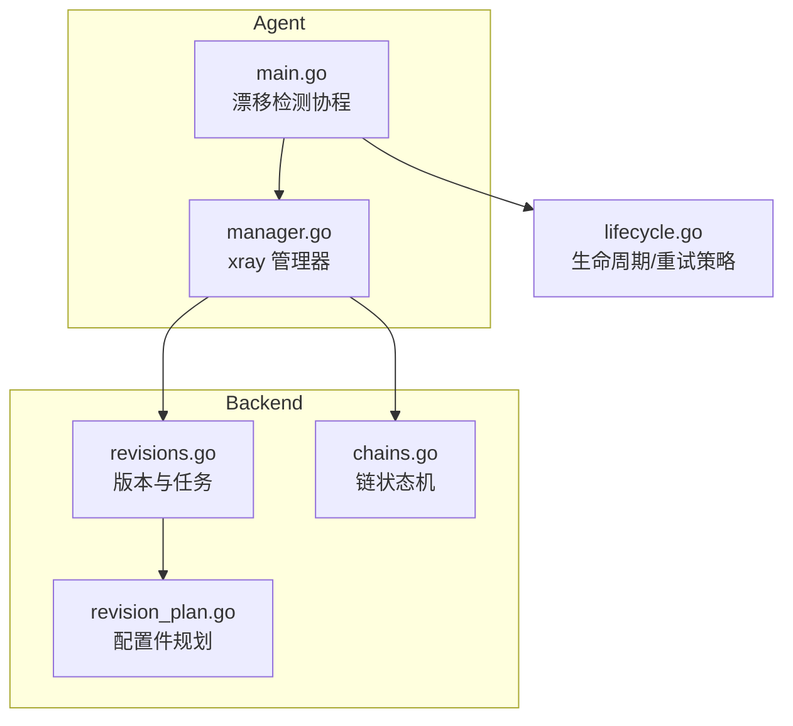
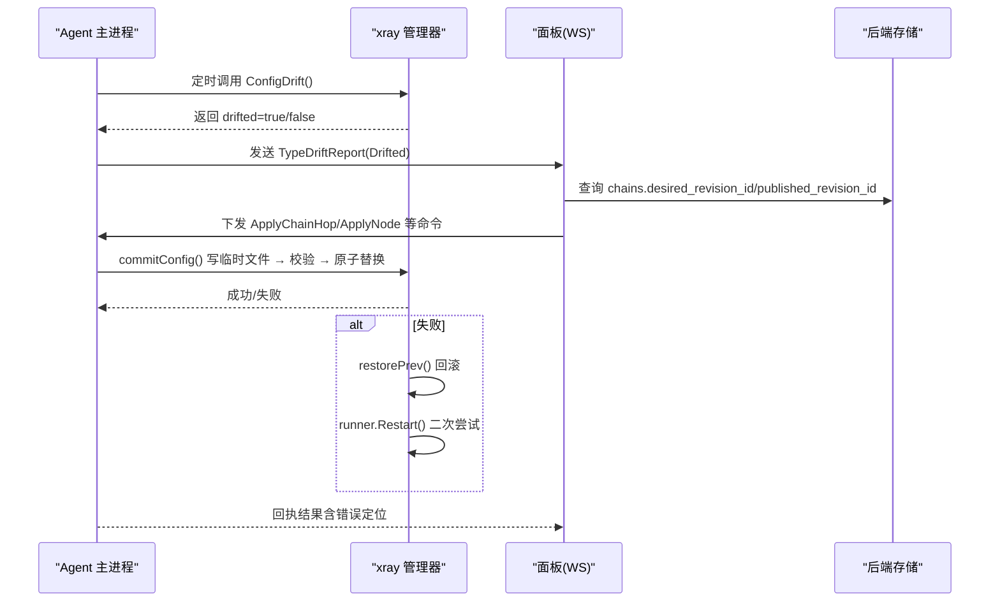
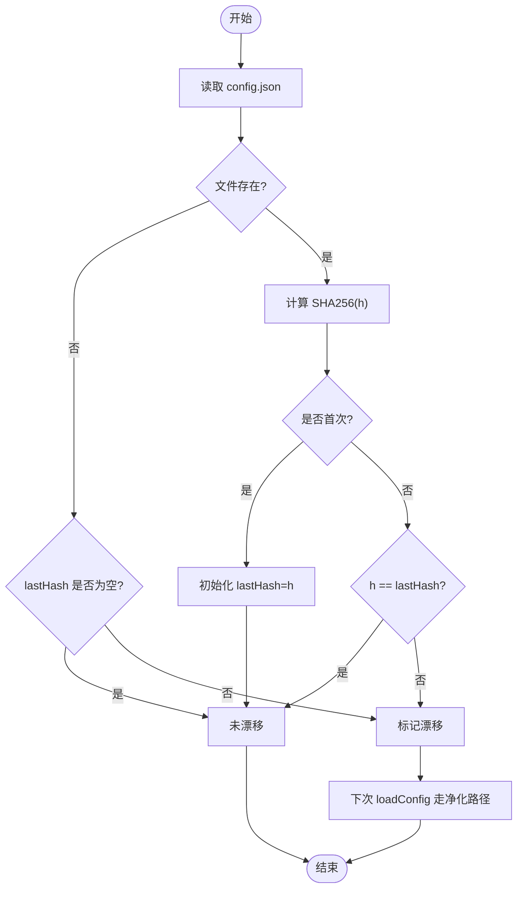
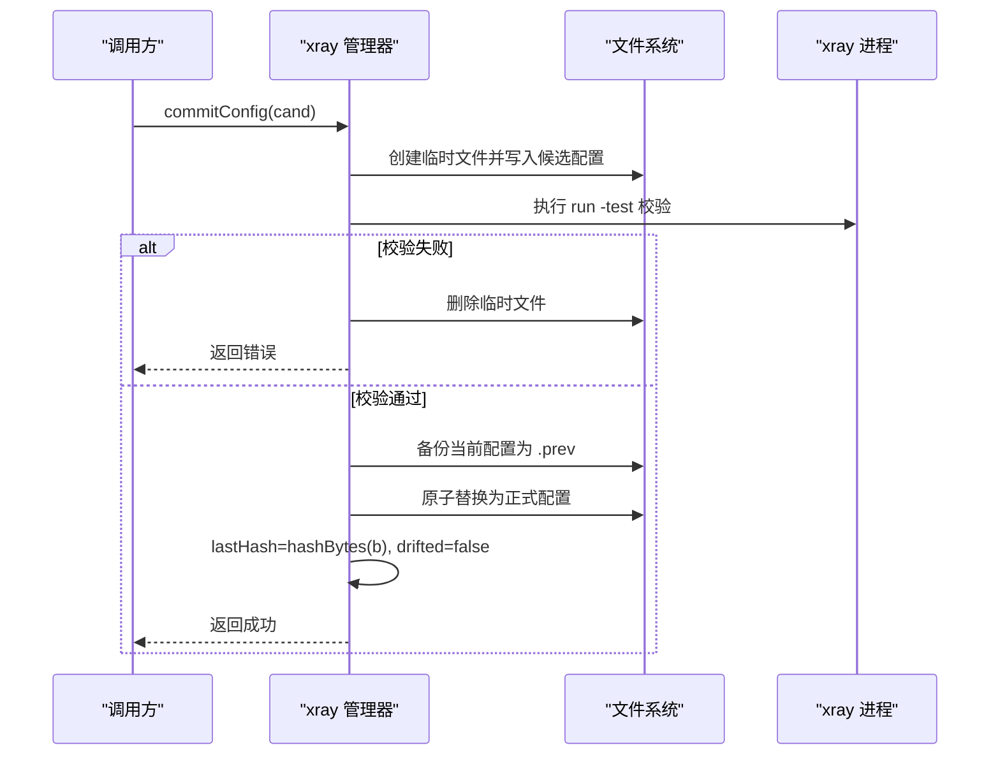
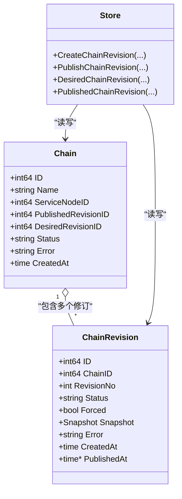
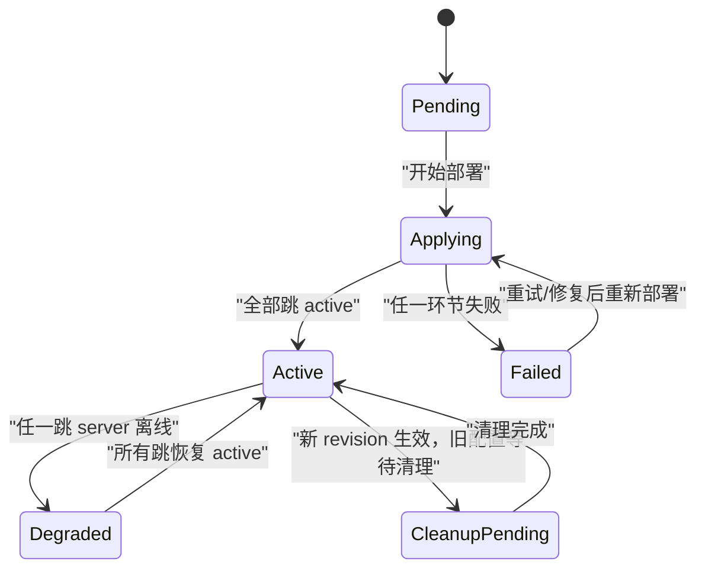
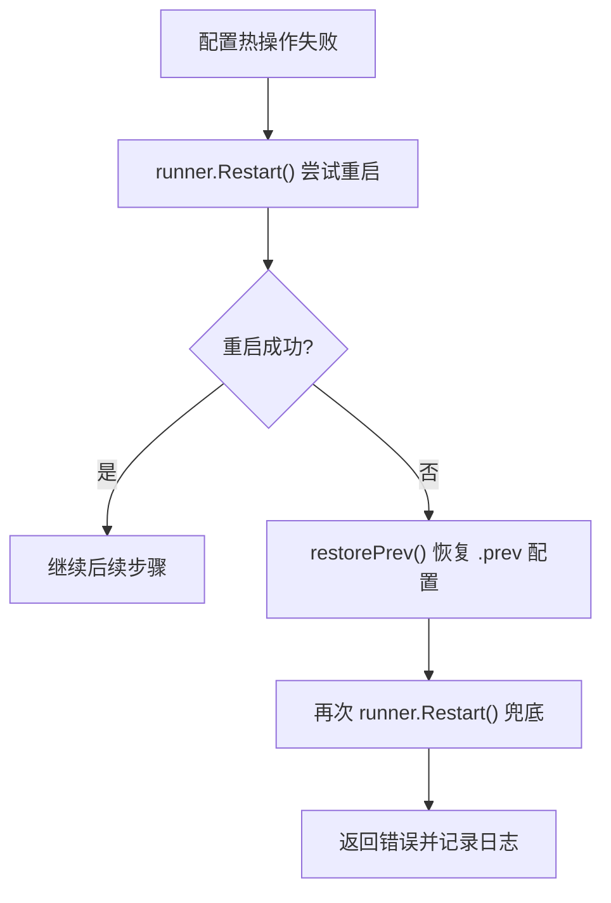
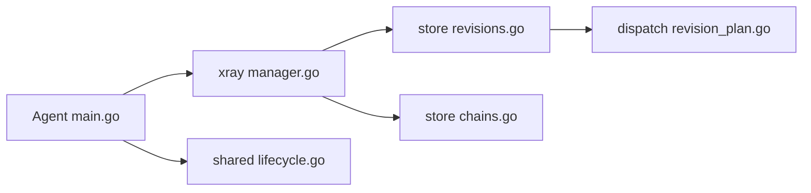

# 配置漂移检测

<cite>
**本文引用的文件**   
- [src/agent/internal/xray/manager.go](file://src/agent/internal/xray/manager.go)
- [src/agent/cmd/agent/main.go](file://src/agent/cmd/agent/main.go)
- [src/backend/internal/store/revisions.go](file://src/backend/internal/store/revisions.go)
- [src/backend/internal/store/chains.go](file://src/backend/internal/store/chains.go)
- [src/backend/internal/dispatch/revision_plan.go](file://src/backend/internal/dispatch/revision_plan.go)
- [src/shared/lifecycle.go](file://src/shared/lifecycle.go)
</cite>

## 目录
1. [简介](#简介)
2. [项目结构](#项目结构)
3. [核心组件](#核心组件)
4. [架构总览](#架构总览)
5. [详细组件分析](#详细组件分析)
6. [依赖关系分析](#依赖关系分析)
7. [性能考量](#性能考量)
8. [故障排查指南](#故障排查指南)
9. [结论](#结论)
10. [附录](#附录)

## 简介
本文件围绕“配置漂移检测”展开，系统性说明 Agent 侧如何通过 SHA256 哈希比对检测 xray 配置文件变更、自动修复机制如何触发重新应用流程、基线管理策略（已发布版本与期望版本的对比逻辑），以及配置状态机流转。文档同时给出关键实现路径与重试/错误恢复策略，帮助读者在不深入源码的情况下理解整体设计。

## 项目结构
与配置漂移检测相关的代码主要分布在以下模块：
- Agent 侧 xray 管理器：负责配置文件的读写、校验、原子替换、漂移检测与净化重建
- Agent 主进程：周期性执行漂移检测并上报事件
- Backend 存储层：维护链的已发布版本与期望版本、任务与命令编排
- 分发规划器：基于内容寻址的配置件差异计算（用于链路级重放与清理）
- 共享生命周期模型：面板与 Agent 的生命周期快照与重试策略

图表来源
- [src/agent/cmd/agent/main.go:311-353](file://src/agent/cmd/agent/main.go#L311-L353)
- [src/agent/internal/xray/manager.go:275-303](file://src/agent/internal/xray/manager.go#L275-L303)
- [src/backend/internal/store/revisions.go:387-418](file://src/backend/internal/store/revisions.go#L387-L418)
- [src/backend/internal/store/chains.go:12-26](file://src/backend/internal/store/chains.go#L12-L26)
- [src/backend/internal/dispatch/revision_plan.go:51-92](file://src/backend/internal/dispatch/revision_plan.go#L51-L92)
- [src/shared/lifecycle.go:22-45](file://src/shared/lifecycle.go#L22-L45)

章节来源
- [src/agent/cmd/agent/main.go:311-353](file://src/agent/cmd/agent/main.go#L311-L353)
- [src/agent/internal/xray/manager.go:275-303](file://src/agent/internal/xray/manager.go#L275-L303)
- [src/backend/internal/store/revisions.go:387-418](file://src/backend/internal/store/revisions.go#L387-L418)
- [src/backend/internal/store/chains.go:12-26](file://src/backend/internal/store/chains.go#L12-L26)
- [src/backend/internal/dispatch/revision_plan.go:51-92](file://src/backend/internal/dispatch/revision_plan.go#L51-L92)
- [src/shared/lifecycle.go:22-45](file://src/shared/lifecycle.go#L22-L45)

## 核心组件
- 配置漂移检测（Agent 侧）
  - 通过读取 xray 配置文件并计算 SHA256 哈希，与最后一次由 Agent 落盘的哈希进行比对；首次调用以当前文件为基线；文件被删除视为漂移
  - 检测到漂移后，下一次加载配置时以骨架 + 受管节点 inbound + 链 piece 为基，丢弃外部改动其他内容，完成“净化”重建
- 自动修复与回滚
  - 配置落地采用“临时文件 → 运行校验 → 备份 → 原子替换”的流程；失败则丢弃临时文件
  - 热操作失败或重启失败时，自动恢复上一份可用配置并再次尝试重启，确保可回滚
- 基线管理与版本对比（Backend 侧）
  - 使用 PublishedRevisionID 与 DesiredRevisionID 分别表示“已发布版本”和“期望版本”
  - 发布流程将目标修订标记为 active 或 active_unconfirmed，并更新链的状态与期望版本
- 配置状态机
  - 链级状态：pending → applying → active | failed；任一跳 server 离线推导 degraded；在线且跳均 active 后恢复 active
  - 修订状态：applying → active / active_unconfirmed / active_failed / failed / cancelled

章节来源
- [src/agent/internal/xray/manager.go:275-303](file://src/agent/internal/xray/manager.go#L275-L303)
- [src/agent/internal/xray/manager.go:318-351](file://src/agent/internal/xray/manager.go#L318-L351)
- [src/agent/internal/xray/manager.go:232-273](file://src/agent/internal/xray/manager.go#L232-L273)
- [src/backend/internal/store/revisions.go:387-418](file://src/backend/internal/store/revisions.go#L387-L418)
- [src/backend/internal/store/chains.go:12-26](file://src/backend/internal/store/chains.go#L12-L26)

## 架构总览
下图展示了从 Agent 漂移检测到后端版本管理的端到端交互：

图表来源
- [src/agent/cmd/agent/main.go:311-353](file://src/agent/cmd/agent/main.go#L311-L353)
- [src/agent/internal/xray/manager.go:275-303](file://src/agent/internal/xray/manager.go#L275-L303)
- [src/agent/internal/xray/manager.go:232-273](file://src/agent/internal/xray/manager.go#L232-L273)
- [src/backend/internal/store/revisions.go:387-418](file://src/backend/internal/store/revisions.go#L387-L418)

## 详细组件分析

### 组件A：配置漂移检测与修复（Agent 侧）
- 哈希比对算法
  - 使用 SHA256 对配置文件字节流求哈希，作为漂移检测基线
  - 首次调用时将当前文件哈希设为 lastHash；后续每次比较 h != lastHash
  - 文件不存在时，若 lastHash 非空则视为漂移
- 自动修复与净化
  - 当 drifted 为真时，loadConfig 以 skeleton 为基础，仅保留受管节点的 inbound，合并链 piece，丢弃外部改动
  - 修复完成后重置 drifted=false，避免重复误报
- 重试与错误恢复
  - commitConfig 失败会丢弃临时文件；热操作失败会回退到重启；重启失败则恢复 .prev 配置并再次重启
  - restorePrev 在恢复后同步 lastHash，避免误报

图表来源
- [src/agent/internal/xray/manager.go:275-303](file://src/agent/internal/xray/manager.go#L275-L303)
- [src/agent/internal/xray/manager.go:318-351](file://src/agent/internal/xray/manager.go#L318-L351)

章节来源
- [src/agent/internal/xray/manager.go:275-303](file://src/agent/internal/xray/manager.go#L275-L303)
- [src/agent/internal/xray/manager.go:318-351](file://src/agent/internal/xray/manager.go#L318-L351)

### 组件B：配置落盘与回滚（Agent 侧）
- 落盘流程
  - 写入临时文件 → 调用 xray run -test 校验 → 备份当前配置为 .prev → 原子替换为正式文件
  - 成功后更新 lastHash 并重置 drifted=false
- 回滚流程
  - 热操作失败或重启失败时，restorePrev 恢复 .prev 配置并再次重启，保证一致性

图表来源
- [src/agent/internal/xray/manager.go:232-273](file://src/agent/internal/xray/manager.go#L232-L273)

章节来源
- [src/agent/internal/xray/manager.go:232-273](file://src/agent/internal/xray/manager.go#L232-L273)

### 组件C：基线管理与版本对比（Backend 侧）
- 已发布版本（PublishedRevisionID）与期望版本（DesiredRevisionID）
  - CreateChainRevision 设置 desired_revision_id
  - PublishChainRevision 将目标修订标记为 active 或 active_unconfirmed，并更新 published_revision_id；强制发布时还会覆盖 desired_revision_id
- 链状态与修订状态
  - ChainStatusApplying/Active/Degraded/Failed 等
  - RevisionStatusApplying/Active/ActiveUnconfirmed/ActiveFailed/Failed/Cancelled

图表来源
- [src/backend/internal/store/chains.go:44-54](file://src/backend/internal/store/chains.go#L44-L54)
- [src/backend/internal/store/revisions.go:53-63](file://src/backend/internal/store/revisions.go#L53-63)
- [src/backend/internal/store/revisions.go:87-113](file://src/backend/internal/store/revisions.go#L87-L113)
- [src/backend/internal/store/revisions.go:387-418](file://src/backend/internal/store/revisions.go#L387-L418)

章节来源
- [src/backend/internal/store/revisions.go:87-113](file://src/backend/internal/store/revisions.go#L87-L113)
- [src/backend/internal/store/revisions.go:387-418](file://src/backend/internal/store/revisions.go#L387-L418)
- [src/backend/internal/store/chains.go:44-54](file://src/backend/internal/store/chains.go#L44-L54)

### 组件D：配置状态转换图（active → degraded → applying → active）
- 链级状态机
  - pending → applying → active | failed
  - 任一跳 server 离线推导 degraded；在线且跳均 active 后恢复 active
- 修订状态机
  - applying → active / active_unconfirmed / active_failed / failed / cancelled

图表来源
- [src/backend/internal/store/chains.go:12-26](file://src/backend/internal/store/chains.go#L12-L26)
- [src/backend/internal/store/revisions.go:12-20](file://src/backend/internal/store/revisions.go#L12-20)

章节来源
- [src/backend/internal/store/chains.go:12-26](file://src/backend/internal/store/chains.go#L12-L26)
- [src/backend/internal/store/revisions.go:12-20](file://src/backend/internal/store/revisions.go#L12-20)

### 组件E：重试机制与错误恢复策略
- Agent 侧重试
  - WS 连接失败按指数退避与面板生命周期策略重试
  - 配置热操作失败回退到重启；重启失败回滚配置并再次重启
- 后端侧重试
  - 任务失败可复位并重试（ResetFailedRevisionTasks）
  - 命令与任务状态机支持 pending/queued/acked/failed/abandoned 等状态流转

图表来源
- [src/agent/internal/xray/manager.go:221-230](file://src/agent/internal/xray/manager.go#L221-L230)
- [src/agent/internal/xray/manager.go:305-316](file://src/agent/internal/xray/manager.go#L305-L316)

章节来源
- [src/agent/internal/xray/manager.go:221-230](file://src/agent/internal/xray/manager.go#L221-L230)
- [src/agent/internal/xray/manager.go:305-316](file://src/agent/internal/xray/manager.go#L305-L316)
- [src/backend/internal/store/revisions.go:380-385](file://src/backend/internal/store/revisions.go#L380-385)

## 依赖关系分析
- Agent 主进程依赖 xray 管理器进行配置检测与修改，并通过 WS 与面板通信
- 后端存储层提供链与修订的持久化能力，驱动编排与状态机
- 分发规划器基于内容寻址生成配置件差异，减少不必要的重发与清理

图表来源
- [src/agent/cmd/agent/main.go:311-353](file://src/agent/cmd/agent/main.go#L311-L353)
- [src/agent/internal/xray/manager.go:275-303](file://src/agent/internal/xray/manager.go#L275-L303)
- [src/backend/internal/store/revisions.go:387-418](file://src/backend/internal/store/revisions.go#L387-L418)
- [src/backend/internal/store/chains.go:12-26](file://src/backend/internal/store/chains.go#L12-L26)
- [src/backend/internal/dispatch/revision_plan.go:51-92](file://src/backend/internal/dispatch/revision_plan.go#L51-L92)
- [src/shared/lifecycle.go:22-45](file://src/shared/lifecycle.go#L22-L45)

章节来源
- [src/agent/cmd/agent/main.go:311-353](file://src/agent/cmd/agent/main.go#L311-L353)
- [src/agent/internal/xray/manager.go:275-303](file://src/agent/internal/xray/manager.go#L275-L303)
- [src/backend/internal/store/revisions.go:387-418](file://src/backend/internal/store/revisions.go#L387-L418)
- [src/backend/internal/store/chains.go:12-26](file://src/backend/internal/store/chains.go#L12-L26)
- [src/backend/internal/dispatch/revision_plan.go:51-92](file://src/backend/internal/dispatch/revision_plan.go#L51-L92)
- [src/shared/lifecycle.go:22-45](file://src/shared/lifecycle.go#L22-L45)

## 性能考量
- 哈希计算开销：SHA256 对配置文件字节流求哈希，复杂度 O(n)，n 为文件大小；通常配置文件较小，开销可忽略
- 文件 I/O：临时文件写入与原子替换最小化锁持有时间；.prev 备份仅在替换前执行一次
- 热操作优先：优先 gRPC 热操作，失败再回退到重启，降低服务中断时间
- 定期检测间隔：漂移检测间隔由 Agent 设置控制，避免频繁 I/O

[本节为通用指导，不直接分析具体文件]

## 故障排查指南
- 常见漂移场景
  - 配置文件被外部工具修改：ConfigDrift 返回 true，下一次 loadConfig 走净化路径重建
  - 配置文件被删除：若 lastHash 非空，视为漂移
- 回滚与恢复
  - 热操作失败：回退到重启；重启失败：恢复 .prev 配置并再次重启
  - 检查 .prev 是否存在，确认 restorePrev 是否成功
- 日志与上报
  - 漂移检测协程会在 drifted 变化时上报 TypeDriftReport
  - 观察 Agent 日志中“配置漂移检测”“配置校验失败”“回滚配置”等关键字

章节来源
- [src/agent/cmd/agent/main.go:311-353](file://src/agent/cmd/agent/main.go#L311-L353)
- [src/agent/internal/xray/manager.go:275-303](file://src/agent/internal/xray/manager.go#L275-L303)
- [src/agent/internal/xray/manager.go:305-316](file://src/agent/internal/xray/manager.go#L305-L316)

## 结论
通过 SHA256 哈希比对与净化重建，Agent 能够可靠地检测并修复配置漂移；配合“临时文件→校验→原子替换”的落盘流程与回滚机制，确保配置变更的安全性与一致性。后端通过 PublishedRevisionID 与 DesiredRevisionID 管理基线与期望版本，结合链与修订状态机，形成完整的配置治理闭环。

[本节为总结性内容，不直接分析具体文件]

## 附录
- 关键实现路径参考
  - 漂移检测：ConfigDrift、hashBytes
  - 配置落盘：commitConfig、restorePrev
  - 净化重建：loadConfig（drifted 分支）
  - 版本发布：PublishChainRevision
  - 状态机常量：ChainStatus*、RevisionStatus*

章节来源
- [src/agent/internal/xray/manager.go:275-303](file://src/agent/internal/xray/manager.go#L275-L303)
- [src/agent/internal/xray/manager.go:232-273](file://src/agent/internal/xray/manager.go#L232-L273)
- [src/agent/internal/xray/manager.go:318-351](file://src/agent/internal/xray/manager.go#L318-L351)
- [src/backend/internal/store/revisions.go:387-418](file://src/backend/internal/store/revisions.go#L387-L418)
- [src/backend/internal/store/chains.go:12-26](file://src/backend/internal/store/chains.go#L12-L26)