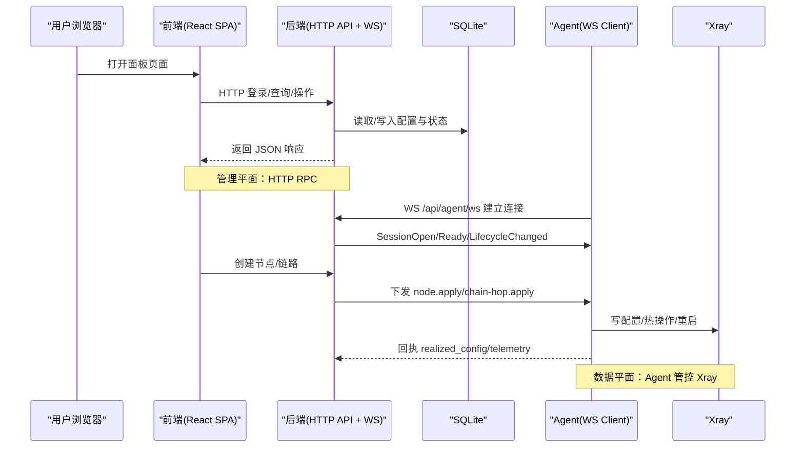
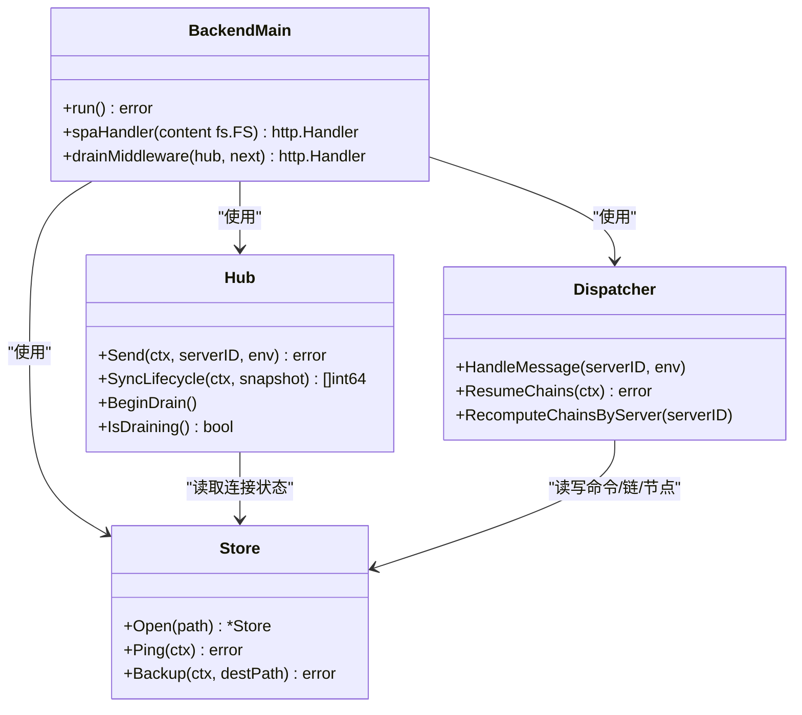
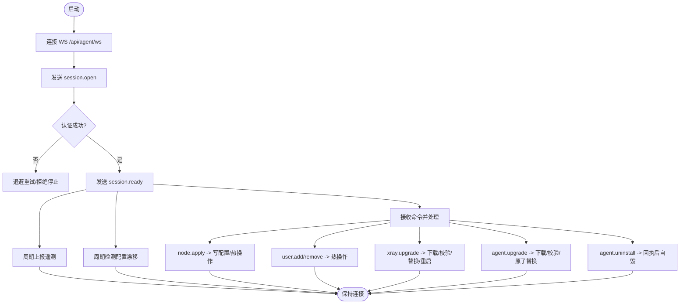
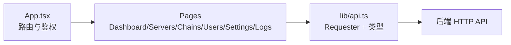
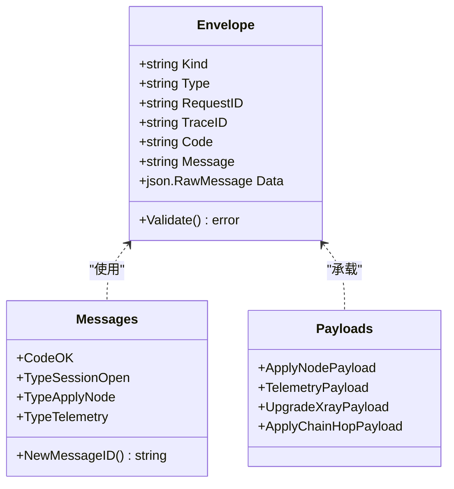
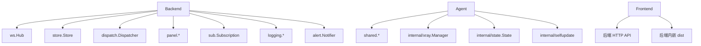
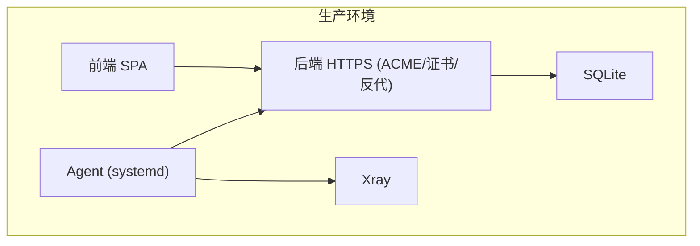

# 整体架构概览

<cite>
**本文引用的文件**   
- [src/backend/cmd/backend/main.go](file://src/backend/cmd/backend/main.go)
- [src/agent/cmd/agent/main.go](file://src/agent/cmd/agent/main.go)
- [src/backend/internal/ws/hub.go](file://src/backend/internal/ws/hub.go)
- [src/backend/internal/store/store.go](file://src/backend/internal/store/store.go)
- [src/shared/messages.go](file://src/shared/messages.go)
- [src/frontend/package.json](file://src/frontend/package.json)
- [src/frontend/src/App.tsx](file://src/frontend/src/App.tsx)
- [docs/framework-design.md](file://docs/framework-design.md)
- [docs/rpc-api-design.md](file://docs/rpc-api-design.md)
</cite>

## 目录
1. [简介](#简介)
2. [项目结构](#项目结构)
3. [核心组件](#核心组件)
4. [架构总览](#架构总览)
5. [详细组件分析](#详细组件分析)
6. [依赖关系分析](#依赖关系分析)
7. [性能与可靠性](#性能与可靠性)
8. [故障排查指南](#故障排查指南)
9. [结论](#结论)
10. [附录：部署拓扑与技术选型](#附录部署拓扑与技术选型)

## 简介
本概览面向 Lattix-codex 的整体架构，聚焦微服务模式下的后端（Backend）、Agent、前端（Frontend）与共享模块（Shared）的职责划分与协作方式。系统采用“单通道 WebSocket”作为 Agent 与 Backend 的长连接控制面，HTTP API 用于面板管理；数据流向遵循“用户请求 → 前端 → 后端 API → 数据库”，以及“配置下发 → 后端 → WebSocket → Agent → Xray”。关键设计包括：单通道通信、无 fallback 实现、离线命令队列、SQLite 嵌入式存储、React SPA 前端等。

## 项目结构
仓库采用 monorepo 组织，前后端与工具脚本分离：
- src/backend：Go 编写的后端服务，提供 HTTP 管理 API、WebSocket 端点、SQLite 存储与面板逻辑
- src/agent：Go 编写的受控服务器代理，主动拨出到后端 WS，独占管理 xray
- src/frontend：Vite + React + TypeScript + shadcn/ui 的单页应用，构建产物由后端内嵌托管
- src/shared：Go 模块，定义后端与 Agent 共用的消息结构与类型，保证协议一致性
- docs：设计与契约文档（框架、RPC、前端、日志、计费、链路等）
- scripts：安装与运维脚本（install-panel.sh、install-agent.sh、latx-ag.sh 等）

```mermaid
graph TB
subgraph "前端"
FE["React SPA<br/>Vite + TypeScript"]
end
subgraph "后端"
BE["Backend<br/>HTTP API + WS Hub + Store"]
DB["SQLite<br/>embedded"]
end
subgraph "Agent"
AG["Agent<br/>WS Client + Xray Manager"]
XR["Xray<br/>进程管理"]
end
FE --> |"HTTP RPC"| BE
BE --> |"WS 长连接"| AG
AG --> |"gRPC/进程调用"| XR
BE <- --> |"读写"| DB
```

**图表来源** 
- [src/backend/cmd/backend/main.go:1-120](file://src/backend/cmd/backend/main.go#L1-L120)
- [src/agent/cmd/agent/main.go:1-120](file://src/agent/cmd/agent/main.go#L1-L120)
- [src/backend/internal/store/store.go:1-120](file://src/backend/internal/store/store.go#L1-L120)
- [docs/framework-design.md:23-60](file://docs/framework-design.md#L23-L60)

**章节来源**
- [docs/framework-design.md:45-62](file://docs/framework-design.md#L45-L62)
- [docs/frontend.md:1-17](file://docs/frontend.md#L1-L17)

## 核心组件
- 后端（Backend）
  - HTTP API：管理员操作、订阅生成、备份下载、健康检查
  - WebSocket Hub：Agent 连接注册、认证、消息路由、生命周期同步
  - Store：SQLite 封装，DDL、事务迁移、备份导出
  - Dispatch：命令分发、离线队列、链编排与状态推导
- Agent
  - WS 客户端：主动拨出、心跳保活、延迟探测、遥测上报
  - Xray 管理器：配置落地、热操作、升级、漂移检测
  - 自更新：二进制替换与重启
- 前端（Frontend）
  - React SPA：登录、仪表盘、服务器/链路/用户管理、设置与日志
  - Requester：构造 HTTP 请求、统一信封解析、错误转换
- 共享模块（Shared）
  - 消息信封与类型：统一的 RPC 信封、业务码、消息类型、载荷结构

**章节来源**
- [src/backend/cmd/backend/main.go:1-120](file://src/backend/cmd/backend/main.go#L1-L120)
- [src/backend/internal/ws/hub.go:1-120](file://src/backend/internal/ws/hub.go#L1-L120)
- [src/backend/internal/store/store.go:1-120](file://src/backend/internal/store/store.go#L1-L120)
- [src/agent/cmd/agent/main.go:1-120](file://src/agent/cmd/agent/main.go#L1-L120)
- [src/shared/messages.go:1-120](file://src/shared/messages.go#L1-L120)
- [src/frontend/package.json:1-48](file://src/frontend/package.json#L1-L48)

## 架构总览
系统边界清晰：
- 前端通过 HTTP 访问后端管理 API，静态资源由后端内嵌或外部覆盖
- 后端通过 SQLite 持久化所有配置、遥测与审计数据
- Agent 以单条 WS 长连接主动拨出至后端，承担全部双向控制通信
- Xray 由 Agent 独占管理，后端不直接访问 Xray



**图表来源** 
- [src/backend/cmd/backend/main.go:320-475](file://src/backend/cmd/backend/main.go#L320-L475)
- [src/agent/cmd/agent/main.go:138-260](file://src/agent/cmd/agent/main.go#L138-L260)
- [src/backend/internal/ws/hub.go:250-360](file://src/backend/internal/ws/hub.go#L250-L360)
- [docs/rpc-api-design.md:143-210](file://docs/rpc-api-design.md#L143-L210)

## 详细组件分析

### 后端（Backend）
- 启动与路由
  - 解析参数（地址、数据库路径、TLS、ACME、静态目录等），初始化 Store、Lifecycle、Logging
  - 注册 WS 端点 /api/agent/ws、管理 API、订阅端点、SPA 回退与健康检查
- TLS 策略
  - 支持 ACME 自动证书、自带证书、域名路径模式热加载；设置页可覆盖启动参数
- WS Hub
  - 连接注册表、发送缓冲、优雅关停（drain）、生命周期同步（SyncLifecycle）
  - 在线/离线跃迁事件触发告警与链状态重算
- Store
  - DDL 包含 servers/users/nodes/commands/chains 等表；单连接 + busy_timeout 避免锁冲突
  - VACUUM INTO 备份导出
- Dispatch
  - 命令离线排队（commands 表），重连补发，死信标记，链编排任务状态机



**图表来源** 
- [src/backend/cmd/backend/main.go:62-120](file://src/backend/cmd/backend/main.go#L62-L120)
- [src/backend/internal/ws/hub.go:100-190](file://src/backend/internal/ws/hub.go#L100-L190)
- [src/backend/internal/store/store.go:355-396](file://src/backend/internal/store/store.go#L355-L396)

**章节来源**
- [src/backend/cmd/backend/main.go:1-120](file://src/backend/cmd/backend/main.go#L1-L120)
- [src/backend/internal/ws/hub.go:1-120](file://src/backend/internal/ws/hub.go#L1-L120)
- [src/backend/internal/store/store.go:1-120](file://src/backend/internal/store/store.go#L1-L120)

### Agent（Agent）
- 连接与认证
  - 主动拨出到 /api/agent/ws，携带 Bearer token；首帧 session.open，接收 lifecycle 快照
  - 首次换发长期凭证，后续重连不轮换；跨面板绑定清理旧状态
- 心跳与遥测
  - 每 30s Ping/Pong 保活；按设置周期上报 telemetry（主机指标、流量计数器）
- 配置下发与落地
  - 处理 node.apply/user.add/remove/xray.upgrade/agent.upgrade/uninstall 等
  - 落盘配置后调用 gRPC API 热操作，失败则重启并回滚
- 配置漂移检测
  - 周期性比对 config.json 哈希，上报 drift 状态变化



**图表来源** 
- [src/agent/cmd/agent/main.go:138-260](file://src/agent/cmd/agent/main.go#L138-L260)
- [src/agent/cmd/agent/main.go:528-666](file://src/agent/cmd/agent/main.go#L528-L666)

**章节来源**
- [src/agent/cmd/agent/main.go:1-120](file://src/agent/cmd/agent/main.go#L1-L120)
- [src/agent/cmd/agent/main.go:138-260](file://src/agent/cmd/agent/main.go#L138-L260)
- [src/agent/cmd/agent/main.go:528-666](file://src/agent/cmd/agent/main.go#L528-L666)

### 前端（Frontend）
- 技术栈：Vite + React + TypeScript + shadcn/ui，Bun 包管理
- 路由与鉴权：BrowserRouter、RequireAuth、AuthProvider、Theme/Timezone 上下文
- 页面：Dashboard/Servers/Chains/Users/Settings/Logs
- Requester：构造请求、统一信封解析、错误转换、文件下载



**图表来源** 
- [src/frontend/src/App.tsx:1-73](file://src/frontend/src/App.tsx#L1-L73)
- [src/frontend/package.json:1-48](file://src/frontend/package.json#L1-L48)

**章节来源**
- [src/frontend/src/App.tsx:1-73](file://src/frontend/src/App.tsx#L1-L73)
- [src/frontend/package.json:1-48](file://src/frontend/package.json#L1-L48)

### 共享模块（Shared）
- Envelope：统一 RPC 信封（kind/type/request_id/trace_id/data，response 含 code/message）
- 业务码：OK/ACCEPTED/AUTH_REQUIRED/INVALID_ARGUMENT/NOT_FOUND/CONFLICT/...
- 消息类型：session.open/ready/lifecycle.changed/settings.sync/apply_node/add_user/...
- 载荷结构：ApplyNodePayload/TelemetryPayload/UpgradeXrayPayload/ApplyChainHopPayload 等



**图表来源** 
- [src/shared/messages.go:1-120](file://src/shared/messages.go#L1-L120)
- [src/shared/messages.go:120-313](file://src/shared/messages.go#L120-L313)

**章节来源**
- [src/shared/messages.go:1-120](file://src/shared/messages.go#L1-L120)
- [src/shared/messages.go:120-313](file://src/shared/messages.go#L120-L313)

## 依赖关系分析
- 后端依赖
  - ws.Hub：Agent 连接管理与消息路由
  - store.Store：SQLite 数据访问与备份
  - dispatch：命令分发与链编排
  - panel/sub/logging/alert：面板逻辑、订阅、日志、告警
- Agent 依赖
  - shared：协议类型与信封
  - internal/xray：xray 进程管理、配置渲染、热操作
  - internal/state/selfupdate：状态持久化与自更新
- 前端依赖
  - React Router、shadcn/ui、Vite 构建
  - 后端内嵌 dist 或通过 -static 覆盖



**图表来源** 
- [src/backend/cmd/backend/main.go:27-37](file://src/backend/cmd/backend/main.go#L27-L37)
- [src/agent/cmd/agent/main.go:22-26](file://src/agent/cmd/agent/main.go#L22-L26)
- [src/frontend/src/App.tsx:1-20](file://src/frontend/src/App.tsx#L1-L20)

**章节来源**
- [src/backend/cmd/backend/main.go:27-37](file://src/backend/cmd/backend/main.go#L27-L37)
- [src/agent/cmd/agent/main.go:22-26](file://src/agent/cmd/agent/main.go#L22-L26)

## 性能与可靠性
- 单通道 WS：一条连接承载全部控制面，减少连接开销与 NAT 穿透复杂度
- 离线队列：commands 表缓存未终态命令，重连后幂等补发；attempts 上限标记死信
- SQLite 单连接 + busy_timeout：避免并发写锁冲突，VACUUM INTO 安全备份
- 优雅关停：Hub.BeginDrain 拒绝新工作，关闭 WS 连接，等待协程退出
- 心跳与超时：Agent 30s Ping，Panel 90s 无字节判定死亡；写超时 10s
- 链状态推导：Agent 在线/离线跃迁触发 degraded/active 重算，保障订阅可用性

**章节来源**
- [src/backend/internal/ws/hub.go:15-25](file://src/backend/internal/ws/hub.go#L15-L25)
- [src/backend/internal/store/store.go:365-396](file://src/backend/internal/store/store.go#L365-L396)
- [src/backend/cmd/backend/main.go:524-567](file://src/backend/cmd/backend/main.go#L524-L567)
- [docs/framework-design.md:40-44](file://docs/framework-design.md#L40-L44)

## 故障排查指南
- 连接问题
  - 检查 WS 端点 /api/agent/ws 是否可达，Token 是否正确
  - 查看 Agent 日志中的认证拒绝与退避重试
- 配置下发失败
  - 确认 node.apply 回执 realized_config；失败时检查 xray 热操作与重启回滚
  - 观察 commands 表状态（queued/sent/acked/failed）
- 配置漂移
  - Agent 上报 config.drift=true；在面板执行修复漂移，重新 apply active 节点
- 健康检查
  - /healthz 进程存活；/readyz 检查初始化与 DB 连通性
- 备份与恢复
  - 使用 /api/backup/download 获取一致快照；确保 busy_timeout 生效

**章节来源**
- [src/agent/cmd/agent/main.go:78-98](file://src/agent/cmd/agent/main.go#L78-L98)
- [src/backend/cmd/backend/main.go:376-424](file://src/backend/cmd/backend/main.go#L376-L424)
- [src/backend/internal/store/store.go:388-396](file://src/backend/internal/store/store.go#L388-L396)

## 结论
Lattix-codex 通过清晰的微服务边界与单通道 WS 控制面，实现了高可靠、易运维的面板化管理。后端集中管理配置与状态，Agent 专注本地执行与遥测，前端提供直观交互。SQLite 与 React SPA 的选择契合 MVP 规模与快速迭代需求。未来可在 Requester 接口上扩展其他传输实现，但当前单通道已满足目标场景。

## 附录：部署拓扑与技术选型
- 部署拓扑
  - 前端 SPA 由后端内嵌或外部 staticDir 覆盖
  - 后端监听 HTTP/HTTPS（ACME/自带证书/反向代理终止）
  - Agent 主动拨出到后端 WS，独占管理 xray
- 技术选型原因
  - Go：高性能、并发模型简单、生态完善（gorilla/websocket、modernc/sqlite）
  - SQLite：嵌入式、零运维、适合单机/小规模多实例
  - React SPA：现代前端工程化、组件库丰富、构建产物可内嵌
  - 单通道 WS：简化 NAT/防火墙策略，降低连接复杂度
  - 无 fallback：MVP 阶段无需多传输实现，Requester 接口预留扩展



**图表来源** 
- [docs/framework-design.md:23-60](file://docs/framework-design.md#L23-L60)
- [src/backend/cmd/backend/main.go:448-472](file://src/backend/cmd/backend/main.go#L448-L472)

**章节来源**
- [docs/framework-design.md:45-62](file://docs/framework-design.md#L45-L62)
- [docs/rpc-api-design.md:356-365](file://docs/rpc-api-design.md#L356-L365)