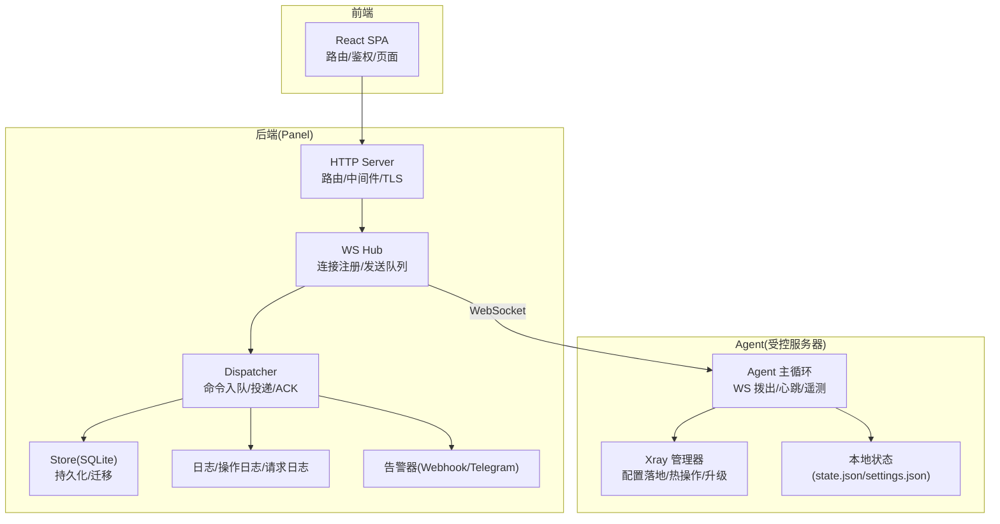
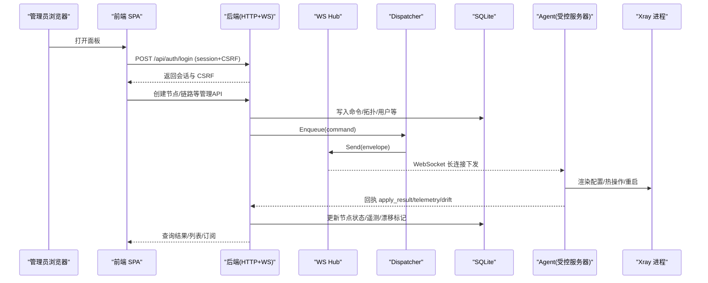
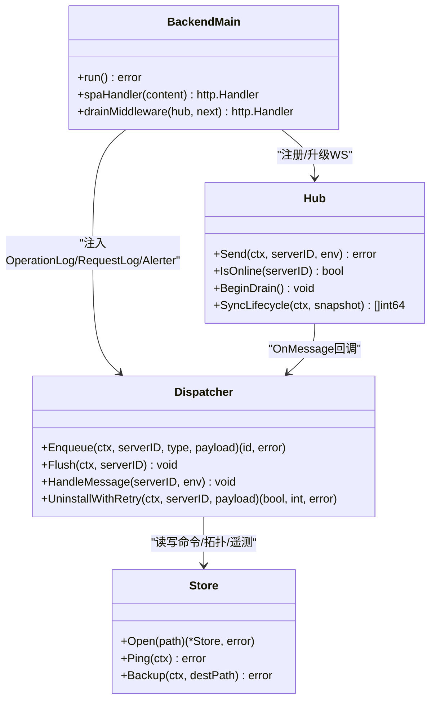
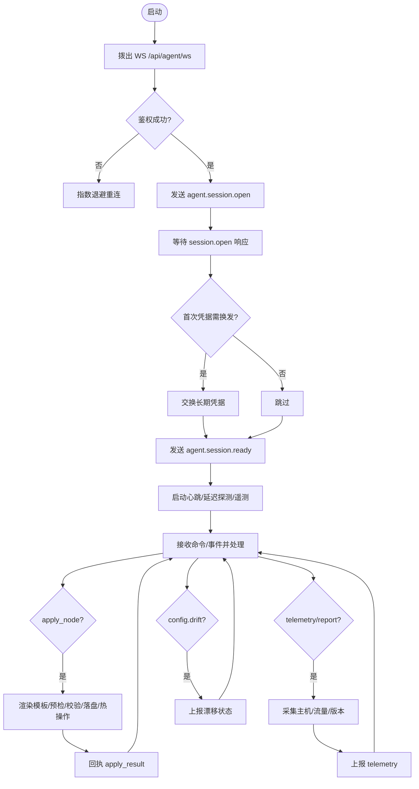
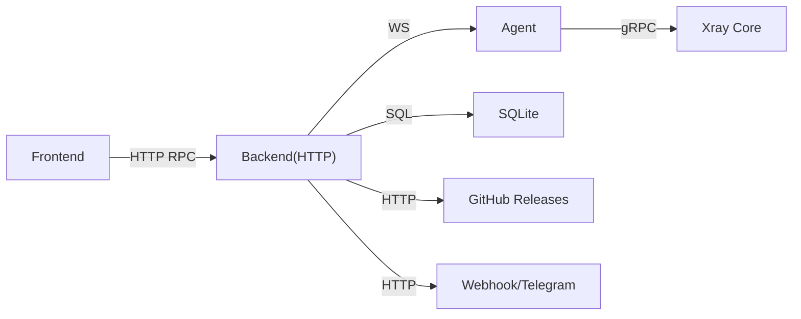

# 架构设计

<cite>
**本文引用的文件**   
- [src/backend/cmd/backend/main.go](file://src/backend/cmd/backend/main.go)
- [src/agent/cmd/agent/main.go](file://src/agent/cmd/agent/main.go)
- [src/frontend/src/App.tsx](file://src/frontend/src/App.tsx)
- [src/shared/messages.go](file://src/shared/messages.go)
- [src/shared/config.go](file://src/shared/config.go)
- [src/backend/internal/ws/hub.go](file://src/backend/internal/ws/hub.go)
- [src/backend/internal/dispatch/dispatcher.go](file://src/backend/internal/dispatch/dispatcher.go)
- [src/backend/internal/store/store.go](file://src/backend/internal/store/store.go)
- [docs/rpc-api-design.md](file://docs/rpc-api-design.md)
- [docs/framework-design.md](file://docs/framework-design.md)
- [docs/panel-lifecycle-state-machine-design.md](file://docs/panel-lifecycle-state-machine-design.md)
</cite>

## 目录
1. [引言](#引言)
2. [项目结构](#项目结构)
3. [核心组件](#核心组件)
4. [架构总览](#架构总览)
5. [详细组件分析](#详细组件分析)
6. [依赖关系分析](#依赖关系分析)
7. [性能与可靠性](#性能与可靠性)
8. [故障排查指南](#故障排查指南)
9. [结论](#结论)
10. [附录：数据流与协议要点](#附录数据流与协议要点)

## 引言
本设计文档面向 Lattix-codex 项目的整体架构，覆盖前后端分离的微服务模式、后端服务（面板）、Agent 程序、前端应用与共享模块的职责边界与交互关系。重点阐述控制通道（WebSocket）与 HTTP API 的数据流、消息协议格式、事件驱动与状态机模式、插件化扩展点、系统边界、错误处理策略与技术选型权衡。通过架构图与序列图帮助读者快速理解系统结构与关键流程。

## 项目结构
仓库采用 monorepo 组织，包含四个主要子工程与脚本层：
- src/backend：Go 实现的面板 HTTP API、Agent WS 端点、SQLite 存储、日志与告警等能力
- src/agent：Go 实现的受控服务器 Agent，独立二进制由 systemd 托管
- src/frontend：Vite + React SPA，构建产物由后端内嵌或外部静态目录提供
- src/shared：Go module，定义 Panel ↔ Agent 的 WS 消息与虚拟配置类型，保证两端一致
- scripts：安装与运维脚本（install-panel.sh、install-agent.sh、latx-ag.sh 等）

图表来源
- [src/backend/cmd/backend/main.go:364-472](file://src/backend/cmd/backend/main.go#L364-L472)
- [src/backend/internal/ws/hub.go:25-62](file://src/backend/internal/ws/hub.go#L25-L62)
- [src/backend/internal/dispatch/dispatcher.go:24-48](file://src/backend/internal/dispatch/dispatcher.go#L24-L48)
- [src/backend/internal/store/store.go:355-383](file://src/backend/internal/store/store.go#L355-L383)
- [src/agent/cmd/agent/main.go:33-98](file://src/agent/cmd/agent/main.go#L33-L98)

章节来源
- [docs/framework-design.md:45-62](file://docs/framework-design.md#L45-L62)

## 核心组件
- 后端服务（Panel）
  - HTTP 服务：管理 API、订阅端点、健康检查、SPA 静态资源
  - WebSocket Hub：Agent 连接注册、认证、发送队列、生命周期同步
  - Dispatcher：命令入队、离线排队、重试与死信、遥测与漂移处理
  - Store：SQLite 单连接并发安全、事务化迁移、备份导出
  - 日志与告警：操作日志、请求日志、事件告警（Webhook/Telegram）
- Agent 程序
  - WS 客户端：主动拨出、心跳保活、延迟探测、遥测上报
  - Xray 管理器：配置模板渲染、dest 预检、热操作/重启兜底、版本升级
  - 本地状态：长期凭证、设置文档、链 piece 记录、漂移基线
- 前端应用
  - React SPA：登录、仪表盘、服务器/链路/用户/日志/设置页
  - Requester：统一构造请求、CSRF、幂等键、严格解析响应信封
- 共享模块
  - 消息信封与业务码、虚拟配置与 realized_config、协议常量与工具函数

章节来源
- [src/backend/cmd/backend/main.go:69-112](file://src/backend/cmd/backend/main.go#L69-L112)
- [src/backend/internal/ws/hub.go:25-62](file://src/backend/internal/ws/hub.go#L25-L62)
- [src/backend/internal/dispatch/dispatcher.go:24-48](file://src/backend/internal/dispatch/dispatcher.go#L24-L48)
- [src/backend/internal/store/store.go:355-383](file://src/backend/internal/store/store.go#L355-L383)
- [src/agent/cmd/agent/main.go:33-98](file://src/agent/cmd/agent/main.go#L33-L98)
- [src/shared/messages.go:13-22](file://src/shared/messages.go#L13-L22)
- [src/shared/config.go:170-206](file://src/shared/config.go#L170-L206)
- [src/frontend/src/App.tsx:37-72](file://src/frontend/src/App.tsx#L37-L72)

## 架构总览
系统采用“前后端分离 + 单通道控制面”的架构：
- 前端通过 HTTP 管理 API 与面板交互，使用 session + CSRF 保护
- 面板暴露 /api/agent/ws 作为 Agent 唯一控制通道（Agent 主动拨出）
- 面板内部以 SQLite 为权威存储，所有命令经 commands 表持久化并支持离线补发
- Agent 独占管理 xray，按模板渲染配置并通过 gRPC 热操作生效

图表来源
- [src/backend/cmd/backend/main.go:364-472](file://src/backend/cmd/backend/main.go#L364-L472)
- [src/backend/internal/ws/hub.go:110-138](file://src/backend/internal/ws/hub.go#L110-L138)
- [src/backend/internal/dispatch/dispatcher.go:50-67](file://src/backend/internal/dispatch/dispatcher.go#L50-L67)
- [src/agent/cmd/agent/main.go:137-181](file://src/agent/cmd/agent/main.go#L137-L181)

## 详细组件分析

### 后端服务（Panel）
- HTTP 路由与健康检查
  - 管理 API 遵循统一信封与严格解析；/healthz 仅进程可达；/readyz 检查初始化与 DB 可用性
  - TLS 三种模式：自带证书、ACME 自动证书、域名路径模式（热加载）
- WebSocket Hub
  - 维护连接注册表、发送队列、连接快照、优雅关停（drain）
  - 生命周期同步：panel.lifecycle.changed 带 ACK 屏障
- Dispatcher
  - 命令入队、离线排队、重连补发、死信（attempts≥10）
  - 遥测与漂移处理：保存主机指标、流量增量、配置漂移标志
- Store
  - 单连接 + busy_timeout 避免锁冲突；VACUUM INTO 一致性备份

图表来源
- [src/backend/cmd/backend/main.go:329-362](file://src/backend/cmd/backend/main.go#L329-L362)
- [src/backend/internal/ws/hub.go:110-138](file://src/backend/internal/ws/hub.go#L110-L138)
- [src/backend/internal/dispatch/dispatcher.go:50-67](file://src/backend/internal/dispatch/dispatcher.go#L50-L67)
- [src/backend/internal/store/store.go:365-383](file://src/backend/internal/store/store.go#L365-L383)

章节来源
- [src/backend/cmd/backend/main.go:364-472](file://src/backend/cmd/backend/main.go#L364-L472)
- [src/backend/internal/ws/hub.go:25-62](file://src/backend/internal/ws/hub.go#L25-L62)
- [src/backend/internal/dispatch/dispatcher.go:412-438](file://src/backend/internal/dispatch/dispatcher.go#L412-L438)
- [src/backend/internal/store/store.go:355-383](file://src/backend/internal/store/store.go#L355-L383)

### Agent 程序
- 连接与会话
  - 首次 bootstrap 换发长期凭据，两阶段事务（pending → commit）
  - 生命周期同步与应用确认（session.ready）
- 控制与遥测
  - 周期性 liveness Ping/Pong、延迟探测、telemetry 上报
  - 配置漂移检测与上报
- 配置落地
  - 模板占位符替换、dest 预检、xray run -test 校验、落盘与热操作
  - 失败回滚与重启兜底

图表来源
- [src/agent/cmd/agent/main.go:137-181](file://src/agent/cmd/agent/main.go#L137-L181)
- [src/agent/cmd/agent/main.go:391-409](file://src/agent/cmd/agent/main.go#L391-L409)
- [src/agent/cmd/agent/main.go:411-448](file://src/agent/cmd/agent/main.go#L411-L448)
- [src/agent/cmd/agent/main.go:528-666](file://src/agent/cmd/agent/main.go#L528-L666)

章节来源
- [src/agent/cmd/agent/main.go:137-181](file://src/agent/cmd/agent/main.go#L137-L181)
- [src/agent/cmd/agent/main.go:528-666](file://src/agent/cmd/agent/main.go#L528-L666)

### 前端应用
- 路由与鉴权
  - BrowserRouter 管理页面路由；RequireAuth 守卫已登录访问
  - ThemeProvider、AppDialogProvider、AuthProvider、TimezoneProvider 组合上下文
- 页面模块
  - Dashboard/Servers/Chains/Users/Logs/Settings 等页面
- Requester 与 API 契约
  - 统一构造 GET/POST/下载请求，携带 CSRF、request_id、trace_id、幂等键
  - 严格解析统一响应信封，区分业务错误与传输错误

章节来源
- [src/frontend/src/App.tsx:37-72](file://src/frontend/src/App.tsx#L37-L72)
- [docs/rpc-api-design.md:227-243](file://docs/rpc-api-design.md#L227-L243)

### 共享模块
- 消息信封与业务码
  - Envelope：kind/type/request_id/trace_id/data；response 含 code/message
  - 业务码：OK/ACCEPTED/AUTH_REQUIRED/INVALID_ARGUMENT/NOT_FOUND/CONFLICT/...
- 虚拟配置与 realized_config
  - VirtualConfig：protocol/port/flow/network/service_name/path/mode/host/method/fingerprint/encryption/template
  - RealizedConfig：port/public_key/short_id/server_name/flow/fingerprint/network/service_name/path/mode/host/method/psk/encryption
- 协议常量与工具
  - Protocols/Networks/XHTTPModes/Fingerprints/VLessEncMethods/SSMethods
  - NodeTag、占位符、确定性密码派生等

章节来源
- [src/shared/messages.go:13-22](file://src/shared/messages.go#L13-L22)
- [src/shared/messages.go:47-91](file://src/shared/messages.go#L47-L91)
- [src/shared/config.go:170-206](file://src/shared/config.go#L170-L206)
- [src/shared/config.go:16-48](file://src/shared/config.go#L16-L48)

## 依赖关系分析
- 组件耦合与职责
  - Backend 通过 ws.Hub 抽象 AgentRequester，Dispatcher 依赖 Store 与 Alerter/Logging
  - Agent 依赖 shared 消息类型与 xray 管理器；不暴露监听端点
  - Frontend 依赖后端 HTTP API，不直接访问 WS
- 外部依赖
  - SQLite（单连接 + busy_timeout）
  - gorilla/websocket（WS 通信）
  - ACME autocert（Let's Encrypt）
  - GitHub Release（二进制与校验）

图表来源
- [src/backend/cmd/backend/main.go:364-472](file://src/backend/cmd/backend/main.go#L364-L472)
- [src/backend/internal/store/store.go:365-383](file://src/backend/internal/store/store.go#L365-L383)
- [docs/rpc-api-design.md:29-41](file://docs/rpc-api-design.md#L29-L41)

章节来源
- [docs/rpc-api-design.md:29-41](file://docs/rpc-api-design.md#L29-L41)
- [src/backend/internal/store/store.go:365-383](file://src/backend/internal/store/store.go#L365-L383)

## 性能与可靠性
- 连接与队列
  - WS 每连接发送队列长度 256，写满视为慢连接断开并重连后补发
  - 读超时 90s，写超时 10s；liveness 与 latency 分离调度
- 离线与重试
  - commands 表充当离线队列；sent→acked 状态机；attempts≥10 死信
  - 重连时重置 sent 未终态命令并 Flush 补发
- 数据库
  - 单连接 + busy_timeout(5s)，避免 database is locked
  - VACUUM INTO 一致性备份
- 生命周期与就绪
  - startup/active/updating/faulted 四态；/readyz 检查初始化与 DB
  - drain 期间拒绝新业务请求，保持 WS Upgrade 可用

章节来源
- [src/backend/internal/ws/hub.go:16-22](file://src/backend/internal/ws/hub.go#L16-L22)
- [src/backend/internal/dispatch/dispatcher.go:167-241](file://src/backend/internal/dispatch/dispatcher.go#L167-L241)
- [src/backend/internal/store/store.go:365-383](file://src/backend/internal/store/store.go#L365-L383)
- [docs/panel-lifecycle-state-machine-design.md:19-36](file://docs/panel-lifecycle-state-machine-design.md#L19-L36)

## 故障排查指南
- 连接与鉴权
  - WS 握手失败：检查 Authorization Bearer token、HTTP 403 结构化 RPC body、503 暂时不可用
  - auth_rejected：面板明确拒绝当前凭证（实例 ID 不一致或凭据过期），需重新安装绑定
- 命令执行
  - 命令 stuck：查看 commands.status=queued/sent/failed；检查 Agent 在线与 Hub.IsOnline
  - 死信：attempts≥10 标记 failed，定位 node.apply/chain-hop.apply 失败原因
- 配置漂移
  - config_drift=true：Agent 检测到外部修改，面板显示徽章并提供修复按钮
- 健康检查
  - /healthz 仅进程可达；/readyz 检查初始化与 DB 可用性；drain 期间返回 503
- 日志与告警
  - 操作日志/请求日志/WS RPC 记录；事件告警（server_offline/config_drift/node_failed）

章节来源
- [src/backend/cmd/backend/main.go:377-424](file://src/backend/cmd/backend/main.go#L377-L424)
- [src/backend/internal/dispatch/dispatcher.go:625-730](file://src/backend/internal/dispatch/dispatcher.go#L625-L730)
- [docs/rpc-api-design.md:356-365](file://docs/rpc-api-design.md#L356-L365)

## 结论
Lattix-codex 采用清晰的前后端分离与单通道控制面架构，通过 WebSocket 长连接承载全部双向通信，结合 SQLite 持久化与命令队列实现高可靠控制面。Agent 独占管理 xray，按模板渲染与热操作生效，配合遥测与漂移 reconcile 保障运行态可观测与自愈。系统设计强调幂等、离线补发、死信与生命周期状态机，兼顾 NAT 与代理链场景。技术选型（Go、SQLite、gorilla/websocket、ACME）在规模假设下具备良好性能与可维护性。

## 附录：数据流与协议要点
- HTTP 管理 API
  - 方法：GET 查询，POST 动作；参数在 query/body；路由 /api/{领域}/{动作}
  - 统一响应信封：code/message/data/request_id/trace_id；HTTP 200 表达协议完成
- WebSocket 控制通道
  - 信封：kind/type/request_id/trace_id/data；response 含 code/message
  - 初始动作：agent.session.open/ready、credential.commit、lifecycle.changed
  - 业务动作：node.apply/remove、user.add/remove、chain-hop.apply/remove、xray.upgrade、agent.upgrade/uninstall
  - 事件：telemetry.report、config.drift、settings.sync/changed
- 订阅与链接
  - mihomo YAML 与 vless:// links；userinfo 头包含用量与有效期
- 生命周期与连接状态
  - Panel：startup/active/updating/faulted
  - Agent 连接：never_connected/connecting/reconnecting/online/offline/auth_rejected

章节来源
- [docs/rpc-api-design.md:42-122](file://docs/rpc-api-design.md#L42-L122)
- [docs/rpc-api-design.md:283-354](file://docs/rpc-api-design.md#L283-L354)
- [docs/framework-design.md:98-128](file://docs/framework-design.md#L98-L128)
- [docs/panel-lifecycle-state-machine-design.md:19-36](file://docs/panel-lifecycle-state-machine-design.md#L19-L36)