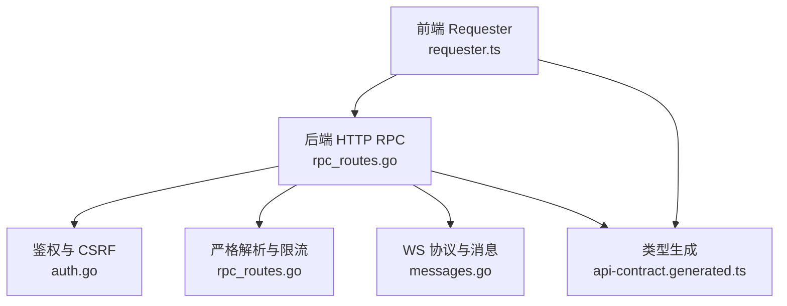
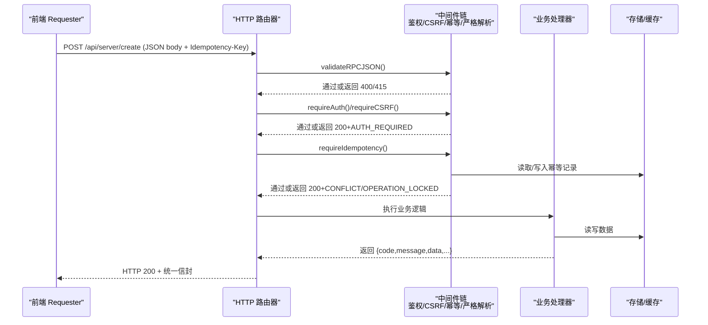
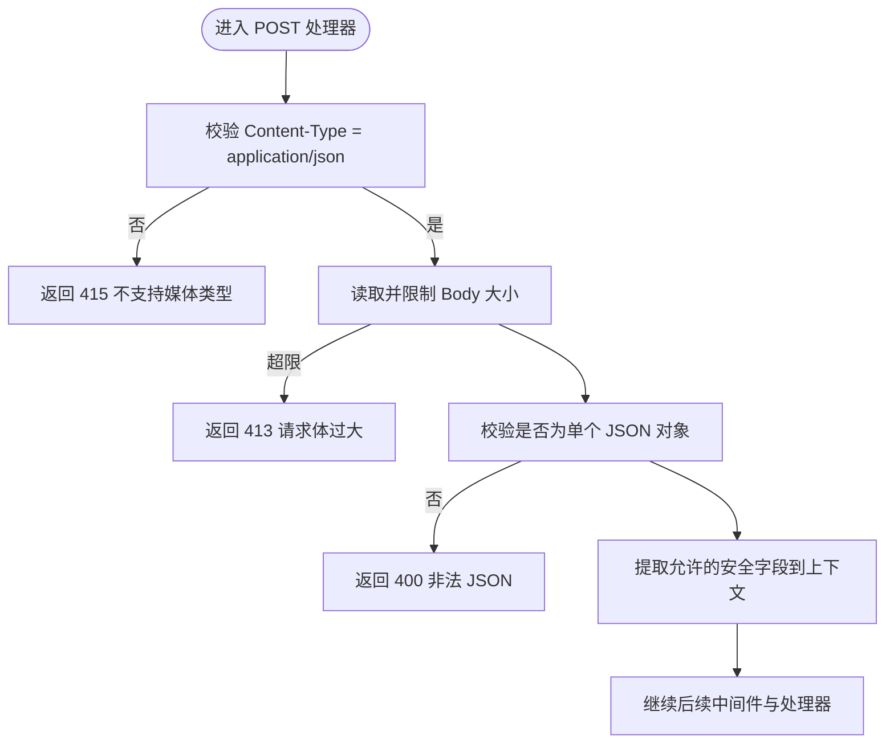
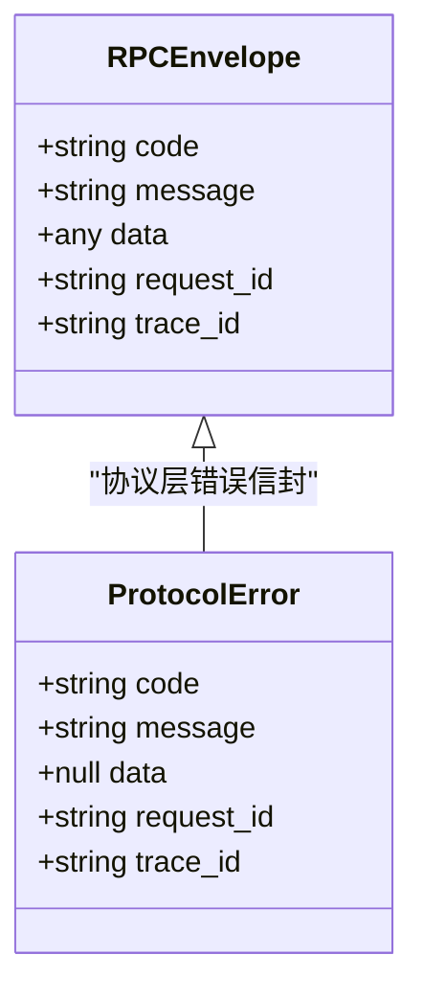
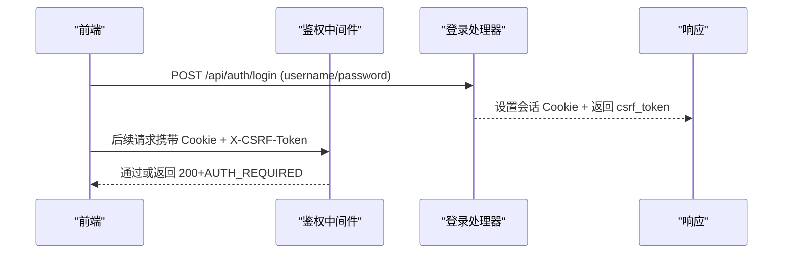
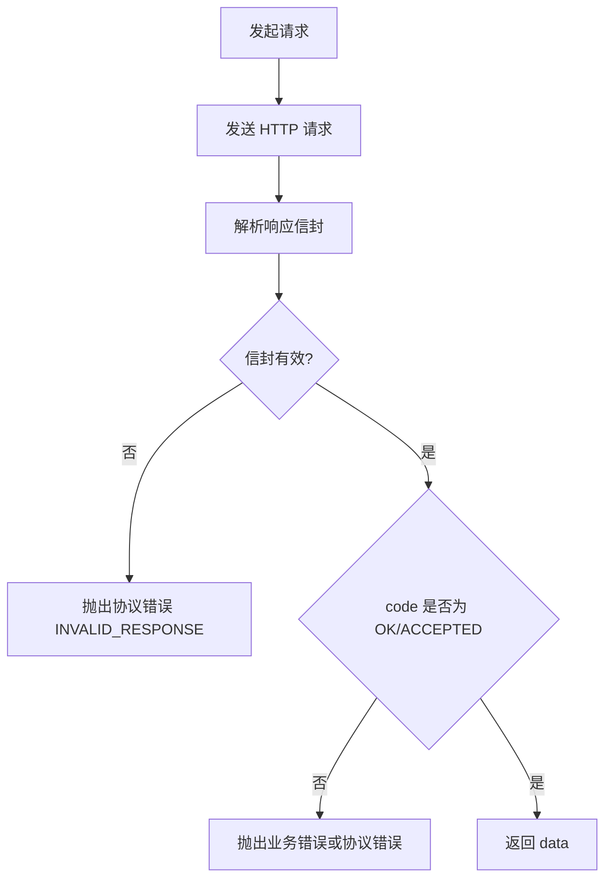
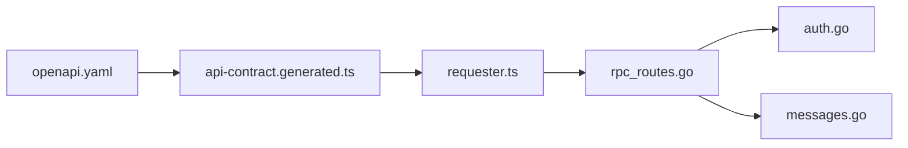

# HTTP RPC API

<cite>
**本文引用的文件**   
- [rpc-api-design.md](file://docs/rpc-api-design.md)
- [openapi.yaml](file://docs/openapi.yaml)
- [rpc_routes.go](file://src/backend/internal/panel/rpc_routes.go)
- [messages.go](file://src/shared/messages.go)
- [auth.go](file://src/backend/internal/panel/auth.go)
- [requester.ts](file://src/frontend/src/lib/requester.ts)
- [api-contract.generated.ts](file://src/frontend/src/lib/api-contract.generated.ts)
</cite>

## 目录
1. [简介](#简介)
2. [项目结构](#项目结构)
3. [核心组件](#核心组件)
4. [架构总览](#架构总览)
5. [详细组件分析](#详细组件分析)
6. [依赖关系分析](#依赖关系分析)
7. [性能考虑](#性能考虑)
8. [故障排查指南](#故障排查指南)
9. [结论](#结论)
10. [附录：API 端点清单与示例](#附录api-端点清单与示例)

## 简介
本文件为 Lattix 管理面板的 HTTP RPC API 完整说明，面向前端、后端与集成方。文档涵盖：
- RESTful 路由设计原则与方法约定（GET 只读，POST 所有动作，不使用 PUT/PATCH/DELETE）
- 统一响应信封结构与字段语义
- 严格解析规则（Content-Type、未知字段拒绝、类型校验等）
- 业务状态码体系（标准码与领域特定码）
- 完整的 API 端点清单（认证、服务器、节点、链路、用户、设置、面板、备份、日志等）
- 请求/响应示例与错误处理最佳实践

## 项目结构
本项目将协议契约、后端实现与前端调用层分离：
- 协议与设计：OpenAPI 契约与 RPC 设计文档
- 后端：HTTP 路由注册、中间件、鉴权、CSRF、幂等、严格解析
- 共享协议：WebSocket 信封与业务码定义
- 前端：Requester 封装、类型生成、错误分类与重试策略

图表来源
- [rpc_routes.go:33-72](file://src/backend/internal/panel/rpc_routes.go#L33-L72)
- [auth.go:197-213](file://src/backend/internal/panel/auth.go#L197-L213)
- [messages.go:13-45](file://src/shared/messages.go#L13-L45)
- [openapi.yaml:1-13](file://docs/openapi.yaml#L1-L13)
- [requester.ts:227-265](file://src/frontend/src/lib/requester.ts#L227-L265)

章节来源
- [rpc-api-design.md:1-10](file://docs/rpc-api-design.md#L1-L10)
- [openapi.yaml:1-13](file://docs/openapi.yaml#L1-L13)

## 核心组件
- 路由与中间件：统一注册 GET/POST 路由，自动注入鉴权、CSRF、幂等、严格解析与日志策略
- 严格解析器：强制 application/json、拒绝未知字段、限制 body 大小、校验 query 参数白名单与唯一性
- 鉴权与会话：基于 Cookie 的会话与 HMAC 签名，登录/登出/当前用户接口
- 幂等控制：Idempotency-Key 去重，按“操作者+路由+Key”持久化首次响应
- 统一信封：所有管理 JSON RPC 返回 code/message/data/request_id/trace_id
- 前端 Requester：构造请求、自动携带 CSRF/ID、超时取消、信封校验、错误分类与重试

章节来源
- [rpc_routes.go:33-72](file://src/backend/internal/panel/rpc_routes.go#L33-L72)
- [rpc_routes.go:82-123](file://src/backend/internal/panel/rpc_routes.go#L82-L123)
- [rpc_routes.go:157-242](file://src/backend/internal/panel/rpc_routes.go#L157-L242)
- [auth.go:81-145](file://src/backend/internal/panel/auth.go#L81-L145)
- [messages.go:54-70](file://src/shared/messages.go#L54-L70)
- [requester.ts:227-265](file://src/frontend/src/lib/requester.ts#L227-L265)

## 架构总览
HTTP RPC 请求从前端 Requester 发起，经浏览器安全头（CSRF、同源校验）到达后端路由，依次经过严格解析、鉴权、CSRF、幂等检查后进入具体处理器；成功或失败均返回统一信封。异步操作快速返回 ACCEPTED，后续通过 GET 查询状态。

图表来源
- [rpc_routes.go:33-72](file://src/backend/internal/panel/rpc_routes.go#L33-L72)
- [rpc_routes.go:82-123](file://src/backend/internal/panel/rpc_routes.go#L82-L123)
- [rpc_routes.go:157-242](file://src/backend/internal/panel/rpc_routes.go#L157-L242)
- [auth.go:197-213](file://src/backend/internal/panel/auth.go#L197-L213)

## 详细组件分析

### 路由与方法约定
- 方法约定：GET 仅用于只读查询；所有动作使用 POST；不使用 PUT/PATCH/DELETE
- 路由命名：/api/{单数领域}/{kebab-case 动作}
- 参数位置：GET 仅 query string；POST 仅 JSON body
- ID 命名：server_id、node_id、chain_id、user_id 等明确名称，避免 {id} 路径占位

章节来源
- [rpc-api-design.md:44-53](file://docs/rpc-api-design.md#L44-L53)
- [openapi.yaml:14-39](file://docs/openapi.yaml#L14-L39)

### 严格解析规则
- Content-Type 必须为 application/json
- POST body 必须为单个 JSON 对象，空参发送 {}
- 默认 body 上限 1 MiB，大载荷动作单独声明
- 拒绝未知字段、类型不匹配、多个连续值与尾随垃圾
- GET 拒绝未知 query 参数与重复的单值参数

图表来源
- [rpc_routes.go:82-107](file://src/backend/internal/panel/rpc_routes.go#L82-L107)
- [rpc_routes.go:125-149](file://src/backend/internal/panel/rpc_routes.go#L125-L149)

章节来源
- [rpc-api-design.md:211-223](file://docs/rpc-api-design.md#L211-L223)
- [rpc_routes.go:82-123](file://src/backend/internal/panel/rpc_routes.go#L82-L123)

### 统一响应信封
- 字段：code、message、data、request_id、trace_id
- 无数据时 data 为 null，不返回 204
- 异步操作快速返回 ACCEPTED，随后通过 GET 查询状态
- request_id/trace_id 格式为 32 位小写十六进制

图表来源
- [openapi.yaml:699-712](file://docs/openapi.yaml#L699-L712)
- [messages.go:13-45](file://src/shared/messages.go#L13-L45)

章节来源
- [rpc-api-design.md:83-122](file://docs/rpc-api-design.md#L83-L122)
- [openapi.yaml:699-712](file://docs/openapi.yaml#L699-L712)

### 业务状态码体系
- 基础码：OK、ACCEPTED、AUTH_REQUIRED、AUTH_INVALID_CREDENTIALS、INVALID_ARGUMENT、NOT_FOUND、CONFLICT、OPERATION_LOCKED、UNSUPPORTED_ACTION、INTERNAL_ERROR、UPSTREAM_ERROR、SERVICE_UNAVAILABLE
- 领域特定码：SERVER_OFFLINE、PORT_OUT_OF_RANGE、UPDATE_IN_PROGRESS
- 程序只能判断 code，不能匹配 message

章节来源
- [messages.go:54-70](file://src/shared/messages.go#L54-L70)
- [rpc-api-design.md:103-122](file://docs/rpc-api-design.md#L103-L122)

### 鉴权与会话、CSRF
- 登录/登出/当前用户接口
- 会话基于 Cookie 与 HMAC 签名，改密即失效
- 登录需同源 Origin/Referer 校验
- 修改类 POST 需要 X-CSRF-Token 头

图表来源
- [auth.go:81-145](file://src/backend/internal/panel/auth.go#L81-L145)
- [auth.go:197-213](file://src/backend/internal/panel/auth.go#L197-L213)

章节来源
- [auth.go:81-145](file://src/backend/internal/panel/auth.go#L81-L145)
- [auth.go:229-249](file://src/backend/internal/panel/auth.go#L229-L249)

### 幂等控制
- 创建、升级、修复、重启等副作用动作支持 Idempotency-Key
- 后端按“管理员+路由+Key”持久化首次响应
- 同 Key 重复请求返回首次结果，不重复执行
- 冲突与锁定场景返回 CONFLICT/OPERATION_LOCKED

章节来源
- [rpc-api-design.md:259-269](file://docs/rpc-api-design.md#L259-L269)
- [rpc_routes.go:157-242](file://src/backend/internal/panel/rpc_routes.go#L157-L242)

### 前端 Requester 与错误分类
- 自动添加 request_id/trace_id、CSRF、幂等键
- 超时、取消与仅限 GET 的安全自动重试
- 严格解析统一响应信封，区分业务错误、传输错误与协议错误
- AUTH_REQUIRED 由适配层清理登录态

图表来源
- [requester.ts:227-265](file://src/frontend/src/lib/requester.ts#L227-L265)
- [requester.ts:267-299](file://src/frontend/src/lib/requester.ts#L267-L299)

章节来源
- [requester.ts:1-41](file://src/frontend/src/lib/requester.ts#L1-L41)
- [requester.ts:198-219](file://src/frontend/src/lib/requester.ts#L198-L219)

## 依赖关系分析
- 后端路由注册依赖中间件链（鉴权、CSRF、幂等、严格解析）
- OpenAPI 契约驱动前端类型生成
- 共享 messages.go 定义 WS 信封与业务码，前后端共用

图表来源
- [openapi.yaml:1-13](file://docs/openapi.yaml#L1-L13)
- [api-contract.generated.ts:1-40](file://src/frontend/src/lib/api-contract.generated.ts#L1-L40)
- [requester.ts:1-41](file://src/frontend/src/lib/requester.ts#L1-L41)
- [rpc_routes.go:33-72](file://src/backend/internal/panel/rpc_routes.go#L33-L72)
- [auth.go:197-213](file://src/backend/internal/panel/auth.go#L197-L213)
- [messages.go:54-70](file://src/shared/messages.go#L54-L70)

章节来源
- [openapi.yaml:1-13](file://docs/openapi.yaml#L1-L13)
- [api-contract.generated.ts:1-40](file://src/frontend/src/lib/api-contract.generated.ts#L1-L40)

## 性能考虑
- 严格解析在早期阶段拒绝非法请求，减少无效处理
- 幂等记录落库并定期清理，避免无限增长
- GET 可安全重试，POST 默认不重试，降低重复副作用风险
- 健康检查与就绪检查不依赖外部服务，保障部署稳定性

[本节为通用指导，无需引用具体文件]

## 故障排查指南
- 415 不支持媒体类型：确保 POST 的 Content-Type 为 application/json
- 400 非法 JSON/未知参数：检查请求体结构与 query 参数白名单
- 413 请求体过大：确认是否超过默认 1 MiB 限制
- 200 + AUTH_REQUIRED：检查 Cookie 与 X-CSRF-Token 是否正确
- 200 + CONFLICT/OPERATION_LOCKED：检查 Idempotency-Key 是否重复或前次结果未知
- 200 + INTERNAL_ERROR/UPSTREAM_ERROR/SERVICE_UNAVAILABLE：查看服务端诊断日志（含 request_id/trace_id）

章节来源
- [rpc-api-design.md:66-81](file://docs/rpc-api-design.md#L66-L81)
- [rpc_routes.go:82-123](file://src/backend/internal/panel/rpc_routes.go#L82-L123)
- [auth.go:197-213](file://src/backend/internal/panel/auth.go#L197-L213)

## 结论
本 API 以严格的解析与统一的信封为核心，结合鉴权、CSRF 与幂等机制，提供稳定可控的管理能力。前端 Requester 与 OpenAPI 类型生成确保端到端一致性。建议遵循本文档的方法约定与错误处理规范进行集成与开发。

[本节为总结，无需引用具体文件]

## 附录：API 端点清单与示例

### 认证
- POST /api/auth/login
- POST /api/auth/logout
- GET /api/auth/me

章节来源
- [openapi.yaml:14-34](file://docs/openapi.yaml#L14-L34)
- [auth.go:81-145](file://src/backend/internal/panel/auth.go#L81-L145)

### 服务器管理
- GET /api/server/list
- GET /api/server/list-commands?server_id=&limit=
- POST /api/server/create
- POST /api/server/update
- POST /api/server/delete
- POST /api/server/rotate-token
- POST /api/server/repair
- POST /api/server/upgrade-xray
- POST /api/server/upgrade-agent

章节来源
- [openapi.yaml:39-136](file://docs/openapi.yaml#L39-L136)

### 节点管理
- GET /api/node/list
- POST /api/node/create
- POST /api/node/retry
- POST /api/node/delete

章节来源
- [openapi.yaml:206-233](file://docs/openapi.yaml#L206-L233)

### 链路管理
- GET /api/chain/list
- POST /api/chain/create
- POST /api/chain/edit
- POST /api/chain/force-publish
- POST /api/chain/retry
- POST /api/chain/delete
- POST /api/chain/set-traffic-multiplier
- POST /api/chain/reset-traffic
- GET /api/chain/get-traffic-history?chain_id={id}&hop_id={id|0}&days={1..730}

章节来源
- [openapi.yaml:234-287](file://docs/openapi.yaml#L234-L287)

### 用户管理
- GET /api/user/list
- POST /api/user/create
- POST /api/user/update
- POST /api/user/set-nodes
- POST /api/user/delete

章节来源
- [openapi.yaml:304-339](file://docs/openapi.yaml#L304-L339)

### 设置管理
- GET /api/setting/get
- POST /api/setting/update
- POST /api/setting/change-password
- POST /api/setting/test-alerts

章节来源
- [openapi.yaml:340-370](file://docs/openapi.yaml#L340-L370)

### 面板管理
- POST /api/panel/restart
- GET /api/panel/get-version
- POST /api/panel/start-update
- GET /api/panel/get-update-status

章节来源
- [openapi.yaml:371-398](file://docs/openapi.yaml#L371-L398)

### 备份与日志
- GET /api/backup/download
- GET /api/log/list-operations
- POST /api/log/clear-operations
- GET /api/log/list-requests
- POST /api/log/clear-requests

章节来源
- [openapi.yaml:400-448](file://docs/openapi.yaml#L400-L448)

### 请求/响应示例与最佳实践
- 请求头
  - X-Request-ID：32 位小写十六进制随机值
  - X-Trace-ID：32 位小写十六进制随机值
  - Idempotency-Key：幂等键（对副作用动作）
  - X-CSRF-Token：与 session 绑定的 CSRF token（对已登录 POST）
- 响应信封
  - code：业务码（如 OK、ACCEPTED、AUTH_REQUIRED、INVALID_ARGUMENT 等）
  - message：人类可读信息
  - data：业务数据或 null
  - request_id/trace_id：追踪标识
- 最佳实践
  - 仅 GET 可安全重试，POST 默认不重试
  - 对幂等动作务必提供 Idempotency-Key
  - 遇到 AUTH_REQUIRED 时清理登录态并重试登录
  - 遇到 INVALID_ARGUMENT 时根据 fields 提示修正参数

章节来源
- [rpc-api-design.md:55-81](file://docs/rpc-api-design.md#L55-L81)
- [openapi.yaml:485-512](file://docs/openapi.yaml#L485-L512)
- [requester.ts:227-265](file://src/frontend/src/lib/requester.ts#L227-L265)