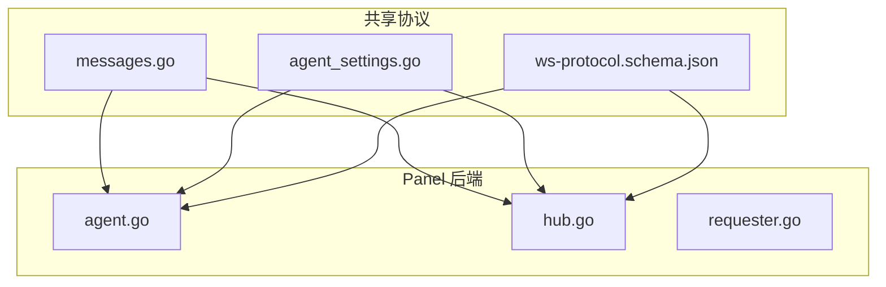
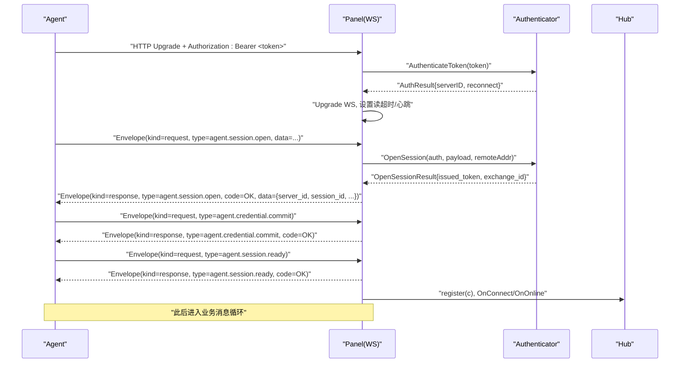
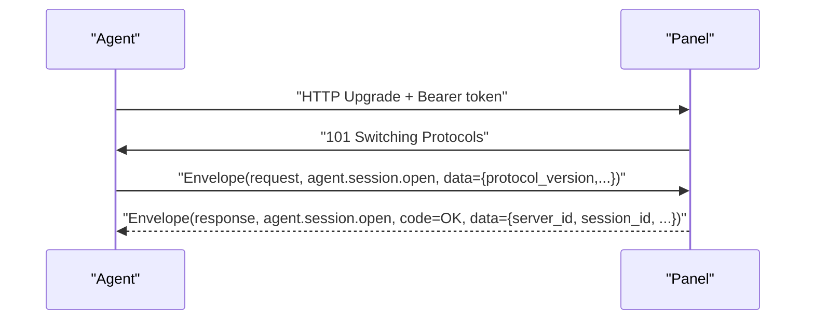
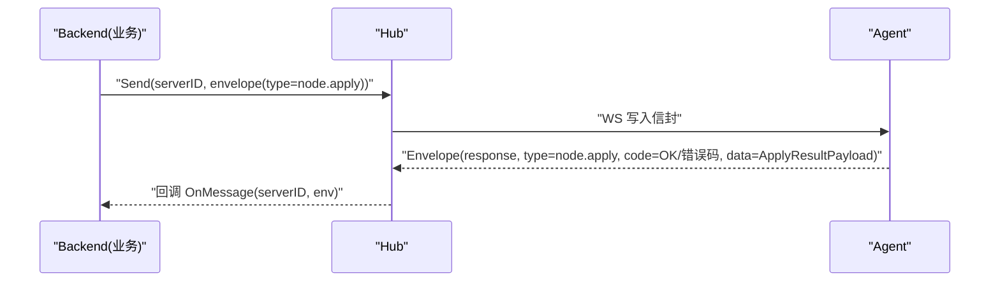
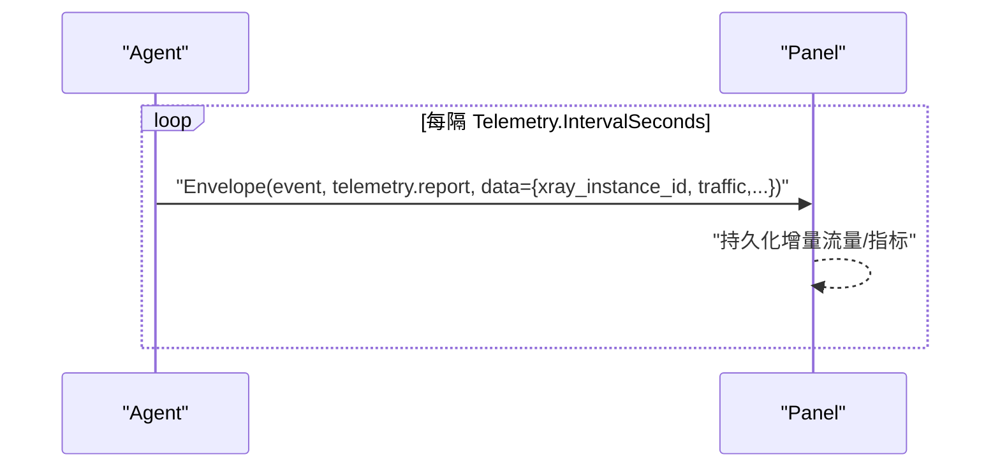
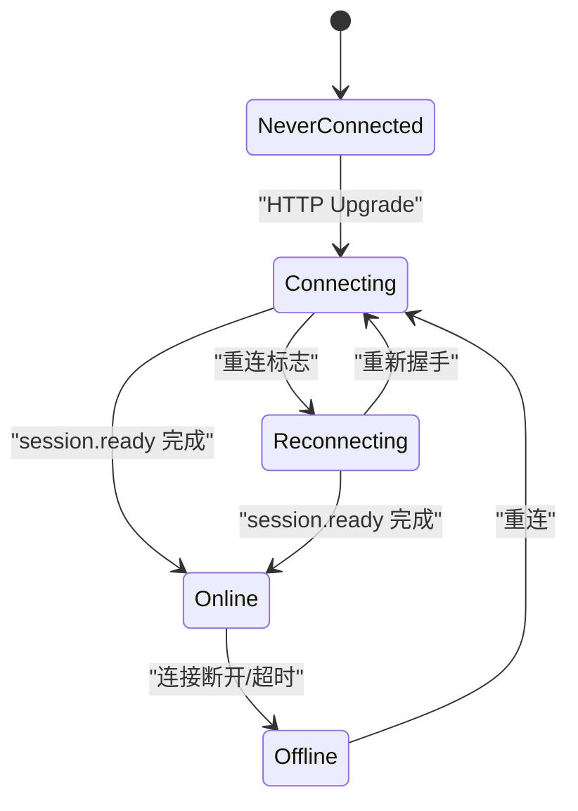
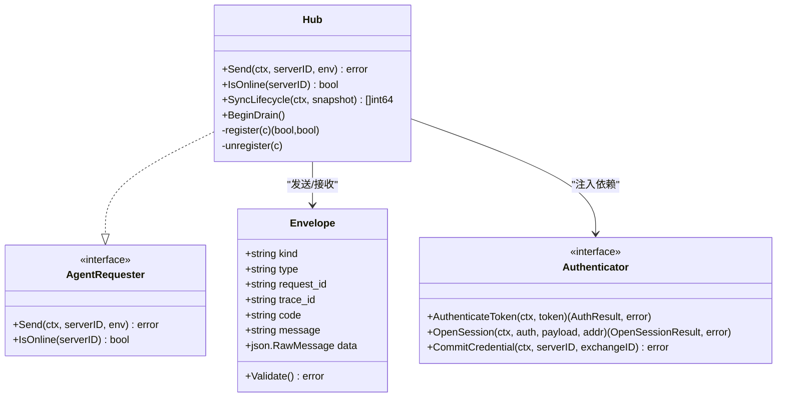

# WebSocket 协议

<cite>
**本文引用的文件**   
- [ws-protocol.schema.json](file://docs/ws-protocol.schema.json)
- [agent.go](file://src/backend/internal/ws/agent.go)
- [hub.go](file://src/backend/internal/ws/hub.go)
- [requester.go](file://src/backend/internal/ws/requester.go)
- [messages.go](file://src/shared/messages.go)
- [agent_settings.go](file://src/shared/agent_settings.go)
- [agent_test.go](file://src/backend/internal/ws/agent_test.go)
- [hub_test.go](file://src/backend/internal/ws/hub_test.go)
</cite>

## 目录
1. [简介](#简介)
2. [项目结构](#项目结构)
3. [核心组件](#核心组件)
4. [架构总览](#架构总览)
5. [详细组件分析](#详细组件分析)
6. [依赖关系分析](#依赖关系分析)
7. [性能考量](#性能考量)
8. [故障排查指南](#故障排查指南)
9. [结论](#结论)
10. [附录](#附录)

## 简介
本文件面向 Panel（后端）与 Agent（节点代理）之间的 WebSocket 控制通道，系统性说明连接建立、认证流程、消息信封规范、心跳保活、错误处理、典型交互流程、重连策略与连接池管理。读者无需深入源码即可理解协议语义与实现要点。

## 项目结构
WebSocket 协议相关代码主要分布在以下模块：
- 共享协议定义与类型：shared/messages.go、shared/agent_settings.go
- 协议 JSON Schema：docs/ws-protocol.schema.json
- Panel 端 WS 接入与 Hub 管理：backend/internal/ws/agent.go、backend/internal/ws/hub.go、backend/internal/ws/requester.go
- 测试用例：backend/internal/ws/agent_test.go、backend/internal/ws/hub_test.go

图表来源 
- [messages.go:1-120](file://src/shared/messages.go#L1-L120)
- [agent_settings.go:1-111](file://src/shared/agent_settings.go#L1-L111)
- [ws-protocol.schema.json:1-356](file://docs/ws-protocol.schema.json#L1-L356)
- [agent.go:1-120](file://src/backend/internal/ws/agent.go#L1-L120)
- [hub.go:1-120](file://src/backend/internal/ws/hub.go#L1-L120)
- [requester.go:1-43](file://src/backend/internal/ws/requester.go#L1-L43)

章节来源
- [messages.go:1-120](file://src/shared/messages.go#L1-L120)
- [agent_settings.go:1-111](file://src/shared/agent_settings.go#L1-L111)
- [ws-protocol.schema.json:1-356](file://docs/ws-protocol.schema.json#L1-L356)
- [agent.go:1-120](file://src/backend/internal/ws/agent.go#L1-L120)
- [hub.go:1-120](file://src/backend/internal/ws/hub.go#L1-L120)
- [requester.go:1-43](file://src/backend/internal/ws/requester.go#L1-L43)

## 核心组件
- 统一信封 Envelope：所有 WS 消息均使用统一信封，包含 kind、type、request_id、trace_id、code、message、data。响应必须携带 code/message；请求/事件不得携带。
- Hub 连接注册表：维护每个 Agent 的活跃连接、连接状态快照、发送队列、生命周期 ACK 等待等。
- Authenticator 接口：负责 HTTP Upgrade 阶段的鉴权与会话打开，返回服务器标识、是否重连、会话令牌与凭据交换 ID。
- AgentRequester 接口：向指定 Agent 投递信封并查询在线状态。

章节来源
- [messages.go:13-137](file://src/shared/messages.go#L13-L137)
- [hub.go:26-108](file://src/backend/internal/ws/hub.go#L26-L108)
- [requester.go:18-43](file://src/backend/internal/ws/requester.go#L18-L43)

## 架构总览
Panel 作为服务端监听 WS 端口，Agent 主动拨入。握手阶段通过 HTTP Upgrade 完成鉴权，随后进入应用层会话建立（agent.session.open → response → agent.credential.commit → agent.session.ready）。之后进入业务 RPC 循环，支持 node.apply、telemetry.report、chain-hop.apply 等。

图表来源 
- [agent.go:33-212](file://src/backend/internal/ws/agent.go#L33-L212)
- [hub.go:230-261](file://src/backend/internal/ws/hub.go#L230-L261)
- [messages.go:73-91](file://src/shared/messages.go#L73-L91)

章节来源
- [agent.go:33-212](file://src/backend/internal/ws/agent.go#L33-L212)
- [hub.go:230-261](file://src/backend/internal/ws/hub.go#L230-L261)
- [messages.go:73-91](file://src/shared/messages.go#L73-L91)

## 详细组件分析

### 消息信封与类型规范
- kind：request/response/event
- type：domain.action 格式，未知 action 返回 UNSUPPORTED_ACTION
- request_id/trace_id：32 位小写十六进制随机 ID，用于关联请求与追踪
- code/message：仅 response 携带
- data：具体动作载荷，按 schema 校验

示例类型常量（节选）：
- agent.session.open / agent.session.ready / agent.credential.commit
- panel.lifecycle.changed
- agent.settings.sync / agent.settings.changed
- node.apply / node.remove
- telemetry.report
- chain-hop.apply / chain-hop.remove

章节来源
- [messages.go:13-137](file://src/shared/messages.go#L13-L137)
- [messages.go:73-91](file://src/shared/messages.go#L73-L91)
- [ws-protocol.schema.json:106-132](file://docs/ws-protocol.schema.json#L106-L132)

### 连接建立与认证流程
- HTTP 升级前检查 Panel 生命周期与 draining 状态，拒绝不可用或重启中的服务
- 从 Authorization 头解析 Bearer token 并调用 AuthenticateToken
- 成功则 Upgrade 为 WS，设置最大消息大小与读超时
- 首个应用帧必须是 agent.session.open，否则以协议错误关闭连接
- OpenSession 成功后回复 response，附带 server_id、session_id、session_kind、issued_token、credential_exchange_id、panel_state
- 在 session.ready 之前仅允许 credential.commit 与 session.ready，其他请求一律返回 UNSUPPORTED_ACTION

章节来源
- [agent.go:33-129](file://src/backend/internal/ws/agent.go#L33-L129)
- [agent.go:157-197](file://src/backend/internal/ws/agent.go#L157-L197)
- [agent_test.go:42-64](file://src/backend/internal/ws/agent_test.go#L42-L64)

### 心跳机制（WS ping/pong）
- Agent 每约 30s 主动发送 WS Ping
- Panel 原样 Pong，并以收到的控制帧续期读超时（默认 90s）
- 任何业务消息到达也会续期读超时
- 若 Panel 长时间未收到任何字节（包括 ping），判定连接死亡

章节来源
- [agent.go:102-111](file://src/backend/internal/ws/agent.go#L102-L111)
- [agent.go:221-231](file://src/backend/internal/ws/agent.go#L221-L231)
- [hub.go:19-21](file://src/backend/internal/ws/hub.go#L19-L21)

### 错误处理
- 握手失败：返回标准 HTTP 状态码，并在 Body 中编码 Envelope(kind=response, type=agent.session.open, code=...)
- 协议错误：首帧非 session.open、JSON 非法、字段缺失等，返回 CloseMessage 并关闭连接
- 未知 type：返回 UNSUPPORTED_ACTION
- JSON 损坏才断开连接；其他业务错误通过 code/message 表达

章节来源
- [agent.go:264-274](file://src/backend/internal/ws/agent.go#L264-L274)
- [agent.go:90-121](file://src/backend/internal/ws/agent.go#L90-L121)
- [messages.go:112-137](file://src/shared/messages.go#L112-L137)

### 典型交互流程

#### agent.session.open 握手序列

图表来源 
- [agent.go:33-129](file://src/backend/internal/ws/agent.go#L33-L129)
- [messages.go:73-91](file://src/shared/messages.go#L73-L91)

#### node.apply 下发与回执

图表来源 
- [hub.go:110-139](file://src/backend/internal/ws/hub.go#L110-L139)
- [messages.go:139-193](file://src/shared/messages.go#L139-L193)

#### telemetry.report 周期上报

图表来源 
- [messages.go:195-232](file://src/shared/messages.go#L195-L232)
- [ws-protocol.schema.json:317-333](file://docs/ws-protocol.schema.json#L317-L333)

### 重连策略与连接池管理
- 重连模式：infinite/limited，最大重试次数由 AgentSettings.reconnect.max_retries 控制
- 面板侧连接池：Hub 维护 per-server 单连接映射，新连接到来时踢掉旧连接（重连场景）
- 连接状态快照：never_connected/offline/reconnecting/online，便于外部观察
- 优雅停机：BeginDrain 拒绝新工作并关闭所有连接，Agent 使用快速重启路径重试
- 生命周期同步：SyncLifecycle 向所有在线 Agent 广播 panel.lifecycle.changed，等待 ACK 或超时

章节来源
- [agent_settings.go:28-64](file://src/shared/agent_settings.go#L28-L64)
- [hub.go:230-279](file://src/backend/internal/ws/hub.go#L230-L279)
- [hub.go:156-173](file://src/backend/internal/ws/hub.go#L156-L173)
- [hub.go:320-378](file://src/backend/internal/ws/hub.go#L320-L378)

### 状态转换图（连接生命周期）

图表来源 
- [hub.go:69-100](file://src/backend/internal/ws/hub.go#L69-L100)
- [agent.go:60-75](file://src/backend/internal/ws/agent.go#L60-L75)

## 依赖关系分析
- shared/messages.go 提供 Envelope、类型常量、载荷结构与校验逻辑
- shared/agent_settings.go 提供 Agent 配置文档与校验
- backend/internal/ws/agent.go 实现 WS 接入、握手、认证、会话建立、心跳、错误处理
- backend/internal/ws/hub.go 实现连接注册表、发送队列、生命周期同步、优雅停机
- backend/internal/ws/requester.go 定义对外暴露的 AgentRequester 与错误类型

图表来源 
- [messages.go:13-137](file://src/shared/messages.go#L13-L137)
- [hub.go:26-139](file://src/backend/internal/ws/hub.go#L26-L139)
- [requester.go:18-43](file://src/backend/internal/ws/requester.go#L18-L43)

章节来源
- [messages.go:13-137](file://src/shared/messages.go#L13-L137)
- [hub.go:26-139](file://src/backend/internal/ws/hub.go#L26-L139)
- [requester.go:18-43](file://src/backend/internal/ws/requester.go#L18-L43)

## 性能考量
- 单连接串行写：writePump 保证 gorilla 并发写安全，避免竞态
- 发送队列上限：sendBuffer=256，满则断链，重连后补发，防止慢连接拖垮系统
- 读超时与心跳：默认 90s 无活动即断链，结合 Agent 侧 ping 保活
- 严格反序列化：DisallowUnknownFields+二次 EOF 检查，减少畸形报文风险
- 批量生命周期同步：SyncLifecycle 并发等待 ACK，超时收集缺失列表

章节来源
- [hub.go:398-413](file://src/backend/internal/ws/hub.go#L398-L413)
- [hub.go:22-24](file://src/backend/internal/ws/hub.go#L22-L24)
- [agent.go:316-329](file://src/backend/internal/ws/agent.go#L316-L329)
- [hub.go:320-378](file://src/backend/internal/ws/hub.go#L320-L378)

## 故障排查指南
- 握手失败：检查 Authorization 头是否为 Bearer token，确认 AuthenticateToken 返回值与错误码
- 首帧错误：确保第一个应用帧是 agent.session.open，且 data 符合 schema
- 未知类型：检查 type 是否符合 domain.action 命名规范，避免拼写错误
- 连接频繁断开：检查网络延迟与丢包，确认 Agent 侧 ping 间隔与 Panel 的 pongTimeout
- 命令丢失：检查 Hub 发送队列是否打满，必要时扩容或优化下游处理速度
- 优雅停机：BeginDrain 期间 Send 将返回 ErrDraining，需等待连接关闭后重试

章节来源
- [agent.go:33-75](file://src/backend/internal/ws/agent.go#L33-L75)
- [agent.go:90-121](file://src/backend/internal/ws/agent.go#L90-L121)
- [hub.go:156-173](file://src/backend/internal/ws/hub.go#L156-L173)
- [hub.go:110-139](file://src/backend/internal/ws/hub.go#L110-L139)

## 结论
该 WebSocket 协议通过统一信封、严格的 schema 校验与清晰的握手流程，实现了 Panel 与 Agent 之间可靠的双向通信。心跳保活、错误处理、重连策略与连接池管理共同保障了在高可用与弹性伸缩场景下的稳定性。遵循本文档的规范可实现兼容的 Agent 与 Panel 集成。

## 附录

### 消息信封字段与生成规则
- kind：request/response/event
- type：domain.action，未知返回 UNSUPPORTED_ACTION
- request_id/trace_id：32 位小写十六进制随机值，用于关联与追踪
- code/message：仅 response 携带
- data：按 schema 校验的具体载荷

章节来源
- [messages.go:13-137](file://src/shared/messages.go#L13-L137)
- [ws-protocol.schema.json:106-132](file://docs/ws-protocol.schema.json#L106-L132)

### 典型交互示例（文字描述）
- agent.session.open：Agent 发起，携带 protocol_version、agent_version、xray_version、xray_running、nic_addresses、last_lifecycle；Panel 返回 server_id、session_id、session_kind、issued_token、credential_exchange_id、panel_state
- node.apply：Panel 下发虚拟配置与用户白名单，Agent 执行并回传 realized_config、hop_id/kind
- telemetry.report：Agent 周期性上报 xray_instance_id、traffic（up/down 计数器）、主机指标

章节来源
- [ws-protocol.schema.json:136-179](file://docs/ws-protocol.schema.json#L136-L179)
- [messages.go:139-232](file://src/shared/messages.go#L139-L232)