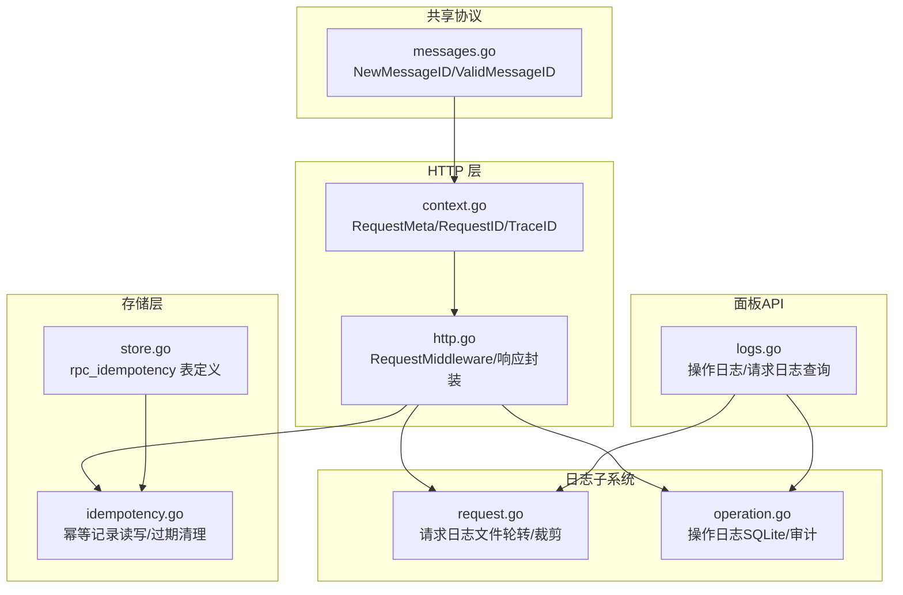
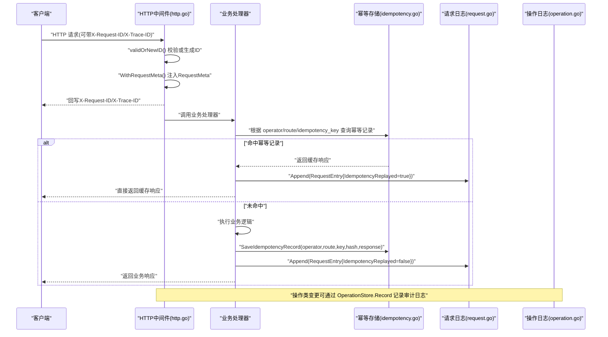
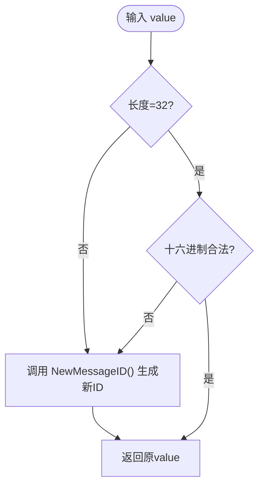
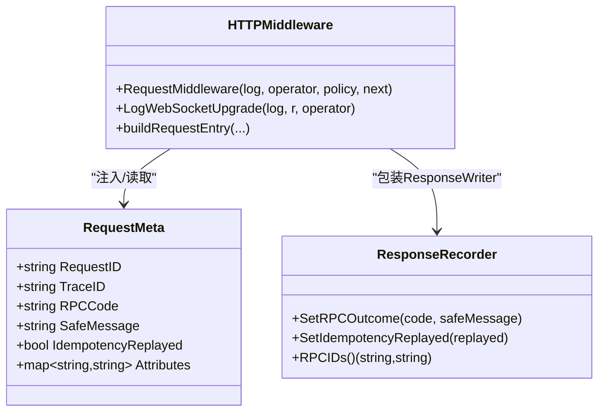
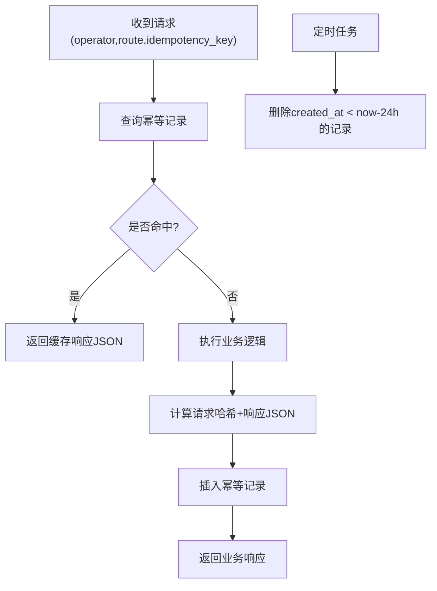
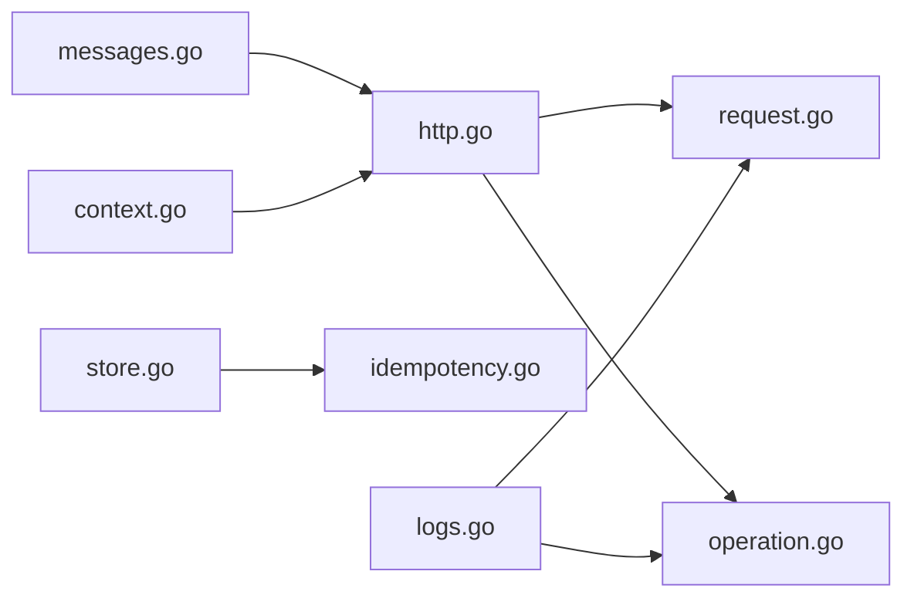
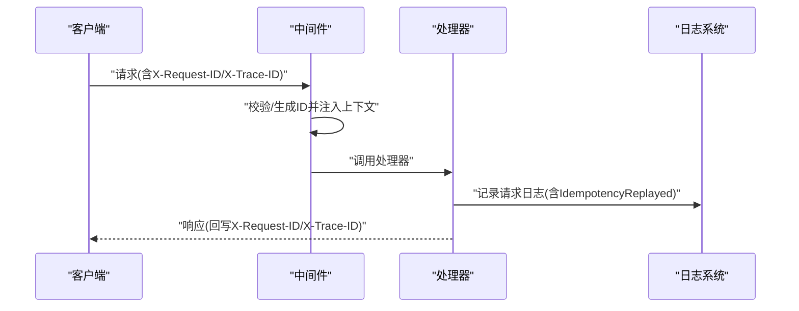

# 幂等性与请求追踪

<cite>
**本文引用的文件**   
- [idempotency.go](file://src/backend/internal/store/idempotency.go)
- [store.go](file://src/backend/internal/store/store.go)
- [context.go](file://src/backend/internal/logging/context.go)
- [http.go](file://src/backend/internal/logging/http.go)
- [request.go](file://src/backend/internal/logging/request.go)
- [operation.go](file://src/backend/internal/logging/operation.go)
- [messages.go](file://src/shared/messages.go)
- [logs.go](file://src/backend/internal/panel/logs.go)
</cite>

## 目录
1. [简介](#简介)
2. [项目结构](#项目结构)
3. [核心组件](#核心组件)
4. [架构总览](#架构总览)
5. [详细组件分析](#详细组件分析)
6. [依赖关系分析](#依赖关系分析)
7. [性能考量](#性能考量)
8. [故障排查指南](#故障排查指南)
9. [结论](#结论)
10. [附录](#附录)

## 简介
本文件系统性阐述系统的幂等性与请求追踪机制，覆盖 Idempotency-Key 的客户端生成、服务端存储与重复请求处理；区分 request_id 与 trace_id 的职责边界；明确 ID 生成规则（32位十六进制）、继承关系与校验逻辑；说明请求日志记录中的上下文传递、日志关联与性能监控；并给出幂等性保证的实现要点（数据库事务、并发控制、清理策略）。文末提供流程图与日志分析示例，以及调试与排障最佳实践。

## 项目结构
围绕幂等性与追踪的关键代码分布在以下模块：
- 共享协议与ID生成：shared/messages.go
- HTTP 中间件与日志：backend/internal/logging/*
- 幂等性持久化：backend/internal/store/idempotency.go
- 操作日志与运行状态：backend/internal/logging/operation.go
- 面板日志查询接口：backend/internal/panel/logs.go



图表来源
- [messages.go:93-109](file://src/shared/messages.go#L93-L109)
- [http.go:43-82](file://src/backend/internal/logging/http.go#L43-L82)
- [context.go:10-24](file://src/backend/internal/logging/context.go#L10-L24)
- [store.go:151-160](file://src/backend/internal/store/store.go#L151-L160)
- [idempotency.go:15-49](file://src/backend/internal/store/idempotency.go#L15-L49)
- [request.go:87-102](file://src/backend/internal/logging/request.go#L87-L102)
- [operation.go:116-136](file://src/backend/internal/logging/operation.go#L116-L136)
- [logs.go:86-98](file://src/backend/internal/panel/logs.go#L86-L98)

章节来源
- [messages.go:93-109](file://src/shared/messages.go#L93-L109)
- [http.go:43-82](file://src/backend/internal/logging/http.go#L43-L82)
- [context.go:10-24](file://src/backend/internal/logging/context.go#L10-L24)
- [store.go:151-160](file://src/backend/internal/store/store.go#L151-L160)
- [idempotency.go:15-49](file://src/backend/internal/store/idempotency.go#L15-L49)
- [request.go:87-102](file://src/backend/internal/logging/request.go#L87-L102)
- [operation.go:116-136](file://src/backend/internal/logging/operation.go#L116-L136)
- [logs.go:86-98](file://src/backend/internal/panel/logs.go#L86-L98)

## 核心组件
- 消息ID生成与校验：shared/messages.go 提供 NewMessageID（32位小写十六进制）与 ValidMessageID（长度与格式校验），用于 request_id 与 trace_id。
- HTTP 中间件：logging/http.go 的 RequestMiddleware 负责从请求头读取 X-Request-ID/X-Trace-ID，缺失时自动生成，写入响应头，并将元数据注入 context。
- 请求元数据：logging/context.go 的 RequestMeta 在上下文中携带 RequestID、TraceID、RPCCode、SafeMessage、IdempotencyReplayed 等字段，供后续处理器与日志使用。
- 幂等性存储：store/idempotency.go 提供幂等记录的查询、保存与过期删除；表 rpc_idempotency 以 (operator, route, idempotency_key) 为主键，确保唯一性。
- 请求日志：logging/request.go 将每次请求落盘为 JSON Lines，支持按大小分段、自动裁剪、Tail/Clear/Status 等操作。
- 操作日志：logging/operation.go 将管理操作写入 SQLite，包含审计字段（operator、IP、request_id、trace_id），并提供分页查询与清理。
- 面板日志接口：panel/logs.go 暴露操作日志与请求日志的查询接口，透传 request_id 与 trace_id 以便前端展示与检索。

章节来源
- [messages.go:93-109](file://src/shared/messages.go#L93-L109)
- [http.go:43-82](file://src/backend/internal/logging/http.go#L43-L82)
- [context.go:10-24](file://src/backend/internal/logging/context.go#L10-L24)
- [idempotency.go:15-49](file://src/backend/internal/store/idempotency.go#L15-L49)
- [request.go:87-102](file://src/backend/internal/logging/request.go#L87-L102)
- [operation.go:116-136](file://src/backend/internal/logging/operation.go#L116-L136)
- [logs.go:86-98](file://src/backend/internal/panel/logs.go#L86-L98)

## 架构总览
下图展示了从 HTTP 请求进入、中间件注入追踪ID、业务处理、幂等性检查到日志落盘的完整流程。



图表来源
- [http.go:43-82](file://src/backend/internal/logging/http.go#L43-L82)
- [context.go:21-24](file://src/backend/internal/logging/context.go#L21-L24)
- [idempotency.go:15-49](file://src/backend/internal/store/idempotency.go#L15-L49)
- [request.go:112-126](file://src/backend/internal/logging/request.go#L112-L126)
- [operation.go:142-182](file://src/backend/internal/logging/operation.go#L142-L182)

## 详细组件分析

### 组件A：ID 生成与校验（shared/messages.go）
- 生成规则：NewMessageID 使用随机字节生成 16 字节值并以十六进制编码，得到 32 位小写十六进制字符串，适合作为 request_id 与 trace_id。
- 校验规则：ValidMessageID 要求长度为 32 且全部为十六进制字符。
- 继承关系：HTTP 中间件通过 validOrNewID 复用该校验与生成逻辑，若请求头无效则重新生成。



图表来源
- [messages.go:93-109](file://src/shared/messages.go#L93-L109)
- [http.go:206-211](file://src/backend/internal/logging/http.go#L206-L211)

章节来源
- [messages.go:93-109](file://src/shared/messages.go#L93-L109)
- [http.go:206-211](file://src/backend/internal/logging/http.go#L206-L211)

### 组件B：HTTP 中间件与追踪上下文（logging/http.go + logging/context.go）
- 中间件职责：
  - 读取 X-Request-ID 与 X-Trace-ID，校验后保留或生成新的ID。
  - 将 RequestMeta 注入请求上下文，并在响应头中回写两个ID。
  - 对非 WebSocket 升级的请求进行统一日志记录，捕获状态码、耗时、错误摘要等。
- 上下文传递：
  - RequestMeta 包含 RequestID、TraceID、RPCCode、SafeMessage、IdempotencyReplayed、Attributes。
  - 提供 SetRPCOutcome、SetIdempotencyReplayed、AddSafeAttribute 等方法更新元数据。



图表来源
- [context.go:10-24](file://src/backend/internal/logging/context.go#L10-L24)
- [http.go:43-82](file://src/backend/internal/logging/http.go#L43-L82)
- [http.go:335-346](file://src/backend/internal/logging/http.go#L335-L346)

章节来源
- [http.go:43-82](file://src/backend/internal/logging/http.go#L43-L82)
- [context.go:10-24](file://src/backend/internal/logging/context.go#L10-L24)

### 组件C：幂等性存储与清理（store/idempotency.go + store/store.go）
- 表结构与主键：rpc_idempotency 表以 (operator, route, idempotency_key) 为主键，确保同一操作者、路由与幂等键的唯一性。
- 查询与保存：
  - IdempotencyRecord 查询返回已缓存的响应JSON。
  - SaveIdempotencyRecord 插入记录，包含请求哈希与响应JSON。
- 清理策略：DeleteExpiredIdempotencyRecords 删除超过24小时的记录，避免无限增长。



图表来源
- [idempotency.go:15-49](file://src/backend/internal/store/idempotency.go#L15-L49)
- [idempotency.go:51-59](file://src/backend/internal/store/idempotency.go#L51-L59)
- [store.go:151-160](file://src/backend/internal/store/store.go#L151-L160)

章节来源
- [idempotency.go:15-49](file://src/backend/internal/store/idempotency.go#L15-L49)
- [idempotency.go:51-59](file://src/backend/internal/store/idempotency.go#L51-L59)
- [store.go:151-160](file://src/backend/internal/store/store.go#L151-L160)

### 组件D：请求日志与操作日志（logging/request.go + logging/operation.go）
- 请求日志：
  - Append 异步写入 JSON Lines 文件，支持队列满时的丢弃计数与上报。
  - 文件轮转基于大小阈值，定期归档并按最大容量裁剪旧文件。
  - Tail/Clear/Status 提供查询与管理能力。
- 操作日志：
  - 使用 SQLite 持久化，记录事件ID、时间戳、严重级别、分类、动作、操作者、IP、request_id、trace_id。
  - 支持过滤查询、限制条目数量、清理与运行生命周期标记。

```mermaid
classDiagram
class RequestLog {
+OpenRequestLog(dir,maxBytes)
+Append(entry)
+Tail(ctx,limit)
+Clear(ctx)
+Status(ctx)
+Close(ctx)
}
class OperationStore {
+OpenOperationStore(path,maxEntries)
+Record(ctx,event)
+List(ctx,filter,limit,offset)
+Clear(ctx,actor)
+StartRun(ctx,version)
+StopRun(ctx,reason)
}
RequestLog --> "文件轮转/裁剪"
OperationStore --> "SQLite事务/索引"
```

图表来源
- [request.go:87-102](file://src/backend/internal/logging/request.go#L87-L102)
- [request.go:112-126](file://src/backend/internal/logging/request.go#L112-L126)
- [request.go:235-252](file://src/backend/internal/logging/request.go#L235-L252)
- [operation.go:116-136](file://src/backend/internal/logging/operation.go#L116-L136)
- [operation.go:142-182](file://src/backend/internal/logging/operation.go#L142-L182)

章节来源
- [request.go:87-102](file://src/backend/internal/logging/request.go#L87-L102)
- [request.go:112-126](file://src/backend/internal/logging/request.go#L112-L126)
- [request.go:235-252](file://src/backend/internal/logging/request.go#L235-L252)
- [operation.go:116-136](file://src/backend/internal/logging/operation.go#L116-L136)
- [operation.go:142-182](file://src/backend/internal/logging/operation.go#L142-L182)

### 组件E：面板日志查询接口（panel/logs.go）
- 操作日志查询：返回包含 request_id 与 trace_id 的 DTO，便于前端展示与检索。
- 请求日志查询：Tail 获取最近若干条请求日志，附带状态信息（使用量、丢弃数、目录、段数）。
- 清理操作：清除操作日志时会记录审计事件，并携带当前请求的 request_id 与 trace_id。

章节来源
- [logs.go:74-84](file://src/backend/internal/panel/logs.go#L74-L84)
- [logs.go:86-98](file://src/backend/internal/panel/logs.go#L86-L98)
- [logs.go:100-120](file://src/backend/internal/panel/logs.go#L100-L120)

## 依赖关系分析
- shared/messages.go 被 logging/http.go 用于ID校验与生成。
- logging/context.go 被 logging/http.go 与业务处理器用于上下文传递。
- logging/http.go 依赖 logging/request.go 与 logging/operation.go 完成日志落盘。
- store/idempotency.go 依赖 store/store.go 定义的数据库表结构。
- panel/logs.go 依赖 logging/request.go 与 logging/operation.go 提供查询能力。



图表来源
- [messages.go:93-109](file://src/shared/messages.go#L93-L109)
- [http.go:43-82](file://src/backend/internal/logging/http.go#L43-L82)
- [context.go:10-24](file://src/backend/internal/logging/context.go#L10-L24)
- [request.go:87-102](file://src/backend/internal/logging/request.go#L87-L102)
- [operation.go:116-136](file://src/backend/internal/logging/operation.go#L116-L136)
- [store.go:151-160](file://src/backend/internal/store/store.go#L151-L160)
- [idempotency.go:15-49](file://src/backend/internal/store/idempotency.go#L15-L49)
- [logs.go:86-98](file://src/backend/internal/panel/logs.go#L86-L98)

章节来源
- [messages.go:93-109](file://src/shared/messages.go#L93-L109)
- [http.go:43-82](file://src/backend/internal/logging/http.go#L43-L82)
- [context.go:10-24](file://src/backend/internal/logging/context.go#L10-L24)
- [request.go:87-102](file://src/backend/internal/logging/request.go#L87-L102)
- [operation.go:116-136](file://src/backend/internal/logging/operation.go#L116-L136)
- [store.go:151-160](file://src/backend/internal/store/store.go#L151-L160)
- [idempotency.go:15-49](file://src/backend/internal/store/idempotency.go#L15-L49)
- [logs.go:86-98](file://src/backend/internal/panel/logs.go#L86-L98)

## 性能考量
- 请求日志写入采用异步队列与文件分段，避免阻塞请求路径；队列满时丢弃并上报丢弃计数，保障高吞吐。
- 操作日志使用 SQLite 单连接与 busy_timeout，降低锁竞争；限制最大条目数，防止无限增长。
- 幂等性表主键约束天然具备并发安全；过期清理定时执行，减少查询与存储压力。
- 中间件仅对 /api/ 与 /sub/ 前缀路径记录请求日志，减少无关开销。

[本节为通用指导，不直接分析具体文件]

## 故障排查指南
- 重复请求问题：
  - 检查客户端是否正确设置 Idempotency-Key，并确保其稳定唯一。
  - 查看幂等记录是否存在（operator、route、idempotency_key 组合），确认是否命中缓存响应。
  - 关注 IdempotencyReplayed 标志，判断是否为重复请求。
- 追踪ID缺失或不一致：
  - 检查请求头 X-Request-ID/X-Trace-ID 是否传入且符合32位十六进制格式。
  - 确认中间件是否正确回写响应头，以及上下文是否贯穿整个处理链。
- 日志丢失或无法查询：
  - 检查请求日志目录权限与磁盘空间，确认文件轮转与裁剪策略。
  - 查看 OperationStore 的最大条目限制与清理策略，确保历史数据不会过早删除。
- 性能瓶颈：
  - 观察请求日志丢弃计数与队列长度，必要时调整 maxBytes 与队列大小。
  - 评估幂等记录清理频率与数据库负载，优化清理任务调度。

章节来源
- [http.go:43-82](file://src/backend/internal/logging/http.go#L43-L82)
- [request.go:112-126](file://src/backend/internal/logging/request.go#L112-L126)
- [operation.go:142-182](file://src/backend/internal/logging/operation.go#L142-L182)
- [idempotency.go:15-49](file://src/backend/internal/store/idempotency.go#L15-L49)

## 结论
本系统通过标准化的ID生成与校验、HTTP中间件的上下文注入、幂等性表的唯一约束与过期清理、以及高性能的日志子系统，实现了可靠的幂等性与完整的请求追踪。request_id 标识单次传输，trace_id 贯穿业务链路，二者结合可在复杂调用链中精准定位问题。建议在生产环境中合理配置日志大小与清理策略，并持续监控幂等命中率与日志丢弃情况，以确保系统稳定性与可观测性。

[本节为总结，不直接分析具体文件]

## 附录

### 幂等性保证要点
- 数据库事务：幂等记录插入与业务操作应在同一事务中提交，确保原子性。
- 并发控制：主键约束避免重复插入；必要时加锁或重试机制处理冲突。
- 清理策略：定时删除过期记录，避免存储膨胀与查询性能下降。

章节来源
- [idempotency.go:15-49](file://src/backend/internal/store/idempotency.go#L15-L49)
- [store.go:151-160](file://src/backend/internal/store/store.go#L151-L160)

### 请求追踪流程图


图表来源
- [http.go:43-82](file://src/backend/internal/logging/http.go#L43-L82)
- [request.go:112-126](file://src/backend/internal/logging/request.go#L112-L126)

### 日志分析示例
- 操作日志查询：通过面板接口获取操作日志列表，筛选特定 request_id 或 trace_id 的事件。
- 请求日志Tail：获取最近N条请求日志，检查 HTTPStatus、DurationMS、ErrorSummary 与 IdempotencyReplayed。
- 审计事件：清理操作日志时，会记录审计事件，包含操作者、IP、request_id、trace_id 与详情。

章节来源
- [logs.go:74-84](file://src/backend/internal/panel/logs.go#L74-L84)
- [logs.go:86-98](file://src/backend/internal/panel/logs.go#L86-L98)
- [logs.go:100-120](file://src/backend/internal/panel/logs.go#L100-L120)