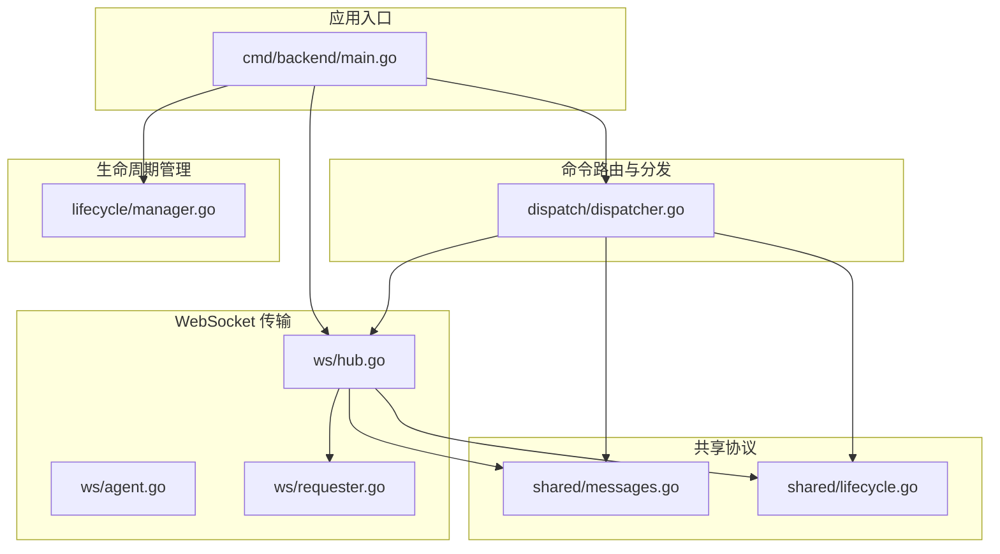
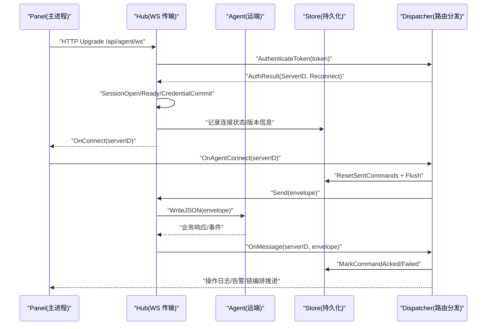
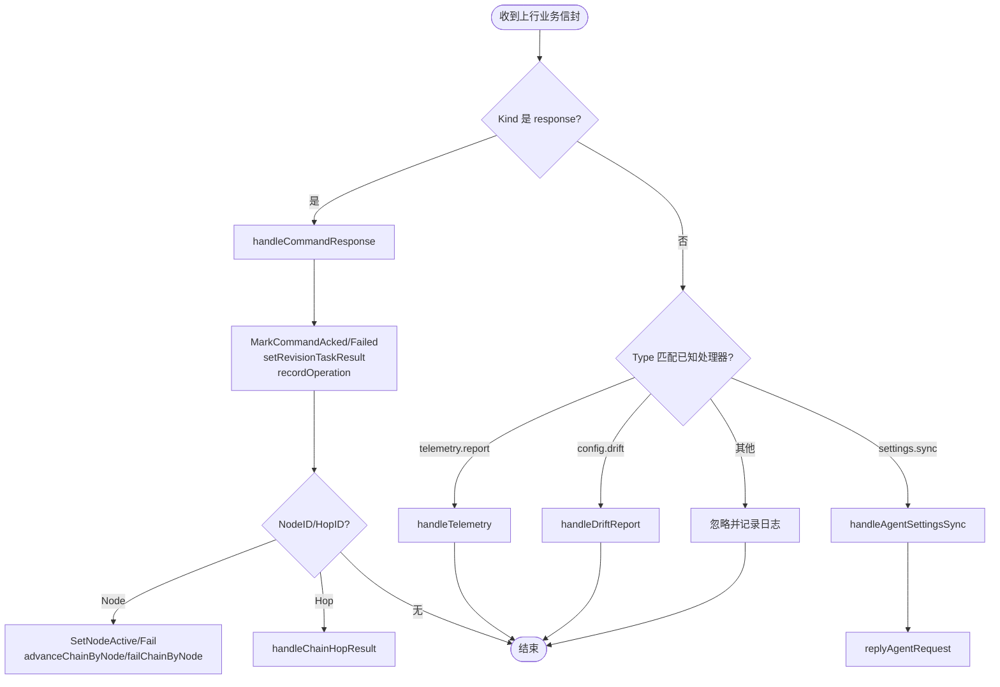
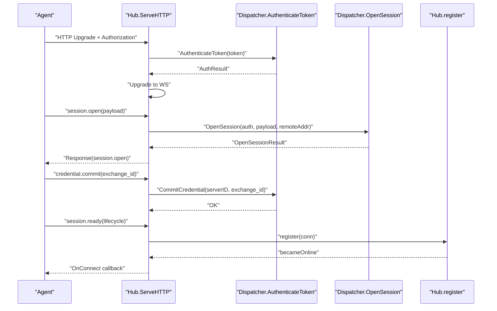
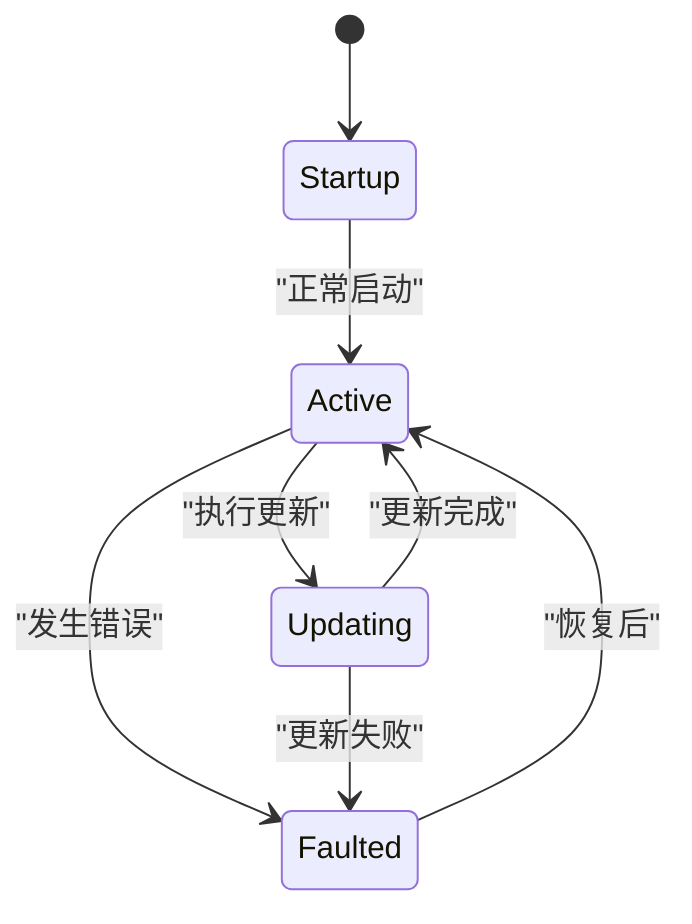
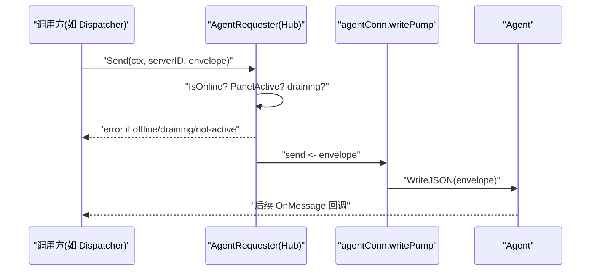
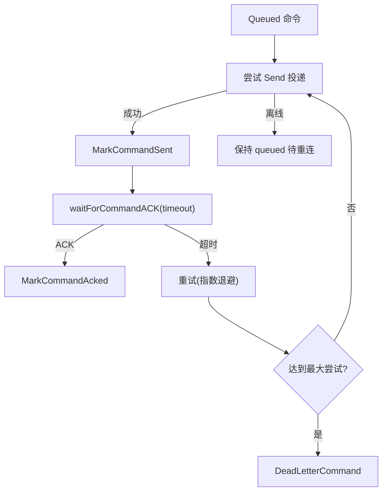
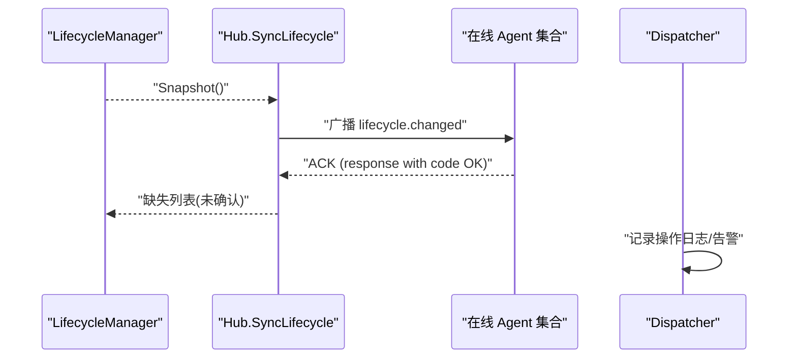
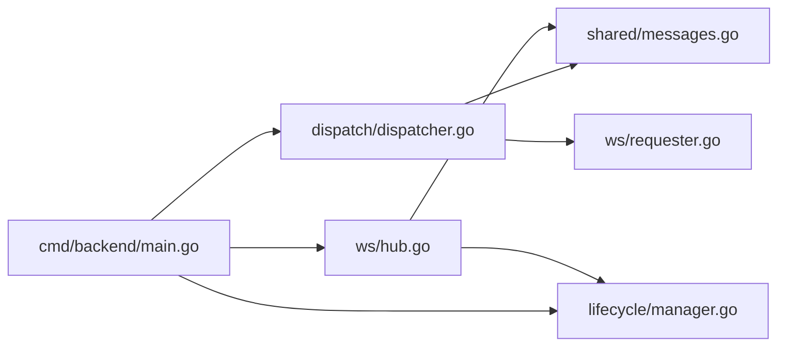

# 消息路由与分发

<cite>
**本文引用的文件**   
- [dispatcher.go](file://src/backend/internal/dispatch/dispatcher.go)
- [hub.go](file://src/backend/internal/ws/hub.go)
- [requester.go](file://src/backend/internal/ws/requester.go)
- [agent.go](file://src/backend/internal/ws/agent.go)
- [messages.go](file://src/shared/messages.go)
- [lifecycle.go](file://src/shared/lifecycle.go)
- [manager.go](file://src/backend/internal/lifecycle/manager.go)
- [main.go](file://src/backend/cmd/backend/main.go)
</cite>

## 目录
1. [简介](#简介)
2. [项目结构](#项目结构)
3. [核心组件](#核心组件)
4. [架构总览](#架构总览)
5. [详细组件分析](#详细组件分析)
6. [依赖关系分析](#依赖关系分析)
7. [性能考量](#性能考量)
8. [故障排查指南](#故障排查指南)
9. [结论](#结论)
10. [附录：开发指南](#附录开发指南)

## 简介
本文件围绕“消息路由与分发”展开，系统性阐述后端如何通过 Dispatcher 将不同 type 的消息路由到对应处理器；生命周期管理器如何协调各组件状态同步；Requester 模式如何实现 Panel 通过 AgentRequester 向 Agent 发起 RPC；以及异步任务处理（队列、重试、超时）和事件驱动架构（状态变更通知、回调机制、事件总线）。文档包含消息流转图与组件交互序列图，并提供自定义消息处理器与事件监听器的开发指南。

## 项目结构
本项目采用分层与职责清晰的模块化组织：
- shared：定义控制通道协议类型、RPC 信封、消息类型与生命周期快照等跨端共享契约。
- backend/internal/ws：实现 WebSocket 传输层 Hub、Agent 会话管理与连接生命周期。
- backend/internal/dispatch：命令入队、投递、ACK 等待、死信处理、遥测与漂移上报处理、链编排联动。
- backend/internal/lifecycle：面板生命周期状态机与重试策略。
- backend/cmd/backend：组装 Hub、Dispatcher、LifecycleManager 并注册回调。



图表来源
- [dispatcher.go:1-800](file://src/backend/internal/dispatch/dispatcher.go#L1-L800)
- [hub.go:1-413](file://src/backend/internal/ws/hub.go#L1-L413)
- [requester.go:1-43](file://src/backend/internal/ws/requester.go#L1-L43)
- [agent.go:1-359](file://src/backend/internal/ws/agent.go#L1-L359)
- [messages.go:1-313](file://src/shared/messages.go#L1-L313)
- [lifecycle.go:1-86](file://src/shared/lifecycle.go#L1-L86)
- [manager.go:1-63](file://src/backend/internal/lifecycle/manager.go#L1-L63)
- [main.go:252-314](file://src/backend/cmd/backend/main.go#L252-L314)

章节来源
- [dispatcher.go:1-800](file://src/backend/internal/dispatch/dispatcher.go#L1-L800)
- [hub.go:1-413](file://src/backend/internal/ws/hub.go#L1-L413)
- [agent.go:1-359](file://src/backend/internal/ws/agent.go#L1-L359)
- [messages.go:1-313](file://src/shared/messages.go#L1-L313)
- [lifecycle.go:1-86](file://src/shared/lifecycle.go#L1-L86)
- [manager.go:1-63](file://src/backend/internal/lifecycle/manager.go#L1-L63)
- [main.go:252-314](file://src/backend/cmd/backend/main.go#L252-L314)

## 核心组件
- Dispatcher：串联存储与 Requester，负责命令入队、离线排队、重连补发、ACK 等待、死信处理、遥测与漂移上报处理、节点与链编排联动。
- Hub：Agent 连接的注册表与发送队列，实现 AgentRequester 接口，提供 IsOnline/Send，维护连接状态与优雅关闭。
- AgentRequester：抽象的 Agent 请求能力，Send/IsOnline 由 Hub 实现。
- Lifecycle Manager：维护面板生命周期快照与重试策略，供 Hub 在握手阶段拒绝非活跃面板的业务命令。
- Shared Envelope：统一 RPC 信封，包含 Kind/Type/RequestID/TraceID/Data，区分 request/response/event。

章节来源
- [dispatcher.go:24-48](file://src/backend/internal/dispatch/dispatcher.go#L24-L48)
- [hub.go:25-55](file://src/backend/internal/ws/hub.go#L25-L55)
- [requester.go:18-24](file://src/backend/internal/ws/requester.go#L18-L24)
- [manager.go:13-28](file://src/backend/internal/lifecycle/manager.go#L13-L28)
- [messages.go:13-51](file://src/shared/messages.go#L13-L51)

## 架构总览
Panel 通过 WebSocket 建立与 Agent 的控制通道。Hub 负责连接与会话，Dispatcher 负责命令生命周期与消息路由。消息以 Envelope 形式承载，按 Kind/Type 分发到相应处理器。



图表来源
- [agent.go:33-239](file://src/backend/internal/ws/agent.go#L33-L239)
- [hub.go:110-139](file://src/backend/internal/ws/hub.go#L110-L139)
- [dispatcher.go:411-438](file://src/backend/internal/dispatch/dispatcher.go#L411-L438)
- [main.go:269-314](file://src/backend/cmd/backend/main.go#L269-L314)

## 详细组件分析

### Dispatcher：消息路由与分发
- 入队与立即投递：Enqueue 将命令写入 commands 表（queued），并尝试 Flush 立即投递；离线则滞留，待重连补发。
- 重试与超时：UninstallWithRetry 使用指数退避与最大尝试次数；waitForCommandACK 轮询 ACK 并受超时控制。
- 死信处理：Flush 中超过 maxCommandAttempts 的命令标记 dead-letter，并触发链编排失败定位（apply_node/chain-hop）。
- 消息路由：HandleMessage 根据 Kind/Type 分派到 settings 同步、遥测、漂移上报等处理器；response 路径统一走 handleCommandResponse。
- 链路编排联动：成功 acked 时更新节点 active 并推进链编排；失败时置节点 failed 并定位跳点。



图表来源
- [dispatcher.go:411-438](file://src/backend/internal/dispatch/dispatcher.go#L411-L438)
- [dispatcher.go:625-730](file://src/backend/internal/dispatch/dispatcher.go#L625-L730)
- [dispatcher.go:440-482](file://src/backend/internal/dispatch/dispatcher.go#L440-L482)
- [dispatcher.go:553-623](file://src/backend/internal/dispatch/dispatcher.go#L553-L623)

章节来源
- [dispatcher.go:50-67](file://src/backend/internal/dispatch/dispatcher.go#L50-L67)
- [dispatcher.go:75-145](file://src/backend/internal/dispatch/dispatcher.go#L75-L145)
- [dispatcher.go:169-241](file://src/backend/internal/dispatch/dispatcher.go#L169-L241)
- [dispatcher.go:411-438](file://src/backend/internal/dispatch/dispatcher.go#L411-L438)
- [dispatcher.go:625-730](file://src/backend/internal/dispatch/dispatcher.go#L625-L730)

### Hub：WebSocket 传输与连接管理
- 连接注册与状态：register/unregister 维护 conns/states，触发 OnOnline/OnReconnect/OnDisconnect。
- 发送队列与背压：Send 将信封推入 per-conn 发送队列；队列满视为慢连接断开并重连补发。
- 生命周期保护：在 startup/faulted 状态下拒绝业务命令（ErrPanelNotActive）。
- 生命周期同步：SyncLifecycle 向所有在线 Agent 广播 lifecycle.changed，等待 ACK。

```mermaid
classDiagram
class Hub {
+Send(ctx, serverID, env) error
+IsOnline(serverID) bool
+BeginDrain() void
+Wait(ctx) error
+CloseAllAgents(code, reason) void
+SyncLifecycle(ctx, snapshot) []int64
-conns map[int64]*agentConn
-states map[int64]ConnectionSnapshot
-draining bool
}
class agentConn {
+writePump() void
+close() void
+closeWithCode(code, reason) void
-send chan Envelope
-done chan struct{}
-lifecycleAcks map[string]chan struct{}
}
class AgentRequester {
<<interface>>
+Send(ctx, serverID, env) error
+IsOnline(serverID) bool
}
Hub ..|> AgentRequester : "实现"
Hub --> agentConn : "管理连接"
```

图表来源
- [hub.go:110-139](file://src/backend/internal/ws/hub.go#L110-L139)
- [hub.go:232-279](file://src/backend/internal/ws/hub.go#L232-L279)
- [hub.go:322-378](file://src/backend/internal/ws/hub.go#L322-L378)
- [requester.go:18-24](file://src/backend/internal/ws/requester.go#L18-L24)

章节来源
- [hub.go:110-139](file://src/backend/internal/ws/hub.go#L110-L139)
- [hub.go:232-279](file://src/backend/internal/ws/hub.go#L232-L279)
- [hub.go:322-378](file://src/backend/internal/ws/hub.go#L322-L378)

### Agent 会话与握手流程
- 认证与升级：ServeHTTP 校验 Bearer token，调用 AuthenticateToken，完成 HTTP Upgrade。
- 会话建立：首个帧必须为 session.open，随后接受 credential.commit 与 session.ready，完成后登记连接。
- 读循环：任何消息到达续期读超时；对 lifecycle.changed 的 ACK 特殊处理；其余上抛给 OnMessage。



图表来源
- [agent.go:33-239](file://src/backend/internal/ws/agent.go#L33-L239)
- [dispatcher.go:251-328](file://src/backend/internal/dispatch/dispatcher.go#L251-L328)

章节来源
- [agent.go:33-239](file://src/backend/internal/ws/agent.go#L33-L239)
- [dispatcher.go:251-328](file://src/backend/internal/dispatch/dispatcher.go#L251-L328)

### 生命周期管理器：状态同步与重试策略
- 状态转换：Transition 更新 state/fault/retry_policy/entered_at，返回快照。
- 重试策略：不同状态（updating/faulted/default）对应不同的最小/最大重试间隔。
- 与 Hub 集成：Hub 在 startup/faulted 拒绝业务命令；SyncLifecycle 广播最新快照。



图表来源
- [manager.go:36-51](file://src/backend/internal/lifecycle/manager.go#L36-L51)
- [lifecycle.go:5-20](file://src/shared/lifecycle.go#L5-L20)

章节来源
- [manager.go:13-28](file://src/backend/internal/lifecycle/manager.go#L13-L28)
- [manager.go:36-51](file://src/backend/internal/lifecycle/manager.go#L36-L51)
- [lifecycle.go:5-20](file://src/shared/lifecycle.go#L5-L20)

### Requester 模式：Panel → Agent 的 RPC
- 抽象：AgentRequester 定义 Send/IsOnline，Hub 实现该接口。
- 使用：Dispatcher 通过 req.Send 投递信封；Hub 检查面板状态与在线性后入队写出。
- 错误语义：ErrOffline/ErrDraining/ErrPanelNotActive 明确失败原因。



图表来源
- [requester.go:18-24](file://src/backend/internal/ws/requester.go#L18-L24)
- [hub.go:110-139](file://src/backend/internal/ws/hub.go#L110-L139)
- [agent.go:398-413](file://src/backend/internal/ws/agent.go#L398-L413)

章节来源
- [requester.go:18-24](file://src/backend/internal/ws/requester.go#L18-L24)
- [hub.go:110-139](file://src/backend/internal/ws/hub.go#L110-L139)

### 异步任务处理：队列、重试、超时
- 队列：commands 表 queued/sent/acked/failed 状态机；Flush 批量出队并尽力投递。
- 重试：UninstallWithRetry 指数退避 + 上限；maxCommandAttempts 死信。
- 超时：waitForCommandACK 使用 Timer/Ticker 轮询 ACK，受 ctx 与 deadline 控制。



图表来源
- [dispatcher.go:169-241](file://src/backend/internal/dispatch/dispatcher.go#L169-L241)
- [dispatcher.go:75-145](file://src/backend/internal/dispatch/dispatcher.go#L75-L145)

章节来源
- [dispatcher.go:169-241](file://src/backend/internal/dispatch/dispatcher.go#L169-L241)
- [dispatcher.go:75-145](file://src/backend/internal/dispatch/dispatcher.go#L75-L145)

### 事件驱动架构：状态变更、回调、事件总线
- 状态变更通知：LifecycleChangedPayload 经 SyncLifecycle 广播至所有在线 Agent。
- 回调机制：Hub 暴露 OnConnect/OnOnline/OnReconnect/OnDisconnect/OnMessage/OnProtocolError，main 中注入具体行为。
- 事件总线：AlertNotifier 用于节点失败、配置漂移等告警；OperationLog/RequestLog 记录操作与请求轨迹。



图表来源
- [hub.go:322-378](file://src/backend/internal/ws/hub.go#L322-L378)
- [main.go:269-314](file://src/backend/cmd/backend/main.go#L269-L314)
- [dispatcher.go:523-543](file://src/backend/internal/dispatch/dispatcher.go#L523-L543)

章节来源
- [hub.go:322-378](file://src/backend/internal/ws/hub.go#L322-L378)
- [main.go:269-314](file://src/backend/cmd/backend/main.go#L269-L314)
- [dispatcher.go:523-543](file://src/backend/internal/dispatch/dispatcher.go#L523-L543)

## 依赖关系分析
- Dispatcher 依赖 ws.AgentRequester（Hub）、store、alert、logging、shared 协议。
- Hub 依赖 shared 协议与 lifecycle 快照提供者；实现 AgentRequester。
- main 将 Hub、Dispatcher、LifecycleManager 装配，注册回调，形成完整控制平面。



图表来源
- [main.go:252-314](file://src/backend/cmd/backend/main.go#L252-L314)
- [dispatcher.go:1-22](file://src/backend/internal/dispatch/dispatcher.go#L1-L22)
- [hub.go:1-14](file://src/backend/internal/ws/hub.go#L1-L14)

章节来源
- [main.go:252-314](file://src/backend/cmd/backend/main.go#L252-L314)
- [dispatcher.go:1-22](file://src/backend/internal/dispatch/dispatcher.go#L1-L22)
- [hub.go:1-14](file://src/backend/internal/ws/hub.go#L1-L14)

## 性能考量
- 写缓冲与背压：每连接 sendBuffer=256，满则断线重连，避免阻塞全局。
- 串行写出：writePump 单 goroutine 串行写出，避免并发写冲突。
- 心跳与超时：Agent Ping/Pong 维持连接活性；90s 无消息判定死亡。
- 批处理与幂等：commands 表批量 Flush；请求 ID/TraceID 保证幂等与可追踪。
- 版本预检：PanelVersion 与 AgentVersion 不匹配时跳过非升级命令，减少无效下发。

[本节为通用指导，无需特定文件引用]

## 故障排查指南
- 连接问题：检查 Hub.IsOnline、OnDisconnect 回调、ErrOffline/ErrDraining/ErrPanelNotActive。
- 命令未 ACK：查看 waitForCommandACK 超时、dead-letter 计数、MarkCommandSent/Acked 状态。
- 节点失败：关注 alertNodeFailed 与 failChainByNode 的告警与日志。
- 配置漂移：handleDriftReport 记录 drift 状态并触发告警。
- 协议错误：OnProtocolError 记录无效帧或握手失败原因。

章节来源
- [hub.go:110-139](file://src/backend/internal/ws/hub.go#L110-L139)
- [dispatcher.go:625-730](file://src/backend/internal/dispatch/dispatcher.go#L625-L730)
- [dispatcher.go:594-623](file://src/backend/internal/dispatch/dispatcher.go#L594-L623)
- [agent.go:287-300](file://src/backend/internal/ws/agent.go#L287-L300)

## 结论
Dispatcher 作为消息路由中枢，结合 Hub 的可靠传输与 LifecycleManager 的状态约束，实现了高内聚、低耦合的消息分发与生命周期协同。通过统一的 Envelope 协议与严格的 ACK/超时/重试机制，系统具备强一致性与可观测性。事件驱动的回调与告警体系确保状态变更及时传播，便于运维与自动化闭环。

[本节为总结，无需特定文件引用]

## 附录：开发指南

### 自定义消息处理器（基于 Type）
- 在 shared/messages.go 新增 Type 常量与载荷结构体。
- 在 dispatcher.HandleMessage 的 switch 分支中添加新 Type 的处理逻辑，解析 Data、执行业务、构造 replyAgentRequest 或事件推送。
- 如需联动链编排或节点状态，参考 handleCommandResponse 中对 NodeID/HopID 的路由。

章节来源
- [messages.go:73-91](file://src/shared/messages.go#L73-L91)
- [dispatcher.go:411-438](file://src/backend/internal/dispatch/dispatcher.go#L411-L438)
- [dispatcher.go:625-730](file://src/backend/internal/dispatch/dispatcher.go#L625-L730)

### 自定义事件监听器（基于 Hub 回调）
- 在 main 中为 hub.OnConnect/OnOnline/OnReconnect/OnDisconnect/OnMessage/OnProtocolError 注入自定义逻辑。
- 常见用途：记录审计日志、触发外部 webhook、刷新缓存、联动监控。

章节来源
- [main.go:269-314](file://src/backend/cmd/backend/main.go#L269-L314)

### 扩展 Requester 能力
- 若需替换传输层，实现 ws.AgentRequester 接口（Send/IsOnline），并在 NewHub/NewDispatcher 时注入。
- 注意错误语义一致性（ErrOffline/ErrDraining/ErrPanelNotActive）。

章节来源
- [requester.go:18-24](file://src/backend/internal/ws/requester.go#L18-L24)
- [hub.go:110-139](file://src/backend/internal/ws/hub.go#L110-L139)

### 调整重试与超时策略
- 修改 UninstallWithRetry 的重试预算与延迟函数 uninstallRetryDelay。
- 调整 waitForCommandACK 的超时与轮询间隔。
- 调整 Hub.sendBuffer 与 writeTimeout 以适应不同负载场景。

章节来源
- [dispatcher.go:75-145](file://src/backend/internal/dispatch/dispatcher.go#L75-L145)
- [hub.go:16-24](file://src/backend/internal/ws/hub.go#L16-L24)