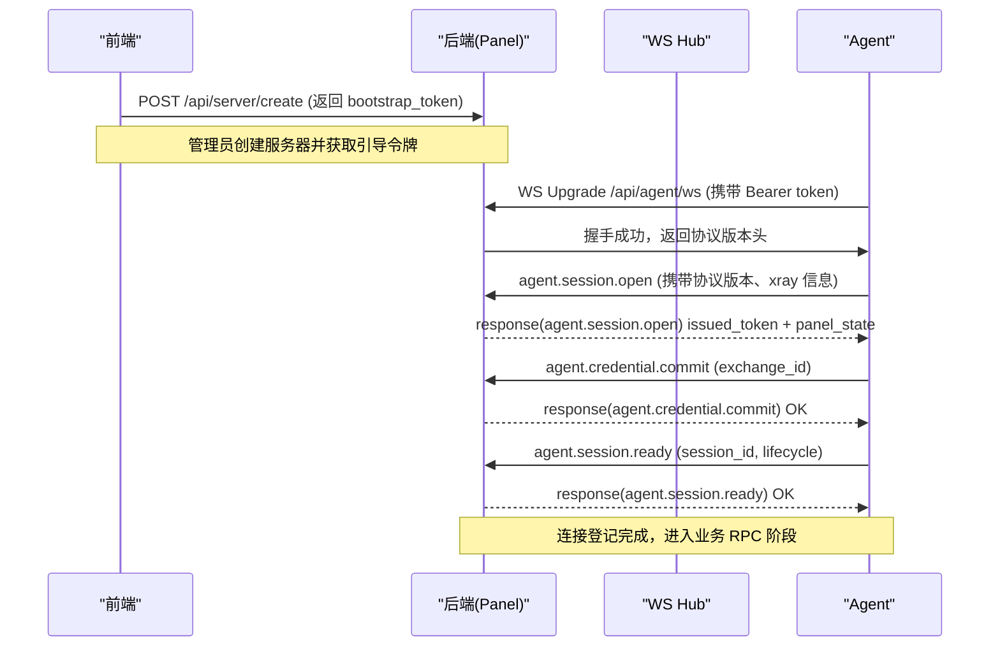
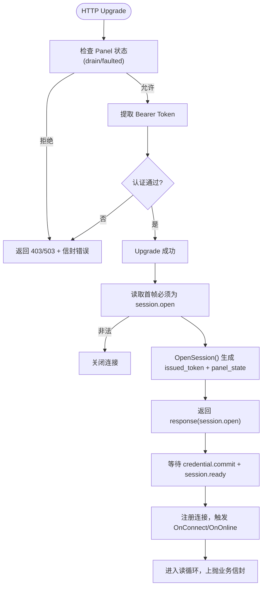
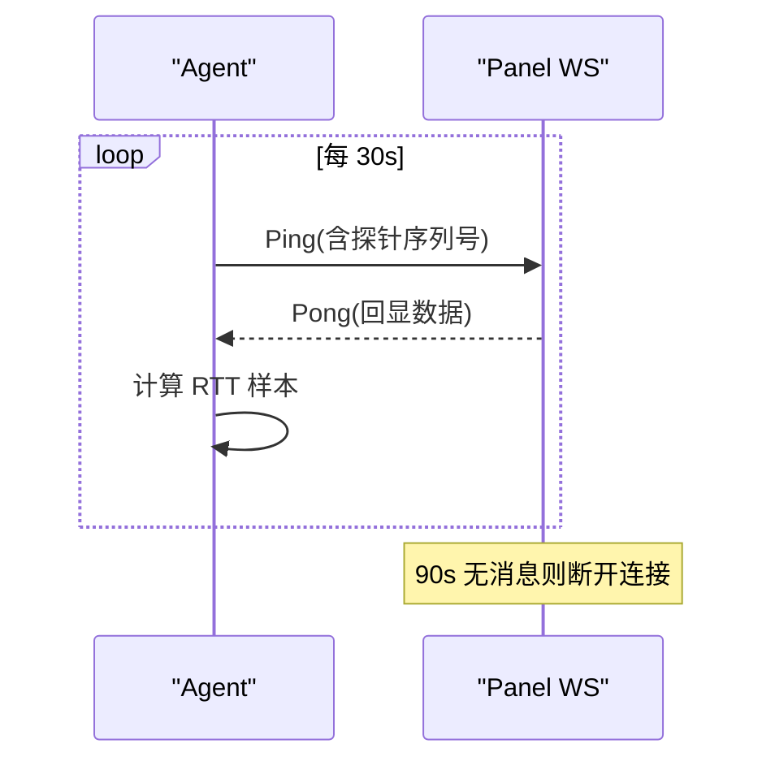
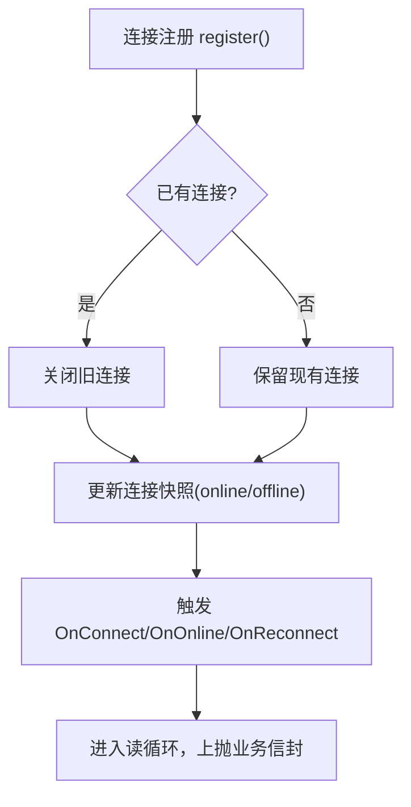
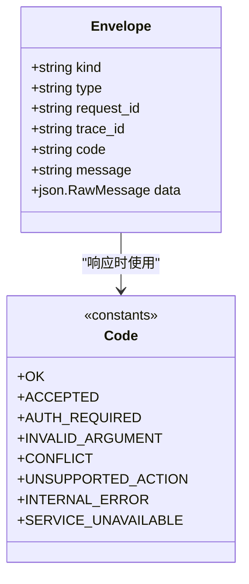
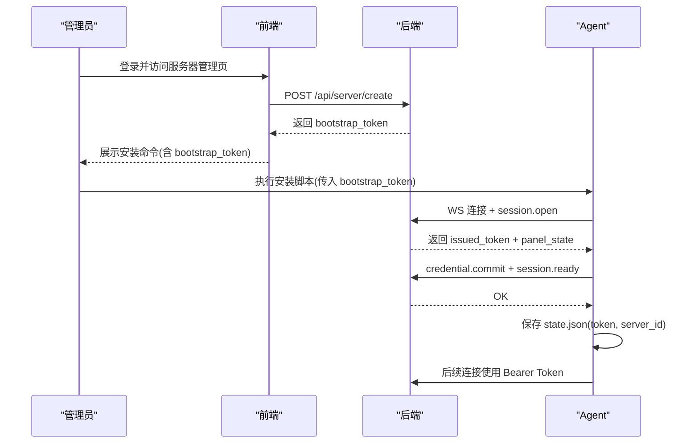
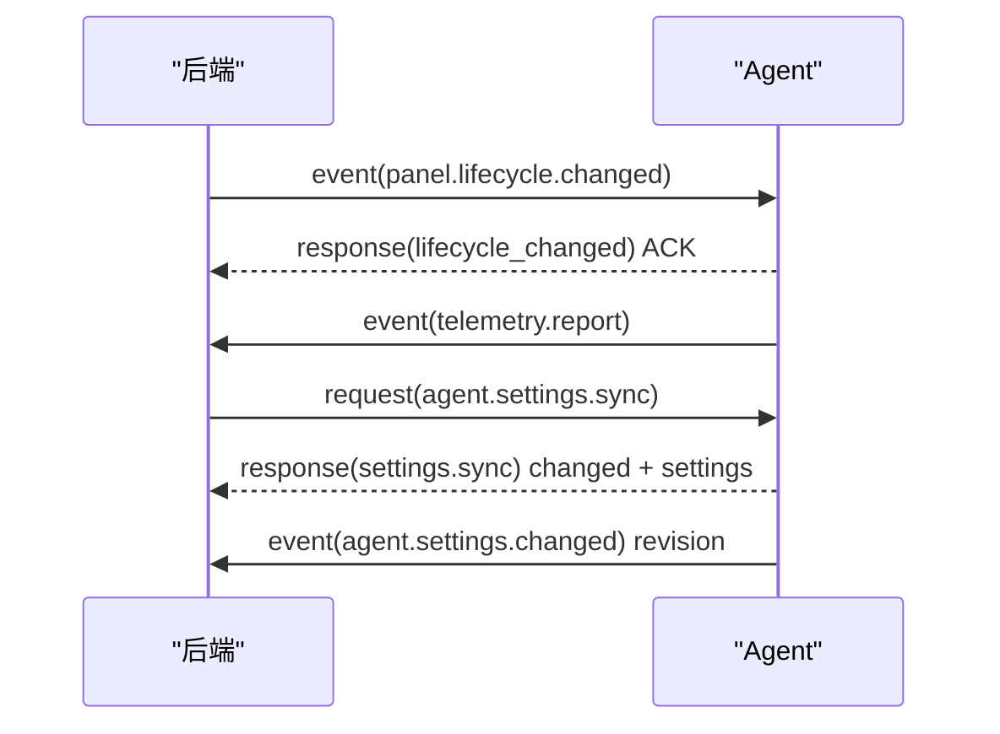
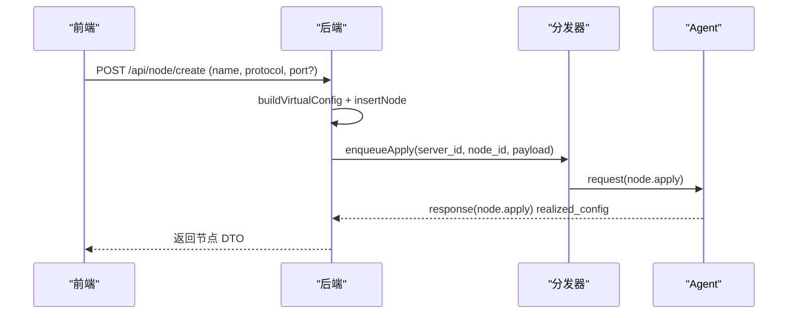
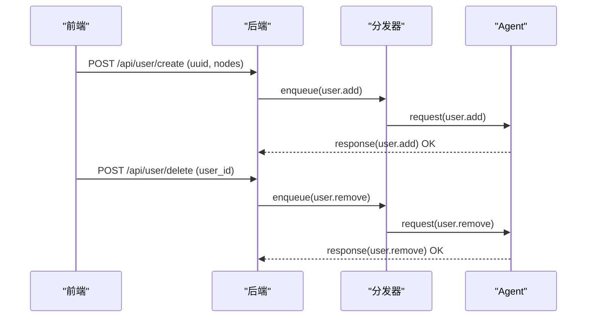
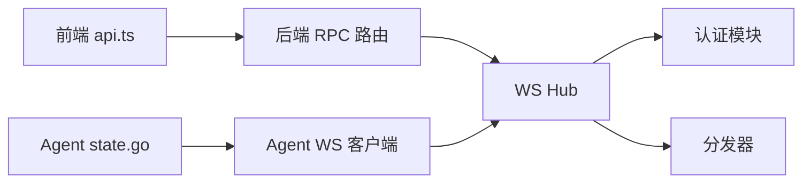

# 组件交互设计

<cite>
**本文引用的文件**   
- [ws-protocol.schema.json](file://docs/ws-protocol.schema.json)
- [rpc-api-design.md](file://docs/rpc-api-design.md)
- [hub.go](file://src/backend/internal/ws/hub.go)
- [agent.go](file://src/backend/internal/ws/agent.go)
- [requester.go](file://src/backend/internal/ws/requester.go)
- [messages.go](file://src/shared/messages.go)
- [config.go](file://src/shared/config.go)
- [auth.go](file://src/backend/internal/panel/auth.go)
- [rpc_routes.go](file://src/backend/internal/panel/rpc_routes.go)
- [nodes.go](file://src/backend/internal/panel/nodes.go)
- [api.ts](file://src/frontend/src/lib/api.ts)
- [latency.go](file://src/agent/cmd/agent/latency.go)
- [state.go](file://src/agent/internal/state/state.go)
</cite>

## 目录
1. [简介](#简介)
2. [项目结构](#项目结构)
3. [核心组件](#核心组件)
4. [架构总览](#架构总览)
5. [详细组件分析](#详细组件分析)
6. [依赖关系分析](#依赖关系分析)
7. [性能考量](#性能考量)
8. [故障排查指南](#故障排查指南)
9. [结论](#结论)
10. [附录](#附录)

## 简介
本文件面向 Lattix 系统的 Backend、Agent、Frontend 三端，系统性阐述它们之间的通信协议与消息格式，覆盖 WebSocket 连接建立、心跳与重连策略、RPC 请求-响应语义、错误处理与超时控制、消息信封字段含义、认证机制（Bootstrap Token 换发长期 Token、Bearer Token 鉴权）、事件驱动架构（状态变更通知、异步任务处理），并给出典型交互流程的序列图与代码级参考路径。

## 项目结构
- 前端（Frontend）：通过 HTTP RPC 调用后端管理接口，使用 Requester 封装请求生命周期、CSRF、幂等键、超时与重试。
- 后端（Backend）：提供管理 HTTP API、WebSocket 端点（/api/agent/ws）用于与 Agent 建立双向控制通道；内部包含 Hub（连接注册表与发送队列）、Authenticator（认证与会话）、Dispatcher（离线命令队列与投递）。
- Agent：作为服务端进程，主动拨出到 Panel 的 WS 端点，完成握手、会话建立、配置下发与遥测上报。

```mermaid
graph TB
FE["前端(Frontend)"] --> |HTTP RPC| BE["后端(Panel)"]
BE <- --> |WebSocket RPC| AG["Agent"]
subgraph "后端"
WS["WS Hub/Handler"]
AUTH["认证与会话"]
DISP["分发器/离线队列"]
end
subgraph "Agent"
WS_CLI["WS 客户端"]
STATE["本地状态(state.json)"]
end
FE --> WS
WS --> AUTH
WS --> DISP
WS_CLI --> WS
STATE --> WS_CLI
```

**图示来源** 
- [rpc-api-design.md:143-209](file://docs/rpc-api-design.md#L143-L209)
- [agent.go:32-77](file://src/backend/internal/ws/agent.go#L32-L77)
- [hub.go:25-54](file://src/backend/internal/ws/hub.go#L25-L54)

**章节来源**
- [rpc-api-design.md:1-380](file://docs/rpc-api-design.md#L1-L380)

## 核心组件
- 统一消息信封 Envelope：kind、type、request_id、trace_id、code/message、data。
- WS 协议 Schema：定义 session.open/ready、credential.commit、lifecycle.changed、settings.sync/changed、telemetry.report、chain-hop.apply/remove 等类型与载荷约束。
- Hub：维护 Agent 连接、发送队列、在线状态、优雅关停（drain）、生命周期同步与确认。
- Authenticator：验证 Bearer Token、OpenSession、Credential Commit。
- Frontend Requester：封装 HTTP 请求、CSRF、幂等键、超时与重试、统一响应信封解析。
- Agent State：持久化长期 Token、服务器 ID、面板观察态、链跳 piece 记录。

**章节来源**
- [messages.go:14-137](file://src/shared/messages.go#L14-L137)
- [ws-protocol.schema.json:106-355](file://docs/ws-protocol.schema.json#L106-L355)
- [hub.go:25-54](file://src/backend/internal/ws/hub.go#L25-L54)
- [requester.go:18-42](file://src/backend/internal/ws/requester.go#L18-L42)
- [api.ts:58-137](file://src/frontend/src/lib/api.ts#L58-L137)
- [state.go:14-29](file://src/agent/internal/state/state.go#L14-L29)

## 架构总览
系统采用“前端通过 HTTP 管理 API 操作后端，后端通过 WebSocket 控制远端 Agent”的分层架构。关键要点：
- 管理面（Frontend ↔ Backend）：严格 JSON RPC，统一响应信封，支持幂等键与 CSRF。
- 控制面（Backend ↔ Agent）：基于 WS 的双向 RPC，信封式消息，带 request/trace ID 追踪。
- 事件驱动：Agent 周期性上报遥测、漂移检测、设置变更；Panel 推送生命周期变化、配置下发。



**图示来源** 
- [agent.go:32-97](file://src/backend/internal/ws/agent.go#L32-L97)
- [agent.go:156-195](file://src/backend/internal/ws/agent.go#L156-L195)
- [ws-protocol.schema.json:136-214](file://docs/ws-protocol.schema.json#L136-L214)

## 详细组件分析

### WebSocket 连接建立与认证
- 升级前校验：检查 Panel 是否处于 drain/faulted 状态，拒绝新连接。
- 鉴权：从 Authorization 头提取 Bearer Token，调用 Authenticator 校验。
- 首次帧强制为 agent.session.open，否则关闭连接。
- OpenSession 成功后返回 issued_token（长期凭证）、credential_exchange_id、panel_state。
- 在 session.ready 之前仅接受 credential.commit 与 session.ready，其他请求返回 UNSUPPORTED_ACTION。



**图示来源** 
- [agent.go:32-97](file://src/backend/internal/ws/agent.go#L32-L97)
- [agent.go:156-195](file://src/backend/internal/ws/agent.go#L156-L195)

**章节来源**
- [agent.go:32-97](file://src/backend/internal/ws/agent.go#L32-L97)
- [agent.go:156-195](file://src/backend/internal/ws/agent.go#L156-L195)
- [ws-protocol.schema.json:136-214](file://docs/ws-protocol.schema.json#L136-L214)

### 心跳机制与连接存活
- 心跳由 Agent 主动 Ping，Panel 原样 Pong，并以收到的控制帧续期读超时。
- Panel 默认 90s 未收到任何字节判定连接死亡；写超时 10s。
- Agent 侧实现延迟探测（Ping/Payload 含序列号），统计中位数 RTT 上报至遥测。



**图示来源** 
- [hub.go:15-22](file://src/backend/internal/ws/hub.go#L15-L22)
- [agent.go:100-109](file://src/backend/internal/ws/agent.go#L100-L109)
- [latency.go:12-16](file://src/agent/cmd/agent/latency.go#L12-L16)

**章节来源**
- [hub.go:15-22](file://src/backend/internal/ws/hub.go#L15-L22)
- [agent.go:100-109](file://src/backend/internal/ws/agent.go#L100-L109)
- [latency.go:12-16](file://src/agent/cmd/agent/latency.go#L12-L16)

### 重连策略与离线补发
- Hub 维护每个服务器的连接快照与在线状态；同一服务器重复连接会踢掉旧连接。
- BeginDrain 优雅关停：以 RFC 6012 服务重启码关闭所有连接，促使 Agent 走快速重启重试路径。
- 离线命令：当 Panel 处于非活跃状态或目标离线时，命令入队，待重连后补发。



**图示来源** 
- [hub.go:231-248](file://src/backend/internal/ws/hub.go#L231-L248)
- [hub.go:157-172](file://src/backend/internal/ws/hub.go#L157-L172)

**章节来源**
- [hub.go:231-248](file://src/backend/internal/ws/hub.go#L231-L248)
- [hub.go:157-172](file://src/backend/internal/ws/hub.go#L157-L172)

### RPC 调用模式与错误处理
- 信封 kind：request/response/event；response 必须包含 code/message/data。
- 错误码：OK、ACCEPTED、AUTH_REQUIRED、INVALID_ARGUMENT、CONFLICT、UNSUPPORTED_ACTION、INTERNAL_ERROR、SERVICE_UNAVAILABLE 等。
- 未知 type 返回 UNSUPPORTED_ACTION，不直接断开连接；JSON 损坏或缺少关键字段才关闭连接。
- 超时控制：写超时 10s，读超时 90s；Hub.Send 支持 context 取消。



**图示来源** 
- [messages.go:14-71](file://src/shared/messages.go#L14-L71)
- [messages.go:112-137](file://src/shared/messages.go#L112-L137)

**章节来源**
- [messages.go:14-71](file://src/shared/messages.go#L14-L71)
- [messages.go:112-137](file://src/shared/messages.go#L112-L137)

### 消息信封结构与字段说明
- kind：request/response/event，区分请求、响应与事件。
- type：domain.action 形式，如 node.apply、user.add、telemetry.report。
- request_id：单次传输唯一标识，32 位十六进制。
- trace_id：完整业务链路标识，跨多次传输保持一致。
- code/message：仅 response 携带，表达结果与可读消息。
- data：具体动作载荷，按 schema 校验。

**章节来源**
- [ws-protocol.schema.json:106-132](file://docs/ws-protocol.schema.json#L106-L132)
- [messages.go:14-22](file://src/shared/messages.go#L14-L22)

### 认证机制：Bootstrap Token 与长期 Token、Bearer Token 鉴权
- 管理员通过 HTTP API 创建服务器，获得 bootstrap_token。
- Agent 安装时使用 bootstrap_token 连接 Panel，完成 session.open 后换取长期 token（issued_token），写入 state.json。
- 后续 WS 连接使用 Bearer Token 进行鉴权，失败返回 403 并附带信封错误。



**图示来源** 
- [api.ts:91-101](file://src/frontend/src/lib/api.ts#L91-L101)
- [agent.go:44-58](file://src/backend/internal/ws/agent.go#L44-L58)
- [state.go:14-29](file://src/agent/internal/state/state.go#L14-L29)

**章节来源**
- [api.ts:91-101](file://src/frontend/src/lib/api.ts#L91-L101)
- [agent.go:44-58](file://src/backend/internal/ws/agent.go#L44-L58)
- [state.go:14-29](file://src/agent/internal/state/state.go#L14-L29)

### 事件驱动架构：状态变更通知与异步任务
- 面板生命周期变更：panel.lifecycle.changed 事件，Agent 需 ACK。
- 设置同步：agent.settings.sync/changed，支持 revision 增量拉取。
- 遥测上报：telemetry.report，周期上报主机指标、流量计数器。
- 异步任务：节点创建/删除、用户增删、链跳 apply/remove 等通过 Dispatcher 入队，离线补发。



**图示来源** 
- [ws-protocol.schema.json:216-315](file://docs/ws-protocol.schema.json#L216-L315)
- [hub.go:321-360](file://src/backend/internal/ws/hub.go#L321-L360)

**章节来源**
- [ws-protocol.schema.json:216-315](file://docs/ws-protocol.schema.json#L216-L315)
- [hub.go:321-360](file://src/backend/internal/ws/hub.go#L321-L360)

### 典型交互流程：节点创建
- 前端调用 /api/node/create，后端构建虚拟配置模板，落库 pending，入队 apply_node。
- 若端口留空且受限 NAT，自动展开 port_candidates。
- Agent 收到 apply_node，渲染配置并热加载，返回 realized_config。



**图示来源** 
- [nodes.go:196-250](file://src/backend/internal/panel/nodes.go#L196-L250)
- [nodes.go:328-369](file://src/backend/internal/panel/nodes.go#L328-L369)
- [messages.go:139-149](file://src/shared/messages.go#L139-L149)

**章节来源**
- [nodes.go:196-250](file://src/backend/internal/panel/nodes.go#L196-L250)
- [nodes.go:328-369](file://src/backend/internal/panel/nodes.go#L328-L369)
- [messages.go:139-149](file://src/shared/messages.go#L139-L149)

### 典型交互流程：用户管理
- 前端调用 user.create/update/set-nodes/delete，后端将操作入队并通过 WS 下发到 Agent。
- Agent 根据节点 inbound 协议构造 account，支持热加/热删（不能热删则重启兜底）。



**章节来源**
- [messages.go:156-178](file://src/shared/messages.go#L156-L178)
- [rpc-api-design.md:177-181](file://docs/rpc-api-design.md#L177-L181)

## 依赖关系分析
- 前端依赖 api.ts 暴露的 RPC 方法，Requester 负责统一请求封装。
- 后端依赖 ws.Hub/Authenticator/Dispatcher 实现 WS 控制面。
- Agent 依赖 state 持久化与 latency tracker 实现心跳与延迟统计。



**图示来源** 
- [api.ts:58-137](file://src/frontend/src/lib/api.ts#L58-L137)
- [rpc_routes.go:33-72](file://src/backend/internal/panel/rpc_routes.go#L33-L72)
- [hub.go:25-54](file://src/backend/internal/ws/hub.go#L25-L54)
- [state.go:14-29](file://src/agent/internal/state/state.go#L14-L29)

**章节来源**
- [api.ts:58-137](file://src/frontend/src/lib/api.ts#L58-L137)
- [rpc_routes.go:33-72](file://src/backend/internal/panel/rpc_routes.go#L33-L72)
- [hub.go:25-54](file://src/backend/internal/ws/hub.go#L25-L54)
- [state.go:14-29](file://src/agent/internal/state/state.go#L14-L29)

## 性能考量
- WS 写缓冲限制：单连接发送队列长度有限，满即断线，重连后补发，避免慢连接拖垮系统。
- 心跳与超时：Agent 每 30s Ping，Panel 90s 无消息判定死亡，写超时 10s。
- 遥测与流量计数：Agent 周期上报绝对计数器，Panel 持久化游标计算增量，天然幂等。
- 异步任务：Dispatcher 入队离线命令，保证最终一致性。

[本节为通用指导，无需特定文件引用]

## 故障排查指南
- 连接失败：检查 Panel 状态（drain/faulted）、Authorization 头是否正确、首次帧是否为 session.open。
- 认证失败：确认 Bearer Token 有效，必要时旋转服务器 Token。
- 离线命令未生效：查看 Hub 连接快照与 OnDisconnect 回调，确认重连后补发。
- 遥测缺失：检查 Agent 心跳与 telemetry.report 上报频率。

**章节来源**
- [agent.go:32-97](file://src/backend/internal/ws/agent.go#L32-L97)
- [hub.go:157-172](file://src/backend/internal/ws/hub.go#L157-L172)
- [latency.go:12-16](file://src/agent/cmd/agent/latency.go#L12-L16)

## 结论
本设计通过严格的信封式 WS 协议与 HTTP RPC 契约，实现了前后端与 Agent 之间的高内聚、低耦合交互。借助心跳、超时、离线补发与事件驱动，系统在可靠性与可观测性方面具备良好基础。建议在生产环境中结合日志与监控完善告警与排障能力。

[本节为总结，无需特定文件引用]

## 附录
- 管理 API 路由与响应规范详见 rpc-api-design.md。
- WS 协议 Schema 详见 ws-protocol.schema.json。
- 前端 API 方法定义见 src/frontend/src/lib/api.ts。

**章节来源**
- [rpc-api-design.md:143-209](file://docs/rpc-api-design.md#L143-L209)
- [ws-protocol.schema.json:106-355](file://docs/ws-protocol.schema.json#L106-L355)
- [api.ts:58-137](file://src/frontend/src/lib/api.ts#L58-L137)