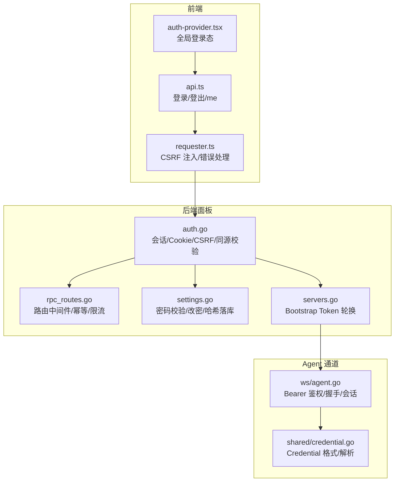
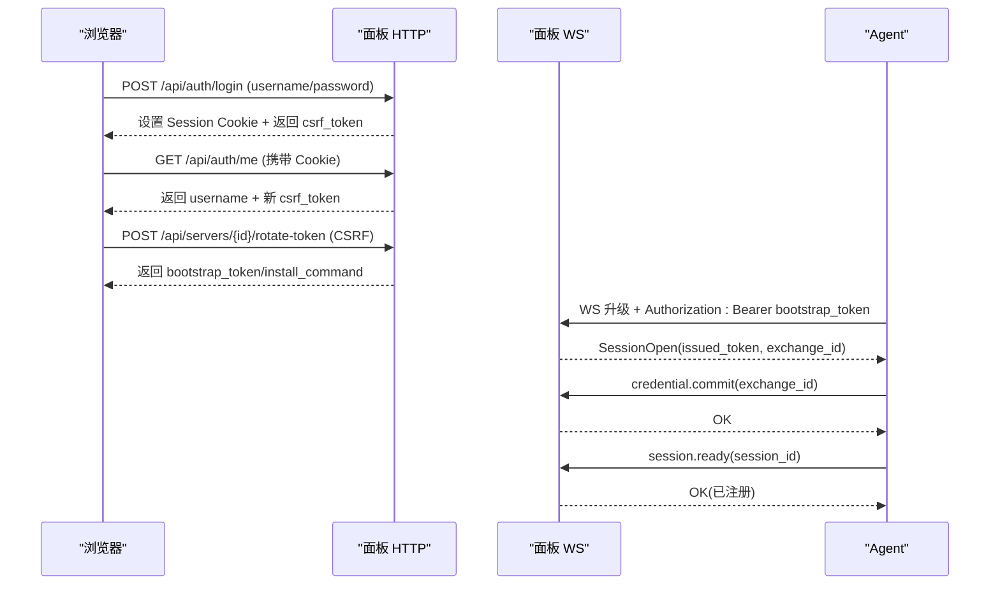
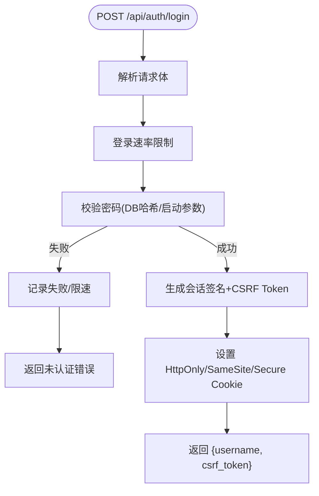
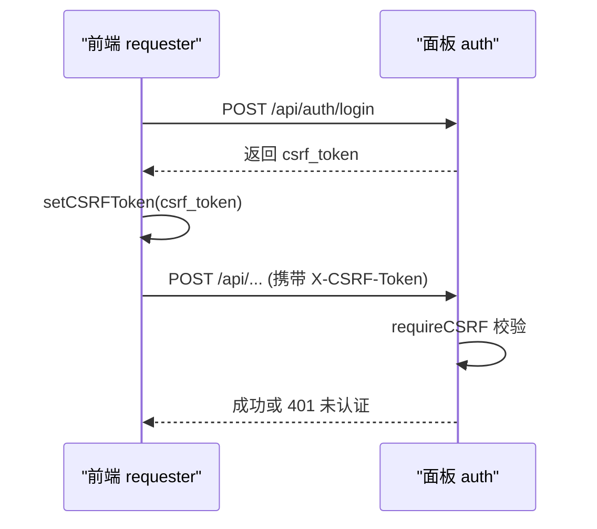
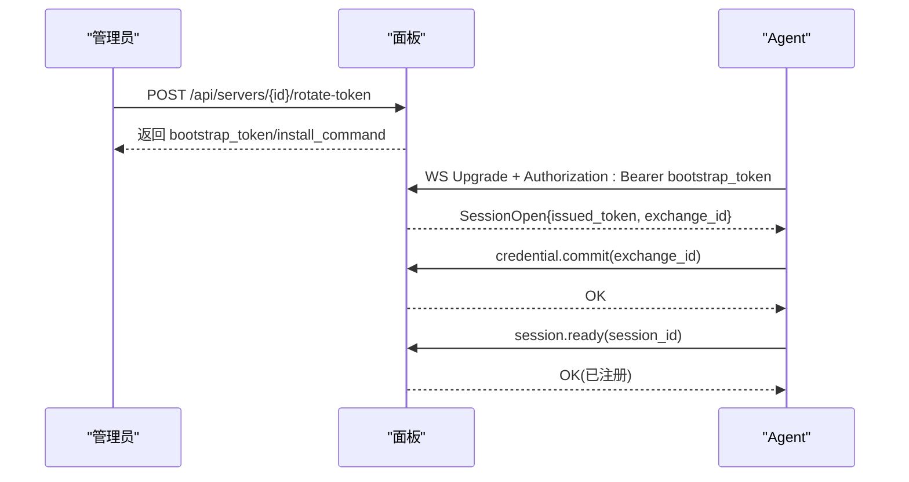
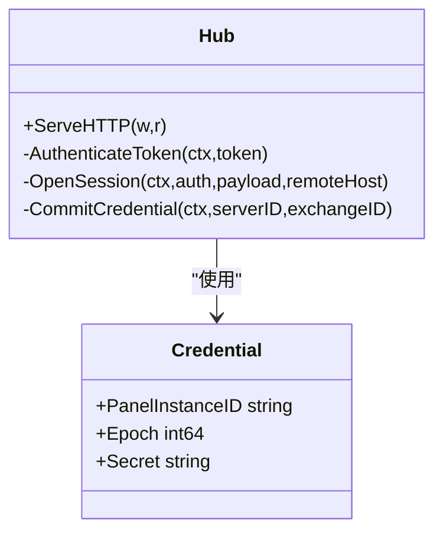
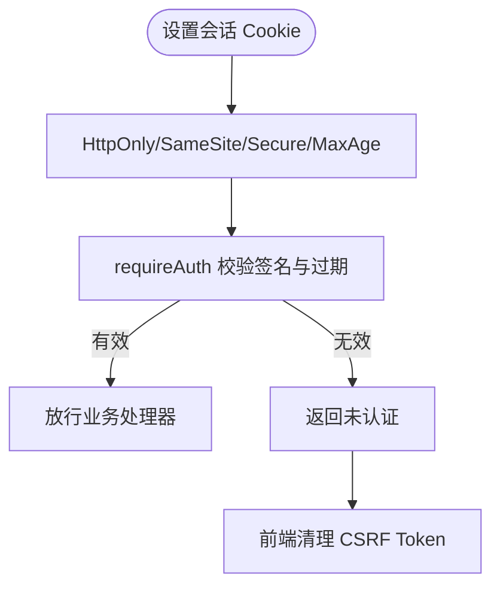
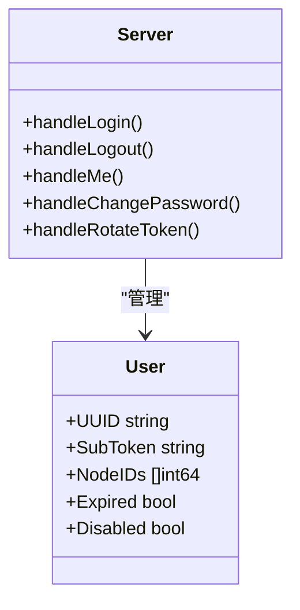
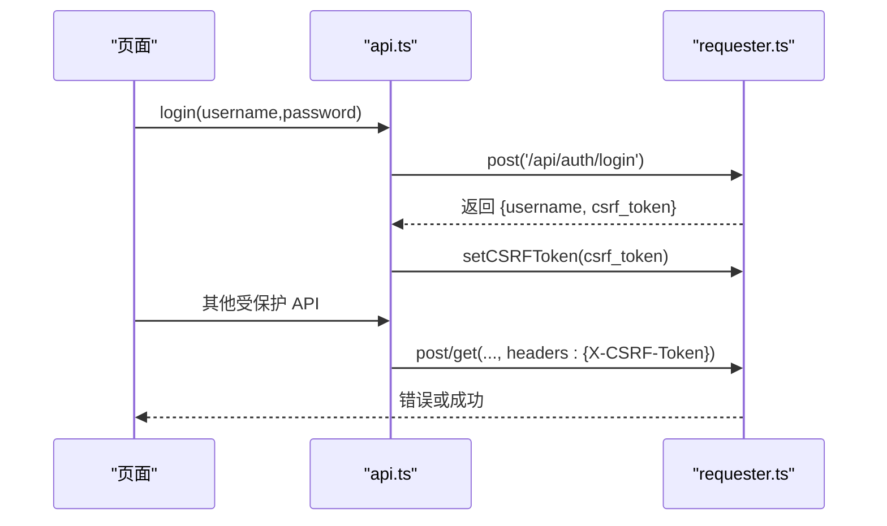
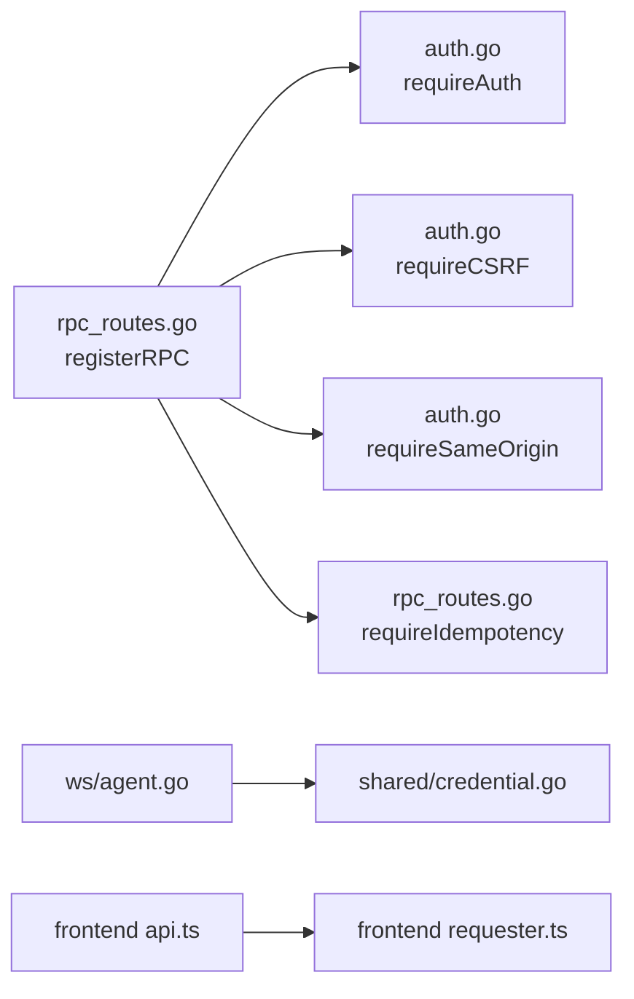

# 认证授权机制

<cite>
**本文引用的文件**   
- [auth.go](file://src/backend/internal/panel/auth.go)
- [rpc_routes.go](file://src/backend/internal/panel/rpc_routes.go)
- [settings.go](file://src/backend/internal/panel/settings.go)
- [servers.go](file://src/backend/internal/panel/servers.go)
- [credential.go](file://src/shared/credential.go)
- [agent.go](file://src/backend/internal/ws/agent.go)
- [api.ts](file://src/frontend/src/lib/api.ts)
- [requester.ts](file://src/frontend/src/lib/requester.ts)
- [auth-provider.tsx](file://src/frontend/src\lib\auth-provider.tsx)
- [main.go](file://src/backend/cmd/backend/main.go)
</cite>

## 目录
1. [简介](#简介)
2. [项目结构](#项目结构)
3. [核心组件](#核心组件)
4. [架构总览](#架构总览)
5. [详细组件分析](#详细组件分析)
6. [依赖关系分析](#依赖关系分析)
7. [性能与安全考量](#性能与安全考量)
8. [故障排查指南](#故障排查指南)
9. [结论](#结论)
10. [附录：常见场景与配置建议](#附录常见场景与配置建议)

## 简介
本文件系统性阐述面板的认证与授权机制，覆盖以下关键主题：
- Bootstrap Token 换发长期 Token 的初始认证流程（Agent 首次上线）
- Bearer Token 鉴权机制（Token 存储、验证、刷新策略）
- CSRF 保护（X-CSRF-Token 头部自动生成、校验与失效）
- 会话管理（Session 生命周期、Cookie 安全属性、跨域策略）
- 权限模型（管理员权限、用户权限、资源访问控制）
- 认证流程图与 Token 交换时序图
- 常见认证场景的代码示例路径与安全配置建议

## 项目结构
认证授权相关代码主要分布在后端面板模块、WebSocket 通道、前端请求器与 API 封装中：
- 后端面板认证与会话：auth.go、rpc_routes.go、settings.go、servers.go
- Agent 连接与凭证交换：ws/agent.go、shared/credential.go
- 前端登录态与 CSRF 注入：frontend api.ts、requester.ts、auth-provider.tsx
- TLS 启动模式与热加载：backend main.go

**图表来源** 
- [auth.go:1-269](file://src/backend/internal/panel/auth.go#L1-L269)
- [rpc_routes.go:1-308](file://src/backend/internal/panel/rpc_routes.go#L1-L308)
- [settings.go:540-619](file://src/backend/internal/panel/settings.go#L540-L619)
- [servers.go:324-383](file://src/backend/internal/panel/servers.go#L324-L383)
- [agent.go:1-359](file://src/backend/internal/ws/agent.go#L1-L359)
- [credential.go:1-65](file://src/shared/credential.go#L1-L65)
- [api.ts:58-73](file://src/frontend/src/lib/api.ts#L58-L73)
- [requester.ts:169-201](file://src/frontend/src/lib/requester.ts#L169-L201)
- [auth-provider.tsx:1-35](file://src/frontend/src/lib/auth-provider.tsx#L1-L35)

**章节来源**
- [auth.go:1-269](file://src/backend/internal/panel/auth.go#L1-L269)
- [rpc_routes.go:1-308](file://src/backend/internal/panel/rpc_routes.go#L1-L308)
- [settings.go:540-619](file://src/backend/internal/panel/settings.go#L540-L619)
- [servers.go:324-383](file://src/backend/internal/panel/servers.go#L324-L383)
- [agent.go:1-359](file://src/backend/internal/ws/agent.go#L1-L359)
- [credential.go:1-65](file://src/shared/credential.go#L1-L65)
- [api.ts:58-73](file://src/frontend/src/lib/api.ts#L58-L73)
- [requester.ts:169-201](file://src/frontend/src/lib/requester.ts#L169-L201)
- [auth-provider.tsx:1-35](file://src/frontend/src/lib/auth-provider.tsx#L1-L35)

## 核心组件
- 会话与 Cookie：基于 HMAC-SHA256 签名的会话值，存储在 HttpOnly Cookie 中，支持 SameSite=Lax 与 Secure 标志。
- CSRF 保护：服务端根据会话值派生 CSRF Token，客户端在 POST 请求头携带 X-CSRF-Token；改密或登出时失效。
- 管理员认证：优先使用数据库中的 bcrypt 哈希，回退到启动参数；改密即全部会话失效。
- Agent 认证：WS 握手阶段通过 Authorization: Bearer <token> 进行鉴权，随后完成凭证交换与注册。
- 路由中间件：统一注入 Auth/CSRF/SameOrigin/Idempotency 等能力，并限制 JSON Body 大小与字段白名单。

**章节来源**
- [auth.go:21-79](file://src/backend/internal/panel/auth.go#L21-L79)
- [auth.go:197-249](file://src/backend/internal/panel/auth.go#L197-L249)
- [settings.go:587-619](file://src/backend/internal/panel/settings.go#L587-L619)
- [agent.go:45-59](file://src/backend/internal/ws/agent.go#L45-L59)
- [rpc_routes.go:33-72](file://src/backend/internal/panel/rpc_routes.go#L33-L72)

## 架构总览
下图展示浏览器、面板与 Agent 之间的认证与授权交互：

**图表来源** 
- [auth.go:81-145](file://src/backend/internal/panel/auth.go#L81-L145)
- [auth.go:164-181](file://src/backend/internal/panel/auth.go#L164-L181)
- [servers.go:324-383](file://src/backend/internal/panel/servers.go#L324-L383)
- [agent.go:33-197](file://src/backend/internal/ws/agent.go#L33-L197)

## 详细组件分析

### 管理员登录与会话（HTTP）
- 登录流程：校验用户名/密码（DB 哈希优先），成功后生成签名会话值与 CSRF Token，写入 Cookie，返回 csrf_token。
- 会话校验：requireAuth 中间件从 Cookie 解析并验证会话签名与过期时间。
- 同源校验：requireSameOrigin 校验 Origin/Referer 与 Host 一致，HTTPS 下强制 https。
- 登出：清除 Cookie，前端清理 CSRF Token。

**图表来源** 
- [auth.go:81-145](file://src/backend/internal/panel/auth.go#L81-L145)
- [auth.go:197-213](file://src/backend/internal/panel/auth.go#L197-L213)
- [auth.go:251-268](file://src/backend/internal/panel/auth.go#L251-L268)

**章节来源**
- [auth.go:81-145](file://src/backend/internal/panel/auth.go#L81-L145)
- [auth.go:164-181](file://src/backend/internal/panel/auth.go#L164-L181)
- [auth.go:197-213](file://src/backend/internal/panel/auth.go#L197-L213)
- [auth.go:251-268](file://src/backend/internal/panel/auth.go#L251-L268)

### CSRF 保护（X-CSRF-Token）
- 生成：服务端根据会话值与密钥派生 CSRF Token；/me 接口会刷新。
- 校验：requireCSRF 中间件对比请求头 X-CSRF-Token 与服务端期望值。
- 失效：登出、改密、未授权回调均会清空前端 CSRF Token。

**图表来源** 
- [auth.go:215-249](file://src/backend/internal/panel/auth.go#L215-L249)
- [api.ts:58-73](file://src/frontend/src/lib/api.ts#L58-L73)
- [requester.ts:169-201](file://src/frontend/src/lib/requester.ts#L169-L201)

**章节来源**
- [auth.go:215-249](file://src/backend/internal/panel/auth.go#L215-L249)
- [api.ts:58-73](file://src/frontend/src/lib/api.ts#L58-L73)
- [requester.ts:169-201](file://src/frontend/src/lib/requester.ts#L169-L201)

### Agent 初始认证与 Bootstrap Token 换发长期 Token
- 轮换 Bootstrap Token：管理员调用 rotate-token 接口，生成新的 bootstrap token，旧凭证立即失效。
- Agent 首连：WS 握手阶段使用 Authorization: Bearer bootstrap_token 鉴权，成功后下发 issued_token 与 exchange_id。
- 凭证交换：Agent 提交 credential.commit，面板确认并允许后续 session.ready，完成注册。

**图表来源** 
- [servers.go:324-383](file://src/backend/internal/panel/servers.go#L324-L383)
- [agent.go:33-197](file://src/backend/internal/ws/agent.go#L33-L197)
- [credential.go:28-56](file://src/shared/credential.go#L28-L56)

**章节来源**
- [servers.go:324-383](file://src/backend/internal/panel/servers.go#L324-L383)
- [agent.go:33-197](file://src/backend/internal/ws/agent.go#L33-L197)
- [credential.go:28-56](file://src/shared/credential.go#L28-L56)

### Bearer Token 鉴权机制（WS）
- 提取：从 Authorization 头提取 Bearer Token。
- 验证：调用 h.Auth.AuthenticateToken 进行校验，支持重连场景。
- 会话：建立应用层会话，维护连接状态与生命周期。

**图表来源** 
- [agent.go:45-59](file://src/backend/internal/ws/agent.go#L45-L59)
- [agent.go:157-197](file://src/backend/internal/ws/agent.go#L157-L197)
- [credential.go:14-56](file://src/shared/credential.go#L14-L56)

**章节来源**
- [agent.go:45-59](file://src/backend/internal/ws/agent.go#L45-L59)
- [agent.go:157-197](file://src/backend/internal/ws/agent.go#L157-L197)
- [credential.go:14-56](file://src/shared/credential.go#L14-L56)

### 会话管理与 Cookie 安全
- 会话有效期：固定 TTL（例如 7 天），签名包含用户名与过期时间。
- Cookie 属性：HttpOnly、Secure（HTTPS）、SameSite=Lax、MaxAge=TTL。
- 同源策略：严格校验 Origin/Referer，HTTPS 下仅接受 https 来源。

**图表来源** 
- [auth.go:21-79](file://src/backend/internal/panel/auth.go#L21-L79)
- [auth.go:197-213](file://src/backend/internal/panel/auth.go#L197-L213)
- [auth.go:251-268](file://src/backend/internal/panel/auth.go#L251-L268)

**章节来源**
- [auth.go:21-79](file://src/backend/internal/panel/auth.go#L21-L79)
- [auth.go:197-213](file://src/backend/internal/panel/auth.go#L197-L213)
- [auth.go:251-268](file://src/backend/internal/panel/auth.go#L251-L268)

### 权限模型（管理员/用户/资源访问）
- 管理员：通过 /api/auth/* 登录与会话管理；修改密码后所有会话失效。
- 用户：由管理员创建，具备订阅令牌与节点分配；停权/恢复触发扇出 add_user/remove_user。
- 资源访问：路由级 requireAuth/requireCSRF/SameOrigin 组合控制；幂等键保障重复提交安全。

**图表来源** 
- [auth.go:81-181](file://src/backend/internal/panel/auth.go#L81-L181)
- [settings.go:540-619](file://src/backend/internal/panel/settings.go#L540-L619)
- [users.go:1-461](file://src/backend/internal/panel/users.go#L1-L461)
- [rpc_routes.go:33-72](file://src/backend/internal/panel/rpc_routes.go#L33-L72)

**章节来源**
- [auth.go:81-181](file://src/backend/internal/panel/auth.go#L81-L181)
- [settings.go:540-619](file://src/backend/internal/panel/settings.go#L540-L619)
- [users.go:1-461](file://src/backend/internal/panel/users.go#L1-L461)
- [rpc_routes.go:33-72](file://src/backend/internal/panel/rpc_routes.go#L33-L72)

### 前端认证集成
- 登录/登出/me：调用后端接口，自动设置/清理 CSRF Token。
- 请求器：POST 请求自动附加 X-CSRF-Token；credentials=include 确保 Cookie 随请求发送。
- 全局登录态：AuthProvider 初始化时调用 me 探测登录态，未授权时清空用户名。

**图表来源** 
- [api.ts:58-73](file://src/frontend/src/lib/api.ts#L58-L73)
- [requester.ts:169-201](file://src/frontend/src/lib/requester.ts#L169-L201)
- [auth-provider.tsx:1-35](file://src/frontend/src/lib/auth-provider.tsx#L1-L35)

**章节来源**
- [api.ts:58-73](file://src/frontend/src/lib/api.ts#L58-L73)
- [requester.ts:169-201](file://src/frontend/src/lib/requester.ts#L169-L201)
- [auth-provider.tsx:1-35](file://src/frontend/src/lib/auth-provider.tsx#L1-L35)

## 依赖关系分析
- 路由中间件依赖：Auth/CSRF/SameOrigin/Idempotency 按注册顺序叠加。
- 认证依赖：管理员密码校验依赖 DB settings；Agent 认证依赖 WS Hub 与 shared.Credential。
- 前端依赖：requester 负责通用请求行为，api 暴露业务方法，auth-provider 管理全局状态。

**图表来源** 
- [rpc_routes.go:33-72](file://src/backend/internal/panel/rpc_routes.go#L33-L72)
- [auth.go:197-249](file://src/backend/internal/panel/auth.go#L197-L249)
- [agent.go:45-59](file://src/backend/internal/ws/agent.go#L45-L59)
- [credential.go:28-56](file://src/shared/credential.go#L28-L56)
- [api.ts:58-73](file://src/frontend/src/lib/api.ts#L58-L73)
- [requester.ts:169-201](file://src/frontend/src/lib/requester.ts#L169-L201)

**章节来源**
- [rpc_routes.go:33-72](file://src/backend/internal/panel/rpc_routes.go#L33-L72)
- [auth.go:197-249](file://src/backend/internal/panel/auth.go#L197-L249)
- [agent.go:45-59](file://src/backend/internal/ws/agent.go#L45-L59)
- [credential.go:28-56](file://src/shared/credential.go#L28-L56)
- [api.ts:58-73](file://src/frontend/src/lib/api.ts#L58-L73)
- [requester.ts:169-201](file://src/frontend/src/lib/requester.ts#L169-L201)

## 性能与安全考量
- 会话签名：HMAC-SHA256 计算开销低，适合高并发校验。
- 密码哈希：bcrypt 成本可控，提供并发槽位避免阻塞。
- CSRF：无状态派生，校验 O(1)，无需额外存储。
- 幂等性：基于 Idempotency-Key 与请求体哈希去重，防止重复提交。
- TLS：支持 ACME/自带证书/路径模式热加载，最小版本 TLS1.2。

[本节为通用指导，不直接分析具体文件]

## 故障排查指南
- 登录失败：检查用户名/密码、登录速率限制、bcrypt 槽位占用。
- CSRF 无效：确认登录后获取 csrf_token，POST 请求是否携带 X-CSRF-Token。
- 会话过期：检查 Cookie MaxAge 与浏览器时间同步；改密后需重新登录。
- Agent 无法上线：检查 bootstrap_token 是否轮换、WS 握手是否携带正确 Authorization。
- 同源校验失败：确认 Origin/Referer 与 Host 一致，HTTPS 环境必须 https。

**章节来源**
- [auth.go:81-145](file://src/backend/internal/panel/auth.go#L81-L145)
- [auth.go:215-249](file://src/backend/internal/panel/auth.go#L215-L249)
- [agent.go:33-197](file://src/backend/internal/ws/agent.go#L33-L197)

## 结论
本系统采用“会话 Cookie + CSRF + 同源校验”的组合防护 Web 管理面，同时以“Bearer Token + WS 握手 + 凭证交换”保障 Agent 接入安全。管理员凭据以 bcrypt 落库，改密即失效全部会话；Agent 通过一次性 bootstrap_token 换取长期凭证，确保初始引导安全。整体设计兼顾安全性、可运维性与扩展性。

[本节为总结，不直接分析具体文件]

## 附录：常见场景与配置建议
- 管理员登录
  - 前端调用路径：api.login(username, password) → 设置 CSRF Token
  - 后端路径：POST /api/auth/login → 设置 Cookie + 返回 csrf_token
  - 参考：[api.ts:58-63](file://src/frontend/src/lib/api.ts#L58-L63)、[auth.go:81-145](file://src/backend/internal/panel/auth.go#L81-L145)

- 会话探活
  - 前端调用路径：api.me() → 刷新 CSRF Token
  - 后端路径：GET /api/auth/me → 校验会话 + 返回 csrf_token
  - 参考：[api.ts:69-73](file://src/frontend/src/lib/api.ts#L69-L73)、[auth.go:164-181](file://src/backend/internal/panel/auth.go#L164-L181)

- 登出
  - 前端调用路径：api.logout() → 清理 CSRF Token
  - 后端路径：POST /api/auth/logout → 清除 Cookie
  - 参考：[api.ts:64-68](file://src/frontend/src/lib/api.ts#L64-L68)、[auth.go:147-162](file://src/backend/internal/panel/auth.go#L147-L162)

- 修改管理员密码
  - 前端调用路径：api.changePassword(current, new) → 清理 CSRF Token
  - 后端路径：PUT /api/settings/password → 校验当前密码 + bcrypt 落库
  - 参考：[api.ts:232-239](file://src/frontend/src/lib/api.ts#L232-L239)、[settings.go:540-619](file://src/backend/internal/panel/settings.go#L540-L619)

- 轮换 Bootstrap Token
  - 前端调用路径：api.rotateServerToken(serverId)
  - 后端路径：POST /api/servers/{id}/rotate-token → 生成新 bootstrap_token
  - 参考：[servers.go:324-383](file://src/backend/internal/panel/servers.go#L324-L383)

- Agent 首次上线
  - WS 握手：Authorization: Bearer bootstrap_token
  - 交换流程：session.open → credential.commit → session.ready
  - 参考：[agent.go:33-197](file://src/backend/internal/ws/agent.go#L33-L197)、[credential.go:28-56](file://src/shared/credential.go#L28-L56)

- 安全配置建议
  - 启用 HTTPS（ACME/自带证书/路径模式）
  - 保持 SameSite=Lax、HttpOnly、Secure 的 Cookie 设置
  - 严格同源校验，禁止信任非受信代理头的 X-Forwarded-For
  - 合理设置请求体大小限制与幂等键长度范围
  - 定期轮换 bootstrap_token，及时吊销泄露凭证

**章节来源**
- [api.ts:58-73](file://src/frontend/src/lib/api.ts#L58-L73)
- [auth.go:81-181](file://src/backend/internal/panel/auth.go#L81-L181)
- [settings.go:540-619](file://src/backend/internal/panel/settings.go#L540-L619)
- [servers.go:324-383](file://src/backend/internal/panel/servers.go#L324-L383)
- [agent.go:33-197](file://src/backend/internal/ws/agent.go#L33-L197)
- [credential.go:28-56](file://src/shared/credential.go#L28-L56)
- [main.go:450-477](file://src/backend/cmd/backend/main.go#L450-L477)