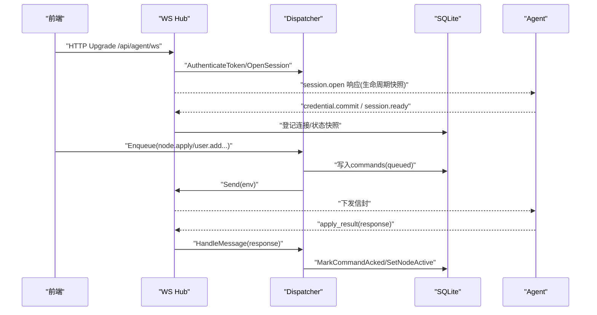
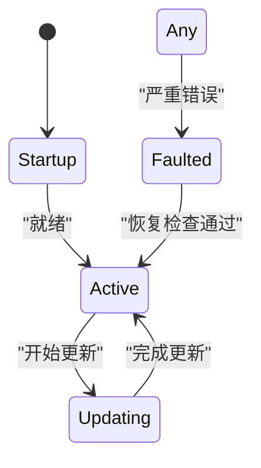
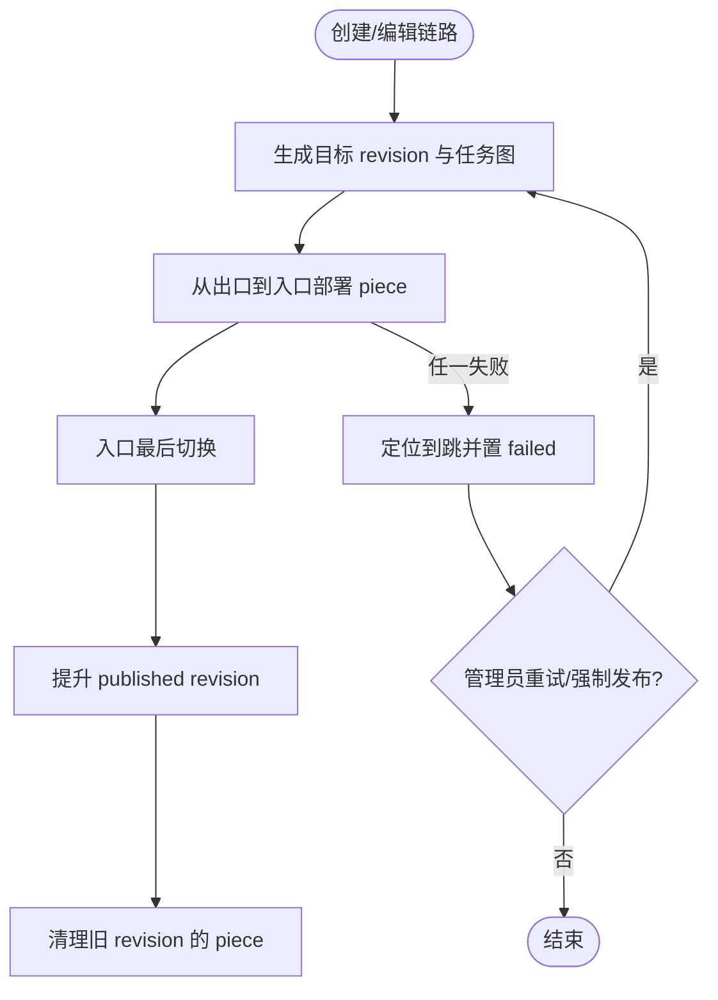
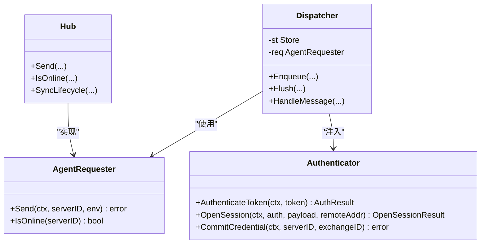
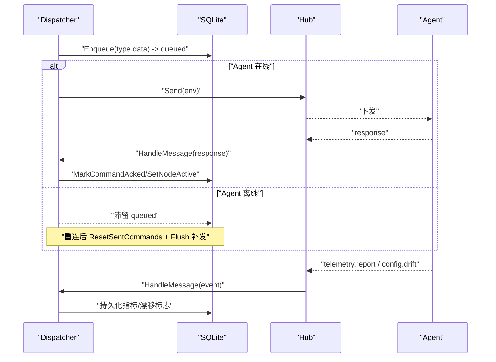
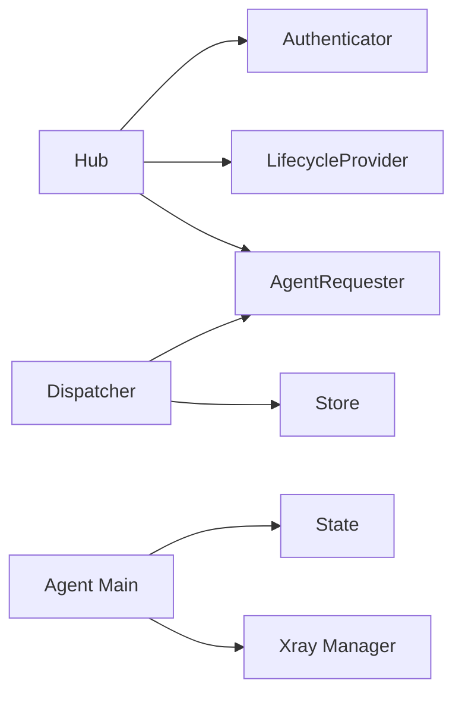

# 设计模式与架构决策

<cite>
**本文引用的文件**   
- [hub.go](file://src/backend/internal/ws/hub.go)
- [agent.go](file://src/backend/internal/ws/agent.go)
- [requester.go](file://src/backend/internal/ws/requester.go)
- [dispatcher.go](file://src/backend/internal/dispatch/dispatcher.go)
- [store.go](file://src/backend/internal/store/store.go)
- [messages.go](file://src/shared/messages.go)
- [state.go](file://src/agent/internal/state/state.go)
- [main.go（Agent）](file://src/agent/cmd/agent/main.go)
- [framework-design.md](file://docs/framework-design.md)
- [panel-lifecycle-state-machine-design.md](file://docs/panel-lifecycle-state-machine-design.md)
- [rpc-api-design.md](file://docs/rpc-api-design.md)
- [chain-revisions-traffic-design.md](file://docs/chain-revisions-traffic-design.md)
</cite>

## 目录
1. [引言](#引言)
2. [项目结构](#项目结构)
3. [核心组件](#核心组件)
4. [架构总览](#架构总览)
5. [详细组件分析](#详细组件分析)
6. [依赖关系分析](#依赖关系分析)
7. [性能考量](#性能考量)
8. [故障排查指南](#故障排查指南)
9. [结论](#结论)
10. [附录：扩展点与最佳实践](#附录扩展点与最佳实践)

## 引言
本文件系统性梳理 Lattix 在 MVP 阶段的架构设计与关键模式，重点解释：
- 状态机模式：节点生命周期、链状态机、Panel/Agent 连接状态机
- 插件化架构：可扩展的消息处理器与 Requester 抽象
- 事件驱动架构：异步任务处理、离线命令队列、遥测与漂移上报
- 关键架构决策：单通道 WebSocket、SQLite 存储、虚拟配置模板
- 设计权衡：性能 vs 可维护性、功能完整性 vs 复杂度控制
- 扩展点：新增协议支持、第三方服务集成方式

## 项目结构
仓库采用 monorepo 组织，前后端与 Agent 通过 shared 模块共享协议与数据结构。后端提供 HTTP API、WebSocket Hub、SQLite 存储；Agent 独立二进制负责 xray 配置落地与热更新；前端为 React SPA，由后端嵌入托管。

```mermaid
graph TB
subgraph "后端"
WS["WS Hub<br/>连接注册/发送/心跳"]
DISP["Dispatcher<br/>命令入队/投递/回执"]
STORE["Store(SQLite)<br/>持久化/备份/迁移"]
end
subgraph "Agent"
AG_MAIN["Agent 主循环<br/>重连/心跳/会话"]
STATE["本地状态(state.json)<br/>凭证/链piece"]
XRAY["xray 管理<br/>配置落盘/热操作"]
end
subgraph "前端"
FE["React SPA<br/>构建产物嵌入后端"]
end
FE --> WS
WS < --> DISP
DISP --> STORE
AG_MAIN --> WS
AG_MAIN --> STATE
AG_MAIN --> XRAY
```

**图表来源** 
- [framework-design.md:23-60](file://docs/framework-design.md#L23-L60)
- [store.go:16-356](file://src/backend/internal/store/store.go#L16-L356)

**章节来源**
- [framework-design.md:23-60](file://docs/framework-design.md#L23-L60)

## 核心组件
- WS Hub：维护 Agent 连接注册表、在线状态、发送缓冲、生命周期同步与优雅关停
- Dispatcher：串联 Store 与 Requester，实现命令入队、离线排队、重试与死信、回执路由
- Store：SQLite 数据访问层，定义 DDL、并发安全（单连接+busy_timeout）、备份导出
- Shared Messages：统一信封 Envelope、RPC 类型与载荷、校验与序列化
- Agent State：本地持久化长期凭证、面板观察、链 piece 记录，用于重启重建与幂等
- Agent Main：拨出建立 WS、首连认证、心跳保活、指数退避重连、生命周期感知

**章节来源**
- [hub.go:25-110](file://src/backend/internal/ws/hub.go#L25-L110)
- [dispatcher.go:24-67](file://src/backend/internal/dispatch/dispatcher.go#L24-L67)
- [store.go:358-389](file://src/backend/internal/store/store.go#L358-L389)
- [messages.go:13-51](file://src/shared/messages.go#L13-L51)
- [state.go:14-28](file://src/agent/internal/state/state.go#L14-L28)
- [main.go（Agent）:33-98](file://src/agent/cmd/agent/main.go#L33-L98)

## 架构总览
系统以“单条 WebSocket 长连接”作为 Panel ↔ Agent 的唯一控制通道，所有业务命令、遥测、设置同步均走该通道。Panel 侧通过 Dispatcher 将命令写入 commands 表，离线时滞留，重连后补发；回执驱动节点/链状态机推进。



**图表来源** 
- [agent.go:33-199](file://src/backend/internal/ws/agent.go#L33-L199)
- [dispatcher.go:50-67](file://src/backend/internal/dispatch/dispatcher.go#L50-L67)
- [dispatcher.go:412-438](file://src/backend/internal/dispatch/dispatcher.go#L412-L438)
- [messages.go:72-91](file://src/shared/messages.go#L72-L91)

**章节来源**
- [framework-design.md:23-44](file://docs/framework-design.md#L23-L44)
- [rpc-api-design.md:143-200](file://docs/rpc-api-design.md#L143-L200)

## 详细组件分析

### 状态机模式：Panel/Agent 连接与生命周期
- Panel 全局生命周期：startup | active | updating | faulted，影响 WS 允许、业务命令、liveness/latency 行为
- Agent 连接状态：never_connected | connecting | reconnecting | online | offline | auth_rejected
- 生命周期版本 epoch/revision 保证幂等与顺序，避免旧备份恢复导致状态倒退
- Hub 维护连接快照与 online/offline 跃迁，触发 OnOnline/OnDisconnect 钩子



**图表来源** 
- [panel-lifecycle-state-machine-design.md:17-48](file://docs/panel-lifecycle-state-machine-design.md#L17-L48)
- [panel-lifecycle-state-machine-design.md:50-88](file://docs/panel-lifecycle-state-machine-design.md#L50-L88)

**章节来源**
- [panel-lifecycle-state-machine-design.md:17-48](file://docs/panel-lifecycle-state-machine-design.md#L17-L48)
- [panel-lifecycle-state-machine-design.md:50-88](file://docs/panel-lifecycle-state-machine-design.md#L50-L88)

### 状态机模式：节点与链路状态机
- 节点状态机：pending → applying → active | failed，失败携带原因供重试
- 链路状态机：applying/waiting_for_agent/active/active_unconfirmed/active_failed/cleanup_pending/invalid/deleted
- Planner 从出口向入口部署，最后切换入口，确保 make-before-break
- 离线不阻塞已发布数据面，仅控制面不可达；强制发布不可自动回滚



**图表来源** 
- [chain-revisions-traffic-design.md:36-54](file://docs/chain-revisions-traffic-design.md#L36-L54)
- [chain-revisions-traffic-design.md:56-83](file://docs/chain-revisions-traffic-design.md#L56-L83)

**章节来源**
- [framework-design.md:130-147](file://docs/framework-design.md#L130-L147)
- [chain-revisions-traffic-design.md:36-83](file://docs/chain-revisions-traffic-design.md#L36-L83)

### 插件化架构：Requester 抽象与消息处理器
- AgentRequester 接口隔离“发送命令”与具体传输，MVP 仅 WS 实现，后续可扩展 gRPC/HTTP
- Authenticator 接口封装鉴权与会话建立，便于替换或增强
- Dispatcher 按 type 分发 HandleMessage，新增消息类型只需增加分支与处理器
- 外部 HTTP 能力通过 JSONRequester/FileRequester/WebhookRequester 窄接口解耦



**图表来源** 
- [requester.go:18-43](file://src/backend/internal/ws/requester.go#L18-L43)
- [dispatcher.go:24-48](file://src/backend/internal/dispatch/dispatcher.go#L24-L48)
- [hub.go:25-63](file://src/backend/internal/ws/hub.go#L25-L63)

**章节来源**
- [rpc-api-design.md:1-40](file://docs/rpc-api-design.md#L1-L40)
- [dispatcher.go:412-438](file://src/backend/internal/dispatch/dispatcher.go#L412-L438)

### 事件驱动架构：异步任务与离线队列
- commands 表充当离线命令队列与操作日志，status 流转 queued→sent→acked/failed
- Flush 按服务器粒度串行投递，离线时停止并滞留，重连后 ResetSentCommands 再补发
- 遥测 telemetry.report 周期上报主机指标与流量增量，无需回执
- 配置漂移 config.drift 事件上报，面板标记并提示修复



**图表来源** 
- [dispatcher.go:171-241](file://src/backend/internal/dispatch/dispatcher.go#L171-L241)
- [dispatcher.go:402-409](file://src/backend/internal/dispatch/dispatcher.go#L402-L409)
- [dispatcher.go:553-623](file://src/backend/internal/dispatch/dispatcher.go#L553-L623)

**章节来源**
- [framework-design.md:40-44](file://docs/framework-design.md#L40-L44)
- [dispatcher.go:171-241](file://src/backend/internal/dispatch/dispatcher.go#L171-L241)

### 关键架构决策与权衡

#### 为什么选择单通道 WebSocket？
- 简化 NAT/无公网场景：Agent 主动拨出，Panel 无需外连
- 统一双向通信：命令、遥测、设置同步、升级均复用一条连接
- 降低运维复杂度：无需多端口/多协议栈，易于防火墙放行

**章节来源**
- [framework-design.md:23-44](file://docs/framework-design.md#L23-L44)
- [rpc-api-design.md:1-27](file://docs/rpc-api-design.md#L1-L27)

#### 为什么采用 SQLite 而非分布式数据库？
- 规模假设下绰绰有余（≤30 服务器，≤50 用户）
- 单连接 + busy_timeout 避免并发写锁冲突
- 内置 VACUUM INTO 一致性备份，权限严格（0600），安全合规

**章节来源**
- [framework-design.md:60-61](file://docs/framework-design.md#L60-L61)
- [store.go:368-389](file://src/backend/internal/store/store.go#L368-L389)
- [store.go:448-465](file://src/backend/internal/store/store.go#L448-L465)

#### 为什么使用虚拟配置模板？
- 面板侧渲染占位符，Agent 原样写入 xray 配置，无翻译层
- 支持 Reality 密钥对由 Agent 生成，私钥不出服务器
- 端口/dest/serverNames 可由面板或 Agent 智能选择，回执上报 realized_config

**章节来源**
- [framework-design.md:148-159](file://docs/framework-design.md#L148-L159)
- [messages.go:139-149](file://src/shared/messages.go#L139-L149)

#### 设计权衡
- 性能 vs 可维护性：单连接简化实现但需缓冲与超时控制；SQLite 单机性能高且易维护
- 功能完整性 vs 复杂度控制：链编排与流量统计引入状态机与审计表，但通过 planner 与绝对计数器降低复杂性
- 扩展性：Requester/Authenticator 抽象预留 gRPC/HTTP 实现；消息类型按 domain.action 演进

**章节来源**
- [hub.go:16-24](file://src/backend/internal/ws/hub.go#L16-L24)
- [chain-revisions-traffic-design.md:105-136](file://docs/chain-revisions-traffic-design.md#L105-L136)

### 扩展点设计

#### 如何添加新的协议支持？
- 在 shared/messages.go 中新增 Type 与载荷结构
- Dispatcher.HandleMessage 增加分支处理
- Agent 侧 xray runner 支持新 inbound 的热操作或重启兜底
- 前端向导表单与订阅输出适配新协议字段

**章节来源**
- [messages.go:72-91](file://src/shared/messages.go#L72-L91)
- [dispatcher.go:412-438](file://src/backend/internal/dispatch/dispatcher.go#L412-L438)
- [framework-design.md:286-320](file://docs/framework-design.md#L286-L320)

#### 如何集成第三方服务？
- 使用 JSONRequester/FileRequester/WebhookRequester 窄接口
- 遵循对方 HTTP 状态码与响应格式，不套用 Lattix RPC 业务码
- 告警通道（Webhook/Telegram）通过 Alerter 异步发送，5s 超时，失败仅记日志

**章节来源**
- [rpc-api-design.md:29-40](file://docs/rpc-api-design.md#L29-L40)
- [framework-design.md:367-381](file://docs/framework-design.md#L367-L381)

## 依赖关系分析
- Hub 依赖 Authenticator/LifecycleProvider，实现 AgentRequester
- Dispatcher 依赖 Store 与 AgentRequester，串联命令生命周期
- Store 直接操作 SQLite，提供事务化迁移与备份
- Agent 依赖 state 包持久化凭证与链 piece，依赖 xray manager 执行热操作



**图表来源** 
- [hub.go:25-63](file://src/backend/internal/ws/hub.go#L25-L63)
- [dispatcher.go:24-48](file://src/backend/internal/dispatch/dispatcher.go#L24-L48)
- [store.go:358-389](file://src/backend/internal/store/store.go#L358-L389)
- [state.go:14-28](file://src/agent/internal/state/state.go#L14-L28)

**章节来源**
- [requester.go:18-43](file://src/backend/internal/ws/requester.go#L18-L43)
- [dispatcher.go:24-48](file://src/backend/internal/dispatch/dispatcher.go#L24-L48)

## 性能考量
- WS 写超时与读超时：单次写 10s，90s 无字节判死，避免僵尸连接
- 发送缓冲 256 条，写满即断开慢连接，重连后补发 queued 命令
- SQLite 单连接 + busy_timeout=5000ms，避免 database is locked
- 遥测周期默认 60s，延迟测量仅在 active 状态进行，失败不关闭连接
- 链路流量统计使用绝对计数器，丢帧补差，避免复杂流水

**章节来源**
- [hub.go:16-24](file://src/backend/internal/ws/hub.go#L16-L24)
- [store.go:368-389](file://src/backend/internal/store/store.go#L368-L389)
- [framework-design.md:251-266](file://docs/framework-design.md#L251-L266)
- [chain-revisions-traffic-design.md:105-136](file://docs/chain-revisions-traffic-design.md#L105-L136)

## 故障排查指南
- 连接问题：检查 Authorization Bearer token、HTTP 403/503 响应、X-Lattix-Protocol 头
- 命令未生效：查看 commands 表 status（queued/sent/acked/failed），确认 IsOnline 与 Flush 是否执行
- 节点失败：检查 apply_result 的 code/message，必要时重试或查看节点 failed 原因
- 配置漂移：收到 config.drift true 后执行修复，重新应用 active 节点
- 备份下载：GET /api/backup/download 使用 VACUUM INTO，注意权限 0600

**章节来源**
- [agent.go:33-199](file://src/backend/internal/ws/agent.go#L33-L199)
- [dispatcher.go:625-730](file://src/backend/internal/dispatch/dispatcher.go#L625-L730)
- [framework-design.md:367-381](file://docs/framework-design.md#L367-L381)
- [store.go:448-465](file://src/backend/internal/store/store.go#L448-L465)

## 结论
Lattix 通过状态机模式、插件化抽象与事件驱动架构，实现了高可靠、易扩展的控制平面。单通道 WebSocket 与 SQLite 的选择在 MVP 规模下兼顾性能与可维护性。虚拟配置模板与链编排器在保证功能完整性的同时控制了复杂度。未来可通过 Requester/Authenticator 扩展更多传输与鉴权方式，并通过消息类型演进支持新协议与第三方服务。

## 附录：扩展点与最佳实践
- 新增协议：在 shared/messages.go 定义 Type/载荷，Dispatcher 增加分支，Agent 支持热操作或重启兜底
- 第三方集成：使用 JSONRequester/FileRequester/WebhookRequester，遵循对方协议，不混用 Lattix 业务码
- 错误处理：Envelope.Validate 严格校验，handleCommandResponse 区分成功/失败路径，记录操作日志
- 性能优化：合理设置 sendBuffer、writeTimeout、pongTimeout；SQLite 单连接 + busy_timeout；遥测周期可调

**章节来源**
- [messages.go:111-137](file://src/shared/messages.go#L111-L137)
- [dispatcher.go:625-730](file://src/backend/internal/dispatch/dispatcher.go#L625-L730)
- [hub.go:398-413](file://src/backend/internal/ws/hub.go#L398-L413)
- [store.go:368-389](file://src/backend/internal/store/store.go#L368-L389)