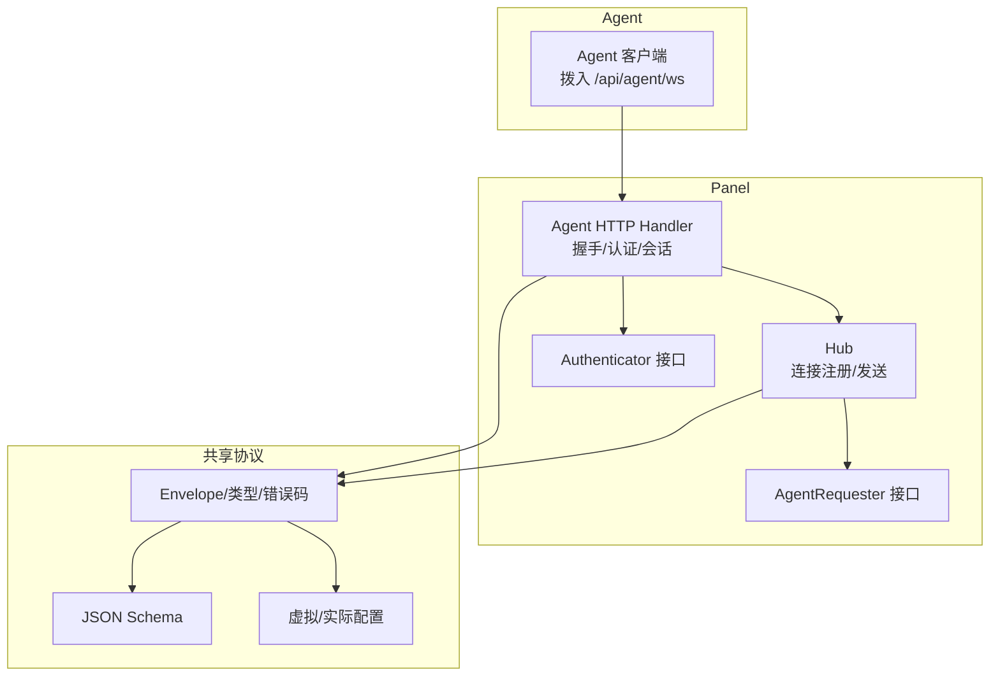
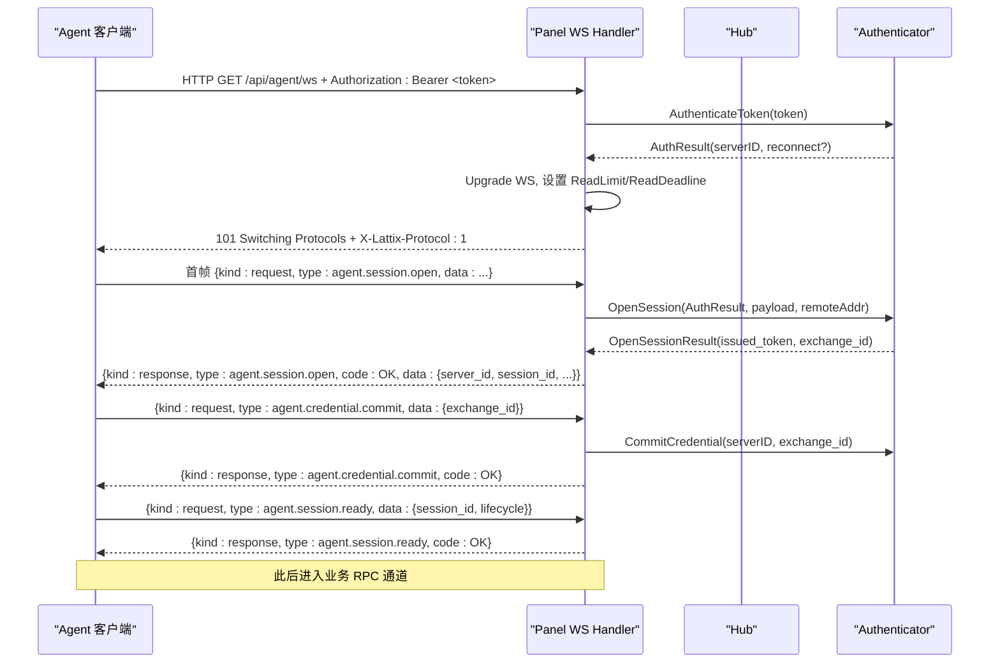
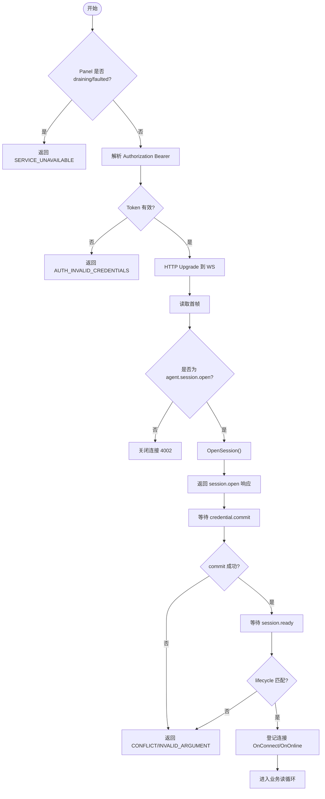
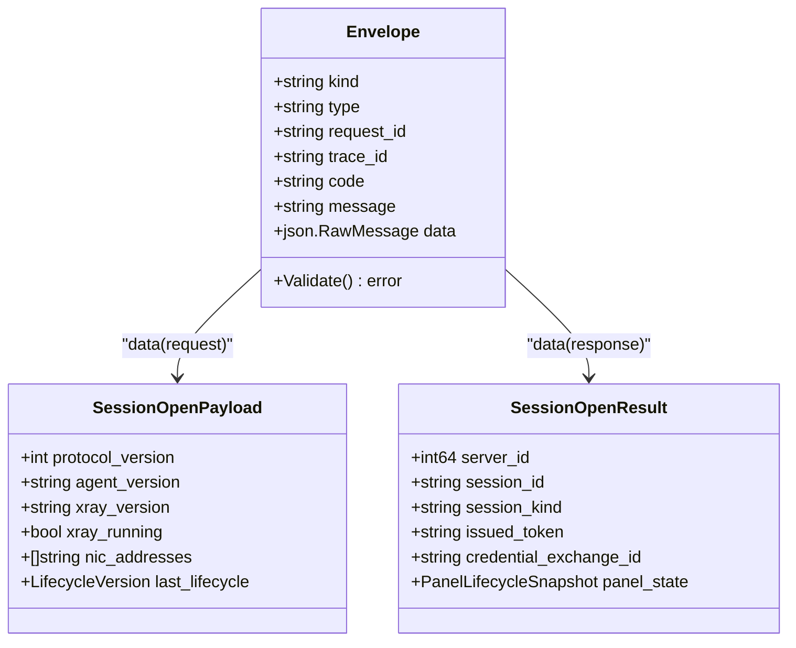
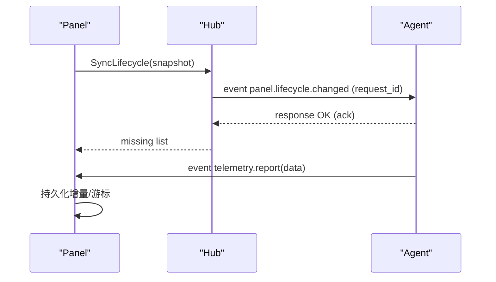
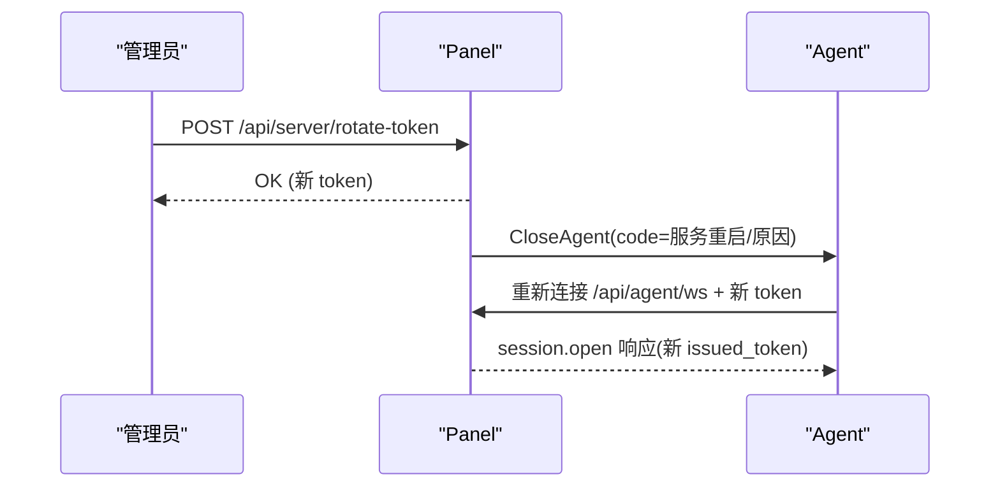
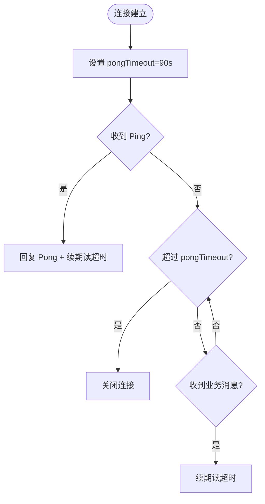
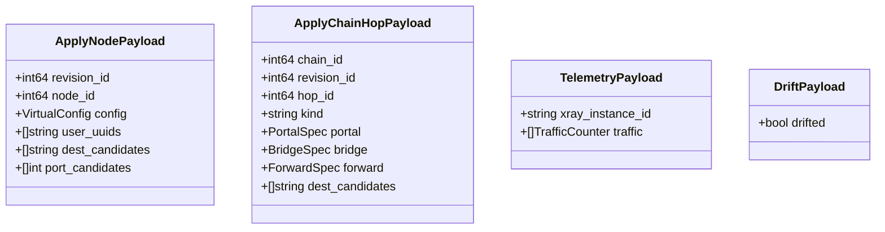
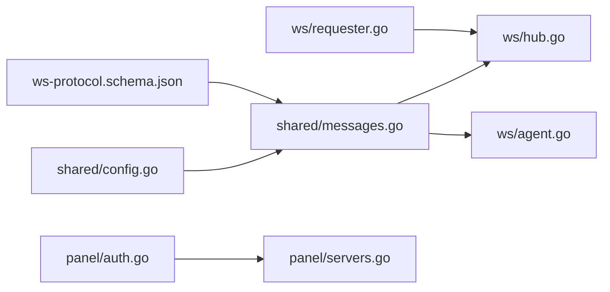

# 通信协议规范

<cite>
**本文引用的文件**   
- [ws-protocol.schema.json](file://docs/ws-protocol.schema.json)
- [rpc-api-design.md](file://docs/rpc-api-design.md)
- [messages.go](file://src/shared/messages.go)
- [hub.go](file://src/backend/internal/ws/hub.go)
- [agent.go](file://src/backend/internal/ws/agent.go)
- [requester.go](file://src/backend/internal/ws/requester.go)
- [config.go](file://src/shared/config.go)
- [auth.go](file://src/backend/internal/panel/auth.go)
- [servers.go](file://src/backend/internal/panel/servers.go)
</cite>

## 目录
1. [简介](#简介)
2. [项目结构](#项目结构)
3. [核心组件](#核心组件)
4. [架构总览](#架构总览)
5. [详细组件分析](#详细组件分析)
6. [依赖关系分析](#依赖关系分析)
7. [性能与可靠性](#性能与可靠性)
8. [故障排查指南](#故障排查指南)
9. [结论](#结论)
10. [附录：JSON Schema、API 端点与错误码](#附录json-schemaapi-端点与错误码)

## 简介
本规范定义 Lattix Panel 与 Agent 之间的 WebSocket 控制通道协议，包括连接建立、消息信封格式、事件类型、错误码、RPC 调用约定、认证流程（Bootstrap Token 生命周期与轮换）、心跳保活与重连策略，并提供 JSON Schema、API 端点列表与客户端集成调试建议。该协议面向 Panel ↔ Agent 的带外管理通道，不用于业务数据面传输。

## 项目结构
- 协议契约与文档
  - docs/ws-protocol.schema.json：WebSocket RPC 信封与载荷的 JSON Schema
  - docs/rpc-api-design.md：HTTP 管理 API 与 WS 协议的总体设计
- 共享协议类型
  - src/shared/messages.go：统一信封 Envelope、RPC 类型与结果码、遥测与配置漂移等载荷
  - src/shared/config.go：虚拟/实际配置模板占位符、协议与传输常量
- Panel 侧实现
  - src/backend/internal/ws/hub.go：Hub 连接注册表、发送队列、状态快照、生命周期同步
  - src/backend/internal/ws/agent.go：WS 握手、认证、会话建立、读循环、Ping/Pong
  - src/backend/internal/ws/requester.go：AgentRequester 接口与错误定义
  - src/backend/internal/panel/auth.go：Panel 登录与会话、CSRF
  - src/backend/internal/panel/servers.go：服务器信息、连接状态展示
- 前端与脚本
  - scripts/dev-e2e-install-agent.sh：安装与 Bootstrap Token 使用示例

**图表来源** 
- [hub.go:25-55](file://src/backend/internal/ws/hub.go#L25-L55)
- [agent.go:31-79](file://src/backend/internal/ws/agent.go#L31-L79)
- [requester.go:18-43](file://src/backend/internal/ws/requester.go#L18-L43)
- [messages.go:13-22](file://src/shared/messages.go#L13-L22)
- [ws-protocol.schema.json:106-132](file://docs/ws-protocol.schema.json#L106-L132)
- [config.go:170-206](file://src/shared/config.go#L170-L206)

**章节来源**
- [rpc-api-design.md:1-40](file://docs/rpc-api-design.md#L1-L40)
- [ws-protocol.schema.json:1-12](file://docs/ws-protocol.schema.json#L1-L12)

## 核心组件
- 统一信封 Envelope
  - kind：request/response/event
  - type：domain.action 命名空间
  - request_id/trace_id：32 位十六进制随机 ID
  - code/message：仅 response 携带
  - data：具体动作载荷
- Hub
  - 维护 Agent 连接映射、在线状态、发送缓冲、优雅关停 drain
  - 提供 Send/IsOnline/SyncLifecycle/CloseAllAgents 等方法
- Agent HTTP Handler
  - 校验 Authorization Bearer、Upgrade、首帧 agent.session.open、credential.commit、session.ready
  - 设置 Ping/Pong 超时、读超时续期、协议错误上报
- Authenticator 接口
  - AuthenticateToken/OpenSession/CommitCredential 由上层实现（例如基于数据库或内存）
- 共享配置与类型
  - VirtualConfig/RealizedConfig、TelemetryPayload、DriftPayload、链式 Hop 载荷等

**章节来源**
- [messages.go:13-22](file://src/shared/messages.go#L13-L22)
- [messages.go:47-91](file://src/shared/messages.go#L47-L91)
- [hub.go:25-55](file://src/backend/internal/ws/hub.go#L25-L55)
- [agent.go:31-79](file://src/backend/internal/ws/agent.go#L31-L79)
- [requester.go:18-43](file://src/backend/internal/ws/requester.go#L18-L43)
- [config.go:170-206](file://src/shared/config.go#L170-L206)

## 架构总览
Panel 作为服务端被动接受 Agent 的 WebSocket 连接，所有业务命令由 Panel 主动下发；Agent 通过事件上报遥测、漂移检测等。握手阶段完成身份验证与临时令牌交换，随后进入稳定的 RPC 通道。

**图表来源** 
- [agent.go:31-129](file://src/backend/internal/ws/agent.go#L31-L129)
- [requester.go:36-43](file://src/backend/internal/ws/requester.go#L36-L43)
- [ws-protocol.schema.json:133-179](file://docs/ws-protocol.schema.json#L133-L179)

## 详细组件分析

### WebSocket 连接建立与认证
- 升级前鉴权
  - 要求 Authorization: Bearer <token>
  - 若 Panel 处于 draining/faulted，直接拒绝并返回错误信封
- 首次应用帧
  - 必须为 agent.session.open，包含 protocol_version、agent/xray 版本、网卡地址、上次生命周期版本等
- 会话打开响应
  - 返回 server_id、session_id、session_kind、issued_token、credential_exchange_id、panel_state
- 凭证提交与就绪
  - agent.credential.commit：提交交换 ID，成功后允许后续操作
  - agent.session.ready：确认 session_id 与当前 panel lifecycle 一致后，登记连接

**图表来源** 
- [agent.go:31-129](file://src/backend/internal/ws/agent.go#L31-L129)
- [agent.go:157-197](file://src/backend/internal/ws/agent.go#L157-L197)
- [hub.go:231-249](file://src/backend/internal/ws/hub.go#L231-L249)

**章节来源**
- [agent.go:31-129](file://src/backend/internal/ws/agent.go#L31-L129)
- [agent.go:157-197](file://src/backend/internal/ws/agent.go#L157-L197)
- [hub.go:231-249](file://src/backend/internal/ws/hub.go#L231-L249)

### 消息信封与 RPC 调用规范
- 信封字段
  - kind：request/response/event
  - type：domain.action（小写字母开头，支持层级）
  - request_id/trace_id：32 位十六进制
  - code/message：仅 response 携带
  - data：按动作定义的 JSON 对象
- 请求/响应/事件约束
  - response 必须包含 code/message/data
  - request/event 不得包含 code/message
  - 未知 type 返回 UNSUPPORTED_ACTION，不断开连接
- 方法命名约定
  - 使用 domain.action 形式，如 node.apply、user.add、chain-hop.apply
- 参数验证
  - 严格反序列化，禁止未知字段
  - 必填字段缺失或值越界返回 INVALID_ARGUMENT
- 响应格式
  - 成功：code=OK，data 为动作定义的结构
  - 失败：code 为领域错误码，message 描述原因

**图表来源** 
- [messages.go:13-22](file://src/shared/messages.go#L13-L22)
- [ws-protocol.schema.json:133-179](file://docs/ws-protocol.schema.json#L133-L179)

**章节来源**
- [messages.go:13-22](file://src/shared/messages.go#L13-L22)
- [messages.go:111-137](file://src/shared/messages.go#L111-L137)
- [ws-protocol.schema.json:106-132](file://docs/ws-protocol.schema.json#L106-L132)

### 事件类型与遥测
- 面板生命周期变更：panel.lifecycle.changed（Panel→Agent）
- Agent 设置同步：agent.settings.sync（Panel→Agent），返回 changed/settings
- Agent 设置变更事件：agent.settings.changed（Agent→Panel）
- 遥测上报：telemetry.report（Agent→Panel），含主机指标与流量计数器
- 配置漂移：config.drift（Agent→Panel）

**图表来源** 
- [hub.go:320-378](file://src/backend/internal/ws/hub.go#L320-L378)
- [messages.go:195-232](file://src/shared/messages.go#L195-L232)
- [ws-protocol.schema.json:317-333](file://docs/ws-protocol.schema.json#L317-L333)

**章节来源**
- [hub.go:320-378](file://src/backend/internal/ws/hub.go#L320-L378)
- [messages.go:195-232](file://src/shared/messages.go#L195-L232)
- [ws-protocol.schema.json:317-333](file://docs/ws-protocol.schema.json#L317-L333)

### 认证流程与 Bootstrap Token
- 初始接入
  - Agent 通过 /api/agent/ws 携带 Authorization: Bearer <bootstrap_token>
  - Panel 调用 Authenticator.AuthenticateToken 校验并返回 serverID、reconnect 提示
- 会话打开
  - Panel 返回 issued_token（短期会话令牌）与 credential_exchange_id
- 凭证提交
  - Agent 调用 agent.credential.commit 提交 exchange_id，成功后进入可操作状态
- Token 轮换
  - 管理员可通过 /api/server/rotate-token 触发轮换
  - Panel 可主动 CloseAgent/CloseAllAgents 强制断开旧连接，促使 Agent 重新认证

**图表来源** 
- [agent.go:195-216](file://src/backend/internal/ws/agent.go#L195-L216)
- [hub.go:195-228](file://src/backend/internal/ws/hub.go#L195-L228)
- [servers.go:100-140](file://src/backend/internal/panel/servers.go#L100-L140)

**章节来源**
- [agent.go:195-216](file://src/backend/internal/ws/agent.go#L195-L216)
- [hub.go:195-228](file://src/backend/internal/ws/hub.go#L195-L228)
- [servers.go:100-140](file://src/backend/internal/panel/servers.go#L100-L140)

### 心跳与保活机制
- Ping/Pong
  - Agent 主动发送 WS Ping；Panel 原样 Pong，并以收到的控制帧续期读超时
  - 默认 pongTimeout=90s；writeTimeout=10s
- 读超时续期
  - 任何消息到达即续期读超时，避免空闲连接被误判离线
- 慢连接处理
  - 发送队列满（sendBuffer=256）时断开连接，重连后补发 queued 命令
- 重连策略
  - Agent 侧根据 settings.reconnect.mode（infinite/limited）与 max_retries 执行
  - Panel 在 draining 状态下以 RFC 6455 code 1012 断开，引导快速重试路径

**图表来源** 
- [hub.go:16-23](file://src/backend/internal/ws/hub.go#L16-L23)
- [agent.go:102-111](file://src/backend/internal/ws/agent.go#L102-L111)
- [ws-protocol.schema.json:13-21](file://docs/ws-protocol.schema.json#L13-L21)

**章节来源**
- [hub.go:16-23](file://src/backend/internal/ws/hub.go#L16-L23)
- [agent.go:102-111](file://src/backend/internal/ws/agent.go#L102-L111)
- [ws-protocol.schema.json:13-21](file://docs/ws-protocol.schema.json#L13-L21)

### 配置与链路（Chain）相关
- 节点配置 apply/remove
  - node.apply/node.remove：虚拟配置模板 + 用户 UUID 列表
- 用户热增删
  - user.add/user.remove：按节点 inbound 协议构造 account
- 链式 Hop
  - chain-hop.apply/remove：portal/bridge/forward 三种 hop 规格
- 遥测与漂移
  - telemetry.report：主机指标与流量计数器
  - config.drift：外部修改配置文件时上报

**图表来源** 
- [messages.go:139-194](file://src/shared/messages.go#L139-L194)
- [messages.go:255-312](file://src/shared/messages.go#L255-L312)
- [messages.go:195-238](file://src/shared/messages.go#L195-L238)

**章节来源**
- [messages.go:139-194](file://src/shared/messages.go#L139-L194)
- [messages.go:255-312](file://src/shared/messages.go#L255-L312)
- [messages.go:195-238](file://src/shared/messages.go#L195-L238)

## 依赖关系分析
- Hub 依赖 shared.Envelope 与 shared 常量
- Agent Handler 依赖 Authenticator/LifecycleProvider 接口
- Panel 管理 API 与 WS 协议共用错误码与信封语义
- JSON Schema 作为契约事实来源，Go struct 与测试保证一致性

**图表来源** 
- [messages.go:13-22](file://src/shared/messages.go#L13-L22)
- [config.go:170-206](file://src/shared/config.go#L170-L206)
- [ws-protocol.schema.json:106-132](file://docs/ws-protocol.schema.json#L106-L132)
- [requester.go:18-43](file://src/backend/internal/ws/requester.go#L18-L43)
- [auth.go:81-145](file://src/backend/internal/panel/auth.go#L81-L145)
- [servers.go:100-140](file://src/backend/internal/panel/servers.go#L100-L140)

**章节来源**
- [messages.go:13-22](file://src/shared/messages.go#L13-L22)
- [config.go:170-206](file://src/shared/config.go#L170-L206)
- [ws-protocol.schema.json:106-132](file://docs/ws-protocol.schema.json#L106-L132)
- [requester.go:18-43](file://src/backend/internal/ws/requester.go#L18-L43)
- [auth.go:81-145](file://src/backend/internal/panel/auth.go#L81-L145)
- [servers.go:100-140](file://src/backend/internal/panel/servers.go#L100-L140)

## 性能与可靠性
- 写超时与缓冲
  - writeTimeout=10s；每连接 sendBuffer=256，满则断线重连
- 读超时与心跳
  - pongTimeoutDefault=90s；任何消息到达续期
- 优雅关停
  - BeginDrain 拒绝新工作，RFC 6455 code 1012 断开所有 Agent
- 幂等与去重
  - 遥测计数器天然幂等；HTTP 管理 API 支持 Idempotency-Key

[本节为通用指导，无需特定文件引用]

## 故障排查指南
- 握手失败
  - 检查 Authorization Bearer 是否正确；Panel 是否处于 draining/faulted
  - 首帧是否为 agent.session.open，且 data 合法
- 认证失败
  - 检查 bootstrap_token 是否有效；必要时 rotate-token
- 连接频繁断开
  - 检查网络延迟与丢包；确认 Agent 侧 reconnect 策略
  - 观察 Panel 日志中的 protocolError 回调
- 命令未生效
  - 检查 session.ready 是否成功；确认 lifecycle 版本一致
  - 查看 hub.SyncLifecycle 返回的 missing 列表

**章节来源**
- [agent.go:287-300](file://src/backend/internal/ws/agent.go#L287-L300)
- [hub.go:156-173](file://src/backend/internal/ws/hub.go#L156-L173)
- [hub.go:320-378](file://src/backend/internal/ws/hub.go#L320-L378)

## 结论
本协议以统一信封为核心，结合严格的 JSON Schema 与 Go 类型约束，确保 Panel 与 Agent 间控制通道的稳定与可观测性。通过 Bootstrap Token 与短期 issued_token 的组合，实现了安全的初始接入与灵活的轮换策略。心跳与超时机制保障连接健康，Hub 的缓冲与优雅关停提升系统韧性。

[本节为总结，无需特定文件引用]

## 附录：JSON Schema、API 端点与错误码

### JSON Schema 要点
- 信封必需字段：kind、type、request_id、trace_id、data
- 响应必需字段：code、message
- 动作限定：agent.session.open、agent.credential.commit、agent.session.ready、panel.lifecycle.changed、agent.settings.sync/changed、telemetry.report、chain-hop.apply 等
- 字段校验：pattern、enum、required、oneOf 等

**章节来源**
- [ws-protocol.schema.json:106-132](file://docs/ws-protocol.schema.json#L106-L132)
- [ws-protocol.schema.json:133-353](file://docs/ws-protocol.schema.json#L133-L353)

### API 端点（管理 HTTP）
- 认证与会话
  - POST /api/auth/login
  - POST /api/auth/logout
  - GET /api/auth/me
- 服务器管理
  - GET /api/server/list
  - POST /api/server/create
  - POST /api/server/update
  - POST /api/server/delete
  - POST /api/server/rotate-token
  - POST /api/server/repair
  - POST /api/server/upgrade-xray
  - POST /api/server/upgrade-agent
- 节点/用户/链
  - /api/node/*、/api/user/*、/api/chain/*
- 面板设置与更新
  - /api/setting/*、/api/panel/*
- 备份与日志
  - /api/backup/download
  - /api/log/*
- 健康检查
  - GET /healthz
  - GET /readyz
- WebSocket
  - GET /api/agent/ws

**章节来源**
- [rpc-api-design.md:143-209](file://docs/rpc-api-design.md#L143-L209)

### 错误码（WS/HTTP 共用）
- OK、ACCEPTED、AUTH_REQUIRED、AUTH_INVALID_CREDENTIALS、INVALID_ARGUMENT、NOT_FOUND、CONFLICT、OPERATION_LOCKED、UNSUPPORTED_ACTION、INTERNAL_ERROR、UPSTREAM_ERROR、SERVICE_UNAVAILABLE、SERVER_OFFLINE、PORT_OUT_OF_RANGE、UPDATE_IN_PROGRESS

**章节来源**
- [messages.go:54-70](file://src/shared/messages.go#L54-L70)
- [rpc-api-design.md:103-122](file://docs/rpc-api-design.md#L103-L122)

### 客户端集成指南与调试技巧
- 连接建立
  - 使用 Bearer token 发起 /api/agent/ws；设置合理的 read/write 超时
  - 首帧必须为 agent.session.open，包含协议版本与必要元数据
- 会话就绪
  - 先提交 agent.credential.commit，再发送 agent.session.ready
- 心跳与重连
  - 保持 WS Ping/Pong；根据 settings.reconnect 配置实施指数退避
- 调试
  - 启用 Panel 的 OnProtocolError 回调记录协议错误
  - 使用 request_id/trace_id 追踪请求链路
  - 通过 /api/server/list-commands 查看 Agent 命令历史

**章节来源**
- [agent.go:31-129](file://src/backend/internal/ws/agent.go#L31-L129)
- [hub.go:287-300](file://src/backend/internal/ws/hub.go#L287-L300)
- [servers.go:100-140](file://src/backend/internal/panel/servers.go#L100-L140)