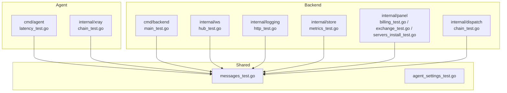
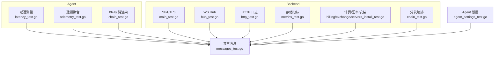
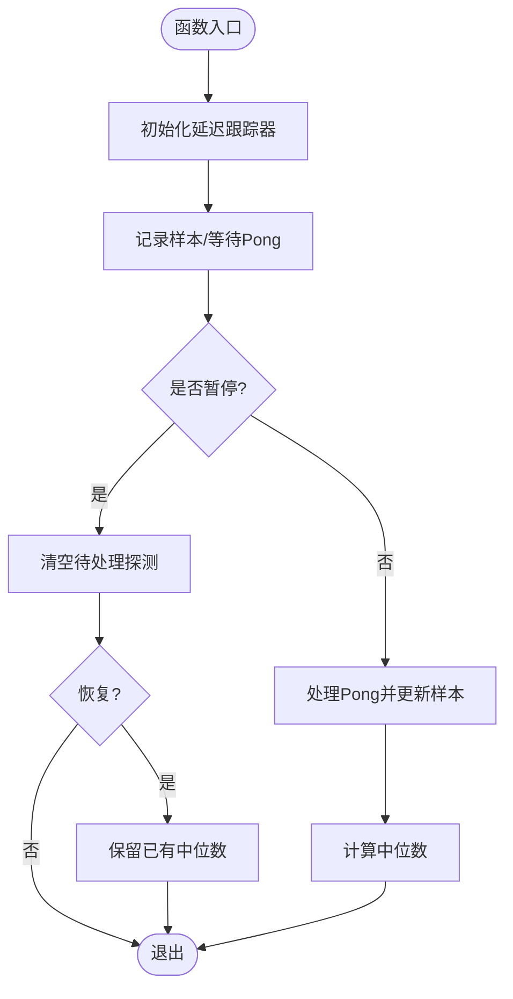
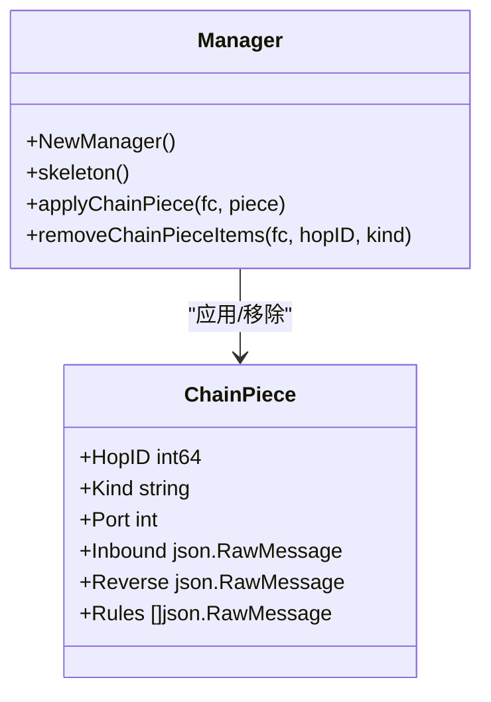
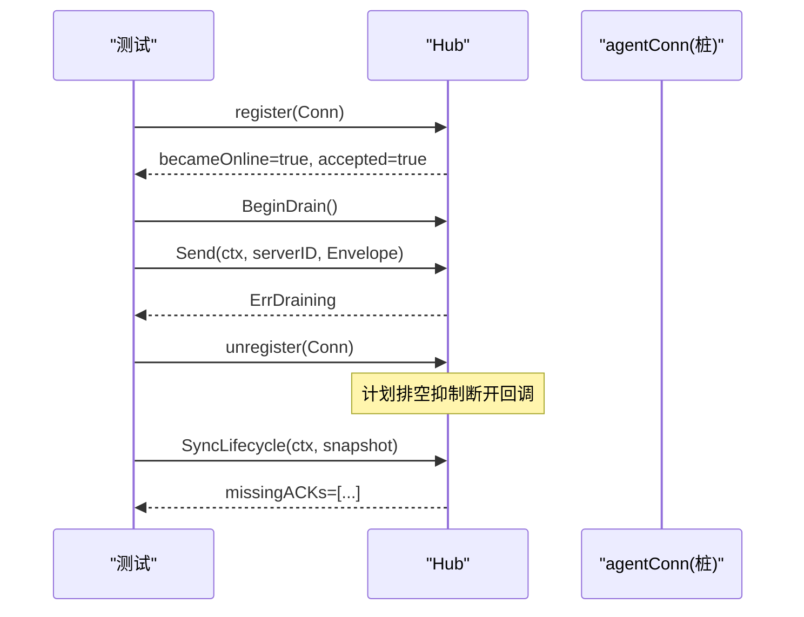
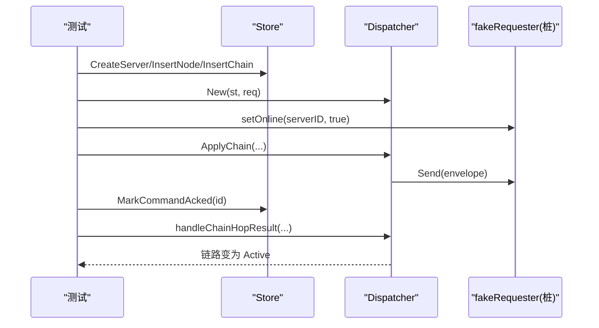
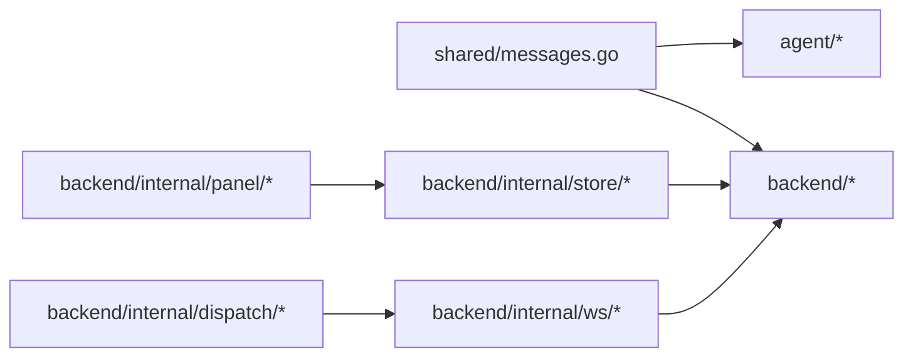

# 单元测试

<cite>
**本文引用的文件**   
- [src/agent/cmd/agent/latency_test.go](file://src/agent/cmd/agent/latency_test.go)
- [src/agent/cmd/agent/telemetry_test.go](file://src/agent/cmd/agent/telemetry_test.go)
- [src/agent/internal/xray/chain_test.go](file://src/agent/internal/xray/chain_test.go)
- [src/backend/cmd/backend/main_test.go](file://src/backend/cmd/backend/main_test.go)
- [src/backend/internal/panel/billing_test.go](file://src/backend/internal/panel/billing_test.go)
- [src/backend/internal/panel/exchange_test.go](file://src/backend/internal/panel/exchange_test.go)
- [src/backend/internal/panel/servers_install_test.go](file://src/backend/internal/panel/servers_install_test.go)
- [src/backend/internal/ws/hub_test.go](file://src/backend/internal/ws/hub_test.go)
- [src/backend/internal/logging/http_test.go](file://src/backend/internal/logging/http_test.go)
- [src/backend/internal/store/metrics_test.go](file://src/backend/internal/store/metrics_test.go)
- [src/backend/internal/store/chain_traffic_test.go](file://src/backend/internal/store/chain_traffic_test.go)
- [src/backend/internal/dispatch/chain_test.go](file://src/backend/internal/dispatch/chain_test.go)
- [src/shared/messages_test.go](file://src/shared/messages_test.go)
- [src/shared/agent_settings_test.go](file://src/shared/agent_settings_test.go)
</cite>

## 目录
1. [简介](#简介)
2. [项目结构](#项目结构)
3. [核心组件](#核心组件)
4. [架构总览](#架构总览)
5. [详细组件分析](#详细组件分析)
6. [依赖分析](#依赖分析)
7. [性能考虑](#性能考虑)
8. [故障排查指南](#故障排查指南)
9. [结论](#结论)
10. [附录](#附录)

## 简介
本文件面向 Lattix-codex 项目的 Go 语言单元测试，系统阐述测试框架使用与最佳实践，覆盖后端服务、Agent 程序、共享模块的测试方法；说明测试文件组织与命名规范、用例编写方式、模拟与桩函数的使用；给出 HTTP API、数据库操作、WebSocket 通信等复杂场景的测试策略；并提供覆盖率要求与报告生成方法。文档中包含计费系统、汇率转换、服务器安装命令、延迟测量、遥测数据聚合等具体示例，并说明测试数据准备、环境隔离与清理策略。

## 项目结构
仓库采用多模块（go.work）组织，测试按模块与功能域划分：
- Agent 模块：位于 src/agent，包含命令行入口与内部子系统（xray、selfupdate 等），测试文件以 _test.go 结尾，与源码同包或相邻包。
- Backend 模块：位于 src/backend，包含面板服务、WS Hub、日志、存储、调度等，测试覆盖 HTTP、WS、Store、Panel 逻辑。
- Shared 模块：位于 src/shared，提供跨进程消息、配置与协议定义，测试集中在消息编解码与校验。

图表来源
- [src/agent/cmd/agent/latency_test.go:1-60](file://src/agent/cmd/agent/latency_test.go#L1-L60)
- [src/agent/internal/xray/chain_test.go:1-262](file://src/agent/internal/xray/chain_test.go#L1-L262)
- [src/backend/cmd/backend/main_test.go:1-44](file://src/backend/cmd/backend/main_test.go#L1-L44)
- [src/backend/internal/ws/hub_test.go:1-149](file://src/backend/internal/ws/hub_test.go#L1-L149)
- [src/backend/internal/logging/http_test.go:1-87](file://src/backend/internal/logging/http_test.go#L1-L87)
- [src/backend/internal/store/metrics_test.go:1-83](file://src/backend/internal/store/metrics_test.go#L1-L83)
- [src/backend/internal/panel/billing_test.go:1-49](file://src/backend/internal/panel/billing_test.go#L1-L49)
- [src/backend/internal/panel/exchange_test.go:1-183](file://src/backend/internal/panel/exchange_test.go#L1-L183)
- [src/backend/internal/panel/servers_install_test.go:1-32](file://src/backend/internal/panel/servers_install_test.go#L1-L32)
- [src/backend/internal/dispatch/chain_test.go:1-149](file://src/backend/internal/dispatch/chain_test.go#L1-L149)
- [src/shared/messages_test.go:1-49](file://src/shared/messages_test.go#L1-L49)
- [src/shared/agent_settings_test.go:1-27](file://src/shared/agent_settings_test.go#L1-L27)

章节来源
- [src/agent/cmd/agent/latency_test.go:1-60](file://src/agent/cmd/agent/latency_test.go#L1-L60)
- [src/backend/cmd/backend/main_test.go:1-44](file://src/backend/cmd/backend/main_test.go#L1-L44)
- [src/backend/internal/ws/hub_test.go:1-149](file://src/backend/internal/ws/hub_test.go#L1-L149)
- [src/backend/internal/logging/http_test.go:1-87](file://src/backend/internal/logging/http_test.go#L1-L87)
- [src/backend/internal/store/metrics_test.go:1-83](file://src/backend/internal/store/metrics_test.go#L1-L83)
- [src/backend/internal/panel/billing_test.go:1-49](file://src/backend/internal/panel/billing_test.go#L1-L49)
- [src/backend/internal/panel/exchange_test.go:1-183](file://src/backend/internal/panel/exchange_test.go#L1-L183)
- [src/backend/internal/panel/servers_install_test.go:1-32](file://src/backend/internal/panel/servers_install_test.go#L1-L32)
- [src/backend/internal/dispatch/chain_test.go:1-149](file://src/backend/internal/dispatch/chain_test.go#L1-L149)
- [src/shared/messages_test.go:1-49](file://src/shared/messages_test.go#L1-L49)
- [src/shared/agent_settings_test.go:1-27](file://src/shared/agent_settings_test.go#L1-L27)

## 核心组件
- 延迟测量（Agent）：验证中位数计算、Pong 初始化与记录、暂停恢复行为。
- 遥测聚合（Agent）：流量计数器聚合规则与分组。
- XRay 链渲染（Agent）：Inbound/Outbound/Forward 片段渲染与合并、移除、端口选择。
- SPA 静态资源与默认 TLS 目录（Backend）：资源回退与路径处理。
- WebSocket Hub（Backend）：连接注册、下线排空、生命周期同步、离线/重连回调。
- HTTP 请求日志（Backend）：参数脱敏、路径哈希、中间件记录策略。
- 存储指标（Backend Store）：写入、查询、历史清理。
- 计费状态与流量周期（Backend Panel）：状态机、周期锚点、用量统计模式。
- 汇率转换（Backend Panel）：公开汇率、自定义锚点、货币精度与汇总。
- 服务器安装命令（Backend Panel）：统一入口脚本、版本参数控制。
- 分发编排（Backend Dispatch）：单跳/多跳链路下发、ACK 推进、在线判定。
- 共享消息（Shared）：Envelope 编解码分离、校验。
- Agent 设置（Shared）：默认值与边界校验。

章节来源
- [src/agent/cmd/agent/latency_test.go:1-60](file://src/agent/cmd/agent/latency_test.go#L1-L60)
- [src/agent/cmd/agent/telemetry_test.go:1-31](file://src/agent/cmd/agent/telemetry_test.go#L1-L31)
- [src/agent/internal/xray/chain_test.go:1-262](file://src/agent/internal/xray/chain_test.go#L1-L262)
- [src/backend/cmd/backend/main_test.go:1-44](file://src/backend/cmd/backend/main_test.go#L1-L44)
- [src/backend/internal/ws/hub_test.go:1-149](file://src/backend/internal/ws/hub_test.go#L1-L149)
- [src/backend/internal/logging/http_test.go:1-87](file://src/backend/internal/logging/http_test.go#L1-L87)
- [src/backend/internal/store/metrics_test.go:1-83](file://src/backend/internal/store/metrics_test.go#L1-L83)
- [src/backend/internal/panel/billing_test.go:1-49](file://src/backend/internal/panel/billing_test.go#L1-L49)
- [src/backend/internal/panel/exchange_test.go:1-183](file://src/backend/internal/panel/exchange_test.go#L1-L183)
- [src/backend/internal/panel/servers_install_test.go:1-32](file://src/backend/internal/panel/servers_install_test.go#L1-L32)
- [src/backend/internal/dispatch/chain_test.go:1-149](file://src/backend/internal/dispatch/chain_test.go#L1-L149)
- [src/shared/messages_test.go:1-49](file://src/shared/messages_test.go#L1-L49)
- [src/shared/agent_settings_test.go:1-27](file://src/shared/agent_settings_test.go#L1-L27)

## 架构总览
下图展示各模块测试如何围绕共享消息与存储进行交互，以及 WS Hub 在 Agent 与 Backend 之间的协调作用。

图表来源
- [src/agent/cmd/agent/latency_test.go:1-60](file://src/agent/cmd/agent/latency_test.go#L1-L60)
- [src/agent/cmd/agent/telemetry_test.go:1-31](file://src/agent/cmd/agent/telemetry_test.go#L1-L31)
- [src/agent/internal/xray/chain_test.go:1-262](file://src/agent/internal/xray/chain_test.go#L1-L262)
- [src/backend/cmd/backend/main_test.go:1-44](file://src/backend/cmd/backend/main_test.go#L1-L44)
- [src/backend/internal/ws/hub_test.go:1-149](file://src/backend/internal/ws/hub_test.go#L1-L149)
- [src/backend/internal/logging/http_test.go:1-87](file://src/backend/internal/logging/http_test.go#L1-L87)
- [src/backend/internal/store/metrics_test.go:1-83](file://src/backend/internal/store/metrics_test.go#L1-L83)
- [src/backend/internal/panel/billing_test.go:1-49](file://src/backend/internal/panel/billing_test.go#L1-L49)
- [src/backend/internal/panel/exchange_test.go:1-183](file://src/backend/internal/panel/exchange_test.go#L1-L183)
- [src/backend/internal/panel/servers_install_test.go:1-32](file://src/backend/internal/panel/servers_install_test.go#L1-L32)
- [src/backend/internal/dispatch/chain_test.go:1-149](file://src/backend/internal/dispatch/chain_test.go#L1-L149)
- [src/shared/messages_test.go:1-49](file://src/shared/messages_test.go#L1-L49)
- [src/shared/agent_settings_test.go:1-27](file://src/shared/agent_settings_test.go#L1-L27)

## 详细组件分析

### 延迟测量（Agent）
- 目标：验证延迟样本的中位数计算、首次 Pong 初始化、暂停后保留样本与忽略迟到 Pong。
- 关键点：
  - 使用 t.TempDir 与时间控制构造样本。
  - 通过 handlePong 触发状态变更与 ready 通道。
  - 暂停时清空 pending，恢复后保持已有中位数。

图表来源
- [src/agent/cmd/agent/latency_test.go:1-60](file://src/agent/cmd/agent/latency_test.go#L1-L60)

章节来源
- [src/agent/cmd/agent/latency_test.go:1-60](file://src/agent/cmd/agent/latency_test.go#L1-L60)

### 遥测数据聚合（Agent）
- 目标：验证流量计数器按用户/节点/转发 hop 聚合的规则。
- 关键点：
  - 输入为原始计数器映射，输出为聚合后的计数列表。
  - 断言聚合数量与分组键（node/hop/user-id）。

章节来源
- [src/agent/cmd/agent/telemetry_test.go:1-31](file://src/agent/cmd/agent/telemetry_test.go#L1-L31)

### XRay 链渲染与合并（Agent）
- 目标：验证 Portal Inbound、Bridge Outbound、Forward Inbound 渲染字段；piece 合并幂等性、移除干净性、端口选择与冲突检测。
- 关键点：
  - 使用嵌套 map 断言 JSON 字段。
  - applyChainPiece/removeChainPieceItems 保证骨架 outbound 不受影响。
  - pickChainPort 支持复用已记录端口与候选全占用报错。

图表来源
- [src/agent/internal/xray/chain_test.go:1-262](file://src/agent/internal/xray/chain_test.go#L1-L262)

章节来源
- [src/agent/internal/xray/chain_test.go:1-262](file://src/agent/internal/xray/chain_test.go#L1-L262)

### SPA 静态资源与默认 TLS 目录（Backend）
- 目标：验证默认 TLS 目录基于 HOME、SPA Handler 对静态资源与回退 index.html 的处理。
- 关键点：
  - 使用 fstest.MapFS 注入虚拟文件系统。
  - httptest.NewRequest/Recorder 模拟 HTTP 请求与响应。

章节来源
- [src/backend/cmd/backend/main_test.go:1-44](file://src/backend/cmd/backend/main_test.go#L1-L44)

### WebSocket Hub（Backend）
- 目标：验证连接注册仅报告首次 offline→online、BeginDrain 拒绝发送并抑制断开回调、生命周期同步 ACK 超时、遗忘 Agent 清理快照、区分 online/reconnect 回调、重启后重连提示。
- 关键点：
  - 使用 inertAgentConn 构造无网络连接的桩。
  - OnDisconnect/OnOnline/OnReconnect 回调断言。
  - SyncLifecycle 使用 context.WithTimeout 验证超时缺失 ACK。

图表来源
- [src/backend/internal/ws/hub_test.go:1-149](file://src/backend/internal/ws/hub_test.go#L1-L149)

章节来源
- [src/backend/internal/ws/hub_test.go:1-149](file://src/backend/internal/ws/hub_test.go#L1-L149)

### HTTP 请求日志（Backend）
- 目标：验证参数脱敏与截断、订阅路径 token 哈希、中间件记录策略（排除日志读取接口）、IP 来源可信判断。
- 关键点：
  - safeParameters/safePath 对敏感信息进行脱敏与哈希。
  - RequestMiddleware 根据路由策略决定记录级别。
  - Tail 读取最近日志条目断言属性。

章节来源
- [src/backend/internal/logging/http_test.go:1-87](file://src/backend/internal/logging/http_test.go#L1-L87)

### 存储指标（Backend Store）
- 目标：验证 ServerMetrics 写入、最新快照、近期样本、历史查询与过期清理。
- 关键点：
  - 使用内存数据库 Open(":memory:") 快速隔离。
  - DeleteExpiredServerMetricHistory 按时间窗口清理。

章节来源
- [src/backend/internal/store/metrics_test.go:1-83](file://src/backend/internal/store/metrics_test.go#L1-L83)

### 计费状态与流量周期（Backend Panel）
- 目标：验证 billingStatus 状态机、trafficPeriod 月末锚点保持、trafficUsed 不同模式（outbound/bidirectional/max）。
- 关键点：
  - 表驱动用例覆盖多种日期与在线状态组合。
  - 固定时区确保日期边界稳定。

章节来源
- [src/backend/internal/panel/billing_test.go:1-49](file://src/backend/internal/panel/billing_test.go#L1-L49)

### 汇率转换（Backend Panel）
- 目标：验证公开汇率换算、自定义锚点优先级、零小数货币四舍五入、混合币种汇总与 pivot 切换。
- 关键点：
  - newExchangeTestServer 构建带 rates 的 Server。
  - UpsertCustomExchangeRate 唯一性与启用约束。
  - 多币种求和比较 publicTotal/customTotal。

章节来源
- [src/backend/internal/panel/exchange_test.go:1-183](file://src/backend/internal/panel/exchange_test.go#L1-L183)

### 服务器安装命令（Backend Panel）
- 目标：验证 installCommand 使用统一 GitHub 入口脚本、dev 模式不锁定版本、不包含 xray 版本参数。
- 关键点：
  - 字符串包含断言关键参数。
  - dev 分支默认 latest。

章节来源
- [src/backend/internal/panel/servers_install_test.go:1-32](file://src/backend/internal/panel/servers_install_test.go#L1-L32)

### 分发编排（Backend Dispatch）
- 目标：验证单跳链路激活、多跳链路下发与 ACK 推进、在线判定与错误返回。
- 关键点：
  - fakeRequester 作为桩捕获发送信封与在线状态。
  - ackHop 模拟回执推进编排。
  - 使用 t.TempDir 创建临时数据库隔离。

图表来源
- [src/backend/internal/dispatch/chain_test.go:1-149](file://src/backend/internal/dispatch/chain_test.go#L1-L149)

章节来源
- [src/backend/internal/dispatch/chain_test.go:1-149](file://src/backend/internal/dispatch/chain_test.go#L1-L149)

### 共享消息（Shared）
- 目标：验证 Envelope 序列化时请求与响应字段分离、Validate 校验 ID 格式。
- 关键点：
  - 断言请求不含 code/message，响应必须包含。
  - 非法 RequestID 被拒绝。

章节来源
- [src/shared/messages_test.go:1-49](file://src/shared/messages_test.go#L1-L49)

### Agent 设置（Shared）
- 目标：验证默认设置有效、边界值（最大重试次数、遥测间隔）校验失败。
- 关键点：
  - DefaultAgentSettings().Validate() 成功。
  - 超出范围的值触发错误。

章节来源
- [src/shared/agent_settings_test.go:1-27](file://src/shared/agent_settings_test.go#L1-L27)

## 依赖分析
- 模块耦合：
  - Agent 与 Shared 通过 Envelope 与配置类型解耦。
  - Backend 的 WS Hub、Panel、Store、Dispatch 均依赖 Shared 的消息与枚举。
  - Store 提供内存/文件数据库抽象，测试广泛使用 ":memory:" 实现隔离。
- 外部依赖：
  - net/http/httptest 用于 HTTP 与 SPA 测试。
  - testing/fstest 用于虚拟文件系统。
  - context 用于超时与取消控制。

图表来源
- [src/shared/messages_test.go:1-49](file://src/shared/messages_test.go#L1-L49)
- [src/backend/internal/store/metrics_test.go:1-83](file://src/backend/internal/store/metrics_test.go#L1-L83)
- [src/backend/internal/ws/hub_test.go:1-149](file://src/backend/internal/ws/hub_test.go#L1-L149)
- [src/backend/internal/panel/exchange_test.go:1-183](file://src/backend/internal/panel/exchange_test.go#L1-L183)
- [src/backend/internal/dispatch/chain_test.go:1-149](file://src/backend/internal/dispatch/chain_test.go#L1-L149)

章节来源
- [src/shared/messages_test.go:1-49](file://src/shared/messages_test.go#L1-L49)
- [src/backend/internal/store/metrics_test.go:1-83](file://src/backend/internal/store/metrics_test.go#L1-L83)
- [src/backend/internal/ws/hub_test.go:1-149](file://src/backend/internal/ws/hub_test.go#L1-L149)
- [src/backend/internal/panel/exchange_test.go:1-183](file://src/backend/internal/panel/exchange_test.go#L1-L183)
- [src/backend/internal/dispatch/chain_test.go:1-149](file://src/backend/internal/dispatch/chain_test.go#L1-L149)

## 性能考虑
- 使用内存数据库（":memory:"）减少 I/O 开销，提升测试速度。
- 避免真实网络调用，使用 httptest 与桩对象隔离外部依赖。
- 合理设置超时（context.WithTimeout）避免阻塞测试。
- 对大数据集（如历史指标）采用分页或限制采样数量。

## 故障排查指南
- 常见问题：
  - 并发竞争：确保使用互斥锁保护桩对象状态（如 fakeRequester）。
  - 资源泄漏：使用 t.Cleanup 或 defer 关闭数据库与监听器。
  - 环境变量：使用 t.Setenv 设置 HOME 等变量，避免污染全局环境。
  - 路径与权限：使用 t.TempDir 避免权限问题与路径冲突。
- 定位技巧：
  - 打印关键状态（如 Hub states、Store metrics map）。
  - 检查中间件记录项（Tail）确认脱敏与策略生效。
  - 断言错误类型（errors.Is）匹配预期（如 ErrDraining、ErrOffline）。

章节来源
- [src/backend/internal/dispatch/chain_test.go:1-149](file://src/backend/internal/dispatch/chain_test.go#L1-L149)
- [src/backend/internal/ws/hub_test.go:1-149](file://src/backend/internal/ws/hub_test.go#L1-L149)
- [src/backend/internal/logging/http_test.go:1-87](file://src/backend/internal/logging/http_test.go#L1-L87)

## 结论
本项目测试体系围绕 Go 标准库 testing 与 httptest 展开，结合内存数据库与桩对象实现高内聚、低耦合的单元与集成测试。通过表驱动用例、严格断言与环境隔离，覆盖了延迟测量、遥测聚合、XRay 链渲染、WS Hub、HTTP 日志、存储指标、计费与汇率、安装命令、分发编排等关键场景。建议持续完善覆盖率阈值与自动化报告，确保质量基线稳定。

## 附录

### 测试文件组织与命名规范
- 文件名：与源码同名并以 _test.go 结尾，置于相同包或相邻包。
- 包名：与源码一致，便于访问未导出函数与类型。
- 测试函数：以 TestXxx(t *testing.T) 命名，子用例使用 t.Run。

### 测试用例编写方法
- 表驱动用例：将输入/期望结果组织为切片，循环执行。
- 断言：使用 t.Fatalf/t.Errorf 输出详细信息。
- 并行：必要时使用 t.Parallel 提高吞吐，注意资源隔离。

### 模拟与桩函数
- HTTP：httptest.NewRequest/Recorder。
- 文件系统：testing/fstest.MapFS。
- 网络：自定义桩（如 fakeRequester、inertAgentConn）。
- 数据库：Open(":memory:") 或 t.TempDir 临时文件。

### 复杂场景测试策略
- HTTP API：构造请求、断言状态码与响应体、验证中间件行为。
- 数据库操作：使用内存库或临时文件，断言读写一致性与清理。
- WebSocket：构造桩连接，验证注册/注销、回调、超时与排空。

### 覆盖率要求与报告生成
- 覆盖率阈值：建议核心模块不低于 80%，关键路径不低于 90%。
- 生成报告：go test -coverprofile=coverage.out && go tool cover -html=coverage.out -o coverage.html。
- CI 集成：在流水线中收集覆盖率并上传至平台（如 Codecov）。

### 测试数据准备、环境隔离与清理
- 数据准备：表驱动用例、工厂函数（如 newExchangeTestServer）。
- 环境隔离：t.TempDir、t.Setenv、内存数据库。
- 清理策略：defer st.Close()、t.Cleanup、关闭监听器与文件句柄。

章节来源
- [src/backend/internal/panel/exchange_test.go:1-183](file://src/backend/internal/panel/exchange_test.go#L1-L183)
- [src/backend/cmd/backend/main_test.go:1-44](file://src/backend/cmd/backend/main_test.go#L1-L44)
- [src/backend/internal/store/metrics_test.go:1-83](file://src/backend/internal/store/metrics_test.go#L1-L83)
- [src/backend/internal/ws/hub_test.go:1-149](file://src/backend/internal/ws/hub_test.go#L1-L149)
- [src/backend/internal/logging/http_test.go:1-87](file://src/backend/internal/logging/http_test.go#L1-L87)
- [src/backend/internal/dispatch/chain_test.go:1-149](file://src/backend/internal/dispatch/chain_test.go#L1-L149)
- [src/shared/messages_test.go:1-49](file://src/shared/messages_test.go#L1-L49)
- [src/shared/agent_settings_test.go:1-27](file://src/shared/agent_settings_test.go#L1-L27)